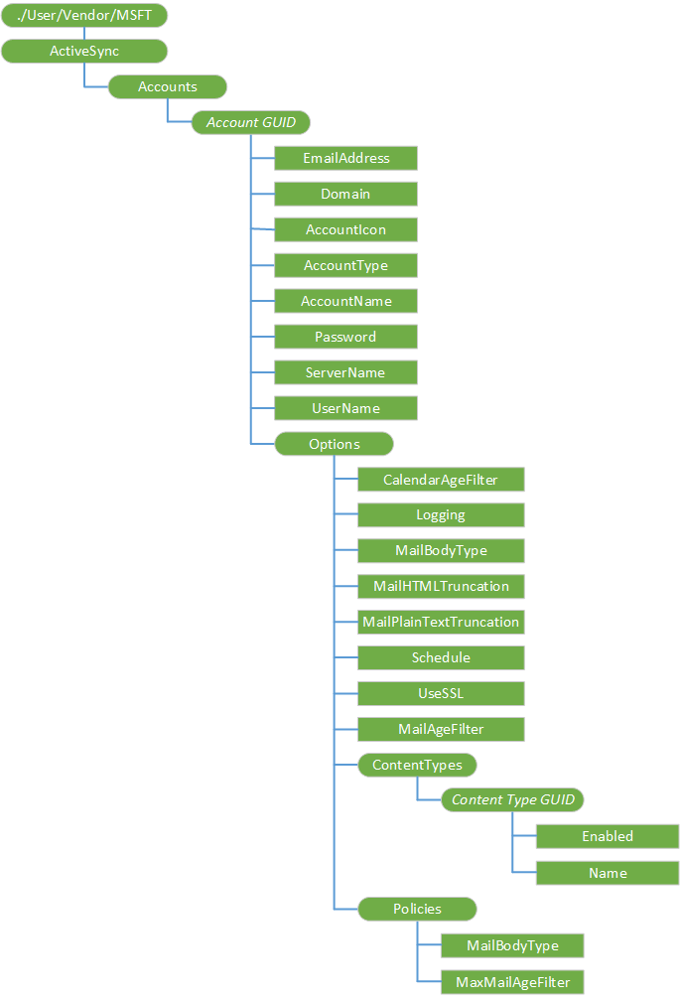

# <a name="activesync-csp"></a>动态同步 CSP


动态同步配置服务提供程序用于设置和更改 Exchange ActiveSync 的设置。 Exchange 帐户更新空中动态同步配置服务提供程序后，设备必须关闭电源，然后打开电源后要查看同步状态。

不支持配置此配置服务提供程序通过 Windows Live ActiveSync 帐户。

> **请注意**  
目标用户必须登录才能成功的 CSP 的。 配置帐户的正确方法是使用./User/Vendor/MSFT/ActiveSync 路径。

在桌面上，只能按照每个用户配置 (./User/Vendor/MSFT/ActiveSync) 支持。 但是，如果用户已登录，将工作./Vendor/MSFT/ActiveSync 路径。 当没有用户登录时，无法正常工作的 CSP。

./Vendor/MSFT/ActiveSync 路径已过时，但将继续在短期内起作用。

 

下图显示的动态同步配置服务提供程序管理对象以树格式由开放移动联盟设备管理 (OMA DM)，OMA 客户端资源调配和企业 DM。



<a href="" id="--user-vendor-msft-activesync"></a>**./User/Vendor/MSFT/ActiveSync**  
动态同步配置服务提供程序的根节点。

> **请注意**  
目标用户必须登录才能成功的 CSP 的。 配置帐户的正确方法是使用./User/Vendor/MSFT/ActiveSync 路径。

在桌面上，只能按照每个用户配置 (./User/Vendor/MSFT/ActiveSync) 支持。 但是，如果用户已登录在./Vendor/MSFT/ActiveSync 将起作用。 当没有用户登录时，无法正常工作的 CSP。

./Vendor/MSFT/ActiveSync 路径已过时，但将继续在短期内起作用。

 

受支持的操作是获得。

<a href="" id="accounts"></a>**帐户**  
根节点的动态同步的所有帐户。

受支持的操作是获得。

<a href="" id="account-guid"></a>***GUID 的帐户***  
定义特定的动态同步帐户。 必须为每个设备上的动态同步帐户生成全局唯一标识符 (GUID)。

支持的操作是 Get，添加和删除。

当管理超过 OMA DM，请确保始终使用一个唯一的 GUID。 资源调配现有删除现有帐户，并且不会创建新的帐户具有相同 GUID 的帐户。

要求使用大括号 {} GUID。 在 OMA 客户端资源调配，可以键入花括号。 例如︰

``` syntax
<characteristic type="{C556E16F-56C4-4EDB-9C64-D9469EE1FBE0}"/>
```

对于 OMA DM，您必须使用 7b%和 %7d 的 ASCII 值左和右大括号，分别。 例如，如果 GUID"C556E16F-56C4-4EDB-9C64-D9469EE1FBE0"，请键入︰

``` syntax
<Target>
   <LocURI>
      ./Vendor/MSFT/ActiveSync/Accounts/%7BC556E16F-56C4-4EDB-9C64-D9469EE1FBE0%7D
   </LocURI>
</Target>
```

<a href="" id="account-guid-emailaddress"></a>***GUID 的帐户*/EmailAddress**  
必需。 指定与 Exchange ActiveSync 帐户关联的电子邮件地址的字符串。

支持的操作是获取、 替换和添加 （无法添加后创建帐户）。

此电子邮件地址用户在安装过程中输入，并且必须是完全限定的电子邮件地址格式，例如，"someone@example.com"。

<a href="" id="account-guid-domain"></a>***帐户 GUID*/Domain**  
对于 Exchange 是可选的。 指定的 Exchange 服务器的域名。

支持的操作是 Get，替换，添加和删除。

<a href="" id="account-guid-accounticon"></a>***GUID 的帐户*/AccountIcon**  
必需。 字符的字符串，用于指定与该帐户相关联的图标的位置。

支持的操作是获取、 替换和添加 （无法添加后创建帐户）。

该帐户图标可作为平铺在**启动**列表中或在下的应用程序列表中的图标**设置&gt;电子邮件和帐户**。 在设备上已经提供了一些图标。 POP/IMAP 或一般的动态同步帐户的建议的图标位于 res://AccountSettingsSharedRes {*ScreenResolution*} ！ %s.genericmail.png。 对于 Exchange 帐户的建议的图标位于 res://AccountSettingsSharedRes {*ScreenResolution*} ！ %s.office.outlook.png。 如果需要，可以添加自定义的图标。

<a href="" id="account-guid-accounttype"></a>***GUID 的帐户*/AccountType**  
必需。 指定的帐户类型的字符串。

支持的操作包括获取和添加 （无法添加该帐户创建后）。

此值在安装过程中输入，并且不能一次输入修改。 "交换"的字符串值表示 Exchange 帐户。

<a href="" id="account-guid-accountname"></a>***GUID 的帐户*/AccountName**  
必需。 指定是指在设备上的帐户的名称的字符串。

支持的操作是获取、 替换和添加 （无法添加后创建帐户）。

<a href="" id="account-guid-password"></a>***GUID 的帐户*/Password**  
必需。 字符的字符串，用于指定帐户的密码。

支持的操作是 Get，替换，添加和删除。

Get 命令，返回只有星号。

<a href="" id="account-guid-servername"></a>***GUID 的帐户*/ServerName**  
必需。 指定的帐户使用的服务器名称的字符串。

支持的操作是获取、 替换和添加 （无法添加后创建帐户）。

<a href="" id="account-guid-username"></a>***GUID 的帐户*/UserName**  
必需。 指定的帐户的用户名的字符串。

支持的操作包括获取和添加 （无法添加该帐户创建后）。

同步已成功执行后不能更改用户名。 用户名可以是完全限定的格式"someone@example.com",或只是"用户名"，具体取决于帐户的类型创建。 对于大多数 Exchange 帐户，用户名称格式是不仅仅是"用户名"，而对于 Microsoft、 Google、 Yahoo 和大多数的 POP/IMAP 帐户，用户名称的格式是"someone@example.com".

<a href="" id="options"></a>**选项**  
其他参数的节点。

<a href="" id="options-calendaragefilter"></a>**选项/CalendarAgeFilter**  
指定用于同步到设备的日历项的时间窗口。 值类型是 chr。

<a href="" id="options-logging"></a>**日志记录选项 /**  
必需。 指定是否启用诊断日志记录，以及在哪个级别的字符串。 默认值为 0 （禁用）。

支持的操作是获取、 替换和添加 （无法添加后创建帐户）。

有效的值将为下列情况之一︰

-   0 （缺省值）-日志记录处于关闭状态。

-   1-基本的日志记录已启用。

-   2-高级日志记录已启用。

日志记录设置为默认是关闭的。 用户可能需要将其设置为基本或高级时遇到同步问题的客户支持部门正在研究。 将日志记录级别设置为高级都有更多的比基本性能的影响。

<a href="" id="options-mailbodytype"></a>**选项/MailBodyType**  
表示电子邮件格式。 有效值︰

-   0-无
-   1-文本
-   2-HTML
-   3-RTF 格式
-   4-MIME

<a href="" id="options-mailhtmltruncation"></a>**选项/MailHTMLTruncation**  
指定超过该 HTML 格式的电子邮件时将被截断这些记录将同步到移动设备的大小。 为指定的值，以 kb 为单位。 值为-1 则禁用截断。

<a href="" id="options-mailplaintexttruncation"></a>**选项/MailPlainTextTruncation**  
此设置指定之外，这些记录将同步到移动电话时会被截断的文本格式的电子邮件的大小。 为指定的值，以 kb 为单位。 值为-1 则禁用截断。

<a href="" id="options-usessl"></a>**选项/UseSSL**  
可选项。 字符的字符串，它指定是否使用 SSL。

支持的操作是获取、 替换和添加 （无法添加后创建帐户）。

有效值包括︰

-   0-不使用 SSL。

-   1 （缺省值）-使用 SSL。

<a href="" id="options-schedule"></a>**日程安排选项 /**  
必需。 字符的字符串，用于指定执行下一次同步时，以分钟为单位的时间。 默认值为-1。

支持的操作包括获取和替换。

有效的值将为下列情况之一︰

-   -1 （默认值） 的同步会接收到项目

-   0-所有同步，必须手动都执行

-   15-同步每隔 15 分钟

-   30-同步每隔 30 分钟

-   60-同步每隔 60 分钟

<a href="" id="options-mailagefilter"></a>**选项/MailAgeFilter**  
必需。 字符的字符串，它指定用于同步到设备的电子邮件项的时间窗口。 默认值为 3。

支持的操作包括获取和替换。

有效的值将为下列情况之一︰

-   0-使用无期限筛选器时，和所有电子邮件项目同步到设备。

-   2 – 仅电子邮件最多三天旧同步到设备。

-   3 （默认）-最旧的一周多的电子邮件同步到设备。

-   4 – 电子邮件最多的两个星期旧同步到设备。

-   5 – 一个月旧电子邮件同步到设备。

<a href="" id="options-contenttypes-content-type-guid"></a>**内容类型选项 / / ***_内容类型 GUID_**  
定义要单独启用/禁用同步的内容类型。

允许的*GUID*值是以下值之一︰

-   电子邮件:"{c6d47067-6e92-480e-b0fc-4ba82182fac7}"

-   联系人:"{0dd8685c-e272-4fcb-9ecf-2ead7ea2497b}"

-   日历:"{4a5d9fe0-f139-4a63-a5a4-4f31ceea02ad}"

-   任务:"{783ae4f6-4c12-4423-8270-66361260d4f1}"

<a href="" id="options-contenttypes-content-type-guid-enabled"></a>**内容类型选项 / /*内容类型 GUID*/ 启用 * *  
必需。 指定是否同步启用或禁用对所选内容类型的字符串。 默认值为 1 （启用）。

支持的操作是获取、 替换和添加 （无法添加后创建帐户）。

有效的值将为下列情况之一︰

-   0-禁用同步电子邮件、 联系人、 日历或任务。
-   1 （缺省值）-启用同步。

<a href="" id="options-contenttypes-content-type-guid-name"></a>**内容类型选项 / /*内容类型 GUID*/Name**  
必需。 指定的内容类型的名称的字符串。

> **请注意** Windows 10 中该节点当前不工作。

 

支持的操作是获取、 替换和添加 （无法添加后创建帐户）。

当您使用添加或替换在 SyncML 中原子块，CSP 返回错误和配置失败。 当您使用添加或替换超出原子的块中，该错误将被忽略并按预期的方式配置该帐户。

<a href="" id="policies"></a>**策略**  
邮件正文类型和电子邮件时代筛选的节点。

<a href="" id="policies-mailbodytype"></a>**策略/MailBodyType**  
必需。 指定电子邮件正文类型︰ HTML 或纯。

值类型是字符串。 支持的操作是添加 Get，替换和删除。

<a href="" id="policies-maxmailagefilter"></a>**策略/MaxMailAgeFilter**  
必需。 指定用于同步到设备的邮件项目的时间窗口。

值类型是字符串。 支持的操作是添加 Get，替换和删除。

## <a name="related-topics"></a>相关的主题


[配置服务提供程序的引用](configuration-service-provider-reference.md)

 

 


