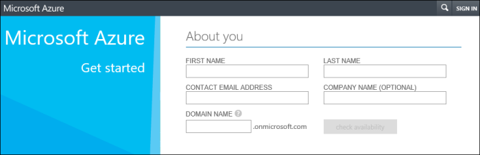
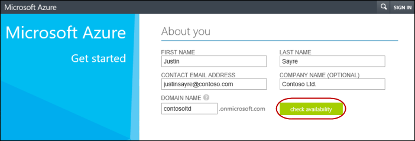
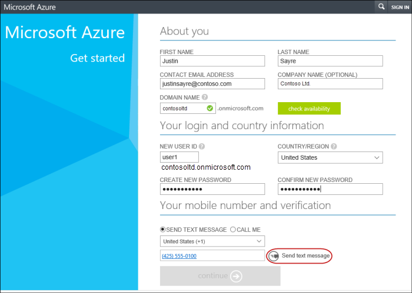
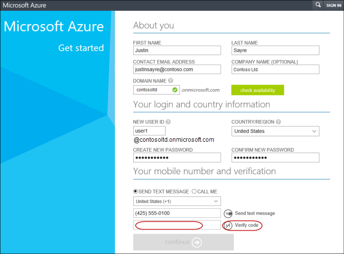
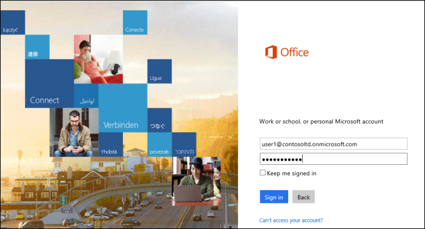
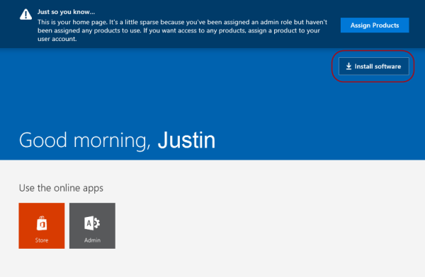
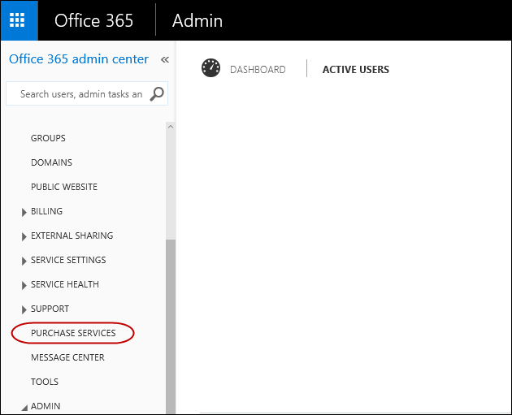
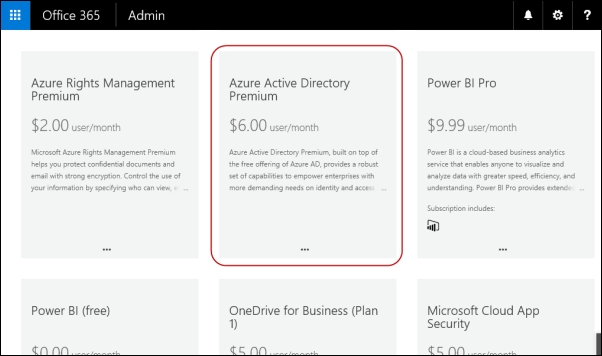
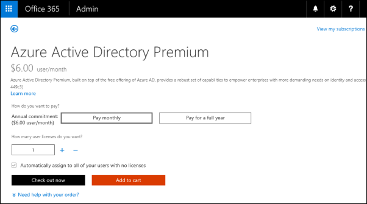
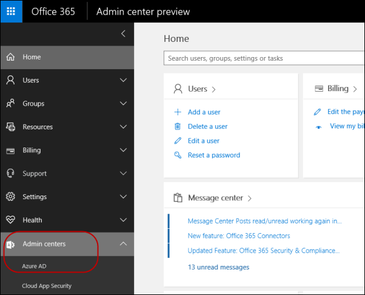

# 添加 Azure AD 租户和 Azure 广告订阅

下面是添加 Azure Active Directory 租户、 添加订阅了 Azure 的广告，并注册您的订阅的分步指南。

> **请注意** 如果您已支付给 Office 365、 Microsoft Dynamics CRM Online、 企业移动套件或其他 Microsoft 服务的订阅，必须对 Azure 广告的免费订阅。 若要注册此免费订阅的分步指南，请参阅[注册免费 Azure Active Directory 订阅。](#register-your-free-azure-active-directory-subscription)

1.  为从[本网站](https://account.windowsazure.com/organization)通过创建管理员帐户为您的组织的 Azure AD 租户签约。

    

2.  请输入您的组织的信息。 单击**检查可用性**，确认您选择的域名可用。

    

3.  完成登录和国家/地区信息。 您必须提供有效的电话号码，然后单击**发送短信**或**呼叫我**。

    

4.  输入您接收，然后单击**验证代码**的代码。 验证代码和继续按钮将变为绿色后，请单击**继续**。

    

5.  创建您的 Azure 帐户之后，您就可以添加 Azure 广告订阅。

    如果您不具有对任何 Microsoft 服务的付费的订阅，您可以购买高级订阅了 Azure 的广告。 转到门户中 Office 356， <https://portal.office.com/>并使用刚创建在步骤 4 中 （例如，管理员帐户，然后登录user1@contosoltd.onmicrosoftcom).

    

6.  单击**安装软件**。

    

7.  在 Office 365 门户中，从左侧的 nagivation 中选择**采购服务**。

    

8.  在**购买服务**页中，向下滚动直到看到**Azure 活动目录高级**，然后单击要购买。

    

9.  继续进行您的购买。

    

10. 后完成购买，您可以登录到 Office 365 管理门户网站，您将看到与其他服务一起 Admin 下拉菜单中的**Azure 的广告**选项 (SharePoint，交换，等等。..)。

    

    当您选择 Azure 的广告时，它将转到 Azure 广告门户可以在其中管理 Azure AD 应用程序。

## 注册免费 Azure Active Directory 订阅

如果您已支付给 Office 365、 Microsoft Dynamics CRM Online、 企业移动套件或其他 Microsoft 服务的订阅，必须对 Azure 广告的免费订阅。 下面是一个分步指南，以注册免费使用 Office 365 增值业务订购的 Azure 广告订阅。

1.  登录到 Office 365 门户网站位于<https://portal.office.com>使用贵组织的帐户。

    

2.  在**主页**页中，单击管理工具图标。

    

3.  在**管理中心**页中，将鼠标悬停在左侧管理工具图标，然后单击**Azure 的广告**。 这会将您带到 Azure Active Directory 注册页面并将现有的 Office 365 组织帐户信息显示。

    

4.  在**注册**页上，请确保输入有效的电话号码，然后单击**注册**。

    

5.  它可能需要几分钟的时间来处理该请求。

    

6.  当此过程完成时，您将看到欢迎页面。

    

 

