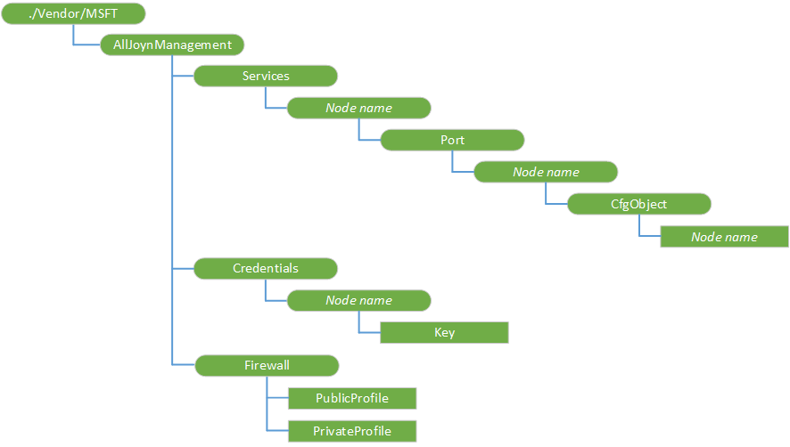

# <a name="alljoynmanagement-csp"></a>AllJoynManagement 的 CSP


AllJoynManagement 配置服务提供程序 (CSP) 允许 IT 管理员枚举连接到 AllJoyn 总线的 AllJoyn 设备。 设备必须支持 Microsoft AllJoyn 配置界面 (com.microsoft.alljoynmanagement.config)。 您还可以将配置文件推送到相同的设备。 若要填充的各个节点，设置新的配置时，建议您先该查询，以获取所有连接的设备中的所有节点的实际值。 然后可以使用查询中的信息时推送新的配置设置的节点值。

> **请注意**  
在 Windows 10 IoT 核心 （IoT 核心） 只支持 AllJoynManagement 配置服务提供程序 (CSP)。

Windows 10 1511年版本中添加了该 CSP。

 

防火墙设置，请注意，PublicProfile 和 PrivateProfile 是相互排斥。 必须在设置专用配置文件本身，并且唯一受支持的操作直接在设备上是获得。 对于 PublicProfile，支持添加和获取。 该 CSP 打算与 AllJoyn 设备系统桥，配合使用，桥的了解将有助于确定何时以及如何使用该 CSP 时。 有关详细信息，请参阅[设备系统桥 (DSB) 项目](http://go.microsoft.com/fwlink/p/?LinkId=615876)和[AllJoyn 设备系统桥接器](http://go.microsoft.com/fwlink/p/?LinkId=615877)。

下面的关系图以树格式显示 AllJoynManagement 配置服务提供程序



下面的列表描述特征和参数。

<a href="" id="--vendor-msft-alljoynmanagement"></a>**./Vendor/MSFT/AllJoynManagement**  
AllJoynManagement 配置服务提供程序的根节点。

<a href="" id="services"></a>**服务**  
发现 AllJoyn 总线的所有 AllJoyn 对象的列表。 所有公开"com.microsoft.alljoynmanagement.config"的 AllJoyn 对象将包括。

<a href="" id="services-node-name"></a>**服务 / ***_节点名称_**  
唯一 AllJoyn 设备 ID (GUID) 承载一个或多个可配置的对象。

<a href="" id="services-node-name-port"></a>**服务 /*节点名称*/Port**  
AllJoyn 对象使用通信配置设置的端口组。 通常只有一个端口用于通信，但很可能会指定其他端口。

<a href="" id="services-node-name-port-node-name"></a>**服务 /*节点名称*/端口 / ***_节点名称_**  
用于通信的端口号。 这是由可配置的 AllJoyn 对象，这里反映。

<a href="" id="services-node-name-port-node-name-cfgobject"></a>**服务 /*节点名称*/Port/ /CfgObject***节点名称*  
AllJoyn 对象的端口是可用的可配置接口的集合。

<a href="" id="services-node-name-port-node-name-cfgobject-node-name"></a>**服务 /*节点名称*/Port/*节点*名称/CfgObject / ***_节点名称_**  
此 URI 的其余部分是可配置的 AllJoyn 对象由父 ServiceID 转义的路径和由父 PortNum 访问。

例如 Microsoft 特定 AllJoyn 配置接口 AllJoyn 桥"\\FabrikamService\\BridgeConfig"将作为 URI 中指定: %2FFabrikamService %2fbridgeconfig。

<a href="" id="credentials"></a>**凭据**  
这是凭据存储。 管理员可以设置每个 AllJoyn 设备需要在此节点的身份验证凭据。

替换或查询上的 AllJoyn 对象需要身份验证的配置项的 CSP SyncML 请求时，CSP 将使用的身份验证阶段此处存储的凭据。

<a href="" id="credentials-node-name"></a>**凭据 / ***_节点名称_**  
这是同一个服务中指定的 ID \\AllJoynManagement\\服务\\ServiceID URI。 它通常作为一个 GUID。

<a href="" id="credentials-node-name-key"></a>**凭据 /*节点名称*/Key**  
符合 AllJoyn SRP KEYX 身份验证标准字母数字值。

<a href="" id="firewall"></a>**防火墙**  
AllJoyn 服务的防火墙设置。

<a href="" id="firewall-publicprofile"></a>**防火墙/PublicProfile**  
布尔值以启用或禁用公用网络配置文件 AllJoyn 路由器服务 (AJRouter.dll)。

<a href="" id="firewall-privateprofile"></a>**防火墙/PrivateProfile**  
布尔值，该值指示是否为专用网络配置文件启用 AllJoyn 路由器服务 (AJRouter.dll)。

## <a name="examples"></a>示例


设置适配器配置

``` syntax
<?xml version="1.0" encoding="utf-8"?>
SyncML xmlns="SYNCML:SYNCML1.2">
  <SyncBody>
    <Replace>
      <CmdID>2</CmdID>
      <Item>
        <Target>
          <LocURI>./Vendor/MSFT/AllJoynManagement/Services/_ALLJOYN_DEVICE_ID_/Port/27/Configuration/%2FDSBService%2FAdapterConfig</LocURI>
        </Target>
       <Meta>
          <Format xmlns="syncml:metinf">b64</Format>
        </Meta>       <Data>PAA/AHgAbQBsACAAdgBlAHIAcwBpAG8AbgA9ACIAMQAuADAAIgA/AD4ADQAKADwAQgBhAGMATgBlAHQAQwBmAGcAPgANAAoACQA8AEIAQgBNAEQAUwBlAHIAdgBlAHIAPgANAAoACQAJADwASQBQAEEAZABkAHIAZQBzAHMAPgAxADIANwAuADAALgAwAC4AMQA8AC8ASQBQAEEAZABkAHIAZQBzAHMAPgANAAoACQAJADwAUABvAHIAdAA+ADQANwA4ADAAOAA8AC8AUABvAHIAdAA+AA0ACgAJADwALwBCAEIATQBEAFMAZQByAHYAZQByAD4ADQAKADwALwBCAGEAYwBOAGUAdABDAGYAZwA+AA0ACgAAAA==</Data>
       </Item>
    </Replace>
    <Final/>
  </SyncBody>
</SyncML>
```

您应该替换\_ALLJOYN\_设备\_ID\_与实际的设备 id。 请注意，数据是 base 64 编码表示您正在设置的配置文件。

获取 PIN 数据

``` syntax
<?xml version="1.0" encoding="utf-8"?>
<SyncML xmlns="SYNCML:SYNCML1.2">
  <SyncBody>
    <Get>
      <CmdID>2</CmdID>
      <Item>
        <Target>
          <LocURI>./Vendor/MSFT/AllJoynManagement/Credentials?list=StructData</LocURI>
        </Target>
      </Item>
    </Get>
    <Final/>
  </SyncBody>
</SyncML>
```

获取防火墙 PrivateProfile

``` syntax
<SyncML xmlns="SYNCML:SYNCML1.2">
  <SyncBody>         
              <Get>
                <CmdID>1</CmdID>
                <Item>
                     <Target>
                       <LocURI>./Vendor/MSFT/AllJoynManagement/Firewall/PrivateProfile</LocURI>
                     </Target>
                </Item>
              </Get>        
     <Final/>
  </SyncBody>
</SyncML>
```

 

 


