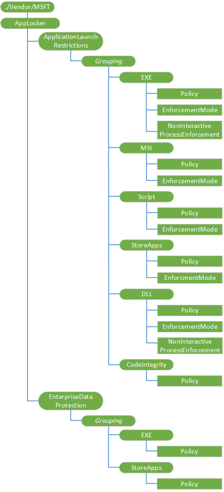
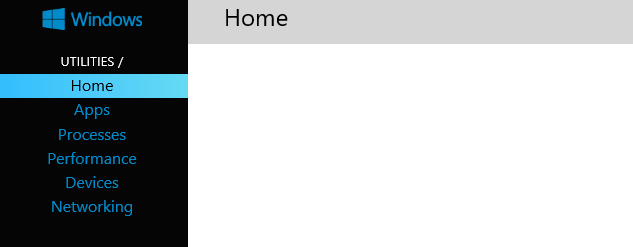
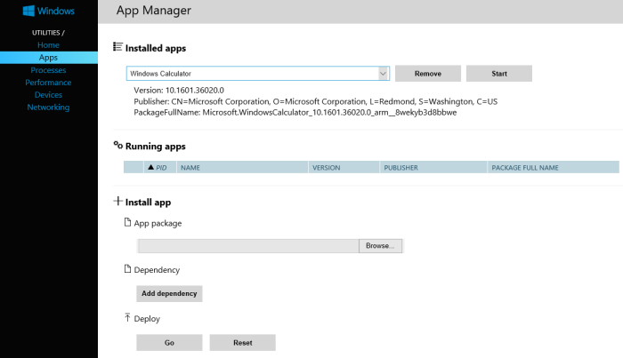
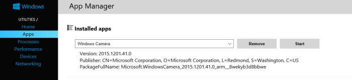

# <a name="applocker-csp"></a>AppLocker CSP


AppLocker 配置服务提供程序用于指定允许或不允许哪些应用程序。 没有显示被阻止的应用程序的用户界面。

> **请注意**  
> 创建允许的应用程序的列表时，所有[的收件箱的应用程序](#inboxappsandcomponents)也将被都禁止，并必须将它们包含在您的允许的应用程序列表。 别忘了要添加的电话、 邮件、 设置、 开始、 电子邮件和帐户、 工作和学校，收件箱应用程序和其他应用程序所需。
>
> 在 Windows 10 移动，当创建允许的应用程序的列表[设置应用程序依赖于初始应用程序](#settingssplashapps)被阻止。 取消阻止这些应用程序，必须将它们包括在允许的应用程序列表中。
> 
> 删除/注销不正确支持除非分组值都是唯一的招生名额。 如果多个招生名额使用分组值相同，然后注销不会像预期的那样由于存在重复的 Uri 的资源管理器删除。 若要避免此问题，请分组值应包括一些随机性。 最佳做法是使用一个随机生成的 GUID。 但是，没有确切值节点的任何要求。


下面的关系图以树格式显示 AppLocker 配置服务提供程序。



<a href="" id="--vendor-msft-applocker"></a>**./Vendor/MSFT/AppLocker**  
定义 AppLocker 配置服务提供程序的根节点。

<a href="" id="applicationlaunchrestrictions"></a>**ApplicationLaunchRestrictions**  
定义应用程序的限制。

> **请注意**  
> 创建允许的应用程序的列表时，所有[的收件箱的应用程序](#inboxappsandcomponents)也将被都禁止，并必须将它们包含在您的允许的应用程序列表。 别忘了要添加的电话、 邮件、 设置、 开始、 电子邮件和帐户、 工作和学校，收件箱应用程序和其他应用程序所需。
> 
> 在 Windows 10 移动，当创建允许的应用程序的列表[设置应用程序依赖于初始应用程序](#settingssplashapps)被阻止。 取消阻止这些应用程序，必须将它们包括在允许的应用程序列表中。

附加信息︰

- [查找发布者和产品名称的应用程序](#productname)的分步指南获取各种 Windows 应用程序的发布者和产品名称。
- [白名单的示例](#whitelist-example)-Windows 10 手机，拒绝除列出的所有应用程序的示例。

<a href="" id="enterprisedataprotection"></a>**EnterpriseDataProtection**  
捕获允许处理企业数据的应用程序的列表。 应结合与**./Device/Vendor/MSFT/EnterpriseDataProtection**在[EnterpriseDataProtection CSP](enterprisedataprotection-csp.md)中的设置。

附加信息︰

- [推荐 deny 列表窗口信息保护](#recommended-deny-list-for-windows-information-protection)-示例第 10 Windows 版本 1607年拒绝访问企业数据作为允许应用程序已知 unenlightened 的 Microsoft 应用程序。 这可确保管理员不会不会意外地使这些应用程序将允许 Windows 的信息保护，并避免使用这些应用程序的已知兼容性问题相关的自动文件加密。

每个上面列出的节点包含**分组**节点。

<table>
<colgroup>
<col width="20%" />
<col width="80%" />
</colgroup>
<thead>
<tr class="header">
<th>对象的说明。</th>
<th>说明</th>
</tr>
</thead>
<tbody>
<tr class="odd">
<td><p><strong>分组</strong></p></td>
<td><p>分组节点动态节点，且可能有任何数它们对于给定的注册 （或给定的上下文）。 管理终结点，其工作就是确定它们的用途是什么，并不与其它标识符，它们定义的冲突与选择的实际标识符。</p>
<p>不同的招生名额和上下文可以使用相同的标识符颁发机构中，即使许多这类标识符同时处于活动状态。</p>
<p>支持的操作是 Get，添加，删除和替换。</p></td>
</tr>
</tbody>
</table>

 

此外，每个**分组**节点包含一个或多个以下节点︰

<table>
<colgroup>
<col width="20%" />
<col width="80%" />
</colgroup>
<thead>
<tr class="header">
<th>对象的说明。</th>
<th>说明</th>
</tr>
</thead>
<tbody>
<tr class="odd">
<td><p><strong>EXE</strong></p></td>
<td><p>定义用于启动可执行应用程序的限制。</p>
<p>支持的操作是 Get，添加，删除和替换。</p></td>
</tr>
<tr class="even">
<td><p><strong>MSI</strong></p></td>
<td><p>定义用于执行 Windows 安装程序文件的限制。</p>
<p>支持的操作是 Get，添加，删除和替换。</p></td>
</tr>
<tr class="odd">
<td><p><strong>Script</strong></p></td>
<td><p>定义用于运行脚本的限制。</p>
<p>支持的操作是 Get，添加，删除和替换。</p></td>
</tr>
<tr class="even">
<td><p><strong>StoreApps</strong></p></td>
<td><p>定义为运行 Windows 应用商店应用程序的限制。</p>
<p>支持的操作是 Get，添加，删除和替换。</p></td>
</tr>
<tr class="odd">
<td><p><strong>DLL</strong></p></td>
<td><p>定义用于处理的 DLL 文件的限制。</p>
<p>支持的操作是 Get，添加，删除和替换。</p></td>
</tr>
<tr class="even">
<td><p><strong>CodeIntegrity</strong></p></td>
<td><p>在桌面上才支持此节点。 支持的操作是 Get，添加，删除和替换。</p></td>
</tr>
</tbody>
</table>

 

每上一节点都包含一个或多个下面的叶节点︰

<table>
<colgroup>
<col width="20%" />
<col width="80%" />
</colgroup>
<thead>
<tr class="header">
<th>对象的说明。</th>
<th>说明</th>
</tr>
</thead>
<tbody>
<tr class="odd">
<td><p><strong>策略</strong></p></td>
<td><p>策略节点定义用于启动可执行文件，Windows 安装程序文件、 脚本、 应用商店应用程序和 DLL 文件的策略。 给定的策略节点的内容是准确对应 AppLocker XML 策略中的 RuleCollection 节点的 XML 格式。</p>
<p>策略节点是 Base64 编码的二进制策略表示的 blob。 可以签名或未签名的二进制的策略。</p>
<p>对于 CodeIntegrity/策略，您可以使用[certutil-编码](http://go.microsoft.com/fwlink/p/?LinkId=724364)命令行工具，可以对 base-64 数据编码。</p>
<p>数据类型为字符串。 支持的操作是 Get，添加，删除和替换。</p></td>
</tr>
<tr class="even">
<td><p><strong>EnforcementMode</strong></p></td>
<td><p>Windows 的信息保护 （以前称为企业数据保护） 的 EnforcementMode 节点不会影响 EnterpriseDataProtection 的行为。 从策略 CSP EDPEnforcementLevel 应该用于启用和禁用 Windows （以前称为企业数据保护） 的信息保护。</p>
<p>数据类型是一个字符串。 支持的操作是 Get，添加，删除和替换。</p></td>
</tr>
<tr class="odd">
<td><p><strong>NonInteractiveProcessEnforcement</strong></p></td>
<td><p>数据类型是一个字符串。</p>
<p>支持的操作是添加，删除，获取和替换。</p></td>
</tr>
</tbody>
</table>

 

## <a name="a-href-idproductnameafind-publisher-and-product-name-of-apps"></a><a href="" id="productname"></a>查找发布者和产品名称的应用程序


到桌面上使用电话设备门户获得各种类型的信息，包括发布服务器名称和产品名称的应用程序安装在手机上，可以对 Windows Phone （Windows 10 手机，1511年版本）。 本过程描述了配对到桌面上使用 WiFi 手机。

如果此过程不适用于您，请尝试对[移动式设备门户](https://msdn.microsoft.com/windows/uwp/debug-test-perf/device-portal-mobile)中所述的其他方法。

**若要查找的应用程序安装在 Windows 10 移动出版商和 PackageFullName**

1.  在您的 Windows Phone，转到**设置**。 选择**更新和安全**。 然后，**开发人员**选择。
2.  选择**开发人员模式运行**。
3.  打开**设备发现**。
4.  打开**设备门户**并保持**AuthenticationOn**。
5.  在**设备门户**, 下**使用连接︰ WiFi**，将 URL 复制到桌面浏览器以使用 WiFi 连接。

    如果收到的证书错误，继续到该 web 页。

    如果得到有关没有到达 web 页错误，您应尝试对[移动式设备门户](https://msdn.microsoft.com/windows/uwp/debug-test-perf/device-portal-mobile)中所述的其他方法。

6.  在**设备发现**您的电话，在点击**对**。 您将得到一个代码 （区分大小写）。
7.  **设置访问页面**的浏览器，在文本框中输入的代码 （区分大小写），然后单击**提交**。

    在您的浏览器上打开**设备门户**页面。

    

8.  桌面**设备门户**页面中，单击要打开**的应用程序管理器**的**应用程序**。
9.  在运行**应用程序****应用程序管理器**页上，您将看到在**发布服务器**和**PackageFullName**的应用程序。

    

10. 如果看不到所需的应用程序，查看**已安装的应用程序**。 使用下拉菜单，单击应用程序并获取版本、 发行商及 PackageFullName 显示。

    

下表显示了信息对 AppLocker 发布者规则字段的映射。

<table>
<colgroup>
<col width="20%" />
<col width="80%" />
</colgroup>
<thead>
<tr class="header">
<th>设备门户数据</th>
<th>AppLocker 发布者规则字段</th>
</tr>
</thead>
<tbody>
<tr class="odd">
<td><p>PackageFullName</p></td>
<td><p>产品名称</p>
<p>产品名称是 PackageFullName 跟版本号的第一部分。 在 Windows 照相机的示例中，产品名称是 Microsoft.WindowsCamera。</p></td>
</tr>
<tr class="even">
<td><p>Publisher</p></td>
<td><p>Publisher</p></td>
</tr>
<tr class="odd">
<td><p>版本</p></td>
<td><p>版本</p>
<p>这可用来在 HighSection 或 LowSection 的 BinaryVersionRange。</p>
<p>HighSection 定义的最高版本号和 LowSection 定义应该是值得信赖的最低版本号。 您可以使用通配符两个版本使版本独立规则。 值之一使用通配符将提供更高或低于特定版本语义。</p></td>
</tr>
</tbody>
</table>

 

下面是一个示例 AppLocker 发布规则︰

``` syntax
FilePublisherCondition PublisherName="CN=Microsoft Corporation, O=Microsoft Corporation, L=Redmond, S=Washington, C=US" ProductName="Microsoft.Reader" BinaryName="*">
  <BinaryVersionRange LowSection="*" HighSection="*" /> 
  </FilePublisherCondition>
```

您可以发布者名称并使用 web API 的应用程序的产品名称。

**若要在 Windows 应用商店中找到发布者和产品名称 Microsoft 应用程序的业务**

1.  转到 Windows 应用商店的商业网站，并找到您的应用程序。 例如，Microsoft OneNote。
2.  复制应用程序 URL 中的 ID 值。 例如，Microsoft OneNote ID 的 URL 是 https:<span>< \span > / / www.microsoft.com/store/apps/onenote/9wzdncrfhvjl，并且您需要复制 ID 值， **9wzdncrfhvjl**。
3.  在您的浏览器中运行业务门户 web API，用于存储返回的 JavaScript 对象符号 (JSON) 文件包含发布者和产品名称值。

    <table>
    <colgroup>
    <col width="100%" />
    </colgroup>
    <thead>
    <tr class="header">
    <th>请求的 URI</th>
    </tr>
    </thead>
    <tbody>
    <tr class="odd">
    <td><p>{应用程序 ID} https://bspmts.mp.microsoft.com/v1/public/catalog/Retail/Products/ / applockerdata</p></td>
    </tr>
    </tbody>
    </table>

     

    以下是有关 Microsoft onenote 2003 示例︰

    请求

    ``` syntax
    https://bspmts.mp.microsoft.com/v1/public/catalog/Retail/Products/9wzdncrfhvjl/applockerdata
    ```

    说明

    ``` syntax
    {
      "packageFamilyName": "Microsoft.Office.OneNote_8wekyb3d8bbwe",
      "packageIdentityName": "Microsoft.Office.OneNote",
      "windowsPhoneLegacyId": "ca05b3ab-f157-450c-8c49-a1f127f5e71d",
      "publisherCertificateName": "CN=Microsoft Corporation, O=Microsoft Corporation, L=Redmond, S=Washington, C=US"
    }
    ```

<table>
<colgroup>
<col width="20%" />
<col width="80%" />
</colgroup>
<thead>
<tr class="header">
<th>结果数据</th>
<th>AppLocker 发布者规则字段</th>
</tr>
</thead>
<tbody>
<tr class="odd">
<td><p>packageIdentityName</p></td>
<td><p>产品名称</p></td>
</tr>
<tr class="even">
<td><p>publisherCertificateName</p></td>
<td><p>Publisher</p></td>
</tr>
<tr class="odd">
<td><p>windowsPhoneLegacyId</p></td>
<td><p>同一个值映射到产品名称和出版商名称</p>
<p>此值将只能与存储区中的应用程序的 XAP 包是否存在。</p>
<p>如果此值填充然后是最简单的操作以涵盖 AppX 和 XAP 包创建应用程序的两个规则。 一个 AppX 使用的 packageIdentityName 和 publisherCertificateName 值，使用 windowsPhoneLegacyId 值的另一种规则。</p></td>
</tr>
</tbody>
</table>

 

## <a name="a-href-idsettingssplashappsasettings-apps-that-rely-on-splash-apps"></a><a href="" id="settingssplashapps"></a>设置应用程序依赖于初始应用程序


在 Windows 10 移动创建允许的应用程序的列表时，您还必须包括设置应用程序依赖列表中允许的应用程序的初始应用程序的子集。 这些应用程序被阻止，除非它们明确添加到允许的应用程序的列表。 下表显示了设置应用程序依赖于初始应用程序的子集。

产品名称是 PackageFullName 跟版本号的第一部分。

| 设置应用程序名称                  | PackageFullName 或产品名称                                         | 产品 id                            |
|------------------------------------|-------------------------------------------------------------------------|--------------------------------------|
| 工作或学校的帐户             | Microsoft.AAD.BrokerPlugin                                              | e5f8b2c4-75ae-45ee-9be8-212e34f77747 |
| 电子邮件和帐户                 | Microsoft.AccountsControl                                               | 39cf127b-8c67-c149-539a-c02271d07060 |
| SettingsPageKeyboard               | 5b04b775-356b-4aa0-aaf8-6491ffea5608\_1.1.0.0\_中性\_\_cw8ffb7c56vgc | 5b04b775-356b-4aa0-aaf8-6491ffea5608 |
| SettingsPageTimeRegion             | 5b04b775-356b-4aa0-aaf8-6491ffea560c\_1.0.0.0\_中性\_\_gqhq4qhgje4fw | 5b04b775-356b-4aa0-aaf8-6491ffea560c |
| SettingsPagePCSystemBluetooth      | 5b04b775-356b-4aa0-aaf8-6491ffea5620\_1.0.0.0\_中性\_\_nvaj48k0z8te8 | 5b04b775-356b-4aa0-aaf8-6491ffea5620 |
| SettingsPageNetworkAirplaneMode    | 5b04b775-356b-4aa0-aaf8-6491ffea5621\_1.0.0.0\_中性\_\_f73kmnfsk0aj2 | 5b04b775-356b-4aa0-aaf8-6491ffea5621 |
| SettingsPageNetworkWiFi            | 5b04b775-356b-4aa0-aaf8-6491ffea5623\_1.0.0.0\_中性\_\_a3jhh70a240gm | 5b04b775-356b-4aa0-aaf8-6491ffea5623 |
| SettingsPageNetworkInternetSharing | 5b04b775-356b-4aa0-aaf8-6491ffea5629\_1.0.0.0\_中性\_\_yqcw9dmx6t3pe | 5b04b775-356b-4aa0-aaf8-6491ffea5629 |
| SettingsPageAccountsWorkplace      | 5b04b775-356b-4aa0-aaf8-6491ffea562a\_1.0.0.0\_中性\_\_q1wjbr14bc3d0 | 5b04b775-356b-4aa0-aaf8-6491ffea562a |
| SettingsPageRestoreUpdate          | 5b04b775-356b-4aa0-aaf8-6491ffea5640\_1.0.0.0\_中性\_\_j77gbj5kz730y | 5b04b775-356b-4aa0-aaf8-6491ffea5640 |
| SettingsPageKidsCorner             | 5b04b775-356b-4aa0-aaf8-6491ffea5802\_1.0.0.0\_中性\_\_1wmss2z3sft8c | 5b04b775-356b-4aa0-aaf8-6491ffea5802 |
| SettingsPageDrivingMode            | 5b04b775-356b-4aa0-aaf8-6491ffea5804\_1.0.0.0\_中性\_\_t553967svy34g | 5b04b775-356b-4aa0-aaf8-6491ffea5804 |
| SettingsPageTimeLanguage           | 5b04b775-356b-4aa0-aaf8-6491ffea5808\_1.0.0.0\_中性\_\_ecxasj38g8ynw | 5b04b775-356b-4aa0-aaf8-6491ffea5808 |
| SettingsPageAppsCorner             | 5b04b775-356b-4aa0-aaf8-6491ffea580a\_1.0.0.0\_中性\_\_4vefaa8deck74 | 5b04b775-356b-4aa0-aaf8-6491ffea580a |
| SettingsPagePhoneNfc               | b0894dfd-4671-4bb9-bc17-a8b39947ffb6\_1.0.0.0\_中性\_\_1prqnbg33c1tj | b0894dfd-4671-4bb9-bc17-a8b39947ffb6 |

 

## <a name="a-href-idinboxappsandcomponentsainbox-apps-and-components"></a><a href="" id="inboxappsandcomponents"></a>收件箱的应用程序和组件


下面的列表显示了可能在收件箱中包含的应用程序。

> **请注意** 此列表列出了系统应用程序交付 Windows，可以将其添加到您 AppLocker 策略，以确保系统的正常的一部分。 如果您决定要阻止某些这些应用程序，我们建议在部署到生产环境之前进行全面测试。 如果不这样做可能会导致意外故障，会极大地降低了用户体验。

 

<table>
<colgroup>
<col width="33%" />
<col width="33%" />
<col width="33%" />
</colgroup>
<thead>
<tr class="header">
<th>应用程序</th>
<th>产品 ID</th>
<th>产品名称</th>
</tr>
</thead>
<tbody>
<tr class="odd">
<td>高级的信息</td>
<td>b6e3e590-9fa5-40c0-86ac-ef475de98e88</td>
<td>b6e3e590-9fa5-40c0-86ac-ef475de98e88</td>
</tr>
<tr class="even">
<td>工作人员老化</td>
<td>09296e27-c9f3-4ab9-aa76-ecc4497d94bb</td>
<td></td>
</tr>
<tr class="odd">
<td>警报和时钟</td>
<td>44f7d2b4-553d-4bec-a8b7-634ce897ed5f</td>
<td>Microsoft.WindowsAlarms</td>
</tr>
<tr class="even">
<td>应用程序下载</td>
<td>20bf77a0-19c7-4daa-8db5-bc3dfdfa44ac</td>
<td></td>
</tr>
<tr class="odd">
<td>指派的访问锁定的应用程序</td>
<td>b84f4722-313e-4f85-8f41-cf5417c9c5cb</td>
<td></td>
</tr>
<tr class="even">
<td>Bing 锁定图像</td>
<td>5f28c179-2780-41df-b966-27807b8de02c</td>
<td></td>
</tr>
<tr class="odd">
<td>块和筛选器</td>
<td>59553c14-5701-49a2-9909-264d034deb3d</td>
<td></td>
</tr>
<tr class="even">
<td>计算器</td>
<td>b58171c6-c70c-4266-a2e8-8f9c994f4456</td>
<td>Microsoft.WindowsCalculator</td>
</tr>
<tr class="odd">
<td>照相机</td>
<td>f0d8fefd-31cd-43a1-a45a-d0276db069f1</td>
<td>Microsoft.WindowsCamera</td>
</tr>
<tr class="even">
<td>CertInstaller</td>
<td>4c4ad968-7100-49de-8cd1-402e198d869e</td>
<td></td>
</tr>
<tr class="odd">
<td>色彩配置文件</td>
<td>b08997ca-60ab-4dce-b088-f92e9c7994f3</td>
<td></td>
</tr>
<tr class="even">
<td>在浏览器中</td>
<td>af7d2801-56c0-4eb1-824b-dd91cdf7ece5</td>
<td>Microsoft.DevicesFlow</td>
</tr>
<tr class="odd">
<td>与支持部门联系</td>
<td>0db5fcff-4544-458a-b320-e352dfd9ca2b</td>
<td>Windows.ContactSupport</td>
</tr>
<tr class="even">
<td>Cortana</td>
<td>fd68dcf4-166f-4c55-a4ca-348020f71b94</td>
<td>Microsoft.Windows.Cortana</td>
</tr>
<tr class="odd">
<td>电子邮件和帐户</td>
<td>39cf127b-8c67-c149-539a-c02271d07060</td>
<td>Microsoft.AccountsControl</td>
</tr>
<tr class="even">
<td>企业安装应用程序</td>
<td>da52fa01-ac0f-479d-957f-bfe4595941cb</td>
<td></td>
</tr>
<tr class="odd">
<td>均衡器</td>
<td>373cb76e-7f6c-45aa-8633-b00e85c73261</td>
<td></td>
</tr>
<tr class="even">
<td>Excel</td>
<td>ead3e7c0-fae6-4603-8699-6a448138f4dc</td>
<td>Microsoft.Office.Excel</td>
</tr>
<tr class="odd">
<td>Facebook</td>
<td>82a23635-5bd9-df11-a844-00237de2db9e</td>
<td>Microsoft.MSFacebook</td>
</tr>
<tr class="even">
<td>字段 Medic</td>
<td>73c58570-d5a7-46f8-b1b2-2a90024fc29c</td>
<td></td>
</tr>
<tr class="odd">
<td>文件资源管理器</td>
<td>c5e2524a-ea46-4f67-841f-6a9465d9d515</td>
<td>c5e2524a-ea46-4f67-841f-6a9465d9d515</td>
</tr>
<tr class="even">
<td>调频广播</td>
<td>f725010e-455d-4c09-ac48-bcdef0d4b626</td>
<td>f725010e-455d-4c09-ac48-bcdef0d4b626</td>
</tr>
<tr class="odd">
<td>入门</td>
<td>b3726308-3d74-4a14-a84c-867c8c735c3c</td>
<td>Microsoft.Getstarted</td>
</tr>
<tr class="even">
<td>粗略地看</td>
<td>106e0a97-8b19-42cf-8879-a8ed2598fcbb</td>
<td></td>
</tr>
<tr class="odd">
<td>坡口音乐</td>
<td>d2b6a184-da39-4c9a-9e0a-8b589b03dec0</td>
<td>Microsoft.ZuneMusic</td>
</tr>
<tr class="even">
<td>免提激活</td>
<td>df6c9621-e873-4e86-bb56-93e9f21b1d6f</td>
<td></td>
</tr>
<tr class="odd">
<td>免提激活</td>
<td>72803bd5-4f36-41a4-a349-e83e027c4722</td>
<td></td>
</tr>
<tr class="even">
<td>HAP 更新后台辅助线程</td>
<td>73c73cdd-4dea-462c-bd83-fa983056a4ef</td>
<td></td>
</tr>
<tr class="odd">
<td>Lumia 运动数据</td>
<td>8fc25fd2-4e2e-4873-be44-20e57f6ec52b</td>
<td></td>
</tr>
<tr class="even">
<td>映射</td>
<td>ed27a07e-af57-416b-bc0c-2596b622ef7d</td>
<td>Microsoft.WindowsMaps</td>
</tr>
<tr class="odd">
<td>消息</td>
<td>27e26f40-e031-48a6-b130-d1f20388991a</td>
<td>Microsoft.Messaging</td>
</tr>
<tr class="even">
<td>Microsoft 帐户</td>
<td>3a4fae89-7b7e-44b4-867b-f7e2772b8253</td>
<td>Microsoft.CloudExperienceHost</td>
</tr>
<tr class="odd">
<td>Microsoft 的边缘</td>
<td>395589fb-5884-4709-b9df-f7d558663ffd</td>
<td>Microsoft.MicrosoftEdge</td>
</tr>
<tr class="even">
<td>Microsoft 的框架</td>
<td>产品 Id = 00000000-0000-0000-0000-000000000000
<p>PublisherName =&quot;CN = Microsoft Corporation，O = Microsoft Corporation，L = 雷蒙德，S = 华盛顿，C = 美国&quot;</p></td>
<td></td>
</tr>
<tr class="odd">
<td>MiracastView</td>
<td>906beeda-b7e6-4ddc-ba8d-ad5031223ef9</td>
<td>906beeda-b7e6-4ddc-ba8d-ad5031223ef9</td>
</tr>
<tr class="even">
<td>资金</td>
<td>1e0440f1-7abf-4b9a-863d-177970eefb5e</td>
<td>Microsoft.BingFinance</td>
</tr>
<tr class="odd">
<td>电影和电视节目</td>
<td>6affe59e-0467-4701-851f-7ac026e21665</td>
<td>Microsoft.ZuneVideo</td>
</tr>
<tr class="even">
<td>音乐下载</td>
<td>3da8a0c1-f7e5-47c0-a680-be8fd013f747</td>
<td></td>
</tr>
<tr class="odd">
<td>导航栏</td>
<td>2cd23676-8f68-4d07-8dd2-e693d4b01279</td>
<td></td>
</tr>
<tr class="even">
<td>网络服务</td>
<td>62f172d1-f552-4749-871c-2afd1c95c245</td>
<td></td>
</tr>
<tr class="odd">
<td>新闻</td>
<td>9c3e8cad-6702-4842-8f61-b8b33cc9caf1</td>
<td>Microsoft.BingNews</td>
</tr>
<tr class="even">
<td>OneDrive</td>
<td>ad543082-80ec-45bb-aa02-ffe7f4182ba8</td>
<td>Microsoft.MicrosoftSkydrive</td>
</tr>
<tr class="odd">
<td>OneNote</td>
<td>ca05b3ab-f157-450c-8c49-a1f127f5e71d</td>
<td>Microsoft.Office.OneNote</td>
</tr>
<tr class="even">
<td>Outlook 日历和邮件</td>
<td>a558feba-85d7-4665-b5d8-a2ff9c19799b</td>
<td>Microsoft.WindowsCommunicationsApps</td>
</tr>
<tr class="odd">
<td>人脉</td>
<td>60be1fb8-3291-4b21-bd39-2221ab166481</td>
<td>Microsoft.People</td>
</tr>
<tr class="even">
<td>电话</td>
<td>5b04b775-356b-4aa0-aaf8-6491ffea5611</td>
<td>5b04b775-356b-4aa0-aaf8-6491ffea5611</td>
</tr>
<tr class="odd">
<td>电话 （拨号）</td>
<td>f41b5d0e-ee94-4f47-9cfe-3d3934c5a2c7</td>
<td>Microsoft.CommsPhone</td>
</tr>
<tr class="even">
<td>电话重置对话框</td>
<td>2864278d-09b5-46f7-b502-1c24139ecbdd</td>
<td></td>
</tr>
<tr class="odd">
<td>照片</td>
<td>fca55e1b-b9a4-4289-882f-084ef4145005</td>
<td>Microsoft.Windows.Photos</td>
</tr>
<tr class="even">
<td>播客</td>
<td>c3215724-b279-4206-8c3e-61d1a9d63ed3</td>
<td>Microsoft.MSPodcast</td>
</tr>
<tr class="odd">
<td>Posdcast 下载</td>
<td>063773e7-f26f-4a92-81f0-aa71a1161e30</td>
<td></td>
</tr>
<tr class="even">
<td>Powerpoint</td>
<td>b50483c4-8046-4e1b-81ba-590b24935798</td>
<td>Microsoft.Office.PowerPoint</td>
</tr>
<tr class="odd">
<td>PrintDialog</td>
<td>0d32eeb1-32f0-40da-8558-cea6fcbec4a4</td>
<td>Microsoft.PrintDialog</td>
</tr>
<tr class="even">
<td>采购对话框</td>
<td>c60e79ca-063b-4e5d-9177-1309357b2c3f</td>
<td></td>
</tr>
<tr class="odd">
<td>评价您的设备</td>
<td>aec3bfad-e38c-4994-9c32-50bd030730ec</td>
<td></td>
</tr>
<tr class="even">
<td>RingtoneApp.WindowsPhone</td>
<td>3e962450-486b-406b-abb5-d38b4ee7e6fe</td>
<td>Microsoft.Tonepicker</td>
</tr>
<tr class="odd">
<td>保存铃声</td>
<td>d8cf8ec7-ec6d-4892-aab9-1e3a4b5fa24b</td>
<td></td>
</tr>
<tr class="even">
<td>Settings</td>
<td>2a4e62d8-8809-4787-89f8-69d0f01654fb</td>
<td>2a4e62d8-8809-4787-89f8-69d0f01654fb</td>
</tr>
<tr class="odd">
<td>安装向导</td>
<td>07d87655-e4f0-474b-895a-773790ad4a32</td>
<td></td>
</tr>
<tr class="even">
<td>共享</td>
<td>b0894dfd-4671-4bb9-bc17-a8b39947ffb6</td>
<td></td>
</tr>
<tr class="odd">
<td>Skype</td>
<td>c3f8e570-68b3-4d6a-bdbb-c0a3f4360a51</td>
<td>Microsoft.SkypeApp</td>
</tr>
<tr class="even">
<td>Skype 视频</td>
<td>27e26f40-e031-48a6-b130-d1f20388991a</td>
<td>Microsoft.Messaging</td>
</tr>
<tr class="odd">
<td>体育</td>
<td>0f4c8c7e-7114-4e1e-a84c-50664db13b17</td>
<td>Microsoft.BingSports</td>
</tr>
<tr class="even">
<td>SSMHost</td>
<td>e232aa77-2b6d-442c-b0c3-f3bb9788af2a</td>
<td></td>
</tr>
<tr class="odd">
<td>Start</td>
<td>5b04b775-356b-4aa0-aaf8-6491ffea5602</td>
<td>5b04b775-356b-4aa0-aaf8-6491ffea5602</td>
</tr>
<tr class="even">
<td>Storage</td>
<td>5b04b775-356b-4aa0-aaf8-6491ffea564d</td>
<td>5b04b775-356b-4aa0-aaf8-6491ffea564d</td>
</tr>
<tr class="odd">
<td>Store</td>
<td>7d47d89a-7900-47c5-93f2-46eb6d94c159</td>
<td>Microsoft.WindowsStore</td>
</tr>
<tr class="even">
<td>触摸屏输入 （手势和触摸）</td>
<td>bbc57c87-46af-4c2c-824e-ac8104cceb38</td>
<td></td>
</tr>
<tr class="odd">
<td>录音机</td>
<td>7311b9c5-a4e9-4c74-bc3c-55b06ba95ad0</td>
<td>Microsoft.WindowsSoundRecorder</td>
</tr>
<tr class="even">
<td>钱包</td>
<td>587a4577-7868-4745-a29e-f996203f1462</td>
<td>Microsoft.MicrosoftWallet</td>
</tr>
<tr class="odd">
<td>Weather</td>
<td>63c2a117-8604-44e7-8cef-df10be3a57c8</td>
<td>Microsoft.BingWeather</td>
</tr>
<tr class="even">
<td>Windows 默认锁定屏幕</td>
<td>cdd63e31-9307-4ccb-ab62-1ffa5721b503</td>
<td></td>
</tr>
<tr class="odd">
<td>Windows 反馈</td>
<td>7604089d-d13f-4a2d-9998-33fc02b63ce3</td>
<td>Microsoft.WindowsFeedback</td>
</tr>
<tr class="even">
<td>单词</td>
<td>258f115c-48f4-4adb-9a68-1387e634459b</td>
<td>Microsoft.Office.Word</td>
</tr>
<tr class="odd">
<td>工作或学校的帐户</td>
<td>e5f8b2c4-75ae-45ee-9be8-212e34f77747</td>
<td>Microsoft.AAD.BrokerPlugin</td>
</tr>
<tr class="even">
<td>Xbox</td>
<td>b806836f-eebe-41c9-8669-19e243b81b83</td>
<td>Microsoft.XboxApp</td>
</tr>
<tr class="odd">
<td>Xbox 的身份提供程序</td>
<td>ba88225b-059a-45a2-a8eb-d3580283e49d</td>
<td>Microsoft.XboxIdentityProvider</td>
</tr>
</tbody>
</table>

 

## <a name="whitelist-example"></a>白名单的示例


以下示例为 Windows 10 移动拒绝所有应用程序，并允许以下应用程序︰

-   [设置应用程序依赖于初始应用程序](#settingssplashapps)
-   大部分[的收件箱的应用程序](#inboxappsandcomponents)，但不是全部。

在此示例中， **MobileGroup0**是节点名称。 我们建议为此节点使用 GUID。

``` syntax
<?xml version="1.0" encoding="utf-8"?>
<SyncML>
  <SyncBody>
    <Add>
      <CmdID>1</CmdID>
      <Item>
        <Target>
          <LocURI>./Vendor/MSFT/AppLocker/ApplicationLaunchRestrictions/MobileGroup0</LocURI>
        </Target>
      </Item>
    </Add>
    <Add>
      <CmdID>2</CmdID>
      <Item>
        <Target>
          <LocURI>./Vendor/MSFT/AppLocker/ApplicationLaunchRestrictions/MobileGroup0/StoreApps</LocURI>
        </Target>
      </Item>
    </Add>
    <Replace>
      <CmdID>3</CmdID>
      <Item>
        <Target>
          <LocURI>./Vendor/MSFT/AppLocker/ApplicationLaunchRestrictions/MobileGroup0/StoreApps/Policy</LocURI>
        </Target>
        <Meta>
          <Format xmlns="syncml:metinf">chr</Format>
        </Meta>
        <Data>
&lt;RuleCollection Type="Appx" EnforcementMode="Enabled"&gt;

    &lt;FilePublisherRule Id="172B8ACE-AAF5-41FA-941A-93AEE126B4A9" Name="Default Rule to Deny ALL" Description="Deny all publisher" UserOrGroupSid="S-1-1-0" Action="Deny"&gt;
        &lt;Conditions&gt;
            &lt;FilePublisherCondition PublisherName="CN=*" ProductName="*" BinaryName="*"&gt;
                &lt;BinaryVersionRange LowSection="*" HighSection="*"/&gt;
            &lt;/FilePublisherCondition&gt;
        &lt;/Conditions&gt;
    &lt;/FilePublisherRule&gt;

    &lt;FilePublisherRule Id="DDCD112F-E003-4874-8B3E-14CB23851D54" Name="Whitelist Settings splash app" Description="Allow Admins to run Settings." UserOrGroupSid="S-1-1-0" Action="Allow"&gt;
        &lt;Conditions&gt;
            &lt;FilePublisherCondition PublisherName="*" ProductName="2A4E62D8-8809-4787-89F8-69D0F01654FB" BinaryName="*"&gt;
                &lt;BinaryVersionRange LowSection="*" HighSection="*"/&gt;
            &lt;/FilePublisherCondition&gt;
        &lt;/Conditions&gt;
    &lt;/FilePublisherRule&gt;

    &lt;FilePublisherRule Id="757D94A8-C752-4013-9896-D46EF10925E9" Name="Whitelist Settings WorkOrSchool" Description="Allow Admins to run WorkOrSchool" UserOrGroupSid="S-1-1-0" Action="Allow"&gt;
        &lt;Conditions&gt;
            &lt;FilePublisherCondition PublisherName="*" ProductName="5B04B775-356B-4AA0-AAF8-6491FFEA562A" BinaryName="*"&gt;
                &lt;BinaryVersionRange LowSection="*" HighSection="*"/&gt;
            &lt;/FilePublisherCondition&gt;
        &lt;/Conditions&gt;
    &lt;/FilePublisherRule&gt;

    &lt;FilePublisherRule Id="473BCE1A-94D2-4AE1-8CB1-064B0677CACB" Name="Whitelist WorkPlace AAD BrokerPlugin" Description="Allow Admins" UserOrGroupSid="S-1-1-0" Action="Allow"&gt;
        &lt;Conditions&gt;
            &lt;FilePublisherCondition PublisherName="CN=Microsoft Corporation, O=Microsoft Corporation, L=Redmond, S=Washington, C=US" ProductName="Microsoft.AAD.BrokerPlugin" BinaryName="*" &gt;
                &lt;BinaryVersionRange LowSection="*" HighSection="*"/&gt;
            &lt;/FilePublisherCondition&gt;
        &lt;/Conditions&gt;
    &lt;/FilePublisherRule&gt;

    &lt;FilePublisherRule Id="E13EA64B-B0D3-4257-87F4-1B522D06EA03" Name="Whitelist Start" Description="Allow Admins to run Start." UserOrGroupSid="S-1-1-0" Action="Allow"&gt;
        &lt;Conditions&gt;
            &lt;FilePublisherCondition PublisherName="*" ProductName="5B04B775-356B-4AA0-AAF8-6491FFEA5602" BinaryName="*" &gt;
                &lt;BinaryVersionRange LowSection="*" HighSection="*"/&gt;
            &lt;/FilePublisherCondition&gt;
        &lt;/Conditions&gt;
    &lt;/FilePublisherRule&gt;

    &lt;FilePublisherRule Id="2898C4B2-4B37-4BFF-8F7B-16B377EDEA88" Name="Whitelist SettingsPageKeyboard" Description="Allow Admins" UserOrGroupSid="S-1-1-0" Action="Allow"&gt;
        &lt;Conditions&gt;
            &lt;FilePublisherCondition PublisherName="*" ProductName="5b04b775-356b-4aa0-aaf8-6491ffea5608" BinaryName="*"&gt;
                &lt;BinaryVersionRange LowSection="*" HighSection="*"/&gt;
            &lt;/FilePublisherCondition&gt;
        &lt;/Conditions&gt;
    &lt;/FilePublisherRule&gt;

    &lt;FilePublisherRule Id="15BBA04F-3989-4FF7-9FEF-83C4DFDABA27" Name="Whitelist SettingsPageTimeRegion" Description="Allow Admins" UserOrGroupSid="S-1-1-0" Action="Allow"&gt;
        &lt;Conditions&gt;
            &lt;FilePublisherCondition PublisherName="*" ProductName="5b04b775-356b-4aa0-aaf8-6491ffea560c" BinaryName="*"&gt;
                &lt;BinaryVersionRange LowSection="*" HighSection="*"/&gt;
            &lt;/FilePublisherCondition&gt;
        &lt;/Conditions&gt;
    &lt;/FilePublisherRule&gt;

    &lt;FilePublisherRule Id="C3735CB1-060D-4D40-9708-6D33B98A7A2D" Name="Whitelist SettingsPagePCSystemBluetooth" Description="Allow Admins" UserOrGroupSid="S-1-1-0" Action="Allow"&gt;
        &lt;Conditions&gt;
            &lt;FilePublisherCondition PublisherName="*" ProductName="5b04b775-356b-4aa0-aaf8-6491ffea5620" BinaryName="*"&gt;
                &lt;BinaryVersionRange LowSection="*" HighSection="*"/&gt;
            &lt;/FilePublisherCondition&gt;
        &lt;/Conditions&gt;
    &lt;/FilePublisherRule&gt;

    &lt;FilePublisherRule Id="AFACF5A3-2974-41EE-A31A-1486F593C145" Name="Whitelist SettingsPageNetworkAirplaneMode" Description="Allow Admins" UserOrGroupSid="S-1-1-0" Action="Allow"&gt;
        &lt;Conditions&gt;
            &lt;FilePublisherCondition PublisherName="*" ProductName="5b04b775-356b-4aa0-aaf8-6491ffea5621" BinaryName="*"&gt;
                &lt;BinaryVersionRange LowSection="*" HighSection="*"/&gt;
            &lt;/FilePublisherCondition&gt;
        &lt;/Conditions&gt;
    &lt;/FilePublisherRule&gt;

    &lt;FilePublisherRule Id="7B02A339-9E77-4694-AF86-119265138129" Name="Whitelist SettingsPageNetworkWiFi" Description="Allow Admins" UserOrGroupSid="S-1-1-0" Action="Allow"&gt;
        &lt;Conditions&gt;
            &lt;FilePublisherCondition PublisherName="*" ProductName="5B04B775-356B-4AA0-AAF8-6491FFEA5623" BinaryName="*"&gt;
                &lt;BinaryVersionRange LowSection="*" HighSection="*"/&gt;
            &lt;/FilePublisherCondition&gt;
        &lt;/Conditions&gt;
    &lt;/FilePublisherRule&gt;

    &lt;FilePublisherRule Id="F912172F-9D83-46F5-8D6C-BA7AB17063BE" Name="Whitelist SettingsPageNetworkInternetSharing" Description="Allow Admins" UserOrGroupSid="S-1-1-0" Action="Allow"&gt;
        &lt;Conditions&gt;
            &lt;FilePublisherCondition PublisherName="*" ProductName="5B04B775-356B-4AA0-AAF8-6491FFEA5629" BinaryName="*"&gt;
                &lt;BinaryVersionRange LowSection="*" HighSection="*"/&gt;
            &lt;/FilePublisherCondition&gt;
        &lt;/Conditions&gt;
    &lt;/FilePublisherRule&gt;

    &lt;FilePublisherRule Id="67AE8001-4E49-442A-AD72-F837129ABF63" Name="Whitelist SettingsPageRestoreUpdate" Description="Allow Admins" UserOrGroupSid="S-1-1-0" Action="Allow"&gt;
        &lt;Conditions&gt;
            &lt;FilePublisherCondition PublisherName="*" ProductName="5b04b775-356b-4aa0-aaf8-6491ffea5640" BinaryName="*"&gt;
                &lt;BinaryVersionRange LowSection="*" HighSection="*"/&gt;
            &lt;/FilePublisherCondition&gt;
        &lt;/Conditions&gt;
    &lt;/FilePublisherRule&gt;

    &lt;FilePublisherRule Id="7B65BCB2-4B1D-42B6-921B-B87F1474BDC5" Name="Whitelist SettingsPageKidsCorner" Description="Allow Admins" UserOrGroupSid="S-1-1-0" Action="Allow"&gt;
        &lt;Conditions&gt;
            &lt;FilePublisherCondition PublisherName="*" ProductName="5b04b775-356b-4aa0-aaf8-6491ffea5802" BinaryName="*"&gt;
                &lt;BinaryVersionRange LowSection="*" HighSection="*"/&gt;
            &lt;/FilePublisherCondition&gt;
        &lt;/Conditions&gt;
    &lt;/FilePublisherRule&gt;

    &lt;FilePublisherRule Id="3964A53B-E131-4ED6-88DA-71FBDBE4E232" Name="Whitelist SettingsPageDrivingMode" Description="Allow Admins" UserOrGroupSid="S-1-1-0" Action="Allow"&gt;
        &lt;Conditions&gt;
            &lt;FilePublisherCondition PublisherName="*" ProductName="5b04b775-356b-4aa0-aaf8-6491ffea5804" BinaryName="*"&gt;
                &lt;BinaryVersionRange LowSection="*" HighSection="*"/&gt;
            &lt;/FilePublisherCondition&gt;
        &lt;/Conditions&gt;
    &lt;/FilePublisherRule&gt;

    &lt;FilePublisherRule Id="99C4CD58-51A2-429A-B479-976ADB4EA757" Name="Whitelist SettingsPageTimeLanguage" Description="Allow Admins" UserOrGroupSid="S-1-1-0" Action="Allow"&gt;
        &lt;Conditions&gt;
            &lt;FilePublisherCondition PublisherName="*" ProductName="5b04b775-356b-4aa0-aaf8-6491ffea5808" BinaryName="*"&gt;
                &lt;BinaryVersionRange LowSection="*" HighSection="*"/&gt;
            &lt;/FilePublisherCondition&gt;
        &lt;/Conditions&gt;
    &lt;/FilePublisherRule&gt;

    &lt;FilePublisherRule Id="EBA3BCBE-4651-48CE-8F94-C5AC5D8F72FB" Name="Whitelist SettingsPageAppsCorner" Description="Allow Admins" UserOrGroupSid="S-1-1-0" Action="Allow"&gt;
        &lt;Conditions&gt;
            &lt;FilePublisherCondition PublisherName="*" ProductName="5b04b775-356b-4aa0-aaf8-6491ffea580a" BinaryName="*"&gt;
                &lt;BinaryVersionRange LowSection="*" HighSection="*"/&gt;
            &lt;/FilePublisherCondition&gt;
        &lt;/Conditions&gt;
    &lt;/FilePublisherRule&gt;

    &lt;FilePublisherRule Id="E16EABCC-46E7-4AB3-9F48-67FFF941BBDC" Name="Whitelist SettingsPagePhoneNfc" Description="Allow Admins" UserOrGroupSid="S-1-1-0" Action="Allow"&gt;
        &lt;Conditions&gt;
            &lt;FilePublisherCondition PublisherName="*" ProductName="b0894dfd-4671-4bb9-bc17-a8b39947ffb6" BinaryName="*"&gt;
                &lt;BinaryVersionRange LowSection="*" HighSection="*"/&gt;
            &lt;/FilePublisherCondition&gt;
        &lt;/Conditions&gt;
    &lt;/FilePublisherRule&gt;

    &lt;FilePublisherRule Id="1F4C3904-9976-4FEE-A492-5708F14EABA5" Name="Whitelist MSA Cloud Experience Host" Description="Allow Admins" UserOrGroupSid="S-1-1-0" Action="Allow"&gt;
      &lt;Conditions&gt;
        &lt;FilePublisherCondition PublisherName="CN=Microsoft Corporation, O=Microsoft Corporation, L=Redmond, S=Washington, C=US" ProductName="Microsoft.CloudExperienceHost" BinaryName="*" /&gt;
      &lt;/Conditions&gt;
    &lt;/FilePublisherRule&gt;

    &lt;FilePublisherRule Id="AA741A28-7C02-49A5-AA5C-35D53FB8A9DC" Name="Whitelist Email and Accounts" Description="Allow Admins" UserOrGroupSid="S-1-1-0" Action="Allow"&gt;
      &lt;Conditions&gt;
        &lt;FilePublisherCondition PublisherName="CN=Microsoft Windows, O=Microsoft Corporation, L=Redmond, S=Washington, C=US" ProductName="Microsoft.AccountsControl" BinaryName="*" /&gt;
      &lt;/Conditions&gt;
    &lt;/FilePublisherRule&gt;

    &lt;FilePublisherRule Id="863BE063-D134-4C5C-9825-9DF9A86B6B56" Name="Whitelist Calculator" Description="Allow Admins" UserOrGroupSid="S-1-1-0" Action="Allow"&gt;
      &lt;Conditions&gt;
        &lt;FilePublisherCondition PublisherName="CN=Microsoft Corporation, O=Microsoft Corporation, L=Redmond, S=Washington, C=US" ProductName="Microsoft.WindowsCalculator" BinaryName="*" /&gt;
      &lt;/Conditions&gt;
    &lt;/FilePublisherRule&gt;

    &lt;FilePublisherRule Id="1DA2F479-3D1D-4425-9FFA-D4E6908F945A" Name="Whitelist Alarms and  Clock" Description="Allow Admins" UserOrGroupSid="S-1-1-0" Action="Allow"&gt;
      &lt;Conditions&gt;
        &lt;FilePublisherCondition PublisherName="CN=Microsoft Corporation, O=Microsoft Corporation, L=Redmond, S=Washington, C=US" ProductName="Microsoft.WindowsAlarms" BinaryName="*" /&gt;
      &lt;/Conditions&gt;
    &lt;/FilePublisherRule&gt;

    &lt;FilePublisherRule Id="18E12372-21C6-4DA5-970E-0A58739D7151" Name="Whitelist People" Description="Allow Admins" UserOrGroupSid="S-1-1-0" Action="Allow"&gt;
      &lt;Conditions&gt;
        &lt;FilePublisherCondition PublisherName="CN=Microsoft Corporation, O=Microsoft Corporation, L=Redmond, S=Washington, C=US" ProductName="Microsoft.People" BinaryName="*" /&gt;
      &lt;/Conditions&gt;
    &lt;/FilePublisherRule&gt;

    &lt;FilePublisherRule Id="FD686D83-A829-4351-8FF4-27C7DE5755D2" Name="Whitelist Camera" Description="Allow Admins to run camera." UserOrGroupSid="S-1-1-0" Action="Allow"&gt;
      &lt;Conditions&gt;
        &lt;FilePublisherCondition PublisherName="CN=Microsoft Corporation, O=Microsoft Corporation, L=Redmond, S=Washington, C=US" ProductName="Microsoft.WindowsCamera" BinaryName="*" /&gt;
      &lt;/Conditions&gt;
    &lt;/FilePublisherRule&gt;

    &lt;FilePublisherRule Id="16875F70-1778-43CC-96BB-783C9A8E53D5" Name="Whitelist WindowsMaps" Description="Allow Admins" UserOrGroupSid="S-1-1-0" Action="Allow"&gt;
      &lt;Conditions&gt;
        &lt;FilePublisherCondition PublisherName="CN=Microsoft Corporation, O=Microsoft Corporation, L=Redmond, S=Washington, C=US" ProductName="Microsoft.WindowsMaps" BinaryName="*" /&gt;
      &lt;/Conditions&gt;
    &lt;/FilePublisherRule&gt;

    &lt;FilePublisherRule Id="D21D6F9D-CFF6-4AD1-867A-2411CE6A388D" Name="Whitelist FileExplorer" Description="Allow Admins" UserOrGroupSid="S-1-1-0" Action="Allow"&gt;
      &lt;Conditions&gt;
        &lt;FilePublisherCondition PublisherName="CN=Microsoft Windows, O=Microsoft Corporation, L=Redmond, S=Washington, C=US" ProductName="c5e2524a-ea46-4f67-841f-6a9465d9d515" BinaryName="*" /&gt;
      &lt;/Conditions&gt;
    &lt;/FilePublisherRule&gt;

    &lt;FilePublisherRule Id="450B6D7E-1738-41C9-9241-466C3FA4AB0C" Name="Whitelist FM Radio" Description="Allow Admins" UserOrGroupSid="S-1-1-0" Action="Allow"&gt;
      &lt;Conditions&gt;
        &lt;FilePublisherCondition PublisherName="*" ProductName="F725010E-455D-4C09-AC48-BCDEF0D4B626" BinaryName="*" /&gt;
      &lt;/Conditions&gt;
    &lt;/FilePublisherRule&gt;

    &lt;FilePublisherRule Id="37F4272C-F4A0-4AB8-9B5F-C9194A0EC6F3" Name="Whitelist Microsoft Edge" Description="Allow Admins" UserOrGroupSid="S-1-1-0" Action="Allow"&gt;
      &lt;Conditions&gt;
        &lt;FilePublisherCondition PublisherName="CN=Microsoft Corporation, O=Microsoft Corporation, L=Redmond, S=Washington, C=US" ProductName="Microsoft.MicrosoftEdge" BinaryName="*" /&gt;
      &lt;/Conditions&gt;
    &lt;/FilePublisherRule&gt;

    &lt;FilePublisherRule Id="253D3AEA-36C0-4877-B932-9E9C9493F3F3" Name="Whitelist Movies" Description="Allow Admins" UserOrGroupSid="S-1-1-0" Action="Allow"&gt;
      &lt;Conditions&gt;
        &lt;FilePublisherCondition PublisherName="CN=Microsoft Corporation, O=Microsoft Corporation, L=Redmond, S=Washington, C=US" ProductName="Microsoft.ZuneVideo" BinaryName="*" /&gt;
      &lt;/Conditions&gt;
    &lt;/FilePublisherRule&gt;

    &lt;FilePublisherRule Id="9A73E081-01D1-4BFD-ADF4-5C29AD4031F7" Name="Whitelist Money" Description="Allow Admins" UserOrGroupSid="S-1-1-0" Action="Allow"&gt;
      &lt;Conditions&gt;
        &lt;FilePublisherCondition PublisherName="CN=Microsoft Corporation, O=Microsoft Corporation, L=Redmond, S=Washington, C=US" ProductName="Microsoft.BingFinance" BinaryName="*" /&gt;
      &lt;/Conditions&gt;
    &lt;/FilePublisherRule&gt;

    &lt;FilePublisherRule Id="EE4BF66C-EBF0-4565-982C-922FFDCB2E6D" Name="Whitelist News" Description="Allow Admins" UserOrGroupSid="S-1-1-0" Action="Allow"&gt;
      &lt;Conditions&gt;
        &lt;FilePublisherCondition PublisherName="CN=Microsoft Corporation, O=Microsoft Corporation, L=Redmond, S=Washington, C=US" ProductName="Microsoft.BingNews" BinaryName="*" /&gt;
      &lt;/Conditions&gt;
    &lt;/FilePublisherRule&gt;

    &lt;FilePublisherRule Id="D78E6A9D-10F8-4C23-B620-40B01B60E5EA" Name="Whitelist Onedrive" Description="Allow Admins" UserOrGroupSid="S-1-1-0" Action="Allow"&gt;
      &lt;Conditions&gt;
        &lt;FilePublisherCondition PublisherName="*" ProductName="AD543082-80EC-45BB-AA02-FFE7F4182BA8" BinaryName="*" /&gt;
      &lt;/Conditions&gt;
    &lt;/FilePublisherRule&gt;

    &lt;FilePublisherRule Id="0012F35E-C242-47FF-A573-3DA06AF7E43C" Name="Whitelist Onedrive APP" Description="Allow Admins" UserOrGroupSid="S-1-1-0" Action="Allow"&gt;
      &lt;Conditions&gt;
        &lt;FilePublisherCondition PublisherName="CN=Microsoft Corporation, O=Microsoft Corporation, L=Redmond, S=Washington, C=US" ProductName="Microsoft.MicrosoftSkydrive" BinaryName="*" /&gt;
      &lt;/Conditions&gt;
    &lt;/FilePublisherRule&gt;

    &lt;FilePublisherRule Id="178B0D68-3498-40CE-A0C3-295C6B3DA169" Name="Whitelist OneNote" Description="Allow Admins to run onenote." UserOrGroupSid="S-1-1-0" Action="Allow"&gt;
      &lt;Conditions&gt;
        &lt;FilePublisherCondition PublisherName="CN=Microsoft Corporation, O=Microsoft Corporation, L=Redmond, S=Washington, C=US" ProductName="Microsoft.Office.OneNote" BinaryName="*" /&gt;
      &lt;/Conditions&gt;
    &lt;/FilePublisherRule&gt;

    &lt;FilePublisherRule Id="673914E4-D73A-405D-8DCF-173E36EA6722" Name="Whitelist GetStarted" Description="Allow Admins to run onenote." UserOrGroupSid="S-1-1-0" Action="Allow"&gt;
      &lt;Conditions&gt;
        &lt;FilePublisherCondition PublisherName="CN=Microsoft Corporation, O=Microsoft Corporation, L=Redmond, S=Washington, C=US" ProductName="Microsoft.Getstarted" BinaryName="*" /&gt;
      &lt;/Conditions&gt;
    &lt;/FilePublisherRule&gt;
    
    &lt;FilePublisherRule Id="4546BD28-69B6-4175-A44C-33197D48F658" Name="Whitelist Outlook Calendar" Description="Allow Admins" UserOrGroupSid="S-1-1-0" Action="Allow"&gt;
      &lt;Conditions&gt;
        &lt;FilePublisherCondition PublisherName="CN=Microsoft Corporation, O=Microsoft Corporation, L=Redmond, S=Washington, C=US" ProductName="microsoft.windowscommunicationsapps" BinaryName="*" /&gt;
      &lt;/Conditions&gt;
    &lt;/FilePublisherRule&gt;

    &lt;FilePublisherRule Id="7B843572-E1AD-45E6-A1F2-C551C70E4A34" Name="Whitelist Outlook Mail" Description="Allow Admins" UserOrGroupSid="S-1-1-0" Action="Allow"&gt;
      &lt;Conditions&gt;
        &lt;FilePublisherCondition PublisherName="CN=Microsoft Corporation, O=Microsoft Corporation, L=Redmond, S=Washington, C=US" ProductName="microsoft.windowscommunicationsapps" BinaryName="*" /&gt;
      &lt;/Conditions&gt;
    &lt;/FilePublisherRule&gt;

    &lt;FilePublisherRule Id="E5A1CD1A-8C23-41E4-AACF-BF82FCE775A5" Name="Whitelist Photos" Description="Allow Admins" UserOrGroupSid="S-1-1-0" Action="Allow"&gt;
      &lt;Conditions&gt;
        &lt;FilePublisherCondition PublisherName="CN=Microsoft Corporation, O=Microsoft Corporation, L=Redmond, S=Washington, C=US" ProductName="Microsoft.Windows.Photos" BinaryName="*" /&gt;
      &lt;/Conditions&gt;
    &lt;/FilePublisherRule&gt;

    &lt;FilePublisherRule Id="0A194DD1-B25B-4512-8AFC-6F560D0EC205" Name="Whitelist PodCasts" Description="Allow Admins" UserOrGroupSid="S-1-1-0" Action="Allow"&gt;
      &lt;Conditions&gt;
        &lt;FilePublisherCondition PublisherName="CN=Microsoft Corporation, O=Microsoft Corporation, L=Redmond, S=Washington, C=US" ProductName="Microsoft.MSPodcast" BinaryName="*" /&gt;
      &lt;/Conditions&gt;
    &lt;/FilePublisherRule&gt;

    &lt;FilePublisherRule Id="F5D27860-0238-4D1A-8011-9B8B263C3A33" Name="Whitelist SkypeApp" Description="Allow Admins" UserOrGroupSid="S-1-1-0" Action="Allow"&gt;
      &lt;Conditions&gt;
        &lt;FilePublisherCondition PublisherName="*" ProductName="Microsoft.SkypeApp" BinaryName="*" /&gt;
      &lt;/Conditions&gt;
    &lt;/FilePublisherRule&gt;

    &lt;FilePublisherRule Id="B8BBC965-EC6D-4C16-AC68-C5F0090CB703" Name="Whitelist Store" Description="Allow Admins" UserOrGroupSid="S-1-1-0" Action="Allow"&gt;
      &lt;Conditions&gt;
        &lt;FilePublisherCondition PublisherName="CN=Microsoft Corporation, O=Microsoft Corporation, L=Redmond, S=Washington, C=US" ProductName="Microsoft.WindowsStore" BinaryName="*" /&gt;
      &lt;/Conditions&gt;
    &lt;/FilePublisherRule&gt;

    &lt;FilePublisherRule Id="6031E1E7-A659-4B3D-87FB-3CB4C900F9D2" Name="Whitelist Sports" Description="Allow Admins" UserOrGroupSid="S-1-1-0" Action="Allow"&gt;
      &lt;Conditions&gt;
        &lt;FilePublisherCondition PublisherName="CN=Microsoft Corporation, O=Microsoft Corporation, L=Redmond, S=Washington, C=US" ProductName="Microsoft.BingSports" BinaryName="*" /&gt;
      &lt;/Conditions&gt;
    &lt;/FilePublisherRule&gt;

    &lt;FilePublisherRule Id="A6D61B56-7CF7-4E95-953C-3A5913309B4E" Name="Whitelist Wallet" Description="Allow Admins" UserOrGroupSid="S-1-1-0" Action="Allow"&gt;
      &lt;Conditions&gt;
        &lt;FilePublisherCondition PublisherName="CN=Microsoft Corporation, O=Microsoft Corporation, L=Redmond, S=Washington, C=US" ProductName="Microsoft.MicrosoftWallet" BinaryName="*" /&gt;
      &lt;/Conditions&gt;
    &lt;/FilePublisherRule&gt;

    &lt;FilePublisherRule Id="A2C44744-0627-4A52-937E-E3EC1ED476E0" Name="Whitelist Weather" Description="Allow Admins" UserOrGroupSid="S-1-1-0" Action="Allow"&gt;
      &lt;Conditions&gt;
        &lt;FilePublisherCondition PublisherName="CN=Microsoft Corporation, O=Microsoft Corporation, L=Redmond, S=Washington, C=US" ProductName="Microsoft.BingWeather" BinaryName="*" /&gt;
      &lt;/Conditions&gt;
    &lt;/FilePublisherRule&gt;

    &lt;FilePublisherRule Id="D79978B4-EFAE-4458-8FE1-0F13B5CE6764" Name="Whitelist Xbox" Description="Allow Admins" UserOrGroupSid="S-1-1-0" Action="Allow"&gt;
      &lt;Conditions&gt;
        &lt;FilePublisherCondition PublisherName="CN=Microsoft Corporation, O=Microsoft Corporation, L=Redmond, S=Washington, C=US" ProductName="Microsoft.XboxApp" BinaryName="*" /&gt;
      &lt;/Conditions&gt;
    &lt;/FilePublisherRule&gt;

    &lt;FilePublisherRule Id="395713B9-DD39-4741-8AB3-63D0A0DCA2B0" Name="Whitelist Xbox Identity Provider" Description="Allow Admins" UserOrGroupSid="S-1-1-0" Action="Allow"&gt;
      &lt;Conditions&gt;
        &lt;FilePublisherCondition PublisherName="CN=Microsoft Windows, O=Microsoft Corporation, L=Redmond, S=Washington, C=US" ProductName="Microsoft.XboxIdentityProvider" BinaryName="*" /&gt;
      &lt;/Conditions&gt;
    &lt;/FilePublisherRule&gt;
    
    &lt;FilePublisherRule Id="7565A8BB-D50B-4237-A9E9-B0997B36BDF9" Name="Whitelist Voice recorder" Description="Allow Admins" UserOrGroupSid="S-1-1-0" Action="Allow"&gt;
      &lt;Conditions&gt;
        &lt;FilePublisherCondition PublisherName="CN=Microsoft Corporation, O=Microsoft Corporation, L=Redmond, S=Washington, C=US" ProductName="Microsoft.WindowsSoundRecorder" BinaryName="*" /&gt;
      &lt;/Conditions&gt;
    &lt;/FilePublisherRule&gt;

    &lt;FilePublisherRule Id="409A286E-8C3D-48AB-9D7C-3225A48B30C9" Name="Whitelist Word" Description="Allow Admins" UserOrGroupSid="S-1-1-0" Action="Allow"&gt;
        &lt;Conditions&gt;
            &lt;FilePublisherCondition PublisherName="CN=Microsoft Corporation, O=Microsoft Corporation, L=Redmond, S=Washington, C=US" ProductName="Microsoft.Office.Word" BinaryName="*" /&gt;
        &lt;/Conditions&gt;
    &lt;/FilePublisherRule&gt;

    &lt;FilePublisherRule Id="F72A5DA6-CA6A-4E7F-A350-AC9FACAB47DB" Name="Whitelist Excel" Description="Allow Admins" UserOrGroupSid="S-1-1-0" Action="Allow"&gt;
        &lt;Conditions&gt;
            &lt;FilePublisherCondition PublisherName="CN=Microsoft Corporation, O=Microsoft Corporation, L=Redmond, S=Washington, C=US" ProductName="Microsoft.Office.Excel" BinaryName="*" /&gt;
        &lt;/Conditions&gt;
    &lt;/FilePublisherRule&gt;

    &lt;FilePublisherRule Id="169B3498-2A73-4D5C-8AFB-A0DE2908A07D" Name="Whitelist PowerPoint" Description="Allow Admins" UserOrGroupSid="S-1-1-0" Action="Allow"&gt;
        &lt;Conditions&gt;
            &lt;FilePublisherCondition PublisherName="CN=Microsoft Corporation, O=Microsoft Corporation, L=Redmond, S=Washington, C=US" ProductName="Microsoft.Office.PowerPoint" BinaryName="*" /&gt;
        &lt;/Conditions&gt;
    &lt;/FilePublisherRule&gt;

    &lt;FilePublisherRule Id="A483B662-3538-4D70-98A7-1312D51A0DB9" Name="Whitelist Contact Support" Description="Allow Admins" UserOrGroupSid="S-1-1-0" Action="Allow"&gt;
      &lt;Conditions&gt;
        &lt;FilePublisherCondition PublisherName="CN=Microsoft Windows, O=Microsoft Corporation, L=Redmond, S=Washington, C=US" ProductName="Windows.ContactSupport" BinaryName="*" /&gt;
      &lt;/Conditions&gt;
    &lt;/FilePublisherRule&gt;

    &lt;FilePublisherRule Id="EAB1CEDC-DD8A-4311-9146-27A3C689DEAF" Name="Whitelist Cortana" Description="Allow Admins" UserOrGroupSid="S-1-1-0" Action="Allow"&gt;
      &lt;Conditions&gt;
        &lt;FilePublisherCondition PublisherName="CN=Microsoft Windows, O=Microsoft Corporation, L=Redmond, S=Washington, C=US" ProductName="Microsoft.Windows.Cortana" BinaryName="*" /&gt;
      &lt;/Conditions&gt;
    &lt;/FilePublisherRule&gt;
    
    &lt;FilePublisherRule Id="01CD8E68-666B-4DE6-8849-7CE4F0C37CA8" Name="Whitelist Storage" Description="Allow Admins" UserOrGroupSid="S-1-1-0" Action="Allow"&gt;
      &lt;Conditions&gt;
        &lt;FilePublisherCondition PublisherName="*" ProductName="5B04B775-356B-4AA0-AAF8-6491FFEA564D" BinaryName="*" /&gt;
      &lt;/Conditions&gt;
    &lt;/FilePublisherRule&gt;

    &lt;FilePublisherRule Id="15D9AD89-58BC-458E-9B96-3A18DA63AC3E" Name="Whitelist Groove Music" Description="Allow Admins" UserOrGroupSid="S-1-1-0" Action="Allow"&gt;
      &lt;Conditions&gt;
        &lt;FilePublisherCondition PublisherName="CN=Microsoft Corporation, O=Microsoft Corporation, L=Redmond, S=Washington, C=US" ProductName="Microsoft.ZuneMusic" BinaryName="*" /&gt;
      &lt;/Conditions&gt;
    &lt;/FilePublisherRule&gt;

    &lt;FilePublisherRule Id="E2B71B03-D759-4AE2-8526-E1A0CE2801DE" Name="Whitelist Windows Feedback" Description="Allow Admins" UserOrGroupSid="S-1-1-0" Action="Allow"&gt;
      &lt;Conditions&gt;
        &lt;FilePublisherCondition PublisherName="CN=Microsoft Corporation, O=Microsoft Corporation, L=Redmond, S=Washington, C=US" ProductName="Microsoft.WindowsFeedback" BinaryName="*" /&gt;
      &lt;/Conditions&gt;
    &lt;/FilePublisherRule&gt;

    &lt;FilePublisherRule Id="E7A30489-A20B-44C3-91A8-19D9F61A8B5B" Name="Whitelist Messaging and Messaging Video" Description="Allow Admins" UserOrGroupSid="S-1-1-0" Action="Allow"&gt;
      &lt;Conditions&gt;
        &lt;FilePublisherCondition PublisherName="CN=Microsoft Corporation, O=Microsoft Corporation, L=Redmond, S=Washington, C=US" ProductName="Microsoft.Messaging" BinaryName="*" /&gt;
      &lt;/Conditions&gt;
    &lt;/FilePublisherRule&gt;

    &lt;FilePublisherRule Id="D2A16D0C-8CC0-4C3A-9FB5-C1DB1B380CED" Name="Whitelist Phone splash" Description="Allow Admins" UserOrGroupSid="S-1-1-0" Action="Allow"&gt;
      &lt;Conditions&gt;
    &lt;FilePublisherCondition PublisherName="*" ProductName="5B04B775-356B-4AA0-AAF8-6491FFEA5611" BinaryName="*" /&gt;
      &lt;/Conditions&gt;
    &lt;/FilePublisherRule&gt;

    &lt;FilePublisherRule Id="2A355478-7449-43CB-908A-A378AA59FBB9" Name="Whitelist Phone APP" Description="Allow Admins" UserOrGroupSid="S-1-1-0" Action="Allow"&gt;
      &lt;Conditions&gt;
        &lt;FilePublisherCondition PublisherName="CN=Microsoft Corporation, O=Microsoft Corporation, L=Redmond, S=Washington, C=US" ProductName="Microsoft.CommsPhone" BinaryName="*" /&gt;
      &lt;/Conditions&gt;
    &lt;/FilePublisherRule&gt;

    &lt;FilePublisherRule Id="89441630-7F1C-439B-8FFD-0BEEFF400C9B" Name="Whitelist Connect APP" Description="Allow Admins" UserOrGroupSid="S-1-1-0" Action="Allow"&gt;
      &lt;Conditions&gt;
        &lt;FilePublisherCondition PublisherName="CN=Microsoft Corporation, O=Microsoft Corporation, L=Redmond, S=Washington, C=US" ProductName="Microsoft.DevicesFlow" BinaryName="*" /&gt;
      &lt;/Conditions&gt;
    &lt;/FilePublisherRule&gt;

    &lt;FilePublisherRule Id="E8AF01B5-7039-44F4-8072-6A6CC71EDF2E" Name="Whitelist Miracast APP" Description="Allow Admins" UserOrGroupSid="S-1-1-0" Action="Allow"&gt;
      &lt;Conditions&gt;
        &lt;FilePublisherCondition PublisherName="CN=Microsoft Corporation, O=Microsoft Corporation, L=Redmond, S=Washington, C=US" ProductName="906BEEDA-B7E6-4DDC-BA8D-AD5031223EF9" BinaryName="*" /&gt;
      &lt;/Conditions&gt;
    &lt;/FilePublisherRule&gt;

    &lt;FilePublisherRule Id="DA02425B-0291-4A10-BE7E-B9C7922F4EDF" Name="Whitelist Print Dialog APP" Description="Allow Admins" UserOrGroupSid="S-1-1-0" Action="Allow"&gt;
      &lt;Conditions&gt;
        &lt;FilePublisherCondition PublisherName="CN=Microsoft Corporation, O=Microsoft Corporation, L=Redmond, S=Washington, C=US" ProductName="Microsoft.PrintDialog" BinaryName="*" /&gt;
      &lt;/Conditions&gt;
    &lt;/FilePublisherRule&gt;

    &lt;FilePublisherRule Id="42919A05-347B-4A5F-ACB2-73710A2E6203" Name="Whitelist Block and Filter APP" Description="Allow Admins" UserOrGroupSid="S-1-1-0" Action="Allow"&gt;
      &lt;Conditions&gt;
        &lt;FilePublisherCondition PublisherName="CN=Microsoft Corporation, O=Microsoft Corporation, L=Redmond, S=Washington, C=US" ProductName="Microsoft.BlockandFilterglobal" BinaryName="*" /&gt;
      &lt;/Conditions&gt;
    &lt;/FilePublisherRule&gt;

    &lt;FilePublisherRule Id="6F3D8885-C15E-4D7E-8E1F-F2A560C08F9E" Name="Whitelist MSFacebook" Description="Allow Admins" UserOrGroupSid="S-1-1-0" Action="Allow"&gt;
      &lt;Conditions&gt;
        &lt;FilePublisherCondition PublisherName="CN=Microsoft Corporation, O=Microsoft Corporation, L=Redmond, S=Washington, C=US" ProductName="Microsoft.MSFacebook" BinaryName="*" /&gt;
      &lt;/Conditions&gt;
    &lt;/FilePublisherRule&gt;
    
    &lt;FilePublisherRule Id="5168A5C3-5DC9-46C1-87C0-65A9DE1B4D18" Name="Whitelist Advanced Info" Description="Allow Admins" UserOrGroupSid="S-1-1-0" Action="Allow"&gt;
      &lt;Conditions&gt;
        &lt;FilePublisherCondition PublisherName="*" ProductName="B6E3E590-9FA5-40C0-86AC-EF475DE98E88" BinaryName="*" /&gt;
      &lt;/Conditions&gt;
    &lt;/FilePublisherRule&gt;

&lt;/RuleCollection&gt;
        </Data>
      </Item>
    </Replace>
    <Final/>
  </SyncBody>
</SyncML>
```

## <a name="recommended-deny-list-for-windows-information-protection"></a>建议使用 Windows 信息保护拒绝列表
对于 Windows 10 以下示例中的，版本 1607年拒绝访问企业数据作为允许应用程序已知 unenlightened 的 Microsoft 应用程序。 （管理员可能仍然使用免税规则，而是。）这可确保管理员不会不会意外地使这些应用程序将允许 Windows 的信息保护，并避免使用这些应用程序的已知兼容性问题相关的自动文件加密。

在此示例中，Contoso 是节点名称。 我们建议为此节点使用 GUID。

``` syntax
<?xml version="1.0" encoding="utf-8"?>
<SyncML>
  <SyncBody>
    <Add>
      <CmdID>1</CmdID>
      <Item>
        <Target>
          <LocURI>./Vendor/MSFT/AppLocker/EnterpriseDataProtection/Contoso</LocURI>
        </Target>
      </Item>
    </Add>
    <Add>
      <CmdID>2</CmdID>
      <Item>
        <Target>
          <LocURI>./Vendor/MSFT/AppLocker/EnterpriseDataProtection/Contoso/EXE</LocURI>
        </Target>
      </Item>
    </Add>
    <Replace>
      <CmdID>3</CmdID>
      <Item>
        <Target>
          <LocURI>./Vendor/MSFT/AppLocker/EnterpriseDataProtection/Contoso/EXE/Policy</LocURI>
        </Target>
        <Meta>
          <Format xmlns="syncml:metinf">chr</Format>
        </Meta>
        <Data>
  &lt;RuleCollection Type="Exe" EnforcementMode="Enabled"&gt;
    &lt;FilePublisherRule Id="b005eade-a5ee-4f5a-be45-d08fa557a4b2" Name="MICROSOFT OFFICE, from O=MICROSOFT CORPORATION, L=REDMOND, S=WASHINGTON, C=US" Description="" UserOrGroupSid="S-1-1-0" Action="Deny"&gt;
      &lt;Conditions&gt;
        &lt;FilePublisherCondition PublisherName="O=MICROSOFT CORPORATION, L=REDMOND, S=WASHINGTON, C=US" ProductName="MICROSOFT OFFICE" BinaryName="*"&gt;
          &lt;BinaryVersionRange LowSection="*" HighSection="*" /&gt;
        &lt;/FilePublisherCondition&gt;
      &lt;/Conditions&gt;
    &lt;/FilePublisherRule&gt;
    &lt;FilePublisherRule Id="de9f3461-6856-405d-9624-a80ca701f6cb" Name="MICROSOFT OFFICE 2003, from O=MICROSOFT CORPORATION, L=REDMOND, S=WASHINGTON, C=US" Description="" UserOrGroupSid="S-1-1-0" Action="Deny"&gt;
      &lt;Conditions&gt;
        &lt;FilePublisherCondition PublisherName="O=MICROSOFT CORPORATION, L=REDMOND, S=WASHINGTON, C=US" ProductName="MICROSOFT OFFICE 2003" BinaryName="*"&gt;
          &lt;BinaryVersionRange LowSection="*" HighSection="*" /&gt;
        &lt;/FilePublisherCondition&gt;
      &lt;/Conditions&gt;
    &lt;/FilePublisherRule&gt;
    &lt;FilePublisherRule Id="ade1b828-7055-47fc-99bc-432cf7d1209e" Name="2007 MICROSOFT OFFICE SYSTEM, from O=MICROSOFT CORPORATION, L=REDMOND, S=WASHINGTON, C=US" Description="" UserOrGroupSid="S-1-1-0" Action="Deny"&gt;
      &lt;Conditions&gt;
        &lt;FilePublisherCondition PublisherName="O=MICROSOFT CORPORATION, L=REDMOND, S=WASHINGTON, C=US" ProductName="2007 MICROSOFT OFFICE SYSTEM" BinaryName="*"&gt;
          &lt;BinaryVersionRange LowSection="*" HighSection="*" /&gt;
        &lt;/FilePublisherCondition&gt;
      &lt;/Conditions&gt;
    &lt;/FilePublisherRule&gt;
    &lt;FilePublisherRule Id="f6a075b5-a5b5-4654-abd6-731dacb40d95" Name="MICROSOFT OFFICE ONENOTE, from O=MICROSOFT CORPORATION, L=REDMOND, S=WASHINGTON, C=US" Description="" UserOrGroupSid="S-1-1-0" Action="Deny"&gt;
      &lt;Conditions&gt;
        &lt;FilePublisherCondition PublisherName="O=MICROSOFT CORPORATION, L=REDMOND, S=WASHINGTON, C=US" ProductName="MICROSOFT OFFICE ONENOTE" BinaryName="*"&gt;
          &lt;BinaryVersionRange LowSection="*" HighSection="12.0.9999.9999" /&gt;
        &lt;/FilePublisherCondition&gt;
      &lt;/Conditions&gt;
    &lt;/FilePublisherRule&gt;
    &lt;FilePublisherRule Id="0ec03b2f-e9a4-4743-ae60-6d29886cf6ae" Name="MICROSOFT OFFICE OUTLOOK, from O=MICROSOFT CORPORATION, L=REDMOND, S=WASHINGTON, C=US" Description="" UserOrGroupSid="S-1-1-0" Action="Deny"&gt;
      &lt;Conditions&gt;
        &lt;FilePublisherCondition PublisherName="O=MICROSOFT CORPORATION, L=REDMOND, S=WASHINGTON, C=US" ProductName="MICROSOFT OFFICE OUTLOOK" BinaryName="*"&gt;
          &lt;BinaryVersionRange LowSection="*" HighSection="12.0.9999.9999" /&gt;
        &lt;/FilePublisherCondition&gt;
      &lt;/Conditions&gt;
    &lt;/FilePublisherRule&gt;
    &lt;FilePublisherRule Id="7b272efd-4105-4fb7-9d40-bfa597c6792a" Name="MICROSOFT OFFICE 2013, from O=MICROSOFT CORPORATION, L=REDMOND, S=WASHINGTON, C=US" Description="" UserOrGroupSid="S-1-1-0" Action="Deny"&gt;
      &lt;Conditions&gt;
        &lt;FilePublisherCondition PublisherName="O=MICROSOFT CORPORATION, L=REDMOND, S=WASHINGTON, C=US" ProductName="MICROSOFT OFFICE 2013" BinaryName="*"&gt;
          &lt;BinaryVersionRange LowSection="*" HighSection="*" /&gt;
        &lt;/FilePublisherCondition&gt;
      &lt;/Conditions&gt;
    &lt;/FilePublisherRule&gt;
    &lt;FilePublisherRule Id="89d8a4d3-f9e3-423a-92ae-86e7333e2662" Name="MICROSOFT ONENOTE, from O=MICROSOFT CORPORATION, L=REDMOND, S=WASHINGTON, C=US" Description="" UserOrGroupSid="S-1-1-0" Action="Deny"&gt;
      &lt;Conditions&gt;
        &lt;FilePublisherCondition PublisherName="O=MICROSOFT CORPORATION, L=REDMOND, S=WASHINGTON, C=US" ProductName="MICROSOFT ONENOTE" BinaryName="*"&gt;
          &lt;BinaryVersionRange LowSection="*" HighSection="*" /&gt;
        &lt;/FilePublisherCondition&gt;
      &lt;/Conditions&gt;
      &lt;Exceptions&gt;
        &lt;FilePublisherCondition PublisherName="O=MICROSOFT CORPORATION, L=REDMOND, S=WASHINGTON, C=US" ProductName="MICROSOFT ONENOTE" BinaryName="ONENOTE.EXE"&gt;
          &lt;BinaryVersionRange LowSection="16.0.7500.0000" HighSection="*" /&gt;
        &lt;/FilePublisherCondition&gt;
      &lt;/Exceptions&gt;
    &lt;/FilePublisherRule&gt;
    &lt;FilePublisherRule Id="5a2138bd-8042-4ec5-95b4-f990666fbf61" Name="MICROSOFT OUTLOOK, from O=MICROSOFT CORPORATION, L=REDMOND, S=WASHINGTON, C=US" Description="" UserOrGroupSid="S-1-1-0" Action="Deny"&gt;
      &lt;Conditions&gt;
        &lt;FilePublisherCondition PublisherName="O=MICROSOFT CORPORATION, L=REDMOND, S=WASHINGTON, C=US" ProductName="MICROSOFT OUTLOOK" BinaryName="*"&gt;
          &lt;BinaryVersionRange LowSection="*" HighSection="*" /&gt;
        &lt;/FilePublisherCondition&gt;
      &lt;/Conditions&gt;
      &lt;Exceptions&gt;
        &lt;FilePublisherCondition PublisherName="O=MICROSOFT CORPORATION, L=REDMOND, S=WASHINGTON, C=US" ProductName="MICROSOFT OUTLOOK" BinaryName="OUTLOOK.EXE"&gt;
          &lt;BinaryVersionRange LowSection="16.0.7500.0000" HighSection="*" /&gt;
        &lt;/FilePublisherCondition&gt;
      &lt;/Exceptions&gt;
    &lt;/FilePublisherRule&gt;
    &lt;FilePublisherRule Id="3fc5f9c5-f180-435b-838f-2960106a3860" Name="MICROSOFT ONEDRIVE, from O=MICROSOFT CORPORATION, L=REDMOND, S=WASHINGTON, C=US" Description="" UserOrGroupSid="S-1-1-0" Action="Deny"&gt;
      &lt;Conditions&gt;
        &lt;FilePublisherCondition PublisherName="O=MICROSOFT CORPORATION, L=REDMOND, S=WASHINGTON, C=US" ProductName="MICROSOFT ONEDRIVE" BinaryName="*"&gt;
          &lt;BinaryVersionRange LowSection="*" HighSection="*" /&gt;
        &lt;/FilePublisherCondition&gt;
      &lt;/Conditions&gt;
      &lt;Exceptions&gt;
        &lt;FilePublisherCondition PublisherName="O=MICROSOFT CORPORATION, L=REDMOND, S=WASHINGTON, C=US" ProductName="MICROSOFT ONEDRIVE" BinaryName="ONEDRIVE.EXE"&gt;
          &lt;BinaryVersionRange LowSection="17.3.6386.0412" HighSection="*" /&gt;
        &lt;/FilePublisherCondition&gt;
      &lt;/Exceptions&gt;
    &lt;/FilePublisherRule&gt;
    &lt;FilePublisherRule Id="17d988ef-073e-4d92-b4bf-f477b2ecccb5" Name="MICROSOFT OFFICE 2016, from O=MICROSOFT CORPORATION, L=REDMOND, S=WASHINGTON, C=US" Description="" UserOrGroupSid="S-1-1-0" Action="Deny"&gt;
      &lt;Conditions&gt;
        &lt;FilePublisherCondition PublisherName="O=MICROSOFT CORPORATION, L=REDMOND, S=WASHINGTON, C=US" ProductName="MICROSOFT OFFICE 2016" BinaryName="*"&gt;
          &lt;BinaryVersionRange LowSection="*" HighSection="*" /&gt;
        &lt;/FilePublisherCondition&gt;
      &lt;/Conditions&gt;
      &lt;Exceptions&gt;
        &lt;FilePublisherCondition PublisherName="O=MICROSOFT CORPORATION, L=REDMOND, S=WASHINGTON, C=US" ProductName="MICROSOFT OFFICE 2016" BinaryName="LYNC.EXE"&gt;
          &lt;BinaryVersionRange LowSection="16.0.7500.0000" HighSection="*" /&gt;
        &lt;/FilePublisherCondition&gt;
        &lt;FilePublisherCondition PublisherName="O=MICROSOFT CORPORATION, L=REDMOND, S=WASHINGTON, C=US" ProductName="MICROSOFT OFFICE 2016" BinaryName="LYNC99.EXE"&gt;
          &lt;BinaryVersionRange LowSection="16.0.7500.0000" HighSection="*" /&gt;
        &lt;/FilePublisherCondition&gt;
        &lt;FilePublisherCondition PublisherName="O=MICROSOFT CORPORATION, L=REDMOND, S=WASHINGTON, C=US" ProductName="MICROSOFT OFFICE 2016" BinaryName="UCMAPI.EXE"&gt;
          &lt;BinaryVersionRange LowSection="16.0.7500.0000" HighSection="*" /&gt;
        &lt;/FilePublisherCondition&gt;
        &lt;FilePublisherCondition PublisherName="O=MICROSOFT CORPORATION, L=REDMOND, S=WASHINGTON, C=US" ProductName="MICROSOFT OFFICE 2016" BinaryName="OCPUBMGR.EXE"&gt;
          &lt;BinaryVersionRange LowSection="16.0.7500.0000" HighSection="*" /&gt;
        &lt;/FilePublisherCondition&gt;
        &lt;FilePublisherCondition PublisherName="O=MICROSOFT CORPORATION, L=REDMOND, S=WASHINGTON, C=US" ProductName="MICROSOFT OFFICE 2016" BinaryName="WINWORD.EXE"&gt;
          &lt;BinaryVersionRange LowSection="16.0.7500.0000" HighSection="*" /&gt;
        &lt;/FilePublisherCondition&gt;
        &lt;FilePublisherCondition PublisherName="O=MICROSOFT CORPORATION, L=REDMOND, S=WASHINGTON, C=US" ProductName="MICROSOFT OFFICE 2016" BinaryName="EXCEL.EXE"&gt;
          &lt;BinaryVersionRange LowSection="16.0.7500.0000" HighSection="*" /&gt;
        &lt;/FilePublisherCondition&gt;
        &lt;FilePublisherCondition PublisherName="O=MICROSOFT CORPORATION, L=REDMOND, S=WASHINGTON, C=US" ProductName="MICROSOFT OFFICE 2016" BinaryName="POWERPNT.EXE"&gt;
          &lt;BinaryVersionRange LowSection="16.0.7500.0000" HighSection="*" /&gt;
        &lt;/FilePublisherCondition&gt;
        &lt;FilePublisherCondition PublisherName="O=MICROSOFT CORPORATION, L=REDMOND, S=WASHINGTON, C=US" ProductName="MICROSOFT OFFICE 2016" BinaryName="MSOSYNC.EXE"&gt;
          &lt;BinaryVersionRange LowSection="16.0.7500.0000" HighSection="*" /&gt;
        &lt;/FilePublisherCondition&gt;
      &lt;/Exceptions&gt;
    &lt;/FilePublisherRule&gt;
  &lt;/RuleCollection&gt;
        </Data>
      </Item>
    </Replace>
    <Final/>
  </SyncBody>
</SyncML>
```

## <a name="related-topics"></a>相关的主题


[配置服务提供程序的引用](configuration-service-provider-reference.md)

 

 


