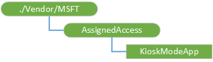

# <a name="assignedaccess-csp"></a>AssignedAccess 的 CSP


使用 AssignedAccess 配置服务提供程序 (CSP) 设置设备在 kiosk 模式下运行。 执行完 CSP 后, 展台模式与相关联的下一个用户登录将设备放在 kiosk 模式下运行 CSP 配置中指定的应用程序中。

设置设备在网亭模式下运行的分步骤指南，请参阅[设置在 Windows 10 专业、 企业或教育展台。](http://go.microsoft.com/fwlink/p/?LinkID=722211)

> **请注意** AssignedAccess CSP 只支持 Windows 10 企业和 Windows 10 教育。

 

下面的关系图以树格式显示 AssignedAccess 配置服务提供程序



<a href="" id="--vendor-msft-assignedaccess"></a>**./Vendor/MSFT/AssignedAccess**  
CSP 的根节点。

<a href="" id="assignedaccess-kioskmodeapp"></a>**AssignedAccess/KioskModeApp**  
一个 JSON 字符串，包含用户帐户名称和应用程序用户模型 ID (AUMID) 的展台模式应用程序。 有关如何获取 AUMID 的详细信息，请按照[此 Microsoft 网站](http://go.microsoft.com/fwlink/p/?LinkId=404220)中的信息。

在第 10 Windows 版本 1607，可以使用已设置的应用程序配置展台模式。 有关如何远程配置应用程序的详细信息，请参阅[企业应用程序管理](enterprise-app-management.md)。

下面是一个示例︰

``` syntax
{"Account":"redmond\\kioskuser","AUMID":"Microsoft.Windows.Contoso_cw5n1h2txyewy!Microsoft.ContosoApp.ContosoApp"}
```

在配置展台模式应用程序时，帐户名称将用于查找目标用户。 帐户名称包含域名和用户名。

> **请注意** 域名可以是可选的如果用户名称是唯一的整个系统。

 

对于本地帐户，域名应为设备名称。 在此节点上执行 Get 时，域名称总是返回在输出中。

支持的操作是添加、 删除、 获取和替换。 当没有配置时，则获取和删除方法失败。 在 kiosk 模式下应用程序的配置已存在，Add 方法将失败。 有关添加和替换的数据模式是相同的。

## <a name="examples"></a>示例


添加 KioskModeApp

``` syntax
<SyncML xmlns='SYNCML:SYNCML1.2'>
   <SyncBody>
       <Add>
           <CmdID>2</CmdID>
           <Item>
               <Target>
                   <LocURI>./Device/Vendor/MSFT/AssignedAccess/KioskModeApp</LocURI>
               </Target>
               <Meta>  
                   <Format xmlns="syncml:metinf">chr</Format>  
               </Meta>  
               <Data>{"Account":"Domain\\AccountName","AUMID":"Microsoft.WindowsCalculator_8wekyb3d8bbwe!App"}</Data>
           </Item>
       </Add>
       <Final />
   </SyncBody>
</SyncML>
```

KioskModeApp 删除

``` syntax
<SyncML xmlns='SYNCML:SYNCML1.2'>
   <SyncBody>
       <Delete>
           <CmdID>2</CmdID>
           <Item>
               <Target>
                   <LocURI>./Device/Vendor/MSFT/AssignedAccess/KioskModeApp</LocURI>
               </Target>
           </Item>
       </Delete>
       <Final />
   </SyncBody>
</SyncML>
```

KioskModeApp 获取

``` syntax
<SyncML xmlns='SYNCML:SYNCML1.2'>
   <SyncBody>
       <Get>
           <CmdID>2</CmdID>
           <Item>
               <Target>
                   <LocURI>./Device/Vendor/MSFT/AssignedAccess/KioskModeApp</LocURI>
               </Target>
           </Item>
       </Get>
       <Final />
   </SyncBody>
</SyncML>
```

KioskModeApp 替换

``` syntax
<SyncML xmlns='SYNCML:SYNCML1.2'>
   <SyncBody>
       <Replace>
           <CmdID>2</CmdID>
           <Item>
               <Target>
                   <LocURI>./Device/Vendor/MSFT/AssignedAccess/KioskModeApp</LocURI>
               </Target>
               <Meta>  
                   <Format xmlns="syncml:metinf">chr</Format>  
               </Meta>  
               <Data>{"Account":"Domain\\AccountName","AUMID":"Microsoft.WindowsAlarms_8wekyb3d8bbwe!App"}</Data>
           </Item>
       </Replace>
       <Final />
   </SyncBody>
</SyncML>
```

 

 


