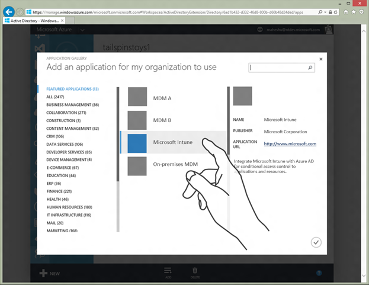
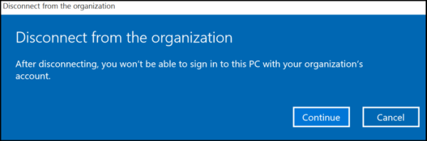

<head>
<style type='text/css'>table.topalign td {垂直对齐︰ 顶部}</style>
</head>

# <a name="azure-active-directory-integration-with-mdm"></a>与 MDM azure Active Directory 集成

Azure 的 Active Directory 是世界上最大企业云标识管理服务。 它可由数以百万计的访问 Office 365 的组织和成千上万的 Microsoft 和第三方软件的业务应用程序作为服务 (SaaS) 供应商。 许多组织 （例如存储访问或操作系统状态漫游） 用户体验 Windows 10 的丰富为基础的身份基础结构使用 Azure 的广告。 Windows 10 提供了集成式的配置熟悉 Azure 广告，允许设备在 Azure AD 中注册和登记到 MDM 平滑集成流中。

设备注册 MDM，MDM 可以强制遵守公司政策、 添加或删除应用程序，等等。 另外，MDM 可以报告设备的法规遵从性 Azure 的广告。 这使 Azure 的广告，以允许访问公司资源或通过 Azure 的广告，只向符合策略的设备安全的应用程序。 若要支持他们的 MDM 产品这些丰富的体验，MDM 供应商可与集成 Azure 的广告。 本主题描述所涉及的步骤。

## <a name="connect-to-azure-ad"></a>连接到 Azure 的广告

连接您的设备的几种方法︰

公司拥有设备︰
-   加入到传统的 Active Directory 域的 Windows
-   将 Windows 加入到 Azure 的广告

个人设备 (BYOD):
-   添加到 Windows 的 Microsoft 工作帐户

### <a name="azure-ad-join"></a>Azure AD 联接

公司拥有设备过去连接到内部部署 Active Directory 域的组织。 可以使用组策略或计算机管理软件系统中心配置管理器等来管理这些设备。 在 Windows 10，也可能是管理加入域的设备与 mdm。

Windows 10 引入了一种新方法配置和部署企业拥有的 Windows 设备。 这种机制称为 Azure AD 联接。 像传统域加入，Azure AD 连接允许设备将成为已知的并由部门管理。 但是，Azure 加入广告，与 Windows 验证身份到 Azure 的广告，而不是对域控制器进行身份验证。

Azure AD 联接还使公司拥有设备能够自动登记，并由 mdm。 此外，在购买 PC 上，可帮助企业优化其设备部署的全新体验 (OOBE) 中执行 Azure 广告加入。 管理员可以要求属于一个或多个组的用户注册他们的设备进行管理与 mdm。 如果用户被配置为需要在 Azure 广告加入自动注册，该注册成为过程的必需步骤，对 Windows 进行配置。 如果 MDM 注册失败，设备将不能加入到 Azure AD。

> **重要** 启用自动 MDM 注册使用 Azure AD 连接的每个用户必须有效的[Azure 活动目录特优](https://msdn.microsoft.com/library/azure/dn499825.aspx)许可分配。

 
### <a name="byod-scenario"></a>BYOD 方案

Windows 10 还引入了更简单的方法来配置访问工作应用程序和资源的个人设备。 用户可以将其 Microsoft 工作帐户添加到 Windows 和欣赏更简单和更安全的应用程序和资源的组织。 在此过程中，Azure 广告检测组织已经配置了 mdm。 如果是这种情况，Windows 将尝试"添加帐户"流的一部分作为注册 MDM 中的设备。 务必要注意 BYOD 情况下，用户可以拒绝使用 MDM 条款 — — 在这种情况下该设备未注册 MDM 和通常限制对企业资源的访问。

## <a name="integrated-mdm-enrollment-and-ux"></a>集成的 MDM 注册和用户体验

两个 Azure AD MDM 登记方案︰
-   加入到 Azure AD 公司拥有设备的设备
-   将工作帐户添加到个人设备 (BYOD)

在这两种情况下，Azure 广告负责验证用户和设备提供了一个经验证的唯一设备标识符，可以使用 fo MDM 注册。

在这两种情况下，注册流程提供商机的 MDM 服务呈现它是自己的 UI，使用 web 视图。 MDM 供应商才能使用这来呈现术语的使用 (TOU)，它可以是不同的公司所拥有和 BYOD 设备。 MDM 供应商还可以使用 web 视图呈现其他 UI 元素，如一次性的针，这是否属于该组织的业务流程询问。

在全新的方案中，web 视图为 100%全屏幕，使 MDM 供应商能够绘制边缘到边缘的经验。 具有很好的能力随之而来的还有大责任 ！ 它非常重要，MDM 供应商选择与集成 Azure 的广告遵守 Windows 对字母的 10 个设计准则。 这包括使用快速响应 web 设计和尊重辅助功能准则，包括前进和后退按钮，导航逻辑正确连线的窗口。 在本主题的后面部分提供了其他详细信息。

Azure 广告登记工作为 Active Directory 联合服务 (AD FS) 备有 Azure AD 帐户，您必须启用 ADFS 服务 intranet 的密码身份验证解决方案中所述\#2 在[这篇文章](http://go.microsoft.com/fwlink/?LinkId=690246)。

一旦用户具有的 Azure 的广告帐户添加到 Windows 10 和注册 MDM，便可登记管理通过**设置** &gt; **帐户** &gt; **的工作访问**。 设备管理的企业环境中或者 Azure 广告加入或 BYOD 方案很相似。

> **请注意** 用户不能删除通过**使用 access**用户界面的设备注册，因为管理被限制到 Azure 广告或帐户的工作。

 
### <a name="mdm-endpoints-involved-in-azure-ad-integrated-enrollment"></a>MDM 参与 Azure AD 集成注册的终结点

Azure AD MDM 注册是一个两步过程︰

1.  显示使用的术语，并收集用户同意的情况。

    这是使用条款的一个被动的流浏览器控件 （web 视图） 中重定向用户在哪里到 URL 的 mdm。

2.  注册该设备。

    这是活动的流，其中 Windows OMA DM 代理调用的 MDM 服务注册该设备。

若要支持 Azure 广告登记，MDM 供应商必须承载和使用条款与 MDM 注册终结点公开。

<a href="" id="terms-of-use-endpoint-"></a>**使用方终结点中的条款**   
此终结点用于通知用户他们的设备可以控制由其组织的方法。 使用条款页负责收集用户的同意的情况下，实际注册阶段开始之前。

请务必了解使用条款流与 Windows Azure 的广告是"黑箱"。 整个 web 视图将被重定向到术语使用 URL，并且用户将被重定向回后批准 （或拒绝某些情况下） 中的条款。 这种设计允许自定义不同的情况下使用其条款的 MDM 供应商 （例如，不同级别的控制应用上 BYOD 与公司拥有的设备） 或实现用户/组基于目标 （例如在某些地理区域的用户可能受到更严格的设备管理策略）。

术语的使用方终结点可用来实现其他业务逻辑，例如收集提供一次性 PIN IT 控制设备注册。 但是，MDM 供应商不得使用使用条款的流来收集用户凭据，可能会导致一种高度降低的用户体验。 它不需要，因为 MDM 集成的一部分确保 MDM 服务可以了解通过 Azure 广告所颁发的令牌。

<a href="" id="mdm-enrollment-endpoint"></a>**MDM 注册终结点**  
用户接受使用条款之后，Azure AD 中注册设备并自动 MDM 注册开始。

下面的关系图显示实际注册过程中所涉及的高级流程。 设备是第一次注册 Azure 的广告。 此过程为设备指定唯一的设备标识符，并提供能够验证自己的身份与 Azure AD （身份验证设备） 的设备。 随后，将设备登记管理与 mdm。 这是通过调用注册终结点并申请注册为用户和设备。 此时，用户已经过身份验证并注册设备并将其与 Azure AD 身份验证。 此信息可供注册终结点上出现访问令牌中的声明的形式 MDM。


MDM 预计报告设备返回到 Azure 使用[Azure 广告图形 API](http://go.microsoft.com/fwlink/p/?LinkID=613654)的广告法规的遵从性时使用此设备 (设备 ID) 的信息。 在本主题后面提供的示例报告设备法规遵从性。

## <a name="make-the-mdm-a-reliable-party-of-azure-ad"></a>使 MDM Azure 广告的可靠的当事方

参加上一节中所述的集成的注册流程，MDM 必须能够使用 Azure 广告发出的访问令牌。 对报表法规遵从性到 Azure 的广告，MDM 必须能够到 Azure AD 验证自己的身份和获得授权，使它可以调用[Azure 广告图形 API](http://go.microsoft.com/fwlink/p/?LinkID=613654)访问令牌的形式。

### <a name="add-a-cloud-based-mdm"></a>添加基于云的 MDM

基于云的 MDM 是提供设备管理功能，在云中的 SaaS 应用程序。 它是多租户应用程序。 此应用程序注册 Azure 广告在 MDM 供应商住宅租户。 当 IT 管理员决定使用此 MDM 解决方案时，此应用程序的实例由在客户组织中可见。

MDM 供应商首先必须在其住宅租户中注册应用程序并将其标记为多租户应用程序。 这里从 GitHub 解释如何添加到 Azure 广告， [WepApp 的 WebAPI-MultiTenant-OpenIdConnect-最低](http://go.microsoft.com/fwlink/p/?LinkId=613661)的多租户应用程序的代码示例。

> **请注意** MDM 提供程序，如果您没有现有的 Azure AD tentant 订阅了 Azure 的广告管理，请按照[添加 Azure AD 租户和 Azure 广告订阅](add-an-azure-ad-tenant-and-azure-ad-subscription.md)设置一个租户、 添加订阅，并通过 Azure 门户管理它的分步指南。

 
MDM 应用程序用于从 Azure 的广告请求访问令牌的密钥管理和对个别客户不可见的 MDM 供应商组织内。 多租户 MDM 应用程序使用相同的密钥来验证自己的身份与 Azure 的广告，而不考虑客户 tenent，属于被管理的设备。

使用以下步骤向基于云的 MDM 应用程序注册 Azure 的广告。 此时，您需要使用 Azure 的广告工程团队公开此应用程序通过 Azure AD 应用程序库。

1.  到 Azure 管理门户，您家庭的租户在使用管理员帐户登录。
2.  在左侧的导航中，单击**活动目录**。
3.  单击想要注册的应用程序目录租户。
    
    请确保您已登录到您的家庭组织。
4.  单击**应用程序**选项卡。
5.  在抽屉里，单击**添加**。
6.  单击**添加我的公司正在开发的应用程序**。
7.  输入应用程序中，如 ContosoMDM 的友好名称，选择**Web 应用程序和 Web API**，然后单击**下一步**。
8.  输入您的 MDM 服务的登录 URL。
9.  为应用程序 ID，输入**https://&lt;您\_租户\_名称&gt;/ContosoMDM**，然后单击确定。
10. 虽然仍然在 Azure 的门户中，单击您的应用程序的**配置**选项卡。
11. 将标记为**多租户**应用程序。
12. 查找客户端 ID 值并将其复制。

    配置您的应用程序时，您将从以后需要它。 在获取访问令牌时使用此客户端 ID 和添加到 Azure AD 应用程序库的应用程序。
13. 为您的应用程序生成密钥并将其复制。

    您将需要此调用报告设备符合 Azure 广告图形 API。 在后续章节中介绍。

有关如何注册 Azure 广告示例应用程序的详细信息，请参阅在[NativeClient 最低](http://go.microsoft.com/fwlink/p/?LinkId=613667)注册**TodoListService Web API**的步骤

### <a name="add-an-on-premises-mdm"></a>添加内部 MDM

内部部署 MDM 应用程序就是本质不同的云 mdm。 它是唯一的客户组织内有一个单租户应用程序。 因此，客户必须添加应用程序直接在他们自己的组织。 此外，内部 MDM 应用程序的每个实例必须单独注册和已使用单独的密钥进行验证所使用 Azure 的广告。

添加到其组织内部 MDM 客户体验是类似于为基于云的 mdm。 在 Azure 的广告应用程序库添加内部 MDN 租户和管理员可以配置所需的 Url 注册和使用条款中没有项。

内部部署 MDM 产品必须公开，管理员可以提供客户端 ID、 应用程序 ID 和在其目录中为该 MDM 应用程序配置的密钥的配置体验。 您可以使用此客户端 ID 和密钥请求令牌从 Azure AD 时报告设备法规遵从性。

有关使用 Azure AD 注册应用程序的详细信息，请参阅[基础知识的注册 Azure 广告中的应用程序](http://go.microsoft.com/fwlink/p/?LinkId=613671)。

### <a name="key-management-and-security-guidelines"></a>密钥管理和安全准则

MDM 服务所使用的应用程序键是一种敏感的资源。 他们应受保护并定期转存为更高的安全性。 获得通过 MDM 服务调用的 Azure 广告图形 API 的访问令牌是持有者标记并应受到保护，以免未经授权的泄漏。

安全性最佳操作，请参阅[Windows Azure 安全要点](http://go.microsoft.com/fwlink/p/?LinkId=613715)。

您可以的翻转的应用程序键使用基于云的 MDM 服务不需要客户交互。 跨所有由其 Azure AD 租户的 MDM 供应商托管的客户承租人没有一组键。

对于内部部署 MDM，和这些密钥用于验证使用 Azure 广告客户组织内移动客户的管理员必须滚。 在这种情况下，您应该向有关滚动和保护提高了安全性的关键客户提供指导。

## <a name="publish-your-mdm-app-to-azure-ad-app-gallery"></a>将您的 MDM 应用程序发布到 AD Azure 应用程序库


IT 管理员使用 Azure AD 应用程序库添加为其组织的 MDM 使用。 应用程序库是一套丰富的超过 2400 SaaS 应用程序集成在一起 Azure 的广告。

下图举例说明如何 MDM 应用程序就会显示在类别专用于 MDM 软件中的 Azure 应用程序库。



### <a name="add-cloud-based-mdm-to-the-app-gallery"></a>将基于云的 MDM 添加到应用程序库

基于云的 MDM 应用程序是否应使用 Azure 的广告工程团队。 下表显示了所需的信息以 AD Azure 应用程序库中创建一个条目。

<table> 
<colgroup>
<col width="50%" />
<col width="50%" />
</colgroup>
<thead>
<tr class="header">
<th>项目</th>
<th>说明</th>
</tr>
</thead>
<tbody>
<tr class="odd">
<td style="vertical-align:top"><p><strong>应用程序 ID</strong></p></td>
<td style="vertical-align:top"><p>MDM 应用程序在您的组织配置，则客户端 ID。 这是多租户应用程序的唯一标识符。</p></td>
</tr>
<tr class="even">
<td style="vertical-align:top"><p><strong>Publisher</strong></p></td>
<td style="vertical-align:top"><p>一个字符串，标识应用程序的发行者。</p></td>
</tr>
<tr class="odd">
<td style="vertical-align:top"><p><strong>应用程序的 URL</strong></p></td>
<td style="vertical-align:top"><p>其中您管理员可以 MDM 应用程序有关的详细信息，并包含指向您的应用程序的登录页的链接的应用程序的登录页的 URL。 实际登记，不使用此 URL。</p></td>
</tr>
<tr class="even">
<td style="vertical-align:top"><p><strong>说明</strong></p></td>
<td style="vertical-align:top"><p>简要描述 MDM 应用程序，它必须超过 255 个字符。</p></td>
</tr>
<tr class="odd">
<td style="vertical-align:top"><p><strong>图标</strong></p></td>
<td style="vertical-align:top"><p>一套徽标 MDM 应用程序的图标。 尺寸︰ 45 X 45、 150 X 122、 214 X 215</p></td>
</tr>
</tbody>
</table>

 
### <a name="add-on-premises-mdm-to-the-app-gallery"></a>将内部 MDM 添加到应用程序库

没有特殊的要求，将内部 MDM 添加到应用程序库。没有管理员将应用程序添加到其租户的一般项。

但是，密钥管理是不同的内部 mdm。 您必须获取的客户端 ID (应用程序 ID) 和密钥分配给 MDM 应用程序内客户的租户。 这些用来获取授权访问 Azure 广告图形 API 和报告设备法规遵从性。

## <a name="themes"></a>主题

通过 MDM 作为集成的注册过程的一部分呈现的网页必须使用 Windows 10 模板 （[下载 Windows 10 模板和 CSS 文件](http://download.microsoft.com/download/3/E/5/3E535D52-6432-47F6-B460-4E685C5D543A/MDM-ISV_1.1.3.zip)）。 这是重要的注册过程中的所有页面边缘到边缘的 HTML 页在哪里的 OOBE Azure 广告加入体验。 不要尝试复制模板，因为您将永远不会获得按钮放置正确。 使用共享的 Windows 10 模板确保为客户提供无缝体验。

有 3 个不同的方案︰

1.  MDM 注册 Azure 广告加入 Windows OOBE 的一部分。
2.  MDM 注册，属于 Azure 加入广告之后从**设置**Windows OOBE。
3.  在添加 Microsoft MDM 注册工作 (BYOD) 的个人设备上的帐户。

方案 1、 2 和 3 有 Windows 10 专业、 Windows 10 企业和 Windows 10 教育。 方案 1 和 3 位于 Windows 10 移动。 方案 1 的支持已添加 Windows 10 手机，1511年版本。

由 Microsoft 提供的 CSS 文件包含版本信息，我们建议使用最新版本。 有单独的 CSS 文件，对于桌面和移动设备，OOBE，和开机自检 OOBE 经验。 [下载 Windows 10 模板和 CSS 文件](http://download.microsoft.com/download/3/E/5/3E535D52-6432-47F6-B460-4E685C5D543A/MDM-ISV_1.1.3.zip)。

### <a name="using-themes"></a>使用主题

MDM 页必须遵守在一定条件下，将显示预定义的主题。 例如，如果 CXH HOSTHTTP 标头 FRX，OOBE 情况，页面必须支持深蓝色背景颜色，使用 WinJS 文件 Ui dark.css 为 4.0 和 oobe desktop.css 版本 1.0.4 主题。

<table>
<colgroup>
<col width="20%" />
<col width="20%" />
<col width="20%" />
<col width="20%" />
<col width="20%" />
</colgroup>
<thead>
<tr class="header">
<th>CXH 主机 （HTTP 标头）</th>
<th>Senario</th>
<th>背景主题</th>
<th>WinJS</th>
<th>CSS 的方案</th>
</tr>
</thead>
<tbody>
<tr class="odd">
<td style="vertical-align:top">FRX</td>
<td style="vertical-align:top">OOBE</td>
<td style="vertical-align:top">深色的主题 + 蓝色背景色</td>
<td style="vertical-align:top">文件名︰ Ui-dark.css</td>
<td style="vertical-align:top">文件名︰ oobe dekstop.css</td>
</tr>
<tr class="even">
<td style="vertical-align:top">MOSET</td>
<td style="vertical-align:top">设置 /
<p>开机自检 OOBE</p></td>
<td style="vertical-align:top">浅的主题</td>
<td style="vertical-align:top">文件名︰ Ui-light.css</td>
<td style="vertical-align:top">文件名︰ 设置 desktop.css</td>
</tr>
</tbody>
</table>

 
## <a name="terms-of-use-protocol-semantics"></a>使用协议语义的条款

MDM 服务器所承载的术语的使用方终结点。 在 Azure 广告加入协议流，Windows 将执行整页重定向到此终结点。 这样每台 MDM 显示的条款和条件的应用，使用户可以接受或拒绝与注册相关的条款。 用户接受条款之后，MDM 重定向回 Windows，以便继续完成注册过程。

### <a name="redirect-to-the-terms-of-use-endpoint"></a>将重定向到条款的使用方终结点

这是整页重定向到用户的条款终结点承载的 mdm。 下面是一个示例 URL，https:<span></span>/ / fabrikam.contosomdm.com/TermsOfUse。

在查询字符串中传递以下参数︰

<table>
<colgroup>
<col width="50%" />
<col width="50%" />
</colgroup>
<thead>
<tr class="header">
<th>项目</th>
<th>说明</th>
</tr>
</thead>
<tbody>
<tr class="odd">
<td style="vertical-align:top"><p>redirect_uri</p></td>
<td style="vertical-align:top"><p>用户接受或拒绝使用术语后，用户被重定向到此 URL。</p></td>
</tr>
<tr class="even">
<td style="vertical-align:top"><p>客户端请求 id</p></td>
<td style="vertical-align:top"><p>一个被用来进行诊断和调试日志关联的 GUID。 使用此参数记录或跟踪状态的注册申请，这有助于找到发生失败的根本原因。</p></td>
</tr>
<tr class="odd">
<td style="vertical-align:top"><p>api 版本</p></td>
<td style="vertical-align:top"><p>指定客户端所请求的协议版本。 这提供了一种支持的协议版本修订的机制。</p></td>
</tr>
<tr class="even">
<td style="vertical-align:top"><p>模式</p></td>
<td style="vertical-align:top"><p>指定该设备是公司拥有时模式 = azureadjoin。 此参数不存在 BYOD 设备。</p></td>
</tr>
</tbody>
</table>

 
### <a name="access-token"></a>访问令牌

持有者访问令牌颁发的 Azure AD 传入的 HTTP 请求的身份验证头。 这是一种典型的格式︰

**授权︰ 载体**CI6MTQxmCF5xgu6yYcmV9ng6vhQfaJYw...

下面的声明预计由 Windows 传递到条款的使用方终结点的访问令牌︰

<table>
<colgroup>
<col width="50%" />
<col width="50%" />
</colgroup>
<thead>
<tr class="header">
<th>项目</th>
<th>说明</th>
</tr>
</thead>
<tbody>
<tr class="odd">
<td style="vertical-align:top"><p>对象 ID</p></td>
<td style="vertical-align:top"><p>对应于通过身份验证的用户的用户对象的标识符。</p></td>
</tr>
<tr class="even">
<td style="vertical-align:top"><p>UPN</p></td>
<td style="vertical-align:top"><p>索赔包含身份验证的用户的用户主体名称 (UPN)。</p></td>
</tr>
<tr class="odd">
<td style="vertical-align:top"><p>TID</p></td>
<td style="vertical-align:top"><p>声明表示租户的租户 ID。 在上面的示例中，它是 Fabrikam。</p></td>
</tr>
<tr class="even">
<td style="vertical-align:top"><p>资源</p></td>
<td style="vertical-align:top"><p>净化的 URL 表示的 MDM 应用程序。 例如，https:<span></span>/ / fabrikam.contosomdm.com。</p></td>
</tr>
</tbody>
</table>
 
> **请注意** 没有该设备可能尚未登记这一次因为 ID 声称在访问令牌中的设备。

 
若要检索的用户的组成员身份列表，可以使用[Azure 广告图形 API](http://go.microsoft.com/fwlink/p/?LinkID=613654)。

下面是一个示例 URL。

``` syntax
https://fabrikam.contosomdm.com/TermsOfUse?redirect_uri=ms-appx-web://ContosoMdm/ToUResponse&client-request-id=34be581c-6ebd-49d6-a4e1-150eff4b7213&api-version=1.0
Authorization: Bearer eyJ0eXAiOi
```

MDM 需要验证以确保它签发 Azure 的广告，并确保该收件人是合适的访问令牌的签名。

### <a name="terms-of-use-content"></a>使用内容的条款

MDM 可能会执行其他额外的重定向为必要之前向用户显示的使用条款的内容。 相应的使用条款的内容应该返回到调用方 (Windows)，以便它可以向最终用户的浏览器控件中显示。

使用条款的内容应该包含下列按钮︰

-   **接受**的用户接受使用条款，并继续注册。
-   **拒绝**-用户拒绝并停止注册进程。

使用条款的内容必须与用于其他网页在此过程中呈现的主题保持一致。

### <a name="terms-of-use-endpoint-processing-logic"></a>使用方终结点处理逻辑中的条款

在这种情况下，用户就显示在 OOBE 期间或设置专业经验的使用条款的网页上。 用户具有页面上的下列选项︰

-   **用户单击接受按钮**-MDM 必须重定向到指定重定向 URI\_中传入请求的 uri 参数。 将下面的查询字符串参数︰
    -   **IsAccepted** -必须为此必填字段的布尔值为 true。
    -   **OpaqueBlob** -如果用户接受所需的参数。 MDM 使用此生成注册终结点到提供一些信息。 值保存在此处可注册终结点不变。 MDM 可能为相关目的使用此参数。
    -   下面是示例重定向-ms-appx-web://MyApp1/ToUResponse?OpaqueBlob = 值 & IsAccepted = true
-   **用户单击拒绝按钮上**的 MDM 必须重定向到指定在重定向 URI\_在传入请求的 uri。 将下面的查询字符串参数︰
    -   **IsAccepted** -此必需的布尔值必须设置为 false。 如果用户跳过使用的术语也适用。
    -   **OpaqueBlob** -此参数不需要使用，因为登记停止，向用户显示一条错误消息。

他们正在为他们的设备添加 Microsoft 工作帐户时，用户跳过使用条款。 但是，然后无法跳过它在 Azure 广告加入过程。 拒绝按钮不能显示在 Azure 广告加入过程中因为如果 Azure AD 连接的管理员配置，不能由用户已拒绝的 MDM 注册。

我们建议您发送的客户端请求 id 参数在查询字符串中作为此重定向响应的一部分。

### <a name="terms-of-use-error-handling"></a>术语的使用错误处理

如果使用处理条款期间遇到错误，MDM 可返回两个参数--错误，错误\_描述其重定向请求中的参数返回到 Windows。 注意应编码 URL，并错误的内容\_说明应以英文纯文本。 此文本不显示给最终用户，因此，错误描述文本的本地化并不是问题。

以下是 URL 格式︰

``` syntax
HTTP/1.1 302
Location:
<redirect_uri>?error=access_denied&error_description=Access%20is%20denied%2E


Example:
HTTP/1.1 302 
Location: ms-appx-web://App1/ToUResponse?error=access_denied&error_description=Acess%20is%20denied%2E
```

下表显示的错误代码。

<table>
<colgroup>
<col width="25%" />
<col width="25%" />
<col width="25%" />
<col width="25%" />
</colgroup>
<thead>
<tr class="header">
<th>原因</th>
<th>HTTP 状态</th>
<th>错误</th>
<th>说明</th>
</tr>
</thead>
<tbody>
<tr class="odd">
<td style="vertical-align:top"><p>api 版本</p></td>
<td style="vertical-align:top"><p>302</p></td>
<td style="vertical-align:top"><p>invalid_request</p></td>
<td style="vertical-align:top"><p>不支持的版本</p></td>
</tr>
<tr class="even">
<td style="vertical-align:top"><p>租户或用户数据是 missingor 其他所需设备登记的前提条件不满足</p></td>
<td style="vertical-align:top"><p>302</p></td>
<td style="vertical-align:top"><p>unauthorized_client</p></td>
<td style="vertical-align:top"><p>未经授权的用户或租户</p></td>
</tr>
<tr class="odd">
<td style="vertical-align:top"><p>Azure AD 标记验证失败</p></td>
<td style="vertical-align:top"><p>302</p></td>
<td style="vertical-align:top"><p>unauthorized_client</p></td>
<td style="vertical-align:top"><p>unauthorized_client</p></td>
</tr>
<tr class="even">
<td style="vertical-align:top"><p>内部服务错误</p></td>
<td style="vertical-align:top"><p>302</p></td>
<td style="vertical-align:top"><p>server_error</p></td>
<td style="vertical-align:top"><p>内部服务错误</p></td>
</tr>
</tbody>
</table>

 
## <a name="enrollment-protocol-with-azure-ad"></a>注册协议与 Azure 的广告

使用 Azure 集成 MDM 注册，有没有发现阶段，搜索 URL 直接传递给系统从 Azure。 下表显示比较结果之间传统和 Azure 的招生名额。

<table>
<colgroup>
<col width="25%" />
<col width="25%" />
<col width="25%" />
<col width="25%" />
</colgroup>
<thead>
<tr class="header">
<th>详细信息</th>
<th>传统的 MDM 注册</th>
<th>Azure AD 联接 （企业所拥有的设备）</th>
<th>Azure 广告添加工作帐户 （用户所拥有的设备）</th>
</tr>
</thead>
<tbody>
<tr class="odd">
<td style="vertical-align:top"><p>MDM 自动搜索使用的电子邮件地址来检索 MDM 搜索 URL</p></td>
<td style="vertical-align:top"><p>注册</p></td>
<td style="vertical-align:top"><p>不适用</p>
<p>搜索 URL 设置 Azure 中</p></td>
<td style="vertical-align:top"><p></p></td>
</tr>
<tr class="even">
<td style="vertical-align:top"><p>使用 MDM 搜索 URL</p></td>
<td style="vertical-align:top"><p>注册</p>
<p>注册续订</p>
<p>ROBO</p></td>
<td style="vertical-align:top"><p>注册</p>
<p>注册续订</p>
<p>ROBO</p></td>
<td style="vertical-align:top"><p>注册</p>
<p>注册续订</p>
<p>ROBO</p></td>
</tr>
<tr class="odd">
<td style="vertical-align:top"><p>将所需的 MDM 注册？</p></td>
<td style="vertical-align:top"><p>是</p></td>
<td style="vertical-align:top"><p>是</p></td>
<td style="vertical-align:top"><p>否</p>
<p>用户可以拒绝。</p></td>
</tr>
<tr class="even">
<td style="vertical-align:top"><p>身份验证类型</p></td>
<td style="vertical-align:top"><p>OnPremise</p>
<p>联合</p>
<p>证书</p></td>
<td style="vertical-align:top"><p>联合</p></td>
<td style="vertical-align:top"><p>联合</p></td>
</tr>
<tr class="odd">
<td style="vertical-align:top"><p>EnrollmentPolicyServiceURL</p></td>
<td style="vertical-align:top"><p>可选 （所有授权机构）</p></td>
<td style="vertical-align:top"><p>可选 （所有授权机构）</p>
<p></p></td>
<td style="vertical-align:top"><p>可选 （所有授权机构）</p>
<p></p></td>
</tr>
<tr class="even">
<td style="vertical-align:top"><p>EnrollmentServiceURL</p></td>
<td style="vertical-align:top"><p>必需的 （所有授权机构）</p></td>
<td style="vertical-align:top"><p>使用 （所有授权机构）</p></td>
<td style="vertical-align:top"><p>使用 （所有授权机构）</p></td>
</tr>
<tr class="odd">
<td style="vertical-align:top"><p>EnrollmentServiceURL 包括操作系统版本、 操作系统平台和由 MDM 搜索 URL 提供其他属性</p></td>
<td style="vertical-align:top"><p>强烈建议</p></td>
<td style="vertical-align:top"><p>强烈建议</p></td>
<td style="vertical-align:top"><p>强烈建议</p></td>
</tr>
<tr class="even">
<td style="vertical-align:top"><p>使用 AuthenticationServiceURL</p></td>
<td style="vertical-align:top"><p>使用 （联盟授权机构）</p></td>
<td style="vertical-align:top"><p>跳过</p></td>
<td style="vertical-align:top"><p>跳过</p></td>
</tr>
<tr class="odd">
<td style="vertical-align:top"><p>BinarySecurityToken</p></td>
<td style="vertical-align:top"><p>自定义每个 MDM</p></td>
<td style="vertical-align:top"><p>Azure 颁发的 AD 标记</p></td>
<td style="vertical-align:top"><p>Azure 颁发的 AD 标记</p></td>
</tr>
<tr class="even">
<td style="vertical-align:top"><p>EnrollmentType</p></td>
<td style="vertical-align:top"><p>完整的</p></td>
<td style="vertical-align:top"><p>设备</p></td>
<td style="vertical-align:top"><p>完整的</p></td>
</tr>
<tr class="odd">
<td style="vertical-align:top"><p>注册的证书类型</p></td>
<td style="vertical-align:top"><p>用户证书</p></td>
<td style="vertical-align:top"><p>设备证书</p></td>
<td style="vertical-align:top"><p>用户证书</p></td>
</tr>
<tr class="even">
<td style="vertical-align:top"><p>注册的证书存储区</p></td>
<td style="vertical-align:top"><p>我 / 用户</p></td>
<td style="vertical-align:top"><p>我 / 系统</p></td>
<td style="vertical-align:top"><p>我 / 用户</p></td>
</tr>
<tr class="odd">
<td style="vertical-align:top"><p>CSR 主题名称</p></td>
<td style="vertical-align:top"><p>用户主要名称</p></td>
<td style="vertical-align:top"><p>设备 ID</p></td>
<td style="vertical-align:top"><p>用户主要名称</p></td>
</tr>
<tr class="even">
<td style="vertical-align:top"><p>作为 EnrollmentServiceURL 的 AdditionalContext EnrollmentData 使用条款二进制 blob</p></td>
<td style="vertical-align:top"><p>不受支持</p></td>
<td style="vertical-align:top"><p>支持</p></td>
<td style="vertical-align:top"><p>支持</p></td>
</tr>
<tr class="odd">
<td style="vertical-align:top"><p>Csp 可以访问注册时</p></td>
<td style="vertical-align:top"><p>Windows 10 支持︰</p>
<ul>
<li>DMClient</li>
<li>CertificateStore</li>
<li>RootCATrustedCertificates</li>
<li>ClientCertificateInstall</li>
<li>EnterpriseModernAppManagement</li>
<li>PassportForWork</li>
<li>策略</li>
<li>w7 应用程序</li>
</ul>
<p>传统的支持︰</p>
<ul>
<li>EnterpriseAppManagement (Windows Phone 8.1)</li>
</ul></td>
<td style="vertical-align:top"><p>与传统的 MDM 注册相同</p></td>
<td style="vertical-align:top"><p>与传统的 MDM 注册相同</p></td>
</tr>
</tbody>
</table>

 

## <a name="management-protocol-with-azure-ad"></a>使用 Azure AD 管理协议

有两种不同 MDM 的注册类型利用 Azure 广告与集成，因此请使用 Azure AD 用户和设备身份。 根据注册类型中，MDM 服务可能需要管理单个用户或多个用户。

<a href="" id="multiple-user-management-for-azure-ad-joined-devices"></a>**多个用户管理 Azure 广告连接设备**  
在 MDM 注册适用于每个 Azure 广告这种情况下登录到 Azure AD 用户连接设备-设备注册或多用户调用此注册类型。 管理服务器可以确定用户身份、 断定哪些策略将针对该用户，并发送给该设备的相应策略。 若要允许管理服务器标识当前用户登录到该设备，OMA DM 客户端使用 Azure AD 用户令牌。 每个管理会话包含额外的 HTTP 标头包含 Azure AD 用户令牌。 发送到管理服务器的 DM 包中提供了此信息。 但是，在某些情况下 Azure AD 用户令牌不通过发送到管理服务器。 MDM 注册 Azure AD 连接过程完成后立即会发生这样的方案之一。 直到 Azure 广告加入过程完毕和 Azure AD 用户登录到计算机上，不是 OMA DM 进程可用的 Azure AD 用户令牌。 通常在 Azure AD 用户登录到计算机并 Azure AD 用户令牌不包含初始管理会话之前，将完成 MDM 注册。 管理服务器应该检查如果令牌丢失，并只在这种情况下发送设备策略。 访客用户登录到该设备上时的 OMA DM 有效负载中缺少 Azure AD 标记另一个可能的原因。

<a href="" id="adding-a-work-account-and-mdm-enrollment-to-a-device"></a>**添加到设备的工作帐户和 MDM 注册**  
在这种情况下，每台 MDM 注册对最初添加他工作帐户和注册设备的单个用户。 在此注册类型管理服务器可以忽略可能通过管理会话期间发送的 Azure AD 标记。 是否 Azure AD 标记已存在或缺失，管理服务器将向该设备发送用户和设备的策略。

<a href="" id="evaluating-azure-ad-user-tokens"></a>**评估 Azure AD 用户令牌**  
Azure AD 标记是 HTTP 授权标头以下面的格式︰

``` syntax
Authorization:Bearer <Azure AD User Token Inserted here>
```

其他索赔中可能存在的 Azure AD 标记，如︰

-   用户-用户当前登录
-   设备法规遵从性-设置值到 Azure 的 MDM 服务
-   设备 ID 的标识所签入的设备
-   租户 ID

访问令牌颁发者 Azure 的广告是 JSON web 标记 (JWTs)。 Windows 提供有效 JWT 标记 MDM 注册终结点要启动注册过程。 有几个选项，来评估这些标记︰

-   WIF 的 JWT 标记处理程序扩展名用于验证访问令牌的内容和提取所需使用的声明。 有关详细信息，请参阅[JSON Web 标记处理程序](http://go.microsoft.com/fwlink/p/?LinkId=613820)。
-   请参阅将 Azure AD 身份验证代码示例获取访问令牌所使用的一个示例。 有关示例，请参见[NativeClient 最低](http://go.microsoft.com/fwlink/p/?LinkId=613667)。

## <a name="device-alert-1224-for-azure-ad-user-token"></a>设备报警 1224 Azure AD 用户令牌

DM 会话启动并且没有 Azure AD 用户登录时，会发出警报。 该警报发送的 OMA DM pkg\#1。 下面是一个示例︰

``` syntax
Alert Type: com.microsoft/MDM/AADUserToken
 
Alert sample: 
<SyncBody> 
 <Alert> 
  <CmdID>1</CmdID> 
  <Data>1224</Data> 
  <Item> 
   <Meta> 
    <Type xmlns=”syncml:metinf”>com.microsoft/MDM/AADUserToken</Type> 
    <Format xmlns=”syncml:metinf”>chr</Format> 
   </Meta> 
   <Data>UserToken inserted here</Data> 
  </Item> 
 </Alert> 
 … other xml tags … 
</SyncBody> 
```

## <a name="determine-when-a-user-is-logged-in-through-polling"></a>确定当用户登录时通过轮询

通知是发送到 DM 包中的每台 MDM 服务器\#1。

-   警报类型-com.microsoft/MDM/LoginStatus
-   警报格式-chr
-   警报数据-提供登录状态当前登录用户的活动信息。
    -   登录用户具有 Azure 的广告帐户的预定义的文本︰ 用户。
    -   在 Azure 的广告帐户的预定义的文本没有用户登录︰ 其他人。
    -   不活动的用户的预定义的文本︰ 无

下面是一个示例。

``` syntax
<SyncBody> 
 <Alert> 
  <CmdID>1</CmdID> 
  <Data>1224</Data> 
  <Item> 
   <Meta> 
    <Type xmlns=”syncml:metinf”>com.microsoft/MDM/LoginStatus</Type> 
    <Format xmlns=”syncml:metinf”>chr</Format> 
   </Meta> 
   <Data>user</Data> 
  </Item> 
 </Alert> 
 … other xml tags … 
</SyncBody>
```

## <a name="report-device-compliance-to-azure-ad"></a>报告设备符合 Azure 的广告

一旦设备注册与管理 MDM，设备上强制公司由 IT 管理员配置的策略。 通过 MDM 计算并接着报告到 Azure 广告设备符合配置的策略。 本节介绍可用于设备的法规遵从性状态报告到 Azure 广告图形 API 调用。

有关的示例，演示如何 MDM 可以获得使用 OAuth 2.0 客户端访问令牌\_凭据授予类型，请参阅[守护程序\_CertificateCredential 最低](http://go.microsoft.com/fwlink/p/?LinkId=613822)。

-   **基于云的 MDM** -如果您的产品是基于云的多租户 MDM 服务，您必须配置为您组织中服务的单个密钥。 使用此密钥对 Azure 的广告，有的 MDM 服务进行身份验证才能获得授权。
-   **内部 MDM** -如果您的产品的内部部署 MDM，客户必须将配置为您的产品密钥用于验证使用 Azure 的广告。 这是因为每个 MDM 产品的内部部署实例具有不同的特定于租户的密钥。 为此目的，您可能需要公开在 MDM 产品，使管理员可以指定要用于使用 Azure AD 身份验证密钥的配置体验。

### <a name="use-azure-ad-graph-api"></a>使用 Azure 广告图形 API

下面的示例 REST API 调用说明 MDM 使用 Azure 广告图形 API 对报表法规遵从性状态，目前由其管理的设备的方式。

``` syntax
Sample Graph API Request: 

PATCH https://graph.windows.net/contoso.com/devices/db7ab579-3759-4492-a03f-655ca7f52ae1?api-version=beta HTTP/1.1 
Authorization: Bearer eyJ0eXAiO……… 
Accept: application/json 
Content-Type: application/json 
{  “isManaged”:true,  
   “isCompliant”:true 
} 
```

其中：

-   **contoso.com** – 这是 Azure AD 租户的设备已加入到其目录的名称。
-   **db7ab579-3759-4492-a03f-655ca7f52ae1** – 这是到 Azure AD 报告其法规遵从性信息的设备的设备标识符。
-   **eyJ0eXAiO**... – 这是 Azure 广告由发给授权 MDM Azure 广告图形 API 调用 MDM 的持有者访问令牌。 访问令牌被放在请求的 HTTP 身份验证头。
-   **isManaged**和**isCompliant** -这些布尔属性指示符合性状态。
-   正在请求**api 版本**-使用此参数来指定哪个版本的 graph API。

响应︰

-   成功-HTTP 204 无内容。
-   失败/错误-HTTP 404 未找到。 如果找不到指定的设备或租户，则可能会返回此错误。

## <a name="data-loss-during-unenrollment-from-azure-active-directory-join"></a>从 Azure 活动目录加入注销期间的数据丢失

当用户注册到 MDM 通过 Azure 活动目录加入，然后断开连接注册时，系统不会警告用户将丢失窗口信息保护 (WIP) 的数据。 断开连接消息不指明 WIP 数据的丢失。



## <a name="error-codes"></a>错误代码

<table>
<colgroup>
<col width="33%" />
<col width="33%" />
<col width="33%" />
</colgroup>
<thead>
<tr class="header">
<th>代码</th>
<th>ID</th>
<th>错误消息</th>
</tr>
</thead>
<tbody>
<tr class="odd">
<td style="vertical-align:top">0x80180001</td>
<td style="vertical-align:top">&quot;idErrorServerConnectivity&quot;，/ / MENROLL_E_DEVICE_MESSAGE_FORMAT_ERROR</td>
<td style="vertical-align:top"><p>与服务器通信时出错。 您可以尝试再次执行此操作，或与系统管理员联系，错误代码为 {0}</p></td>
</tr>
<tr class="even">
<td style="vertical-align:top">0x80180002</td>
<td style="vertical-align:top">&quot;idErrorAuthenticationFailure&quot;，/ / MENROLL_E_DEVICE_AUTHENTICATION_ERROR</td>
<td style="vertical-align:top"><p>您的帐户或设备进行身份验证时出错。 您可以尝试再次执行此操作，或与系统管理员联系，错误代码为 {0}。</p></td>
</tr>
<tr class="odd">
<td style="vertical-align:top">0x80180003</td>
<td style="vertical-align:top">&quot;idErrorAuthorizationFailure&quot;，/ / MENROLL_E_DEVICE_AUTHORIZATION_ERROR</td>
<td style="vertical-align:top"><p>未授权此用户注册。 您可以尝试再次执行此操作，或与系统管理员联系，错误代码为 {0}。</p></td>
</tr>
<tr class="even">
<td style="vertical-align:top">0x80180004</td>
<td style="vertical-align:top">&quot;idErrorMDMCertificateError&quot;，/ / MENROLL_E_DEVICE_CERTIFCATEREQUEST_ERROR</td>
<td style="vertical-align:top"><p>证书时出错。 您可以尝试再次执行此操作，或与系统管理员联系，错误代码为 {0}。</p></td>
</tr>
<tr class="odd">
<td style="vertical-align:top">0x80180005</td>
<td style="vertical-align:top">&quot;idErrorServerConnectivity&quot;，/ / MENROLL_E_DEVICE_CONFIGMGRSERVER_ERROR</td>
<td style="vertical-align:top"><p>与服务器通信时出错。 您可以尝试再次执行此操作，或与系统管理员联系，错误代码为 {0}</p></td>
</tr>
<tr class="even">
<td style="vertical-align:top">0x80180006</td>
<td style="vertical-align:top">&quot;idErrorServerConnectivity&quot;，/ / MENROLL_E_DEVICE_CONFIGMGRSERVER_ERROR</td>
<td style="vertical-align:top"><p>与服务器通信时出错。 您可以尝试再次执行此操作，或与系统管理员联系，错误代码为 {0}</p></td>
</tr>
<tr class="odd">
<td style="vertical-align:top">0x80180007</td>
<td style="vertical-align:top">&quot;idErrorAuthenticationFailure&quot;，/ / MENROLL_E_DEVICE_INVALIDSECURITY_ERROR</td>
<td style="vertical-align:top"><p>您的帐户或设备进行身份验证时出错。 您可以尝试再次执行此操作，或与系统管理员联系，错误代码为 {0}。</p></td>
</tr>
<tr class="even">
<td style="vertical-align:top">0x80180008</td>
<td style="vertical-align:top">&quot;idErrorServerConnectivity&quot;，/ / MENROLL_E_DEVICE_UNKNOWN_ERROR</td>
<td style="vertical-align:top"><p>与服务器通信时出错。 您可以尝试再次执行此操作，或与系统管理员联系，错误代码为 {0}</p></td>
</tr>
<tr class="odd">
<td style="vertical-align:top">0x80180009</td>
<td style="vertical-align:top">&quot;idErrorAlreadyInProgress&quot;，/ / MENROLL_E_ENROLLMENT_IN_PROGRESS</td>
<td style="vertical-align:top"><p>另一个注册正在进行中。 您可以尝试再次执行此操作，或与系统管理员联系，错误代码为 {0}。</p></td>
</tr>
<tr class="even">
<td style="vertical-align:top">0x8018000A</td>
<td style="vertical-align:top">&quot;idErrorMDMAlreadyEnrolled&quot;，/ / MENROLL_E_DEVICE_ALREADY_ENROLLED</td>
<td style="vertical-align:top"><p>已注册该设备。 您可以联系您的系统管理员，错误代码为 {0}。</p></td>
</tr>
<tr class="odd">
<td style="vertical-align:top">0x8018000D</td>
<td style="vertical-align:top">&quot;idErrorMDMCertificateError&quot;，/ / MENROLL_E_DISCOVERY_SEC_CERT_DATE_INVALID</td>
<td style="vertical-align:top"><p>证书时出错。 您可以尝试再次执行此操作，或与系统管理员联系，错误代码为 {0}。</p></td>
</tr>
<tr class="even">
<td style="vertical-align:top">0x8018000E</td>
<td style="vertical-align:top">&quot;idErrorAuthenticationFailure&quot;，/ / MENROLL_E_PASSWORD_NEEDED</td>
<td style="vertical-align:top"><p>您的帐户或设备进行身份验证时出错。 您可以尝试再次执行此操作，或与系统管理员联系，错误代码为 {0}。</p></td>
</tr>
<tr class="odd">
<td style="vertical-align:top">0x8018000F</td>
<td style="vertical-align:top">&quot;idErrorAuthenticationFailure&quot;，/ / MENROLL_E_WAB_ERROR</td>
<td style="vertical-align:top"><p>您的帐户或设备进行身份验证时出错。 您可以尝试再次执行此操作，或与系统管理员联系，错误代码为 {0}。</p></td>
</tr>
<tr class="even">
<td style="vertical-align:top">0x80180010</td>
<td style="vertical-align:top">&quot;idErrorServerConnectivity&quot;，/ / MENROLL_E_CONNECTIVITY</td>
<td style="vertical-align:top"><p>与服务器通信时出错。 您可以尝试再次执行此操作，或与系统管理员联系，错误代码为 {0}</p></td>
</tr>
<tr class="odd">
<td style="vertical-align:top">0x80180012</td>
<td style="vertical-align:top">&quot;idErrorMDMCertificateError&quot;，/ / MENROLL_E_INVALIDSSLCERT</td>
<td style="vertical-align:top"><p>证书时出错。 您可以尝试再次执行此操作，或与系统管理员联系，错误代码为 {0}。</p></td>
</tr>
<tr class="even">
<td style="vertical-align:top">0x80180013</td>
<td style="vertical-align:top">&quot;idErrorDeviceLimit&quot;，/ / MENROLL_E_DEVICECAPREACHED</td>
<td style="vertical-align:top"><p>看起来好像有太多的设备或用户帐户。 请与系统管理员联系，错误代码为 {0}。</p></td>
</tr>
<tr class="odd">
<td style="vertical-align:top">0x80180014</td>
<td style="vertical-align:top">&quot;idErrorMDMNotSupported&quot;，/ / MENROLL_E_DEVICENOTSUPPORTED</td>
<td style="vertical-align:top"><p>不支持此功能。 请与系统管理员联系，错误代码为 {0}。</p></td>
</tr>
<tr class="even">
<td style="vertical-align:top">0x80180015</td>
<td style="vertical-align:top">&quot;idErrorMDMNotSupported&quot;，/ / MENROLL_E_NOTSUPPORTED</td>
<td style="vertical-align:top"><p>不支持此功能。 请与系统管理员联系，错误代码为 {0}。</p></td>
</tr>
<tr class="odd">
<td style="vertical-align:top">0x80180016</td>
<td style="vertical-align:top">&quot;idErrorMDMRenewalRejected&quot;，/ / MENROLL_E_NOTELIGIBLETORENEW</td>
<td style="vertical-align:top"><p>服务器不接受该请求。 您可以尝试再次执行此操作，或与系统管理员联系，错误代码为 {0}。</p></td>
</tr>
<tr class="even">
<td style="vertical-align:top">0x80180017</td>
<td style="vertical-align:top">&quot;idErrorMDMAccountMaintenance&quot;，/ / MENROLL_E_INMAINTENANCE</td>
<td style="vertical-align:top"><p>该服务是在维护。 您可以尝试以后再执行此操作，或与系统管理员联系，错误代码为 {0}。</p></td>
</tr>
<tr class="odd">
<td style="vertical-align:top">0x80180018</td>
<td style="vertical-align:top">&quot;idErrorMDMLicenseError&quot;，/ / MENROLL_E_USERLICENSE</td>
<td style="vertical-align:top"><p>没有错误，您的许可证。 您可以尝试再次执行此操作，或与系统管理员联系，错误代码为 {0}。</p></td>
</tr>
<tr class="even">
<td style="vertical-align:top">0x80180019</td>
<td style="vertical-align:top">&quot;idErrorInvalidServerConfig&quot;，/ / MENROLL_E_ENROLLMENTDATAINVALID</td>
<td style="vertical-align:top"><p>看起来好像没有正确配置服务器。 您可以尝试再次执行此操作，或与系统管理员联系，错误代码为 {0}。</p></td>
</tr>
<tr class="odd">
<td style="vertical-align:top">&quot;rejectedTermsOfUse&quot;</td>
<td style="vertical-align:top">&quot;idErrorRejectedTermsOfUse&quot;</td>
<td style="vertical-align:top"><p>您的组织要求同意使用条款。 请再试一次或支持人员索取详细信息。</p></td>
</tr>
<tr class="even">
<td style="vertical-align:top">0x801c0001</td>
<td style="vertical-align:top">&quot;idErrorServerConnectivity&quot;，/ / DSREG_E_DEVICE_MESSAGE_FORMAT_ERROR</td>
<td style="vertical-align:top"><p>与服务器通信时出错。 您可以尝试再次执行此操作，或与系统管理员联系，错误代码为 {0}</p></td>
</tr>
<tr class="odd">
<td style="vertical-align:top">0x801c0002</td>
<td style="vertical-align:top">&quot;idErrorAuthenticationFailure&quot;，/ / DSREG_E_DEVICE_AUTHENTICATION_ERROR</td>
<td style="vertical-align:top"><p>您的帐户或设备进行身份验证时出错。 您可以尝试再次执行此操作，或与系统管理员联系，错误代码为 {0}。</p></td>
</tr>
<tr class="even">
<td style="vertical-align:top">0x801c0003</td>
<td style="vertical-align:top">&quot;idErrorAuthorizationFailure&quot;，/ / DSREG_E_DEVICE_AUTHORIZATION_ERROR</td>
<td style="vertical-align:top"><p>未授权此用户注册。 您可以尝试再次执行此操作，或与系统管理员联系，错误代码为 {0}。</p></td>
</tr>
<tr class="odd">
<td style="vertical-align:top">0x801c0006</td>
<td style="vertical-align:top">&quot;idErrorServerConnectivity&quot;，/ / DSREG_E_DEVICE_INTERNALSERVICE_ERROR</td>
<td style="vertical-align:top"><p>与服务器通信时出错。 您可以尝试再次执行此操作，或与系统管理员联系，错误代码为 {0}</p></td>
</tr>
<tr class="even">
<td style="vertical-align:top">0x801c000B</td>
<td style="vertical-align:top">&quot;idErrorUntrustedServer&quot;，/ / DSREG_E_DISCOVERY_REDIRECTION_NOT_TRUSTED</td>
<td style="vertical-align:top">正在连接的服务器不被信任。 请与系统管理员联系，错误代码为 {0}。</td>
</tr>
<tr class="odd">
<td style="vertical-align:top">0x801c000C</td>
<td style="vertical-align:top">&quot;idErrorServerConnectivity&quot;，/ / DSREG_E_DISCOVERY_FAILED</td>
<td style="vertical-align:top"><p>与服务器通信时出错。 您可以尝试再次执行此操作，或与系统管理员联系，错误代码为 {0}</p></td>
</tr>
<tr class="even">
<td style="vertical-align:top">0x801c000E</td>
<td style="vertical-align:top">&quot;idErrorDeviceLimit&quot;，/ / DSREG_E_DEVICE_REGISTRATION_QUOTA_EXCCEEDED</td>
<td style="vertical-align:top"><p>看起来好像有太多的设备或用户帐户。 请与系统管理员联系，错误代码为 {0}。</p></td>
</tr>
<tr class="odd">
<td style="vertical-align:top">0x801c000F</td>
<td style="vertical-align:top">&quot;idErrorDeviceRequiresReboot&quot;，/ / DSREG_E_DEVICE_REQUIRES_REBOOT</td>
<td style="vertical-align:top"><p>需要重新启动才能完成设备注册。</p></td>
</tr>
<tr class="even">
<td style="vertical-align:top">0x801c0010</td>
<td style="vertical-align:top">&quot;idErrorInvalidCertificate&quot;，/ / DSREG_E_DEVICE_AIK_VALIDATION_ERROR</td>
<td style="vertical-align:top"><p>看起来具有无效的证书。 请与系统管理员联系，错误代码为 {0}。</p></td>
</tr>
<tr class="odd">
<td style="vertical-align:top">0x801c0011</td>
<td style="vertical-align:top">&quot;idErrorAuthenticationFailure&quot;，/ / DSREG_E_DEVICE_ATTESTATION_ERROR</td>
<td style="vertical-align:top"><p>您的帐户或设备进行身份验证时出错。 您可以尝试再次执行此操作，或与系统管理员联系，错误代码为 {0}。</p></td>
</tr>
<tr class="even">
<td style="vertical-align:top">0x801c0012</td>
<td style="vertical-align:top">&quot;idErrorServerConnectivity&quot;，/ / DSREG_E_DISCOVERY_BAD_MESSAGE_ERROR</td>
<td style="vertical-align:top"><p>与服务器通信时出错。 您可以尝试再次执行此操作，或与系统管理员联系，错误代码为 {0}</p></td>
</tr>
<tr class="odd">
<td style="vertical-align:top">0x801c0013</td>
<td style="vertical-align:top">&quot;idErrorAuthenticationFailure&quot;，/ / DSREG_E_TENANTID_NOT_FOUND</td>
<td style="vertical-align:top"><p>您的帐户或设备进行身份验证时出错。 您可以尝试再次执行此操作，或与系统管理员联系，错误代码为 {0}。</p></td>
</tr>
<tr class="even">
<td style="vertical-align:top">0x801c0014</td>
<td style="vertical-align:top">&quot;idErrorAuthenticationFailure&quot;，/ / DSREG_E_USERSID_NOT_FOUND</td>
<td style="vertical-align:top"><p>您的帐户或设备进行身份验证时出错。 您可以尝试再次执行此操作，或与系统管理员联系，错误代码为 {0}。</p></td>
</tr>
</tbody>
</table>

 

 


