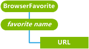

# <a name="browserfavorite-csp"></a>BrowserFavorite 的 CSP


BrowserFavorite 配置服务提供程序用于添加和删除设备上的收藏夹列表的 Url。

> **请注意** 在 Windows Phone 8.1 只支持 BrowserFavorite 的 CSP。

 

BrowserFavorite 配置服务提供程序管理根收藏夹文件夹级别上的收藏夹。 它不会管理根收藏夹文件夹下的子文件夹，也不管理子文件夹下的收藏夹。

> **请注意**  
此配置服务提供商要求使用 ID\_CAP\_CSP\_基础和 ID\_CAP\_互联网\_资源管理器\_收藏夹功能，从网络配置应用程序进行访问。

 

下图显示树状格式由开放手机联盟设备 (OMA) 客户端资源调配使用 BrowserFavorite 配置服务提供程序。 OMA 设备管理协议不支持此配置服务提供商。



<a href="" id="favorite-name-------------"></a>***收藏夹名称***   
必需。 指定 Internet Explorer 的收藏夹列表中显示的收藏夹 URL 的用户友好名称。

> **请注意** *收藏夹名称*应包含在 Windows 文件系统中有效的字符。 无效字符︰ \\ /: \* ？ " &lt; &gt; |

 

两次添加相同喜欢将仅一次添加到收藏夹列表。 如果收藏夹添加另一个具有相同名称但不同的 URL 收藏夹已在收藏夹列表中，则现有收藏夹替换新收藏。

<a href="" id="url"></a>**URL**  
可选项。 指定为该收藏的完整 URL。

## <a name="oma-client-provisioning-examples"></a>OMA 客户端配置示例


添加一个新的浏览器收藏夹。

``` syntax
<?xml version="1.0" encoding="UTF-8" ?>
<wap-provisioningdoc>
  <characteristic type="BrowserFavorite">
    <characteristic type="Help and how-to">
      <parm name="URL" value="http://www.microsoft.com/windowsphone/en-US/howto/wp7/default.aspx"/>
    </characteristic>
  </characteristic>
</wap-provisioningdoc>
```

## <a name="microsoft-custom-elements"></a>Microsoft 的自定义元素


下表显示了此配置服务提供程序支持 OMA 客户端资源调配的 Microsoft 自定义元素。

<table>
<colgroup>
<col width="50%" />
<col width="50%" />
</colgroup>
<thead>
<tr class="header">
<th>元素</th>
<th>可用</th>
</tr>
</thead>
<tbody>
<tr class="odd">
<td><p>参数查询</p></td>
<td><p>是</p></td>
</tr>
<tr class="even">
<td><p>noparm</p></td>
<td><p>是</p></td>
</tr>
<tr class="odd">
<td><p>nocharacteristic</p></td>
<td><p>是</p></td>
</tr>
<tr class="even">
<td><p>特征查询</p></td>
<td><p>是</p>
<p>递归查询︰ 是</p>
<p>上层查询︰ 是</p></td>
</tr>
</tbody>
</table>

 

## <a name="related-topics"></a>相关的主题


[配置服务提供程序的引用](configuration-service-provider-reference.md)

 

 


