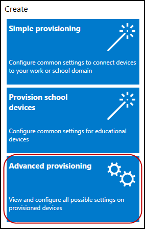
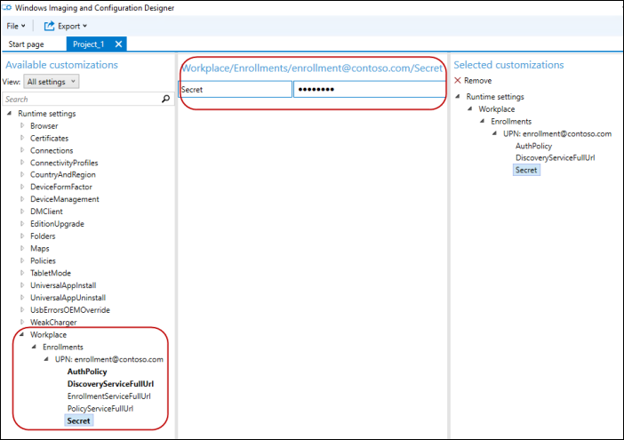
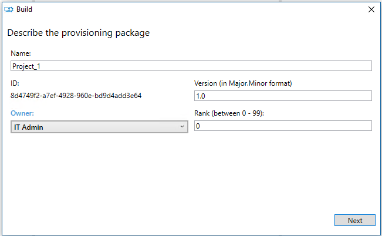
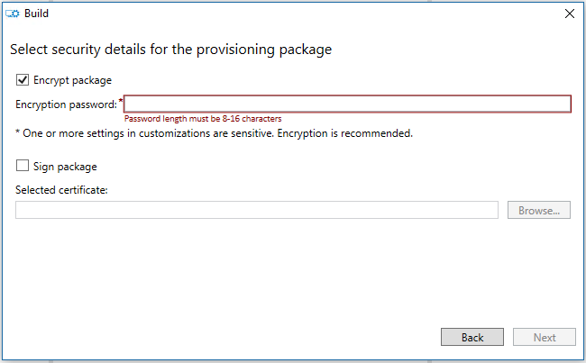
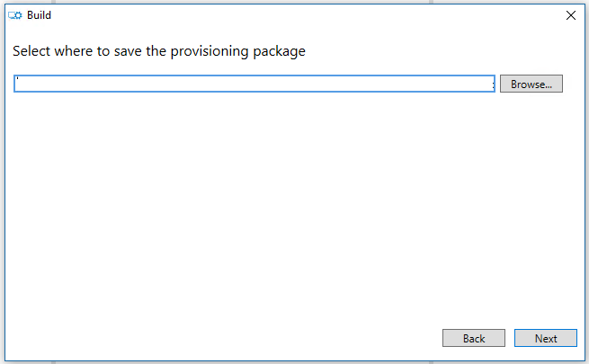
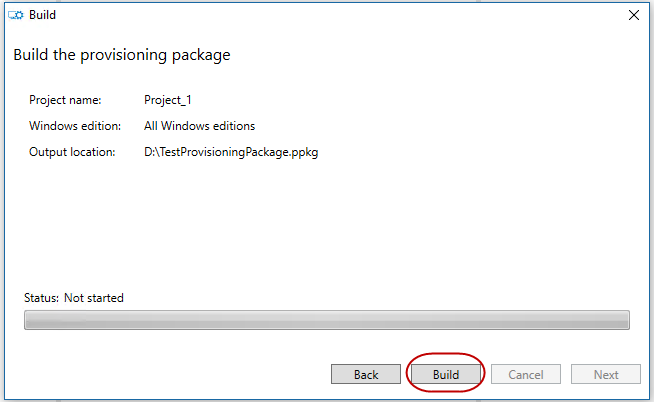
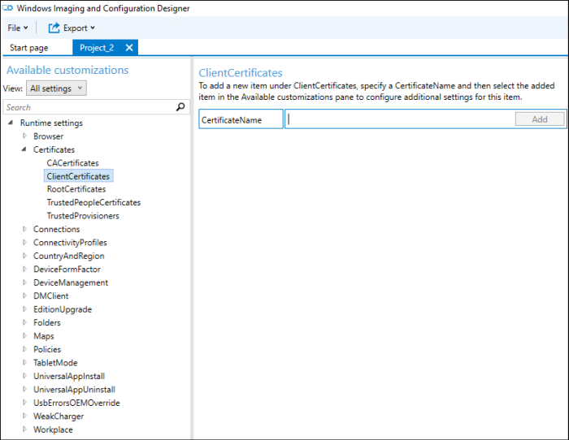

# 批量注册

批量注册是设置了大量的设备将由 MDM 服务器而无需重新映像设备管理的有效方法。 在 Windows 10 桌面和移动设备，可用于批量注册，除 Azure 活动目录联接 （云域加入） 登记方案[资源调配的 CSP](provisioning-csp.md) 。

## 典型用例

-   设置设备批量大企业由 mdm。
-   设置 atm 机或销售点 (POS) 终端等信息亭。
-   学校将计算机设置为。
-   设置工业机械。
-   将手持 POS 设备设置。

在桌面上，您可以创建一个 Active Directory 帐户，如"enrollment@contoso.com"和使它只能够加入到域中。 后与该管理员帐户加入桌面，然后标准域中的用户可以登录以使用它。 这是桌面的在准备域中使用大量中尤其有用。

在桌面和移动设备上，您可以使用注册证书或注册用户名和密码，如"enroll@contoso.com"和"enrollmentpassword"。 设置包，可用来注册到 MDM 服务的多个设备中使用这些凭据。 一旦连接设备，许多用户可以使用它们。

> **请注意**  
> -   在 Azure 活动目录联接不支持批量联接。
> -   在 Intune 独立环境中批量注册不起作用。
> -   批量注册工作系统中心配置管理器 (SCCM) + Intune 混合环境从 SCCM 控制台生成 ppkg 的位置。

 

## 您的需要

-   Windows 10 设备
-   Windows 映像以及配置设计器 (ICD) 工具获取的 ICD 工具，下载[Windows 评估和部署工具包 (ADK)](https://developer.microsoft.com/windows/hardware/windows-assessment-deployment-kit)。 关于 ICD 工具的详细信息，请参阅[Windows 图像处理和配置设计器](https://msdn.microsoft.com/library/windows/hardware/dn916113)和[Windows ICD 入门](https://msdn.microsoft.com/library/windows/hardware/dn916112)。
-   注册凭据 （注册，一般注册 MDM，mdm。 的注册证书凭据的域帐户）
-   Wi-Fi 凭据、 计算机名称方案和任何其他所需的组织。

    某些组织要求自定义的 APNs 在谈到注册端点或自定义 VPN 加入域之前设置。

## 创建并应用资源调配内部身份验证包

使用 ICD，创建资源调配包使用由您的组织所需的注册信息。 确保您具有所有配置设置。

1.  打开 Windows ICD 工具 (默认情况下，%windir%\\程序文件 (x86)\\窗口工具包\\10\\评估和部署工具包\\图像处理和配置设计器\\x86\\ICD.exe)。
2.  单击**高级设置**。

    
3.  输入项目名称，然后单击**下一步**。
4.  由于资源调配 CSP 是共有的所有 Windows 10 版本，选择**所有 Windows 版本**，然后单击**下一步**。
5.  跳过**导入设置包 （可选）** ，然后单击**完成**。
6.  展开**运行库设置** &gt; **的工作场所**。
7.  单击**注册**，在**UPN**，输入一个值，然后单击**添加**。
    UPN 是登记的唯一标识符。 对于批量注册，这必须允许注册多个用户，如服务帐户"enrollment@contoso.com".
8.  在左侧的导航窗格中，展开**UPN** ，然后输入其余的登记进程的设置的信息。
    下面是可用的设置列表︰
    -   **AuthPolicy** -选择**OnPremise**。
    -   **DiscoveryServiceFullUrl** -指定发现服务的完整 URL。
    -   **EnrollmentServiceFullUrl** -可选，在大多数情况下，它应该为空。
    -   **PolicyServiceFullUrl** -可选，在大多数情况下，它应该为空。
    -   **机密**的密码有关这些设置的详细说明，请参阅[资源调配的 CSP](provisioning-csp.md)。
    这里现在是 ICD 的屏幕快照。
    
9.  这样，该设备可以加入 MDM 之前加入网络配置的其他设置，如 Wi-fi 连接 (例如，**运行时设置** &gt; **ConnectivityProfiles** &gt; **WLANSetting**)。
10. 当您完成添加所有的设置，在**文件**菜单上单击**保存**。
11. 在主菜单上单击**导出** &gt; **资源调配包**。

    
12. 您的软件包中输入的值，并指定包的输出位置。

    
    
    
13. 单击**生成**。

    
14. 对某些测试设备应用程序包并验证它们的工作。 有关详细信息，请参阅[应用配置包](#apply-a-provisioning-package)。
15. 适用于您设备的包。

## 创建并应用置备证书身份验证包

使用 ICD，创建资源调配包使用由您的组织所需的注册信息。 确保您具有所有配置设置。

1.  打开 Windows ICD 工具 (默认情况下，%windir%\\程序文件 (x86)\\窗口工具包\\10\\评估和部署工具包\\图像处理和配置设计器\\x86\\ICD.exe)。
2.  单击**高级设置**。
3.  输入项目名称，然后单击**下一步**。
4.  由于资源调配 CSP 是共有的所有 Windows 10 版本选择**共有的所有 Windows 版本**。
5.  跳过**导入设置包 （可选）** ，然后单击**完成**。
6.  指定的证书。
    1.  转到**运行时设置** &gt; **证书** &gt; **ClientCertificates**。
    2.  输入**CertificateName** ，然后单击**添加**。
    3.  输入**CertificatePasword**。
    4.  对于**CertificatePath**，浏览并选择要使用的证书。
    5.  将**ExportCertificate**设置为 False。
    6.  对于**KeyLocation**，选择**仅软件**。

    
7.  指定的工作区设置。
    1.  到达**工作场所** &gt; **的招生名额**。
    2.  **UPN**输入注册，然后单击**添加**。
        UPN 是登记的唯一标识符。 对于批量注册，这必须允许注册多个用户，如服务帐户"enrollment@contoso.com".
    3.  在左侧列中，展开**UPN** ，然后输入其余的登记进程的设置的信息。
        下面是可用的设置列表︰
        -   **AuthPolicy** -选择**证书**。
        -   **DiscoveryServiceFullUrl** -指定发现服务的完整 URL。
        -   **EnrollmentServiceFullUrl** -可选，在大多数情况下，它应该为空。
        -   **PolicyServiceFullUrl** -可选，在大多数情况下，它应该为空。
        -   **密钥**的证书指纹。
        有关这些设置的详细说明，请参阅[资源调配的 CSP](provisioning-csp.md)。
8.  这样，该设备可以加入 MDM 之前加入网络配置的其他设置，如 Wi-fi 连接 (例如，**运行时设置** &gt; **ConnectivityProfiles** &gt; **WLANSetting**)。
9.  当您完成添加所有的设置，在**文件**菜单上单击**保存**。
10. 导出并生成软件包 （上述过程中的步骤 10-13）。
11. 对某些测试设备应用程序包并验证它们的工作。 有关详细信息，请参阅[应用配置包](#apply-a-provisioning-package)。
12. 适用于您设备的包。

## 应用设置包

以下是有关应用设置包的主题的列表︰

-   [应用程序包在首次运行设置屏幕上 （外框的经验）](https://technet.microsoft.com/itpro/windows/deploy/provision-pcs-for-initial-deployment#apply-package) -在 Technet 的主题。
-   [应用到 Windows 10 桌面版映像包](https://msdn.microsoft.com/library/windows/hardware/dn916107.aspx#to_apply_a_provisioning_package_to_a_desktop_image)-在 MSDN 主题
-   [应用程序包至 Windows 10 移动图像](https://msdn.microsoft.com/library/windows/hardware/dn916107.aspx#to_apply_a_provisioning_package_to_a_mobile_image)的 MSDN 中的主题。
-   [应用程序包的来源设置菜单](#apply-a-package-from-the-settings-menu)的以下主题

## 从设置菜单应用程序包

1.  转到**设置** &gt; **帐户** &gt; **访问工作或学校**。
2.  单击**添加或删除资源调配包**。
3.  单击**添加包**。

## 验证已应用了资源调配的包

1.  转到**设置** &gt; **帐户** &gt; **访问工作或学校**。
2.  单击**添加或删除资源调配包**。
    您应该会看到您的软件包列出。

## 重试逻辑发生故障时

如果资源调配引擎接收来自 CSP 将重试设置行中 3 次失败。

如果立即尝试都失败，启动延迟的任务尝试以后再调配。 将重 4 次试速率为 15 分钟-decaying&gt; 1 小时-&gt; 4 小时-&gt; "下一步系统启动"。 这些尝试将系统上下文中运行。

它还将重新尝试应用调配每次启动时，如果也开始从其他地方。

此外，资源调配将重新启动在系统上下文中登录后，系统处于空闲状态 （[空闲状态的详细信息](https://msdn.microsoft.com/library/windows/desktop/aa383561.aspx)）。

## 资源调配的其他主题

以下是在 Technet 中逐步提供主题的链接。

-   [与应用程序的初始部署证书规定 Pc](https://technet.microsoft.com/itpro/windows/deploy/provision-pcs-with-apps-and-certificates)
-   [常用设置初始部署提供 Pc](https://technet.microsoft.com/itpro/windows/deploy/provision-pcs-for-initial-deployment)

 

