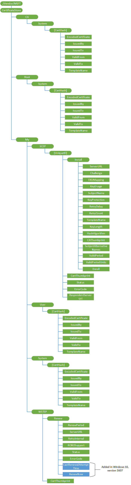

# <a name="certificatestore-csp"></a>CertificateStore 的 CSP


CertificateStore 配置服务提供程序用来添加安全套接字层 (SSL)，中间，和自签名的证书。

> **请注意**  CertificateStore 配置服务提供程序不支持安装客户端证书。

 

对于 CertificateStore 的 CSP，不能使用替换命令，除非该节点已存在。

下图显示了 CertificateStore 配置服务提供程序管理对象以树格式如开放移动联盟设备管理 (OMA DM) 和 OMA 客户端资源调配使用。



<a href="" id="root-system"></a>**根/系统**  
定义包含根元素，或自签名证书的证书存储区。

受支持的操作是获得。

> **请注意** 根/系统是区分大小写。 请使用 RootCATrustedCertificates CSP 安装根证书向前移动。

 

<a href="" id="ca-system"></a>**CA/系统**  
定义包含加密信息，包括中间证书颁发机构的证书存储区。

受支持的操作是获得。

> **请注意** CA/系统是区分大小写。 请使用 RootCATrustedCertificates CSP 安装 CA 证书的向前移动。

 

<a href="" id="my-user"></a>**我 / 用户**  
定义包含客户端证书的公钥的证书存储区。 这是仅用于企业服务器推送客户端证书的公钥。 设备客户端使用客户端证书来验证自己的身份为企业设备管理和企业应用程序的下载服务器。

受支持的操作是获得。

> **请注意** 我 / 用户是区分大小写。

 

<a href="" id="my-system"></a>**我 / 系统**  
定义包含客户端证书的公钥的证书存储区。 这是仅用于企业服务器推送客户端证书的公钥。 设备使用客户端证书来验证自己的身份为设备管理和企业应用程序下载的企业服务器。

受支持的操作是获得。

> **请注意** 我 / 系统是区分大小写。

 

<a href="" id="certhash"></a>***CertHash***  
定义证书的 SHA1 哈希。 20 个字节的值的 SHA1 证书哈希值被指定为一个十六进制的字符串值。

支持的操作是 Get，删除，并替换。

<a href="" id="certhash-encodedcertificate"></a>***CertHash*/EncodedCertificate**  
必需。 指定以 Base64 编码字符串形式的 X.509 证书。 Base 64 字符串值不能包括额外格式的字符，如嵌入式的换行符等。

支持的操作是 Get，添加，删除和替换。

<a href="" id="certhash-issuedby"></a>***CertHash*/IssuedBy**  
必需。 返回证书颁发者的名称。 这相当于在证书中的*颁发者*成员\_信息数据结构。

受支持的操作是获得。

<a href="" id="certhash-issuedto"></a>***CertHash*/IssuedTo**  
必需。 返回证书使用者的名称。 这相当于在证书中的*主题*成员\_信息数据结构。

受支持的操作是获得。

<a href="" id="certhash-validfrom"></a>***CertHash*/ValidFrom**  
必需。 返回该证书的有效期的起始日期。 这相当于在证书中的*NotBefore*成员\_信息结构。

受支持的操作是获得。

<a href="" id="certhash-validto"></a>***CertHash*/ValidTo**  
必需。 返回证书的到期日期。 这相当于在证书中的*NotAfter*成员\_信息结构。

受支持的操作是获得。

<a href="" id="certhash-templatename"></a>***CertHash*/TemplateName**  
必需。 返回的证书模板名称。

受支持的操作是获得。

<a href="" id="my-scep"></a>**我/SCEP**  
所需的简单证书注册协议 (SCEP) 证书注册。 父节点分组 SCEP 证书相关的设置。

受支持的操作是获得。

> **请注意** 请使用 ClientCertificateInstall CSP 安装 SCEP 向前移动的证书。 对 SCEP 所有增强该 CSP 将都发生。

 

<a href="" id="my-scep-uniqueid"></a>**我/SCEP / ***_UniqueID_**  
所需的 SCEP 证书注册。 要区分证书注册申请的唯一 ID。 格式是节点。

支持的操作是 Get，添加、 替换和删除。

<a href="" id="my-scep-uniqueid-install"></a>***我/SCEP/UniqueID*/Install**  
所需的 SCEP 证书注册。 父节点组 SCEP 证书与安装相关的请求。 格式是节点。

支持的操作是添加、 替换和删除。

> **请注意**  尽管安装下的子节点支持替换命令后 Exec 命令发送到设备，此设备需要接受 Exec 命令时所设置的值。 您不应期望发生后接受 Exec 命令影响当前 undergoing 注册的节点值更改。 您应该检查状态节点值并确保该设备不在未知阶段更改子节点值之前。

 

<a href="" id="my-scep-uniqueid-install-serverurl"></a>****我/SCEP/UniqueID/安装/ServerURL * *  
所需的 SCEP 证书注册。 指定证书注册服务器。 服务器无法指定 Url 之间用分号分隔的多个服务器。 值类型是字符串。

支持的操作是 Get，添加，删除和替换。

<a href="" id="my-scep-uniqueid-install-challenge"></a>****我/SCEP/UniqueID/安装/挑战 * *  
所需的 SCEP 证书注册。 B64 编码 SCEP 登记质询。 值类型是 chr。

支持的操作是 Get，添加、 替换和删除。

接受 Exec 命令后不久，挑战将被删除。

<a href="" id="my-scep-uniqueid-install-ekumapping"></a>**我/SCEP /*UniqueID*/Install/EKUMapping**所需。指定的扩展的密钥用法和 SCEP 服务器配置的主题。Oid 的列表隔开一个加号**+ * *，例如 OID1 + OID2 + OID3。 值类型是 chr。

支持的操作是 Get，添加，删除和替换。

<a href="" id="my-scep-uniqueid-install-keyusage"></a>****我/SCEP/UniqueID/安装/KeyUsage * *  
所需的注册。 指定密钥用法位 (0x80 0x20，、 0xA0，等等) 用十进制格式的证书。 至少应具有的值 (0x20) 的第二个或第四个 (0x80) 或两个位设置。 如果该值没有设置这些位，配置将会失败。 值类型是整数。

支持的操作是 Get，添加，删除和替换。

<a href="" id="my-scep-uniqueid-install-subjectname"></a>****我/SCEP/UniqueID/安装/SubjectName * *  
必需。 指定使用者名称。 值类型是 chr。

支持的操作是 Get，添加，删除和替换。

<a href="" id="my-scep-uniqueid-install-keyprotection"></a>****我/SCEP/UniqueID/安装/KeyProtection * *  
可选项。 指定的专用密钥的位置。 虽然 TPM 保护私钥，它不受使用 TPM 的 PIN。 SCEP 注册的证书不支持 TPM PIN 保护。

受支持的值是以下值之一︰

-   1 — 私钥受设备 TPM。

-   2 — 如果设备支持 TPM 私钥受设备 TPM。

-   3 （默认）-软件 KSP 中只保存私钥。

值类型是整数。

支持的操作是 Get，添加，删除和替换。

<a href="" id="my-scep-uniqueid-install-retrydelay"></a>****我/SCEP/UniqueID/安装/RetryDelay * *  
可选项。 指定以分钟计 SCEP 服务器时发送等待状态的设备重试的等待时间。 默认值为 5，最小值为 1。 值类型是整数。

支持的操作是 Get，添加和删除。

<a href="" id="my-scep-uniqueid-install-retrycount"></a>****我/SCEP/UniqueID/安装/RetryCount * *  
可选项。 特殊的 SCEP。 指定当 SCEP 服务器发送挂起状态设备重试次数。 值类型是整数。 默认值为 3。 最大值不能大于 30。 如果该值大于 30，该设备将使用 30。 最小值为 0，这意味着不能重试。

支持的操作是 Get，添加，删除和替换。

<a href="" id="my-scep-uniqueid-install-templatename"></a>****我/SCEP/UniqueID/安装/模板名称 * *  
可选项。 证书模板名称的 OID。 请注意，此名称通常忽略 SCEP 服务器;因此，MDM 服务器通常不需要提供。 值类型是 chr。

支持的操作是 Get，添加和删除。

<a href="" id="my-scep-uniqueid-install-keylength"></a>****我/SCEP/UniqueID/安装/KeyLength * *  
所需的注册。 指定私钥长度 (RSA)。 值类型是整数。 有效值是 1024、 2048、 4096。 应指定支持的 NGC 密钥长度。

支持的操作是 Get，添加，删除和替换。

<a href="" id="my-scep-uniqueid-install-hashalgorithm"></a>****我/SCEP/UniqueID/安装/HashAlgorithm * *  
所需的注册。 哈希算法的系列 （sha-1、 SHA 2、 SHA 3） 由 MDM 服务器指定。 如果指定了多个哈希算法家族，它们必须用 +。

值类型是 chr。

支持的操作是 Get，添加，删除和替换。

<a href="" id="my-scep-uniqueid-install-cathumbprint"></a>****我/SCEP/UniqueID/安装/CAThumbprint * *  
必需。 指定根 CA 指纹。 它是 20 个字节的值指定为一个十六进制的字符串值的 SHA1 证书哈希值。 当客户端对 SCEP 服务器进行身份验证时，它会检查与该证书匹配 SCEP 服务器的 CA 证书。 如果不匹配，则身份验证失败。 值类型是 chr。

支持的操作是 Get，添加，删除和替换。

<a href="" id="my-scep-uniqueid-install-subjectalternativenames"></a>**我/SCEP /*UniqueID*/安装/SubjectAlternativeNames**可选。指定使用者备用名称。可以指定多个备用名称。每个名称是名称格式 + 实际名称的组合。请参阅 MSDN 中的名称类型定义。用分号分隔每一对。例如，多个主题备用名称均以格式* &lt;nameformat1&gt;*+*&lt;实际 name1&gt;*;*&lt;格式 2&gt; *+*&lt;actual name2&gt;*. 值类型是 chr。

支持的操作是 Get，添加，删除和替换。

<a href="" id="my-scep-uniqueid-install-validperiod"></a>****我/SCEP/UniqueID/安装/ValidPeriod * *  
可选项。 为有效的时间段指定的单位。 值类型是 chr。

支持的操作是 Get，添加，删除和替换。

有效的值将为下列情况之一︰

-   天 （默认）
-   月
-   年

> **请注意**  该设备仅作为证书注册请求的一部分发送 MDM 服务器预期证书有效期 （ValidPeriodUnits + ValidPeriod） 的 SCEP 服务器。 如何使用此有效期间创建证书取决于 MDM 服务器。

 

<a href="" id="my-scep-uniqueid-install-validperiodunits"></a>****我/SCEP/UniqueID/安装/ValidPeriodUnits * *  
可选项。 指定需在有效期内和服从 SCEP 服务器配置使用的单位数。 默认值为 0。 ValidPeriod 节点中定义的单位。 有效的时间段由 MDM 覆盖在证书模板中指定的有效期间。 例如，如果为 30，ValidPeriodUnits ValidPeriod 是天，这意味着总的有效持续时间为 30 天。 值类型是整数。

支持的操作是 Get，添加，删除和替换。

> **请注意**  该设备仅作为证书注册请求的一部分发送 MDM 服务器预期证书有效期 （ValidPeriodUnits + ValidPeriod） 的 SCEP 服务器。 如何使用此有效期间创建证书取决于 MDM 服务器。

 

<a href="" id="my-scep-uniqueid-install-enroll"></a>****我/SCEP/UniqueID/安装/注册 * *  
必需。 触发该设备以启动证书注册。 MDM 服务器以后可以查询设备，了解是否添加新的证书。 值类型为 null，这意味着此节点不包含一个值。

受支持的操作被执行。

<a href="" id="my-wstep-certthumbprint"></a>**我 CertThumbprint/WSTEP /**  
可选项。 返回当前的 MDM 客户端证书指纹。 如果更新成功，它会显示已续订的证书指纹。 如果续订失败，或正在进行中，它会显示需要续订证书的指纹。 值类型是 chr。

受支持的操作是获得。

<a href="" id="my-scep-uniqueid-status"></a>***我/SCEP/UniqueID*/Status**  
必需。 指定由于注册请求的证书的最新状态。 值类型是 chr。

受支持的操作是获得。

有效的值将为下列情况之一︰

-   1-已成功完成。

-   2 – 挂起。 设备尚未完成该操作，但已收到 SCEP 服务器挂起的响应。

-   16-操作失败。

-   32-未知。

<a href="" id="my-scep-uniqueid-errorcode"></a>***我/SCEP/UniqueID*/ErrorCode**  
可选项。 整数值，它指示上次注册错误代码的 HRESULT。

受支持的操作是获得。

<a href="" id="my-scep-uniqueid-certthumbprint"></a>***我/SCEP/UniqueID*/CertThumbprint**  
可选项。 如果证书注册成功，则指定当前的证书指纹。 它是 20 个字节的值指定为一个十六进制的字符串值的 SHA1 证书哈希值。 值类型是 chr。

受支持的操作是获得。

<a href="" id="my-scep-uniqueid-respondentserverurl"></a>***我/SCEP/UniqueID*/RespondentServerUrl**  
必需。 返回响应的注册请求 SCEP 服务器的 URL。 值类型是字符串。

受支持的操作是获得。

<a href="" id="my-wstep"></a>**我/WSTEP**  
注册 MDM 设备的需要。 承载 MDM 注册客户端证书的父节点相关的设置，通过 WSTEP 报名。 WSTEP 下的节点，是主要为 MDM 客户机证书续订请求。 值类型是节点。

受支持的操作是获得。

<a href="" id="my-wstep-renew"></a>**我/WSTEP/续订**  
可选项。 父节点到组更新相关的设置。

受支持的操作是获得。

<a href="" id="my-wstep-renew-serverurl"></a>**我/WSTEP/续订/ServerURL**  
可选项。 指定证书续订服务器的 URL。 如果此节点不存在，则客户端将使用初始证书注册 URL。

> **请注意** 当设备注册，这意味着，它的起始位置与发现服务后, 跟注册策略服务，然后注册 web 服务，续订过程遵循相同的步骤。

 

支持的操作是添加 Get，删除和替换。

<a href="" id="my-wstep-renew-renewalperiod"></a>**我/WSTEP/续订/RenewalPeriod**  
可选项。 MDM 证书到期之前，触发客户端开始 MDM 客户端证书的时间 （单位为天） 续订过程。 MDM 服务器不能设置和更新续订期。 此参数适用于手动证书续订和请求 (ROBO) 代表证书续订。 建议的续订期设置几个月之前在证书过期，以确保该证书获取成功续订与数据连接。

默认值为 42，有效的值是 1 到 1000年。 值类型是整数。

支持的操作是添加 Get，删除和替换。

> **请注意**  通过对 ROBOSupport、 RenewalPeriod 和 RetryInterval 的 SyncML DM 命令设置更新日程安排时，必须包装它们中原子的命令。

 

<a href="" id="my-wstep-renew-retryinterval"></a>**我/WSTEP/续订/RetryInterval**  
可选项。 （以天为单位） 指定的重试间隔时以前续订失败。 它适用于手动证书续订以及 ROBO 自动续订证书。 在证书过期日期停止重试计划。

ROBO 续订失败，客户机重试次数续订定期直到设备到达证书到期日期。 此参数指定为 ROBO 更新重试的等待时间。

对于手动重试失败没有内置的重试次数。 用户可以稍后重试。 在下一步计划的证书续订的重试期间，设备再次提示凭据对话框。

默认值为 7，有效值为 1 – 1000年和 =&lt; RenewalPeriod，否则它会导致错误。 值类型是整数。

支持的操作是添加 Get，删除和替换。

> **请注意**  通过对 ROBOSupport、 RenewalPeriod 和 RetryInterval 的 SyncML DM 命令设置更新日程安排时，必须包装它们中原子的命令。

 

<a href="" id="my-wstep-renew-robosupport"></a>**我/WSTEP/续订/ROBOSupport**  
可选项。 如果 MDM 注册服务器支持 ROBO 自动证书续订，通知客户端。 值类型是布尔值。

ROBO 是 Windows 10 只支持的续订方法。 此值被忽略，始终被认为是，则返回 true。

支持的操作是添加 Get，删除和替换。

> **请注意**  通过对 ROBOSupport、 RenewalPeriod 和 RetryInterval 的 SyncML DM 命令设置更新日程安排时，必须包装它们中原子的命令。

 

<a href="" id="my-wstep-renew-status"></a>**我/WSTEP/续订/状态**  
必需。 显示此证书的最新行动的状态。 值类型是整数。

受支持的操作是获得。

受支持的值是以下值之一︰

-   0 – 未启动。

-   1 – 更新正在进行中。

-   2 – 更新成功。

-   3 — 续订失败。

<a href="" id="my-wstep-renew-errorcode"></a>**我/WSTEP/续订/错误代码**  
可选项。 如果证书续订失败，此整数值将指示续订过程中的上一个错误代码的 HRESULT。 值类型是整数。

受支持的操作是获得。

<a href="" id="my-wstep-renew-lastrenewalattempttime"></a>**我/WSTEP/续订/LastRenewalAttemptTime**  
添加到 Windows 10，1607年版本中。 最后一次尝试更新的时间。

受支持的操作是获得。

<a href="" id="my-wstep-renew-renewnow"></a>**我/WSTEP/续订/RenewNow**  
添加到 Windows 10，1607年版本中。 现在开始续订。

受支持的操作被执行。

## <a name="examples"></a>示例


MDM 服务器添加根证书。

``` syntax
<Add>
   <CmdID>1</CmdID>
   <Item>
      <Target>
         <LocURI>
./Vendor/MSFT/CertificateStore/Root/System/<CertificateHashInsertedhere>/EncodedCertificate
          </LocURI>
      </Target>
      <Data>B64EncodedCertInsertedHere</Data>
      <Meta>
         <Format xmlns="syncml:metinf">b64</Format>
      </Meta>
   </Item>
</Add>
```

获得所有已安装的客户端证书。

``` syntax
<Get>
   <CmdID>1</CmdID>
   <Item>
      <Target>
         <LocURI>
./Vendor/MSFT/CertificateStore/My/User?list=StructData
          </LocURI>
      </Target>
   </Item>
</Get>
```

删除根证书。

``` syntax
<Delete>
   <CmdID>1</CmdID>
   <Item>
      <Target>
         <LocURI>
./Vendor/MSFT/CertificateStore/Root/System/<CertificateHashInsertedHere>
          </LocURI>
      </Target>
   </Item>
</Delete>
```

配置设备注册 SCEP 通过一个客户端证书。

``` syntax
<Atomic>
<CmdID>100</CmdID>
<Add>
   <CmdID>1</CmdID>
   <Item>
        <Target><LocURI>./Vendor/MSFT/CertificateStore/My/SCEP/CertSCEP1</LocURI>
        </Target>
        <Meta>
        <Format xmlns="syncml:metinf">node</Format>
        </Meta>
   </Item>
</Add>
<Add>
    <CmdID>2</CmdID>
    <Item>
        <Target><LocURI>./Vendor/MSFT/CertificateStore/My/SCEP/CertSCEP1/Install/RetryCount</LocURI>
        </Target>
    <Meta>
               <Format xmlns="syncml:metinf">int</Format>
    </Meta>
            <Data>1</Data>
    </Item>
</Add>
<Add>
         <CmdID>3</CmdID>
         <Item>
            <Target><LocURI>./Vendor/MSFT/CertificateStore/My/SCEP/CertSCEP1/Install/RetryDelay</LocURI>
            </Target>
            <Meta>
               <Format xmlns="syncml:metinf">int</Format>
            </Meta>
            <Data>1</Data>
         </Item>
</Add>
<Add>
         <CmdID>4</CmdID>
         <Item>
            <Target><LocURI>./Vendor/MSFT/CertificateStore/My/SCEP/CertSCEP1/Install/KeyUsage</LocURI>
            </Target>
            <Meta>
               <Format xmlns="syncml:metinf">int</Format>
            </Meta>
            <Data>160</Data>
         </Item>
</Add>
<Add>
         <CmdID>5</CmdID>
         <Item>
            <Target><LocURI>./Vendor/MSFT/CertificateStore/My/SCEP/CertSCEP1/Install/KeyLength</LocURI>
            </Target>
            <Meta>
               <Format xmlns="syncml:metinf">int</Format>
            </Meta>
            <Data>1024</Data>
         </Item>
</Add>
<Add>
         <CmdID>6</CmdID>
         <Item>
            <Target><LocURI>./Vendor/MSFT/CertificateStore/My/SCEP/CertSCEP1/Install/HashAlgorithm</LocURI>
            </Target>
            <Meta>
               <Format xmlns="syncml:metinf">chr</Format>
            </Meta>
            <Data>SHA-1</Data>
         </Item>
</Add>
<Add>
         <CmdID>7</CmdID>
         <Item>
            <Target><LocURI>./Vendor/MSFT/CertificateStore/My/SCEP/CertSCEP1/Install/SubjectName</LocURI>
            </Target>
            <Meta>
               <Format xmlns="syncml:metinf">chr</Format>
            </Meta>
            <Data>CN=AnnaLee</Data>
         </Item>
</Add>
<Add>
         <CmdID>8</CmdID>
         <Item>
            <Target><LocURI>./Vendor/MSFT/CertificateStore/My/SCEP/CertSCEP1/Install/SubjectAlternativeNames</LocURI>
            </Target>
            <Meta>
               <Format xmlns="syncml:metinf">chr</Format>
            </Meta>
            <Data>11+tom@MyDomain.Contoso.com;3+MyDomain.Contoso.com</Data>
         </Item>
</Add>
<Add>
         <CmdID>9</CmdID>
         <Item>
            <Target><LocURI>./Vendor/MSFT/CertificateStore/My/SCEP/CertSCEP1/Install/ValidPeriod</LocURI>
            </Target>
            <Meta>
               <Format xmlns="syncml:metinf">chr</Format>
            </Meta>
            <Data>Years</Data>
         </Item>
</Add>
<Add>
         <CmdID>10</CmdID>
         <Item>
            <Target><LocURI>./Vendor/MSFT/CertificateStore/My/SCEP/CertSCEP1/Install/ValidPeriodUnits</LocURI>
            </Target>
            <Meta>
               <Format xmlns="syncml:metinf">int</Format>
            </Meta>
            <Data>1</Data>
         </Item>
</Add>
<Add>
         <CmdID>11</CmdID>
         <Item>
            <Target><LocURI>./Vendor/MSFT/CertificateStore/My/SCEP/CertSCEP1/Install/EKUMapping</LocURI>
            </Target>
            <Meta>
               <Format xmlns="syncml:metinf">chr</Format>
            </Meta>
            <Data>1.3.6.1.4.1.311.10.3.12+1.3.6.1.4.1.311.10.3.4+1.3.6.1.4.1.311.20.2.2</Data>
         </Item>
</Add>
<Add>
         <CmdID>12</CmdID>
         <Item>
            <Target><LocURI>./Vendor/MSFT/CertificateStore/My/SCEP/CertSCEP1/Install/KeyProtection</LocURI>
            </Target>
            <Meta>
               <Format xmlns="syncml:metinf">int</Format>
            </Meta>
            <Data>3</Data>
         </Item>
</Add>
<Add>
         <CmdID>13</CmdID>
         <Item>
            <Target><LocURI>./Vendor/MSFT/CertificateStore/My/SCEP/CertSCEP1/Install/ServerURL</LocURI>
            </Target>
            <Meta>
               <Format xmlns="syncml:metinf">chr</Format>
            </Meta>
            <Data>https://contoso.com/certsrv/ctcep.dll</Data>
         </Item>
</Add>
<Add>
         <CmdID>14</CmdID>
         <Item>
            <Target><LocURI>./Vendor/MSFT/CertificateStore/My/SCEP/CertSCEP1/Install/Challenge</LocURI>
            </Target>
            <Meta>
               <Format xmlns="syncml:metinf">chr</Format>
            </Meta>
            <Data>ChallengeInsertedHere</Data>
         </Item>
</Add>
<Add>
         <CmdID>15</CmdID>
         <Item>
            <Target><LocURI>./Vendor/MSFT/CertificateStore/My/SCEP/CertSCEP1/Install/CAThumbprint</LocURI>
            </Target>
            <Meta>
               <Format xmlns="syncml:metinf">chr</Format>
            </Meta>
            <Data>CAThumbprintInsertedHere</Data>
         </Item>
</Add>
<Exec>
         <CmdID>16</CmdID>
         <Item>
            <Target><LocURI>./Vendor/MSFT/CertificateStore/My/SCEP/CertSCEP1/Install/Enroll</LocURI>
            </Target>
         </Item>
</Exec>
</Atomic>
```

配置自动续订 MDM 客户机证书具有指定的设备更新周期和重试间隔。

``` syntax
<Atomic>
   <CmdID>1</CmdID>
     <Replace>
         <CmdID>2</CmdID>
         <Item>
            <Target><LocURI>./Vendor/MSFT/CertificateStore/My/WSTEP/Renew/ROBOSupport</LocURI></Target>
            <Meta>
               <Format xmlns="syncml:metinf">bool</Format>
            </Meta>
            <Data>true</Data>
         </Item>
      </Replace>
      <Replace>
         <CmdID>3</CmdID>
         <Item>
            <Target><LocURI>./Vendor/MSFT/CertificateStore/My/WSTEP/Renew/RenewPeriod</LocURI></Target>
            <Meta>
               <Format xmlns="syncml:metinf">int</Format>
            </Meta>
            <Data>60</Data>
         </Item>
      </Replace>
      <Replace>
         <CmdID>4</CmdID>
         <Item>
            <Target><LocURI>./Vendor/MSFT/CertificateStore/My/WSTEP/Renew/RetryInterval</LocURI></Target>
            <Meta>
               <Format xmlns="syncml:metinf">int</Format>
            </Meta>
            <Data>4</Data>
         </Item>
      </Replace>
</Atomic>
```

## <a name="related-topics"></a>相关的主题


[配置服务提供程序的引用](configuration-service-provider-reference.md)

 

 


