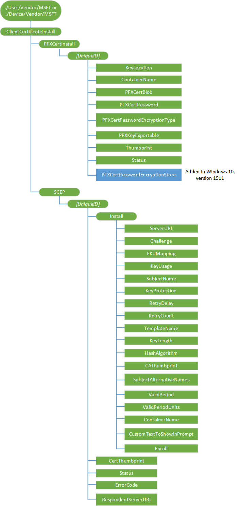

# <a name="clientcertificateinstall-csp"></a>ClientCertificateInstall 的 CSP


ClientCertificateInstall 配置服务提供程序，企业若要安装客户端证书。

PFX 证书安装和 SCEP 安装，必须在原子的命令，以确保直到所有设置都配置，则不会触发注册执行包装 SyncML 命令。 注册命令必须是原子的块中的最后一项。

> **请注意**  
当前在 Windows 10 版本 1511，当使用 ClientCertificateInstall 来将证书安装到设备存储和用户存储区的两个证书都发送到设备在相同的 MDM 负载中，适用于设备存储区的证书也将安装在用户存储区。 选择正确的证书以建立连接时，这可能与 Wi-Fi 或 VPN 导致问题。 我们正在努力解决此问题。

您只能设置为 true PFXKeyExportable KeyLocation = 3。 对于任何其他的 KeyLocation 值，CSP 将会失败。


下面的图像以树格式显示 ClientCertificateInstall 配置服务提供程序。



<a href="" id="device-or-user"></a>**设备或用户**  
<p style="margin-left: 20px">对于设备的证书，使用**./Device/Vendor/MSFT**路径并为用户证书使用**./User/Vendor/MSFT**路径。

<a href="" id="clientcertificateinstall"></a>**ClientCertificateInstall**  
<p style="margin-left: 20px">ClientCertificateInstaller 配置服务提供程序的根节点。

<a href="" id="clientcertificateinstall-pfxcertinstall"></a>**ClientCertificateInstall/PFXCertInstall**  
<p style="margin-left: 20px">安装所需的 PFX 证书。 父节点分组 PFX 证书相关的设置。

<p style="margin-left: 20px">受支持的操作是获得。

<a href="" id="clientcertificateinstall-pfxcertinstall-uniqueid"></a>**ClientCertificateInstall/PFXCertInstall / ***_UniqueID_**  
<p style="margin-left: 20px">安装所需的 PFX 证书。 一个唯一的 ID 来区分不同的证书安装请求。

<p style="margin-left: 20px">数据类型格式是节点。

<p style="margin-left: 20px">支持的操作是 Get，添加和删除。

<p style="margin-left: 20px">在此节点上调用删除应删除证书和密钥的已安装的相应 PFX blob。

<a href="" id="clientcertificateinstall-pfxcertinstall-uniqueid-keylocation"></a>* *ClientCertificateInstall/PFXCertInstall/*UniqueID*/KeyLocation**
<p style="margin-left: 20px">安装所需的 PFX 证书。 指示要专用密钥安装到的目标的 KeyStorage 提供程序。

<p style="margin-left: 20px">支持的操作是 Get，添加和替换。

<p style="margin-left: 20px">数据类型是一个整数，对应于下列值之一︰

| 值 | 说明                                                                                                   |
|-------|---------------------------------------------------------------------------------------------------------------|
| 1     | 如果有安装 TPM、 失败如果不存在。                                                               |
| 2     | 如果存在将其安装到 TPM。 如果不存在，回退到软件。                                              |
| 3     | 安装软件。                                                                                          |
| 4     | 将安装到 Windows Hello （以前称为工作的 Microsoft Passport） 其名称指定的业务 |


<a href="" id="clientcertificateinstall-pfxcertinstall-uniqueid-containername"></a>* *ClientCertificateInstall/PFXCertInstall/*UniqueID*/ContainerName**  
<p style="margin-left: 20px">ptional。 指定 Windows Hello （以前称为工作的 Microsoft Passport） 业务容器名称 （如果 Windows Hello 业务存储提供程序 (KSP) 被选为 KeyLocation）。 如果此节点未指定 Windows Hello 业务 KSP 的选择时，则注册将失败。

<p style="margin-left: 20px">日期类型为字符串。

<p style="margin-left: 20px">支持的操作是 Get，添加和替换。

<a href="" id="clientcertificateinstall-pfxcertinstall-uniqueid-pfxcertblob"></a>* *ClientCertificateInstall/PFXCertInstall/*UniqueID*/PFXCertBlob**
<p style="margin-left: 20px">CRYPT\_数据\_BLOB 结构，其中包含导出和加密证书和密钥的 PFX 数据包。 添加操作会触发到 PFX 证书添加。 这要求下的所有其他节点 UniqueID PFX 安装 （容器名称，KeyLocation，CertPassword，KeyExportable） 的参数，此调用之前存在。 这也将设置操作的当前状态节点。

<p style="margin-left: 20px">数据类型格式是二进制的。

<p style="margin-left: 20px">支持的操作是 Get，添加和替换。

<p style="margin-left: 20px">如果已存在一个 blob，添加操作将会失败。 如果在此节点上调用替换，则将覆盖现有证书。

<p style="margin-left: 20px">如果添加此节点上调用的新 PFX，证书将被添加。 当证书不存在时，则此节点上的替换操作将失败。

<p style="margin-left: 20px">换言之，更换或添加在使用将导致覆盖旧证书或添加新的证书 CRYPT 效果\_数据\_斑点，可以在中找到[CRYPT\_整数\_BLOB](http://go.microsoft.com/fwlink/p/?LinkId=523871)。

<a href="" id="clientcertificateinstall-pfxcertinstall-uniqueid-pfxcertpassword"></a>* *ClientCertificateInstall/PFXCertInstall/*UniqueID*/PFXCertPassword**
<p style="margin-left: 20px">密码保护的 PFX blob。 这是必需的如果 PFX 受密码保护。

<p style="margin-left: 20px">数据类型是字符串。

<p style="margin-left: 20px">支持的操作是 Get，添加和替换。

<a href="" id="clientcertificateinstall-pfxcertinstall-uniqueid-pfxcertpasswordencryptiontype"></a>* *ClientCertificateInstall/PFXCertInstall/*UniqueID*/PFXCertPasswordEncryptionType**
<p style="margin-left: 20px">可选项。 用于指定 PFX 证书密码通过 MDM 使用 MDM 证书加密的 whtether 服务器。

<p style="margin-left: 20px">数据类型是 int。 有效值︰

-   0-不加密密码。
-   1-密码加密使用 MDM 证书。
-   2-使用自定义证书加密密码。

<p style="margin-left: 20px">当 PFXCertPasswordEncryptionType = 2，您必须在 PFXCertPasswordEncryptionStore 设置中指定的存储名称。

<p style="margin-left: 20px">支持的操作是 Get，添加和替换。

<a href="" id="clientcertificateinstall-pfxcertinstall-uniqueid-pfxkeyexportable"></a>* *ClientCertificateInstall/PFXCertInstall/*UniqueID*/PFXKeyExportable**
<p style="margin-left: 20px">可选项。 用于指定是否导出私钥安装 （和以后可以导出）。 当它被安装到 TPM PFX 不可导出。

> **请注意** 您只能设置为 true PFXKeyExportable KeyLocation = 3。 对于任何其他的 KeyLocation 值，CSP 将会失败。

 
<p style="margin-left: 20px">数据类型的布尔值。

<p style="margin-left: 20px">支持的操作是 Get，添加和替换。

<a href="" id="clientcertificateinstall-pfxcertinstall-uniqueid-thumbprint"></a>* *ClientCertificateInstall/PFXCertInstall/*UniqueID*/Thumbprint**
<p style="margin-left: 20px">返回已安装 PFX 证书的指纹。

<p style="margin-left: 20px">数据类型是字符串。

<p style="margin-left: 20px">受支持的操作是获得。

<a href="" id="clientcertificateinstall-pfxcertinstall-uniqueid-status"></a>* *ClientCertificateInstall/PFXCertInstall/*UniqueID*/Status**
<p style="margin-left: 20px">必需。 从后 PfxImportCertStore 调用时出错命令返回 PFX 安装的错误代码。

<p style="margin-left: 20px">数据类型是整数。

<p style="margin-left: 20px">受支持的操作是获得。

<a href="" id="clientcertificateinstall-pfxcertinstall-uniqueid-pfxcertpasswordencryptionstore"></a>* *ClientCertificateInstall/PFXCertInstall/*UniqueID*/PFXCertPasswordEncryptionStore**
<p style="margin-left: 20px">添加 Windows 10 1511年版本中。 当 PFXCertPasswordEncryptionType = 2，它指定用于解密 PFXCertPassword 的证书存储名称。

<p style="margin-left: 20px">数据类型为字符串。

<p style="margin-left: 20px">支持的操作是添加，获取，并更换。

<a href="" id="clientcertificateinstall-scep"></a>**ClientCertificateInstall/SCEP**  
<p style="margin-left: 20px">SCEP 节点。

> **请注意** 安装 SCEP 证书后，会发出一个警报。

 
<a href="" id="clientcertificateinstall-scep-uniqueid"></a>**ClientCertificateInstall/SCEP / ***_UniqueID_**  
<p style="margin-left: 20px">要区分不同的证书安装请求的唯一 ID。

<p style="margin-left: 20px">支持的操作是 Get，添加、 替换和删除。

<a href="" id="clientcertificateinstall-scep-uniqueid-install"></a>* *ClientCertificateInstall/SCEP/*UniqueID*/Install**
<p style="margin-left: 20px">一个 SCEP 证书注册所需的节点。 父节点组 SCEP 证书安装到相关的请求。

<p style="margin-left: 20px">支持的操作是 Get，添加、 替换和删除。

> **请注意** 尽管安装支持下的子节点替换命令，一旦 Exec 命令发送到设备，此设备将会接受 Exec 命令时所设置的值。 服务器不应期望的节点值更改后接受 Exec 命令，因为它会影响当前的注册正在进行。 服务器应该检查状态节点值，并确保该设备不在未知状态更改子节点的值之前。

 
<a href="" id="clientcertificateinstall-scep-uniqueid-install-serverurl"></a>* *ClientCertificateInstall/SCEP/*UniqueID*/安装/ServerURL * *  
<p style="margin-left: 20px">所需的 SCEP 证书注册。 指定证书注册服务器。 可以列出多个服务器 Url，用分号隔开。

<p style="margin-left: 20px">数据类型为字符串。

<p style="margin-left: 20px">支持的操作是 Get，添加和替换。

<a href="" id="clientcertificateinstall-scep-uniqueid-install-challenge"></a>* *ClientCertificateInstall/SCEP/*UniqueID*/安装/挑战 * *
<p style="margin-left: 20px">所需的 SCEP 证书注册。 B64 编码 SCEP 登记质询。 接受 Exec 命令后不久，挑战将被删除。

<p style="margin-left: 20px">数据类型为字符串。

<p style="margin-left: 20px">支持的操作是添加，获取，并更换。

<a href="" id="clientcertificateinstall-scep-uniqueid-install-ekumapping"></a>* *ClientCertificateInstall/SCEP/*UniqueID*/安装/EKUMapping * *
<p style="margin-left: 20px">必需。 指定扩展的密钥用法。 SCEP 服务器配置为使用者。 正由分隔的 Oid 的列表**+**。 例如， *OID1*+*OID2*+*OID3*。

数据类型为字符串。
<p style="margin-left: 20px">所需的注册。 指定密钥用法位 (0x80 0x20，、 0xA0，等等) 用十进制格式的证书。 至少应有第二个值 (0x20)，第四个 (0x80) 或两个位设置。 如果该值没有设置这些位，则该配置将会失败。

<p style="margin-left: 20px">数据类型是 int。

<p style="margin-left: 20px">支持的操作是添加，获取，并更换。

<a href="" id="clientcertificateinstall-scep-uniqueid-install-subjectname"></a>* *ClientCertificateInstall/SCEP/*UniqueID*/安装/SubjectName * *
<p style="margin-left: 20px">必需。 指定使用者名称。

<p style="margin-left: 20px">数据类型为字符串。

<p style="margin-left: 20px">支持的操作是添加，获取，并更换。

<a href="" id="clientcertificateinstall-scep-uniqueid-install-keyprotection"></a>* *ClientCertificateInstall/SCEP/*UniqueID*/安装/KeyProtection * *
<p style="margin-left: 20px">可选项。 指定在何处保存专用密钥。

> **请注意** 即使 TPM 保护私钥，它不使用 TPM PIN 保护。

 
<p style="margin-left: 20px">数据类型是一个整数，对应于下列值之一︰

| 值 | 说明                                                                                                                                                                                           |
|-------|-------------------------------------------------------------------------------------------------------------------------------------------------------------------------------------------------------|
| 1     | 由 TPM 保护专用密钥。                                                                                                                                                                         |
| 2     | 如果设备支持 TPM 通过电话 TPM 保护专用密钥。 所有 Windows Phone 8.1 设备支持 TPM，将被视为 1 值 2。                                                                 |
| 3     | （默认值）在软件 KSP 中保存私钥。                                                                                                                                                          |
| 4     | 由 Windows Hello （以前称为工作的 Microsoft Passport） 业务保护专用密钥。 如果指定此选项，则容器名称必须指定，否则将无法注册。 |

 
<p style="margin-left: 20px">支持的操作是添加，获取，并更换。

<a href="" id="clientcertificateinstall-scep-uniqueid-install-retrydelay"></a>* *ClientCertificateInstall/SCEP/*UniqueID*/安装/RetryDelay * *
<p style="margin-left: 20px">可选项。 当 SCEP 服务器发送挂起状态时，此值以分钟为单位指定设备重试的等待时间。

<p style="margin-left: 20px">数据类型格式是一个整数。

<p style="margin-left: 20px">默认值为 5。

<p style="margin-left: 20px">最小值为 1。

<p style="margin-left: 20px">支持的操作是添加，获取，并更换。

<a href="" id="clientcertificateinstall-scep-uniqueid-install-retrycount"></a>* *ClientCertificateInstall/SCEP/*UniqueID*/安装/RetryCount * *
<p style="margin-left: 20px">可选项。 SCEP 所特有。 指定当 SCEP 服务器发送挂起状态设备重试次数。

<p style="margin-left: 20px">数据类型是整数。

<p style="margin-left: 20px">默认值为 3。

<p style="margin-left: 20px">最大值为 30。 如果值大于 30，该设备将使用 30。

<p style="margin-left: 20px">最小值为 0，表示不能重试。

<p style="margin-left: 20px">支持的操作是添加，获取，并更换。

<a href="" id="clientcertificateinstall-scep-uniqueid-install-templatename"></a>* *ClientCertificateInstall/SCEP/*UniqueID*/安装/模板名称 * *
<p style="margin-left: 20px">可选项。 证书模板名称的 OID。

> **请注意** 此名称通常忽略 SCEP 服务器;因此 MDM 服务器通常不需要提供。

 
<p style="margin-left: 20px">数据类型为字符串。

<p style="margin-left: 20px">支持的操作是添加，获取，并更换。

<a href="" id="clientcertificateinstall-scep-uniqueid-install-keylength"></a>* *ClientCertificateInstall/SCEP/*UniqueID*/安装/KeyLength * *
<p style="margin-left: 20px">所需的注册。 指定私钥长度 (RSA)。

<p style="margin-left: 20px">数据类型是整数。

<p style="margin-left: 20px">有效值为 1024年、 2048、 4096。

<p style="margin-left: 20px">对于 Windows Hello （以前称为工作的 Microsoft Passport） 的业务，只有 2048年是受支持的密钥长度。

<p style="margin-left: 20px">支持的操作是添加，获取，并更换。

<a href="" id="clientcertificateinstall-scep-uniqueid-install-hashalgorithm"></a>* *ClientCertificateInstall/SCEP/*UniqueID*/安装/HashAlgorithm * *
<p style="margin-left: 20px">必需。 哈希算法的系列 （sha-1、 SHA 2、 SHA 3） 由 MDM 服务器。 如果指定了多个哈希算法家族，它们必须用**+**。

<p style="margin-left: 20px">对于 Windows 大家好的业务，仅 SHA256 是受支持的算法。

<p style="margin-left: 20px">数据类型为字符串。

<p style="margin-left: 20px">支持的操作是添加，获取，并更换。

<a href="" id="clientcertificateinstall-scep-uniqueid-install-cathumbprint"></a>* *ClientCertificateInstall/SCEP/*UniqueID*/安装/CAThumbprint * *
<p style="margin-left: 20px">必需。 指定根 CA 指纹。 这是 20 个字节的值指定为一个十六进制的字符串值的 SHA1 证书哈希值。 当客户端进行身份验证的 SCEP 服务器时，它会检查从 SCEP 服务器以验证与该证书匹配的 CA 证书。 如果不匹配，则身份验证将失败。

<p style="margin-left: 20px">数据类型为字符串。

<p style="margin-left: 20px">支持的操作是添加，获取，并更换。

<a href="" id="clientcertificateinstall-scep-uniqueid-install-subjectalternativenames"></a>* *ClientCertificateInstall/SCEP/*UniqueID*/安装/SubjectAlternativeNames * *
<p style="margin-left: 20px">可选项。 指定主题备用名称 (SAN)。 通过此节点，可以指定多个备用名称。 每个名称是名称格式 + 实际名称的组合。 请参阅 MSDN 中的名称类型定义的详细信息。

<p style="margin-left: 20px">用分号分隔每一对。 例如，多个 San 提供的格式为*\[名称格式 1\]*+*\[实际 name1\]*;*\[格式 2\] *+*\[actual name2\]*.

<p style="margin-left: 20px">数据类型为字符串。

<p style="margin-left: 20px">支持的操作是添加，获取，并更换。

<a href="" id="clientcertificateinstall-scep-uniqueid-install-validperiod"></a>* *ClientCertificateInstall/SCEP/*UniqueID*/安装/ValidPeriod * *
<p style="margin-left: 20px">可选项。 有效证书一段指定的单位。

<p style="margin-left: 20px">数据类型为字符串。

<p style="margin-left: 20px">有效值包括︰

-   天 （默认）
-   月
-   年

> **请注意** 设备仅 SCEP 服务器证书注册请求的一部分发送的 MDM 预期的服务器证书验证段 （ValidPeriodUnits + ValidPeriod）。 根据服务器的配置，服务器定义如何使用此有效期间创建证书。

 
<p style="margin-left: 20px">支持的操作是添加，获取，并更换。

<a href="" id="clientcertificateinstall-scep-uniqueid-install-validperiodunits"></a>* *ClientCertificateInstall/SCEP/*UniqueID*/安装/ValidPeriodUnits * *
<p style="margin-left: 20px">可选项。 指定所需在有效期内使用单位的数量。 这是服从 SCEP 服务器配置。 默认值为 0。 ValidPeriod 节点中定义的单位类型 （天、 月或年）。 注意通过 MDM 指定有效的时间段将覆盖在证书模板中指定的有效期间。 例如，如果为 30，ValidPeriodUnits ValidPeriod 是天，这意味着总的有效持续时间为 30 天。

<p style="margin-left: 20px">数据类型为字符串。

>**请注意** 设备仅 SCEP 服务器证书注册请求的一部分发送的 MDM 预期的服务器证书验证段 （ValidPeriodUnits + ValidPeriod）。 根据服务器的配置，服务器定义如何使用此有效期间创建证书。

 
<p style="margin-left: 20px">支持的操作是添加，获取，并更换。

<a href="" id="clientcertificateinstall-scep-uniqueid-install-containername"></a>* *ClientCertificateInstall/SCEP/*UniqueID*/安装/容器 * *
<p style="margin-left: 20px">可选项。 指定 Windows Hello 业务容器名称 （如果 Windows Hello 业务 KSP 为选择的节点）。 如果此节点未指定 Windows Hello 业务 KSP 的选择时，则注册将失败。

<p style="margin-left: 20px">数据类型为字符串。

<p style="margin-left: 20px">支持的操作是添加，获取，并更换。

<a href="" id="clientcertificateinstall-scep-uniqueid-install-customtexttoshowinprompt"></a>* *ClientCertificateInstall/SCEP/*UniqueID*/安装/CustomTextToShowInPrompt * *
<p style="margin-left: 20px">可选项。 指定要显示在 Windows Hello 业务 PIN 提示在证书注册过程中的自定义文本。 管理员可以选择为用户需要输入 PIN 的原因以及什么证书将用于提供更多的上下文信息，在此字段中。

<p style="margin-left: 20px">数据类型为字符串。

<p style="margin-left: 20px">支持的操作是添加，获取，并更换。

<a href="" id="clientcertificateinstall-scep-uniqueid-install-enroll"></a>* *ClientCertificateInstall/SCEP/*UniqueID*/安装/注册 * *
<p style="margin-left: 20px">必需。 触发该设备以启动证书注册。 证书注册完成后，设备将不会通知 MDM 服务器。 MDM 服务器以后可以查询该设备以确定是否添加新的证书。

<p style="margin-left: 20px">日期类型格式为 Null，表示此节点不包含一个值。

<p style="margin-left: 20px">唯一受支持的操作被执行。

<a href="" id="clientcertificateinstall-scep-uniqueid-certthumbprint"></a>* *ClientCertificateInstall/SCEP/*UniqueID*/CertThumbprint**
<p style="margin-left: 20px">可选项。 如果证书注册成功，则指定当前证书的指纹。 它是 20 个字节的值指定为一个十六进制的字符串值的 SHA1 证书哈希值。

<p style="margin-left: 20px">如果该设备上的证书变得无效 （证书到期，证书链无效是删除的私有密钥） 则它将返回空字符串。

<p style="margin-left: 20px">数据类型为字符串。

<p style="margin-left: 20px">唯一受支持的操作是获得。

<a href="" id="clientcertificateinstall-scep-uniqueid-status"></a>* *ClientCertificateInstall/SCEP/*UniqueID*/Status**
<p style="margin-left: 20px">必需。 在注册申请过程中指定 certificated 的最新的状态。

<p style="margin-left: 20px">数据类型为字符串。 有效值︰

<p style="margin-left: 20px">唯一受支持的操作是获得。

| 值 | 说明                                                                                       |
|-------|---------------------------------------------------------------------------------------------------|
| 1     | 已成功完成                                                                             |
| 2     | 待定 （没有已完成的操作，但已收到 SCEP 服务器响应挂起的设备） |
| 16    | 操作失败                                                                                     |
| 32    | 未知                                                                                           |

 
<a href="" id="clientcertificateinstall-scep-uniqueid-errorcode"></a>* *ClientCertificateInstall/SCEP/*UniqueID*/ErrorCode**  
<p style="margin-left: 20px">可选项。 一个整数值，表示上次注册错误代码的 HRESULT。

<p style="margin-left: 20px">唯一受支持的操作是获得。

<a href="" id="clientcertificateinstall-scep-uniqueid-respondentserverurl"></a>* *ClientCertificateInstall/SCEP/*UniqueID*/RespondentServerUrl**
<p style="margin-left: 20px">必需。 返回响应的注册请求 SCEP 服务器的 URL。

<p style="margin-left: 20px">数据类型为字符串。

<p style="margin-left: 20px">唯一受支持的操作是获得。

## <a name="example"></a>示例


注册 SCEP 通过客户端证书。

``` syntax
<SyncML xmlns="SYNCML:SYNCML1.2">
    <SyncBody>
        <Atomic>
        <Add>
            <CmdID>301</CmdID>
            <Item>
                <Target>
                    <LocURI>./Device/Vendor/MSFT/ClientCertificateInstall/SCEP/<InsertUniqueIDHere></LocURI>
                </Target>
                <Meta>
                    <Format xmlns="syncml:metinf">node</Format>
                </Meta>
            </Item>
        </Add>
        <Add>
            <CmdID>302</CmdID>
            <Item>
                <Target>
                    <LocURI>./Device/Vendor/MSFT/ClientCertificateInstall/SCEP/<InsertUniqueIDHere>/Install/RetryCount</LocURI>
                </Target>
                <Meta>
                    <Format xmlns="syncml:metinf">int</Format>
                </Meta>
                <Data>1</Data>
            </Item>
        </Add>
        <Add>
            <CmdID>303</CmdID>
            <Item>
                <Target>
                    <LocURI>./Device/Vendor/MSFT/ClientCertificateInstall/SCEP/<InsertUniqueIDHere>/Install/RetryDelay</LocURI>
                </Target>
                <Meta>
                    <Format xmlns="syncml:metinf">int</Format>
                </Meta>
                <Data>1</Data>
            </Item>
        </Add>
        <Add>
            <CmdID>304</CmdID>
            <Item>
                <Target>
                    <LocURI>./Device/Vendor/MSFT/ClientCertificateInstall/SCEP/<InsertUniqueIDHere>/Install/KeyUsage</LocURI>
                </Target>
                <Meta>
                    <Format xmlns="syncml:metinf">int</Format>
                </Meta>
                <Data>160</Data>
            </Item>
        </Add>
        <Add>
            <CmdID>305</CmdID>
            <Item>
                <Target>
                    <LocURI>./Device/Vendor/MSFT/ClientCertificateInstall/SCEP/<InsertUniqueIDHere>/Install/KeyLength</LocURI>
                </Target>
                <Meta>
                    <Format xmlns="syncml:metinf">int</Format>
                </Meta>
                <Data>1024</Data>
            </Item>
        </Add>
        <Add>
            <CmdID>306</CmdID>
            <Item>
                <Target>
                    <LocURI>./Device/Vendor/MSFT/ClientCertificateInstall/SCEP/<InsertUniqueIDHere>/Install/HashAlgorithm</LocURI>
                </Target>
                <Meta>
                    <Format xmlns="syncml:metinf">chr</Format>
                </Meta>
                <Data>SHA-1</Data>
            </Item>
        </Add>
        <Add>
            <CmdID>307</CmdID>
            <Item>
                <Target>
                    <LocURI>./Device/Vendor/MSFT/ClientCertificateInstall/SCEP/<InsertUniqueIDHere>/Install/SubjectName</LocURI>
                </Target>
                <Meta>
                    <Format xmlns="syncml:metinf">chr</Format>
                </Meta>
                <Data>CN=ContosoCSP</Data>
            </Item>
        </Add>
        <Add>
            <CmdID>308</CmdID>
            <Item>
                <Target>
                    <LocURI>./Device/Vendor/MSFT/ClientCertificateInstall/SCEP/<InsertUniqueIDHere>/Install/SubjectAlternativeNames</LocURI>
                </Target>
                <Meta>
                    <Format xmlns="syncml:metinf">chr</Format>
                </Meta>
                <Data></Data>
            </Item>
        </Add>
        <Add>
            <CmdID>309</CmdID>
            <Item>
                <Target>
                    <LocURI>./Device/Vendor/MSFT/ClientCertificateInstall/SCEP/<InsertUniqueIDHere>/Install/ValidPeriod</LocURI>
                </Target>
                <Meta>
                    <Format xmlns="syncml:metinf">chr</Format>
                </Meta>
                <Data>Years</Data>
            </Item>
        </Add>
        <Add>
            <CmdID>310</CmdID>
            <Item>
                <Target>
                    <LocURI>./Device/Vendor/MSFT/ClientCertificateInstall/SCEP/<InsertUniqueIDHere>/Install/ValidPeriodUnits</LocURI>
                </Target>
                <Meta>
                    <Format xmlns="syncml:metinf">int</Format>
                </Meta>
                <Data>1</Data>
            </Item>
        </Add>
        <Add>
            <CmdID>311</CmdID>
            <Item>
                <Target>
                    <LocURI>./Device/Vendor/MSFT/ClientCertificateInstall/SCEP/<InsertUniqueIDHere>/Install/EKUMapping</LocURI>
                </Target>
                <Meta>
                    <Format xmlns="syncml:metinf">chr</Format>
                </Meta>
                <Data>1.3.6.1.4.1.311.10.3.12+1.3.6.1.4.1.311.10.3.4+1.3.6.1.4.1.311.20.2.2+1.3.6.1.5.5.7.3.2</Data>
            </Item>
        </Add>
        <Add>
            <CmdID>312</CmdID>
            <Item>
                <Target>
                    <LocURI>./Device/Vendor/MSFT/ClientCertificateInstall/SCEP/<InsertUniqueIDHere>/Install/KeyProtection</LocURI>
                </Target>
                <Meta>
                    <Format xmlns="syncml:metinf">int</Format>
                </Meta>
                <Data>3</Data>
            </Item>
        </Add>
        <Add>
            <CmdID>313$</CmdID>
            <Item>
                <Target>
                    <LocURI>./Device/Vendor/MSFT/ClientCertificateInstall/SCEP/<InsertUniqueIDHere>/Install/ServerURL</LocURI>
                </Target>
                <Meta>
                    <Format xmlns="syncml:metinf">chr</Format>
                </Meta>
                <Data>http://constoso.com/certsrv/mscep/mscep.dll</Data>
            </Item>
        </Add>
        <Add>
            <CmdID>314</CmdID>
            <Item>
                <Target>
                    <LocURI>./Device/Vendor/MSFT/ClientCertificateInstall/SCEP/<InsertUniqueIDHere>/Install/Challenge</LocURI>
                </Target>
                <Meta>
                    <Format xmlns="syncml:metinf">chr</Format>
                </Meta>
                <Data>1234CB055B7EBF384A9486A22B7559A5</Data>
            </Item>
        </Add>
        <Add>
            <CmdID>315</CmdID>
            <Item>
                <Target>
                    <LocURI>./Device/Vendor/MSFT/ClientCertificateInstall/SCEP/<InsertUniqueIDHere>/Install/CAThumbprint</LocURI>
                </Target>
                <Meta>
                    <Format xmlns="syncml:metinf">chr</Format>
                </Meta>
                <Data>12345087E648875D1DF5D9F9FF89DD10</Data>
            </Item>
        </Add>
        <Exec>
            <CmdID>316</CmdID>
            <Item>
                <Target>
                    <LocURI>./Device/Vendor/MSFT/ClientCertificateInstall/SCEP/<InsertUniqueIDHere>/Install/Enroll</LocURI>
                </Target>
            </Item>
        </Exec>
        </Atomic>  
        <Final/>
    </SyncBody>
</SyncML>
```

添加 PFX 证书。 PFX 证书密码加密使用自定义证书从"我"的存储区。

``` syntax
<SyncML>
    <SyncBody>
            <Delete>
                <CmdID>$CmdID$</CmdID>
                <Item>
                    <Target>
                        <LocURI>./User/Vendor/MSFT/ClientCertificateInstall/PFXCertInstall/813A171D7341E1DA90D4A01878DD5328D351900C</LocURI>
                    </Target>
                </Item>
            </Delete>
        <Atomic>
            <CmdID>$CmdID$</CmdID>
            <Add>
                <CmdID>$CmdID$</CmdID>
                <Item>
                    <Target>
                        <LocURI>./User/Vendor/MSFT/ClientCertificateInstall/PFXCertInstall/813A171D7341E1DA90D4A01878DD5328D351900C/KeyLocation</LocURI>
                    </Target>
                    <Meta>
                        <Format xmlns="syncml:metinf">int</Format>
                    </Meta>
                    <Data>2</Data>
                </Item>
            </Add>
            <Add>
                <CmdID>$CmdID$</CmdID>
                <Item>
                    <Target>
                        <LocURI>./User/Vendor/MSFT/ClientCertificateInstall/PFXCertInstall/813A171D7341E1DA90D4A01878DD5328D351900C/PFXCertBlob</LocURI>
                    </Target>
                     <Meta>
                        <Format xmlns="syncml:metinf">chr</Format>
                    </Meta>
                    <Data>Base64_Encode_Cert_Blob</Data>
                </Item>
            </Add>
            <Add>
                <CmdID>$CmdID$</CmdID>
                <Item>
                    <Target>
                        <LocURI>./User/Vendor/MSFT/ClientCertificateInstall/PFXCertInstall/813A171D7341E1DA90D4A01878DD5328D351900C/PFXCertPassword</LocURI>
                    </Target>
                     <Meta>
                        <Format xmlns="syncml:metinf">chr</Format>
                    </Meta>
                    <Data>Base64Encoded_Encrypted_Password_Blog</Data>
                </Item>
            </Add>   
            <Add>
                <CmdID>$CmdID$</CmdID>
                <Item>
                    <Target>
                        <LocURI>./User/Vendor/MSFT/ClientCertificateInstall/PFXCertInstall/813A171D7341E1DA90D4A01878DD5328D351900C/PFXCertPasswordEncryptionType</LocURI>
                    </Target>
                    <Meta>
                        <Format xmlns="syncml:metinf">int</Format>
                    </Meta>
                    <Data>2</Data>
                </Item>
            </Add>     
            <Add>
                <CmdID>$CmdID$</CmdID>
                <Item>
                    <Target>
                        <LocURI>./User/Vendor/MSFT/ClientCertificateInstall/PFXCertInstall/813A171D7341E1DA90D4A01878DD5328D351900C/PFXCertPasswordEncryptionStore</LocURI>
                    </Target>
                    <Meta>
                        <Format xmlns="syncml:metinf">chr</Format>
                    </Meta>
                    <Data>My</Data>
                </Item>
            </Add>     

            <Add>
                <CmdID>$CmdID$</CmdID>
                <Item>
                    <Target>
                        <LocURI>./User/Vendor/MSFT/ClientCertificateInstall/PFXCertInstall/813A171D7341E1DA90D4A01878DD5328D351900C/PFXKeyExportable</LocURI>
                    </Target>
                    <Meta>
                        <Format xmlns="syncml:metinf">bool</Format>
                    </Meta>
                    <Data>true</Data>
                </Item>
            </Add>
        </Atomic>
    <Final/>
    </SyncBody>
</SyncML>
```

## <a name="related-topics"></a>相关的主题


[配置服务提供程序的引用](configuration-service-provider-reference.md)

 

 


