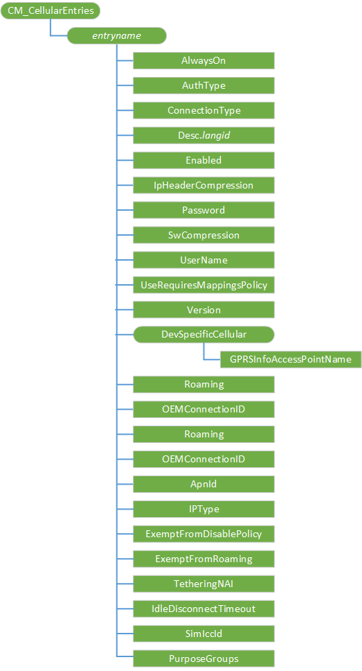

# <a name="cmcellularentries-csp"></a>CM\_CellularEntries CSP


CM\_CellularEntries 配置服务提供程序用于在设备上配置的通用数据包无线服务 (GPRS) 条目。 它定义了每个 GSM 数据访问点。

> **请注意**  
此配置服务提供商要求使用 ID\_CAP\_网络\_管理功能从网络配置应用程序进行访问。

 

下图显示了 CM\_CellularEntries 配置服务提供程序管理对象以树格式由开放手机联盟客户端资源调配 (OMA CP)。 OMA DM 协议不支持此配置服务提供商。



<a href="" id="entryname"></a>**_entryname_**  
定义连接的名称。

[CMPolicy 配置服务提供程序](cmpolicy-csp.md)使用的*entryname*值来标识与策略相关联的连接和[厘米\_ProxyEntries 配置服务提供商](cm-proxyentries-csp.md) *entryname*的值用于标识程序与代理服务器的连接。

<a href="" id="alwayson"></a>**AlwaysOn**  
类型︰ int。 指定是否连接管理器将自动尝试连接到 APN 连接可用时。

值为"0"指定 AlwaysOn 不受支持，并且只尝试连接管理器应用程序请求连接时，连接到 APN。 应用程序使用连接有时，例如，仅控制 MMS APN 是建议使用此设置。

值为"1"指定 AlwaysOn 受支持，并且连接管理器将自动尝试连接到 APN 可用时。 一般用途 Internet APNs 建议使用此设置。

必须至少一个为移动运营商提供的 AlwaysOn 互联网连接。

<a href="" id="authtype"></a>**AuthType**  
可选项。 类型︰ 字符串。 指定用于连接的身份验证的方法。

"CHAP"值指定质询握手应用程序协议。 "PAP"值指定密码身份验证协议。 值为"无"指定的用户名和密码参数将被忽略。 默认值为"无"。

<a href="" id="connectiontype"></a>**连接**  
可选项。 类型︰ 字符串。 指定用于 APN 的连接的类型。 下列连接类型有︰

<table>
<colgroup>
<col width="20%" />
<col width="80%" />
</colgroup>
<tbody>
<tr class="odd">
<td><p>gprs</p></td>
<td><p>默认。 用于 GPRS 类型连接 （GPRS + GSM + 边缘 + UMTS + LTE）。</p></td>
</tr>
<tr class="even">
<td><p>cdma</p></td>
<td><p>用于 CDMA 类型连接 （1XRTT + EVDO）。</p></td>
</tr>
<tr class="odd">
<td><p>lte</p></td>
<td><p>用于 LTE 类型连接 （eHRPD + LTE） 家庭登记设备时。</p></td>
</tr>
<tr class="even">
<td><p>传统</p></td>
<td><p>用于 GPRS + GSM + 边缘 + UMTS 连接。</p></td>
</tr>
<tr class="odd">
<td><p>lte_iwlan</p></td>
<td><p>可以通过 WiFi 下放的 GPRS 类型连接使用</p></td>
</tr>
<tr class="even">
<td><p>iwlan</p></td>
<td><p>用于为通过 WiFi 实现的连接只卸载</p></td>
</tr>
</tbody>
</table>

 

<a href="" id="desc-langid"></a>**Desc.langid**  
可选项。 指定用户界面显示字符串由定义的语言 id。

Desc.langid 的格式中的参数名称将用作指定条目的特定于语言的标识符。 例如，定义为参数`Desc.0409`值为`"GPRS Connection"`将强制"GPRS 连接"将设备设置为英语 （语言 ID 0409） 上时表示此连接用户界面中显示。 可能使用这种机制，提供多种语言的描述，如果用户更改设备上的语言首选项，系统将自动切换在它们之间。 如果给定语言的配置没有**Desc**参数时，系统将默认使用创建的项的名称。

<a href="" id="enabled"></a>**启用**  
指定是否启用该连接。

值为"0"指定连接被禁用。 "1"的值指定启用了连接。

<a href="" id="ipheadercompression"></a>**IpHeaderCompression**  
可选项。 指定是否启用 IP 报头压缩。

值为"0"指定 IP 数据头压缩连接被禁用。 值为"1"指定用于此连接的 IP 标头压缩已启用。

<a href="" id="password"></a>**密码**  
必需的 AuthType 如果被设置为"None"之外的值。 指定用于连接到 APN 的密码。

<a href="" id="swcompression"></a>**SwCompression**  
可选项。 指定是否启用软件压缩。

值为"0"指定表示已禁用软件压缩连接。 "1"的值指定启用了连接的软件压缩。

<a href="" id="username"></a>**用户名**  
必需的 AuthType 如果被设置为"None"之外的值。 指定用于连接到 APN 的用户名称。

<a href="" id="userequiresmappingspolicy"></a>**UseRequiresMappingsPolicy**  
可选项。 指定是否该连接要求相应的映射策略。

值为"0"指定该连接可用于任何一般的互联网通信。 "1"的值指定是否存在映射策略仅使用连接。

例如，如果多媒体消息服务 (MMS) APN 不应有 MMS 以外的任何其他通信，您可以配置将 MMS 通信发送到此连接的映射策略。 然后，将 UseRequiresMappingsPolicy 等于"1"的值设置连接管理器仅将该连接添加 MMS 通信。 没有它，连接管理器将尝试使用该连接的所有一般用途的互联网通信。

<a href="" id="version"></a>**版本**  
类型︰ int。 指定 XML 版本以及用于验证的连接管理器配置服务提供程序都支持 XML。

如果包含，则此值必须为"1"。

<a href="" id="gprsinfoaccesspointname"></a>**GPRSInfoAccessPointName**  
指定要选择的 GPRS 网关的逻辑名称。 有关允许值的详细信息，请参阅 GSM 技术指标 07.07"软件 10.1.1 定义 PDP 上下文 + CGDCONT"。

<a href="" id="roaming"></a>**漫游**  
可选项。 类型︰ int。 此参数指定应在其下激活连接的漫游条件。 下列情况是可用的︰

-   0-仅家庭网络。
-   1 （缺省值）-所有漫游条件 （家庭和漫游）。
-   2-家庭和国内漫游只。
-   3-国内漫游只。
-   4-非-国内漫游只。
-   5-仅漫游。

<a href="" id="oemconnectionid"></a>**OEMConnectionID**  
可选项。 类型︰ GUID。 指定要用于标识某个特定连接调制解调器的 GUID。 如果不指定值，则默认值为 00000000-0000-0000-0000-000000000000。 此参数仅可用于 LTE 设备。

<a href="" id="apnid"></a>**ApnId**  
可选项。 类型︰ int。 指定 APN 的目的。 如果没有指定值，则默认值为"0"（无）。 此参数仅可用于 LTE 设备。

<a href="" id="iptype"></a>**IPType**  
可选项。 类型︰ 字符串。 指定的连接的网络协议。 可用值为"IPv4"、"IPv6"、"IPv4v6"和"IPv4v6xlat"。 如果没有指定值，则默认值是"IPv4"。

> **警告**  
不使用 IPv6 或 IPv4v6xlat 设备或不支持 IPv6 的网络上。 数据功能将无法工作。 此外，该设备将无法连接到不支持 IPv6，除非您使用 IPv4v6 的 IPType 配置漫游连接漫游网络。

 

<a href="" id="exemptfromdisablepolicy"></a>**ExemptFromDisablePolicy**  
重新添加 Windows 10 1511年版本。 可选项。 类型︰ int。 这应该仅指定用于特殊目的连接的应用程序直接管理 （如 MMS) 其禁用状态。 值为"0"指定连接符合禁用策略使用的一般用途的连接 （无例外）。 "1"的值指定的连接是免税。 如果不指定值，则默认值为"0"（无例外）。

若要允许 MMS，当数据被设置为 OFF 时，设置为"1"的 ExemptFromDisablePolicy 和 UseRequiresMappingsPolicy。 这表示连接专用的 MMS 连接并且，它不应禁用禁用所有其他连接时。 因此，MMS 可以发送和接收时数据被设置为 OFF。 请注意，在漫游时发送 MMS 仍不允许。

> **重要**  
未设置 ExemptFromDisablePolicy 为"1"，为"1"，ExemptFromRoaming 或 UseRequiresMappingsPolicy 为"1"，对于一般用途的连接。

为了避免某些值组合 ExemptFromDisablePolicy 和 AllowMmsIfDataIsOff，用户体验不一致时不将 ExemptFromDisablePolicy 设置为 1 （默认值为 0），您应该︰

-   通过将 AllowMmsIfDataIsOffEnabled 设置为 0 （默认值为 1） 隐藏的 AllowMmsIfDataIsOff 的切换
-   将 AllowMMSIfDataIsOff 设置为 1 （默认值为 0）

 

<a href="" id="exemptfromroaming"></a>**ExemptFromRoaming**  
重新添加 Windows 10 1511年版本。 可选项。 类型︰ int。 这应指定对其应用程序直接管理其漫游状态的特殊目的连接。 不应使用一般用途的连接。 值为"0"指定连接符合漫游策略 （无例外）。 值为"1"，则指定连接免税 （受漫游策略）。 如果不指定值，则默认值为"0"（无例外）。

<a href="" id="tetheringnai"></a>**TetheringNAI**  
可选项。 类型︰ int。 只有 CDMA。 指定连接是否 tethering 连接。 值为"0"指定连接不是 tethering 连接。 值为"1"指定连接 tethering 连接。 如果不指定值，则默认值为"0"。

<a href="" id="idledisconnecttimeout"></a>**IdleDisconnectTimeout**  
可选项。 类型︰ int。 指定连接管理器连接销毁之前，拨号连接可能是未使用的时间长短。 以秒为单位指定该值。 有效值范围为 5 到 60 秒。 如果未指定，则默认值为 30 秒。

> **重要**  
更新拨号连接以确保仍然配置所需的值时，必须指定的 IdleDisconnectTimeout 值。 如果没有指定，则可能使用默认数值︰ 30 秒。

 

> **请注意**  
如果过于频繁地出现---向下/激活请求，此值应该被设置为大于 5 秒。

 

<a href="" id="simiccid"></a>**SimIccId**  
对于一个 sim 卡手机，此参数是可选的。 但是，强烈建议在创建将来的更新时，包含此值。 对于双 sim 卡手机，此参数是必需的。 类型︰ 字符串。 指定服务连接 SIM ICCID。

<a href="" id="purposegroups"></a>**PurposeGroups**  
可选项。 类型︰ 字符串。 通过 Guid 表示用途值以逗号分隔的列表指定连接的目的。 以下用途值有︰

-   互联网-3E5545D2-1137-4DC8-A198-33F1C657515F
-   MMS-53E2C5D3-D13C-4068-AA38-9C48FF2E55A8
-   IMS-474D66ED-0E4B-476B-A455-19BB1239ED13
-   SUPL-6D42669F-52A9-408E-9493-1071DCC437BD

## <a name="additional-information"></a>其他信息


要删除连接，必须首先删除所有相关联的代理，然后删除连接。 下面的示例演示如何删除代理，然后选择连接。

``` syntax
<wap-provisioningdoc>
   <characteristic type="CM_ProxyEntries">
      <nocharacteristic type="GPRS_Proxy"/>
   </characteristic>  
   <characteristic type="CM_CellularEntries">
      <nocharacteristic type="GPRS1"/>
   </characteristic>
</wap-provisioningdoc>
```

## <a name="oma-client-provisioning-examples"></a>OMA 客户端配置示例


配置 GPRS 连接︰

``` syntax
<wap-provisioningdoc>
   <characteristic type="CM_CellularEntries">
      <characteristic type="GPRSConn">
         <parm name="ConnectionType" value="gprs" />
         <characteristic type="DevSpecificCellular">
            <parm name="GPRSInfoAccessPointName" value="apn.adatum.com" />
         </characteristic>
         <parm name="AlwaysOn" value="0" />
         <parm name="Enabled" value="1" />
      </characteristic>
   </characteristic>
</wap-provisioningdoc>
```

配置 LTE 连接︰

``` syntax
<wap-provisioningdoc>
   <characteristic type="CM_CellularEntries">
      <characteristic type="LteConn">
         <parm name="ConnectionType" value="lte" />
         <characteristic type="DevSpecificCellular">
            <parm name="GPRSInfoAccessPointName" value="INTERNET_LTE" />
         </characteristic>
         <parm name="ApnId" value="0" />
         <parm name="IPType" value="IPv4v6" />
         <parm name="Enabled" value="1" />
         <parm name="OemConnectionId" value="01234567-89AB-CDEF-0123-456789ABCDEF" />
      </characteristic> 
   </characteristic>
</wap-provisioningdoc>
```

配置 CDMA 连接︰

``` syntax
<wap-provisioningdoc>
   <characteristic type="CM_CellularEntries">
      <characteristic type="CDMAConn">
         <parm name="Version" value="1"/>
         <parm name="AuthType" value="chap" />
         <parm name="ConnectionType" value="cdma"/>
         <parm name="Enabled" value="1"/>
         <parm name="AlwaysOn" value="0"/>
         <parm name="UseRequiresMappingsPolicy" value="0"/>
         <parm name="UserName" value="user@adatum.com"/>
         <parm name="Password" value="fakeuserpassword"/>
      </characteristic>
   </characteristic>
</wap-provisioningdoc>
```

## <a name="microsoft-custom-elements"></a>Microsoft 的自定义元素


下表显示了此配置服务提供程序支持 OMA 客户端资源调配的 Microsoft 自定义元素。

<table>
<colgroup>
<col width="50%" />
<col width="50%" />
</colgroup>
<thead>
<tr class="header">
<th>元素</th>
<th>可用</th>
</tr>
</thead>
<tbody>
<tr class="odd">
<td><p>nocharacteristic</p></td>
<td><p>是</p></td>
</tr>
<tr class="even">
<td><p>特征查询</p></td>
<td><p>是</p></td>
</tr>
<tr class="odd">
<td><p>参数查询</p></td>
<td><p>是</p></td>
</tr>
</tbody>
</table>

 

## <a name="related-topics"></a>相关的主题


[配置服务提供程序的引用](configuration-service-provider-reference.md)

 

 


