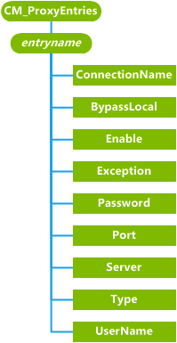

# <a name="cmproxyentries-csp"></a>CM\_ProxyEntries CSP


CM\_ProxyEntries 配置服务提供程序用来在移动设备上配置代理服务器连接。

> **请注意** CM\_ProxyEntries CSP 只支持 Windows 10 移动。

 

> **请注意**  此配置服务提供商要求使用 ID\_CAP\_CSP\_基础和 ID\_CAP\_网络\_管理功能从网络配置应用程序进行访问。

 

下图显示了 CM\_以树格式由开放手机联盟客户端资源调配 (OMA CP) 和 OMA 设备 Management(OMA DM) 的 ProxyEntries 配置服务提供程序管理对象。 Windows 10，1607年版本中添加了对 OMA DM 的支持。



<a href="" id="entryname"></a>**entryname**  
定义连接代理服务器的名称。

移动通信的每个条目可以只有一个代理项。 例如，互联网连接可以有不超过一个指定的 HTTP 代理服务器，但也可能有 WAP 代理。 如果两个应用程序需要访问相同的 APN 但一个应用程序需要代理服务器和其他应用程序不能有一个代理，两个条目可以创建具有不同名称的相同的 APN。

<a href="" id="connectionname"></a>**ConnectionName**  
指定代理服务器的连接的名称相关联。 这是连接将被配置使用的 APN 名称[厘米\_CellularEntries 配置服务提供商](cm-cellularentries-csp.md)。

<a href="" id="bypasslocal"></a>**BypassLocal**  
指定本地主机访问的设备时，是否应跳过代理服务器。

值为"0"指定本地主机代理绕过被禁用。 "1"的值指定启用了代理旁路的本地主机。

<a href="" id="enable"></a>**启用**  
指定是否启用代理。

值为"0"指定代理已禁用。 "1"的值指定启用了代理。

<a href="" id="exception"></a>**异常**  
指定应跳过代理服务器访问外部主机的列表。

例外列表是主机名称的分号分隔的列表。 例如，访问 MSN 或雅虎时，不使用代理服务器，例外列表的值就是"www.msn.com;www.yahoo.com"。

<a href="" id="password"></a>**密码**  
指定用于连接到代理服务器的密码。

密码只是所需的 WAP 和 SOCKS 代理并不使用 HTTP 代理服务器。 此参数的查询返回一个字符串，包含星号 (\*)。

在设置密码时，在同一字符串中的传递会导致新的密码被忽略，不会更改现有密码。

<a href="" id="port"></a>**端口**  
指定代理服务器的端口号。

<a href="" id="server"></a>**服务器**  
指定代理服务器的名称。

<a href="" id="type"></a>**类型**  
指定用于此项的代理服务器连接的类型。

下面的列表枚举类型参数所允许的值。

-   0 = null 代理

-   "1"= HTTP 代理服务器

-   "2"= WAP 代理服务器

-   "4"= SOCKS4 代理

-   "5"= SOCKS5 代理

Null 代理服务器可以用于允许连接管理器从一个网络中创建空的代理服务器到另一个网络视为一组超级另一个网络。

<a href="" id="username"></a>**用户名**  
指定用于连接到代理服务器的用户名。

## <a name="additional-information"></a>其他信息


要删除代理服务器及其关联的连接，必须首先删除该代理并再删除此连接。 下面的示例演示如何删除代理，然后选择连接。

``` syntax
<wap-provisioningdoc>
   <characteristic type="CM_ProxyEntries">
      <nocharacteristic type="GPRS_Proxy"/>
   </characteristic>  
   <characteristic type="CM_CellularEntries">
      <nocharacteristic type="GPRS1"/>
   </characteristic>
</wap-provisioningdoc>
```

## <a name="microsoft-custom-elements"></a>Microsoft 的自定义元素


下表显示了此配置服务提供程序支持 OMA 客户端资源调配的 Microsoft 自定义元素。

<table>
<colgroup>
<col width="50%" />
<col width="50%" />
</colgroup>
<thead>
<tr class="header">
<th>元素</th>
<th>可用</th>
</tr>
</thead>
<tbody>
<tr class="odd">
<td><p>参数查询</p></td>
<td><p>是</p></td>
</tr>
<tr class="even">
<td><p>nocharacteristic</p></td>
<td><p>是</p></td>
</tr>
<tr class="odd">
<td><p>特征查询</p></td>
<td><p>是</p>
<p>递归查询︰ 是</p>
<p>顶级查询︰ 是</p></td>
</tr>
</tbody>
</table>

 

## <a name="related-topics"></a>相关的主题


[配置服务提供程序的引用](configuration-service-provider-reference.md)

 

 


