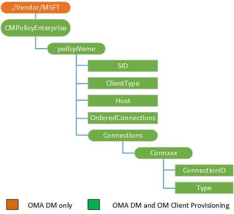

# <a name="cmpolicyenterprise-csp"></a>CMPolicyEnterprise 的 CSP


企业使用 CMPolicyEnterprise 配置服务提供程序来定义连接管理器用来确定正确的连接请求的连接规则。

> **请注意**  
此配置服务提供商要求使用 ID\_CAP\_CSP\_基础和 ID\_CAP\_网络\_管理功能从网络配置应用程序进行访问。

 

每个策略条目标识主机模式结合中的一个或多个应用程序。 该策略条目分配的连接管理器将使用来满足应用程序和主机模式匹配的连接请求的连接详细信息的列表。 CMPolicyEnterprise 配置服务提供程序可以有多个策略

**订购策略**︰ 策略没有显式排序。 一般的规则是最具体或特定策略映射需要较高的优先级。

**默认策略**︰ 以最具体的策略之前的更多常规的策略，考虑其作用域的顺序应用策略。 手机的默认行为适用于所有应用程序和所有域，可用无其他，更具体策略时才使用。 默认策略是的使用任何可用的 Wi-Fi 网络第一次，然后任何可用的 APN。

下图显示了 CMPolicyEnterprise 配置服务提供程序管理对象以树格式由开放移动联盟 (OMA) 客户端资源调配和 OMA 设备管理。



<a href="" id="policyname"></a>***policyName***  
定义了该策略的名称。

<a href="" id="sid"></a>**SID**  
SID 值取决于客户端类型。

对于通用 Windows 平台 (UWP) 基于应用程序的映射策略，SID 是包系列名称不大括号 {}，不是应用程序的情况下。

对于非 UWP 基于应用程序的映射策略，SID 是 GUID 格式的应用程序产品 ID。 花括号 {} 环绕 GUID 是必需的。

对于基于主机的映射策略，必须将 SID 设置为`*`。

<a href="" id="clienttype"></a>**客户端类型**  
指定的映射策略类型。

下面的列表描述了可用的映射策略类型︰

-   基于应用程序的映射策略将应用于应用程序。 若要指定这种类型的映射，请使用值`app`。

-   基于主机的映射策略将应用于所有类型的客户端请求到指定主机的连接。 若要指定这种类型的映射，请使用值`*`。

<a href="" id="host"></a>**主机**  
指定主机模式的名称。 选择要使用的正确策略的连接请求的主机名进行匹配。

主机模式可以有两个通配符，"\*"和"+"。 主机模式不是 URL 模式，没有传输或特定主机上的路径的概念。 例如，主机模式可能是"\*.host\_name.com"以匹配到主机的任何前缀\_name.com 域。 主机模式将匹配"www.host\_name.com"和"mail.host\_name.com"，但它不会匹配"主机\_name.com"。

<a href="" id="orderedconnections"></a>**OrderedConnections**  
指定连接的列表是按优先顺序。

值为"0"指定的连接不按优先顺序排列。 值为"1"指示列出的连接首选项的顺序。

<a href="" id="connxxx"></a>**Conn ***_XXX_**  
枚举与策略相关联的连接。 元素名称开头"连接"跟三个数字开始从"000"的增量。 例如，策略应用于五个连接会使元素项名为"Conn000"、"Conn001"、"Conn002"、"Conn003"和"Conn004"。

<a href="" id="connectionid"></a>**ConnectionID**  
指定一组连接中的连接的唯一标识符。 类型参数为基础的精确值。

为`CMST_CONNECTION_NAME`，指定连接名称。 例如，如果您有使用 CM 配置连接\_CellularEntries 配置服务提供程序，该连接名称可以是连接的名称。 如果您有使用设置为"GPRS1"NAPID 配置 NAP，可能是连接的名称“GPRS1@WAP”.

为`CMST_CONNECTION_TYPE`，指定所需的连接类型的 GUID。 花括号 {} 环绕 GUID 是必需的。 下列连接类型有︰

<table>
<colgroup>
<col width="50%" />
<col width="50%" />
</colgroup>
<thead>
<tr class="header">
<th>连接类型</th>
<th>GUID</th>
</tr>
</thead>
<tbody>
<tr class="odd">
<td><p>GSM</p></td>
<td><p>{A05DC613-E393-40ad-AA89-CCCE04277CD9}</p></td>
</tr>
<tr class="even">
<td><p>CDMA</p></td>
<td><p>{274AD55A-4A70-4E35-93B3-AE2D2E6727FC}</p></td>
</tr>
<tr class="odd">
<td><p>传统的 3GPP</p></td>
<td><p>{6DE4C04B-B74E-47FA-99E5-8F2097C06A92}</p></td>
</tr>
<tr class="even">
<td><p>LTE</p></td>
<td><p>{2378E547-8312-46A5-905E-5C581E92693B}</p></td>
</tr>
<tr class="odd">
<td><p>Wi-Fi</p></td>
<td><p>{8568B401-858E-4B7B-B3DF-0FD4927F131B}</p></td>
</tr>
<tr class="even">
<td><p>Wi-Fi 热点</p></td>
<td><p>{072FC7DC-1D93-40D1-9BB0-2114D7D73434}</p></td>
</tr>
</tbody>
</table>

 

为`CMST_CONNECTION_NETWORK_TYPE`，指定需要的网络类型的 GUID。 花括号 {} 环绕 GUID 是必需的。 下面的网络类型是可用的︰

<table>
<colgroup>
<col width="50%" />
<col width="50%" />
</colgroup>
<thead>
<tr class="header">
<th>网络类型</th>
<th>GUID</th>
</tr>
</thead>
<tbody>
<tr class="odd">
<td><p>GPRS</p></td>
<td><p>{AFB7D659-FC1F-4EA5-BDD0-0FDA62676D96}</p></td>
</tr>
<tr class="even">
<td><p>1XRTT</p></td>
<td><p>{B1E700AE-A62F-49FF-9BBE-B880C995F27D}</p></td>
</tr>
<tr class="odd">
<td><p>边缘</p></td>
<td><p>{C347F8EC-7095-423D-B838-7C7A7F38CD03}</p></td>
</tr>
<tr class="even">
<td><p>WCDMA UMTS</p></td>
<td><p>{A72F04C6-9BE6-4151-B5EF-15A53E12C482}</p></td>
</tr>
<tr class="odd">
<td><p>WCDMA FOMA</p></td>
<td><p>{B8326098-F845-42F3-804E-8CC3FF7B50B4}</p></td>
</tr>
<tr class="even">
<td><p>1XEVDO</p></td>
<td><p>{DD42DF39-EBDF-407C-8146-1685416401B2}</p></td>
</tr>
<tr class="odd">
<td><p>1XEVDV</p></td>
<td><p>{61BF1BFD-5218-4CD4-949C-241CA3F326F6}</p></td>
</tr>
<tr class="even">
<td><p>HSPA HSDPA</p></td>
<td><p>{047F7282-BABD-4893-AA77-B8B312657F8C}</p></td>
</tr>
<tr class="odd">
<td><p>HSPA HSUPA</p></td>
<td><p>{1536A1C6-A4AF-423C-8884-6BDDA3656F84}</p></td>
</tr>
<tr class="even">
<td><p>LTE</p></td>
<td><p>{B41CBF43-6994-46FF-9C2F-D6CA6D45889B}</p></td>
</tr>
<tr class="odd">
<td><p>EHRPD</p></td>
<td><p>{7CFA04A5-0F3F-445C-88A4-C86ED2AD94EA}</p></td>
</tr>
<tr class="even">
<td><p>10Mbps 以太网</p></td>
<td><p>{97D3D1B3-854A-4C32-BD1C-C13069078370}</p></td>
</tr>
<tr class="odd">
<td><p>100Mbps 以太网</p></td>
<td><p>{A8F4FE66-8D04-43F5-9DD2-2A85BD21029B}</p></td>
</tr>
<tr class="even">
<td><p>以太网 Gbps</p></td>
<td><p>{556C1E6B-B8D4-448E-836D-9451BA4CCE75}</p></td>
</tr>
</tbody>
</table>

 

为`CMST_CONNECTION_DEVICE_TYPE`，指定所需的设备类型的 GUID。 花括号 {} 环绕 GUID 是必需的。 以下设备类型有︰

<table>
<colgroup>
<col width="50%" />
<col width="50%" />
</colgroup>
<thead>
<tr class="header">
<th>设备类型</th>
<th>GUID</th>
</tr>
</thead>
<tbody>
<tr class="odd">
<td><p>蜂窝移动通信设备</p></td>
<td><p>{F9A53167-4016-4198-9B41-86D9522DC019}</p></td>
</tr>
<tr class="even">
<td><p>以太网</p></td>
<td><p>{97844272-00C7-4572-B20A-D8D861C095F2}</p></td>
</tr>
<tr class="odd">
<td><p>Bluetooth</p></td>
<td><p>{1D793123-701A-4fd0-B6AE-9C3C57E99C2C}</p></td>
</tr>
<tr class="even">
<td><p>虚拟</p></td>
<td><p>{EAA02CE5-9C70-4E87-97FE-55C9DEC847D4}</p></td>
</tr>
</tbody>
</table>

 

<a href="" id="type"></a>**类型**  
指定连接所引用的类型。 下面的列表描述了可用的连接类型︰

-   `CMST_CONNECTION_NAME`– 由名称指定的连接。

-   `CMST_CONNECTION_TYPE`– 指定的类型任何连接。

-   `CMST_CONNECTION_NETWORK_TYPE`– 指定的设备类型任何连接。

-   `CMST_CONNECTION_DEVICE_TYPE`– 指定的网络类型任何连接。

## <a name="oma-client-provisioning-examples"></a>OMA 客户端配置示例


添加一个基于应用程序的映射策略。 在此示例中，类型 CMST ConnectionId\_连接\_名称设置为使用 CM 配置连接 ("GPRSConn1") 的名称\_CellularEntries 配置服务提供程序。

``` syntax
<wap-provisioningdoc>

   <characteristic type="CM_CellularEntries">
       <characteristic type="GPRSConn1">
          <parm name="ConnectionType" value="gprs" />
             <characteristic type="DevSpecificCellular">
                <parm name="GPRSInfoAccessPointName" value="apn.adatum.com" />
         </characteristic>
          <parm name="AlwaysOn" value="0" />
          <parm name="Enabled" value="1" />
       </characteristic>
    </characteristic>

   <characteristic type="CMPolicyEnterprise">
      <characteristic type="Policy1">
       <parm name="SID" value="{A05D1234-F393-9385-AA89-CD3E049367D2}" />
       <parm name="ClientType" value="app" />
       <parm name="Host" value="*.+" />
       <parm name="OrderedConnections" value="1" />
       <characteristic type="Connections">
           <characteristic type="Conn000">
               <parm name="Type" value="CMST_CONNECTION_DEVICE_TYPE" /> 
               <parm name="ConnectionId" value="{F9A53167-4016-4198-9B41-86D9522DC019}" /> 
           </characteristic>
           <characteristic type="Conn001">
               <parm name="Type" value="CMST_CONNECTION_NETWORK_TYPE" /> 
               <parm name="ConnectionId" value="{AFB7D659-FC1F-4EA5-BDD0-0FDA62676D96}" /> 
           </characteristic>
           <characteristic type="Conn002">
               <parm name="Type" value="CMST_CONNECTION_NAME" /> 
               <parm name="ConnectionId" value="GPRSConn1" /> 
           </characteristic>
           <characteristic type="Conn003">
              <parm name="Type" value="CMST_CONNECTION_TYPE" /> 
              <parm name="ConnectionId" value="{072FC7DC-1D93-40d1-9BB0-2114D7D73434}" /> 
           </characteristic>
       </characteristic>
      </characteristic>
    </characteristic>
</wap-provisioningdoc>
```

添加一个基于主机的映射策略。 在此示例中，类型 CMST ConnectionId\_连接\_名称设置为使用 CM 配置连接 ("GPRSConn1") 的名称\_CellularEntries 配置服务提供程序。

``` syntax
<wap-provisioningdoc>

   <characteristic type="CM_CellularEntries">
       <characteristic type="GPRSConn1">
          <parm name="ConnectionType" value="gprs" />
             <characteristic type="DevSpecificCellular">
                <parm name="GPRSInfoAccessPointName" value="apn.adatum.com" />
         </characteristic>
          <parm name="AlwaysOn" value="0" />
          <parm name="Enabled" value="1" />
       </characteristic>
    </characteristic>

   <characteristic type="CMPolicyEnterprise">
      <characteristic type="Policy3">
       <parm name="SID" value="*" />
       <parm name="ClientType" value="*" />
       <parm name="Host" value="*.contoso.com" />
       <parm name="OrderedConnections" value="1" />
       <characteristic type="Connections">
           <characteristic type="Conn000">
               <parm name="Type" value="CMST_CONNECTION_DEVICE_TYPE" /> 
               <parm name="ConnectionId" value="{F9A53167-4016-4198-9B41-86D9522DC019}" /> 
           </characteristic>
           <characteristic type="Conn001">
               <parm name="Type" value="CMST_CONNECTION_NETWORK_TYPE" /> 
               <parm name="ConnectionId" value="{AFB7D659-FC1F-4EA5-BDD0-0FDA62676D96}" /> 
           </characteristic>
           <characteristic type="Conn002">
               <parm name="Type" value="CMST_CONNECTION_NAME" /> 
               <parm name="ConnectionId" value="GPRSConn1" /> 
           </characteristic>
           <characteristic type="Conn003">
               <parm name="Type" value="CMST_CONNECTION_TYPE" /> 
               <parm name="ConnectionId" value="{072FC7DC-1D93-40d1-9BB0-2114D7D73434}" /> 
           </characteristic>
       </characteristic>
      </characteristic>
    </characteristic>

</wap-provisioningdoc>
```

## <a name="oma-dm-examples"></a>OMA DM 示例


添加一个基于应用程序的映射策略︰

``` syntax
<SyncML>
    <SyncBody>
        <Atomic>
    <CmdID>8000</CmdID>
    <Add>
        <CmdID>8051</CmdID>
        <Item>
            <Target>
                <LocURI>./Vendor/MSFT/CMPolicyEnterprise/BTHPolicy4/SID</LocURI>
            </Target>
            <Data>{A05D1234-F393-9385-AA89-CD3E049367D2}</Data>
        </Item>
    </Add>
    <Add>
        <CmdID>8052</CmdID>
        <Item>
            <Target>
                <LocURI>./Vendor/MSFT/CMPolicyEnterprise/BTHPolicy4/ClientType</LocURI>
            </Target>
            <Data>app</Data>
        </Item>
    </Add>
    <Add>
        <CmdID>8053</CmdID>
        <Item>
            <Target>
                <LocURI>./Vendor/MSFT/CMPolicyEnterprise/BTHPolicy4/Host</LocURI>
            </Target>
            <Data>*.+</Data>
        </Item>
    </Add>
    <Add>
        <CmdID>8054</CmdID>
        <Item>
            <Target>
                <LocURI>./Vendor/MSFT/CMPolicyEnterprise/BTHPolicy4/OrderedConnections</LocURI>
            </Target>
            <Data>1</Data>
        </Item>
    </Add>
    <Add>
        <CmdID>8055</CmdID>
        <Item>
            <Target>
                <LocURI>./Vendor/MSFT/CMPolicyEnterprise/BTHPolicy4/Connections/Conn000/ConnectionId</LocURI>
            </Target>
            <Data>{A05DC613-E393-40AD-AA89-CCCE04277CD9}</Data>
        </Item>
    </Add>
    <Add>
        <CmdID>8056</CmdID>
        <Item>
            <Target>
                <LocURI>./Vendor/MSFT/CMPolicyEnterprise/BTHPolicy4/Connections/Conn000/Type</LocURI>
            </Target>
            <Data>CMST_CONNECTION_DEVICE_TYPE</Data>
        </Item>
    </Add>
        </Atomic> 
        <Final/>
    </SyncBody>
</SyncML>
```

添加一个基于主机的映射策略︰

``` syntax
<SyncML>
    <SyncBody>
        <Atomic>
    <CmdID>8000</CmdID>
    <Add>
        <CmdID>8049</CmdID>
        <Item>
            <Target>
                <LocURI>./Vendor/MSFT/CMPolicyEnterprise/BTHPolicy6/SID</LocURI>
            </Target>
            <Data>*</Data>
        </Item>
    </Add>
    <Add>
        <CmdID>8050</CmdID>
        <Item>
            <Target>
                <LocURI>./Vendor/MSFT/CMPolicyEnterprise/BTHPolicy6/ClientType</LocURI>
            </Target>
            <Data>*</Data>
        </Item>
    </Add>
    <Add>
        <CmdID>8051</CmdID>
        <Item>
            <Target>
                <LocURI>./Vendor/MSFT/CMPolicyEnterprise/BTHPolicy6/Host</LocURI>
            </Target>
            <Data>*.contoso.com</Data>
        </Item>
    </Add>
    <Add>
        <CmdID>8052</CmdID>
        <Item>
            <Target>
                <LocURI>./Vendor/MSFT/CMPolicyEnterprise/BTHPolicy6/OrderedConnections</LocURI>
            </Target>
            <Data>1</Data>
        </Item>
    </Add>
    <Add>
        <CmdID>8053</CmdID>
        <Item>
            <Target>
                <LocURI>./Vendor/MSFT/CMPolicyEnterprise/BTHPolicy6/Connections/Conn000/ConnectionId</LocURI>
            </Target>
            <Data>{AFB7D659-FC1F-4EA5-BDD0-0FDA62676D96}</Data>
        </Item>
    </Add>
    <Add>
        <CmdID>8054</CmdID>
        <Item>
            <Target>
                <LocURI>./Vendor/MSFT/CMPolicyEnterprise/BTHPolicy6/Connections/Conn000/Type</LocURI>
            </Target>
            <Data>CMST_CONNECTION_NETWORK_TYPE</Data>
        </Item>
    </Add>
        </Atomic>
        <Final/>
    </SyncBody>
</SyncML>
```

## <a name="microsoft-custom-elements"></a>Microsoft 的自定义元素


<table>
<colgroup>
<col width="50%" />
<col width="50%" />
</colgroup>
<thead>
<tr class="header">
<th>元素</th>
<th>可用</th>
</tr>
</thead>
<tbody>
<tr class="odd">
<td><p>参数查询</p></td>
<td><p>是</p></td>
</tr>
<tr class="even">
<td><p>nocharacteristic</p></td>
<td><p>是</p></td>
</tr>
<tr class="odd">
<td><p>特征查询</p></td>
<td><p>是</p>
<p>递归查询︰ 是</p>
<p>顶级查询︰ 是</p></td>
</tr>
</tbody>
</table>

 

## <a name="related-topics"></a>相关的主题


[配置服务提供程序的引用](configuration-service-provider-reference.md)

 

 


