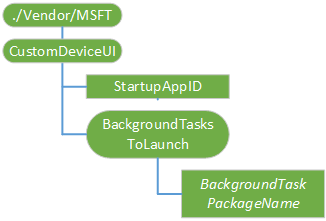

# <a name="customdeviceui-csp"></a>CustomDeviceUI 的 CSP

CustomDeviceUI 配置服务提供程序使 Oem 可以实现自己自定义前景的应用程序，以及后台任务在运行 IoT 核心 IoT 设备上运行。 每设备支持只有一个前台应用程序。 支持多个后台任务。
下图显示树状格式由开放移动联盟 (OMA) 设备管理 (DM) 和 OMA 客户端资源调配使用 CustomDeviceUI 配置服务提供程序。

> **请注意** 此配置服务提供程序仅适用于 Windows 10 IoT 核心 （IoT 核心）。



<a href="" id="./Vendor/MSFT/CustomDeviceUI"></a>**./Vendor/MSFT/CustomDeviceUI**  
CustomDeviceUI 配置服务提供程序的根节点。 受支持的操作是获得。

<a href="" id="StartupAppID"></a>**StartupAppID**  
应用程序标识的字符串值是默认应用程序标识/AUMID 在启动过程中启动。 支持的操作包括获取和替换。

<a href="" id="BackgroundTasksToLaunch"></a>**BackgroundTasksToLaunch**  
后台任务，需要在设备启动时启动的包名称的列表。 受支持的操作是获得。

<a href="" id="BackgroundTasksToLaunch/BackgroundTaskPackageName"></a>**BackgroundTasksToLaunch / ***_BackgroundTaskPackageName_**  
包的需要在后台启动该应用程序的全名。 此文件可以包含任何入口点、 单一入口点或多个入口点。 支持的操作是添加，删除，获取和替换。

## <a name="syncml-examples"></a>SyncML 示例


**设置 StartupAppID**

``` syntax
<SyncML xmlns="SYNCML:SYNCML1.2">
  <SyncBody>      
        <Replace>
          <CmdID>1</CmdID>
          <Item>
            <Target>
              <LocURI>./Vendor/MSFT/CustomDeviceUI/StartupAppID</LocURI>
            </Target>       
             <Meta>
                <Format xmlns="syncml:metinf">chr</Format>
            </Meta>
            <Data>DefaultApp_cw5n1h2txyewy!App</Data>
        </Item>
        </Replace>        
     <Final/>
  </SyncBody>
</SyncML>
```

**获取所有后台任务**

``` syntax
<SyncML xmlns="SYNCML:SYNCML1.2">
  <SyncBody>      
        <Get>
          <CmdID>1</CmdID>
          <Item>
            <Target>
                <LocURI>./Vendor/MSFT/CustomDeviceUI/BackgroundTaskstoLaunch?list=Struct</LocURI>
            </Target>
          </Item>
        </Get>        
     <Final/>
  </SyncBody>
</SyncML>
```

**添加后台任务**

``` syntax
<SyncML xmlns="SYNCML:SYNCML1.2">
  <SyncBody>      
        <Add>
          <CmdID>1</CmdID>
          <Item>
            <Target>
              <LocURI>./Vendor/MSFT/CustomDeviceUI/BackgroundTaskstoLaunch/BackgroundService1_1.3.0.1_neutral__8wekyb3d8bbwe</LocURI>
            </Target>
            <Meta>
                <Format xmlns="syncml:metinf">chr</Format>
            </Meta>
            <Data>0</Data>
          </Item>
        </Add>        
     <Final/>
  </SyncBody>
</SyncML>
```

 

 


