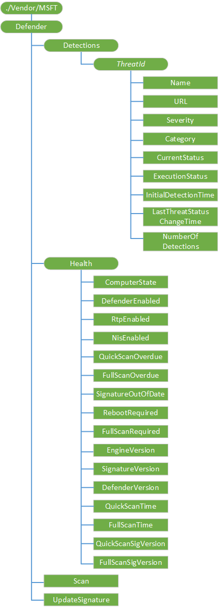

# Defender CSP

Windows Defender 配置服务提供程序用于配置各种 Windows Defender 操作跨整个企业。

下面的图像以树格式显示 Windows Defender 配置服务提供程序

**检测**  
内部节点进行分组所有 Windows Defender 被检测到的威胁。

受支持的操作是获得。

**检测 / ***_ThreatId_**  
通过 Windows Defender 已检测到的威胁的 ID。

受支持的操作是获得。

**检测 /*ThreatId*/Name**  
特定威胁的名称。

数据类型是一个字符串。

受支持的操作是获得。

**检测 /*ThreatId*/URL**  
其他威胁信息的 URL 链接。

数据类型是一个字符串。

受支持的操作是获得。

**检测 /*ThreatId*/Severity**  
威胁严重性 id。

数据类型是一个整数。

下面的列表显示了受支持的值︰

-   0 = 未知
-   1 = 低
-   2 = 中等
-   4 = 高
-   5 = 严重

受支持的操作是获得。

**检测 /*ThreatId*/Category**  
威胁类别 id。

数据类型是一个整数。

下表描述了受支持的值︰

| 值 | 说明                 |
|-------|-----------------------------|
| 0     | 无效                     |
| 1     | 广告软件                      |
| 2     | 间谍软件                     |
| 3     | 密码盗用程序            |
| 4     | 特洛伊木马下载程序           |
| 5     | 蠕虫病毒                        |
| 6     | 后门                    |
| 7     | 远程访问特洛伊木马程序        |
| 8     | 特洛伊木马程序                      |
| 9     | 电子邮件 flooder               |
| 10    | 程序                   |
| 11    | 拨号程序                      |
| 12    | 监控软件         |
| 13    | 浏览器修改程序            |
| 14    | Cookie                      |
| 15    | 浏览器插件              |
| 16    | AOL 利用漏洞攻击                 |
| 17    | Nuker                       |
| 18    | 安全 disabler           |
| 19    | 玩笑程序                |
| 20    | 敌对的 ActiveX 控件     |
| 21    | 软件捆绑程序            |
| 22    | 隐密的修饰符            |
| 23    | 设置功能键           |
| 24    | Toolbar                     |
| 25    | 远程控制软件     |
| 26    | FTP 特洛伊木马                  |
| 27    | 潜在不需要的软件 |
| 28    | ICQ 利用漏洞攻击                 |
| 29    | 特洛伊木马程序的远程登录               |
| 30    | 利用漏洞攻击                     |
| 31    | 文件共享程序        |
| 32    | 恶意软件创建工具       |
| 33    | 远程控制软件     |
| 34    | 工具                        |
| 36    | 特洛伊木马程序拒绝服务    |
| 37    | 植入的木马程序              |
| 38    | 特洛伊木马的大量邮件程序          |
| 39    | 特洛伊木马监视软件  |
| 40    | 特洛伊木马程序代理服务器         |
| 42    | 病毒                       |
| 43    | 已知的                       |
| 44    | 未知                     |
| 45    | SPP                         |
| 46    | 行为                    |
| 47    | 漏洞               |
| 48    | 策略                      |

 

受支持的操作是获得。

**检测 /*ThreatId*/CurrentStatus**  
威胁的当前状态的信息。

数据类型是一个整数。

下面的列表显示了受支持的值︰

-   0 = 未知
-   1 = 检测到
-   2 = 已清理
-   3 = 隔离
-   4 = 被
-   5 = 允许
-   6 = 受阻
-   102 = 清理失败
-   103 = 隔离失败
-   104 = 删除失败
-   105 = 允许失败
-   106 = 放弃
-   107 = 阻止失败

受支持的操作是获得。

**检测 /*ThreatId*/ExecutionStatus**  
有关执行状态的威胁信息。

数据类型是一个整数。

受支持的操作是获得。

**检测 /*ThreatId*/InitialDetectionTime**  
第一次检测到这种特定的威胁。

数据类型是一个字符串。

受支持的操作是获得。

**检测 /*ThreatId*/LastThreatStatusChangeTime**  
上次更改此特定威胁。

数据类型是一个字符串。

受支持的操作是获得。

**检测 /*ThreatId*/NumberOfDetections**  
在特定的客户端已检测到这种威胁次数。

数据类型是一个整数。

受支持的操作是获得。

**健康状况**  
对 Windows Defender 健康状态有关的信息分组内部节点。

受支持的操作是获得。

**健康/ComputerState**  
提供该设备的当前状态。

数据类型是一个整数。

下面的列表显示了受支持的值︰

-   0 = 清理
-   1 = 完全扫描挂起
-   2 = 挂起的重新启动
-   4 = 挂起的手动步骤
-   8 = 挂起的脱机扫描
-   16 = 挂起的严重故障

受支持的操作是获得。

**健康/DefenderEnabled**  
指示 Windows Defender 服务是否正在运行。

数据类型是一个布尔值。

受支持的操作是获得。

**健康/RtpEnabled**  
指示是否正在运行实时保护。

数据类型是一个布尔值。

受支持的操作是获得。

**健康/NisEnabled**  
指示是否正在运行网络保护。

数据类型是一个布尔值。

受支持的操作是获得。

**健康/QuickScanOverdue**  
指示 Windows Defender 快速扫描是否过期的设备。

数据类型是一个布尔值。

受支持的操作是获得。

**健康/FullScanOverdue**  
指示 Windows Defender 完全扫描是否过期的设备。

数据类型是一个布尔值。

受支持的操作是获得。

**健康/SignatureOutOfDate**  
指示 Windows Defender 签名是否过期。

数据类型是一个布尔值。

受支持的操作是获得。

**健康/RebootRequired**  
指示是否需要设备重新启动。

数据类型是一个布尔值。

受支持的操作是获得。

**健康/FullScanRequired**  
指示是否需要 Windows Defender 完全扫描。

数据类型是一个布尔值。

受支持的操作是获得。

**健康/EngineVersion**  
在设备上的当前 Windows Defender 引擎的版本号。

数据类型是一个字符串。

受支持的操作是获得。

**健康/特征码版本**  
在设备上的当前 Windows Defender 签名的版本号。

数据类型是一个字符串。

受支持的操作是获得。

**健康/DefenderVersion**  
设备上的 Windows Defender 版本编号。

数据类型是一个字符串。

受支持的操作是获得。

**健康/QuickScanTime**  
设备的上一次 Windows Defender 快速扫描的时间。

数据类型是一个字符串。

受支持的操作是获得。

**健康/FullScanTime**  
设备的上一次 Windows Defender 完全扫描的时间。

数据类型是一个字符串。

受支持的操作是获得。

**健康/QuickScanSigVersion**  
用于设备的最后一个快速扫描的特征码版本。

数据类型是一个字符串。

受支持的操作是获得。

**健康/FullScanSigVersion**  
用于设备的上一次完整扫描的特征码版本。

数据类型是一个字符串。

受支持的操作是获得。

**扫描**  
在设备上扫描可以用来启动 Windows Defender 的节点。

有效值包括︰
- 1-快速扫描
- 2-完全扫描

支持的操作包括获取和执行。

**UpdateSignature**  
可用于为 Windows Defender 执行签名更新的节点。

支持的操作包括获取和执行。

## 相关的主题

[配置服务提供程序的引用](configuration-service-provider-reference.md)

 

 

