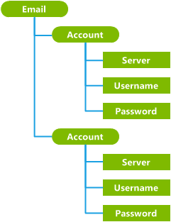
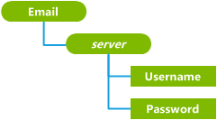

# 设计一个自定义配置服务提供程序

若要设计一个自定义配置服务提供商，OEM 必须执行以下步骤︰

1.  建立节点的语义
2.  配置服务提供商的子树的形状
3.  选择一种事务方案的每个节点
4.  确定节点操作

有关较大流程编写新配置服务提供程序的详细信息，请参阅[创建自定义配置服务提供程序](create-a-custom-configuration-service-provider.md)。

## 建立节点的语义

首先，确定所需的节点根据注册表中存储的数据的种类。

节点可以表示任何东西从抽象的概念或集合 （如电子邮件帐户或连接设置） 到更具体的对象 （例如，注册表项和值、 目录和文件）。

### 示例

例如，假设的电子邮件配置服务提供程序可能会有这些节点︰

-   帐户: （如"Hotmail") 的电子邮件帐户的名称

-   用户名︰ 用户名或电子邮件地址("exampleAccount@hotmail.com")

-   密码︰ 用户的密码

-   服务器︰ 服务器 ("邮件-serv1-example.mail.hotmail.com") 的 DNS 地址

`Account`， `Username`，和`Server`节点存放基于文本信息的电子邮件帐户，该用户的电子邮件地址，并与该帐户相关联的服务器地址。 `Password`节点中，但是，可能会存储二进制的用户的密码散列。

## 配置服务提供商的子树的形状

在确定节点代表什么之后, 决定设置层次结构中的每个节点的适合位置。

配置服务提供商的子树的根节点必须配置服务提供程序的名称。 在此示例中，根节点是`Email`。

所有在上一步中定义的节点必须位于配置服务提供程序的根节点下。 叶节点应该用于存储数据，并应使用内部节点对数据进行分组成逻辑集合。 节点 Uri 必须是唯一的。 换句话说，任何两个节点可以不具有相同的父和相同的名称。

有三种典型方案进行分组和结构化节点︰

-   如果没有进一步分类或分组，则需要的所有数据属于同一个组件，您可以生成平面树中的所有值都存储在根节点下的直接。 这种设计的示例，请参见[DevInfo 配置服务提供程序](devinfo-csp.md)、[热点配置服务提供](hotspot-csp.md)商和[w4 应用程序配置服务提供程序](w4-application-csp.md)。

-   配置服务提供商的节点表示一组预先存在的结构是明确定义 （如目录和文件） 的实体，如果配置服务提供商的节点可以只是镜像的现有结构。

-   如果必须将数据按类型或组件，是需要更复杂的结构。 可以在设备上的数据集的多个实例和每个集按 ID、 帐户名或者帐户类型时更是如此。 在这种情况下，您必须生成更复杂的树形结构。 有关示例请参见[动态同步配置服务提供程序](activesync-csp.md)、 [CertificateStore 配置服务提供程序](certificatestore-csp.md)和[CMPolicy 配置服务提供程序](cmpolicy-csp.md)。

### 示例

下图显示了结构假设不正确办法`Email`配置服务提供程序。 内部`Account`节点组的帐户数据 （服务器名、 用户名和用户密码）。

但是，这种设计中的帐户节点不是唯一的。 即使节点进行逻辑分组，每个叶节点的路径不明确。 没有办法区分这两个`Username`节点，例如，或若要可靠地使用相同的路径来访问相同的节点。 此结构不起作用。 此问题最简单的解决方案通常是以替换内部节点 （分组节点） 的︰

1.  促进一个子节点。

2.  使用节点值作为新的内部节点的名称。

以下设计所传达的相同数量的信息作为第一个设计方案，但所有节点都具有一个唯一路径，并因此将起的作用。

在这种情况下，`Server`节点已提升向上一级替换`Account`节点以及它们的值现在用作节点名称。 例如，可以有两个不同的电子邮件帐户在电话上，使用服务器名称"www.hotmail.com"和"exchange.microsoft.com"，其中的每个存储的用户名称和密码。

请注意的配置服务提供商的子树的整形过程影响的每个节点的交易处理方案的选择。 如果可能，对等节点不应彼此具有相关性。 父/子关系以外的节点间依赖项创建必需的组的设置，可以配置服务提供程序的开发难度。

## 选择一种事务方案的每个节点

对于每个节点，决定是否要使用*外部事务*或*内部事务*管理节点的交易阶段 （回滚持久性、 回滚和承诺）。

外部事务是最简单的选项，因为它允许 ConfigManager2 自动处理节点的事务。

但是，您必须使用以下类型的节点内部事务︰

-   一个支持**Execute**方法的节点。

-   包含敏感信息 （如密码），必须以纯文本形式 ConfigManager2 回滚文档中保存一个节点。

-   一个节点，不是家长的另一个节点上具有依赖项。 例如，如果父节点有两个孩子都需要，配置服务提供商可以使用内部事务推迟直到这两个值都设置配置该帐户。

您可以选择组合中配置服务提供程序，使用某些操作但外部事务其他人内部的事务的事务模式。 有关编写内部事务节点的详细信息，请参阅[ICSPNodeTransactioning](icspnodetransactioning.md)接口。

## 确定节点操作

每个节点的可用操作配置服务提供程序的用途而异。 配置服务提供程序将更容易使用的操作是否一致。 有关受支持的操作的详细信息，请参阅[ICSPNode](icspnode.md)接口。

对于外部事务节点，操作实现必须包括允许回滚操作下表中所示的相反操作。

对于内部事务节点，实现为每个命令的相反命令的做法是建议，但不是必需。

<table>
<colgroup>
<col width="50%" />
<col width="50%" />
</colgroup>
<thead>
<tr class="header">
<th>节点操作</th>
<th>相反节点操作</th>
</tr>
</thead>
<tbody>
<tr class="odd">
<td>
<strong>Add</strong>
</td>
<td>
<strong>清除</strong>和<strong>DeleteChild</strong>
</td>
</tr>
<tr class="even">
<td>
<strong>复制</strong>
</td>
<td>
若要复制到新节点︰<strong>清除</strong>和<strong>DeleteChild</strong>

若要复制到现有节点︰<strong>添加</strong>和<strong>SetValue</strong>
</td>
</tr>
<tr class="odd">
<td>
<strong>最浅</strong>
</td>
<td>
若要还原已删除的节点的状态︰ <strong>SetValue</strong>和<strong>SetProperty</strong>
</td>
</tr>
<tr class="even">
<td>
<strong>DeleteChild</strong>
</td>
<td>
若要还原旧的节点︰<strong>添加</strong>
</td>
</tr>
<tr class="odd">
<td>
<strong>DeleteProperty</strong>
</td>
<td>
若要还原已删除的属性︰ <strong>SetProperty</strong>
</td>
</tr>
<tr class="even">
<td>
<strong>Execute</strong>
</td>
<td>
外部事务节点不支持<strong>执行</strong>命令。
</td>
</tr>
<tr class="odd">
<td>
<strong>GetValue</strong>
</td>
<td>
无
</td>
</tr>
<tr class="even">
<td>
<strong>Move</strong>
</td>
<td>
若要还原的源节点︰<strong>移动</strong>

若要还原覆盖的目标节点︰<strong>添加</strong>和<strong>SetValue</strong>
</td>
</tr>
<tr class="odd">
<td>
<strong>SetValue</strong>
</td>
<td>
若要还原为以前的值︰ <strong>SetValue</strong>
</td>
</tr>
</tbody>
</table>

 

 

