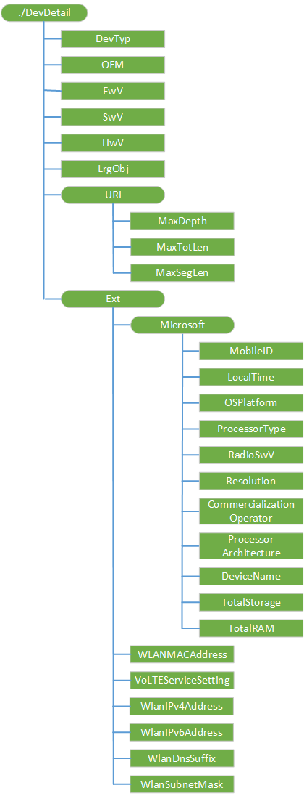

# DevDetail 的 CSP

DevDetail 配置服务提供程序处理提供了特定于设备的参数到 OMA DM 服务器的管理对象。 这些设备的参数不从客户端向服务器自动发送，但可由服务器使用 OMA DM 命令查询。

> **请注意** 此配置服务提供商要求使用 ID\_CAP\_CSP\_基础和 ID\_CAP\_设备\_管理\_管理功能从网络配置应用程序进行访问。

 

对于 DevDetail 的 CSP，不能使用替换命令，除非该节点已存在。

下图显示了 DevDetail 配置服务提供程序管理对象以树格式由 OMA 设备管理。 OMA 客户端资源调配协议不支持此配置服务提供程序。

**DevTyp**  
必需。 以字符串形式返回设备模型名称 /SystemProductName。

受支持的操作是获得。

**OEM**  
必需。 SyncML 设备信息，1.1.2 版规范中定义名称的原始设备制造商 (OEM) 以字符串形式返回。

受支持的操作是获得。

**FwV**  
必需。 HKEY 的注册表项中的定义返回的固件版本中，\_本地\_机\\系统\\平台\\DeviceTargetingInfo\\PhoneFirmwareRevision。

对于 Windows 10 桌面版本 （家庭、 Pro、 企业和教育），它返回 BIOS 版本 HKEY 的注册表项中定义\_本地\_机\\硬件\\说明\\系统\\BIOS\\BIOSVersion。

受支持的操作是获得。

**SwV**  
必需。 在 MajorVersion.MinorVersion.BuildNumber.QFEnumber 的格式返回 Windows 10 OS 软件版本。 当前不在手机上的桌面和移动内部版本号返回的内部版本号。 将来，可能会聚的内部版本号。

受支持的操作是获得。

**HwV**  
必需。 HKEY 的注册表项中的定义返回硬件版本中，\_本地\_机\\系统\\平台\\DeviceTargetingInfo\\PhoneRadioHardwareRevision。

对于 Windows 桌面版本 10，它返回 BIOS 版本 HKEY 的注册表项中定义\_本地\_机\\硬件\\说明\\系统\\BIOS\\BIOSVersion。

受支持的操作是获得。

**LrgObj**  
必需。 返回设备是否使用 OMA DM 大型对象处理，规范 SyncML 设备信息，1.1.2 版本中定义。

受支持的操作是获得。

**URI/MaxDepth**  
必需。 返回设备支持的管理树的最大深度。 默认值为零 (0)。

受支持的操作是获得。

这是该设备支持的 URI 段的最大数量。 默认值为零 (0) 表示设备支持无限深度的 URI。

**URI/MaxTotLen**  
必需。 返回用于地址的节点或节点属性的任何 URI 的最大总长度。 默认值为零 (0)。

受支持的操作是获得。

这是最大的设备支持在 URI 中的字符数。 默认值为零 (0) 表示设备支持在长度不受限制的 URI。

**URI/MaxSegLen**  
必需。 返回的节点或节点属性的 URI 中的任何 URI 段的总长度。 默认值为零 (0)。

受支持的操作是获得。

这是最大的设备可以支持单个的 URI 段中的字符数。 默认值为零 (0) 表示设备支持在 URI 段的长度不受限制。

**Ext/Microsoft/MobileID**  
必需。 返回与蜂窝移动通信网络的移动设备 ID。 没有蜂窝网络支持的设备，则返回 404。

受支持的操作是获得。

IMSI 值返回 GSM、 UMTS 网络。 如果此元素查询 CDMA 和全球电话将返回 404 找不到状态代码错误。

**Ext/Microsoft / 本地时间**  
必需。 以 ISO 8601 格式返回客户端的本地时间。

受支持的操作是获得。

**Ext/Microsoft/OSPlatform**  
必需。 返回设备的操作系统平台。 对于 Windows 桌面版本 10，它返回产品名称在 HKLM\\软件\\Microsoft\\Windows NT\\CurrentVersion\\产品名称。

受支持的操作是获得。

**Ext/Microsoft/ProcessorType**  
必需。 返回设备的处理器的类型在系统中所述\_信息。

受支持的操作是获得。

**Ext/Microsoft/RadioSwV**  
必需。 返回单选栈软件版本号。

受支持的操作是获得。

**解决方法 Ext/Microsoft**  
必需。 返回 UI 屏幕分辨率的设备 (示例:"480 x 800")。

受支持的操作是获得。

**Ext/Microsoft/CommercializationOperator**  
必需。 如果存在，则，返回的移动运营商的名称否则，它返回 404.

受支持的操作是获得。

**Ext/Microsoft/ProcessorArchitecture**  
必需。 返回"臂"或"x86"作为设备的处理器体系结构。

受支持的操作是获得。

**设备名称 Ext/Microsoft**  
必需。 包含用户指定的设备名称。

Windows 10 1511年版本中添加了对 Windows 10 移动的替换操作的支持。 在桌面上不支持替换操作。 使用此节点的设备名称更改时，就会引发一个对话框，要求用户重新启动设备。 重新启动设备，新设备的名称不会生效。 如果用户取消了对话框，它将显示再次重新启动之前。

值类型是字符串。

支持的操作包括获取和替换。

**Ext/Microsoft/TotalStorage**  
添加 Windows 10 1511年版本中。 整数，指定以 mb 为单位的总可用存储从第一个内部驱动器 （可能会小于总物理存储） 设备上。

受支持的操作是获得。

> **请注意** 这只支持 Windows 10 移动。

 

**Ext/Microsoft/TotalRAM**  
添加 Windows 10 1511年版本中。 整数，指定以 mb 为单位的总可用内存设备 （可能是总物理内存小于） 上。

受支持的操作是获得。

**Ext/WLANMACAddress**  
活动的 WLAN 连接，作为一个 12 位数的十六进制数字的 MAC 地址。

受支持的操作是获得。

> **请注意** 这不是支持 Windows 10 对于桌面版本。

 

**VoLTEServiceSetting**  
返回 on 或 off VoLTE 服务。 这只是对移动运营商 OMA DM 服务器公开的。

受支持的操作是获得。

**WlanIPv4Address**  
返回活动的 Wi-Fi 连接的 IPv4 地址。 这只被面临企业 OMA DM 服务器。

受支持的操作是获得。

**WlanIPv6Address**  
返回活动的 Wi-Fi 连接的 IPv6 地址。 这只被面临企业 OMA DM 服务器。

受支持的操作是获得。

**WlanDnsSuffix**  
返回活动的 Wi-Fi 连接的 DNS 后缀。 这只被面临企业 OMA DM 服务器。

受支持的操作是获得。

**WlanSubnetMask**  
返回活动的 Wi-Fi 连接的子网掩码。 这只被面临企业 OMA DM 服务器。

受支持的操作是获得。

## 相关的主题

[配置服务提供程序的引用](configuration-service-provider-reference.md)

 

 

