# <a name="device-update-management"></a>设备更新管理

在的电脑、 平板电脑、 电话和 IoT 设备当前的设备状态，移动设备管理 (MDM) 解决方案越来越流行作为一种轻型设备管理技术。 Windows 10 中我们正在投入巨大力量，将可用的管理功能扩展到 MDMs。 我们要添加的一个主要功能是使设备保持使用最新的 Microsoft 更新最新的 MDMs 的能力。

特别是，Windows 10 提供了其他的 Api 来启用到 MDMs:

-   确保通过配置自动更新策略的计算机保持最新状态。
-   通过配置哪些更新批准了给定设备测试机在企业范围内部署之前的一个较小集的更新。
-   获取符合性状态的受管理设备，IT 的加工仍需特定安全修补程序，或最新程度如何是某一特定计算机更容易理解。

本主题提供的信息，他们需要在 Windows 10 部署更新管理 MDM Isv。

在 Windows 10 MDM 协议已扩展为更好地使 IT 管理员来管理更新。 特别是，Windows 已添加配置服务提供程序 (Csp) 公开策略和对 MDMs 的操作︰

-   配置自动更新策略，以确保设备保持最新状态。
-   获取设备的法规遵从性信息 （需要但尚未安装的更新的列表）。
-   指定每个设备更新审批列表，以确保设备不安装未经批准的更新程序尚未经过测试。
-   代表最终用户批准 Eula，以便可以自动更新部署甚至有更新的 Eula。

OMA DM Api，可用于指定更新审核和法规遵从性状态的引用更新使用更新 ID，它标识某一特定更新的 GUID。 MDM，当然会想要公开 IT 友好更新的信息 （而不是原始 GUID)，包括更新的标题、 说明 KB，更新类型 （例如，安全更新或服务包）。 有关详细信息，请参阅[\[MS WSUSSS\]: Windows 更新服务︰ 服务器协议](http://go.microsoft.com/fwlink/p/?LinkId=526707)。
Csp 的详细信息，请参阅[更新 CSP](update-csp.md)和[策略 CSP](policy-configuration-service-provider.md)的更新策略区域。

下图提供了此工作的方式的概念性概述︰

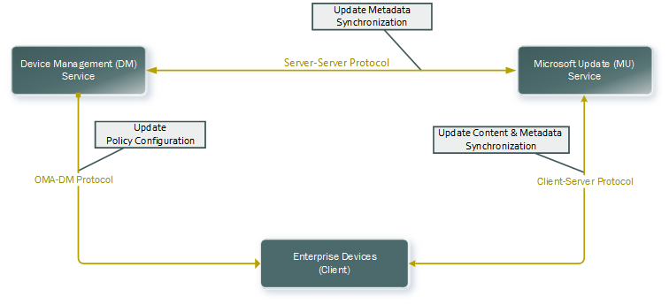

关系图可以大致划分为三个方面︰

-   设备管理服务同步更新信息 （标题、 描述、 适用性） 来自 Microsoft 更新使用服务器的同步协议 （即图的顶部）。
-   设备管理服务设置自动更新策略，获取更新的法规遵从性信息，并通过 OMA DM （图中的左侧） 的批准。
-   设备将从 Microsoft 更新使用的客户端/服务器协议，获取更新，但仅下载和安装适用于该设备并按已批准的更新 IT （图中右侧部分）。

## <a name="a-href-idgettingupdatemetadataagetting-update-metadata-using-the-server-server-sync-protocol"></a><a href="" id="gettingupdatemetadata"></a>获取更新元数据中使用了服务器的同步协议

Microsoft 更新目录是巨大的包含了许多由 MDM 管理的设备，包括传统的软件 （例如，更新服务器、 下层的桌面操作系统和遗留应用程序），以及大量的驱动程序更新，则不需要的更新。 我们建议 MDM 使用服务器的同步协议来获取更新程序元数据从客户端报告的更新。

本部分介绍如何做到这一点。 下图显示服务器的同步协议进程。

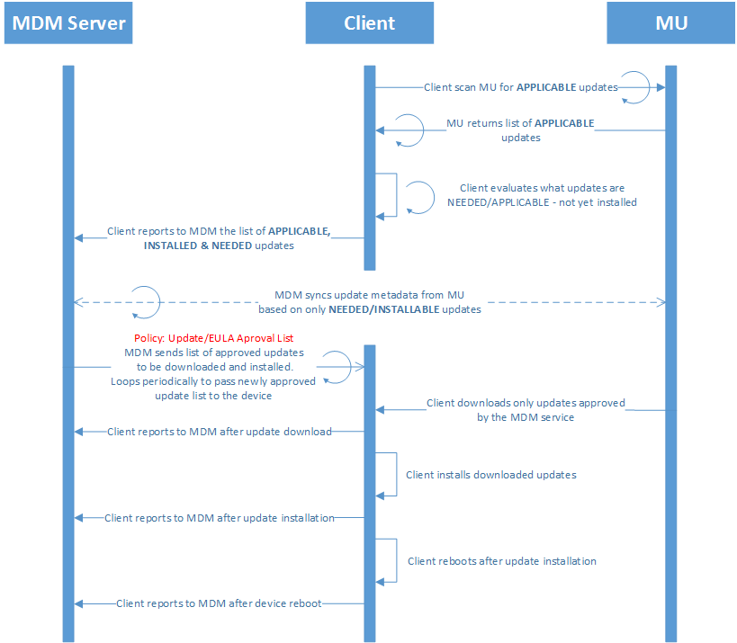

MSDN 提供多服务器的同步协议有关的信息。 特别是︰

-   它是一种基于 SOAP 的协议，并可以获取[服务器同步 Web 服务](http://go.microsoft.com/fwlink/p/?LinkId=526727)的 WSDL。 可以使用 WSDL 生成调用代理对于很多编程环境，这将简化您的开发。
-   [协议的示例](http://go.microsoft.com/fwlink/p/?LinkId=526720)中，您可以查找代码示例。 代码示例显示原始 SOAP 命令，可以使用。 虽然它是更易于进行类似 （调用 WSDL 生成代理） 的.NET 编程语言中调用。 从上面的 MSDN 链接服务器同步 WSDL 生成的存根 （stub） 生成绑定不正确的 URL。 应将绑定 URL 设置为 https:<span></span>/ / fe2.update.microsoft.com/v6/ServerSyncWebService/serversyncwebservice.asmx。

一些重要的要点︰

-   该协议已授权阶段 （调用 GetAuthConfig、 GetAuthorizationCookie 和 GetCookie）。 在[协议的示例](http://go.microsoft.com/fwlink/p/?LinkId=526720)中，**示例 1︰ 授权**的代码演示如何做到这一点。 尽管这称为授权阶段，协议是完全开放的 （没有凭据运行所需的协议这一阶段）。 此系列的调用需要完成以获得同步协议的主要部分的 cookie。 作为一种优化，可以缓存 cookie 并仅当您 cookie 过期再次调用此序列。
-   此协议允许每台 MDM 通过调用 GetUpdateData 同步更新的特定更新程序元数据。 有关详细信息，请参阅 MSDN 中的[GetUpdateData](https://msdn.microsoft.com/library/dd304816.aspx) 。 获取与数字是其修订适用的更新 LocURI `<LocURI>./Vendor/MSFT/Update/InstallableUpdates?list=StructData</LocURI>`。 因为不是所有的更新都可通过 S2S 同步，请确保处理 SOAP 错误。
-   对于移动设备，您也可以同步调用 GetUpdateData，通过某一特定更新的元数据或本地内部部署解决方案，则可以使用 WSUS 并从 Microsoft 更新目录网站手动导入移动更新。 有关详细信息，请参阅[工艺流程图和屏幕快照的服务器同步进程](#process-flow-diagram-and-screenshots-of-server-sync-process)。

> **请注意** 在 Microsoft 更新获取随时间更新的描述性信息 （修复 bug 中适用性规则、 本地化更改等） 修改给定更新的元数据。 进行这种更改不会影响更新本身，每次创建新的更新版本。 更新版本的标识是包含 UpdateID (GUID) 和 RevisionNumber (int) 的复合键。 MDM 不应公开的概念更新修订与 IT。 相反，对于每个 UpdateID (GUID) MDM 只应以该更新 （版本号最高的一个） 的更高版本的元数据。


## <a name="a-href-idexamplesofupdatestructureaexamples-of-update-metadata-xml-structure-and-element-descriptions"></a><a href="" id="examplesofupdatestructure"></a>更新元数据 XML 结构和元素说明的示例

GetUpdateData 调用的响应返回 ServerSyncUpdateData，其中包含更新程序元数据中的 XmlUpdateBlob 元素的数组。 [协议的示例](http://go.microsoft.com/fwlink/p/?LinkId=526720)提供了更新的 xml 架构。 下面介绍了一些关键要素︰

-   **UpdateID** – 更新的唯一标识符
-   **RevisionNumber** – 该更新已修改的情况下更新的修订号。
-   **CreationDate** – 在其创建此更新的日期。
-   **UpdateType** – 的更新可能包括以下类型︰
    -   **检测**— 如果此更新标识表示兼容性逻辑
    -   **类别**– 这可能表示下列操作之一︰
        -   所属产品类别更新。 例如，Windows，MS 的办公室等。
        -   所属的分类的更新。 例如，驱动程序、 安全等。
    -   **软件**— 如果此更新是一个软件更新。
    -   **驱动程序**– 如果有更新的驱动程序更新。
-   **LocalizedProperties** – 表示此更新程序中可用的语言、 标题和更新的说明。 它包含了以下字段︰
    -   **语言**的语言代码标识符 (LCID)。 例如，en 或 es。
    -   **标题**--更新的标题。 例如，"Windows SharePoint Services 3.0 Service Pack 3 x64 版 (KB2526305)"
    -   **描述**– 更新说明。 例如，"Windows SharePoint Services 3.0 Service Pack 3 (KB2526305) 提供了最新的更新到 Windows SharePoint Services 3.0。 在安装此项之后，您可能需要重新启动计算机。 在安装此项之后，则无法删除。"
-   **KBArticleID** – 有关于特定更新的详细信息此更新的知识库文章编号。 例如， <http://support.microsoft.com/kb/2902892>。

## <a name="a-href-idrecommendedflowarecommended-flow-for-using-the-server-server-sync-protocol"></a><a href="" id="recommendedflow"></a>建议使用服务器的同步协议的流

本节描述可能的算法使用服务器的同步协议来更新元数据中提取到 mdm。

首先一些背景︰

- 如果您有多租户 MDM，更新程序元数据可以保存在共享分区中，因为它是所有租户的公共。
- 元数据同步服务可以再实施定期调用服务器的同步提取元数据更新 IT 中关注。
- MDM 使用组件，OMA DM 到控制设备 （下一节中所述），应该发送发送元数据同步服务所需的更新，如果已不知道这些更新设备，它获取从每个客户端的列表。


下面的过程描述元数据同步服务的基本算法︰

-   初始化，包括以下方面︰
    1.  创建一个空列表的"需要更新 Id 中出错"。 此列表将由 OMA DM 使用 MDM 服务组件获取更新。 我们建议未将定义更新添加到此列表中，因为这些是临时性质 （例如，有关每日，每个采用累计 4 新特征码更新 Defender 发布）。
    2.  创建一个空的"产品类别"列表 （或随意预填充所需的已知的产品类别）。
-   定期同步 (建议每小时一次 2-不能超过一次 / 小时)。
    1.  实现的协议来获取 cookie，如果没有非过期的 cookie 的授权阶段。 请参阅**示例 1︰ 授权**在[协议的示例](http://go.microsoft.com/fwlink/p/?LinkId=526720)。
    2.  实现该协议的元数据部分 (请参阅**示例 2︰ 元数据和部署同步**[协议示例](http://go.microsoft.com/fwlink/p/?LinkId=526720)中)，并︰
        -   指定更新分类 = 安全更新和产品类别为此步骤是可选的如果您想要主动拉的安全更新中的 GetRevisionIdList 为筛选器 = 当前列表 （最初为空）。
        -   如果更新程序元数据不已经被拉开到数据库，请致电 GetUpdateData 从 GetRevisionIdList 返回的所有更新和"需要更新中出错的 Id"列表中的所有更新。
            -   如果此更新为较新版本的现有更新 (UpdateID 相同，修订版本号更高)，替换新上一个更新程序元数据。
            -   如果更新产品类别不在"产品类别"列表中，然后将其添加到该列表中。
            -   从"需要更新中出错的 Id"列表中删除更新，一旦它们被引入的。

这提供了吸引 Microsoft 更新它的一套信息需要管理，因此可以在不同的更新管理方案中使用信息的有效方法。 例如，在更新审批时可以拉信息，IT 可以看到哪些更新它们的批准，或法规遵从性报告以查看哪些是否需要更新但尚未安装。

## <a name="a-href-idmanagingupdatesamanaging-updates-using-oma-dm"></a><a href="" id="managingupdates"></a>OMA DM 使用管理更新

MDM 可以管理通过 OMA DM 的更新。 如何使用和集成的 Windows OMA DM 协议，MDM 以及如何注册 MDM 管理的设备的详细信息是记录[移动设备管理](mobile-device-enrollment.md)主题。 本节重点介绍如何扩展以支持更新管理的集成。 更新管理的关键方面包括︰

-   配置自动更新策略，以确保设备保持最新状态。
-   获取设备的法规遵从性信息 （需要但尚未安装的更新列表）
-   指定每个设备更新审批列表以确保设备不安装未经批准的更新程序尚未经过测试。
-   Eula 批准代表最终用户，因此可以甚至对 Eula 更新自动更新部署

下面的列表描述了推荐的模式，对应用更新。

1.  有"测试组"和"全部组"。
2.  测试组中，设置规则以自动批准的所有更新。
3.  在所有组中，设置自动审核定义、 严重和安全更新。
4.  对于所有其他类别中的所有组等待 7 天和自动批准。 这允许 IT 管理员要撤销审核的测试组中发生过问题的任何更新。

更新配置为使用[更新的 CSP](update-csp.md)，组成和[策略 CSP](policy-configuration-service-provider.md)的更新部分。 请这些主题以供配置更新的详细信息，参阅。

### <a name="update-policies"></a>更新策略

企业 IT 可以配置自动更新策略通过 OMA DM 使用[策略 CSP](policy-configuration-service-provider.md) （此功能不支持 Windows 10 移动和主窗口 10 中。 这是策略的 CSP 中的更新节点的 CSP 关系图。

下面的关系图以树格式显示的更新策略。

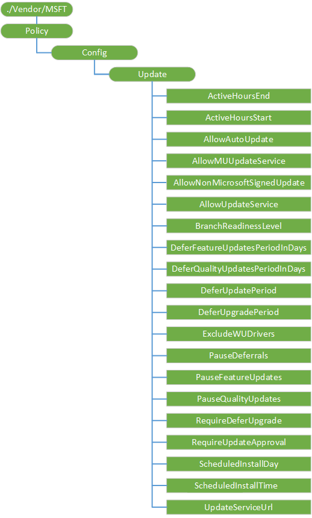

<a href="" id="update-activehoursend"></a>**更新/ActiveHoursEnd**  
> **请注意** 该策略才可在 Windows 10 专业、 Windows 10 企业、 Windows 10 教育和 Windows 10 移动企业

添加到 Windows 10，1607年版本中。 允许 IT 管理员 （当用于**更新/ActiveHoursStart**） 管理一系列的活动时间不安排更新重新启动。 此值设置的结束时间。 从开始时间最长为 12 小时。

受支持的值是 0-23，其中 0 是上午 12 时，1 是凌晨 1 点，等等。

默认值为 17 （下午 5 点）。

<a href="" id="update-activehoursstart"></a>**更新/ActiveHoursStart**  
> **请注意** 该策略才可在 Windows 10 专业、 Windows 10 企业、 Windows 10 教育和 Windows 10 移动企业

添加到 Windows 10，1607年版本中。 允许 IT 管理员 （当用于**更新/ActiveHoursEnd**） 管理一系列的小时未计划更新重新启动。 此值设置的开始时间。 从开始时间最长为 12 小时。

受支持的值是 0-23，其中 0 是上午 12 时，1 是凌晨 1 点，等等。

默认值为 8 （上午 8 点）。

<a href="" id="update-allowautoupdate"></a>**更新/AllowAutoUpdate**  
> **请注意** 该策略才可在 Windows 10 专业、 Windows 10 企业、 Windows 10 教育和 Windows 10 移动企业
 
使 IT 管理员可以管理用于扫描、 下载并安装更新程序的自动更新行为。

支持的操作包括获取和替换。

下面的列表显示了受支持的值︰

-   0 – 下载此更新之前通知用户。 此策略供企业想要使最终用户可以管理的数据使用情况。 使用此选项将应用到该设备并可供下载的更新时通知用户。 用户可以下载并安装 Windows 更新控制面板中的更新。
-   1-自动安装此更新，然后通知用户安排设备重新启动。 非计量网络上自动下载和安装过程"自动维护"当设备未被使用，并且不依靠电池电源运行更新。 如果无法安装两天更新自动维护，Windows Update 将立即安装更新。 如果安装需要重新启动，系统将提示最终用户计划的重新启动时间。 最终用户已达 7 天，安排在重新启动并在此之后，被迫重新启动设备。 启用最终用户控制的开始时间可以减少应用程序执行不关机正常重新启动所致的意外数据丢失的风险。
-   2 （默认）-自动安装并重新启动。 非计量网络上自动下载和安装过程"自动维护"当设备未被使用，并且不依靠电池电源运行更新。 如果无法安装两天更新自动维护，Windows Update 将立即安装更新。 如果需要重新启动计算机，然后自动重新启动设备时该设备不积极使用时。 这是未被管理设备的默认行为。 设备更新速度快，但会增加不关机正常在重新启动应用程序所致的意外数据丢失的风险。
-   3 – 自动安装，并在指定的时间重新启动。 它指定安装日期和时间。 如果未指定任何日期和时间，默认值是每日凌晨 3 点。 这一次会发生自动安装和设备重新启动时间之后 15 分钟倒计时。 如果用户已登录，准备重新启动 Windows 时，用户可以中断 15 分钟倒计时延迟重新启动。
-   4︰ 自动安装，而无需最终用户控件重新启动。 非计量网络上自动下载和安装过程"自动维护"当设备未被使用，并且不依靠电池电源运行更新。 如果无法安装两天更新自动维护，Windows Update 将立即安装更新。 如果需要重新启动计算机，然后自动重新启动设备时该设备不积极使用时。 此设置选项还将最终用户控制面板设置为只读。
-   5 – 关闭自动更新。

> **重要** 此选项应仅用于法规遵从性，系统则不会获得安全更新，并按。
   
如果没有配置该策略，则最终用户获得的默认行为 （自动安装并重新启动）。

<a href="" id="update-allowmuupdateservice"></a>**更新/AllowMUUpdateService**  
> **请注意** 该策略才可在 Windows 10 专业、 Windows 10 企业和 Windows 10 教育

添加到 Windows 10，1607年版本中。 允许 IT 管理员来管理是否来自 Microsoft 更新的应用程序更新扫描。

下面的列表显示了受支持的值︰

-   0 – 不允许使用或者没有配置。
-   1 – 允许。 接受通过 Microsoft 更新接收更新。

<a href="" id="update-allownonmicrosoftsignedupdate"></a>**更新/AllowNonMicrosoftSignedUpdate**  
> **请注意** 该策略才可在 Windows 10 专业、 Windows 10 企业、 Windows 10 教育和 Windows 10 移动企业

允许 IT 管理员管理是否自动更新接受更新的 UpdateServiceUrl 位置找到更新时签署由 Microsoft 以外的实体。 该策略支持第三方软件和修补程序分发使用 WSUS。

支持的操作包括获取和替换。

下面的列表显示了受支持的值︰

-   0 – 不允许使用或者没有配置。 从企业内部网中 Microsoft 更新服务位置的更新必须由 Microsoft 签名。
-   1 – 允许。 接受更改接收通过企业内部网中 Microsoft 更新服务位置，如果由位于本地计算机的"受信任的发行者"证书存储区中的证书进行了签名。

该策略是特定于桌面和本地发布 WSUS 通过第三方更新 （二进制文件和更新不位于 Microsoft 更新），允许 IT 管理是否自动更新接受签名由 Microsoft 以外的实体的 intranet Microsoft 更新服务位置上找到更新后更新。

<a href="" id="update-allowupdateservice"></a>**更新/AllowUpdateService**  
> **请注意** 该策略才可在 Windows 10 专业、 Windows 10 企业、 Windows 10 教育和 Windows 10 移动企业

 

指定设备是否可以使用 Microsoft 更新、 Windows 服务器更新设备驱动程序列表） 或 Windows 应用商店。

甚至当 Windows 更新配置为接收来自 intranet 更新服务的更新，它将定期检索信息从公用的 Windows 更新服务，以启用 Windows 更新，对将来连接和其他服务，如 Microsoft 更新或 Windows 应用商店

如果启用此策略将禁用该功能，并可能会导致连接到公共服务，如 Windows 应用商店停止工作。

下面的列表显示了受支持的值︰

-   0 – 不允许更新服务。
-   1 （缺省值）-允许更新服务。

> **请注意** 仅当台式计算机或设备配置为连接到 intranet 更新服务使用"指定 intranet Microsoft 更新服务位置"策略将应用该策略。

 

<a href="" id="update-branchreadinesslevel"></a>**更新/BranchReadinessLevel**  
> **请注意** 该策略才可在 Windows 10 专业、 Windows 10 企业、 Windows 10 教育和 Windows 10 移动企业

 

添加到 Windows 10，1607年版本中。 允许 IT 管理员设置从其更新的设备接收到的分支。

下面的列表显示了受支持的值︰

-   16 （默认）-用户获取所有适用的升级从当前分支 (CB)。
-   32 – 用户从当前分支的业务 (CBB) 中获取升级。

<a href="" id="update-deferfeatureupdatesperiodindays"></a>**更新/DeferFeatureUpdatesPeriodInDays**  
> **请注意** 这项策略出现在 Windows 10 专业、 Windows 10 企业和 Windows 10 教育上。
因为此策略未被阻止，不会获得错误消息时使用它来配置 Windows 10 移动设备。 但是，该策略才会生效。

 

添加到 Windows 10，1607年版本中。 指定天数服从功能更新。

受支持的值是 0-180。

<a href="" id="update-deferqualityupdatesperiodindays"></a>**更新/DeferQualityUpdatesPeriodInDays**  
> **请注意** 该策略才可在 Windows 10 专业、 Windows 10 企业、 Windows 10 教育和 Windows 10 移动企业

 

添加到 Windows 10，1607年版本中。 将高质量的更新推迟超过指定的天数。

受支持的值是 0-30。

<a href="" id="update-deferupdateperiod"></a>**更新/DeferUpdatePeriod**  
> **请注意**  
该策略才可在 Windows 10 专业、 Windows 10 企业、 Windows 10 教育和 Windows 10 移动企业

不要使用此策略 Windows 10 版本 1607年设备，而是使用[Windows 10，1607年版本中的更改更新管理](#windows-10-version-1607-for-update-management)列入新的策略。 您可以继续使用 DeferUpdatePeriod 为 Windows 10 版本 1511年设备。

 

允许 IT 管理员指定的最多 4 个星期的更新延迟。

受支持的值为 0 到 4，它是指几个星期才能推迟更新数。

在 Windows 10 移动企业版本 1511年设备设置为自动更新，为 DeferUpdatePeriod 工作，必须设置下列各项︰

-   必须将更新/RequireDeferUpgrade 设置为 1
-   系统/AllowTelemetry 必须设置为 1 或更高版本

如果启用了"指定 intranet Microsoft 更新服务位置"策略，然后"通过推迟升级"、"通过延迟更新"和"暂停更新和升级"设置没有任何影响。

如果启用了允许遥测策略选项值设置为 0，然后"通过推迟升级"、"通过延迟更新"和"暂停更新和升级"设置没有任何影响。

<table>
<colgroup>
<col width="25%" />
<col width="25%" />
<col width="25%" />
<col width="25%" />
</colgroup>
<thead>
<tr class="header">
<th>更新类别</th>
<th>最大延迟</th>
<th>延期增量</th>
<th>更新类型/说明</th>
</tr>
</thead>
<tbody>
<tr class="odd">
<td style="vertical-align:top"><p>操作系统升级</p></td>
<td style="vertical-align:top"><p>8 个月</p></td>
<td style="vertical-align:top"><p>1 个月</p></td>
<td style="vertical-align:top"><p>升级-3689BDC8-B205-4AF4-8D4A-A63924C5E9D5</p></td>
</tr>
<tr class="even">
<td style="vertical-align:top"><p>Update</p></td>
<td style="vertical-align:top"><p>1 个月</p></td>
<td style="vertical-align:top"><p>1 周</p></td>
<td style="vertical-align:top"><div class="alert">
<strong>请注意</strong> 如果计算机已启用 Microsoft 更新，在这些类别中的任何 Microsoft 更新也观察延迟 / 暂停的逻辑。
</div>
<div>
 
</div>
<ul>
<li>安全更新-0FA1201D-4330-4FA8-8AE9-B877473B6441</li>
<li>关键更新-E6CF1350-C01B-414D-A61F-263D14D133B4</li>
<li>更新汇总-28BC880E-0592-4CBF-8F95-C79B17911D5F</li>
<li>服务包-68C5B0A3-D1A6-4553-AE49-01D3A7827828</li>
<li>工具-B4832BD8-E735-4761-8DAF-37F882276DAB</li>
<li>功能包-B54E7D24-7ADD-428F-8B75-90A396FA584F</li>
<li>更新-CD5FFD1E-E932-4E3A-BF74-18BF0B1BBD83</li>
<li>驱动程序 – EBFC1FC5-71A4-4F7B-9ACA-3B9A503104A0</li>
</ul></td>
</tr>
<tr class="odd">
<td style="vertical-align:top"><p>其他不能推迟 /</p></td>
<td style="vertical-align:top"><p>不延期</p></td>
<td style="vertical-align:top"><p>不延期</p></td>
<td style="vertical-align:top"><p>到此类别中的脱落的上面没有明确枚举任何更新类别。</p>
<p>定义更新-E0789628-CE08-4437-BE74-2495B842F43B</p></td>
</tr>
</tbody>
</table>

 

<a href="" id="update-deferupgradeperiod"></a>**更新/DeferUpgradePeriod**  
> **请注意**  
这项策略出现在 Windows 10 专业、 Windows 10 企业和 Windows 10 教育上。

因为此策略未被阻止，不会获得错误消息时使用它来配置 Windows 10 移动设备。 但是，该策略才会生效。

不要使用此策略 Windows 10 版本 1607年设备，而是使用[Windows 10，1607年版本中的更改更新管理](#windows-10-version-1607-for-update-management)列入新的策略。 您可以继续使用 DeferUpgradePeriod 为 Windows 10 版本 1511年设备。

 

允许 IT 管理员指定多达 8 个月的额外的升级延迟。

受支持的值是 0-8，它是指要推迟升级的月数。

如果启用了"指定 intranet Microsoft 更新服务位置"策略，然后"通过推迟升级"、"通过延迟更新"和"暂停更新和升级"设置没有任何影响。

如果启用了"允许遥测"策略选项值设置为 0，然后"通过推迟升级"、"通过延迟更新"和"暂停更新和升级"设置不起作用。

<a href="" id="update-excludewudrivers"></a>**更新/ExcludeWUDrivers**  
> **请注意** 这项策略出现在 Windows 10 专业、 Windows 10 企业和 Windows 10 教育上。
因为此策略未被阻止，不会获得错误消息时使用它来配置 Windows 10 移动设备。 但是，该策略才会生效。

 

添加到 Windows 10，1607年版本中。 允许 IT 管理员在更新过程中排除 Windows 更新 (WU) 驱动程序。

下面的列表显示了受支持的值︰

-   0 （默认）-允许 Windows 更新驱动程序。
-   1 – 排除 Windows 更新驱动程序。

<a href="" id="update-pausedeferrals"></a>**更新/PauseDeferrals**  
> **请注意**  
该策略才可在 Windows 10 专业、 Windows 10 企业、 Windows 10 教育和 Windows 10 移动企业

不要使用此策略 Windows 10 版本 1607年设备，而是使用[Windows 10，1607年版本中的更改更新管理](#windows-10-version-1607-for-update-management)列入新的策略。 您可以继续使用 PauseDeferrals 为 Windows 10 版本 1511年设备。

 

允许 IT 管理员暂停达 5 周的更新和升级。 在 5 周后，已暂停的延期将重置。

下面的列表显示了受支持的值︰

-   0 （默认）-延期不会暂停。
-   1 – 延期已暂停。

如果启用了"指定 intranet Microsoft 更新服务位置"策略，然后"通过推迟升级"、"通过延迟更新"和"暂停更新和升级"设置没有任何影响。

如果启用了"允许遥测"策略选项值设置为 0，然后"通过推迟升级"、"通过延迟更新"和"暂停更新和升级"设置不起作用。

<a href="" id="update-pausefeatureupdates"></a>**更新/PauseFeatureUpdates**  
> **请注意** 这项策略出现在 Windows 10 专业、 Windows 10 企业和 Windows 10 教育上。
因为此策略未被阻止，不会获得错误消息时使用它来配置 Windows 10 移动设备。 但是，该策略才会生效。

 

添加到 Windows 10，1607年版本中。 允许 IT 管理员最多 60 天内暂停功能更新。

下面的列表显示了受支持的值︰

-   0 （默认）-不暂停功能更新。
-   1 – 60 天内暂停功能更新或设置为 0 的值，直到为准。

<a href="" id="update-pausequalityupdates"></a>**更新/PauseQualityUpdates**  
> **请注意** 该策略才可在 Windows 10 专业、 Windows 10 企业、 Windows 10 教育和 Windows 10 移动企业

 

添加到 Windows 10，1607年版本中。 允许 IT 管理员要暂停更新质量。

下面的列表显示了受支持的值︰

-   0 （缺省值）--高质量的更新不会暂停。
-   1 – 35 天暂停质量更新，或重新设置为 0 的值，直到为准。

<a href="" id="update-requiredeferupgrade"></a>**更新/RequireDeferUpgrade**  
> **请注意**  
该策略才可在 Windows 10 专业、 Windows 10 企业、 Windows 10 教育和 Windows 10 移动企业

不要使用此策略 Windows 10 版本 1607年设备，而是使用[Windows 10，1607年版本中的更改更新管理](#windows-10-version-1607-for-update-management)列入新的策略。 您可以继续使用 RequireDeferUpgrade 为 Windows 10 版本 1511年设备。

 

允许 IT 管理员将设备设置为 CBB 火车。

下面的列表显示了受支持的值︰

-   0 （默认）-用户从当前分支获取升级。
-   1 – 用户从当前分支业务获取升级。

<a href="" id="update-requireupdateapproval"></a>**更新/RequireUpdateApproval**  

> **请注意** 该策略才可在 Windows 10 专业、 Windows 10 企业、 Windows 10 教育和 Windows 10 移动企业

<br>
> **请注意** 如果您以前使用过 Windows 的早期版本中**更新/PhoneUpdateRestrictions**策略，它已被否决。 请使用此策略。

 

允许 IT 管理员限制到仅存在于一个更新的审批列表的设备安装的更新。 它使 IT 部门能够接受最终用户许可协议 (EULA) 与代表最终用户批准的更新。 一旦批准一个更新程序已批准 Eula。

支持的操作包括获取和替换。

下面的列表显示了受支持的值︰

-   0 – 未配置。 设备安装所有适用的更新。
-   1 – 设备只安装更新程序都适用并在批准的更新列表。 此策略设置为 1 的 if IT 需要控制的设备，例如是否需要在部署之前测试的更新部署。

<a href="" id="update-scheduledinstallday"></a>**更新/ScheduledInstallDay**  
> **请注意** 该策略才可在 Windows 10 专业、 Windows 10 企业、 Windows 10 教育和 Windows 10 移动企业

 

使 IT 管理员计划安装更新的日期。

数据类型是一个字符串。

支持的操作是添加，删除，获取和替换。

下面的列表显示了受支持的值︰

-   0 （默认值） – 每一天
-   1 个星期日
-   2 – 星期一
-   3 – （星期二)
-   4 – （星期三)
-   5 – （星期四)
-   6 – 星期五
-   7 个星期六

<a href="" id="update-scheduledinstalltime"></a>**更新/ScheduledInstallTime**  
> **请注意** 该策略才可在 Windows 10 专业、 Windows 10 企业、 Windows 10 教育和 Windows 10 移动企业

 

使 IT 管理员可以计划安装更新的时间。

数据类型是一个字符串。

支持的操作是添加，删除，获取和替换。

受支持的值是 0-23，其中 0 = 12 上午和 23 = 11 PM。

默认值为 3。

<a href="" id="update-updateserviceurl"></a>**更新/UpdateServiceUrl**  
> **请注意** 该策略才可在 Windows 10 专业、 Windows 10 企业、 Windows 10 教育和 Windows 10 移动企业

 

允许从 WSUS 服务器而不是 Microsoft 更新检查更新设备。 这可用于需要更新设备，不能连接到互联网的内部部署版本 MDMs。

支持的操作包括获取和替换。

下面的列表显示了受支持的值︰

-   未配置。 设备会检查 Microsoft 更新的更新信息。
-   设置为 URL，例如`http://abcd-srv:8530`。 设备会检查 WSUS 服务器在指定的 URL 的更新信息。

示例

``` syntax
        <Replace>
            <CmdID>$CmdID$</CmdID>
            <Item>
                <Meta>
                    <Format>chr</Format>
                    <Type>text/plain</Type>
                </Meta>
                <Target>
                    <LocURI>./Vendor/MSFT/Policy/Config/Update/UpdateServiceUrl</LocURI>
                </Target>
                <Data>http://abcd-srv:8530</Data>
            </Item>
        </Replace>
```

### <a name="update-management"></a>更新管理

企业 IT 可以配置组的已批准更新并得到使用[更新的 CSP](update-csp.md)的 OMA DM 通过法规遵从性状态。 下面的关系图以树格式显示更新 CSP。.

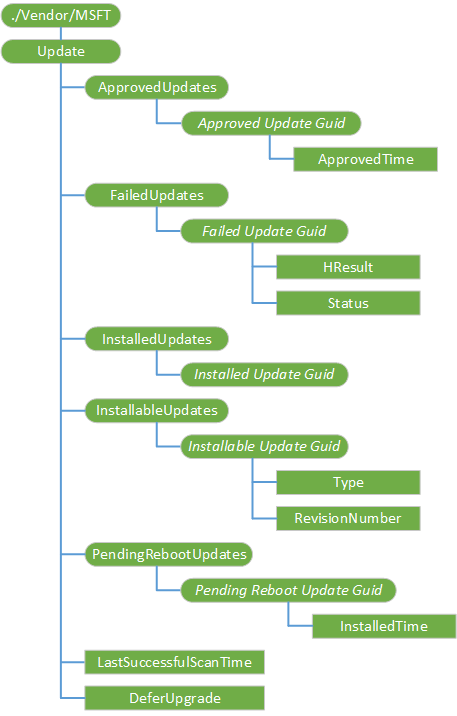

<a href="" id="update"></a>**更新**  
根节点。

受支持的操作是获得。

<a href="" id="approvedupdates"></a>**ApprovedUpdates**  
更新审批和代表最终用户的最终用户许可协议接受的节点。

> **请注意**当设置了 RequireUpdateApproval 策略时，MDM 使用 ApprovedUpdates 列表传递批准的 Guid。 这些 Guid 应该是 InstallableUpdates 列表的一个子集。

MDM 必须首先出示到 EULA IT 并让他们接受它，才能批准更新。 如果不这样做是法律或合同义务的违反。 Eula 可获取的更新元数据，并有他们自己的协议 id。 很可能的多个更新程序共享同一个最终用户许可协议。 它只是用来审核一次每个最终用户许可协议 ID，不是每个更新的 EULA。

更新审批列表使 IT 部门能够批准单独更新和更新分类。 通过更新分类的自动审批使 IT 部门能够自动批准 （亦即，在设备上的病毒和间谍软件定义更新） 特征码更新和安全更新 （即，特定于产品的更新与安全相关的漏洞）。 更新的审批列表不支持卸载更新通过吊销批准已安装的更新。 更新已批准基于 UpdateID，和 UpdateID 只需一次审批。 更新 UpdateID 和 RevisionNumber 是 UpdateIdentity 类型的一部分。 UpdateID 可关联到几个 UpdateIdentity Guid，由于 RevisionNumber 设置的更改。 MDM 服务必须同步基于最新的 RevisionNumber，以获得最新的元数据更新 UpdateID 的 UpdateIdentity。 但是，更新批准基于 UpdateID。

> **请注意** Windows 10 版本，客户端可能需要添加更多的更新后重新启动计算机。

 

支持的操作包括获取和添加。

<a href="" id="approvedupdates-approved-update-guid"></a>**ApprovedUpdates / ***_批准更新 Guid_**  
指定该更新的 GUID。

要自动批准的更新的类，您可以指定[更新类别](http://go.microsoft.com/fwlink/p/?LinkId=526723)Guid。 我们强烈建议始终指定 DefinitionsUpdates 分类 (E0789628-CE08-4437-BE74-2495B842F43B)，其用于反恶意软件签名。 那里定期的发布 （每天多次）。 一些公司可能还要自动批准的安全更新，让他们迅速部署。

支持的操作包括获取和添加。

示例 syncml:

```
<LocURI>./Vendor/MSFT/Update/ApprovedUpdates/%7ba317dafe-baf4-453f-b232-a7075efae36e%7d</LocURI>
```

<a href="" id="approvedupdates-approved-update-guid-approvedtime"></a>* *ApprovedUpdates /*批准更新 Guid*/ApprovedTime**  
指定的时间获取批准更新。

支持的操作包括获取和添加。

<a href="" id="failedupdates"></a>**FailedUpdates**  
指定的已批准的更新程序无法安装到设备上。

受支持的操作是获得。

<a href="" id="failedupdates-failed-update-guid"></a>**FailedUpdates / ***_失败更新 Guid_**  
更新表示无法下载或安装更新 UpdateIdentity GUID 标识符字段。

受支持的操作是获得。

<a href="" id="failedupdates-failed-update-guid-hresult"></a>* *FailedUpdates /*失败更新 Guid*/HResult**  
更新失败，错误代码。

受支持的操作是获得。

<a href="" id="failedupdates-failed-update-guid-status"></a>* *FailedUpdates /*失败更新 Guid*/Status**  
指定失败的更新状态 （例如，下载，安装）。

受支持的操作是获得。

<a href="" id="installedupdates"></a>**InstalledUpdates**  
在设备安装这些更新。

受支持的操作是获得。

<a href="" id="installedupdates-installed-update-guid"></a>**InstalledUpdates / ***_安装更新的 Guid_**  
表示设备上安装的更新的 UpdateIDs。

受支持的操作是获得。

<a href="" id="installableupdates"></a>**InstallableUpdates**  
所适用的并且尚未安装在设备上的更新。 这包括未获得批准的更新。

受支持的操作是获得。

<a href="" id="installableupdates-installable-update-guid"></a>**InstallableUpdates / ***_的 Guid 可安装的更新_**  
表示适用和设备上未安装的更新的更新标识符。

受支持的操作是获得。

<a href="" id="installableupdates-installable-update-guid-type"></a>* *InstallableUpdates /*的 Guid 可安装更新*/Type**  
UpdateClassification 的更新值。 有效值包括︰

-   0-无
-   1-安全性
-   2 = 临界

受支持的操作是获得。

<a href="" id="installableupdates-installable-update-guid-revisionnumber"></a>* *InstallableUpdates /*的 Guid 可安装更新*/RevisionNumber**  
必须传入的服务器到服务器的同步更新获取元数据的更新修订号。

受支持的操作是获得。

<a href="" id="pendingrebootupdates"></a>**PendingRebootUpdates**  
需要重新启动才能完成更新会话更新。

受支持的操作是获得。

<a href="" id="pendingrebootupdates-pending-reboot-update-guid"></a>**PendingRebootUpdates / ***_挂起的重新启动更新 Guid_**  
更新挂起的重新启动状态的标识符。

受支持的操作是获得。

<a href="" id="pendingrebootupdates-pending-reboot-update-guid-installedtime"></a>* *PendingRebootUpdates /*挂起的重新启动更新 Guid*/InstalledTime**  
安装了此更新的时间。

受支持的操作是获得。

<a href="" id="lastsuccessfulscantime"></a>**LastSuccessfulScanTime**  
上次成功的扫描时间。

受支持的操作是获得。

<a href="" id="deferupgrade"></a>**DeferUpgrade**  
推迟到下一个期间的升级。

受支持的操作是获得。


## <a name="a-href-idwindows10version1607forupdatemanagementa-windows-10-version-1607-for-update-management"></a><a href="" id="windows10version1607forupdatemanagement"></a>Windows 10，1607年版本更新管理

下面是 Windows 10[策略 CSP](policy-configuration-service-provider.md)1607 版本中添加的新策略。 应使用新的 Windows 10 版本 1607年设备这些策略。

-   更新/ActiveHoursEnd
-   更新/ActiveHoursStart
-   更新/AllowMUUpdateService
-   更新/BranchReadinessLevel
-   更新/DeferFeatureUpdatePeriodInDays
-   更新/DeferQualityUpdatePeriodInDays
-   更新/ExcludeWUDriversInQualityUpdate
-   更新/PauseFeatureUpdates
-   更新/PauseQualityUpdates

下面是相应的组策略设置 HKLM 中的列表\\软件\\策略\\Microsoft\\Windows\\WindowsUpdate。

<table>
<colgroup>
<col width="33%" />
<col width="33%" />
<col width="33%" />
</colgroup>
<thead>
<tr class="header">
<th>GPO 键</th>
<th>类型</th>
<th>值</th>
</tr>
</thead>
<tbody>
<tr class="odd">
<td style="vertical-align:top"><p>BranchReadinessLevel</p></td>
<td style="vertical-align:top"><p>REG_DWORD</p></td>
<td style="vertical-align:top"><p>16︰ 系统采用当前分支 (CB) 训练功能更新</p>
<p>32︰ 系统采用当前分支的业务功能更新</p>
<p>其他的值或不存在︰ 接收所有适用的更新 (CB)</p></td>
</tr>
<tr class="even">
<td style="vertical-align:top"><p>DeferQualityUpdates</p></td>
<td style="vertical-align:top"><p>REG_DWORD</p></td>
<td style="vertical-align:top"><p>1︰ 推迟质量更新</p>
<p>其他的值或不存在︰ 不推迟质量更新</p></td>
</tr>
<tr class="odd">
<td style="vertical-align:top"><p>DeferQualityUpdatesPeriodInDays</p></td>
<td style="vertical-align:top"><p>REG_DWORD</p></td>
<td style="vertical-align:top"><p>0-30︰ 天推迟高质量的更新</p></td>
</tr>
<tr class="even">
<td style="vertical-align:top"><p>PauseQualityUpdates</p></td>
<td style="vertical-align:top"><p>REG_DWORD</p></td>
<td style="vertical-align:top"><p>1︰ 暂停质量更新</p>
<p>其他的值或不存在︰ 不暂停高质量的更新</p></td>
</tr>
<tr class="odd">
<td style="vertical-align:top"><p>DeferFeatureUpdates</p></td>
<td style="vertical-align:top"><p>REG_DWORD</p></td>
<td style="vertical-align:top"><p>1︰ 推迟功能更新</p>
<p>其他的值或不存在︰ 不推迟功能更新</p></td>
</tr>
<tr class="even">
<td style="vertical-align:top"><p>DeferFeatureUpdatesPeriodInDays</p></td>
<td style="vertical-align:top"><p>REG_DWORD</p></td>
<td style="vertical-align:top"><p>0-180︰ 天推迟功能更新</p></td>
</tr>
<tr class="odd">
<td style="vertical-align:top"><p>PauseFeatureUpdates</p></td>
<td style="vertical-align:top"><p>REG_DWORD</p></td>
<td style="vertical-align:top"><p>1︰ 暂停功能更新</p>
<p>其他的值或不存在︰ 不暂停功能更新</p></td>
</tr>
<tr class="even">
<td style="vertical-align:top"><p>ExcludeWUDriversInQualityUpdate</p></td>
<td style="vertical-align:top"><p>REG_DWORD</p></td>
<td style="vertical-align:top"><p>1︰ 排除 WU 的驱动程序</p>
<p>其他的值或不存在︰ 提供 WU 驱动程序</p></td>
</tr>
</tbody>
</table>

 

这是旧的策略，仍然支持向后兼容性的列表。 您可以使用这些窗口 10 版本 1511年设备。

-   更新/RequireDeferUpgrade
-   更新/DeferUpgradePeriod
-   更新/DeferUpdatePeriod
-   更新/PauseDeferrals

对于业务的 Windows 更新，以下是在 Windows 10 移动企业的支持策略的列表︰

-   第 10 Windows 版本 1511 (生成 10586): 更新/RequireDeferUpgrade、 更新/DeferUpdatePeriod 和更新/PauseDeferrals。 使用 DeferUpdatePeriod 和 PauseDeferrals RequireDeferUpgrade 已被设置为 1，这意味着设备运行 1511，业务策略的 Windows 更新可以只将集时将设备配置为 CBB 服务。
-   第 10 Windows 版本 1607 (生成 14393): 更新/BranchReadinessLevel、 更新/DeferQualityUpdatesPeriodInDays 和更新/PauseQualityUpdates。 在 1607年我们添加了位置时，可以配置 Windows 更新的业务策略将设备配置为 CB/CBB 的支持服务。

> **请注意**  
对于 Windows 更新业务，当两个 Windows 10，1607年版本设置策略和 Windows 10 1511年上运行 1607，1607年策略将配置 （1607年王牌 1511年） 的版本也支持策略。

对于策略支持的 Windows 更新的业务，在设备运行 1607年上设置 1511年策略时，您将获得预期的行为 1511年策略。

 

## <a name="a-href-iduserexperiencescreenshotaupdate-management-user-experience-screenshot"></a><a href="" id="userexperiencescreenshot"></a>更新管理用户体验屏幕抓图

管理员控制台下面屏幕抓图显示了更新标题、 审批状态和附加元数据字段的列表。

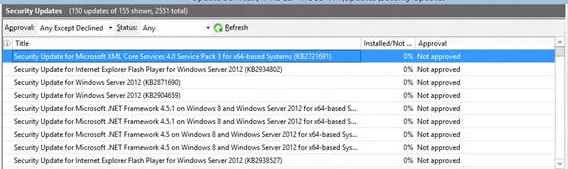

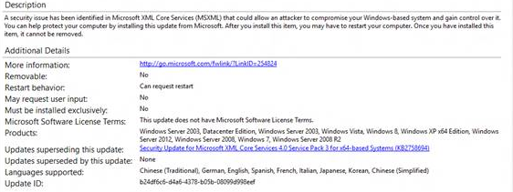


## <a name="a-href-idsyncmlexampleasyncml-example"></a><a href="" id="syncmlexample"></a>SyncML 的示例

设置自动更新通知和推迟。

``` syntax
<SyncML xmlns="SYNCML:SYNCML1.1">
    <SyncBody>
        <Replace xmlns="">
            <CmdID>1</CmdID>
            <Item>
                <Meta>
                    <Format>int</Format>
                    <Type>text/plain</Type>
                </Meta>
                <Target>
                    <LocURI>./Vendor/MSFT/Policy/Config/Update/AllowUpdateService</LocURI>
                </Target>
                <Data>0</Data>
            </Item>
            <CmdID>2</CmdID>
            <Item>
                <Meta>
                    <Format>int</Format>
                    <Type>text/plain</Type>
                </Meta>
                <Target>
                    <LocURI>./Vendor/MSFT/Policy/Config/Update/RequireDeferUpgrade </LocURI>
                </Target>
                <Data>0</Data>
            </Item>
            <CmdID>3</CmdID>
            <Item>
                <Meta>
                    <Format>int</Format>
                    <Type>text/plain</Type>
                </Meta>
                <Target>
                    <LocURI>./Vendor/MSFT/Policy/Config/Update/RequireUpdateApproval </LocURI>
               </Target>
                <Data>0</Data>
            </Item>
        </Replace>
       <Final/>
    </SyncBody>
</SyncML>
```

## <a name="process-flow-diagram-and-screenshots-of-server-sync-process"></a>工艺流程图和屏幕快照的服务器同步过程

下面的关系图和屏幕抓图显示了使用 Windows 服务器更新服务和 Microsoft 更新目录的设备更新过程的流程。

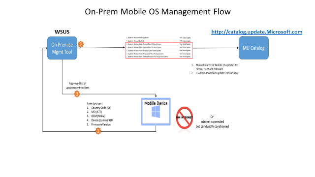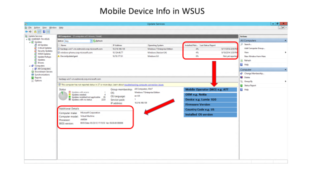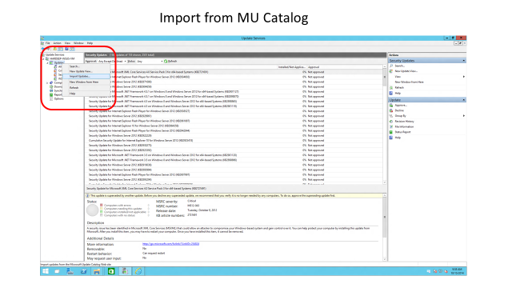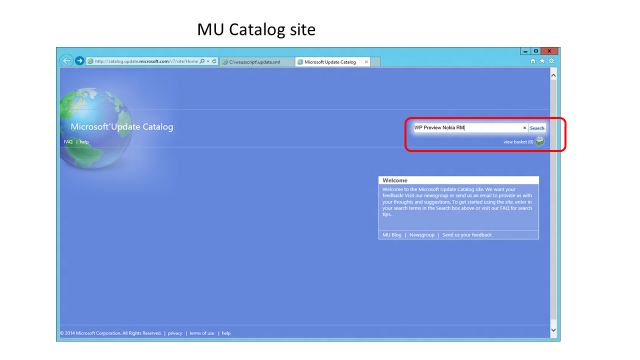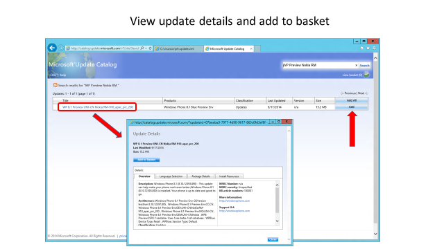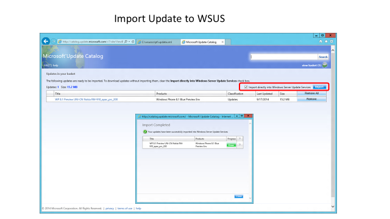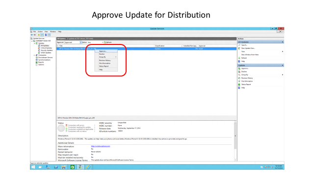

 


