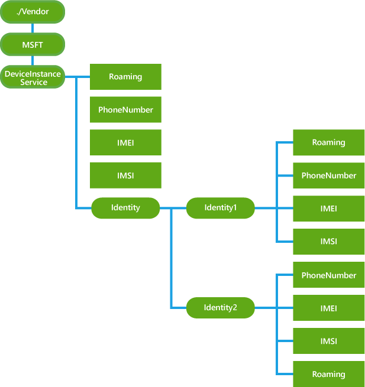

# <a name="deviceinstanceservice-csp"></a>DeviceInstanceService 的 CSP


DeviceInstanceService 配置服务提供程序提供了非常有用的对于企业一些设备库存信息。 此外，该 CSP 支持查询在双 sim 卡的情况下的两个不同的电话号码。 Sim 卡 1 和 sim 卡 2 Uri 分别为./Vendor/MSFT/DeviceInstanceService/Identity/Identity1 和./Vendor/MSFT/DeviceInstanceService/Identity/Identity2。

> **请注意**  
停止使用 DeviceInstanceService 的 CSP，而改用更新的[DeviceStatus 的 CSP](devicestatus-csp.md) 。

在 Windows 10 Mobile 只支持 DeviceInstance CSP。

 

下面的关系图以树格式显示 DeviceInstanceService 配置服务提供程序。



<a href="" id="roaming"></a>**漫游**  
一个布尔值，它指定设备的漫游状态。 在双 SIM 模式时设备支持在两个不同的电话号码，./Vendor/MSFT/DeviceInstanceService/Identify1/Roaming 使用显式查询 sim 卡 1 是功能上等效于使用./Vendor/MSFT/DeviceInstanceService/漫游。

受支持的操作是**获得**。

当返回**True**设备漫游;其他**假**。

<a href="" id="phonenumber"></a>**电话号码**  
一个字符串，表示此设备的电话号码。 对于双 SIM 模式设备支持在两个不同的电话号码，./Vendor/MSFT/DeviceInstanceService/Identify1/PhoneNumber 使用显式查询 sim 卡 1 时，作用相当于./Vendor/MSFT/DeviceInstanceService/电话号码。

值类型是 chr。

受支持的操作是**获得**。

<a href="" id="imei"></a>**IMEI**  
一个字符串表示国际移动站设备标识 (IMEI) 的设备。 对于双 SIM 模式设备支持在两个不同的电话号码，./Vendor/MSFT/DeviceInstanceService/Identify1/IMEI 使用显式查询 sim 卡 1 时，作用相当于./Vendor/MSFT/DeviceInstanceService/IMEI。

值类型是 chr。

受支持的操作是**获得**。

<a href="" id="imsi"></a>**IMSI**  
一个字符串，表示设备 IMSI 号码 （国家/地区代码移动，移动网络代码） 设备的前 6 位数字。 对于双 SIM 模式设备支持在两个不同的电话号码，./Vendor/MSFT/DeviceInstanceService/Identify1/IMSI 使用显式查询 sim 卡 1 时，作用相当于./Vendor/MSFT/DeviceInstanceService/IMSI。

值类型是 chr。

受支持的操作是**获得**。

<a href="" id="identity"></a>**标识**  
到每个 sim 卡时双 SIM 模式的特定信息组的父节点。

<a href="" id="identity1"></a>**1>**  
父节点进行分组 SIM1 时双 SIM 模式的特定信息。

<a href="" id="identity2"></a>**Identity2**  
父节点进行分组 SIM2 在双 SIM 模式的特定信息。

## <a name="examples"></a>示例


下面的示例演示如何查询漫游状态和设备上的电话号码。

``` syntax
<Get>
      <CmdID>2</CmdID>
      <Item>
        <Target>
          <LocURI>./Vendor/MSFT/DeviceInstanceService/Roaming</LocURI>
        </Target>
      </Item>
      <Item>
        <Target>
          <LocURI>./Vendor/MSFT/DeviceInstanceService/PhoneNumber</LocURI>
        </Target>
      </Item>
</Get>
```

通过电话的响应。

``` syntax
<Results>
   <CmdID>3</CmdID>
   <MsgRef>1</MsgRef>
   <CmdRef>2</CmdRef>
   <Item>
      <Source><LocURI>./Vendor/MSFT/DeviceInstanceService/Roaming</LocURI></Source>
      <Meta><Format xmlns="syncml:metinf">bool</Format></Meta>
      <Data>false</Data>
   </Item>
   <Item>
      <Source><LocURI>./Vendor/MSFT/DeviceInstanceService/PhoneNumber</LocURI></Source>
      <Data>+14254458055</Data>
   </Item>
</Results>
```

## <a name="related-topics"></a>相关的主题


[配置服务提供程序的引用](configuration-service-provider-reference.md)

 

 


