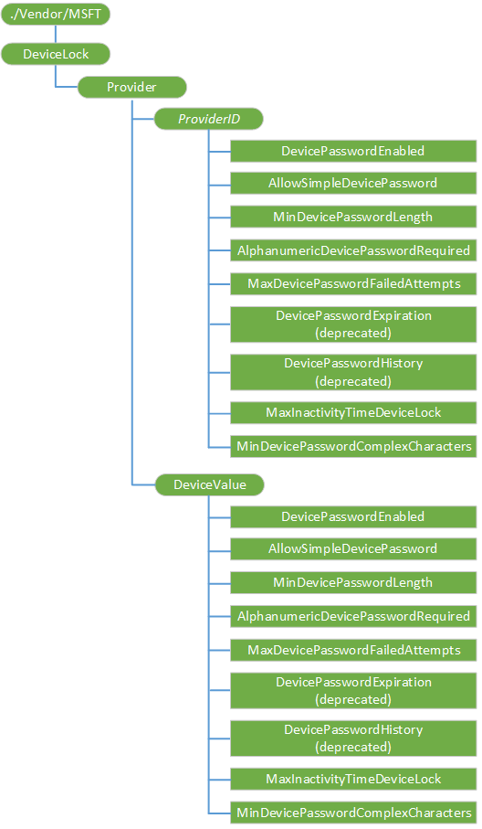

# <a name="devicelock-csp"></a>DeviceLock 的 CSP


企业使用 DeviceLock 配置服务提供程序管理服务器来配置设备锁定相关策略。 此配置服务提供程序被支持企业管理服务器。

> **请注意**  为了向后兼容，DeviceLock CSP 支持 Windows 10 移动。 对于 Windows 10 设备应为各种设备锁定设置使用[策略 CSP](policy-configuration-service-provider.md) 。 您可以继续使用 Windows Phone 8.1 和 Windows Phone 8.1 GDR 设备 DeviceLock CSP。 DeviceLock CSP，它将被否决在将来某个时候。

 

为以下设置才会生效，DevicePasswordEnabled 设置必须设置为 0 （启用设备密码）︰

-   AllowSimpleDevicePassword
-   MinDevicePasswordLength
-   AlphanumericDevicePasswordRequired
-   MaxDevicePasswordFailedAttempts
-   MaxInactivityTimeDeviceLock
-   MinDevicePasswordComplexCharacters

下面的图像以树格式显示 DeviceLock 配置服务提供程序。



<a href="" id="provider"></a>**提供程序**  
必需。 要分组的所有策略提供程序的内部节点。 作用域是永久性的。 受支持的操作是获得。

<a href="" id="---------------providerid"></a>***ProviderID***  
可选项。 包含配置的管理服务器的 ProviderID 的节点。 在 Windows Phone 8，只有一个企业管理的服务器支持。 也就是说，应该有只有一个*ProviderID*节点。 由 Exchange 设置 Exchange ActiveSync 策略单独保存同步客户端。 作用域是动态的。 支持以下操作︰

-   **添加**-将添加到配置服务提供程序树的管理帐户。
-   **删除**-删除所有策略都设置此帐户。 此命令无法用于企业注销中删除策略值设置的企业管理服务器。
-   **获得**的收益由管理服务器设置的所有策略。

> **请注意**  后它将被添加，无法更改值。 不支持**替换**命令。

 

<a href="" id="providerid-devicepasswordenabled"></a>***ProviderID*/DevicePasswordEnabled**  
可选项。 一个整数值，指定是否启用设备锁定。 可能的值将为下列情况之一︰

-   0-设备锁定处于启用状态。
-   1 （缺省值）-设备锁定未启用。

作用域是动态的。

支持的操作是 Get，添加和替换。

<a href="" id="providerid-allowsimpledevicepassword"></a>***ProviderID*/AllowSimpleDevicePassword**  
可选项。 一个整数值，该值指示是否允许简单口令，如"1111"或"1234"。 此节点可能的值为下列值之一︰

-   0-不允许。
-   1 （默认）-允许。

无效的值被视为配置失败。 作用域是动态的。

支持的操作是 Get，添加和替换。

<a href="" id="providerid-mindevicepasswordlength"></a>***ProviderID*/MinDevicePasswordLength**  
可选项。 一个整数值，针中指定所需的字符最小数量。 有效值为 4 到 18 非独占。 默认值为 4。 无效的值被视为配置失败。 作用域是动态的。

支持的操作是 Get，添加和替换。

<a href="" id="providerid-alphanumericdevicepasswordrequired"></a>***ProviderID*/AlphanumericDevicePasswordRequired**  
可选项。 一个整数值，指定的密码或 PIN 允许的复杂性。

有效的值将为下列情况之一︰

-   0-所需的字母数字密码
-   1-用户可以选择数字或字母数字密码
-   2-用户可以选择任何密码、 数字密码或字母数字密码

无效的值被视为配置失败。 作用域是动态的。

支持的操作是 Get，添加和替换。

<a href="" id="providerid-devicepasswordexpiration"></a>***ProviderID*/DevicePasswordExpiration**  
在 Windows 中 10 被否决。

<a href="" id="providerid-devicepasswordhistory"></a>***ProviderID*/DevicePasswordHistory**  
在 Windows 中 10 被否决。

<a href="" id="providerid-maxdevicepasswordfailedattempts"></a>***ProviderID*/MaxDevicePasswordFailedAttempts**  
可选项。 一个整数值，它指定将擦除设备之前允许的身份验证失败的次数。 有效值为 0 到 999。 默认值为 0，它指示设备将不会被清除而不考虑身份验证失败的次数。

无效的值被视为配置失败。 作用域是动态的。

支持的操作是 Get，添加和替换。

<a href="" id="providerid-maxinactivitytimedevicelock"></a>***ProviderID*/MaxInactivityTimeDeviceLock**  
可选项。 一个整数值，指定的密码锁定之前，该设备可保持空闲状态的时间 （以分钟为单位）。 有效值为 0 到 999。 值为 0 表示未指定超时则。 在这种情况下，适用于大屏幕超时值所允许的用户界面。

无效的值被视为配置失败。 作用域是动态的。

支持的操作是 Get，添加和替换。

<a href="" id="providerid-mindevicepasswordcomplexcharacters"></a>***ProviderID*/MinDevicePasswordComplexCharacters**  
可选项。 一个整数值，指定一个强密码所需的复杂的元素类型 （大写和小写字母、 数字和标点符号） 数。 有效值为 1 到 4 的移动和桌面 1 至 3。 默认值为 1。

无效的值被视为配置失败。 作用域是动态的。

支持的操作是 Get，添加和替换。

<a href="" id="devicevalue"></a>**DeviceValue**  
必需。 永久节点的组应用于该设备的策略值。 服务器可以查询此节点来发现什么策略值被实际应用到设备。 作用域是永久性的。

受支持的操作是获得。

<a href="" id="devicevalue-devicepasswordenable-----mindevicepasswordcomplexcharacters"></a>**DeviceValue/DevicePasswordEnable，......MinDevicePasswordComplexCharacters**  
必需。 此节点具有相同**ProviderID**节点作为组策略节点。 **DeviceValue**下的所有节点都是只读的永久的节点。 每个节点表示当前设备锁定策略。 每个策略的详细说明，请参阅***ProviderID***子节点的说明。

## <a name="oma-dm-examples"></a>OMA DM 示例


设置设备的锁定策略︰

``` syntax
<Atomic>
   <CmdID>13</CmdID>
   <Add>
      <CmdID>2</CmdID>
      <Item>
         <Target>
            <LocURI>
               ./Vendor/MSFT/DeviceLock/Provider/TestMDMServer/MaxDevicePasswordFailedAttempts
            </LocURI>
         </Target>
         <Meta>
            <Format xmlns="syncml:metinf">int</Format>
         </Meta>
         <Data>4</Data>
      </Item>
   </Add>
   <Add>
      <CmdID>3</CmdID>
      <Item>
         <Target>
            <LocURI>
               ./Vendor/MSFT/DeviceLock/Provider/TestMDMServer/DevicePasswordEnabled</LocURI>
         </Target>
         <Meta>
            <Format xmlns="syncml:metinf">int</Format>
         </Meta>
         <Data>0</Data>
      </Item>
   </Add>
   <Add>
      <CmdID>4</CmdID>
      <Item>
         <Target>
            <LocURI>
               ./Vendor/MSFT/DeviceLock/Provider/TestMDMServer/AllowSimpleDevicePassword
            </LocURI>
         </Target>
         <Meta>
            <Format xmlns="syncml:metinf">int</Format>
         </Meta>
         <Data>1</Data>
      </Item>
   </Add>
   <Add>
      <CmdID>5</CmdID>
      <Item>
         <Target>
            <LocURI>
               ./Vendor/MSFT/DeviceLock/Provider/TestMDMServer/MinDevicePasswordLength
            </LocURI>
         </Target>
         <Meta>
            <Format xmlns="syncml:metinf">int</Format>
         </Meta>
         <Data>5</Data>
      </Item>
   </Add>
   <Add>
      <CmdID>6</CmdID>
      <Item>
         <Target>
            <LocURI>
            ./Vendor/MSFT/DeviceLock/Provider/TestMDMServer/AlphanumericDevicePasswordRequired
            </LocURI>
         </Target>
         <Meta>
            <Format xmlns="syncml:metinf">int</Format>
         </Meta>
         <Data>1</Data>
      </Item>
   </Add>
   <Add>
      <CmdID>7</CmdID>
      <Item>
         <Target>
            <LocURI>
               ./Vendor/MSFT/DeviceLock/Provider/TestMDMServer/DevicePasswordExpiration
            </LocURI>
         </Target>
         <Meta>
            <Format xmlns="syncml:metinf">int</Format>
         </Meta>
         <Data>2</Data>
      </Item>
   </Add>
   <Add>
      <CmdID>8</CmdID>
      <Item>
         <Target>
            <LocURI>
               ./Vendor/MSFT/DeviceLock/Provider/TestMDMServer/DevicePasswordHistory
            </LocURI>
         </Target>
         <Meta>
            <Format xmlns="syncml:metinf">int</Format>
         </Meta>
         <Data>50</Data>
      </Item>
   </Add>
   <Add>
      <CmdID>9</CmdID>
      <Item>
         <Target>
            <LocURI>
               ./Vendor/MSFT/DeviceLock/Provider/TestMDMServer/MaxInactivityTimeDeviceLock
            </LocURI>
         </Target>
         <Meta>
            <Format xmlns="syncml:metinf">int</Format>
         </Meta>
         <Data>2</Data>
      </Item>
   </Add>
   <Add>
      <CmdID>10</CmdID>
      <Item>
         <Target>
            <LocURI>
            ./Vendor/MSFT/DeviceLock/Provider/TestMDMServer/MinDevicePasswordComplexCharacters
            </LocURI>
         </Target>
         <Meta>
            <Format xmlns="syncml:metinf">int</Format>
         </Meta>
         <Data>2</Data>
      </Item>
   </Add>
</Atomic>
```

## <a name="remarks"></a>备注


在**ProviderID**内部节点下的所有节点值都表示由管理服务器设置的策略值。

-   在这些节点上**添加**或**替换**命令返回成功在以下情况中︰

    -   到设备实际应用价值。

    -   值不被应用于设备，因为该设备具有已设置的更安全值。

        从安全的角度看，该设备符合至少请求一个安全策略要求。

-   这些节点上的**获取**命令返回服务器的值向下推到设备。

-   如果**替换**命令失败，则节点值被替换的值重新设置。

-   如果**添加**命令失败，则不会创建该节点。

应用于该设备的值可以通过**DeviceValue**内部节点下的节点进行查询。

## <a name="related-topics"></a>相关的主题


[配置服务提供程序的引用](configuration-service-provider-reference.md)

 

 


