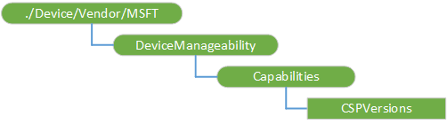

# <a name="devicemanageability-csp"></a>DeviceManageability 的 CSP


使用 DeviceManageability 配置服务提供程序 (CSP) 检索 MDM 配置功能在设备上的常规信息。 Windows 10，1607年版本中添加了该 CSP。

下面的关系图以树格式显示 DeviceManageability 配置服务提供程序。



<a href="" id="--device-vendor-msft-devicemanageability"></a>**./Device/Vendor/MSFT/DeviceManageability**  
有关运行时配置功能每台 MDM 目标设备上的组信息到根节点。

<a href="" id="capabilities"></a>**功能**  
内部节点。

<a href="" id="capabilities-cspversions"></a>**功能/CSPVersions**  
返回在 MDM 服务的设备上受支持的所有配置服务提供程序的版本。

## <a name="examples"></a>示例


对 Csp 和 CSP 的每个受支持的版本的列表的查询。

``` syntax
<SyncML xmlns="SYNCML:SYNCML1.2">
  <SyncBody>
    <Get>
      <CmdID>12345</CmdID>
      <Item>
        <Target>
          <LocURI>./Device/Vendor/MSFT/DeviceManageability/Capabilities/CSPVersions</LocURI>
        </Target>
      </Item>
    </Get>
    <Final/>
  </SyncBody>
</SyncML>
```

查询的结果。

``` syntax
<SyncML xmlns="SYNCML:SYNCML1.2">
   <SyncHdr/>
   <SyncBody>
   <Status>
      <CmdID>1</CmdID>
      <MsgRef>1</MsgRef>
      <CmdRef>0</CmdRef>
      <Cmd>SyncHdr</Cmd>
      <Data>200</Data>
   </Status>
   <Status>
      <CmdID>2</CmdID>
      <MsgRef>1</MsgRef>
      <CmdRef>2</CmdRef>
      <Cmd>Get</Cmd>
      <Data>200</Data>
   </Status>
   <Results>
      <CmdID>3</CmdID>
      <MsgRef>1</MsgRef>
      <CmdRef>2</CmdRef>
      <Item>
         <Source><LocURI>./Device/Vendor/MSFT/DeviceManageability/Capabilities/CSPVersions</LocURI></Source>
         <Meta><Format xmlns="syncml:metinf">xml</Format></Meta>
         <Data>&lt;?xml version="1.0" encoding="utf-8"?&gt;
&lt;DeviceManageability Version="com.microsoft/1.0/MDM/DeviceManageability"&gt;
  &lt;Capabilities&gt;
    &lt;CSPVersions&gt;
      &lt;CSP Node="./DevDetail" Version="1.0"&gt;&lt;/CSP&gt;
      &lt;CSP Node="./DevInfo" Version="1.0"&gt;&lt;/CSP&gt;
      &lt;CSP Node="./Device/Vendor/MSFT/AssignedAccess" Version="1.0"&gt;&lt;/CSP&gt;
      &lt;CSP Node="./Device/Vendor/MSFT/ClientCertificateInstall" Version="1.0"&gt;&lt;/CSP&gt;
      &lt;CSP Node="./Device/Vendor/MSFT/DeviceManageability" Version="1.0"&gt;&lt;/CSP&gt;
      &lt;CSP Node="./Device/Vendor/MSFT/EnterpriseDataProtection" Version="1.0"&gt;&lt;/CSP&gt;
      &lt;CSP Node="./Device/Vendor/MSFT/EnterpriseDesktopAppManagement" Version="1.0"&gt;&lt;/CSP&gt;
      &lt;CSP Node="./Device/Vendor/MSFT/EnterpriseModernAppManagement" Version="1.1"&gt;&lt;/CSP&gt;
      &lt;CSP Node="./Device/Vendor/MSFT/PassportForWork" Version="1.1"&gt;&lt;/CSP&gt;
      &lt;CSP Node="./Device/Vendor/MSFT/Policy" Version="4.0"&gt;&lt;/CSP&gt;
      &lt;CSP Node="./Device/Vendor/MSFT/Reboot" Version="1.0"&gt;&lt;/CSP&gt;
      &lt;CSP Node="./Device/Vendor/MSFT/RootCATrustedCertificates" Version="1.0"&gt;&lt;/CSP&gt;
      &lt;CSP Node="./Device/Vendor/MSFT/VPNv2" Version="1.0"&gt;&lt;/CSP&gt;
      &lt;CSP Node="./Device/Vendor/MSFT/WindowsAdvancedThreatProtection" Version="1.0"&gt;&lt;/CSP&gt;
      &lt;CSP Node="./Device/Vendor/MSFT/WindowsLicensing" Version="1.0"&gt;&lt;/CSP&gt;
      &lt;CSP Node="./SyncML/DMAcc" Version="1.0"&gt;&lt;/CSP&gt;
      &lt;CSP Node="./User/Vendor/MSFT/ActiveSync" Version="1.0"&gt;&lt;/CSP&gt;
      &lt;CSP Node="./User/Vendor/MSFT/ClientCertificateInstall" Version="1.0"&gt;&lt;/CSP&gt;
      &lt;CSP Node="./User/Vendor/MSFT/EMAIL2" Version="1.0"&gt;&lt;/CSP&gt;
      &lt;CSP Node="./User/Vendor/MSFT/EnterpriseDesktopAppManagement" Version="1.0"&gt;&lt;/CSP&gt;
      &lt;CSP Node="./User/Vendor/MSFT/EnterpriseModernAppManagement" Version="1.1"&gt;&lt;/CSP&gt;
      &lt;CSP Node="./User/Vendor/MSFT/PassportForWork" Version="1.1"&gt;&lt;/CSP&gt;
      &lt;CSP Node="./User/Vendor/MSFT/Policy" Version="4.0"&gt;&lt;/CSP&gt;
      &lt;CSP Node="./User/Vendor/MSFT/RootCATrustedCertificates" Version="1.0"&gt;&lt;/CSP&gt;
      &lt;CSP Node="./User/Vendor/MSFT/SecureAssessment" Version="1.0"&gt;&lt;/CSP&gt;
      &lt;CSP Node="./User/Vendor/MSFT/VPNv2" Version="1.0"&gt;&lt;/CSP&gt;
      &lt;CSP Node="./User/Vendor/MSFT/WiFi" Version="1.0"&gt;&lt;/CSP&gt;
      &lt;CSP Node="./Vendor/MSFT/ActiveSync" Version="1.0"&gt;&lt;/CSP&gt;
      &lt;CSP Node="./Vendor/MSFT/AppLocker" Version="1.0"&gt;&lt;/CSP&gt;
      &lt;CSP Node="./Vendor/MSFT/CertificateStore" Version="1.0"&gt;&lt;/CSP&gt;
      &lt;CSP Node="./Vendor/MSFT/DMClient" Version="1.0"&gt;&lt;/CSP&gt;
      &lt;CSP Node="./Vendor/MSFT/Defender" Version="1.0"&gt;&lt;/CSP&gt;
      &lt;CSP Node="./Vendor/MSFT/DeviceLock" Version="1.0"&gt;&lt;/CSP&gt;
      &lt;CSP Node="./Vendor/MSFT/DeviceStatus" Version="1.1"&gt;&lt;/CSP&gt;
      &lt;CSP Node="./Vendor/MSFT/DiagnosticLog" Version="1.0"&gt;&lt;/CSP&gt;
      &lt;CSP Node="./Vendor/MSFT/EMAIL2" Version="1.0"&gt;&lt;/CSP&gt;
      &lt;CSP Node="./Vendor/MSFT/EnterpriseModernAppManagement" Version="1.1"&gt;&lt;/CSP&gt;
      &lt;CSP Node="./Vendor/MSFT/HealthAttestation" Version="1.0"&gt;&lt;/CSP&gt;
      &lt;CSP Node="./Vendor/MSFT/Maps" Version="1.0"&gt;&lt;/CSP&gt;
      &lt;CSP Node="./Vendor/MSFT/NodeCache" Version="1.0"&gt;&lt;/CSP&gt;
      &lt;CSP Node="./Vendor/MSFT/PassportForWork" Version="1.1"&gt;&lt;/CSP&gt;
      &lt;CSP Node="./Vendor/MSFT/Policy" Version="4.0"&gt;&lt;/CSP&gt;
      &lt;CSP Node="./Vendor/MSFT/RemoteFind" Version="1.0"&gt;&lt;/CSP&gt;
      &lt;CSP Node="./Vendor/MSFT/RemoteWipe" Version="1.0"&gt;&lt;/CSP&gt;
      &lt;CSP Node="./Vendor/MSFT/Reporting" Version="2.0"&gt;&lt;/CSP&gt;
      &lt;CSP Node="./Vendor/MSFT/SharedPC" Version="1.0"&gt;&lt;/CSP&gt;
      &lt;CSP Node="./Vendor/MSFT/Update" Version="1.0"&gt;&lt;/CSP&gt;
      &lt;CSP Node="./Vendor/MSFT/VPNv2" Version="1.0"&gt;&lt;/CSP&gt;
      &lt;CSP Node="./Vendor/MSFT/WiFi" Version="1.0"&gt;&lt;/CSP&gt;
      &lt;CSP Node="./cimv2" Version="1.0"&gt;&lt;/CSP&gt;
    &lt;/CSPVersions&gt;
  &lt;/Capabilities&gt;
&lt;/DeviceManageability&gt;
         </Data>
      </Item>
   </Results>
   <Final/>
   </SyncBody>
</SyncML>
```

 

 


