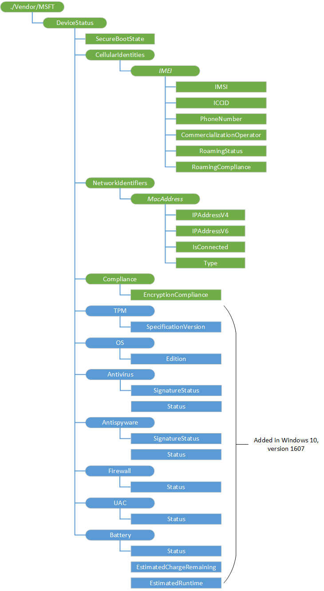

# DeviceStatus 的 CSP

企业使用 DeviceStatus 配置服务提供程序来跟踪设备清单并查询这些设备符合他们的企业策略的状态。

下面的图像以树格式显示 DeviceStatus 配置服务提供程序。

**DeviceStatus**  
DeviceStatus 配置服务提供程序的根节点。

**DeviceStatus/SecureBootState**  
指示是否已启用安全启动。 值将为下列情况之一︰

-   0-不受支持
-   1-启用
-   2-已禁用

受支持的操作是获得。

**DeviceStatus/CellularIdentities**  
必需。 在 SIM 卡上查询节点。

> **请注意** 支持多个 Sim。

 

**DeviceStatus/CellularIdentities / ***_IMEI_**  
移动设备的唯一国际移动站设备标识 (IMEI) 号码。 IMEI 是可行的设备上每个 SIM 卡。

* *DeviceStatus/CellularIdentities/*IMEI*/IMSI**  
国际移动订阅服务器的身份 (IMSI) 与 IMEI 号相关联。

受支持的操作是获得。

* *DeviceStatus/CellularIdentities/*IMEI*/ICCID**  
集成电路卡 ID (ICCID) 与特定的 IMEI 号码的 SIM 卡。

受支持的操作是获得。

* *DeviceStatus/CellularIdentities/*IMEI*/PhoneNumber**  
与特定的 IMEI 号码的电话号码。

受支持的操作是获得。

* *DeviceStatus/CellularIdentities/*IMEI*/CommercializationOperator**  
移动服务提供商或移动运营商与特定的 IMEI 号相关联。

受支持的操作是获得。

* *DeviceStatus/CellularIdentities/*IMEI*/RoamingStatus**  
指示是否将漫游与特定的 IMEI 号码的 SIM 卡。

受支持的操作是获得。

* *DeviceStatus/CellularIdentities/*IMEI*/RoamingCompliance**  
布尔值，该值指示与强制企业漫游策略法规遵从性。

受支持的操作是获得。

**DeviceStatus/NetworkIdentifiers**  
有关网络和设备属性的查询的节点。

**DeviceStatus/NetworkIdentifiers / ***_MacAddress_**  
无线网卡的 MAC 地址。 MAC 地址是每个网卡的设备上出现。

* *DeviceStatus/NetworkIdentifiers/*MacAddress*/IPAddressV4**  
网卡的 MAC 地址相关联的 IPv4 地址。

受支持的操作是获得。

* *DeviceStatus/NetworkIdentifiers/*MacAddress*/IPAddressV6**  
网卡的 MAC 地址相关联的 IPv6 地址。

受支持的操作是获得。

* *DeviceStatus/NetworkIdentifiers/*MacAddress*/IsConnected**  
布尔值，该值指示关联的 MAC 地址与网卡是否有活动的网络连接。

受支持的操作是获得。

* *DeviceStatus/NetworkIdentifiers/*MacAddress*/Type**  
网络连接类型。 值将为下列情况之一︰

-   WLAN
-   局域网
-   未知 （Bluetooth 或其他未知的网络连接）

受支持的操作是获得。

**DeviceStatus/法规遵从性**  
法规遵从性查询节点。

**EncryptionCompliance/DeviceStatus/法规遵从性**  
布尔值，该值指示与企业加密策略法规遵从性。 值将为下列情况之一︰

-   0-未加密
-   1-加密

受支持的操作是获得。

**DeviceStatus/TPM**  
在中，添加的版本 1607年。 TPM 查询节点。

受支持的操作是获得。

**DeviceStatus/TPM/SpecificationVersion**  
在中，添加的版本 1607年。 字符串，它指定的规范版本。

受支持的操作是获得。

**DeviceStatus/OS**  
在中，添加的版本 1607年。 操作系统查询的节点。

受支持的操作是获得。

**DeviceStatus/操作系统/版本**  
在中，添加的版本 1607年。 指定操作系统版本的字符串。

受支持的操作是获得。

**DeviceStatus/防病毒软件**  
在中，添加的版本 1607年。 防病毒的查询的节点。

受支持的操作是获得。

**SignatureStatus/DeviceStatus/防病毒软件**  
在中，添加的版本 1607年。 整数，指定防病毒签名的状态。

有效值︰

-   0-安全软件报告它不是最新版本。
-   1 （缺省值）-安全软件会报告其为最新版本。
-   2 – 不适用。 这被返回像手机一样的设备，没有防病毒软件 （其中 API 不存在了。）

受支持的操作是获得。

**DeviceStatus/防病毒/状态**  
在中，添加的版本 1607年。 整数，指定防病毒程序的状态。

有效值︰

-   防病毒软件是 0 – 和监视
-   1-防病毒软件已禁用
-   2-防病毒软件不监视设备/PC 或某些选项已禁用
-   3 （默认）-防病毒软件暂时不完全监视设备/PC
-   4 – 不适用于此设备防病毒程序。 这被返回像手机一样的设备，没有防病毒软件 （其中 API 不存在了。）

受支持的操作是获得。

**DeviceStatus/反间谍软件**  
在中，添加的版本 1607年。 反间谍软件查询节点。

受支持的操作是获得。

**SignatureStatus/DeviceStatus/反间谍软件**  
在中，添加的版本 1607年。 整数，指定反间谍软件签名的状态。

受支持的操作是获得。

**DeviceStatus/反间谍软件/状态**  
在中，添加的版本 1607年。 整数，指定的反间谍软件的状态。

受支持的操作是获得。

**DeviceStatus/防火墙**  
在中，添加的版本 1607年。 对于防火墙查询节点。

受支持的操作是获得。

**DeviceStatus/防火墙/状态**  
在中，添加的版本 1607年。 指定防火墙的状态的整数。

有效值︰

-   0 – 防火墙处于打开和监视
-   1 – 已禁用防火墙
-   2 – 防火墙不监视所有网络或某些规则已关闭
-   3 （默认）-防火墙暂时不监视所有网络
-   4 – 不适用。 这被返回像手机一样的设备，没有防病毒软件 （其中 API 不存在了。）

受支持的操作是获得。

**DeviceStatus/UAC**  
在中，添加的版本 1607年。 UAC 查询节点。

受支持的操作是获得。

**DeviceStatus/UAC/状态**  
在中，添加的版本 1607年。 整数，指定 UAC 的状态。

受支持的操作是获得。

**DeviceStatus/电池**  
在中，添加的版本 1607年。 该电池查询节点。

受支持的操作是获得。

**DeviceStatus/电池/状态**  
在中，添加的版本 1607年。 整数，指定的电池的状态

受支持的操作是获得。

**DeviceStatus/电池/EstimatedChargeRemaining**  
在中，添加的版本 1607年。 整数，指定估计的电池剩余电量。 这是中的**BatteryLifeTime**中返回的值[系统\_电源\_状态结构](https://msdn.microsoft.com/library/windows/desktop/aa373232.aspx)。

值为电池剩余使用年限时该设备未连接到交流电源的最大秒数。 当它连接到电源插座时，则值为-1。 如果估计未知，则值为-1。

受支持的操作是获得。

**DeviceStatus/电池/余**  
在中，添加的版本 1607年。 整数，指定电池估计运行时间。 这是中的**BatteryLifeTime**中返回的值[系统\_电源\_状态结构](https://msdn.microsoft.com/library/windows/desktop/aa373232.aspx)。

值为电池剩余使用年限时该设备未连接到交流电源的最大秒数。 当它连接到电源插座时，则值为-1。 如果估计未知，则值为-1。

受支持的操作是获得。

 

 

