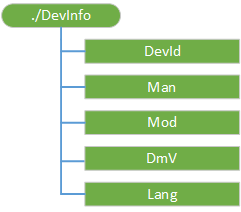

# DevInfo 的 CSP

DevInfo 配置服务提供程序处理的托管的对象，它提供了到 OMA DM 服务器的设备信息。 每个 OMA DM 会话开始时此设备信息自动发送到 OMA DM 服务器。

> **请注意** 此配置服务提供商要求使用 ID\_CAP\_CSP\_基础和 ID\_CAP\_设备\_管理\_管理功能从网络配置应用程序进行访问。

 

DevInfo csp，不能使用替换命令，除非该节点已存在。

下图显示了 DevInfo 配置服务提供程序管理对象以树格式由 OMA 设备管理。 OMA 客户端资源调配协议不支持此配置服务提供程序。

**DevId**  
必需。 默认情况下返回一个特定于应用程序的全局唯一的设备标识符。

受支持的操作是获得。

可以使用[DMAcc 配置服务提供商](dmacc-csp.md)或 DMS 配置服务提供程序的**UseHWDevID**参数来修改返回的值，而是返回一个硬件设备 ID，如下所示︰

-   对于 GSM 手机 IMEI 返回。

-   对于 CDMA 手机，将返回 MEID。

-   对于双 sim 卡手机，此值从主数据行 UICC 检索。

-   对于 Windows 10 桌面版本 （家庭、 Pro、 企业和教育），它返回应用程序特定全局唯一标识符 (GUID) 与 UseHWDevID 的值无关。

**手册**  
必需。 返回 OEM 的名称。 对于 Windows 桌面版本 10，它返回 SystemManufacturer HKEY 中定义\_本地\_机\\硬件\\说明\\系统\\BIOS\\SystemManufacturer。

如果不找到任何名称，则此方法返回"未知"。

受支持的操作是获得。

**求模**  
必需。 返回所指定的移动运营商和硬件设备模型的名称。 对于 Windows 桌面版本 10，它返回 SystemProductName HKEY 中定义\_本地\_机\\硬件\\说明\\系统\\BIOS\\SystemProductName。

如果不找到任何名称，则此方法返回"未知"。

受支持的操作是获得。

**DmV**  
必需。 返回当前的设备管理客户端版本。

受支持的操作是获得。

**语言**  
必需。 按照 RFC1766 定义返回设备的当前用户界面 (UI) 语言的设置。

受支持的操作是获得。

## 相关的主题

[配置服务提供程序的引用](configuration-service-provider-reference.md)

 

 

