# <a name="diagnose-mdm-failures-in-windows-10"></a>MDM Windows 10 中的故障诊断

为了帮助诊断注册或 Windows 10 设备由 MDM 服务器管理中的设备管理问题，您可以检查从桌面或移动设备收集的 MDM 日志。 以下各节描述 MDM 日志收集的过程。

## <a name="collect-logs-directly-from-windows-10-pcs"></a>直接从 Windows 10 台 Pc 收集日志

开始使用 Windows 10，版本 1511，MDM 日志捕获事件查看器中的以下位置中︰

-   应用程序和服务日志&gt;Microsoft &gt; Windows &gt; DeviceManagement 企业的诊断提供程序

这里是一个屏幕快照︰


在此位置，**管理**渠道，默认情况下日志事件。 但是，如果您需要更多详细信息的日志可以通过**显示分析日志和调试**日志选项设置在事件查看器中的**视图**菜单中选择启用**调试**日志。

**若要收集管理日志**

1.  右键单击**管理**节点。
2.  选择**另存为所有事件**。
3.  选择一个位置，输入文件名。
4.  单击**保存**。
5.  选择**显示这些语言的信息**，然后选择**英语**。
6.  单击**确定**。

有关更多详细日志记录，您可以启用**调试**日志。 右键单击**调试**节点，然后单击**启用日志**。

**若要收集调试日志**

1.  右键单击**调试**节点。
2.  选择**另存为所有事件**。
3.  选择一个位置，输入文件名。
4.  单击**保存**。
5.  选择**显示这些语言的信息**，然后选择**英语**。
6.  单击**确定**。

可以在 Windows 10 PC 运行 11 月 2015年更新事件查看器中打开日志文件 （.evtx 文件）。

## <a name="collect-logs-remotely-from-windows-10-pcs"></a>从 Windows 10 台 Pc 远程收集日志

MDM 服务器支持此 PC 已注册 MDM，当您远程可以从 PC 通过 MDM 渠道收集日志。 [DiagnosticLog 的 CSP](diagnosticlog-csp.md)可用来启用事件查看器通道的完整名称。 下面是用于管理和调试渠道的事件查看器名称︰

-   Microsoft-Windows-DeviceManagement-Enterprise-Diagnostics-Provider%2FAdmin
-   Microsoft-Windows-DeviceManagement-Enterprise-Diagnostics-Provider%2FDebug

例如︰ 启用日志通道

``` syntax
<SyncML xmlns="SYNCML:SYNCML1.2">
    <SyncBody>
        <Replace>
            <CmdID>2</CmdID>
            <Item>
                <Target>
                    <LocURI>./Vendor/MSFT/DiagnosticLog/EtwLog/Channels/Microsoft-Windows-DeviceManagement-Enterprise-Diagnostics-Provider%2FDebug/State</LocURI>
                </Target>
                <Meta>
                    <Format xmlns="syncml:metinf">bool</Format>
                </Meta>
                <Data>true</Data>
            </Item>
        </Replace>
        <Final/>
    </SyncBody>
</SyncML>
```

示例︰ 将导出的调试日志

``` syntax
<?xml version="1.0"?>
<SyncML xmlns="SYNCML:SYNCML1.2">
    <SyncBody>
        <Exec>
            <CmdID>2</CmdID>
            <Item>
                <Target>
                    <LocURI>./Vendor/MSFT/DiagnosticLog/EtwLog/Channels/Microsoft-Windows-DeviceManagement-Enterprise-Diagnostics-Provider%2FDebug/Export</LocURI>
                </Target>
            </Item>
        </Exec>
        <Final/>
    </SyncBody>
</SyncML>
```

## <a name="collect-logs-from-windows-10-mobile-devices"></a>从 Windows 10 移动设备收集日志

由于在 Windows 10 移动中没有任何事件查看器，您可以使用[字段 Medic]( http://go.microsoft.com/fwlink/p/?LinkId=718232)应用程序收集日志。

**若要手动收集日志**

1.  下载并安装从存储[字段 Medic]( http://go.microsoft.com/fwlink/p/?LinkId=718232) app。
2.  打开字段 Medic 应用程序，然后单击**高级**。

    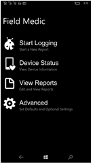

3.  单击**与要使用的 ETW 提供程序的选择**。

    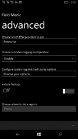

4.  检查**企业**，并取消的其余部分。

    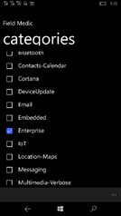

5.  在应用程序中，单击**启动日志记录**，然后执行您要排查故障的操作。

    

6.  完成此操作后，单击**停止**日志记录。

    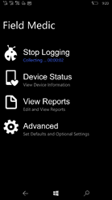

7.  保存日志。 它们将存储在设备上的字段 Medic 日志位置。
8.  您可以通过将这些文件从附加发送通过电子邮件日志**文档&gt;字段 Medic&gt;报告&gt;...**文件夹。

    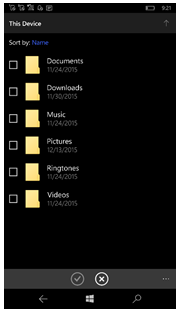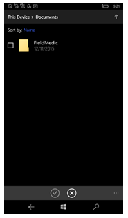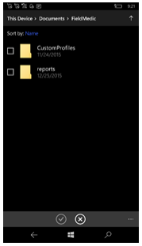

下表包含常见的提供者和其对应的 Guid 的列表。

| GUID                                 | 提供程序名称                                          |
|--------------------------------------|--------------------------------------------------------|
| 099614a5-5dd7-4788-8bc9-e29f43db28fc | Microsoft Windows 的 LDAP 客户端                          |
| 0f67e49f-fe51-4e9f-b490-6f2948cc6027 | Microsoft Windows 的内核的处理器的功耗               |
| 0ff1c24b-7f05-45c0-abdc-3c8521be4f62 | Microsoft-Windows-Mobile-Broadband-Experience-SmsApi   |
| 10e4f0e0-9686-4e62-b2d6-fd010eb976d3 | Microsoft WindowsPhone 外壳程序事件                    |
| 1e39b4ce-d1e6-46ce-b65b-5ab05d6cc266 | Microsoft Windows 网络 RealTimeCommunication     |
| 22a7b160-f6e8-46b9-8e0b-a51989c85c66 | Microsoft WindowsPhone Bluetooth AG                    |
| 2f94e1cc-a8c5-4fe7-a1c3-53d7bda8e73e | Microsoft 的 WindowsPhone-ConfigManager2                  |
| 331c3b3a-2005-44c2-ac5e-77220c37d6b4 | Microsoft Windows 内核电源                         |
| 33693e1d-246a-471b-83be-3e75f47a832d | Microsoft Windows BTH BTHUSB                           |
| 3742be72-99a9-42e6-9fd5-c01a330e3625 | Microsoft 的 WindowsPhone-PhoneAudio                      |
| 3b9602ff-e09b-4c6c-bc19-1a3dfa8f2250 | Microsoft 的 WindowsPhone-OmaDm-客户端的提供商联系           |
| 3da494e4-0fe2-415C-b895-fb5265c5c83b | Microsoft 的 WindowsPhone-企业-诊断程序的提供商联系 |
| 3f471139-acb7-4a01-b7a7-ff5da4ba2d43 | Microsoft Windows AppXDeployment 服务器                |
| 4180c4f7-e238-5519-338f-ec214f0b49aa | Microsoft.Windows.ResourceManager                      |
| 4637124c-1d40-4b4d-892f-2aaecf24ff06 | Microsoft 的 Windows WinJson                              |
| 4d13548f-c7b8-4174-bb7a-d7f64bf22d29 | Microsoft 的 WindowsPhone-LocationServiceProvider         |
| 4eacb4d0-263b-4b93-8cd6-778a278e5642 | Microsoft 的 Windows GenericRoaming                       |
| 4f386063-ef17-4629-863c-d71597af743d | Microsoft 的 WindowsPhone 的通知服务             |
| 55404e71-4db9-4deb-a5f5-8f86e46dde56 | Microsoft Windows Winsock NameResolution               |
| 59819d0a-adaf-46b2-8d7c-990bc39c7c15 | Microsoft Windows 电池                              |
| 5c103042-7e75-4629-a748-bdfa67607fac | Microsoft 的 WindowsPhone 电源                           |
| 69c1c3f1-2b5c-41d0-a14a-c7ca5130640e | Microsoft 的 WindowsPhone-Cortana                         |
| 6ad52b32-d609-4be9-ae07-ce8dae937e39 | Microsoft 的 Windows RPC                                  |
| 7263516b-6eb0-477b-b64f-17b91d29f239 | Microsoft 的 WindowsPhone-BatterySense                    |
| 7dd42a49-5329-4832-8dfd-43d979153a88 | Microsoft Windows 内核网络                       |
| ae4bd3be-f36f-45b6-8d21-bdd6fb832853 | Microsoft Windows 音频                                |
| daa6a96b-f3e7-4d4d-a0d6-31a350e6a445 | Microsoft Windows 的 WLAN 驱动程序                          |
| 4d13548f-c7b8-4174-bb7a-d7f64bf22d29 | Microsoft 的 WindowsPhone-LocationServiceProvider         |
| 74e106b7-00be-4a55-b707-7ab58d6a9e90 | Microsoft WindowsPhone 外壳 OOBE                      |
| cbda4dbf-8d5d-4f69-9578-be14aa540d22 | Microsoft 的 Windows AppLocker                            |
| e595f735-b42a-494b-afcd-b68666945cd3 | Microsoft Windows 防火墙                             |
| e5fc4a0f-7198-492f-9b0f-88fdcbfded48 | Microsoft Windows 网络 VPN                       |
| e5c16d49-2464-4382-bb20-97a4b5465db9 | Microsoft 的 Windows WiFiNetworkManager                   |

 

## <a name="collect-logs-remotely-from-windows-10-mobile-devices"></a>从 Windows 10 移动设备远程收集日志

对于已注册 MDM 的移动设备，可以远程收集通过 MDM 通道使用[DiagnosticLog CSP](diagnosticlog-csp.md)的 MDM 日志。

DiagnosticLog CSP 可用于启用 ETW 提供程序。 提供程序 ID 为 3DA494E4-0FE2-415 C-B895-FB5265C5C83B。 下面的示例演示如何启用 ETW 提供程序︰

添加收集器节点

``` syntax
<?xml version="1.0"?>
<SyncML xmlns="SYNCML:SYNCML1.2">
    <SyncBody>
        <Add>
            <CmdID>1</CmdID>
            <Item>
                <Target>
                   <LocURI>./Vendor/MSFT/DiagnosticLog/EtwLog/Collectors/MDM</LocURI>
                </Target>
                <Meta>
                    <Format xmlns="syncml:metinf">node</Format>
                </Meta>
            </Item>
        </Add>
        <Final/>
    </SyncBody>
</SyncML>
```

添加到跟踪 ETW 提供程序

``` syntax
<?xml version="1.0"?>
<SyncML xmlns="SYNCML:SYNCML1.2">
    <SyncBody>
        <Add>
            <CmdID>1</CmdID>
            <Item>
                <Target>
                    <LocURI>./Vendor/MSFT/DiagnosticLog/EtwLog/Collectors/MDM/Providers/3DA494E4-0FE2-415C-B895-FB5265C5C83B</LocURI>
                </Target>
                <Meta>
                    <Format xmlns="syncml:metinf">node</Format>
                </Meta>
            </Item>
        </Add>
        <Final/>
    </SyncBody>
</SyncML>
```

启动收集器跟踪日志记录

``` syntax
<?xml version="1.0"?>
<SyncML xmlns="SYNCML:SYNCML1.2">
    <SyncBody>
        <Exec>
            <CmdID>2</CmdID>
            <Item>
                <Target>
                    <LocURI>./Vendor/MSFT/DiagnosticLog/EtwLog/Collectors/MDM/TraceControl</LocURI>
                </Target>
                <Meta>
                    <Format xmlns="syncml:metinf">chr</Format>
                </Meta>
                <Data>START</Data>
            </Item>
        </Exec>
        <Final/>
    </SyncBody>
</SyncML>
```

停止收集器跟踪日志记录

``` syntax
<?xml version="1.0"?>
<SyncML xmlns="SYNCML:SYNCML1.2">
    <SyncBody>
        <Exec>
            <CmdID>2</CmdID>
            <Item>
                <Target>
                    <LocURI>./Vendor/MSFT/DiagnosticLog/EtwLog/Collectors/MDM/TraceControl</LocURI>
                </Target>
                <Meta>
                    <Format xmlns="syncml:metinf">chr</Format>
                </Meta>
                <Data>STOP</Data>
            </Item>
        </Exec>
        <Final/>
    </SyncBody>
</SyncML>
```

在设备上收集日志后，您可以检索通过 MDM 通道使用 DiagnosticLog CSP 的文件下载部分的文件。 有关详细信息，请参阅[DiagnosticLog CSP](diagnosticlog-csp.md)。

## <a name="view-logs"></a>查看日志

为了获得最佳效果，确保 PC 或查看日志的 VM 与从中收集日志的操作系统的版本匹配。

1.  打开 eventvwr.msc。
2.  在**Viewer(Local) 事件**上右键单击，并选择**打开保存的日志**。

    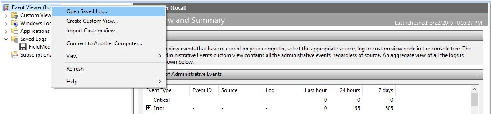

3.  导航到你的设备中的 etl 文件，然后打开该文件。
4.  单击**是**时提示您将其保存到新的日志格式。

    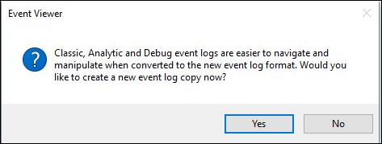

    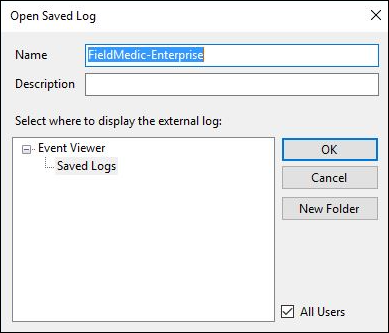

5.  新视图包含从该信道的跟踪。 从**操作**菜单上，单击**筛选当前日志**上。

    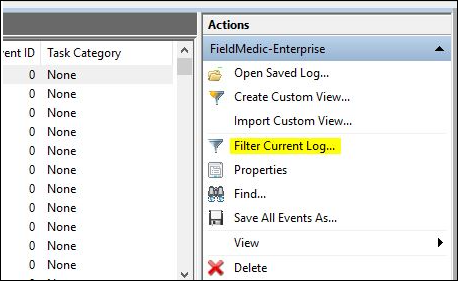

6.  通过选择**提供商 EnterpriseDiagnostics DeviceManagement**将筛选器添加到事件源，然后单击**确定**。

    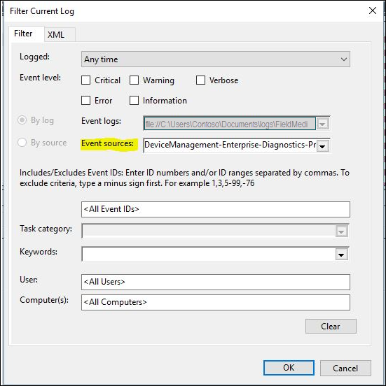

7.  现在，您就开始检查日志了。

    

## <a name="collect-device-state-data"></a>收集设备状态数据

下面是如何收集当前 MDM 设备状态数据使用了[DiagnosticLog 的 CSP](diagnosticlog-csp.md)，版本 1.3，Windows 10，1607年版本中添加了示例。 您可以从设备使用相同的文件下载节点在 CSP 中的 etl 文件收集文件。

``` syntax
<?xml version="1.0"?>
<SyncML xmlns="SYNCML:SYNCML1.2">
  <SyncBody>
    <Exec>
      <CmdID>2</CmdID>
      <Item>
        <Target>
          <LocURI>./Vendor/MSFT/DiagnosticLog/DeviceStateData/MdmConfiguration</LocURI>
        </Target>
        <Meta>
           <Format xmlns="syncml:metinf">chr</Format>
        </Meta>
        <Data>SNAP</Data>
      </Item>
    </Exec>
    <Final/>
  </SyncBody>
</SyncML>
```

 


