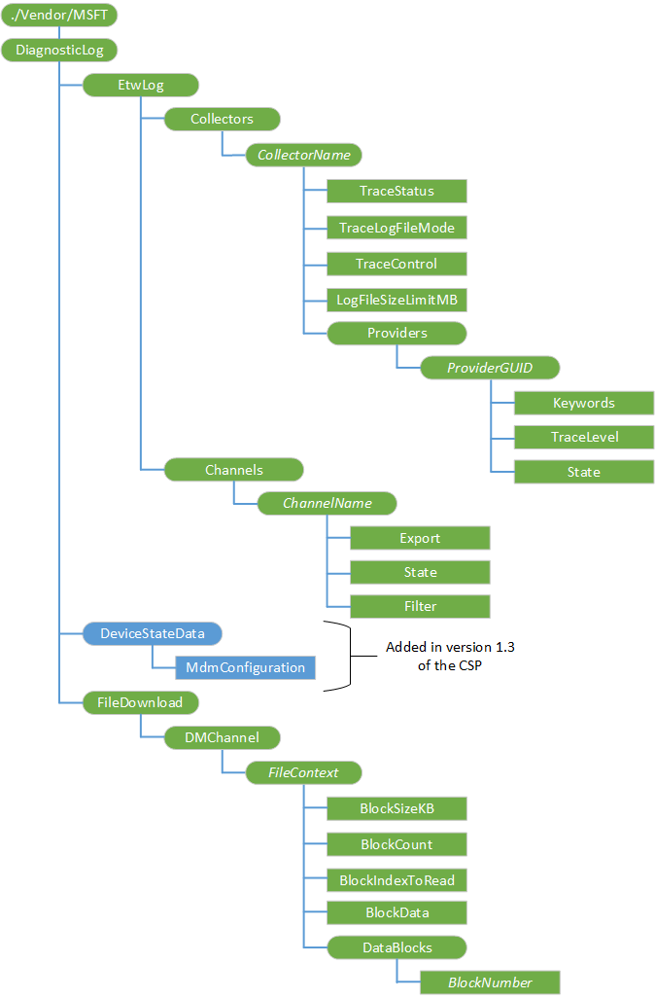

# <a name="diagnosticlog-csp"></a>DiagnosticLog 的 CSP


使用 DiagnosticLog 配置服务提供程序 (CSP) 生成和收集诊断信息，从设备︰ 跟踪 Windows 事件 (ETW) 日志文件和当前的 MDM 配置设备的状态。

DiagnosticLog 的 CSP 支持以下类型的事件跟踪︰

-   收集器基于跟踪
-   基于通道的跟踪

### <a name="collector-based-tracing"></a>收集器基于跟踪

同时，这种类型的事件跟踪注册 ETW 提供程序的集合中收集事件数据。

事件收集器是注册 ETW 提供程序的容器。 用户可以添加或删除一个收集器节点和注册或取消注册此收集器中的多个提供程序。

***CollectorName***在 CSP 中必须唯一，不能有效事件通道名称或提供程序的 GUID。

DiagnosticLog CSP 维护每个收集器节点的日志文件和日志文件中的内容将被覆盖，如果 start 命令相同的收集器节点上再次触发。

对于每个收集器节点，用户可以︰

-   启动或停止所有已注册并已启用提供程序的会话
-   查询会话状态
-   更改跟踪日志文件模式
-   更改跟踪日志文件大小限制

配置日志文件模式，日志文件大小限制在跟踪会话正在进行时不会生效。 这些适用时用户停止当前会话，然后在该收集器再重新启动它。

每个已注册提供程序在此收集器中，用户可以︰

-   指定要筛选事件来自该提供商的关键字
-   筛选事件的跟踪级别更改来自该提供商
-   启用或禁用跟踪会话中的提供程序

在**状态**、**关键字**和**TraceLevel**上所做的更改跟踪会话正在运行时，立即生效。

> **请注意** Microsoft 的 WindowsPhone-企业-诊断程序的提供程序 (GUID-3da494e4-0fe2-415C-b895-fb5265c5c83b) 具有内置于 Windows 操作系统，这将允许日志文件在远程计算机上已解码的需要的调试资源文件。 任何其他的日志可能不具备进行解码所需的调试资源。

 

### <a name="channel-based-tracing"></a>基于通道的跟踪

事件跟踪的类型导出特定频道从事件数据。 在桌面上才支持此选项。

用户可以添加或删除通道节点使用完整的名称，如 Microsoft Windows-AppModel-运行时/管理。

DiagnosticLog CSP 维护通道的每个节点的日志文件和日志文件中的内容将被覆盖，如果同一通道节点上再次触发启动命令。

对于每个通道节点，用户可以︰

-   将通道事件数据导出到日志文件 (.evtx)
-   启用或禁用事件日志服务，以允许或禁止通道中要写入的事件数据中的通道
-   在导出通道事件数据时指定 XPath 查询筛选事件

有关使用 DiagnosticLog 从 PC 或移动设备远程收集日志的详细信息，请参阅[Windows 10 的 MDM 诊断失败](diagnose-mdm-failures-in-windows-10.md)。

以下是 Ddf 的链接︰

-   [DiagnosticLog CSP 1.2 版](diagnosticlog-ddf.md#version-1-2)
-   [DiagnosticLog CSP 1.3 版](diagnosticlog-ddf.md#version-1-3)

下面的关系图以树格式显示 DiagnosticLog 配置服务提供程序。



<a href="" id="--vendor-msft-diagnosticlog"></a>**./Vendor/MSFT/DiagnosticLog**  
DiagnosticLog 配置服务提供程序的根节点。

以下步骤描述的过程来收集诊断使用该 CSP。

1.  指定目标 ETW 提供程序的容器*CollectorName* 。
2.  （可选）将日志记录设置和日志文件参数，使用以下选项︰

    -   **TraceLogFileMode**
    -   **LogFileSizeLimitMB**

    每个按照本主题后面介绍。

3.  指示一个或多个目标 ETW 提供程序提供的 EtwLog/收集器添加操作其***ProviderGUID/CollectorName*/Providers/*ProviderGUID*。
4.  （可选）将日志记录设置和日志文件参数，使用以下选项︰

    -   **TraceLevel**
    -   **关键词**

    每个按照本主题后面介绍。

5.  开始记录使用**TraceControl**执行命令"开始"
6.  将日志文件中生成活动目标设备上执行操作。
7.  停止记录日志使用**TraceControl**执行命令"停止"
8.  收集在位于日志文件`%temp%`文件夹使用[读取日志文件](#reading-a-log-file)中描述的方法

<a href="" id="etwlog"></a>**EtwLog**  
节点包含该错误的窗口跟踪日志。

受支持的操作是获得。

<a href="" id="etwlog-collectors"></a>**EtwLog/收集器**  
要为活动提供程序包含动态子内部节点的内部节点。

受支持的操作是获得。

<a href="" id="etwlog-collectors-collectorname"></a>**EtwLog/收集器 / ***_CollectorName_**  
动态节点来表示活动收集器配置。

受支持的操作，添加，删除，并获得。

添加收集器

``` syntax
<?xml version="1.0"?>
<SyncML xmlns="SYNCML:SYNCML1.2">
    <SyncBody>
        <Add>
            <CmdID>1</CmdID>
            <Item>
                <Target>
                    <LocURI>./Vendor/MSFT/DiagnosticLog/EtwLog/Collectors/DeviceManagement</LocURI>
                </Target>
                <Meta>
                    <Format xmlns="syncml:metinf">node</Format>
                </Meta>
            </Item>
        </Add>
        <Final/>
    </SyncBody>
</SyncML>
```

删除一个收集器

``` syntax
<?xml version="1.0"?>
<SyncML xmlns="SYNCML:SYNCML1.2">
    <SyncBody>
        <Delete>
            <CmdID>1</CmdID>
            <Item>
                <Target>
                    <LocURI>./Vendor/MSFT/DiagnosticLog/EtwLog/Collectors/DeviceManagement</LocURI>
                </Target>
            </Item>
        </Delete>
        <Final/>
    </SyncBody>
</SyncML>
```

<a href="" id="etwlog-collectors-collectorname-tracestatus"></a>* *EtwLog/收集器/*CollectorName*/TraceStatus**  
指定当前日志记录状态是否正在运行。

数据类型是一个整数。

受支持的操作是获得。

下表显示了可能的值︰

| 值 | 说明 |
|-------|-------------|
| 0     | 已停止     |
| 1     | 启动     |

 

<a href="" id="etwlog-collectors-collectorname-tracelogfilemode"></a>* *EtwLog/收集器/*CollectorName*/TraceLogFileMode**  
指定日志文件日志记录模式。

数据类型是一个整数。

支持的操作包括获取和替换。

下表列出可能的值︰

<table>
<colgroup>
<col width="50%" />
<col width="50%" />
</colgroup>
<thead>
<tr class="header">
<th>值</th>
<th>说明</th>
</tr>
</thead>
<tbody>
<tr class="odd">
<td><p>EVENT_TRACE_FILE_MODE_SEQUENTIAL (0X00000001)</p></td>
<td><p>将事件写入到日志文件按顺序;当该文件达到最大值时停止。</p></td>
</tr>
<tr class="even">
<td><p>EVENT_TRACE_FILE_MODE_CIRCULAR (0X00000002)</p></td>
<td><p>将事件写入到日志文件。 该文件达到最大值后，最早的事件都替换传入的事件。</p></td>
</tr>
</tbody>
</table>

 

<a href="" id="etwlog-collectors-collectorname-tracecontrol"></a>* *EtwLog/收集器/*CollectorName*/TraceControl**  
指定的日志记录和报告操作状态。

数据类型是一个字符串。

下表列出可能的值︰

| 值 | 说明        |
|-------|--------------------|
| 启动 | 启动日志跟踪。 |
| 停止  | 停止日志跟踪   |

 

受支持的操作被执行。

添加日志记录任务后，您可以通过运行在此节点的值开始执行命令启动跟踪。

若要停止跟踪，运行值停止该节点上执行命令。

启动收集器跟踪日志记录

``` syntax
<?xml version="1.0"?>
<SyncML xmlns="SYNCML:SYNCML1.2">
    <SyncBody>
        <Exec>
            <CmdID>2</CmdID>
            <Item>
                <Target>
                    <LocURI>./Vendor/MSFT/DiagnosticLog/EtwLog/Collectors/DeviceManagement/TraceControl</LocURI>
                </Target>
                <Meta>
                    <Format xmlns="syncml:metinf">chr</Format>
                </Meta>
                <Data>START</Data>
            </Item>
        </Exec>
        <Final/>
    </SyncBody>
</SyncML>
```

停止收集器跟踪日志记录

``` syntax
<?xml version="1.0"?>
<SyncML xmlns="SYNCML:SYNCML1.2">
    <SyncBody>
        <Exec>
            <CmdID>2</CmdID>
            <Item>
                <Target>
                    <LocURI>./Vendor/MSFT/DiagnosticLog/EtwLog/Collectors/DeviceManagement/TraceControl</LocURI>
                </Target>
                <Meta>
                    <Format xmlns="syncml:metinf">chr</Format>
                </Meta>
                <Data>STOP</Data>
            </Item>
        </Exec>
        <Final/>
    </SyncBody>
</SyncML>
```

<a href="" id="etwlog-collectors-collectorname-logfilesizelimitmb"></a>* *EtwLog/收集器/*CollectorName*/LogFileSizeLimitMB**  
以 mb 为单位设置日志文件的大小限制。

数据类型是一个整数。

有效值为 1 2048年。 默认值为 4。

支持的操作包括获取和替换。

<a href="" id="etwlog-collectors-collectorname-providers"></a>* *EtwLog/收集器/*CollectorName*/Providers**  
要为活动提供程序包含动态子内部节点的内部节点。

受支持的操作是获得。

<a href="" id="etwlog-collectors-collectorname-providers-providerguid"></a>* *EtwLog/收集器/*CollectorName*/供应商 / ***_ProviderGUID_**  
动态节点来表示每个提供程序 GUID 的活动提供程序配置。

> **请注意** Microsoft 的 WindowsPhone-企业-诊断程序的提供程序 (GUID-3da494e4-0fe2-415C-b895-fb5265c5c83b) 具有内置于 Windows 操作系统，这将允许日志文件在远程计算机上已解码的需要的调试资源文件。 任何其他的日志可能不具备进行解码所需的调试资源。

 

受支持的操作，添加，删除，并获得。

添加提供程序

``` syntax
<?xml version="1.0"?>
<SyncML xmlns="SYNCML:SYNCML1.2">
    <SyncBody>
        <Add>
            <CmdID>1</CmdID>
            <Item>
                <Target>
                    <LocURI>./Vendor/MSFT/DiagnosticLog/EtwLog/Collectors/DeviceManagement/Providers/3da494e4-0fe2-415C-b895-fb5265c5c83b</LocURI>
                </Target>
                <Meta>
                    <Format xmlns="syncml:metinf">node</Format>
                </Meta>
            </Item>
        </Add>
        <Final/>
    </SyncBody>
</SyncML>
```

删除提供程序

``` syntax
<?xml version="1.0"?>
<SyncML xmlns="SYNCML:SYNCML1.2">
    <SyncBody>
        <Delete>
            <CmdID>1</CmdID>
            <Item>
                <Target>
                    <LocURI>./Vendor/MSFT/DiagnosticLog/EtwLog/Collectors/DeviceManagement/Providers/3da494e4-0fe2-415C-b895-fb5265c5c83b</LocURI>
                </Target>
            </Item>
        </Delete>
        <Final/>
    </SyncBody>
</SyncML>
```

<a href="" id="etwlog-collectors-collectorname-providers-provderguid-tracelevel"></a>**EtwLog/收集器/*CollectorName*/Providers/*ProvderGUID*/TraceLevel**  
指定包括在跟踪日志的详细级别。

数据类型是一个整数。

支持的操作包括获取和替换。

下表列出可能的值。

<table>
<colgroup>
<col width="50%" />
<col width="50%" />
</colgroup>
<thead>
<tr class="header">
<th>值</th>
<th>说明</th>
</tr>
</thead>
<tbody>
<tr class="odd">
<td><p>1-TRACE_LEVEL_CRITICAL</p></td>
<td><p>异常退出或终止事件</p></td>
</tr>
<tr class="even">
<td><p>2--TRACE_LEVEL_ERROR</p></td>
<td><p>严重错误事件</p></td>
</tr>
<tr class="odd">
<td><p>3--TRACE_LEVEL_WARNING</p></td>
<td><p>例如，分配失败的警告事件</p></td>
</tr>
<tr class="even">
<td><p>4-TRACE_LEVEL_INFORMATION</p></td>
<td><p>非错误事件，如进入或退出事件</p></td>
</tr>
<tr class="odd">
<td><p>5-TRACE_LEVEL_VERBOSE</p></td>
<td><p>详细的信息</p></td>
</tr>
</tbody>
</table>

 

设置提供程序**TraceLevel**

``` syntax
<?xml version="1.0"?>
<SyncML xmlns="SYNCML:SYNCML1.2">
    <SyncBody>
        <Replace>
            <CmdID>2</CmdID>
            <Item>
                <Target>
                    <LocURI>./Vendor/MSFT/DiagnosticLog/EtwLog/Collectors/DeviceManagement/Providers/3da494e4-0fe2-415C-b895-fb5265c5c83b/TraceLevel</LocURI>
                </Target>
                <Meta>
                    <Format xmlns="syncml:metinf">int</Format>
                </Meta>
                <Data>1</Data>
            </Item>
        </Replace>
        <Final/>
    </SyncBody>
</SyncML>
```

<a href="" id="etwlog-collectors-collectorname-providers-provderguid-keywords"></a>**EtwLog/收集器/*CollectorName*/Providers/*ProvderGUID*/Keywords**  
指定要用作此提供商 MatchAnyKeyword 的提供程序关键字。

数据类型是一个字符串。

支持的操作包括获取和替换。

默认值为 0 不表示任何关键字。

获取提供程序**关键字**

``` syntax
<SyncML xmlns="SYNCML:SYNCML1.2">
  <SyncBody>
    <Get>
      <CmdID>1</CmdID>
      <Item>
        <Target>
          <LocURI>
            ./Vendor/MSFT/DiagnosticLog/EtwLog/Collectors/DeviceManagement/Providers/3da494e4-0fe2-415C-b895-fb5265c5c83b/Keywords
          </LocURI>
        </Target>
      </Item>
    </Get>
    <Final/> 
  </SyncBody>
</SyncML>
```

设置提供程序**关键字**

``` syntax
<SyncML xmlns="SYNCML:SYNCML1.2">
  <SyncBody>
    <Replace>
      <CmdID>4</CmdID>
      <Item>
        <Target>
          <LocURI>
            ./Vendor/MSFT/DiagnosticLog/EtwLog/Collectors/DeviceManagement/Providers/3da494e4-0fe2-415C-b895-fb5265c5c83b/Keywords
          </LocURI>
        </Target>
        <Meta>
          <Format xmlns="syncml:metinf">chr</Format>
          <Type>text/plain</Type>
        </Meta>
        <Data>12345678FFFFFFFF</Data>
      </Item>
    </Replace>
    <Final/> 
  </SyncBody>
</SyncML>
```

<a href="" id="etwlog-collectors-collectorname-providers-provderguid-state"></a>**EtwLog/收集器/*CollectorName*/Providers/*ProvderGUID*/State**  
指定此提供程序是否在跟踪会话中启用。

数据类型是一个布尔值。

支持的操作包括获取和替换。 活动跟踪会话期间，此更改将会生效。

下表列出可能的值。 默认值为 TRUE。

<table>
<colgroup>
<col width="50%" />
<col width="50%" />
</colgroup>
<thead>
<tr class="header">
<th>值</th>
<th>说明</th>
</tr>
</thead>
<tbody>
<tr class="odd">
<td><p>TRUE</p></td>
<td><p>在跟踪会话中启用提供程序。</p></td>
</tr>
<tr class="even">
<td><p>FALSE</p></td>
<td><p>提供程序在跟踪会话中的禁用。</p></td>
</tr>
</tbody>
</table>

 

设置提供程序**状态**

``` syntax
<?xml version="1.0"?>
<SyncML xmlns="SYNCML:SYNCML1.2">
    <SyncBody>
        <Replace>
            <CmdID>2</CmdID>
            <Item>
                <Target>
                    <LocURI>./Vendor/MSFT/DiagnosticLog/EtwLog/Collectors/DeviceManagement/Providers/3da494e4-0fe2-415C-b895-fb5265c5c83b/State</LocURI>
                </Target>
                <Meta>
                    <Format xmlns="syncml:metinf">bool</Format>
                </Meta>
                <Data>false</Data>
            </Item>
        </Replace>
        <Final/>
    </SyncBody>
</SyncML>
```

<a href="" id="etwlog-channels"></a>**EtwLog/渠道**  
包含有关注册信道的动态子内部节点的内部节点。

受支持的操作是获得。

<a href="" id="etwlog-channels-channelname"></a>**EtwLog/通道 / ***_ChannelName_**  
动态节点来表示注册的信道。 节点名称必须是有效的 Windows 事件日志通道名称，如"Microsoft 客户端的许可证的平台 %2fadmin"

受支持的操作，添加，删除，并获得。

添加频道

``` syntax
<?xml version="1.0"?>
<SyncML xmlns="SYNCML:SYNCML1.2">
    <SyncBody>
        <Add>
            <CmdID>1</CmdID>
            <Item>
                <Target>
                    <LocURI>./Vendor/MSFT/DiagnosticLog/EtwLog/Channels/Microsoft-Client-Licensing-Platform%2FAdmin</LocURI>
                </Target>
                <Meta>
                    <Format xmlns="syncml:metinf">node</Format>
                </Meta>
            </Item>
        </Add>
        <Final/>
    </SyncBody>
</SyncML>
```

删除通道

``` syntax
<?xml version="1.0"?>
<SyncML xmlns="SYNCML:SYNCML1.2">
    <SyncBody>
        <Delete>
            <CmdID>1</CmdID>
            <Item>
                <Target>
                    <LocURI>./Vendor/MSFT/DiagnosticLog/EtwLog/Channels/Microsoft-Client-Licensing-Platform%2FAdmin</LocURI>
                </Target>
            </Item>
        </Delete>
        <Final/>
    </SyncBody>
</SyncML>
```

<a href="" id="etwlog-channels-channelname-export"></a>* *EtwLog/通道/*ChannelName*/Export**  
触发通道事件数据输出到日志文件的命令的节点。

受支持的操作被执行。

导出通道事件数据

``` syntax
<?xml version="1.0"?>
<SyncML xmlns="SYNCML:SYNCML1.2">
    <SyncBody>
        <Exec>
            <CmdID>2</CmdID>
            <Item>
                <Target>
                    <LocURI>./Vendor/MSFT/DiagnosticLog/EtwLog/Channels/Microsoft-Client-Licensing-Platform%2FAdmin/Export</LocURI>
                </Target>
            </Item>
        </Exec>
        <Final/>
    </SyncBody>
</SyncML>
```

<a href="" id="etwlog-channels-channelname-filter"></a>* *EtwLog/通道/*ChannelName*/Filter**  
指定要筛选事件，在导出时的 XPath 查询字符串。

数据类型是一个字符串。

支持的操作包括获取和替换。

默认值为空字符串。

获取通道**筛选器**

``` syntax
<?xml version="1.0"?>
<SyncML xmlns="SYNCML:SYNCML1.2">
    <SyncBody>
        <Get>
            <CmdID>1</CmdID>
            <Item>
                <Target>
                    <LocURI>./Vendor/MSFT/DiagnosticLog/EtwLog/Channels/Microsoft-Client-Licensing-Platform%2FAdmin/Filter</LocURI>
                </Target>
            </Item>
        </Get>
        <Final/>
    </SyncBody>
</SyncML>
```

<a href="" id="etwlog-channels-channelname-state"></a>* *EtwLog/通道/*ChannelName*/State**  
指定是启用还是禁用通道。

数据类型是一个布尔值。

支持的操作包括获取和替换。

下表列出可能的值。

<table>
<colgroup>
<col width="50%" />
<col width="50%" />
</colgroup>
<thead>
<tr class="header">
<th>值</th>
<th>说明</th>
</tr>
</thead>
<tbody>
<tr class="odd">
<td><p>TRUE</p></td>
<td><p>通道处于启用状态。</p></td>
</tr>
<tr class="even">
<td><p>FALSE</p></td>
<td><p>通道将被禁用。</p></td>
</tr>
</tbody>
</table>

 

获取通道**状态**

``` syntax
<?xml version="1.0"?>
<SyncML xmlns="SYNCML:SYNCML1.2">
    <SyncBody>
        <Get>
            <CmdID>1</CmdID>
            <Item>
                <Target>
                    <LocURI>./Vendor/MSFT/DiagnosticLog/EtwLog/Channels/Microsoft-Client-Licensing-Platform%2FAdmin/State</LocURI>
                </Target>
            </Item>
        </Get>
        <Final/>
    </SyncBody>
</SyncML>
```

设置通道**状态**

``` syntax
<?xml version="1.0"?>
<SyncML xmlns="SYNCML:SYNCML1.2">
    <SyncBody>
        <Replace>
            <CmdID>2</CmdID>
            <Item>
                <Target>
                    <LocURI>./Vendor/MSFT/DiagnosticLog/EtwLog/Channels/Microsoft-Client-Licensing-Platform%2FAdmin/State</LocURI>
                </Target>
                <Meta>
                    <Format xmlns="syncml:metinf">bool</Format>
                </Meta>
                <Data>false</Data>
            </Item>
        </Replace>
        <Final/>
    </SyncBody>
</SyncML>
```

<a href="" id="devicestatedata"></a>**DeviceStateData**  
添加在 1.3 版中 Windows 10，1607年版本中的 csp。 设备状态数据公开的所有类型的节点。

<a href="" id="devicestatedata-mdmconfiguration"></a>**DeviceStateData/MdmConfiguration**  
添加在 1.3 版中 Windows 10，1607年版本中的 csp。 触发设备管理状态的数据对齐的管理单元。

受支持的值是执行。

``` syntax
<?xml version="1.0"?>
<SyncML xmlns="SYNCML:SYNCML1.2">
  <SyncBody>
    <Exec>
      <CmdID>2</CmdID>
      <Item>
        <Target>
          <LocURI>./Vendor/MSFT/DiagnosticLog/DeviceStateData/MdmConfiguration</LocURI>
        </Target>
        <Meta>
           <Format xmlns="syncml:metinf">chr</Format>
        </Meta>
        <Data>SNAP</Data>
      </Item>
    </Exec>
    <Final/>
  </SyncBody>
</SyncML>
```

<a href="" id="filedownload"></a>**文件下载**  
节点包含子节点的日志文件运输协议和相应的操作。

<a href="" id="filedownload-dmchannel"></a>**文件下载/DMChannel**  
节点包含子节点上使用 DM 信道的传输协议。

<a href="" id="filedownload-dmchannel-filecontext"></a>**文件下载/DMChannel / ***_FileContext_**  
动态的内部节点，表示每个日志文件上下文。

<a href="" id="filedownload-dmchannel-filecontext-blocksizekb"></a>**文件下载/DMChannel/*FileContext*/BlockSizeKB**  
设置日志读取缓冲区，以 kb 为单位。

数据类型是一个整数。

有效值为 1-16。 默认值为 4。

支持的操作包括获取和替换。

设置**BlockSizeKB**

``` syntax
<?xml version="1.0"?>
<SyncML xmlns="SYNCML:SYNCML1.2">
    <SyncBody>
        <Replace>
            <CmdID>1</CmdID>
            <Item>
                <Target>
                    <LocURI>./Vendor/MSFT/DiagnosticLog/FileDownload/DMChannel/DeviceManagement/BlockSizeKB</LocURI>
                </Target>
                <Meta>
                    <Format xmlns="syncml:metinf">int</Format>
                </Meta>
                <Data>1</Data>
            </Item>
        </Replace>
        <Final/>
    </SyncBody>
</SyncML>
```

获得**BlockSizeKB**

``` syntax
<?xml version="1.0"?>
<SyncML xmlns="SYNCML:SYNCML1.2">
    <SyncBody>
        <Get>
            <CmdID>1</CmdID>
            <Item>
                <Target>
                    <LocURI>./Vendor/MSFT/DiagnosticLog/FileDownload/DMChannel/DeviceManagement/BlockSizeKB</LocURI>
                </Target>
            </Item>
        </Get>
        <Final/>
    </SyncBody>
</SyncML>
```

<a href="" id="filedownload-dmchannel-filecontext-blockcount"></a>**文件下载/DMChannel/*FileContext*/BlockCount**  
代表日志文件的总读取的块计数。

数据类型是一个整数。

唯一受支持的操作是获得。

获得**BlockCount**

``` syntax
<?xml version="1.0"?>
<SyncML xmlns="SYNCML:SYNCML1.2">
    <SyncBody>
        <Get>
            <CmdID>1</CmdID>
            <Item>
                <Target>
                    <LocURI>./Vendor/MSFT/DiagnosticLog/FileDownload/DMChannel/DeviceManagement/BlockCount</LocURI>
                </Target>
            </Item>
        </Get>
        <Final/>
    </SyncBody>
</SyncML>
```

<a href="" id="filedownload-dmchannel-filecontext-blockindextoread"></a>**文件下载/DMChannel/*FileContext*/BlockIndexToRead**  
表示读取的块的开始位置。

数据类型是一个整数。

支持的操作包括获取和替换。

将**BlockIndexToRead**设置为 0

``` syntax
<?xml version="1.0"?>
<SyncML xmlns="SYNCML:SYNCML1.2">
    <SyncBody>
        <Replace>
            <CmdID>1</CmdID>
            <Item>
                <Target>
                    <LocURI>./Vendor/MSFT/DiagnosticLog/FileDownload/DMChannel/DeviceManagement/BlockIndexToRead</LocURI>
                </Target>
                <Meta>
                    <Format xmlns="syncml:metinf">int</Format>
                </Meta>
                <Data>0</Data>
            </Item>
        </Replace>
        <Final/>
    </SyncBody>
</SyncML>
```

将**BlockIndexToRead**设置为 1

``` syntax
<?xml version="1.0"?>
<SyncML xmlns="SYNCML:SYNCML1.2">
    <SyncBody>
        <Replace>
            <CmdID>1</CmdID>
            <Item>
                <Target>
                    <LocURI>./Vendor/MSFT/DiagnosticLog/FileDownload/DMChannel/DeviceManagement/BlockIndexToRead</LocURI>
                </Target>
                <Meta>
                    <Format xmlns="syncml:metinf">int</Format>
                </Meta>
                <Data>1</Data>
            </Item>
        </Replace>
        <Final/>
    </SyncBody>
</SyncML>
```

<a href="" id="filedownload-dmchannel-filecontext-blockdata"></a>**文件下载/DMChannel/*FileContext*/BlockData**  
数据类型是 Base64。

唯一受支持的操作是获得。

获得**BlockData**

``` syntax
<?xml version="1.0"?>
<SyncML xmlns="SYNCML:SYNCML1.2">
    <SyncBody>
        <Get>
            <CmdID>1</CmdID>
            <Item>
                <Target>
                    <LocURI>./Vendor/MSFT/DiagnosticLog/FileDownload/DMChannel/DeviceManagement/BlockData</LocURI>
                </Target>
            </Item>
        </Get>
        <Final/>
    </SyncBody>
</SyncML>
```

<a href="" id="filedownload-dmchannel-filecontext-datablocks"></a>**文件下载/DMChannel/*FileContext*/DataBlocks**  
若要将选定的日志文件块传输到 DM 服务器的节点。

<a href="" id="filedownload-dmchannel-filecontext-datablocks-blocknumber"></a>**文件下载/DMChannel/*FileContext*/DataBlocks / ***_BlockNumber_**  
数据类型是 Base64。

唯一受支持的操作是获得。

## <a name="reading-a-log-file"></a>正在读取日志文件


1.  枚举在**./Vendor/MSFT/DiagnosticLog/FileDownload/DMChannel**日志文件
2.  在枚举结果中选择日志文件
3.  每个 DM 服务器负载限制设置**BlockSizeKB**
4.  获得**BlockCount**来确定总的读取的请求
5.  设置**BlockIndexToRead**初始化读取的起始点
6.  获取上载日志块**BlockData**
7.  增加**BlockIndexToRead**
8.  重复步骤 5 到步骤 7，直到**BlockIndexToRead (BlockIndexToRead-1) = =**

 

 


