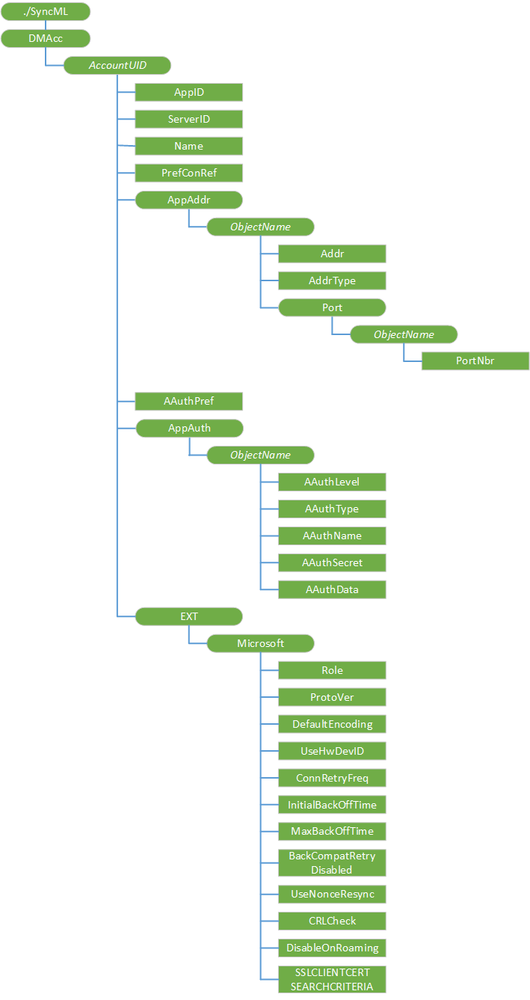

# <a name="dmacc-csp"></a>DMAcc 的 CSP


DMAcc 配置服务提供程序允许 OMA 设备管理 (DM) 1.2 版服务器来处理 OMA DM 帐户对象。 若要添加新的帐户或管理现有的帐户，包括被引导使用[w7 应用程序配置服务提供商](w7-application-csp.md)的帐户，服务器可以使用该配置服务提供程序

> **请注意** 此配置服务提供商要求使用 ID\_CAP\_CSP\_基础和 ID\_CAP\_设备\_管理\_管理功能从网络配置应用程序进行访问。

 

对于 DMAcc 的 CSP，不能使用替换命令，除非该节点已存在。

下图显示了 DMAcc 配置服务提供程序管理对象以树格式由 OMA 设备管理 1.2 版。 OMA 客户端资源调配协议不支持此配置服务提供程序。



<a href="" id="dmacc"></a>**DMAcc**  
必需。 定义使用 OMA DM 1.2 版协议的所有 OMA DM 服务器帐户的根节点。

<a href="" id="accountuid"></a>***AccountUID***  
可选项。 定义使用 OMA DM 1.2 版协议的 OMA DM 服务器帐户的唯一标识符。

引导[w7 应用程序配置服务提供商](w7-application-csp.md)帐户，此元素是由 OMA DM 客户端分配一个唯一的名称。 唯一的名称是的十六进制表示形式的 256 位 sha-2 哈希的提供商 id。 OMA DM 服务器可以在后续的 OMA DM 会话中更改此节点名称。

<a href="" id="accountuid-appid"></a>***AccountUID*/AppID**  
必需。 指定应用程序标识符的 OMA DM 帐户。

此值必须设置为"w7"。

值类型是字符串。 支持的操作是添加，获取，并更换。

<a href="" id="accountuid-serverid"></a>***AccountUID*/ServerID**  
必需。 指定为当前的 OMA DM 帐户 OMA DM 服务器的唯一标识符。 此值是区分大小写。

值类型是字符串。 支持的操作是添加，获取，并更换。

<a href="" id="accountuid-name"></a>***AccountUID*/Name**  
可选项。 指定应用程序的显示名称。

值类型是字符串。 支持的操作是添加，获取，并更换。

<a href="" id="accountuid-prefconref"></a>***AccountUID*/PrefConRef**  
可选项。 指定首选的 OMA DM 帐户连接。

此元素包含对 NAP 管理对象的 URI 或连接连接管理器使用的 GUID。 如果缺少此元素，则该设备将使用的默认连接，通过连接管理器提供。

值类型是字符串。 支持的操作是添加，获取，并更换。

<a href="" id="accountuid-appaddr"></a>***AccountUID*/AppAddr**  
DM 服务器地址的内部节点。

必需。

<a href="" id="appaddr-objectname"></a>**AppAddr / ***_对象名称_**  
必需。 定义的 OMA DM 服务器地址。 可以配置一个服务器地址。

当 DMAcc 配置服务提供程序映射[w7 应用程序配置服务提供程序](w7-application-csp.md)，此元素的名称为"1"。 这是在 w7 应用程序配置服务提供程序中遇到的第一个 DM 地址，DM 的其他帐户都将被忽略。

<a href="" id="objectname-addr"></a>***对象名称*/Addr**  
必需。 指定的 OMA DM 帐户的地址。 AddrType 元素指定的存储地址的类型。

值类型是字符串。 支持的操作是添加，获取，并更换。

<a href="" id="objectname-addrtype"></a>***对象名称*/AddrType**  
必需。 指定的格式和地址的节点值的解释。 默认值为"URI"。

"URI"的默认值指定**地址**中的 OMA DM 帐户地址 URI 地址。 "IPv4"值指定**地址**中的 OMA DM 帐户地址是 IP 地址。

值类型是字符串。 支持的操作是添加，获取，并更换。

<a href="" id="objectname-port"></a>***对象名称*/Port**  
有关端口的信息的内部节点。

可选项。

<a href="" id="port-objectname"></a>**端口 / ***_对象名称_**  
必需。 可以配置一个端口号。

当 DMAcc 配置服务提供程序映射[w7 应用程序配置服务提供程序](w7-application-csp.md)，此元素的名称为"1"。

<a href="" id="objectname-portnbr"></a>***对象名称*/PortNbr**  
必需。 指定 OMA MD 客户地址的端口号。 这必须是十进制数范围内的 16 位无符号整数的范围。

值类型是字符串。 支持的操作是添加，获取，并更换。

<a href="" id="accountuid-aauthpref"></a>***AccountUID*/AAuthPref**  
可选项。 指定应用程序身份验证首选项。

值为"基本"指定客户端尝试基本身份验证。 值为"摘要指定客户端尝试 MD5 验证。

如果此值为空时，客户端将尝试使用协商在前一个会话中，如果存在的身份验证机制。 如果的值为空，没有以前的会话存在，MD5 凭据存在，客户端首先尝试 MD5 授权。 如果客户端首次尝试基本授权则不满足的条件。

值类型是字符串。 支持的操作是添加，获取，并更换。

<a href="" id="accountuid-appauth"></a>***AccountUID*/AppAuth**  
可选项。 定义身份验证设置。

<a href="" id="appauth-objectname"></a>**AppAuth / ***_对象名称_**  
必需。 定义一组身份验证设置。

当 DMAcc 配置服务提供程序映射[w7 应用程序配置服务提供程序](w7-application-csp.md)，此元素的名称是相同的 AAuthLevel 值 （"CLRED"或"SRVCRED"） 的名称。

<a href="" id="objectname-aauthlevel"></a>***对象名称*/AAuthlevel**  
必需。 指定应用程序的身份验证级别。

"CLCRED"表示凭据的客户端将验证自身身份到 OMA DM 协议级的 OMA DM 服务器。 "SRVCRED"表示凭据服务器将验证自身身份到 OMA DM OMA DM 协议级别的客户端。

值类型是字符串。 支持的操作包括添加和替换。

<a href="" id="objectname-aauthtype"></a>***对象名称*/AAuthType**  
必需。 指定的身份验证类型。

如果 AAuthlevel 是"CLCRED"，受支持的值是"基本"和"摘要"。 如果 AAuthlevel 是"SRVCRED"，受支持的值是"摘要"。

值类型是字符串。 支持的操作是添加，获取，并更换。

<a href="" id="objectname-aauthname"></a>***对象名称*/AAuthName**  
可选项。 指定的身份验证名称。

值类型是字符串。 支持的操作是添加，获取，并更换。

<a href="" id="objectname-aauthsecret"></a>***对象名称*/AAuthSecret**  
可选项。 指定用于身份验证的密钥的密码。

值类型是字符串。 支持的操作包括添加和替换。

<a href="" id="objectname-aauthdata"></a>***对象名称*/AAuthData**  
可选项。 指定下一个 nonce 用于身份验证。

"现时"指的是使用一次的数字。 它通常是随机或伪随机号码，发出身份验证协议以确保旧的通信不能重复使用的重复攻击。

值类型是二进制的。 支持的操作包括添加和替换。

<a href="" id="accountuid-ext"></a>***AccountUID*/Ext**  
必需。 定义了一组扩展的参数。

此元素包含有关 OMA DM 帐户的供应商特定信息和 OMA DM 帐户在创建时自动创建。

<a href="" id="ext-microsoft"></a>**Ext/Microsoft**  
必需。 定义一组特定 Microsoft 扩展参数。

OMA DM 帐户创建后，将自动创建此元素。

<a href="" id="microsoft-backcompatretrydisabled"></a>**Microsoft/BackCompatRetryDisabled**  
可选项。 指定是否尝试重新发送使用较旧的协议版本 (例如，1.1) 包中 （不包括第一次） 的后续尝试 SyncHdr。 默认值为"FALSE"。

默认值为"FALSE"表示启用了向后兼容的重试次数。 值为"TRUE"指示向后兼容重试处于禁用状态。

值类型是布尔值。 支持的操作是添加，获取，并更换。

<a href="" id="microsoft-connretryfreq"></a>**Microsoft/ConnRetryFreq**  
可选项。 指定连接管理器级别或 wininet 级错误时，DM 客户端执行的重试次数。

默认值为 3。

值类型是整数。 支持的操作是添加，获取，并更换。

<a href="" id="microsoft-defaultencoding"></a>**Microsoft/DefaultEncoding**  
可选项。 指定是否 OMA DM 客户端将使用 WBXML 或 XML DM 包与服务器通信时。 默认为"application/vnd.syncml.dm+xml"。

"Application/vnd.syncml.dm+xml"的默认值指定使用 XML。 "Application/vnd.syncml.dm+wbxml"值指定使用 WBXML。

值类型是字符串。 支持的操作是添加，获取，并更换。

<a href="" id="microsoft-initialbackofftime"></a>**Microsoft/InitialBackOffTime**  
可选项。 OMA DM 客户端重试第一次时，请指定初始等待时间以毫秒为单位。 等待时间呈指数增长。

默认值为 16000。

值类型是整数。 支持的操作是添加，获取，并更换。

<a href="" id="microsoft-maxbackofftime"></a>**Microsoft/MaxBackOffTime**  
可选项。 此节点指定的最大重试连接前等待的毫秒数。

默认值为 86400000。

值类型是整数。 支持的操作是添加，获取，并更换。

<a href="" id="microsoft-protover"></a>**Microsoft/ProtoVer**  
可选项。 指定的服务器支持的 OMA DM 协议版本。 没有默认值。

有效值为"1.1"和"1.2"。 设置此元素的协议版本将匹配 DM 客户端向服务器在 SyncHdr 包 1 报告的协议版本。 如果添加一个 DM 服务器帐户时未指定此元素，则使用客户端支持的最新 DM 协议版本。 Windows 10 客户端支持 1.2 版。

值类型是字符串。 支持的操作是添加，获取，并更换。

<a href="" id="microsoft-role"></a>**Microsoft/角色**  
必需。 指定在 OMA DM 会话运行与服务器的通信时使用的角色掩码。

如果此参数不存在，DM 会话提供服务器创建的 OMA DM 会话的角色掩码。 下面的列表显示了有效的安全角色掩码和它们的值。

-   4 = SECROLE\_运算符

-   8 = SECROLE\_管理器

-   16 = SECROLE\_用户\_身份验证

-   128 = SECROLE\_运算符\_TPS

此节点的可接受的访问角色不能更多分配给 DMAcc 对象的角色。

值类型是整数。 支持的操作包括获取和替换。

<a href="" id="microsoft-usehwdevid"></a>**Microsoft/UseHWDevID**  
可选项。 指定是否使用 DM 帐户中的./DevInfo/DevID 元素的硬件 ID 来标识设备。 默认值为"FALSE"。

默认值为"FALSE"指定一个特定于应用程序的 GUID 返回./DevInfo/DevID，而不是硬件设备 id。

值为"TRUE"指定硬件设备 ID 将提供./DevInfo/DevID 的元素和 OMA DM 的源 LocURI 包，将发送到服务器。 在这种情况下︰

-   对于 GSM 手机 IMEI 返回。

-   对于 CDMA 手机，将返回 MEID。

-   对于双 sim 卡手机，此值从主数据行 UICC 检索。

值类型是布尔值。 支持的操作是添加，获取，并更换。

<a href="" id="microsoft-usenonceresync"></a>**Microsoft/UseNonceResync**  
可选项。 指定是否身份验证失败的服务器触发通知 OMA DM 客户端是否应使用 nonce 重新同步过程。 默认值为"FALSE"。

如果身份验证失败，因为服务器目前与存储在该设备的服务器现时不匹配，该设备可以作为服务器现时使用备份 nonce。 在此过程中，要想成功，如果设备未通过验证的预配置 nonce 值，服务器必须使用备份 nonce 发送签名的服务器通知消息时。

默认值为"FALSE"指定客户端不会尝试存储现时到身份验证失败时验证备份服务器现时的通知。 值为"TRUE"指定客户端启动一个 DM 会话，是否备份服务器现时收到后，身份验证失败。

值类型是布尔值。 支持的操作是添加，获取，并更换。

<a href="" id="crlcheck"></a>**CRLCheck**  
可选项。 允许连接到 DM 服务器检查证书吊销列表 (CRL)。 设置为 true 以启用 SSL 吊销。

值类型是布尔值。 支持的操作是添加，获取，并更换。

<a href="" id="disableonroaming"></a>**DisableOnRoaming**  
可选项。 确定漫游时是否应启动 OMA DM 客户端。

值类型是布尔值。 支持的操作是添加，获取，并更换。

<a href="" id="sslclientcertsearchcriteria"></a>**SSLCLIENTCERTSEARCHCRITERIA**  
可选项。 SSLCLIENTCERTSEARCHCRITERIA 参数用于指定客户端证书搜索条件。 此参数支持主题特性和证书存储区的搜索。 如果不提供任何其他条件，则它将被忽略。

该字符串是串联组成的名称/值对，对"&"字符分隔的每个成员。 名称和值由"="字符分隔。 如果有多个值，由"U + F000"Unicode 字符分隔每个值。 如果名称或值包含设置 （按指定 RFC2396） UNRESERVED 以外的字符，这些字符是 URI 转义每 RFC。

所支持的名称是主题和存储;不支持通配符证书搜索。

存储区指定 DM 客户端将搜索要查找的 SSL 客户端证书的证书存储区。 有效的存储值是我 %5cuser。 存储区名称不区分大小写。

> **注意**%EF%80 %80 是 UTF8 编码字符 U + F000。

 

主题指定要搜索的证书。 例如，若要指定所需的证书具有特定的主题属性 ("CN = 测试人员，O = Microsoft")，使用以下内容︰

``` syntax
<parm name="SSLCLIENTCERTSEARCHCRITERIA" 
   value="Subject=CN%3DTester,O%3DMicrosoft&amp;Stores=My%5CUser" />
```

值类型是字符串。 支持的操作是添加，获取，并更换。

## <a name="related-topics"></a>相关的主题


[配置服务提供程序的引用](configuration-service-provider-reference.md)

 

 


