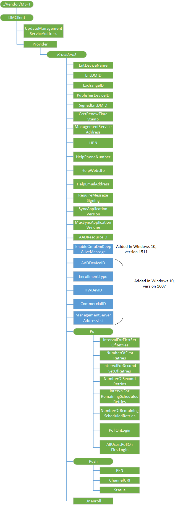

# <a name="dmclient-csp"></a>DMClient 的 CSP


DMClient 配置服务提供程序用于指定用于标识证书续订和服务器触发企业注销的设备在企业域中，安全风险减轻其他企业特定移动设备管理的配置设置。

下面的关系图以树格式显示 DMClient 配置服务提供程序。



<a href="" id="dmclient"></a>**DMClient**  
CSP 的根节点。

<a href="" id="updatemanagementserviceaddress"></a>**UpdateManagementServiceAddress**  
资源调配只包。 指定列表中的服务器 （用分号分隔）。 以分号分隔的列表中的第一个服务器是可用于实例化 MDM 会话的服务器。 该列表可以是一种排列或现有服务器列表的一个子集。 不能使用此节点向列表添加新的服务器。

<a href="" id="provider"></a>**提供程序**  
必需。 所有属于一台管理服务器的设置根节点。 作用域是永久性的。

受支持的操作是获得。

<a href="" id="provider-providerid"></a>**提供程序 / ***_ProviderID_**  
可选项。 此节点包含 URI 编码值的引导的设备管理帐户的提供商 id。 作用域是动态的。 作为最佳实践，使用不需要 XML/URI 转义的文本。

支持的操作包括获取和添加。

<a href="" id="provider-providerid-entdevicename"></a>**提供程序 /*ProviderID*/EntDeviceName**  
可选项。 包含使用 IT 管理控制台的用户友好的设备名称的字符串。 该数值将 DMClient 配置服务提供程序通过在注册过程中。 以后在 OMA DM 会话期间，您可以检索它。

支持的操作包括获取和添加。

<a href="" id="provider-providerid-entdmid"></a>**提供程序 /*ProviderID*/EntDMID**  
可选项。 字符的字符串，其中包含唯一的企业设备 id。 在注册过程中通过 DMClient 配置服务提供程序，该数值将由管理服务器。 以后在 OMA DM 会话期间，您可以检索它。

支持的操作包括获取和添加。

> **请注意**  尽管硬件设备保证 Id 都是唯一的还有一个问题，这不是最终效力 DM 会话期间。 设备 ID 无法通过 w7 应用程序配置服务提供程序的**USEHWDEVID**参数更改另一台管理服务器。 因此在企业的引导和登记，新的设备 ID 由指定企业服务器。
此节点是必需的并触发客户端证书续订之前必须由服务器设置。

 

<a href="" id="provider-providerid-exchangeid"></a>**提供程序 /*ProviderID*/ExchangeID**  
可选项。 字符包含会话正在运行时对用户的 Outlook 帐户所使用的唯一的交换设备 ID 的字符串。 这可用于企业管理服务器关联和合并 exchange 托管和本机由专门的管理服务器管理的设备的记录。

> **请注意** 在桌面的某些情况下，此节点将返回"未找到"直到用户将电子邮件设置。

 

受支持的操作是获得。

以下是 Get 命令示例。

``` syntax
<Get>
   <CmdID>12</CmdID>
   <Item>
      <Target>
         <LocURI>./Vendor/MSFT/DMClient/Provider/<ProviderID>/ExchangeID</LocURI>
      </Target>
   </Item>
</Get>
```

<a href="" id="provider-providerid-publisherdeviceid"></a>**提供程序 /*ProviderID*/PublisherDeviceID**  
（仅适用于 Windows 10 手机。）可选。 PublisherDeviceID 是唯一设备 ID 创建基于企业发布服务器 id。 基于企业应用程序的标记和企业 ID./Vendor/MSFT/EnterpriseAppManagement/ 通过创建发布者 ID&lt;企业 id&gt;/EnrollmentToken。 它是为了确保为一个企业、 每个设备具有与其关联的唯一 ID。 对于相同的设备，如果有多个企业应用程序中，每个企业被标识不同。

受支持的操作是获得。

<a href="" id="provider-providerid-signedentdmid"></a>**提供程序 /*ProviderID*/SignedEntDMID**可选。字符的字符串，其中包含设备 id。此节点和节点**CertRenewTimeStamp**可以使用移动设备管理服务器，以便更新注册记录后续订设备证书验证客户机身份。设备号**EntDMID * * 带有旧客户端证书在证书续订过程和保存本地签名。

受支持的操作是获得。

<a href="" id="provider-providerid-certrenewtimestamp"></a>**提供程序 /*ProviderID*/CertRenewTimeStamp**  
可选项。 OMA DM 标准时间格式中的时间。 此节点用于降低风险的另一个设备正在使用的证书。 该设备记录创建新证书的时间。

受支持的操作是获得。

<a href="" id="provider-providerid-managementserviceaddress"></a>**提供程序 /*ProviderID*/ManagementServiceAddress**  
必需。 设备管理服务器地址的字符串。 它可以更新在 OMA DM 会话期间由管理服务器，以使服务器负载平衡到另一台服务器的情况下，太多的设备连接到服务器。

> **请注意** 当 ManagementServerAddressList 值设置时，设备会忽略 ManagementServiceAddress 中的值。

 

DMClient 配置服务提供程序将保存到 w7 和 DMS 配置服务提供程序，以确保管理客户端有一个位置来检索当前的服务器地址的同一个位置的地址。 此节点的初始值是与自办[w7 应用程序配置服务提供程序](w7-application-csp.md)通过相同的服务器地址值。

启动 Windows 10 1511，版本中此节点的格式中支持多个服务器地址&lt;URL1&gt;&lt;URL2&gt;&lt;URL3&gt;。 如果只有单个 URL，则&lt;&gt;不是必需的。 对于桌面和移动设备支持此功能。

DM 会话期间，该设备将使用列表中的第一个地址，然后继续下去列表向下直到满足连接成功为止。 DM 客户端应为下一步的会话缓存已成功连接的服务器的 URL。

支持的操作是添加，获取，并更换。

<a href="" id="provider-providerid-upn"></a>**提供程序 /*ProviderID*/UPN**  
可选项。 允许管理服务器来更新用户的注册的用户主体名称 (UPN)。 这是非常有用的用户电子邮件地址在其中更改中的身份识别系统中，或在方案中，用户在注册过程中输入无效的 UPN 和联合注册时修复 UPN。 将录制的 UPN，用户体验将反映更新的 UPN。

支持的操作包括获取和替换。

<a href="" id="provider-providerid-helpphonenumber"></a>**提供程序 /*ProviderID*/HelpPhoneNumber**  
可选项。 允许的用户体验，包括最终用户将能够查看和使用，如果他们需要帮助或支持的自定义的帮助电话号码的字符串。

支持的操作是 Get，替换和删除。

<a href="" id="provider-providerid-helpwebsite"></a>**提供程序 /*ProviderID*/HelpWebsite**  
可选项。 允许的用户体验，包括最终用户将能够查看和使用，如果他们需要帮助或支持的自定义的帮助网站字符的字符串。

支持的操作是 Get，替换和删除

<a href="" id="provider-providerid-helpemailaddress"></a>**提供程序 /*ProviderID*/HelpEmailAddress**  
可选项。 允许的用户体验，包括最终用户将能够查看和使用，如果他们需要帮助或支持的自定义的帮助的电子邮件地址的字符串。

支持的操作是 Get，替换和删除。

<a href="" id="provider-providerid-requiremessagesigning"></a>**提供程序 /*ProviderID*/RequireMessageSigning**  
布尔值类型。 Primarly 用于 SSL 桥接模式防火墙和代理服务器的部署位置和所需设备的客户端标识所在。 当启用时，从该设备每个 SyncML 邮件将执行名为 MDM 签名附加 HTTP 标头。 此标头包含 BASE64 编码加密消息语法使用分离签名的完整 SyncML 的消息 sha-2 （包括 SyncHdr 和 SyncBody）。 作为注册过程的一部分使用已注册的管理会话证书的专用密钥进行签名。 设备公共密钥和 PKCS9 UTC 时间戳签名的签名中经过验证的属性的一部分。

其中设备管理客户端不在管理会话的 HTTP 标头中包含身份验证信息，默认值为 false。 （可选） 设置为 true，则客户端身份验证信息提供在管理会话的 HTTP 标头中的位置。

当启用，MDM 服务器应验证签名并使用该设备的时间戳识别证书登记作为 MS MDE 的一部分时，确保将证书和时间都是有效的并验证签名由 MDM 服务器受信任的。

支持的操作是 Get，替换和删除。

<a href="" id="provider-providerid-syncapplicationversion"></a>**提供程序 /*ProviderID*/SyncApplicationVersion**  
可选项。 由管理服务器设置的服务器和设备应该使用的 DM 会话版本。 默认值为 1.0。 Windows 10 中的客户端的 DM 会话协议版本为 2.0。 如果服务器更新以支持 2.0，则应将该值设置为 2.0。 在下一次会话中，检查是否存在介于 1.0 和 2.0 客户端行为更改。

> **请注意**  
在 Windows 10 及更高版本才支持此节点。

一旦将值设置到 2.0，它也不愿回到为 1.0。

 

支持的操作是 Get，替换和删除。

<a href="" id="provider-providerid-maxsyncapplicationversion"></a>**提供程序 /*ProviderID*/MaxSyncApplicationVersion**  
可选项。 由客户端用来表示它支持最新的 DM 会话版本。 默认值为 2.0。

当查询此节点时，Windows 10 客户端将返回 2.0 和 Windows 8.1 客户端将返回错误代码 （404 未找到节点）。

受支持的操作是获得。

<a href="" id="provider-providerid-aadresourceid"></a>**提供程序 /*ProviderID*/AADResourceID**  
可选项。 这是使用 Azure Active Directory 招生名额 （AAD 加入或添加的帐户） 的 OMA DM 会话请求用户令牌时资源 Id。 该标记是观众而言，可提供不同的服务主体 （与设备管理注册）。 它可以是一个应用程序 ID 或您试图访问的终结点。

Azure Active Directory 注册有关的详细信息，请参阅[使用 MDM Azure Active Directory 集成](azure-active-directory-integration-with-mdm.md)。

<a href="" id="provider-providerid-enableomadmkeepalivemessage"></a>**提供程序 /*ProviderID*/EnableOmaDmKeepAliveMessage**  
添加 Windows 10 1511年版本中。 一个布尔值，指定是否 DM 客户端应该发送请求挂起的通知中用例 DM 请求的设备响应速度太慢。

当服务器发送配置请求时，有时花客户端 HTTP 超时比长聚在一起的所有信息，并且会话然后因超时而意外结束。 默认情况下，MDM 客户机不发送警报的 DM 请求处于挂起状态。

要解决超时值，可以使用此设置使通过回发到服务器发送心跳消息的会话保持活动状态。 这被通过在正文中发送与特定设备警报元素 SyncML 消息，直到该客户端能够响应回发到服务器的请求信息。

下面是处于待定状态时由设备发送的 DM 消息的一个示例︰

``` syntax
<SyncML xmlns="SYNCML:SYNCML1.2">
  <SyncHdr>
<VerDTD>1.2</VerDTD>
        <VerProto>DM/1.2</VerProto>
        <SessionID>10</SessionID>
        <MsgID>2</MsgID>
      <Target>
         <LocURI>https://www.contoso.com/mgmt-server</LocURI>
      </Target>
      <Source>
         <LocURI>{unique device ID}</LocURI>
      </Source>
  </SyncHdr>
  <SyncBody>
<Alert>
    <CmdID>2</CmdID>
    <Data>1224</Data> 
    <Item>
        <Meta>
            <Type xmlns="syncml:metinf">Reversed-Domain-Name:com.microsoft.mdm.requestpending</Type>
        </Meta>
        <Data>1</Data>
    </Item>
</Alert>
  </SyncBody>
</SyncML>
```

<a href="" id="provider-providerid-aaddeviceid"></a>**提供程序 /*ProviderID*/AADDeviceID**  
添加到 Windows 10，1607年版本中。 返回设备 ID 的 Azure Active Directory 设备登记。

受支持的操作是获得。

<a href="" id="provider-providerid-enrollmenttype"></a>**提供程序 /*ProviderID*/EnrollmentType**  
添加到 Windows 10，1607年版本中。 返回注册类型 （设备或全部）。

受支持的操作是获得。

<a href="" id="provider-providerid-hwdevid"></a>**提供程序 /*ProviderID*/HWDevID**  
添加到 Windows 10，1607年版本中。 返回硬件设备 id。

受支持的操作是获得。

<a href="" id="provider-providerid-commercialid"></a>**提供程序 /*ProviderID*/CommercialID**  
添加到 Windows 10，1607年版本中。 配置用来唯一地将该设备作为属于给定组织的此遥测数据相关联的标识符。 如果您的组织参与的程序需要此设备被认定为属于您组织再使用此设置来提供这一发现。 此设置的值将由 Microsoft 服务过程中提供的程序。 如果您禁用或不配置此策略设置，Microsoft 将无法使用此标识符将这台机器和其遥测数据与组织相关联。.

支持的操作是添加 Get，替换和删除。

<a href="" id="provider-providerid-managementserveraddresslist"></a>**提供程序 /*ProviderID*/ManagementServerAddressList**  
添加到 Windows 10，1607年版本中。 管理服务器 Url 格式的列表&lt;URL1&gt;&lt;URL2&gt;&lt;URL3&gt;，等等...如果只是一个，尖括号 (&lt;&gt;) 不是必需的。

> **请注意** &lt; ，&gt;应该对其进行转义。

 

``` syntax
   <Replace>
       <CmdID>101</CmdID>
       <Item>
           <Target>
               <LocURI>
                  ./Vendor/MSFT/DMClient/Provider/<ProviderID>/ManagementServerAddressList
               </LocURI>
           </Target>
           <Data>&lt;https://server1&gt;&lt;https:// server2&gt; </Data>
       </Item>
   </Replace>
```

如果 ManagementServerAddressList 节点设置，设备将只使用此节点中配置的服务器 URL 并忽略 ManagementServiceAddress 值。

当服务器没有响应指定的重试次数后时，设备将尝试使用列表中的下一步的服务器 URL，直到它获得了成功的连接。 更新服务器列表之后，客户端将使用更新后的列表开始的第一个列表中的下一个会话。

支持的操作包括获取和替换。 值类型是字符串。

<a href="" id="provider-providerid-poll"></a>**提供程序 /*ProviderID*/Poll**  
可选项。 轮询时间安排必须使用 DMClient CSP。 现在，以前与轮询使用注册表的 CSP 的注册表路径都被否决了。

支持的操作包括获取和添加。

有三种日程管理轮询节点下使富轮询调度经验，以提供更灵活地管理设备的轮询管理服务器的方式。 有多种方式可以在其中设置轮询调度。 如果无效轮询配置设置时，设备将更正或删除计划，以便将恢复为一个有效的配置的轮询时间安排。

如果未设置无限的计划，24 小时日程是创建和计划在维护窗口中启动。

**有效的轮询计划︰ sigmoid 轮询调度与无限的计划 （推荐）。**

<table>
<colgroup>
<col width="33%" />
<col width="33%" />
<col width="33%" />
</colgroup>
<thead>
<tr class="header">
<th>计划名称</th>
<th>由服务器设置的计划</th>
<th>在设备上查询的实际值</th>
</tr>
</thead>
<tbody>
<tr class="odd">
<td><p>IntervalForFirstSetOfRetries</p></td>
<td><p>15</p></td>
<td><p>15</p></td>
</tr>
<tr class="even">
<td><p>NumberOfFirstRetries</p></td>
<td><p>5</p></td>
<td><p>5</p></td>
</tr>
<tr class="odd">
<td><p>IntervalForSecondSetOfRetries</p></td>
<td><p>60</p></td>
<td><p>60</p></td>
</tr>
<tr class="even">
<td><p>NumberOfSecondRetries</p></td>
<td><p>10</p></td>
<td><p>10</p></td>
</tr>
<tr class="odd">
<td><p>IntervalForRemainingScheduledRetries</p></td>
<td><p>1440</p></td>
<td><p>1440</p></td>
</tr>
<tr class="even">
<td><p>NumberOfRemainingScheduledRetries</p></td>
<td><p>0</p></td>
<td><p>0</p></td>
</tr>
</tbody>
</table>

 

**有效的轮询计划︰ 初始注册仅\[没有无限的计划\]**

<table>
<colgroup>
<col width="33%" />
<col width="33%" />
<col width="33%" />
</colgroup>
<thead>
<tr class="header">
<th>计划名称</th>
<th>由服务器设置的计划</th>
<th>在设备上查询的实际值</th>
</tr>
</thead>
<tbody>
<tr class="odd">
<td><p>IntervalForFirstSetOfRetries</p></td>
<td><p>15</p></td>
<td><p>15</p></td>
</tr>
<tr class="even">
<td><p>NumberOfFirstRetries</p></td>
<td><p>5</p></td>
<td><p>5</p></td>
</tr>
<tr class="odd">
<td><p>IntervalForSecondSetOfRetries</p></td>
<td><p>60</p></td>
<td><p>60</p></td>
</tr>
<tr class="even">
<td><p>NumberOfSecondRetries</p></td>
<td><p>10</p></td>
<td><p>10</p></td>
</tr>
<tr class="odd">
<td><p>IntervalForRemainingScheduledRetries</p></td>
<td><p>0</p></td>
<td><p>0</p></td>
</tr>
<tr class="even">
<td><p>NumberOfRemainingScheduledRetries</p></td>
<td><p>0</p></td>
<td><p>0</p></td>
</tr>
</tbody>
</table>

 

**无效的轮询计划︰ 禁用所有轮询计划**

> **请注意**  禁用轮询计划中未定义的行为的结果，并注册如果轮询调度都设置为零可能会失败。

 

<table>
<colgroup>
<col width="33%" />
<col width="33%" />
<col width="33%" />
</colgroup>
<thead>
<tr class="header">
<th>计划名称</th>
<th>由服务器设置的计划</th>
<th>在设备上查询的实际值</th>
</tr>
</thead>
<tbody>
<tr class="odd">
<td><p>IntervalForFirstSetOfRetries</p></td>
<td><p>0</p></td>
<td><p>0</p></td>
</tr>
<tr class="even">
<td><p>NumberOfFirstRetries</p></td>
<td><p>0</p></td>
<td><p>0</p></td>
</tr>
<tr class="odd">
<td><p>IntervalForSecondSetOfRetries</p></td>
<td><p>0</p></td>
<td><p>0</p></td>
</tr>
<tr class="even">
<td><p>NumberOfSecondRetries</p></td>
<td><p>0</p></td>
<td><p>0</p></td>
</tr>
<tr class="odd">
<td><p>IntervalForRemainingScheduledRetries</p></td>
<td><p>0</p></td>
<td><p>0</p></td>
</tr>
<tr class="even">
<td><p>NumberOfRemainingScheduledRetries</p></td>
<td><p>0</p></td>
<td><p>0</p></td>
</tr>
</tbody>
</table>

 

**无效的轮询计划︰ 两个无限的计划**

<table>
<colgroup>
<col width="25%" />
<col width="25%" />
<col width="25%" />
<col width="25%" />
</colgroup>
<thead>
<tr class="header">
<th>计划名称</th>
<th>由服务器设置的计划</th>
<th>实际设备上设置的日程安排</th>
<th>实际经验</th>
</tr>
</thead>
<tbody>
<tr class="odd">
<td><p>IntervalForFirstSetOfRetries</p></td>
<td><p>15</p></td>
<td><p>15</p></td>
<td><p>设备轮询</p></td>
</tr>
<tr class="even">
<td><p>NumberOfFirstRetries</p></td>
<td><p>5</p></td>
<td><p>5</p></td>
<td><p>设备轮询</p></td>
</tr>
<tr class="odd">
<td><p>IntervalForSecondSetOfRetries</p></td>
<td><p>1440</p></td>
<td><p>1440</p></td>
<td><p>一次在 24 小时内，设备轮询服务器</p></td>
</tr>
<tr class="even">
<td><p>NumberOfSecondRetries</p></td>
<td><p>0</p></td>
<td><p>0</p></td>
<td><p>一次在 24 小时内，设备轮询服务器</p></td>
</tr>
<tr class="odd">
<td><p>IntervalForRemainingScheduledRetries</p></td>
<td><p>1440</p></td>
<td><p>0</p></td>
<td><p>第三个计划被禁用</p></td>
</tr>
<tr class="even">
<td><p>NumberOfRemainingScheduledRetries</p></td>
<td><p>0</p></td>
<td><p>0</p></td>
<td><p>第三个计划被禁用</p></td>
</tr>
</tbody>
</table>

 

如果设备以前注册 MDM 通过注册表项值来直接配置轮询计划，支持使用 DMClient CSP 更新轮询计划的 MDM 服务器必须首先发送 Add 命令添加**./Vendor/MSFT/DMClient/Enrollment/&lt;ProviderID&gt;/轮询**节点发送一个 Get/替换命令查询或更新通过 DMClient CSP 轮询参数之前

在使用 DMClient CSP 配置轮询调度参数时，服务器必须不轮询的所有六个参数设置为 0，或重试节点的所有 3 数设置为 0，因为它将导致配置失败。

<a href="" id="provider-providerid-poll-intervalforfirstsetofretries"></a>**提供程序 /*ProviderID*/轮询/IntervalForFirstSetOfRetries * *  
可选项。 通过在重试次数指定重试次数的初始集的等待时间 （以分钟为单位） /&lt;ProviderID&gt;/轮询/NumberOfFirstRetries。 如果未设置 IntervalForFirstSetOfRetries，则使用默认值。 默认值是 15。 如果值设置为 0，则禁用此计划。

支持的操作包括获取和替换。

IntervalForFirstSetOfRetries 将替换过时的 HKLM\\软件\\Microsoft\\注册\\OmaDmRetry\\AuxRetryInterval 路径以前利用注册表 CSP。

<a href="" id="provider-providerid-poll-numberoffirstretries"></a>**提供程序 /*ProviderID*/轮询/NumberOfFirstRetries * *  
可选项。 DM 客户端应重试连接到服务器的客户端配置或登记要与服务器通信时最初次数。 如果将该值设置为 0 和 IntervalForFirstSetOfRetries 的值不是 0，则该计划将被设置为重复无限次和第二集，这套计划将不在这种情况下设置。 默认值是 10。

支持的操作包括获取和替换。

NumberOfFirstRetries 将替换过时的 HKLM\\软件\\Microsoft\\注册\\OmaDmRetry\\AuxNumRetries 路径以前利用注册表 CSP。

重试次数的第一套旨在提供一些缓冲的时间，准备向该设备发送策略和设置配置的管理服务器。 第一组的重试次数的总时间不应该超过几个小时。 服务器不应设置为 0 NumberOfFirstRetries。 RemainingScheduledRetries 用于轮询计划的长远角度来看设备。

<a href="" id="provider-providerid-poll-intervalforsecondsetofretries"></a>**提供程序 /*ProviderID*/轮询/IntervalForSecondSetOfRetries * *  
可选项。 第二组中的重试次数由指定的重试的等待时间 （以分钟为单位） /&lt;ProviderID&gt;/轮询/NumberOfSecondRetries。 默认值为 0。 如果此值设置为零，则会禁用此时间表。

支持的操作包括获取和替换。

IntervalForSecondSetOfRetries 将替换过时的 HKLM\\软件\\Microsoft\\注册\\OmaDmRetry\\RetryInterval 路径以前利用注册表 CSP。

<a href="" id="provider-providerid-poll-numberofsecondretries"></a>**提供程序 /*ProviderID*/轮询/NumberOfSecondRetries * *  
可选项。 DM 客户端应重试连接到服务器的客户端最初配置/登记要与服务器通信时的第二轮次数。 默认值为 0。 如果值设置为 0 并不将 IntervalForSecondSetOfRetries 设置为 0 并且未设置为无限重试次数重试的第一套，该计划将重复无限次。 但是，如果第一组的重试次数设置为无限，则会禁用此时间表。

支持的操作包括获取和替换。

NumberOfSecondRetries 将替换过时的 HKLM\\软件\\Microsoft\\注册\\OmaDmRetry\\NumRetries 路径以前利用注册表 CSP。

重试的第二套也是可选的暂时的总持续时间超过一天应该是最后一次重试次数。 和 IntervalForSecondSetOfRetries 应超过 IntervalForFirstSetOfRetries。 RemainingScheduledRetries 用于轮询计划的长远角度来看设备。

<a href="" id="provider-providerid-poll-intervalforremainingscheduledretries"></a>**提供程序 /*ProviderID*/轮询/IntervalForRemainingScheduledRetries * *  
可选项。 通过在重试次数指定重试次数的初始集的等待时间 （以分钟为单位） /&lt;ProviderID&gt;/轮询/NumberOfRemainingScheduledRetries。 默认值为 0。 如果 IntervalForRemainingScheduledRetries 设置为 0，则会禁用此时间表。

支持的操作包括获取和替换。

IntervalForRemainingScheduledRetries 将替换过时的 HKLM\\软件\\Microsoft\\注册\\OmaDmRetry\\Aux2RetryInterval 路径以前利用注册表 CSP。

<a href="" id="provider-providerid-poll-numberofremainingscheduledretries"></a>**提供程序 /*ProviderID*/轮询/NumberOfRemainingScheduledRetries * *  
可选项。 DM 客户端应重试连接到服务器，当客户端最初配置/注册与服务器进行通信次数。 默认值为 0。 如果值为 0 和 IntervalForRemainingScheduledRetries 和重试的第一和第二套未设置为无限重试设置，然后将设置日程安排对无限次重复使用。 但是，如果一个或两个第一和第二集的重试次数设置为无限，然后此计划将被禁用。

支持的操作包括获取和替换。

NumberOfRemainingScheduledRetries 将替换过时的 HKLM\\软件\\Microsoft\\注册\\OmaDmRetry\\Aux2NumRetries 路径以前利用注册表 CSP。

RemainingScheduledRetries 用于轮询计划的长远角度来看设备。 IntervalForRemainingScheduledRetries 应不小于 1440 分钟 （24 小时） 中设置 Windows Phone 8.1 设备。 Windows Phone 8.1 支持 MDM 服务器推送。

<a href="" id="provider-providerid-poll-pollonlogin"></a>**提供程序 /*ProviderID*/轮询/PollOnLogin * *  
可选项。 允许 IT 管理员需要设备时要启动管理会话在任何用户登录，而不管用户详细登录的布尔值。 解锁设备相同，则不必登录。 其中在第一次登录上禁用轮询，则默认值为 false。 受支持的值是 true 还是 false。

支持的操作是添加，获取，并更换。

<a href="" id="provider-providerid-poll-alluserspollonfirstlogin"></a>**提供程序 /*ProviderID*/轮询/AllUsersPollOnFirstLogin * *  
可选项。 布尔值，该值允许 IT 管理员需要要开始上第一次用户登录所有 NT 用户管理会话的设备。 一个会话只了不起第一次用户登录到系统中;后续的登录不会触发一个 MDM 会话。 解锁设备相同，则不必登录。 其中在第一次登录上禁用轮询，则默认值为 false。 受支持的值是 true 还是 false。

支持的操作是添加，获取，并更换。

<a href="" id="provider-providerid-push"></a>**提供程序 /*ProviderID*/Push**  
可选项。 不可在 WAP Provisioining XML 配置。 如果删除，将不再支持由推触发的 DM 会话。

支持的操作是添加和删除。

<a href="" id="provider-providerid-push-pfn"></a>**提供程序 /*ProviderID*/推/PFN * *  
必需。 移动设备管理解决方案通过 Windows 10 生态系统提供的字符串。 用于推送通知注册设备。 服务器必须使用相同的 PFN 作为它被管理的设备。

支持的操作是添加，获取，并更换。

<a href="" id="provider-providerid-push-channeluri"></a>**提供程序 /*ProviderID*/推/ChannelURI * *  
必需。 一个字符串，包含 WNS 客户端已协商 OMA DM 客户端基于 PFN 提供设备上的通道。 如果没有有效的 PFN 当前设置，则 ChannelURI 将返回 null。

受支持的操作是获得。

<a href="" id="provider-providerid-push-status"></a>**提供程序 /*ProviderID*/推/状态 * *  
必需。 一个整数，将映射到已知的错误状态或条件的系统上。

受支持的操作是获得。

下面列出了状态错误映射。

<table>
<colgroup>
<col width="20%" />
<col width="80%" />
</colgroup>
<thead>
<tr class="header">
<th>。</th>
<th>说明</th>
</tr>
</thead>
<tbody>
<tr class="odd">
<td><p>0</p></td>
<td><p>成功</p></td>
</tr>
<tr class="even">
<td><p>1</p></td>
<td><p>失败︰ 无效 PFN</p></td>
</tr>
<tr class="odd">
<td><p>2</p></td>
<td><p>失败︰ 无效或过期设备与 MSA 的身份验证</p></td>
</tr>
<tr class="even">
<td><p>3</p></td>
<td><p>失败︰ WNS 客户端注册失败，一个无效或撤销 PFN</p></td>
</tr>
<tr class="odd">
<td><p>4</p></td>
<td><p>失败︰ 分配没有信道 URI</p></td>
</tr>
<tr class="even">
<td><p>5</p></td>
<td><p>失败︰ 信道的 URI 已过期</p></td>
</tr>
<tr class="odd">
<td><p>6</p></td>
<td><p>失败︰ 信道的 URI 失败被废除</p></td>
</tr>
<tr class="even">
<td><p>7</p></td>
<td><p>失败︰ 推式通知接收，但无法建立 OMA DM 会话由于电源或连接的限制。</p></td>
</tr>
<tr class="odd">
<td><p>8</p></td>
<td><p>未知的错误</p></td>
</tr>
</tbody>
</table>

 

<a href="" id="provider-providerid-unenroll"></a>**提供程序 /*ProviderID*/ Unenroll * *  
必需。 该节点接受注销 OMA DM Exec 命令通过请求，并调用注册客户端 unenroll 从管理服务器中指定的提供程序 ID 的设备<Data>` tag under the `<Item>元素。 作用域是永久性的。

支持的操作包括获取和执行。

请注意， &lt;LocURI&gt;./Vendor/MSFT/DMClient/Unenroll&lt;/LocURI&gt;向后兼容性支持。

下面的 SyncML 演示如何远程 unenroll 设备。 请注意，该命令应插入常规的 DM 包从服务器发送到设备中。

``` syntax
    <Exec>
       <CmdID>2</CmdID>
       <Item>
          <Target>
             <LocURI>./Vendor/MSFT/DMClient/Provider/<ProviderID>/Unenroll</LocURI>
          </Target>
          <Meta>
             <Format xmlns=”syncml:metinf”>chr</Format>
          </Meta>
          <Data>TestMDMServer</Data> 
          <!-- Data Field in Threshold is now IGNORED -->
       </Item>
    </Exec>
```

## <a name="related-topics"></a>相关的主题


[配置服务提供程序的引用](configuration-service-provider-reference.md)

 

 


