# <a name="eap-configuration"></a>EAP 配置


主题提供分步指南创建的可扩展身份验证协议 (EAP) 配置 XML 的 VPN 配置文件和 Windows 10 中筛选的 EAP 证书的有关信息。

## <a name="create-an-extensible-authentication-protocol-eap-configuration-xml-for-the-vpn-profile"></a>创建可扩展身份验证协议 (EAP) 配置 XML 的 VPN 配置文件


这里是获取的 EAP 配置从桌面上使用附带的 rasphone 将工具框中的简便方法。

1.  运行 rasphone.exe。

    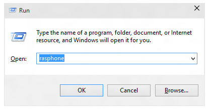

2.  如果您当前没有任何 VPN 连接，您会看到以下消息，请单击**确定**。

    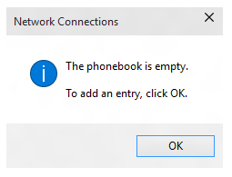

3.  在向导中选择**工作区网络**。

    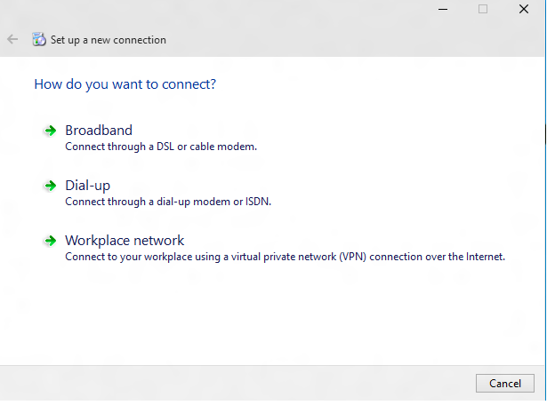

4.  输入 internet 地址和连接名称的任何虚拟信息。 这些可以是虚假的因为它不会影响身份验证参数。

    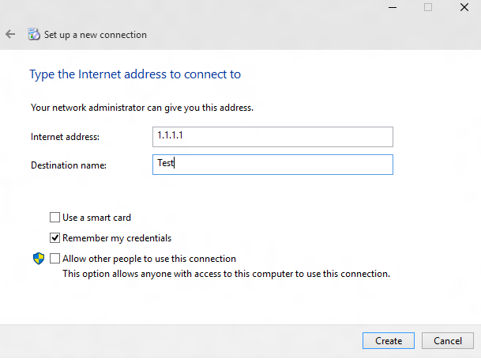

5.  创建一个虚假的 VPN 连接。 在 UI 中如下所示，单击**属性**。

    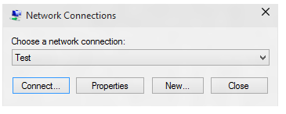

6.  在**测试的属性**对话框中，单击**安全**选项卡。

    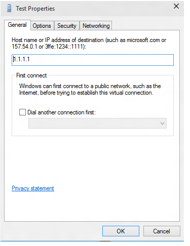

7.  在**安全性**选项卡，选择**使用可扩展身份验证协议 (EAP)**单选按钮。

    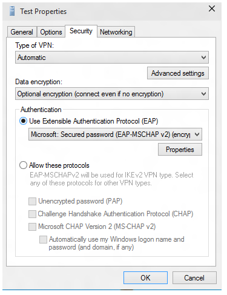

8.  从下拉菜单中，选择您想要配置 EAP 方法。 然后单击**属性**以根据需要配置。

    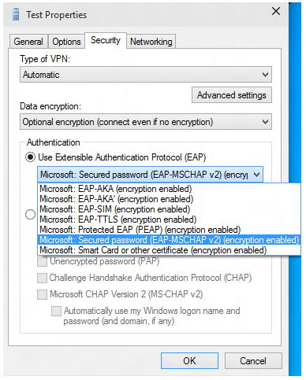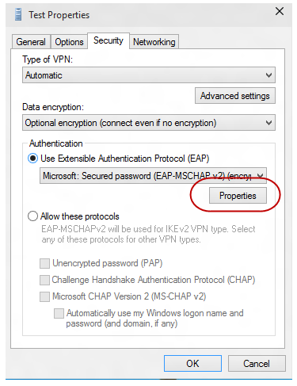

9.  切换到 PowerShell 并且使用以下 cmdlet 的 EAP 配置 XML 中检索。

    ``` syntax
    Get-VpnConnection -Name Test
    ```

    <a href="" id="pow"></a>下面是示例输出。

    ``` syntax
    Name                  : Test
    ServerAddress         : 1.1.1.1
    AllUserConnection     : False
    Guid                  : {EC87F6C9-8823-416C-B92B-517D592E250F}
    TunnelType            : Automatic
    AuthenticationMethod  : {Eap}
    EncryptionLevel       : Optional
    L2tpIPsecAuth         : Certificate
    UseWinlogonCredential : False
    EapConfigXmlStream    : #document
    ConnectionStatus      : Disconnected
    RememberCredential    : True
    SplitTunneling        : False
    DnsSuffix             :
    IdleDisconnectSeconds : 0
    ```

    ``` syntax
    $a = Get-VpnConnection -Name Test
    ```

    ``` syntax
    $a.EapConfigXmlStream.InnerXml
    ```

    下面是示例输出

    ``` syntax
    <EapHostConfig xmlns="http://www.microsoft.com/provisioning/EapHostConfig"><EapMethod><Type xmlns="http://www.microsoft.co
    m/provisioning/EapCommon">13</Type><VendorId xmlns="http://www.microsoft.com/provisioning/EapCommon">0</VendorId><VendorTy
    pe xmlns="http://www.microsoft.com/provisioning/EapCommon">0</VendorType><AuthorId xmlns="http://www.microsoft.com/provisi
    oning/EapCommon">0</AuthorId></EapMethod><Config xmlns="http://www.microsoft.com/provisioning/EapHostConfig"><Eap xmlns="h
    ttp://www.microsoft.com/provisioning/BaseEapConnectionPropertiesV1"><Type>13</Type><EapType xmlns="http://www.microsoft.co
    m/provisioning/EapTlsConnectionPropertiesV1"><CredentialsSource><CertificateStore><SimpleCertSelection>true</SimpleCertSel
    ection></CertificateStore></CredentialsSource><ServerValidation><DisableUserPromptForServerValidation>false</DisableUserPr
    omptForServerValidation><ServerNames></ServerNames></ServerValidation><DifferentUsername>false</DifferentUsername><Perform
    ServerValidation xmlns="http://www.microsoft.com/provisioning/EapTlsConnectionPropertiesV2">true</PerformServerValidation>
    <AcceptServerName xmlns="http://www.microsoft.com/provisioning/EapTlsConnectionPropertiesV2">true</AcceptServerName><TLSEx
    tensions xmlns="http://www.microsoft.com/provisioning/EapTlsConnectionPropertiesV2"><FilteringInfo xmlns="http://www.micro
    soft.com/provisioning/EapTlsConnectionPropertiesV3"><ClientAuthEKUList Enabled="true" /><AnyPurposeEKUList Enabled="true"
    /></FilteringInfo></TLSExtensions></EapType></Eap></Config></EapHostConfig>
    ```

    **请注意** 如果您需要将此 XML 传递转义格式，应检查与 MDM 供应商。 Xsd 所有 EAP 方法的包装盒中，可以在以下位置找到︰
    -   C:\\Windows\\架构\\EAPHost
    -   C:\\Windows\\架构\\EAPMethods

     

## <a name="eap-certificate-filtering"></a>EAP 证书筛选


在您的部署中，如果您有多个证书在该设备上设置和配置的 Wi-Fi 配置文件并没有严格的筛选条件，您可能看到连接故障时连接到 Wi-fi。 解决方案是确保 Wi-Fi 配置文件设置有严格的筛选条件，以便它与一个证书匹配。

企业部署证书基于 EAP 身份验证的 VPN/Wi-Fi 可面临的情况有多个符合默认条件用于身份验证的证书。 这可能会导致的问题如︰

-   可能会提示用户选择证书。
-   错误的证书可能获取自动选择，并会导致身份验证失败。

生产准备部署必须相应证书的详细信息与部署配置文件的一部分。 以下信息解释如何创建或更新 EAP 配置 XML，以便多余的证书将被过滤掉并适当的证书可以用于身份验证。

EAP XML 必须进行这种手动编辑 XML 示例下面，或者使用步骤的用户界面指南为您的环境的相关信息更新。 EAP XML 更新后，请参阅说明从您的 MDM 部署更新的配置，如下所示︰

-   对于 Wi-fi，查找&lt;EAPConfig&gt; （这是您所指定的 Wi-Fi CSP 中的 WLanXml 节点） 您当前 WLAN 配置文件 XML 的部分。 在这些标记中，您会发现完整的 EAP 配置。 替换部分下的&lt;EAPConfig&gt;与您更新 XML 并更新您的 Wi-fi® 配置文件。 您可能需要引用 MDM 的指导如何部署新的 Wi-Fi 配置文件。
-   对于 VPN，EAP 配置为 MDM 配置单独的域。 使用 MDM 提供程序确定并更新相应的字段。

有关设置的详细说明，请参见<https://technet.microsoft.com/library/hh945104.aspx#BKMK_Cfg_cert_Selct>

有关生成 EAP XML 的信息，请参阅 EAP 配置

扩展的密钥用法的详细信息，请参见<http://tools.ietf.org/html/rfc5280#section-4.2.1.12>

有关将扩展密钥用法 (EKU) 添加到证书的信息，请参见<https://technet.microsoft.com/library/cc731792.aspx>

下面的列表描述了证书 EAP 与一起使用的系统必备组件︰

-   证书必须具有至少下列 EKU （扩展密钥用法） 属性之一︰

    -   客户端身份验证
    -   按照 RFC 5280 的定义，这是一个定义完善的 OID 值 1.3.6.1.5.5.7.3.2
    -   任何目的
    -   EKU 定义和由 Microsoft 发布的是一个定义完善的 OID 值 1.3.6.1.4.1.311.10.12.1。 包含该 OID 意味着证书可以用于任何目的。 此 EKU 所有目的 EKU 相比的优势是其他非临界或自定义 Eku 仍然可以添加到有效筛选的证书。
    -   所有目的
    -   如果 CA 中包含扩展的密钥用法，以满足某些应用程序需要但不希望限制使用的密钥由 RFC 5280，CA 可以添加一个扩展的密钥用法值为 0。 具有这种 EKU 的证书可以用于所有目的。
-   用户或客户端链接到受信任的根 CA 上的计算机证书
-   用户或计算机证书不会失败任何一种由 CryptoAPI 证书存储区中，执行检查和证书通过远程访问策略中的要求。
-   用户或计算机证书不会失败的证书对象标识符检查 Internet 验证服务 (IAS) 中指定的任何一个 / Radius 服务器。
-   主题备用名称 (SubjectAltName) 扩展的证书中包含的用户的用户主体名称 (UPN)。

以下 XML 示例解释为包括证书的 EAP TLS XML 属性。

> **请注意** PEAP 或 TTLS 配置式 EAP TLS XML 嵌入一些 PEAP 或 TTLS 特定的元素。

 

``` syntax
<EapHostConfig xmlns="http://www.microsoft.com/provisioning/EapHostConfig">
 <EapMethod>
  <Type xmlns="http://www.microsoft.com/provisioning/EapCommon">13</Type>
  <!--The above property defines the Method type for EAP, 13 means EAP TLS -->

  <VendorId xmlns="http://www.microsoft.com/provisioning/EapCommon">0</VendorId>
  <VendorType xmlns="http://www.microsoft.com/provisioning/EapCommon">0</VendorType>
  <AuthorId xmlns="http://www.microsoft.com/provisioning/EapCommon">0</AuthorId>
  <!--The 3 properties above define the method publishers, this is seen primarily in 3rd party Vendor methods.-->
  <!-- For Microsoft EAP TLS the value of the above fields will always be 0 --> 
 </EapMethod>
 <!-- Now that the EAP Method is Defined we will go into the Configuration --> 
 <Config xmlns="http://www.microsoft.com/provisioning/EapHostConfig">
  <Eap xmlns="http://www.microsoft.com/provisioning/BaseEapConnectionPropertiesV1">
   <Type>13</Type>
   <EapType xmlns="http://www.microsoft.com/provisioning/EapTlsConnectionPropertiesV1">
    <CredentialsSource>
     <!-- Credential Source can be either CertificateStore or SmartCard --> 
     <CertificateStore>
      <SimpleCertSelection>true</SimpleCertSelection>
      <!--SimpleCertSelection automatically selects a cert if there are mutiple identical (Same UPN, Issuer, etc.) certs.-->
      <!--It uses a combination of rules to select the right cert-->
     </CertificateStore>
    </CredentialsSource>
    <ServerValidation>
     <!-- ServerValidation fields allow for checks on whether the server being connected to and the server cert being used are trusted -->
     <DisableUserPromptForServerValidation>false</DisableUserPromptForServerValidation>
     <ServerNames/>
    </ServerValidation>
    <DifferentUsername>false</DifferentUsername>
    <PerformServerValidation xmlns="http://www.microsoft.com/provisioning/EapTlsConnectionPropertiesV2">false</PerformServerValidation>
    <AcceptServerName xmlns="http://www.microsoft.com/provisioning/EapTlsConnectionPropertiesV2">false</AcceptServerName>
    <TLSExtensions xmlns="http://www.microsoft.com/provisioning/EapTlsConnectionPropertiesV2">
     <!-- For filtering the relevant information is below -->
     <FilteringInfo xmlns="http://www.microsoft.com/provisioning/EapTlsConnectionPropertiesV3">
      <CAHashList Enabled="true">
       <!-- The above implies that you want to filter by Issuer Hash -->
       <IssuerHash>ff ff ff ff ff ff ff ff ff ff ff ff ff ff ff ff ff ff ff ff
        <!-- Issuing certs thumbprint goes here-->
       </IssuerHash>
       <!-- You can add multiple entries and it will find the list of certs that have at least one of these certs in its chain--> 
      </CAHashList>
      <EKUMapping>
       <!-- This section defines Custom EKUs that you may be adding-->
       <!-- You do not need this section if you do not have custom EKUs -->
       <!-- You can have multiple EKUs defined here and then referenced below as shown -->
       <EKUMap>
        <EKUName>
         <!--Add a friendly Name for an EKU here for example -->ContostoITEKU</EKUName> 
        <EKUOID>
         <!--Add the OID Value your CA adds to the certificate here, for example -->1.3.6.1.4.1.311.42.1.15</EKUOID> 
       </EKUMap>
        <!-- All the EKU Names referenced in the example below must first be defined here
       <EKUMap>
        <EKUName>Example1</EKUName>
        <EKUOID>2.23.133.8.3</EKUOID>
      
       </EKUMap>
       <EKUMap>
        <EKUName>Example2</EKUName>
        <EKUOID>1.3.6.1.4.1.311.20.2.1</EKUOID>
       </EKUMap>
       -->
      </EKUMapping>
      <ClientAuthEKUList Enabled="true">
       <!-- The above implies that you want certs with Client Authentication EKU to be used for authentication -->
       <EKUMapInList>
        <!-- This section implies that the certificate should have the following custom EKUs in addition to the Client Authentication EKU -->
        <EKUName>
         <!--Use the name from the EKUMap Field above-->ContostoITEKU</EKUName> 
       </EKUMapInList>
       <!-- You can have multiple Custom EKUs mapped here, Each additional EKU will be processed with an AND operand -->
       <!-- For example, Client Auth EKU AND ContosoITEKU AND Example1 etc. -->
       <EKUMapInList>
        <EKUName>Example1</EKUName>
       </EKUMapInList>
      </ClientAuthEKUList>
      <AllPurposeEnabled>true</AllPurposeEnabled>
      <!-- Implies that a certificate with the EKU field = 0 will be selected --> 
      <AnyPurposeEKUList Enabled="true"/>
      <!-- Implies that a certificate with the EKU oid Value of 1.3.6.1.4.1.311.10.12.1 will be selected --> 
      <!-- Like for Client Auth you can also add Custom EKU properties with AnyPurposeEKUList (but not with AllPurposeEnabled) -->
      <!-- So here is what the above policy implies. 
      The certificate selected will have
      Issuer Thumbprint = ff ff ff ff ff ff ff ff ff ff ff ff ff ff ff ff ff ff ff ff
      AND
      ((Client Authentication EKU AND ContosoITEKU) OR (AnyPurposeEKU) OR AllPurpose Certificate)
      
      Any certificate(s) that match these criteria will be utilised for authentication
      -->
     </FilteringInfo>
    </TLSExtensions>
   </EapType>
  </Eap>
 </Config>
</EapHostConfig>
```

> **请注意** EAP TLS XSD 位于**%系统驱动器 %\\Windows\\架构\\EAPMethods\\eaptlsconnectionpropertiesv3.xsd**

 

或者您可以使用下面的过程创建 EAP 配置 XML。

1.  请按照步骤 1 至 7 的 EAP 配置主题。
2.  在 Microsoft VPN SelfHost 属性对话框中，选择**Microsoft︰ 智能卡或其他证书**从下拉列表 （此选择 EAP-TLS。）

    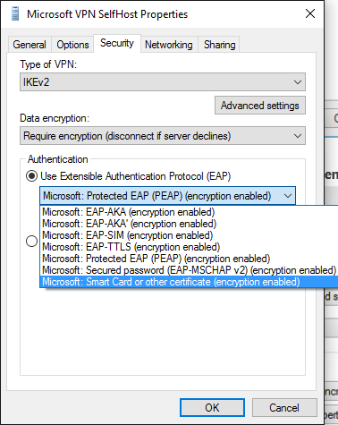

    **请注意** PEAP 或 TTLS，选择适当的方法，并继续执行此过程。

     

3.  单击**属性**按钮下面的下拉菜单。
4.  在**智能卡或其他证书属性**菜单中，选择**高级**按钮。

    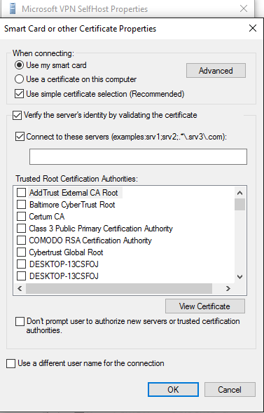

5.  在**配置证书选择**菜单中，根据需要调整筛选器。

    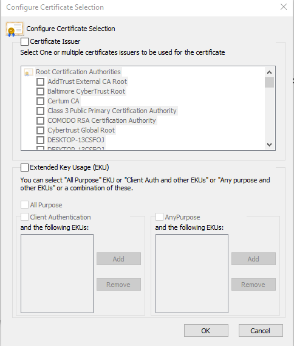

6.  单击**确定**以关闭窗口以返回到主 rasphone.exe 对话框中。
7.  关闭 rasphone 将对话框。
8.  继续执行步骤 9 以获取配置文件与相应筛选的 EAP-TLS 的 EAP 配置主题中的过程。

> **请注意** 您还可以设置所有其他适用的 EAP 属性通过此的用户界面。 [可扩展身份验证协议 (EAP) 的网络访问设置](https://technet.microsoft.com/library/hh945104.aspx)主题中，可以找到的指南，这些属性的含义是什么。

 

 

 


