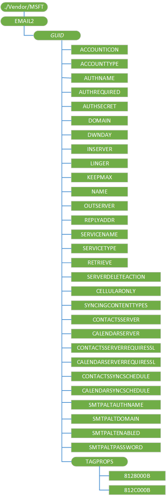

# 电子邮件 2 CSP

电子邮件 2 配置服务提供程序 (CSP) 用来配置简单邮件传输协议 (SMTP) 电子邮件帐户。

> **请注意**  此配置服务提供商要求使用 ID\_CAP\_CSP\_基础和 ID\_CAP\_CSP\_邮件功能从网络配置应用程序进行访问。
在桌面上，只能按照每个用户配置受支持。

 

以下关系图显示电子邮件 2 配置服务提供程序管理对象以树格式由 OMA DM 和 OMA 客户端资源调配。

在 Windows 10 手机之后用户的全新体验，, OEM 或移动运营商可以使用电子邮件 2 配置服务提供程序以无线为设备提供移动运营商的专有的邮件。 资源调配后**启动**屏幕专用的邮件提供程序具有平铺和还有下**设置、 电子邮件和帐户**的应用程序列表中，指向它的链接。 帐户已更新无线电子邮件 2，csp 后，该设备必须关闭电源，然后打开电源后要查看同步状态。

配置数据经无线 (OTA) 发送时未加密。 请注意，这是潜在的安全风险时发送敏感的配置数据，如密码。

**电子邮件 2**  
配置服务提供程序的根节点。

受支持的操作是获得。

***GUID***  
定义一个特定的电子邮件帐户。 必须为每个电子邮件帐户在该设备上生成全局唯一标识符 (GUID)。 资源调配使用的帐户具有相同的 GUID 与现有不创建新的帐户和添加命令将失败，在这种情况下。

支持的操作是 Get，添加和删除。

电子邮件 2 配置服务提供程序中需要括号 {} 环绕 GUID。

-   OMA 客户端资源调配，可按其原义发送大括号。 例如， `<characteristic type="{C556E16F-56C4-4edb-9C64-D9469EE1FBE0}"/>`。

-   对于 OMA DM，必须使用 ASCII 值 0x7B 和 0x7D 分别发送大括号。 例如，`<Target><LocURI>./Vendor/MSFT/EMAIL2/0x7BC556E16F-56C4-4edb-9C64-D9469EE1FBE0x7D</LocURI></Target>`

**ACCOUNTICON**  
可选项。 返回与该帐户相关联的图标的位置。

支持的操作是获取、 添加、 替换和删除。

该帐户图标可以用作在**启动**列表中的某个图块或下**设置、 电子邮件和帐户**的应用程序列表中的图标。 在设备上已经提供了一些图标。 POP/IMAP 或一般的动态同步帐户的建议的图标位于 res://AccountSettingsSharedRes {*ScreenResolution*} ！ %s.genericmail.png。 对于 Exchange 帐户的建议的图标位于 res://AccountSettingsSharedRes {*ScreenResolution*} ！ %s.office.outlook.png。 如果需要，可以添加自定义的图标。

**ACCOUNTTYPE**  
必需。 指定的帐户的类型。

支持的操作是获取、 添加、 替换和删除。

有效值包括︰

-   电子邮件︰ 正常电子邮件

-   VVM︰ 可视语音邮件

**AUTHNAME**  
必需。 指定用于授权给特定的电子邮件帐户 （也称为用户的登录名） 的用户的名称的字符串。

支持的操作是获取、 添加、 替换和删除。

**AUTHREQUIRED**  
可选项。 指定是否发送服务器要求身份验证的字符串。

支持的操作是获取、 添加、 替换和删除。

有效的值将为下列情况之一︰

-   0-服务器身份验证不是必需的。
-   1-服务器身份验证是必需的。

> **请注意** 如果未指定此值，则不进行任何 SMTP 身份验证。 此外，这是不同于 SMTPALTENABLED。

 

**AUTHSECRET**  
可选项。 指定用户的密码的字符串。 对于 SMTP 身份验证使用相同的密码。

支持的操作是获取、 添加、 替换和删除。

**域**  
可选项。 指定传入的服务器凭据域的字符串。 限制为 255 个字符。

支持的操作是获取、 添加、 替换和删除。

**DWNDAY**  
可选项。 应从服务器下载字符字符串，它指定多少天的电子邮件。

支持的操作是获取、 添加、 替换和删除。

有效的值将为下列情况之一︰

-   -1︰ 指定应下载当前服务器上的所有电子邮件。

-   7︰ 指定应下载 7 天的电子邮件。

-   14︰ 指定应下载 14 天的电子邮件。

-   30︰ 指定应下载 30 天的电子邮件。

**INSERVER**  
必需。 字符的字符串，它指定的传入的服务器名称和端口号。 这是超过 62 个字符。 如果使用标准端口号，则您不需要指定端口号。 值格式为︰

-   服务器名称︰ 端口号

支持的操作是 Get，添加和替换。

**逗留**  
可选项。 指定以分钟为单位的电子邮件发送/接收更新之间的时间长度的字符串。

支持的操作是获取、 添加、 替换和删除。

有效值包括︰

-   0-电子邮件更新，必须手动执行。

-   15 （默认）-等待 15 分钟更新之间。

-   30-等待更新之间的约 30 分钟。

-   60-等待更新之间的 60 分钟。

-   120-等待更新之间 120 分钟。

**KEEPMAX**  
可选项。 指定邮件附件的最大大小。 超过此大小的附件不会被下载，但是它将保留在服务器上。 将下载消息本身。 只能为 IMAP4 帐户，可以设置此值。

以 kb 为单位指定了限制

有效值为 0、 25、 50、 125 和 250。

值为 0 表示无限制将被强制执行。

支持的操作是获取、 添加、 替换和删除。

**名称**  
可选项。 指定发件人发送的电子邮件上显示的名称的字符串。 它应设置为用户的名称。 限制为 255 个字符。

支持的操作是获取、 添加、 替换和删除。

**OUTSERVER**  
必需。 指定邮件服务的传出电子邮件服务器的名称的字符串。 为 62 个字符的限制。 值格式为︰

-   服务器名称︰ 端口号

支持的操作是 Get，添加，删除和替换。

**REPLYADDR**  
必需。 指定的用户 （通常与用户电子邮件地址） 的答复电子邮件地址的字符串。 没有它，通过发送电子邮件将失败。 限制为 255 个字符。

支持的操作是获取、 添加、 删除和替换。

**服务名**  
必需。 指定要创建或编辑 (32 0-127) 的电子邮件服务的名称的字符串。

支持的操作是 Get，添加、 替换和删除。

> **请注意**  电子邮件 2 配置服务提供程序不支持对**服务**和**服务类型**的参数的 OMA DM**替换**命令。 若要替换的电子邮件帐户名或者帐户服务类型，必须删除现有的电子邮件帐户，则必须创建一个新。

 

**服务类型**  
必需。 字符的字符串，它指定要创建或编辑 （例如，"IMAP4"或"POP3"） 的电子邮件服务的类型。

支持的操作是 Get，添加、 替换和删除。

> **请注意**  电子邮件 2 配置服务提供程序不支持对**服务**和**服务类型**的参数的 OMA DM**替换**命令。 若要替换的电子邮件帐户名或者帐户服务类型，必须删除现有的电子邮件帐户，则必须创建一个新。

 

**检索**  
可选项。 指定最大大小，以字节为单位的传入电子邮件服务器中检索到的消息。 超过此大小的邮件检索，但截断。

有效值为 512、 1024年、 2048、 5120、 20480，和 51200。

支持的操作是 Get，添加、 替换和删除。

**SERVERDELETEACTION**  
可选项。 字符的字符串，它指定如何在服务器上删除邮件。 有效值︰

-   1-删除服务器上的邮件
-   2-（删除到垃圾箱文件夹） 的服务器上保留该邮件。

操作，这取决于传输的任何其他值结果。

支持的操作是 Get，添加、 替换和删除。

**CELLULARONLY**  
可选项。 如果设置了此标志，则该帐户只使用蜂窝网络和没有 Wi-fi。

值类型是字符串。 支持的操作是 Get，添加、 替换和删除。

**SYNCINGCONTENTTYPES**  
必需。 指定同步所支持的内容类型的位掩码 (如︰ 邮件，联系人，日历)。

-   没有数据 (0x0)
-   联系人 (0x1)
-   邮件 (0x2)
-   约会 (0x4)
-   任务 (0x8)
-   备注 (0x10)
-   源 (0x60)
-   网络照片 (0x180)
-   组和房间 (0x200)
-   聊天 (0x400)
-   电子邮件收件人的电子邮件 (0x800)
-   服务器链接 (0x1000)
-   所有项目 (0xffffffff)

支持的操作是 Get，添加、 替换和删除。

**CONTACTSSERVER**  
可选项。 联系人同步，如果不是从电子邮件服务器的服务器。

支持的操作是 Get，添加、 替换和删除。

**CALENDARSERVER**  
可选项。 日历同步，如果不是从电子邮件服务器的服务器。

支持的操作是 Get，添加、 替换和删除。

**CONTACTSSERVERREQUIRESSL**  
可选项。 指示是否联系服务器的连接要求 SSL。

支持的操作是 Get，添加、 替换和删除。

**CALENDARSERVERREQUIRESSL**  
可选项。 指示是否为日历服务器的连接要求 SSL。

支持的操作是 Get，添加、 替换和删除。

**CONTACTSSYNCSCHEDULE**  
可选项。 设置同步联系人项目的日程安排。

支持的操作是 Get，添加、 替换和删除。

**CALENDARSYNCSCHEDULE**  
可选项。 设置同步日历项目的日程安排。

支持的操作是 Get，添加、 替换和删除。

**SMTPALTAUTHNAME**  
可选项。 指定与用户的备用 SMTP 电子邮件帐户相关联的显示名称的字符串。

支持的操作是获取、 添加、 替换和删除。

**SMTPALTDOMAIN**  
可选项。 指定用户的备用 SMTP 帐户的域名的字符串。

支持的操作是获取、 添加、 替换和删除。

**SMTPALTENABLED**  
可选项。 指定是否启用用户的备用 SMTP 帐户的字符串。

支持的操作是获取、 添加、 替换和删除。

"假"值指定用户的备用 SMTP 电子邮件帐户被禁用。 "True"值指定启用了该用户的备用 SMTP 电子邮件帐户。

**SMTPALTPASSWORD**  
可选项。 指定用户的备用 SMTP 帐户的密码的字符串。

支持的操作是获取、 添加、 替换和删除。

**TAGPROPS**  
可选项。 定义一组属性，使用非标准的元素的名称。

支持的操作是获取、 添加、 替换和删除。

**TAGPROPS/8128000B**  
可选项。 指定传入电子邮件服务器是否需要 SSL 的字符串。

支持的操作是获取、 添加、 替换和删除。

值可以是下列项之一︰

-   0-SSL 不是必需的。
-   1-SSL 是必需的。

**TAGPROPS/812C000B**  
可选项。 字符串，指定是否传出电子邮件服务器要求 SSL。

支持的操作包括获取和替换。

值可以是下列项之一︰

-   0-SSL 不是必需的。
-   1-SSL 是必需的。

## 备注

当应用程序删除或配置配置回滚时，电子邮件 2 CSP 将该请求传递到配置管理器中，处理外部事务。 当 MAPI 应用程序将被删除时，删除已创建的帐户和所有消息和其他属性，传输 (例如，短消息服务\[SMS\]，邮局协议\[POP\]，或简单邮件传输协议\[SMTP\]) 可能已经存储，将会丢失。 如果创建一个新的电子邮件帐户的尝试不成功，则新帐户将自动删除。 如果编辑现有帐户的尝试不成功，原始的配置自动回滚 （恢复）。

OMA DM，对于电子邮件 2 CSP 处理方式，与大多数其他配置服务提供程序替换命令。 电子邮件 2 csp，配置管理器将隐式添加缺失部分要被替换的节点或任何段中节点的路径如果中留&lt;LocURI&gt;&lt;/LocURI&gt;块。 有独立的参数定义传出服务器登录凭据。 这些凭据使用规则如下︰

-   除非设置了传出服务器凭据，传入服务器登录凭据是使用 （AUTHNAME、 AUTHSECRET 和域）。

-   如果某些而非全部发送服务器的凭据参数都存在，则电子邮件 2 配置服务提供程序将被视为错误。

-   无法查询帐户的详细信息，除非该帐户称为 GUID。 目前，没有任何方法可以执行顶级查询帐户 Guid。

Windows 10 移动支持传输层安全 (TLS)，但这不能显式启用该配置服务提供程序，通过和用户不能启用 TLS 通过用户界面。 如果用延迟的 SSL 启动时连接到邮件服务器，邮件服务器可以发送 STARTTLS 作为服务器功能并将启用 TLS。 下面的步骤演示如何启用 TLS。

1.  设备尝试连接到邮件服务器使用 SSL。

2.  如果 SSL 连接失败时，设备将尝试使用延迟的 SSL 连接。

3.  如果通过 SSL 和延迟的 SSL，则连接失败并且用户所选**服务器需要加密 (SSL) 连接**，该设备将不会尝试另一个连接。

4.  如果用户没有选择**服务器需要加密 (SSL) 连接**，该设备将尝试建立一个非 SSL 连接。

5.  如果连接成功使用任何加密协议，设备请求的服务器功能。

6.  如果发送邮件服务器的功能之一就是 STARTTLS 和连接会推迟 SSL，设备启用 TLS。 使用 SSL 或非 SSL 连接上未启用 TLS。

## 相关的主题

[配置服务提供程序的引用](configuration-service-provider-reference.md)

 

 

