# <a name="enable-offline-upgrades-to-windows-10-for-windows-embedded-81-handheld-devices"></a>启用脱机升级到 Windows 10 为 Windows 嵌入式 8.1 手持设备


任何 Windows 的设备，如 Windows 10 移动设备使用 Microsoft 更新默认情况下通过互联网下载更新。 但是，在某些企业环境中，设备可能不能访问 Internet，以检索其更新。 由于网络限制或其它的企业策略，设备必须从内部位置下载更新。 本文档介绍如何启用脱机更新使用系统中心配置管理器。

下面是路径的表的更新 Windows 10 移动到。

<table>
<colgroup>
<col width="50%" />
<col width="50%" />
</colgroup>
<thead>
<tr class="header">
<th>起始的 SKU</th>
<th>升级至 Windows 10 移动</th>
</tr>
</thead>
<tbody>
<tr class="odd">
<td><p>Windows Mobile 6.5</p></td>
<td><p>否</p></td>
</tr>
<tr class="even">
<td><p>Windows Phone 8</p></td>
<td><p>否</p></td>
</tr>
<tr class="odd">
<td><p>Windows Phone 8.1</p></td>
<td><p>是</p></td>
</tr>
</tbody>
</table>

 
要配置 MDM 服务提供商和启用移动的设备下载的更新，从预定义的内部位置，IT 管理员或设备管理员必须执行一系列步骤手动和自动。

这是过程的概要信息︰

1.  准备好的测试设备，可以连接到 Internet 下载发布的更新程序包。 
2.  下载更新程序之后，按下安装按钮之前，检索上的设备，包含有关每个更新软件包的所有元数据的 XML 文件。
3.  请检查 XML 文件中的状态代码。
4.  请检查注册表的依赖关系。
5.  分析 XML 文件以提取使用我们提供的脚本，下载更新程序包的 Url。
6.  下载使用下载的更新程序包的 Url。
7.  将下载的包放在您要更新的设备访问内部共享。
8.  创建两个附加的 XML 文件来定义要下载的特定更新程序和特定的位置，从中下载更新，并将它们部署到生产设备上。
9.  从设备启动的更新过程。

作为更新过程的一部分，Windows 将运行数据 migrators 要前移一层配置的设置和数据设备上。 例如，如果设备配置与维护时间或在 Windows 嵌入式 8.1 手持其他更新策略，这些设置将自动获得迁移到 Windows 10 作为更新过程的一部分。 如果手持设备已配置为指派的访问锁定，然后这种配置将还获得迁移到 Windows 10 作为更新过程的一部分。 这包括所有内部的应用程序 （包括 buttonremapping 应用程序） 的产品 id 与 AumId 的转换。

请注意，migrators 不会介意下列事项︰

-   Oem 提供的第三方应用程序
-   不建议使用第一方应用程序，如 Bing 新闻
-   不推荐使用的系统/应用程序设置，例如，Microsoft.Game，Microsoft.IE

企业重置，请在这些迁移的设置会自动保存。

下一步，完成时，如果您决定要推新的 wehlockdown.xml，在升级到 Windows 10 后将需要采取下列步骤，以确保通过企业重置更新的设置将保持不变︰

1.  删除 TPK\*ppkg 和推到永久文件夹与您的新配置新 ppkg。
2.  推新 ppkg 与您的新配置，具有较高优先级。 请注意，在 ICD，所有者 = Microsoft，秩 = 0 是最低优先级;然后彼此。 使用此步骤中，将覆盖旧的指派的访问锁定配置。

**要求︰**

-   测试设备必须与其他正在接收更新的生产设备相同。
-   测试设备必须登记系统中心配置管理器。
-   您的设备可以连接到互联网。
-   您的设备必须至少 0.5 gb 的可用空间的 SD 卡。
-   确保设置应用程序和 PhoneUpdate 小程序可通过指定访问权限。

下图是该过程的概述。

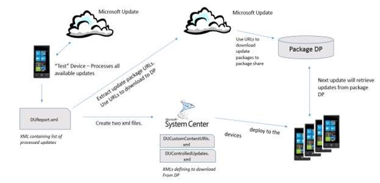

## <a name="step-1-prepare-a-test-device-to-download-updates-from-microsoft-update"></a>第 1 步︰ 准备要从 Microsoft 更新下载的更新的测试设备


定义基准更新集将应用于其他设备。 使用为测试设备运行最新的图像的设备。

触发设备来检查有更新或者手动或使用系统中心配置管理器。

**手动**

1.  从该设备，请转到**设置** &gt; **电话更新** &gt; **检查更新**。
2.  同步设备。 转到**设置** &gt; **工作场所** &gt; **Enrolled** ，然后单击刷新图标。 根据需要重复。
3.  按照提示下载更新，但不要按安装按钮。

> **请注意** 在 GDR2 CSP 将不设置所赋的值之前的所有操作系统版本中没有 bug。 没有方法可以更改或设置这直到 GDR2 被部署到设备上。


**使用系统中心配置管理器**

1.  通过部署一个触发器扫描配置基线远程触发对测试设备进行扫描。

    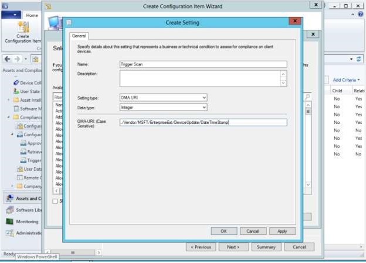

2.  通过浏览到该配置项目设置并从上一步中选择新创建的扫描触发器设置设置此 OMA URI 的值。

    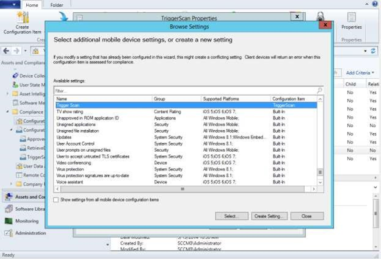

3.  确保此 uri 指定的值大于设备上的值，并修正不符合规则时受支持的选项被选中。 第一次，任何大于 0 的值将起作用，但对于后续配置，请确保指定递增的值。

    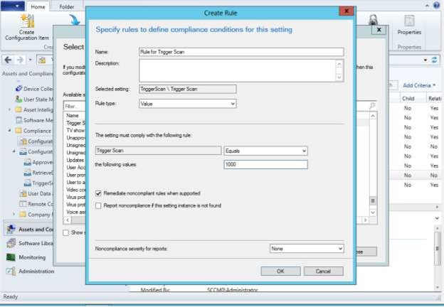

4.  TriggerScan 为创建配置基线和部署。 建议控制更新比较基准应用到设备 （对应的文件部署到设备同步会话的设备） 后，部署此配置基线。
5.  按照提示下载更新，但无法在设备上安装这些更新。


## <a name="a-href-idstep2astep-2-retrieve-the-device-update-report-xml-from-the-device"></a><a href="" id="step2"></a>步骤 2︰ 从设备中检索设备更新报告 XML

更新下载 （但未安装在设备上） 后，过程会产生包含它下载有关包的信息的 XML 文件。 您必须检索此 XML 文件。

有两种方法来检索该文件从设备;一个 pre GDR1，一个帖子-GDR1。

**Pre-GDR1︰ 分析从设备中 ConfigMgr 法规遵从性日志**

1.  创建使用 ConfigMgr 一下注册表条目./Vendor/MSFT/EnterpriseExt/DeviceUpdate/ApprovedUpdatesXml 的配置项。

    > **请注意** 在系统中心配置管理器中，您可能会看到关于超出文件限制在使用 ApprovedUpdatesXml 时出错。 但是，该过程仍完成即使文件很大。

    如果 XML 文件大于 32k 您还可以使用./Vendor/MSFT/FileSystem/&lt;*文件名*&gt;。
2.  该项配置一个"虚拟"的值 （例如 zzz)，设置了比较基准，并确保执行您不修正它。

    虚拟值不能设置;它仅用于比较。
3.  后报告 XML 发送到设备，系统中心配置管理器中将显示包含报告信息的法规遵从性记录。 该日志可以包含大量数据。
4.  分析此日志中的报表的 XML 内容。

有关分步演练，请参阅[如何检索设备更新报表使用系统中心配置管理器日志](#how-to-retrieve-a-device-update-report-using-system-center-configuration-manager-logs)。

**开机自检-GDR1︰ 检索报表的 xml 文件使用 SD 卡**

1.  创建使用 ConfigMgr 设置为./Vendor/MSFT/EnterpriseExt/DeviceUpdate/CopyUpdateReportToSDCard 注册表值的配置项。
2.  定义此配置项的值由 SD 卡，其中包括 XML 文件的文件名的相对路径 (例如 SDCardRoot\\更新\\DUReport.xml)。
3.  从设备上删除 SD 卡，并将该 XML 文件复制到您的 PC。

## <a name="step-3-check-the-status-code-in-the-xml-file"></a>步骤 3︰ 检查 XML 文件中的状态代码
请确保为 0000-0000 （成功） 设置的状态代码。

## <a name="step-4-check-for-registry-dependencies"></a>步骤 4︰ 检查注册表依赖关系
在 XML 文件中移除注册表的任何依赖项。

## <a name="step-5-extract-download-urls-from-the-report-xml"></a>第 5 步︰ 抽出下载 Url 从 XML 报表

使用[示例 PowerShell 脚本](#example-powershell-script)提取的下载 Url 从 XML 文件或手动分析它。

## <a name="step-6-retrieve-update-packages-using-download-urls"></a>第 6 步︰ 使用检索更新包下载 Url

使用脚本或手动将每个更新包下载到一台电脑或内部共享。

## <a name="step-7-place-the-update-packages-on-an-accessible-share"></a>第 7 步︰ 将更新包放在一个可访问的共享

放入内部共享的需要这些更新的所有设备均可访问的所有更新程序包。 确保内部共享可以支持多个设备尝试访问在同一时间更新。

## <a name="step-8-create-two-xml-files-for-production-devices-to-select-updates-and-download-locations"></a>步骤 8︰ 创建两个 XML 文件中选择更新和下载位置生产设备

以下是这两个文件。

<table>
<colgroup>
<col width="50%" />
<col width="50%" />
</colgroup>
<thead>
<tr class="header">
<th>对象的说明。</th>
<th>说明</th>
</tr>
</thead>
<tbody>
<tr class="odd">
<td><p><strong>DUControlledUpdates.xml</strong></p></td>
<td><p>这是与报表检索到在步骤 2 中的 XML 使用不同的名称相同的文件。 这个文件告诉设备要下载的特定更新程序包。 例如，请参阅附录</p>
<p></p></td>
</tr>
<tr class="even">
<td><p><strong>DUCustomContentUris.xml</strong></p></td>
<td><p>此文件将在 DUControlledUpdates.xml 中的更新软件包映射到内部共享的位置。</p></td>
</tr>
</tbody>
</table>

 

有关这些步骤中，[如何将控制的更新部署](#how-to-deploy-controlled-updates)的演练。 确保尚未部署触发器扫描配置基线。

<a href="" id="deploy-controlled-updates"></a>
### <a name="how-to-deploy-controlled-updates"></a>如何将控制的更新部署

此过程包括三个部分︰

-   创建用于 DUControlledUpdates.xml 的配置项
-   创建用于 DUCustomContentURIs.xml 的配置项
-   创建已批准更新的配置的项。

<a href="" id="create-ducontrolledupdates"></a>
**创建用于 DUControlledUpdates.xml 的配置项**

1.  创建一个配置项。 在**浏览设置**窗口中，选择作为筛选器，**设备文件**，然后单击**选择**。

    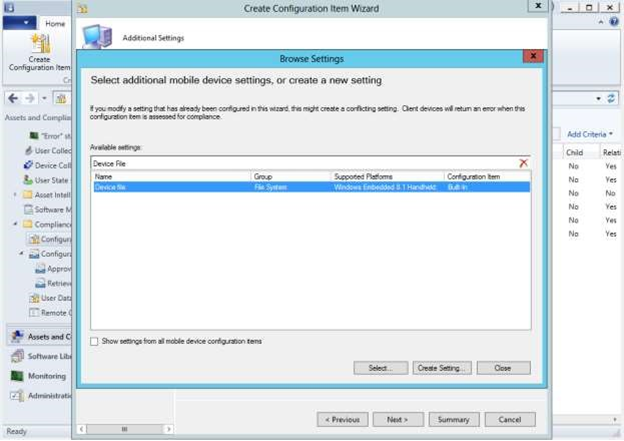

2.  浏览到 DUControlledUpdates.xml 从测试设备创建和指定该文件的路径和名称与设备上`NonPersistent\DUControlledUpdates.xml`。

    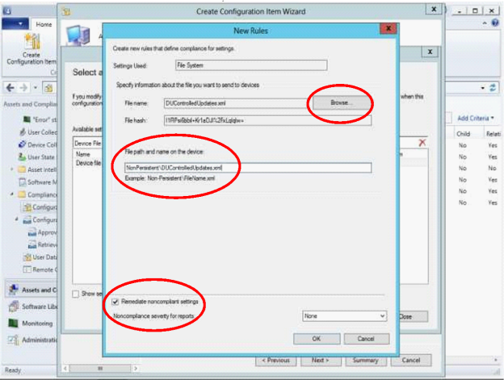

3.  复选框**修正不符合设置**。
4.  单击**确定**。

<a href="" id="create-ducustomcontent"></a>
**创建用于 DUCustomContentURIs.xml 的配置项**

1.  创建一个配置项和指定的文件路径和上作为设备的名称`NonPersistent\DUCustomContentURIs.xml`
2.  复选框**修正不符合设置**。

    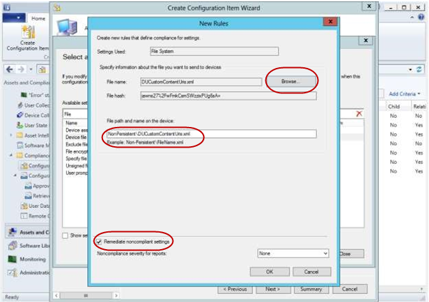

3.  单击**确定**。

<a href="" id="create-config-baseline"></a>
**创建配置基线的已批准更新**

1.  创建配置基线项目并为其指定一个名称 （例如 ControlledUpdates)。
2.  添加的 DUControlledUpdates 和 DUCustomContentURIs 的配置项，然后再单击**确定**。

    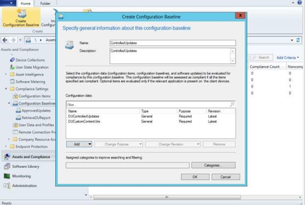

3.  将配置基准部署到适当的设备或设备集合。

    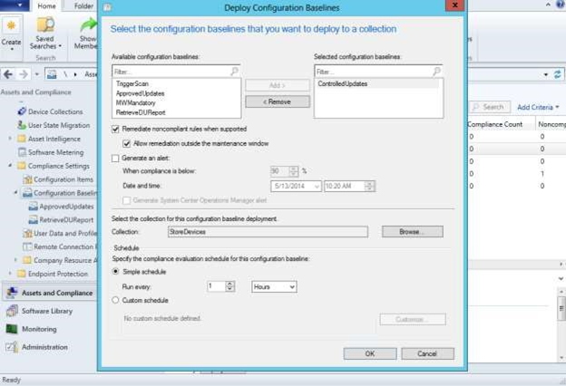

4.  单击**确定**。

## <a name="step-7-trigger-the-other-devices-to-scan-download-and-install-updates"></a>第 7 步︰ 触发其他设备来扫描、 下载并安装更新

现在，"生产"存储"设备有了必要的信息从内部共享下载更新，设备准备更新。

### <a name="use-this-process-for-unmanaged-devices"></a>使用此过程为非托管设备

如果不管理或限制系统中心配置管理器设备的更新策略，可以通过以下方法之一在设备上启动更新过程︰

-   由该设备自动执行定期扫描。
-   通过**设置**手动启动 -&gt; **电话更新** - &gt; **检查更新**。

### <a name="use-this-process-for-managed-devices"></a>此过程用于受控设备

如果管理或由 MDM 限制设备的更新策略，可以通过以下方法之一在设备上启动更新过程︰

-   触发更新通过系统中心配置管理器中扫描设备。

    确保触发器扫描已成功执行，然后删除触发器扫描配置基线。

    > **请注意** 确保 PhoneUpdateRestriction 策略设置的值为 0，以确保设备不会执行自动扫描。


-   触发设备扫描由 IT 管理员在系统中心配置管理器中定义维护窗口的一部分。

更新安装完成后，IT 管理员可以使用 DUReport 生成的生产设备以确定设备是否成功安装的更新列表。 如果该设备不是，请在 DUReport.xml 中提供错误代码。 若要从设备中检索设备更新报告，执行[步骤 2](#step2)中定义的相同步骤。

<a href="" id="example-script"></a>
## <a name="example-powershell-script"></a>PowerShell 脚本示例

``` syntax
param (
# [Parameter (Mandatory=$true, HelpMessage="Input File")]
        [String]$inputFile,

# [Parameter (Mandatory=$true, HelpMessage="Download Cache Location")]
        [String]$downloadCache,

# [Parameter (Mandatory=$true, HelpMessage="Local Cache URL")]
        [String]$localCacheURL
       )

#DownloadFiles Function
function DownloadFiles($inputFile, $downloadCache, $localCacheURL)
{
    $customContentURIFileCreationError = "Not able to create Custom Content URI File"
#Read the Input File
    $report = [xml](Get-Content $inputFile)
    
# this is where the document will be saved
    $customContentURLFile = "$downloadCache\DUCustomContentUris.xml"
    New-Item -Path $customContentURLFile -ItemType File -force -ErrorAction SilentlyContinue -ErrorVariable NewItemError > $null
    if ($NewItemError -ne "")
    {
       PrintMessageAndExit $customContentURIFileCreationError
    }

# get an XMLTextWriter to create the XML
    $XmlWriter = New-Object System.XMl.XmlTextWriter($customContentURLFile,$Null)

# choose a pretty formatting:
    $xmlWriter.Formatting = 'Indented'
    $xmlWriter.Indentation = 1
    $XmlWriter.IndentChar = "`t"
 
# write the header
    $xmlWriter.WriteStartDocument()
    $xmlWriter.WriteStartElement('CustomContentUrls')
    foreach ($update in $report.UpdateData.coreUpdateMetadata.updateSet.update)
    {
        if (!$update.destinationFilePath -or !$update.contentUrl) 
        {
            continue;
        }

        $destFilePath = $update.destinationFilePath.Trim();
        $contentUrl = $update.contentUrl.Trim();

        Write-Host "Pre-Processing Line: $destFilePath#$contentUrl"
        if (($destFilePath -ne "") -and ($destFilePath.Contains("\")) -and ($contentUrl -ne "") -and ($contentUrl.Contains("/")) )
        {
            $isBundle = $update.isBundle
            $revisionId = $update.revisionId
            $updateId = $update.updateId
            $revisionNum = $update.revisionNum

            $fileName = $destFilePath.Substring($destFilePath.LastIndexOf("\") + 1);
#Write-Host "Processing Line: $destFilePath#$contentUrl"
            if ($fileName -ne "")
            {
                $destination = $downloadCache + "\" + $fileName;
                Try
                {
                    $wc = New-Object System.Net.WebClient
                    $wc.DownloadFile($contentUrl, $destination)
                    Write-Host "Successfull Download: $contentUrl#$destination";

                    $XmlWriter.WriteStartElement('contentUrl')
                    $XmlWriter.WriteAttributeString('isBundle', $isBundle)
                    $XmlWriter.WriteAttributeString('revisionId', $revisionId)
                    $XmlWriter.WriteAttributeString('updateId', $updateId)
                    $XmlWriter.WriteAttributeString('revisionNum', $revisionNum)
                    $XmlWriter.WriteRaw($localCacheURL + $fileName)
                    $xmlWriter.WriteEndElement()
                }
                Catch [ArgumentNullException]
                {
                    Write-Host "Content URL is null";
                }
                Catch [WebException]
                {
                    Write-Host "Invalid Content URL: $contentUrl";
                }
                Catch 
                {
                    Write-Host "Exception in Download: $contentUrl";
                }
            }
            else
            {
                Write-Host "Ignored Input Line: $contentUrl"
            }
        }
        else
        {
            Write-Host "Ignored Input Line: $contentUrl"
        }
    }

# close the "CustomContentUrls" node
    $xmlWriter.WriteEndElement()
 
# finalize the document
    $xmlWriter.WriteEndDocument()
    $xmlWriter.Flush()
    $xmlWriter.Close()

    Write-Host "Successfully Created Custom Content URL File: $customContentURLFile"
}

#PrintMessage Function
function PrintMessageAndExit($ErrorMessage)
{
    Write-Host $ErrorMessage
    exit 1
}

#PrintMessage Function
function PrintUsageAndExit()
{
    Write-Host "Usage: Download.ps1 -inputFile <InputFilePath> -downloadCache <CachePath> -localCacheURL <URL>"
    exit 1
}

if (($inputFile -eq "") -or ($downloadCache -eq "") -or ($localCacheURL -eq ""))
{
    PrintUsageAndExit
}
if (!$localCacheURL.EndsWith("/")) 
{
    $localCacheURL = $localCacheURL + "/";
}
$inputFileErrorString = "Input File does not exist";
$downloadCacheErrorString = "Download Cache does not exist";
$downloadCacheAddError = "Access Denied in creating the Download Cache Folder";
$downloadCacheRemoveError = "Not able to delete files from Download Cache"
$downloadCacheClearWarningString = "Download Cache not empty. Do you want to Clear";

#Check if Input File Exist
$inputFileExists = Test-Path $inputFile;
if(!$inputFileExists) 
{
    PrintMessageAndExit($inputFileErrorString)
}

#Check if Download Cache Exist
$downloadCacheExists = Test-Path $downloadCache;
if(!$downloadCacheExists)
{
    PrintMessageAndExit($downloadCacheErrorString)
}

$downloadCacheFileCount = (Get-ChildItem $downloadCache).Length;
if ($downloadCacheFileCount -ne 0)
{
#Clear the directory
    Remove-Item $downloadCache -Recurse -Force -Confirm -ErrorVariable RemoveItemError -ErrorAction SilentlyContinue > $null
    if ($RemoveItemError -ne "")
    {
        PrintMessageAndExit $downloadCacheRemoveError
    }

    $childItem = Get-ChildItem $downloadCache -ErrorAction SilentlyContinue > $null
    $downloadCacheFileCount = ($childItem).Length;
    if ($downloadCacheFileCount -ne 0)
    {
        PrintMessageAndExit $downloadCacheRemoveError
    }

#Create a new directory
    New-Item -Path $downloadCache -ItemType Directory -ErrorAction SilentlyContinue -ErrorVariable NewItemError > $null
    if ($NewItemError -ne "")
    {
       PrintMessageAndExit $downloadCacheAddError
    }
}

DownloadFiles $inputFile $downloadCache $localCacheURL
```

<a href="" id="how-to-retrieve"></a>
## <a name="how-to-retrieve-a-device-update-report-using-system-center-configuration-manager-logs"></a>如何检索使用系统中心配置管理器日志设备更新报告

Pre GDR1 设备中使用此过程。

**Pre GDR1 设备**

1.  触发设备扫描。 转到**设置** - &gt; **电话更新** - &gt; **检查更新**。

    因为有不被修正的 DUReport 设置，您会看到不符合。
2.  在系统中心配置管理器在**资产和法规遵从性** &gt; **合规性设置**，**配置项**上单击鼠标右键。
3.  选择**创建的配置项**。

    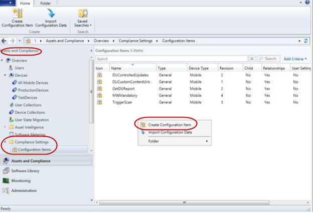
4.  输入的文件名 （如 GetDUReport)，然后选择**移动设备**。
5.  在**移动设备设置**页上，检查框**的默认设置组中不存在的配置的其他设置**，然后单击**下一步**。

    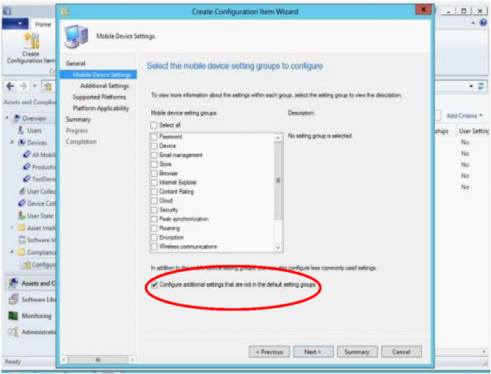
6.  在**其他设置**页上，单击**添加**。

    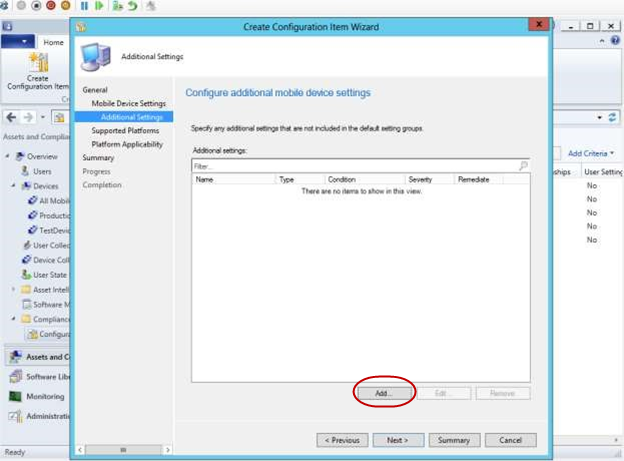
7.  在**浏览设置**页上，单击**创建设置**。

    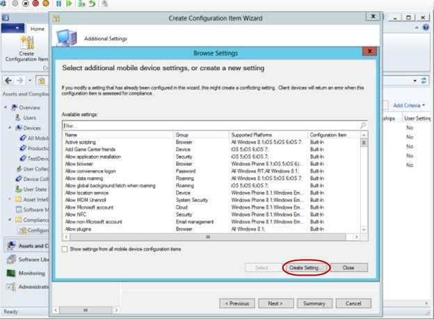
8.  请输入一个唯一的**名称**。 **设置类型**，选择**OMA URI**并选择**字符串****数据类型**。
9.  在**OMA URI**文本框中，输入`./Vendor/MSFT/EnterpriseExt/DeviceUpdate/UpdatesResultXml`，请单击**确定**。

    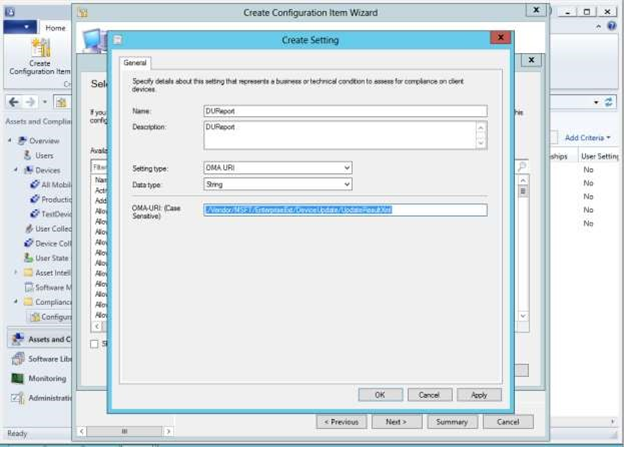
10. 在**浏览设置**页上，单击**关闭**。
11. 在**创建配置项向导**页上，检查**所有 Windows 嵌入式 8.1 掌上电脑**作为受支持的平台，，然后单击**下一步**。

    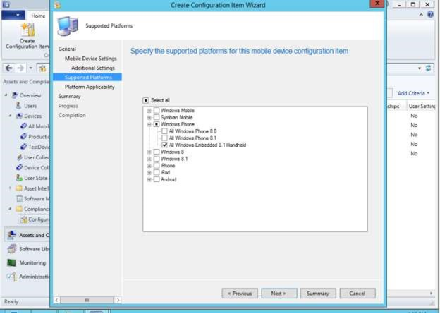
12. 关闭**创建配置项向导**页。
13. 用鼠标右键单击新创建的配置项，然后选择**符合性规则**选项卡。
14. 单击新创建的移动设备设置 （如 DUReport)，然后单击**选择**。
15. 请输入一个虚拟值 （例如 zzz) 不同的设备。

    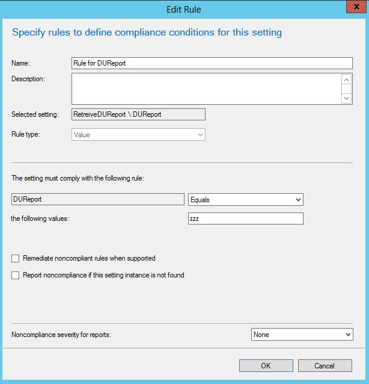
16. 通过取消选中**修正不符合规则时支持**选项禁用补救措施。
17. 单击**确定**以关闭编辑规则页。
18. 创建新的配置基线。 在**资产和法规遵从性** &gt; **合规性设置**，右击**配置基线**。
19. 选择**创建的配置项**。

    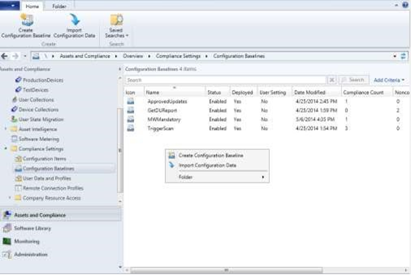
20. 输入的基准名称 （如 RetrieveDUReport)。
21. 添加您刚才创建的配置项。 选择**添加**，然后选择您刚创建 （例如 DUReport) 的配置项。

    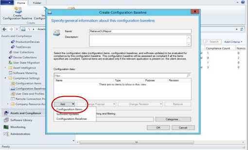
22. 单击**确定**，然后再次单击**确定**以完成配置基线。
23. 将新创建的配置基准部署到适当的设备集合。 右键单击您创建配置基线和选择的**部署**。

    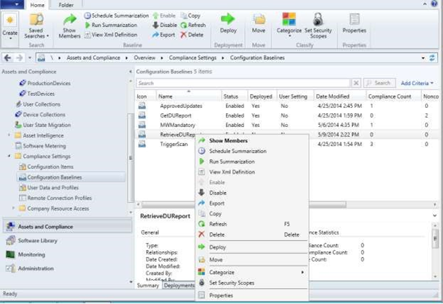
24. 选中复选框**时支持修正不符合规则**。
25. 选择适当的设备集合，定义日程安排。

    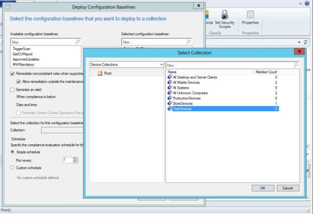
26. 若要查看 DUReport 的内容，选择适当的部署，为您创建配置 saseline。 在部署上右键单击，然后选择**视图状态**。
27. 单击**运行摘要**，然后单击**刷新**。 不符合选项卡上应列出测试设备。
28. 下**资产的详细信息**，请在测试设备上，右键单击，然后选择**模式的详细信息**。

    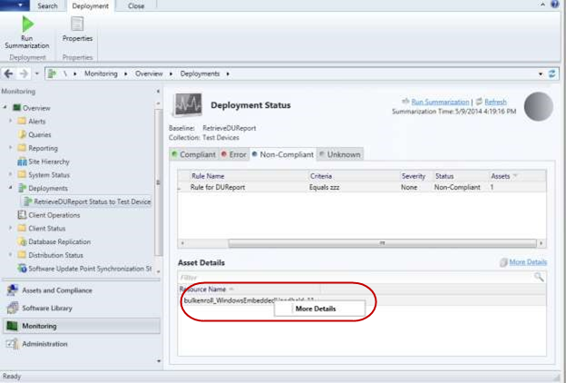
29. 不符合选项卡中您将会看到 DUReport，但您不能从这里检索内容。

    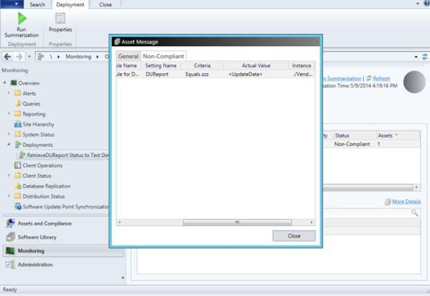
30. 若要检索 DUReport，打开资源管理器窗口到 c:\\程序文件\\SMS\_CCM\\SMS\_DM.log。
31. 在日志文件中，搜索从底部的"./Vendor/MSFT/EnterpriseExt/DeviceUpdate/UpdatesResultXml"RuleExression ="等于 zzz"zzz 所在的虚拟值。 上面这复制 UpdateData 的信息，并使用此信息来创建 DUControlledUpdates.xml。

 


