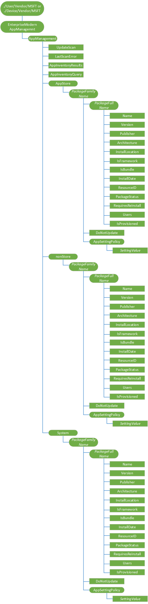
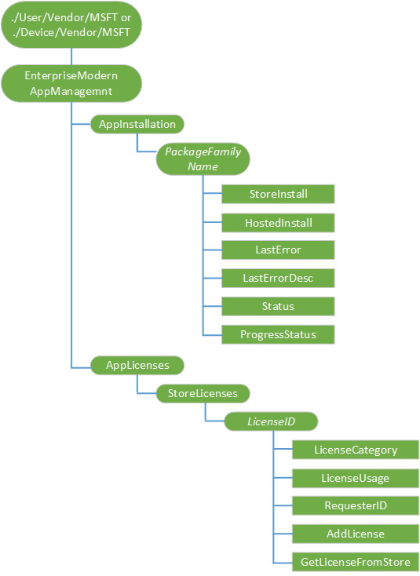

# <a name="enterprise-app-management"></a>企业应用程序管理

本主题介绍一个 Windows 10 中的键移动设备管理 (MDM) 功能的应用程序生命周期管理在所有 Windows。 是的能力来管理存储和应用非商店应用程序作为本机的 MDM 功能的一部分。 新 Windows 10 中是能够执行的所有应用程序的清单。

## <a name="application-management-goals"></a>应用程序管理目标

Windows 10 提供用于管理服务器的功能︰

-   安装业务直接从 Windows 应用商店应用程序
-   部署脱机存储应用程序和许可证
-   部署的业务线 (LOB) 应用程序 （非存储应用程序）
-   库存的所有应用程序用户 （存储和应用非商店应用程序）
-   库存设备 （存储和应用非商店应用程序） 的所有应用程序
-   卸载所有的应用程序用户 （存储和应用非商店应用程序）
-   提供应用程序以便安装为设备运行 Windows 10 对于桌面版本 （家庭、 Pro、 企业和教育） 的所有用户
-   删除运行 Windows 10 桌面版的设备上配置的应用程序

## <a name="inventory-your-apps"></a>库存应用程序

Windows 10 可以清点所有的应用程序部署到用户和 Windows 10 上桌面版本的设备的所有用户的所有应用程序。 [EnterpriseModernAppManagement](enterprisemodernappmanagement-csp.md)配置服务提供程序 (CSP) 清点打包应用程序并不包括传统的 Win32 应用程序通过 MSI 或可执行文件安装。 当应用程序正在清点分隔基于在以下应用程序分类︰

-   存储区-来自 Windows 应用商店应用程序。 可以直接从存储区中安装或从存储区为企业提供与企业应用程序
-   nonStore-不收购从 Windows 应用商店的应用程序。
-   系统的应用程序是操作系统的一部分。 您不能卸载这些应用程序。 此分类是只读的只可以清点。

这些分类都表示为 EnterpriseModernAppManagement CSP 中的节点。

下面的关系图以树格式显示 EnterpriseModernAppManagement CSP。



每个应用程序显示一个文件包系列名称和 1 n 包用于已安装的应用程序的完整名称。 应用程序分为基于其原点 （存储，nonStore，系统）。

库存可以通过全名包 AppManagement 节点中的任何级别的执行的递归。 也可以仅为特定库存属性执行库存。

库存是特定于包的全名和列表捆绑包和包家族名下适用的资源包。

> **请注意** Windows 10 手机，在 XAP 包有代替的包系列名称和包的全名的产品 ID。

 
下面是每个包的完整名称的节点︰

-   名称
-   版本
-   Publisher
-   体系结构
-   InstallLocation
-   IsFramework
-   IsBundle
-   InstallDate
-   资源 Id
-   RequiresReinstall
-   PackageStatus
-   用户
-   IsProvisioned

每个节点的详细说明，请参阅[EnterpriseModernAppManagement CSP](enterprisemodernappmanagement-csp.md)。

### <a name="app-inventory"></a>应用程序清单

查询 EnterpriseModernAppManagement CSP 可用于为用户或设备安装的所有应用程序。 该查询返回所有应用程序无论如何如果它们安装通过 MDM 或其他方法。 在设备级别的用户可以执行库存。 在设备级别库存将返回在设备上的所有用户的信息。

请注意，执行设备的完整清单基于硬件和已安装的应用程序的客户端上需要大量资源。 返回的数据可能也会非常大。 您可能想要分解这些请求的客户端和网络流量减少的影响。

下面是查询的设备上的所有应用程序的一个示例。

``` syntax
<!-- Get all apps under AppManagement -->
<Get>
   <CmdID>1</CmdID>
   <Item>
      <Target>
         <LocURI>./Device/Vendor/MSFT/EnterpriseModernAppManagement/AppManagement?list=StructData</LocURI>
      </Target>
   </Item>
</Get>
```

下面是为特定的应用程序的用户查询的一个示例。

``` syntax
<!-- Get all information of a specific app for a user -->
<Get>
   <CmdID>1</CmdID>
   <Item>
      <Target>
         <LocURI>./User/Vendor/MSFT/EnterpriseModernAppManagement/AppManagement/AppStore/{PackageFamilyName}?list=StructData</LocURI>
      </Target>
   </Item>
</Get>
```

### <a name="store-license-inventory"></a>许可证存储库存

查询 EnterpriseModernAppManagement CSP 可用于为用户或设备安装的所有应用程序许可证。 该查询返回所有应用程序许可证不管怎样如果它们安装通过 MDM 或其他方法。 在设备级别的用户可以执行库存。 在设备级别库存将返回在设备上的所有用户的信息。

下面是每个许可证 ID 的节点︰

-   LicenseCategory
-   LicenseUsage
-   RequestedID

每个节点的详细说明，请参阅[EnterpriseModernAppManagement CSP](enterprisemodernappmanagement-csp.md)。

> **请注意** 在 CSP 中，LicenseID 是获得许可证的内容 ID。


下面是设备上的所有应用程序许可证查询的一个示例。

``` syntax
<!-- Get all app licenses for the device -->
<Get>
   <CmdID>1</CmdID>
   <Item>
      <Target>
         <LocURI>./Device/Vendor/MSFT/EnterpriseModernAppManagement/AppLicenses/StoreLicenses?list=StructData</LocURI>
      </Target>
   </Item>
</Get>
```

下面是所有应用程序许可证的用户查询的一个示例。

``` syntax
<!-- Get a specific app license for a user -->
<Get>
   <CmdID>1</CmdID>
   <Item>
      <Target>
         <LocURI>./User/Vendor/MSFT/EnterpriseModernAppManagement/AppLicenses/StoreLicenses/{license id}?list=StructData</LocURI>
      </Target>
   </Item>
</Get>
```

## <a name="enable-the-device-to-install-non-store-apps"></a>使设备可以安装非存储应用程序

有两种基本类型的可部署的应用程序︰ 应用商店应用程序和企业签署的应用程序。 部署企业签名的应用程序，您必须启用设备上的设置，以便允许受信任的应用程序。 应用程序可以通过批准的 Microsoft 根 （例如赛门铁克） 签名、 企业部署或应用程序是自签名的根。 本部分介绍的步骤来配置非存储应用程序部署的设备。

### <a name="unlock-the-device-for-non-store-apps"></a>对于无店铺的应用设备解锁

若要部署不是来自 Windows 应用商店应用程序，您必须配置 ApplicationManagement/AllowAllTrustedApps 策略。 该策略允许非存储应用程序的安装在设备上，前提是没有为该设备上的证书链。 应用程序可以使用的设备 （例如，赛门铁克企业）、 企业拥有的根证书，或部署的设备上的对等信任证书的根证书进行签名。 有关部署的用户许可证的详细信息，请参阅[部署给用户脱机许可证](#deploy-an-offline-license-to-a-user)。

AllowAllTrustedApps 策略，可以安装应用程序信任的证书保存在设备上受信任的人员或设备的受信任的根中的根证书。 默认情况下，这意味着仅从 Windows 应用商店应用程序可以安装没有配置该策略。 如果管理服务器隐式设置为 off，设备上的 settings 面板中禁用设置。

有关 AllowAllTrustedApps 策略的详细信息，请参阅[策略的 CSP](policy-configuration-service-provider.md)。

下面是一些示例。

``` syntax
<!-- Get policy (Default)-->
<Get>
  <CmdID>1</CmdID>
  <Item>
    <Target>
      <LocURI>./Vendor/MSFT/Policy/Result/ApplicationManagement/AllowAllTrustedApps?list=StructData</LocURI>
    </Target>
    </Item>
</Get>
<!-- Update policy -->
<Replace>
  <CmdID>2</CmdID>
  <Item>
    <Target>                        
      <LocURI>./Vendor/MSFT/Policy/Config/ApplicationManagement/AllowAllTrustedApps</LocURI>
    </Target>
    <Meta> 
      <Format>int</Format> 
      <Type>text/plain</Type> 
    </Meta> 
    <Data>1</Data>                        
  </Item>
</Replace>
```

### <a name="unlock-the-device-for-developer-mode"></a>以开发人员模式运行设备解锁

Windows 10 的应用程序的开发不再需要特殊的许可证。 您可以启用调试和使用策略 CSP 中的 ApplicationManagement/AllowDeveloperUnlock 策略的非打包的应用程序的部署。

AllowDeveloperUnlock 策略，可以在该设备上的开发模式。 AllowDeveloperUnlock 未配置默认情况下，这意味着只有 Windows 应用商店应用程序可以安装。 如果管理服务器显式设置为 off，设备上的 settings 面板中禁用设置。

部署到 Windows 10 桌面版本的应用程序的要求对设备上的证书链。 应用程序可以使用的设备 （例如，赛门铁克企业）、 企业拥有的根证书，或部署的设备上的对等信任证书的根证书进行签名。 部署到 Windows 10 移动不会验证是否非存储应用程序的设备上有一个有效的信任根。

有关 AllowDeveloperUnlock 策略的详细信息，请参阅[策略的 CSP](policy-configuration-service-provider.md)。

下面是一个示例。

``` syntax
<!-- Get policy (Default)-->
<Get>
  <CmdID>1</CmdID>
  <Item>
    <Target>
      <LocURI>./Vendor/MSFT/Policy/Result/ApplicationManagement/AllowDeveloperUnlock?list=StructData</LocURI>
    </Target>
  </Item>
</Get>
<!-- Update policy -->
<Replace>
  <CmdID>2</CmdID>
  <Item>
    <Target>                  
      <LocURI>./Vendor/MSFT/Policy/Config/ApplicationManagement/AllowDeveloperUnlock</LocURI>
    </Target>
    <Meta> 
      <Format>int</Format> 
      <Type>text/plain</Type> 
    </Meta> 
    <Data>1</Data>                        
  </Item>
</Replace>
```

## <a name="install-your-apps"></a>安装您的应用程序

可以为特定的用户或设备上的所有用户安装应用程序。 直接从 Windows 应用商店或在某些情况下，从一个主机的位置，如本地磁盘、 UNC 路径或 HTTPS 位置安装应用程序。 使用[EnterpriseModernAppManagement 的 CSP](enterprisemodernappmanagement-csp.md)的 AppInstallation 节点安装应用程序。

### <a name="deploy-apps-to-user-from-the-store"></a>从存储区将应用程序部署到用户

若要直接从 Windows 应用商店将应用程序部署到用户，管理服务器将执行 EnterpriseModernAppManagement CSP 的 AppInstallation 节点上添加和执行命令。 这是仅在用户上下文中受支持，不支持的设备上下文中。

如果购买的商店的业务应用程序，该应用程序指定联机的许可证的应用程序和许可证必须获取直接从 Windows 应用商店。

下面是这种情况下的要求︰

-   应用程序指派给用户业务的存储区中的活动目录 Azure (AAD) 标识中。 你可以直接在商店中的业务，或通过管理服务器。
-   设备需要连接到 Windows 应用商店。
-   必须在设备上启用 Windows 应用商店服务。 请注意，可以通过企业管理员禁用 Windows 应用商店的用户界面
-   用户必须登录他们 AAD 的身份。

下面是一些示例。

``` syntax
<Exec>
   <CmdID>1</CmdID>
          <Item>
            <Target>
              <LocURI>./User/Vendor/MSFT/EnterpriseModernAppManagement/AppInstallation/{PackageFamilyName}/StoreInstall</LocURI>
            </Target>
            <Meta>
                <Format xmlns="syncml:metinf">xml</Format>
            </Meta>
            <Data><Application id="{ProductID}" flags="0" skuid=" "/></Data>
          </Item>
</Exec>
```

以下是以前版本中的更改︰

1.  "{CatID}"引用应更新为"{0} 产品 id}"。 此值获取作为存储业务管理工具的一部分。
2.  标志的值可以是"0"或"1"

    使用"0"时的管理工具回拨业务同步的存储为用户分配的应用程序的一个名额。 使用"1"时的管理工具不调用回业务同步的存储为用户分配的应用程序的一个名额。 如果有的话，CSP 将声明一个名额。

3.  Skuid 是一个新的参数所需。 此值获取作为管理工具同步到的商店的业务的一部分。

### <a name="deploy-an-offline-license-to-a-user"></a>部署到用户的脱机的许可证

如果您购买的商店的业务应用程序，该应用程序许可证必须部署到设备中。

应用程序许可证只需要作为初始安装的应用程序的一部分进行部署。 在更新期间，只有应用程序部署到用户。

在 SyncML，您需要在执行命令中指定以下信息︰

-   许可 ID-这在 LocURI 中指定。 脱机的许可证的许可证 ID 被称为"内容 ID"中的许可证文件。 您可以从 Base64 编码的许可证下载业务的存储区中检索这些信息。
-   许可的内容-这指定的数据部分中。 许可内容是 Base64 编码 blob 的许可。

这里是离线的许可证安装文件的示例。

``` syntax
<Exec>
   <CmdID>1</CmdID>
   <Item>
      <Target>          
         <LocURI>./User/Vendor/MSFT/EnterpriseModernAppManagement/AppLicenses/StoreLicenses/{LicenseID}/AddLicense</LocURI>
      </Target>
      <Meta>
         <Format xmlns="syncml:metinf">xml</Format>
      </Meta>
      <Data><License Content="{LicenseBlob}"></Data>
   </Item>
</Exec>
```

<a href="" id="deploy-from-hosted-loc"></a>
### <a name="deploy-apps-to-a-user-from-a-hosted-location"></a>从托管位置将应用程序部署到用户

如果您购买的商店的业务应用程序和应用程序指定为脱机的许可证或应用程序是一个非存储应用程序，则必须从托管位置部署应用程序。

下面是这种情况下的要求︰

-   应用程序的位置可以是本地文件系统 (c:\\StagedApps\\app1.appx)，一个 UNC 路径 (\\\\服务器\\共享\\app1.apx)，或 HTTPS 位置 (https://contoso.com/app1.appx\_
-   用户必须有权访问的内容的位置。 对于 HTTPs，您可以使用服务器身份验证或证书身份验证使用证书注册与相关。 支持，但由于缺乏身份验证要求而不建议使用 HTTP 位置。
-   该设备不需要向 Windows 应用商店，存储服务已连接或已启用 Windows 存储 UI。
-   用户必须登录，但与 AAD 标识的关联不是必需的。

> **请注意** 您必须解除锁定设备部署 nonStore 的应用程序或部署的脱机应用程序之前，必须部署应用程序许可证。 有关详细信息，请参阅[部署给用户脱机许可证](#deploy-an-offline-license-to-a-user)。

 
需要包系列名为添加命令，以确保正确去除在注销应用程序。

下面是业务线应用程序安装的一个示例。

``` syntax
<!-- Add PackageFamilyName -->
<Add>
   <CmdID>0</CmdID>
   <Item>
      <Target>
         <LocURI>./User/Vendor/MSFT/EnterpriseModernAppManagement/AppInstallation/{PackageFamilyName}</LocURI>
      </Target>
   </Item>
</Add> 
<!-- Install appx -->
<Exec>
   <CmdID>1</CmdID>
   <Item>
      <Target>
         <LocURI>./User/Vendor/MSFT/EnterpriseModernAppManagement/AppInstallation/{PackageFamilyName}/HostedInstall</LocURI>
      </Target>
      <Meta>
         <Format xmlns="syncml:metinf">xml</Format>
      </Meta>
      <Data><Application PackageUri="\\server\share\HelloWorld10.appx" /></Data>
   </Item>
</Exec>
```

下面是应用程序安装具有依赖项的示例。

``` syntax
<!-- Add PackageFamilyName -->
<Add>
   <CmdID>0</CmdID>
   <Item>
      <Target>
         <LocURI>./User/Vendor/MSFT/EnterpriseModernAppManagement/AppInstallation/{PackageFamilyName</LocURI>
      </Target>
   </Item>
</Add> 
<!-- Install appx with deployment options and framework dependencies-->
<Exec>
   <CmdID>1</CmdID>
   <Item>
      <Target>
         <LocURI>./User/Vendor/MSFT/EnterpriseModernAppManagement/AppInstallation/{PackageFamilyName}/HostedInstall</LocURI>
      </Target>
      <Meta>
         <Format xmlns="syncml:metinf">xml</Format>
      </Meta>
      <Data>
         <Application PackageUri="\\server\share\HelloWorld10.appx" DeploymentOptions="0" >
            <Dependencies>
                      <Dependency PackageUri=”\\server\share\HelloWorldFramework.appx” />
                <Dependency PackageUri=”\\server2\share\HelloMarsFramework.appx” />
            </Dependencies>
        </Application>
      </Data>
   </Item>
</Exec>
```

### <a name="provision-apps-for-all-users-of-a-device"></a>提供应用程序的所有用户的设备

资源调配允许您转移到设备应用程序和设备的所有用户可以都让应用程序在其下一次登录注册。 这只支持从业务商店中购买应用程序和应用程序指定为脱机的许可证或应用程序是一个非存储应用程序。 应用程序必须从宿主位置提供。 作为本地系统安装的应用程序。 要安装到一个本地文件共享，该设备的本地系统必须具有访问该共享。

下面是这种情况下的要求︰

-   应用程序的位置可以是本地文件系统 (c:\\StagedApps\\app1.appx)，一个 UNC 路径 (\\\\服务器\\共享\\app1.apx)，或 HTTPS 位置 (https://contoso.com/app1.appx\_
-   用户必须有权访问的内容的位置。 对于 HTTPs，您可以使用服务器身份验证或证书身份验证使用证书注册与相关。 支持，但由于缺乏身份验证要求而不建议使用 HTTP 位置。
-   该设备不需要连接到 Windows 应用商店，或者存储启用服务。
-   该设备不需要任何 AAD 标识或域成员身份。
-   NonStore 应用程序，您的设备必须锁定。
-   对于脱机应用商店的应用程序，必须在部署应用程序之前部署所需的许可证。

若要设置托管位置从设备上的所有用户的应用程序，管理服务器设备上下文中的 AppInstallation 节点上执行一个添加和执行命令。 需要包系列名为添加命令，以确保正确去除在注销应用程序。

> **请注意** 当您删除已设置的应用程序时，它不会删除它从已经安装了该应用程序的用户。

 

下面是一个示例应用程序安装。

> **请注意** 这是只支持 Windows 10 对于桌面版本。


``` syntax
<!-- Add PackageFamilyName -->
<Add>
   <CmdID>0</CmdID>
   <Item>
      <Target>
         <LocURI>./Device/Vendor/MSFT/EnterpriseModernAppManagement/AppInstallation/{PackageFamilyName</LocURI>
      </Target>
   </Item>
</Add> 
<!-- Provision appx to device -->
<Exec>
   <CmdID>1</CmdID>
   <Item>
      <Target>
         <LocURI>./Device/Vendor/MSFT/EnterpriseModernAppManagement/AppInstallation/{PackageFamilyName}/HostedInstall</LocURI>
      </Target>
      <Meta>
         <Format xmlns="syncml:metinf">xml</Format>
      </Meta>
      <Data><Application PackageUri="\\server\share\HelloWorld10.appx" /></Data>
   </Item>
</Exec>
```

HostedInstall Exec 命令包含需要嵌入的 XML 数据节点。 下面是 XML 数据的要求︰

-   应用程序节点具有所需的参数，能，可以是本地文件位置，UNC 或 HTTPs 位置。
-   可以指定依存关系如果所需的软件包一起安装。 这是可选的。

DeploymentOptions 参数为仅在用户上下文中可用。

下面是包含依赖项的应用程序安装的一个示例。

> **请注意** 这是只支持 Windows 10 对于桌面版本。


``` syntax
<!-- Add PackageFamilyName -->
<Add>
   <CmdID>0</CmdID>
   <Item>
      <Target>
         <LocURI>./Device/Vendor/MSFT/EnterpriseModernAppManagement/AppInstallation/{PackageFamilyName</LocURI>
      </Target>
   </Item>
</Add> 
<!-- Provision appx with framework dependencies-->
<Exec>
   <CmdID>1</CmdID>
   <Item>
      <Target>
         <LocURI>./Device/Vendor/MSFT/EnterpriseModernAppManagement/AppInstallation/{PackageFamilyName}/HostedInstall</LocURI>
      </Target>
      <Meta>
         <Format xmlns="syncml:metinf">xml</Format>
      </Meta>
      <Data>
         <Application PackageUri="\\server\share\HelloWorld10.appx" />
            <Dependencies>
                     <Dependency PackageUri=”\\server\share\HelloWorldFramework.appx” />
               <Dependency PackageUri="\\server2\share\HelloMarsFramework.appx"/>
            </Dependencies>
         </Application>
      </Data>
   </Item>
</Exec>
```

### <a name="get-status-of-app-installations"></a>获取应用程序安装状态

应用程序安装完成后，Windows 通知发送。 您也可以查询使用的 AppInstallation 节点的状态。 下面是信息的您可以在查询中得到的列表︰

-   状态-指示应用程序安装的状态。
    -   不\_已安装 (0)-该节点已添加，但是未完成执行。
    -   安装 (1)-已开始执行，但尚未完成部署。 如果部署完成，而不考虑 suceess 更新此值。
    -   失败 (2)-安装失败。 错误的详细信息可在 LastError 和 LastErrorDescription 下找到。
    -   (3)-已安装成功安装后此节点已被清除，但是在事件未完成清理 actio，这种状态可能会短暂显示。
-   LastError-这是由应用程序部署服务器报告的最后一个错误。
-   LastErrorDescription-描述了应用程序部署服务器报告的最后一个错误。
-   状态-这是一个整数，指示应用程序安装的进度。 在 https 位置的情况下，这显示了估计的下载进度。

    状态不是可用于设置并且仅用于基于用户的安装。 进行资源调配时，的值始终为 0。

成功安装应用程序时，该节点为清理和不再存在。 AppManagement 节点下，可以报告应用程序的状态。

下面是为特定的应用程序的安装查询的一个示例。

``` syntax
<!-- Get all app status under AppInstallation for a specific app-->
<Get>
   <CmdID>2</CmdID>
   <Item>
      <Target>    
         <LocURI>./User/Vendor/MSFT/EnterpriseModernAppManagement/AppInstallation/{PackageFamilyName}?list=StructData</LocURI>
      </Target>
   </Item>
</Get>
```

这里是查询的所有的应用程序安装的示例。

``` syntax
<!-- Get all app status under AppInstallation-->
<Get>
   <CmdID>2</CmdID>
   <Item>
      <Target>    
         <LocURI>./User/Vendor/MSFT/EnterpriseModernAppManagement/AppInstallation?list=StructData</LocURI>
      </Target>
   </Item>
</Get>
```

### <a name="alert-for-installation-completion"></a>完成安装的警报

安装应用程序可能需要一些时间才能完成，因此它们是以异步方式完成。 Exec 命令完成后，客户端发送到管理服务器的状态，通知，无论是失败还是成功。

这里是一种预警。

``` syntax
<Alert>
    <CmdID>4</CmdID>
    <Data>1226</Data>
        <Item>
            <Source>
                <LocURI>./User/Vendor/MSFT/EnterpriseModernAppManagement/AppInstallation/{PackageFamilyName}/HostedInstall</LocURI> 
            </Source>
            <Meta>
                <Type xmlns="syncml:metinf">Reversed-Domain-Name:com.microsoft.mdm.EnterpriseHostedAppInstall.result</Type>
                <Format xmlns="syncml:metinf">int</Format>
            </Meta>
            <Data>0</Data>
        </Item>
</Alert>
```

对于基于用户的安装，使用。 / 用户路径并为应用程序的资源调配使用。 / 设备路径。

数据字段值为 0 （零） 表示成功，否则它是一个错误代码。 如果没有出现故障，您可以从 AppInstallation 节点获得更多详细信息。

> **请注意** 到目前为止，用于存储应用程序安装警报尚不可用。


## <a name="uninstall-your-apps"></a>卸载应用程序

您可以从 Windows 10 设备用户卸载应用程序。 若要卸载的应用程序，则删除它从 CSP 的 AppManagement 节点中。 在 AppManagement 节点中，包被组织根据以下节点根据其来源︰

-   AppStore 的这些应用程序是为 Windows 应用商店中。 应用程序可以直接从存储区中安装或从业务的存储区传递到企业。
-   nonStore-无法从 Windows 应用商店购置这些应用程序。
-   系统的这些应用程序是操作系统的一部分。 您不能卸载这些应用程序。

要卸载的应用程序，则删除它之下，源节点、 包系列名称，并包的全名。 若要卸载 XAP，使用替代包系列 nane 和包的全名的产品 ID。

下面是一个示例卸载所有版本的用户应用程序。

``` syntax
<!-- Uninstall App for a Package Family-->
<Delete>
   <CmdID>1</CmdID>
   <Item>
      <Target>
         <LocURI>./User/Vendor/MSFT/EnterpriseModernAppManagement/AppManagement/AppStore/{PackageFamilyName}</LocURI>
      </Target>
   </Item>
</Delete>
```

下面是一个示例卸载用户应用程序的特定版本。

``` syntax
<!-- Uninstall App for a specific package full name-->
<Delete>
   <CmdID>1</CmdID>
   <Item>
      <Target>
         <LocURI>./User/Vendor/MSFT/EnterpriseModernAppManagement/AppManagement/AppStore/{PackageFamilyName}/{PackageFullName}</LocURI>
      </Target>
   </Item>
</Delete>
```

### <a name="removed-provisioned-apps-from-a-device"></a>从设备中删除已设置的应用程序

您可以删除特定版本或所有版本的包系列设备配置的应用程序。 删除已设置的应用程序后，不供将来用户设备。 已登录的用户拥有应用程序注册到它们将继续有权访问该应用程序。 如果您想要删除的用户的应用程序，您必须显式卸载该应用程序的用户。

> **请注意** 您只能删除应用程序具有的库存值 IsProvisioned = 1。

 
删除已设置的应用程序在设备上下文中发生。

下面是一个示例为从设备中删除已设置的应用程序。

``` syntax
<!— Remove Provisioned App for a Package Family-->
<Delete>
   <CmdID>1</CmdID>
   <Item>
      <Target>
         <LocURI>./Device/Vendor/MSFT/EnterpriseModernAppManagement/AppManagement/AppStore/{PackageFamilyName}</LocURI>
      </Target>
   </Item>
</Delete>
```

下面是一个用于从设备中删除已设置的应用程序的特定版本的示例︰

``` syntax
<!-- Remove Provisioned App for a specific package full name-->
<Delete>
   <CmdID>1</CmdID>
   <Item>
      <Target>
         <LocURI>./Device/Vendor/MSFT/EnterpriseModernAppManagement/AppManagement/AppStore/{PackageFamilyName}/{PackageFullName}</LocURI>
      </Target>
   </Item>
</Delete>
```

### <a name="remove-a-store-app-license"></a>移除存储区应用程序许可证

您可以从每个应用程序基于内容 ID 的设备删除应用程序许可证

下面是一个示例删除用户的应用程序的许可证。

``` syntax
<!-- Remove App License for a User-->
<Delete>
   <CmdID>1</CmdID>
   <Item>
      <Target>
         <LocURI>./User/Vendor/MSFT/EnterpriseModernAppManagement/AppLicenses/StoreLicenses/{license id}</LocURI>
      </Target>
   </Item>
</Delete>
```

下面是一个示例删除调配包 （设备上下文） 的应用程序许可证。

``` syntax
<!-- Remove App License for a provisioned package (device) -->
<Delete>
   <CmdID>1</CmdID>
   <Item>
      <Target>
         <LocURI>./Device/Vendor/MSFT/EnterpriseModernAppManagement/AppLicenses/StoreLicenses/{license id}</LocURI>
      </Target>
   </Item>
</Delete>
```

### <a name="alert-for-app-uninstallation"></a>通知应用程序卸载

卸载的应用程序可能需要一些时间完成，因此以异步方式执行卸载。 Exec 命令完成后，客户端发送到管理服务器的状态，通知，无论是失败还是成功。

基于用户卸载时，使用。 在 LocURI，并对资源调配功能，用户使用 /。 / LocURI 中的设备。

下面是一个示例。 只有一个卸载的承载和存储应用程序。

``` syntax
<Alert>
    <Data>1226</Data>
    <Item>
        <Source>
            <LocURI>./User/Vendor/MSFT/EnterpriseModernAppManagement/AppManagement/{PackageFamilyName}</LocURI>
        </Source>
        <Meta>
            <Type xmlns="syncml:metinf">Reversed-Domain-Name:com.microsoft.mdm.EnterpriseAppUninstall.result</Type>
            <Format xmlns="syncml:metinf">int</Format>
        </Meta>
        <Data>0</Data>
    </Item>
</Alert>
```

## <a name="update-your-apps"></a>更新您的应用程序

在设备上安装的应用程序可以使用管理服务器进行更新。 可以直接从存储区更新或从托管位置安装应用程序。

### <a name="update-apps-directly-from-the-store"></a>更新应用程序直接从存储区

若要更新 Windows 应用商店应用程序，设备需要与存储服务联系。

下面是示例的更新扫描。

``` syntax
<!— Initiate a update scan for a user-->
<Exec>
   <CmdID>1</CmdID>
   <Item>
      <Target>
         <LocURI>./User/Vendor/MSFT/EnterpriseModernAppManagement/AppManagement/UpdateScan</LocURI>
      </Target>
   </Item>
</Exec>
```

这里是一种状态检查。

``` syntax
<!— Get last error related to the update scan-->
<Get>
   <CmdID>1</CmdID>
   <Item>
      <Target>
         <LocURI>./User/Vendor/MSFT/EnterpriseModernAppManagement/AppManagement/LastScanError</LocURI>
      </Target>
   </Item>
</Get>
```

### <a name="update-apps-from-a-hosted-location"></a>更新应用程序中承载的位置

更新现有的应用程序作为初始安装的过程相同。 有关详细信息，请参阅[将用户从一个宿主位置部署应用程序](#deploy-apps-to-a-user-from-a-hosted-location)。


### <a name="update-provisioned-apps"></a>更新应用程序的资源调配

当应用程序更新发送给用户，提供应用程序自动更新。 您还可以更新初始设置为使用相同的过程配置应用程序。 初始配置的详细信息，请参阅[设备的所有用户提供应用程序](#provision-apps-for-all-users-of-a-device)。

### <a name="prevent-app-from-automatic-updates"></a>防止来自自动更新的应用程序

您可以阻止特定的应用程序可以自动更新。 这使您可以打开的应用程序，以排除由 IT 管理员定义的特定应用程序的自动更新

关闭更新仅适用于更新从 Windows 应用商店设备级别。 此功能在用户级别不可用。 如果推迟，从承载的安装位置离线包，您仍可以更新应用程序。

下面是一个示例。

``` syntax
<!— Prevent app from being automatically updated-->
<Replace>
   <CmdID>1</CmdID>
   <Item>
      <Target>
         <LocURI>./Device/Vendor/MSFT/EnterpriseModernAppManagement/AppManagement/AppStore/{PackageFamilyName}/DoNotUpdate</LocURI>
         </Target>
      <Meta>
         <Format xmlns="syncml:metinf">int</Format>
         <Type xmlns="syncml:metinf">text/plain</Type>
      </Meta>
      <Data>1</Data></Item>
</Replace>
```

## <a name="additional-app-management-scenarios"></a>其他应用程序管理方案

以下各节提供有关其他设置配置信息。

### <a name="restrict-app-installation-to-the-system-volume"></a>限制应用程序安装到系统卷

您可以在非系统卷，如第二个分区或可移动介质 （USB 或 SD 卡） 上安装应用程序。 使用 RestrictApptoSystemVolume 策略，您可以避免从获取安装或移动到非系统卷的应用程序。 有关此策略的详细信息，请参阅[策略的 CSP](policy-configuration-service-provider.md)。

> **请注意** 在移动设备中才支持此选项。


下面是一个示例。

``` syntax
<!-- Get policy (Default)-->
<Get>
   <CmdID>1</CmdID>
   <Item>
      <Target>
         <LocURI>./Vendor/MSFT/Policy/Result/ApplicationManagement/RestrictAppToSystemVolume?list=StructData</LocURI>
      </Target>
   </Item>
</Get>
<!-- Update policy -->
<Replace>
   <CmdID>2</CmdID>
   <Item>
      <Target>
         <LocURI>./Vendor/MSFT/Policy/Config/ApplicationManagement/RestrictAppToSystemVolume</LocURI>
      </Target>
   <Meta> 
      <Format>int</Format> 
      <Type>text/plain</Type> 
   </Meta> 
   <Data>1</Data>                        
</Item>
</Replace>
```

### <a name="restrict-appdata-to-the-system-volume"></a>限制对系统卷的应用程序数据

在 Windows 10 移动 IT 管理员可以设置策略以限制对系统卷上，而不考虑安装或移动包的位置的 Windows 应用商店应用程序的用户应用程序数据。

> **请注意** 功能是只针对 Windows 10 移动。

 
在[策略的 CSP](policy-configuration-service-provider.md)的 RestrictAppDataToSystemVolume 策略使您能够限制保持在系统卷上的所有用户应用程序数据。 如果没有配置该策略，或如果它被禁用，并且移动包或安装到不同的卷，然后用户应用程序数据将移动到同一个卷。 可以将此策略设置为 0 （关闭，默认值） 或 1。

下面是一个示例。

``` syntax
<!-- Get policy (Default)-->
<Get>
   <CmdID>1</CmdID>
   <Item>
      <Target>
         <LocURI>./Vendor/MSFT/Policy/Result/ApplicationManagement/RestrictAppDataToSystemVolume?list=StructData</LocURI>
      </Target>
   </Item>
</Get>
<!-- Update policy -->
<Replace>
   <CmdID>2</CmdID>
   <Item>
      <Target>                  
         <LocURI>./Vendor/MSFT/Policy/Config/ApplicationManagement/RestrictAppDataToSystemVolume</LocURI>
      </Target>
   <Meta> 
      <Format>int</Format> 
      <Type>text/plain</Type> 
   </Meta> 
   <Data>1</Data>                        
   </Item>
</Replace>
```

### <a name="enable-shared-user-app-data"></a>启用共享的用户应用程序数据

通用的 Windows 应用程序有应用程序之间共享数据的设备的用户的能力。 包系列级或每个设备，则可以设置共享数据的能力。

> **请注意** 这仅适用于多用户设备。


AllowSharedUserAppData 策略[策略 CSP](policy-configuration-service-provider.md)中的启用或禁用应用程序软件包应用程序软件包时有多个用户之间共享数据。 如果您启用此策略，应用程序可以共享包中包家庭成员之间的数据。 数据可以通过该封装家族和本地计算机的 ShareLocal 文件夹共享。 此文件夹是可通过 Windows.Storage API。

如果您禁用此策略，则应用程序不能共享用户应用程序数据在多个用户之间。 但是，预先编写的共享的数据将保持不变。 干净的预先编写好的共享的数据，使用 DISM ((/ Get-ProvisionedAppxPackage 来检测是否存在任何共享数据和 /Remove-SharedAppxData 以将其删除)。

有效的值是 0 （关闭，默认值） 和 1 （打开）。

下面是一个示例。

``` syntax
<!-- Get policy (Default)-->
<Get>
   <CmdID>1</CmdID>
   <Item>
      <Target>
         <LocURI>./Vendor/MSFT/Policy/Result/ApplicationManagement/AllowSharedUserAppData?list=StructData</LocURI>
      </Target>
   </Item>
</Get>
<!-- Update policy -->
<Replace>
   <CmdID>2</CmdID>
   <Item>
      <Target>                  
         <LocURI>./Vendor/MSFT/Policy/Config/ApplicationManagement/AllowSharedUserAppData</LocURI>
      </Target>
   <Meta> 
      <Format>int</Format> 
      <Type>text/plain</Type> 
   </Meta> 
   <Data>1</Data>                        
   </Item>
</Replace>
```

 


