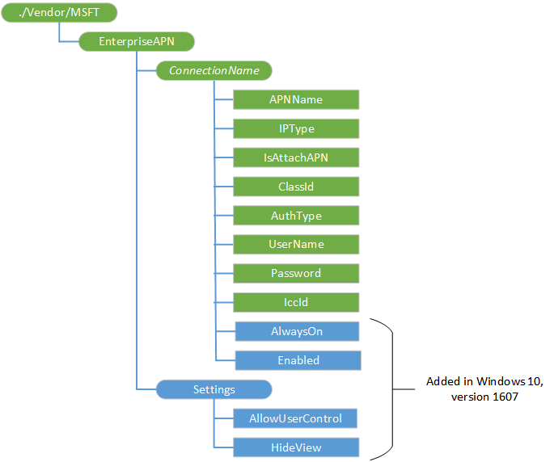

# EnterpriseAPN 的 CSP

企业使用 EnterpriseAPN 配置服务提供程序 (CSP) 提供 APN 互联网。

> **请注意**EnterpriseAPN 配置服务提供程序 (CSP) 不支持在 Windows 10 对于桌面版本 （家庭、 Pro、 企业和教育）。

下面的图像以树格式显示 EnterpriseAPN 配置服务提供程序。

**EnterpriseAPN**  
EnterpriseAPN 配置服务提供程序的根节点。

**EnterpriseAPN / ***_ConnectionName_**  
通过 Windows 连接管理器中所示的连接的名称。

支持的操作是添加 Get，删除和替换。

* *EnterpriseAPN /*ConnectionName*/APNName**  
企业 APN 名称。

支持的操作是添加 Get，删除和替换。

* *EnterpriseAPN /*ConnectionName*/IPType**  
此值可以是下列项之一︰

-   IPv4 的仅 IPV4 连接类型
-   IPv6 的只有 IPv6 连接类型
-   IPv4v6 （缺省）-IPv4 和 IPv6 同时。
-   IPv4v6xlat-46xlat 提供的 ipv4 的 IPv6

支持的操作是添加 Get，删除和替换。

* *EnterpriseAPN /*ConnectionName*/IsAttachAPN**  
布尔值，该值指示是否应作为一部分的 LTE 附加请求此 APN。 默认值为 false。

支持的操作是添加 Get，删除和替换。

* *EnterpriseAPN /*ConnectionName*/ClassId**  
定义到调制解调器的 APN 类的 GUID。 这等同于在 CM 中 OEMConnectionId\_CellularEntries 的 CSP。 通常此设置不存在。 它只是在 IsAttachAPN 为 true 并且 APN 不只用作互联网 APN 连接时所需。

支持的操作是添加 Get，删除和替换。

* *EnterpriseAPN /*ConnectionName*/AuthType**  
身份验证类型。 此值可以是下列项之一︰

-   无 （默认值）
-   自动
-   PAP
-   CHAP
-   MSCHAPv2

支持的操作是添加 Get，删除和替换。

* *EnterpriseAPN /*ConnectionName*/UserName**  
使用 PAP，CHAP 或 MSCHAPv2 身份验证的用户名。

支持的操作是添加 Get，删除和替换。

* *EnterpriseAPN /*ConnectionName*/Password**  
与用户名对应的密码。

支持的操作是添加 Get，删除和替换。

* *EnterpriseAPN /*ConnectionName*/IccId**  
集成电路卡 ID (ICCID) 与蜂窝连接配置文件关联。 如果此节点不存在，则使用 UICC ICCID 的单插槽设备和使用的活动数据 UICC ICCID 的双槽设备创建连接。

支持的操作是添加 Get，删除和替换。

* *EnterpriseAPN /*ConnectionName*/AlwaysOn**  
添加到 Windows 10，1607年版本中。 指定是否自动尝试厘米时存在的连接连接到 APN 的布尔值。

默认值为 true。

支持的操作是添加 Get，删除和替换。

* *EnterpriseAPN /*ConnectionName*/ 启用 * *  
添加到 Windows 10，1607年版本中。 布尔值，指定是否启用该连接。

默认值为 true。

支持的操作是添加 Get，删除和替换。

**EnterpriseAPN 中的设置**  
添加到 Windows 10，1607年版本中。 包含全局设置的节点。

**EnterpriseAPN/设置/AllowUserControl**  
添加到 Windows 10，1607年版本中。 布尔值，该值指定是否允许手机用户体验用户连接企业 APN 以外其他 APNs。

默认值为 false。

支持的操作包括获取和替换。

**EnterpriseAPN/设置/HideView**  
添加到 Windows 10，1607年版本中。 布尔值，它指定手机用户体验是否将允许用户查看企业 APNs。 如果 AllowUserControl 为 true 只适用。

默认值为 false。

支持的操作包括获取和替换。

## 相关的主题

[配置服务提供程序的引用](configuration-service-provider-reference.md)

 

 

