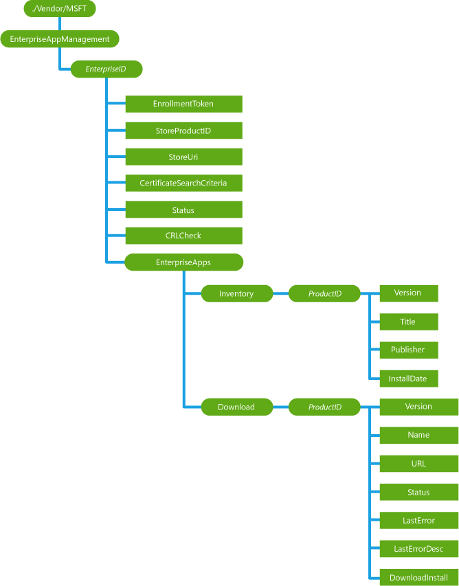

# <a name="enterpriseappmanagement-csp"></a>EnterpriseAppManagement 的 CSP


EnterpriseAppManagement 企业配置服务提供程序用于处理企业应用程序管理任务，如安装的企业应用程序令牌查询 （名称和版本），在安装的企业应用程序的第一个自动下载应用程序链接自动更新已经安装企业应用程序，并且在注销过程中删除所有已安装的企业应用程序 （包括企业应用程序的标记）。

> **请注意**  在 Windows 10 Mobile 只支持 EnterpriseAppManagement CSP。

 

下面的关系图以树格式显示 EnterpriseAppManagement 配置服务提供程序。



<a href="" id="enterpriseid"></a>***EnterpriseID***  
可选项。 表示一个 GUID 作为 EnterpriseID 的动态节点。 它用于注册或 unenroll 的企业应用程序。

受支持的操作，添加，删除，并获得。

<a href="" id="enterpriseid-enrollmenttoken"></a>***EnterpriseID*/EnrollmentToken**  
必需。 用来安装或更新的二进制表示形式的应用程序注册标记 (AET) 并启动"呼叫总部"令牌验证。 作用域是动态的。

支持的操作是 Get，添加和替换。

<a href="" id="enterpriseid-storeproductid"></a>***EnterpriseID*/StoreProductID**  
必需。 要承载的产品 id 节点的节点。 作用域是动态的。

受支持的操作是获得。

<a href="" id="-storeproductid-productid"></a>**/ StoreProductID/产品 Id**  
第一个企业应用程序 （通常一个公司中心应用程序），它会自动安装在设备上的 ID 的字符串。 作用域是动态的。

支持的操作包括获取和添加。

<a href="" id="enterpriseid-storeuri"></a>***EnterpriseID*/StoreUri**  
可选项。 包含设备上安装的第一个企业应用程序的 URI 的字符串。 注册客户端下载并安装此 URI 从该应用程序。 作用域是动态的。

支持的操作包括获取和添加。

<a href="" id="enterpriseid-certificatesearchcriteria"></a>***EnterpriseID*/CertificateSearchCriteria**  
可选项。 字符的字符串，其中包含搜索条件来搜索 DM 注册的客户端证书。 证书用于在企业应用程序下载的客户端身份验证。 该公司的应用程序内容服务器应使用企业注册的客户端证书验证此设备。 值必须是 URL 编码表示的 X.500 可分辨名称的客户端证书主题属性。 X.500 名称必须符合[CertStrToName](http://go.microsoft.com/fwlink/p/?LinkId=523869)函数所要求的格式。 该搜索参数是区分大小写的。 作用域是动态的。

支持的操作包括获取和添加。

> **请注意**  不要使用主题 = CN %3db1c43cd0-1624年-5FBB-8E54-34CF17DFD3A1\\x00。 服务器必须替换此值中提供的客户端证书。 如果您的服务器返回客户端证书包含相同主题的值，这可能导致意外的行为。 服务器应始终重写主题值并使用默认提供设备的设备 ID 主题 = 主题 = CN %3db1c43cd0-1624年-5FBB-8E54-34CF17DFD3A1\\x00

 

<a href="" id="enterpriseid-status"></a>***EnterpriseID*/Status**  
必需。 整数值，该值指示应用程序注册的当前状态。 有效值为 0 （已启用），1 (安装\_已禁用)，2 （吊销） 和 3 （无效）。 作用域是动态的。

受支持的操作是获得。

<a href="" id="enterpriseid-crlcheck"></a>***EnterpriseID*/CRLCheck**  
可选项。 当使用证书进行服务器身份验证设备是否应进行 CRL 检查指定的字符值。 有效的值为"1"（CRL 检查所需），"0"（CRL 检查不需要）。 作用域是动态的。

支持的操作是 Get，添加和替换。

<a href="" id="enterpriseid-enterpriseapps"></a>***EnterpriseID*/EnterpriseApps**  
必需。 对单个企业应用程序的根节点相关的设置。 作用域是动态 （自动 EnterpriseID 添加到配置服务提供程序时创建此节点）。

受支持的操作是获得。

<a href="" id="-enterpriseapps-inventory"></a>**/ EnterpriseApps/库存**  
必需。 单个企业应用程序清单设置根节点。 作用域是动态 （自动 EnterpriseID 添加到配置服务提供程序时创建此节点）。

受支持的操作是获得。

<a href="" id="-inventory-productid"></a>**/ 库存 / ***_产品 id_**  
可选项。 一个包含 s 单个企业应用程序中的 GUID 格式的产品 ID 的节点。 作用域是动态的。

受支持的操作是获得。

<a href="" id="-inventory-productid-version"></a>* */Inventory/*产品 id*/Version**  
必需。 包含安装的企业应用程序的当前版本的字符串。 作用域是动态的。

受支持的操作是获得。

<a href="" id="-inventory-productid-title"></a>* */Inventory/*产品 id*/Title**  
必需。 包含安装的企业应用程序的名称的字符串。 作用域是动态的。

受支持的操作是获得。

<a href="" id="-inventory-productid-publisher"></a>* */Inventory/*产品 id*/Publisher**  
必需。 包含安装的企业应用程序的发布者的名称的字符串。 作用域是动态的。

受支持的操作是获得。

<a href="" id="-inventory-productid-installdate"></a>* */Inventory/*产品 id*/InstallDate**  
必需。 时间 (字符格式 YYYY-毫米-DD-: 分︰ 秒) 安装或更新应用程序。 作用域是动态的。

受支持的操作是获得。

<a href="" id="-enterpriseapps-download"></a>**/ EnterpriseApps/下载**  
必需。 此节点分组应用程序下载相关参数。 企业服务器可以自动只更新当前已安装的企业应用程序。 最终用户控制要下载和安装的企业应用程序。 作用域是动态的。

受支持的操作是获得。

<a href="" id="-download-productid"></a>**/ 下载 / ***_产品 id_**  
可选项。 此节点包含有关安装的企业应用程序的 GUID。 每个已安装的应用程序都有一个唯一的 id。 作用域是动态的。

支持的操作是 Get，添加和替换。

<a href="" id="-download-productid-version"></a>* */Download/*产品 id*/Version**  
可选项。 包含当前正在下载的应用程序 （由调用方设置） 的版本信息的字符串。 作用域是动态的。

支持的操作是 Get，添加和替换。

<a href="" id="-download-productid-name"></a>* */Download/*产品 id*/Name**  
必需。 包含已安装的应用程序的名称的字符串。 作用域是动态的。

受支持的操作是获得。

<a href="" id="-download-productid-url"></a>* */Download/*产品 id*/URL**  
可选项。 安装的应用程序的更新版本的 URL 的字符串。 该设备将从该链接下载应用程序更新。 作用域是动态的。

支持的操作是 Get，添加和替换。

<a href="" id="-download-productid-status"></a>* */Download/*产品 id*/Status**  
必需。 整数值，它指示当前的状态下载过程。 下表显示了可能的值。

<table>
<colgroup>
<col width="50%" />
<col width="50%" />
</colgroup>
<tbody>
<tr class="odd">
<td><p>0︰ 确认</p></td>
<td><p>等待用户确认。</p></td>
</tr>
<tr class="even">
<td><p>1︰ 排队</p></td>
<td><p>正在等待下载启动。</p></td>
</tr>
<tr class="odd">
<td><p>2︰ 下载</p></td>
<td><p>正在下载。</p></td>
</tr>
<tr class="even">
<td><p>3︰ 下载</p></td>
<td><p>等待安装开始。</p></td>
</tr>
<tr class="odd">
<td><p>4︰ 安装</p></td>
<td><p>安装的移交。</p></td>
</tr>
<tr class="even">
<td><p>5︰ 安装</p></td>
<td><p>已成功安装</p></td>
</tr>
<tr class="odd">
<td><p>6︰ 失败</p></td>
<td><p>应用程序被拒绝 （不正确地签名，XAP 格式错误，未正确注册，等等。）</p></td>
</tr>
<tr class="even">
<td><p>7:DOWNLOAD_FAILED</p></td>
<td><p>无法连接到服务器，文件不存在，等等。</p></td>
</tr>
</tbody>
</table>

 

作用域是动态的。 支持的操作是 Get，添加和替换。

<a href="" id="-download-productid-lasterror"></a>* */Download/*产品 id*/LastError**  
必需。 整数值，它指示相应的 HRESULT 的上一个错误代码。 如果不有任何错误，则值为 0 (S\_确定)。 作用域是动态的。

受支持的操作是获得。

<a href="" id="-download-productid-lasterrordesc"></a>* */Download/*产品 id*/LastErrorDesc**  
必需。 上一个错误代码的可读说明的字符串。

<a href="" id="-download-productid-downloadinstall"></a>* */Download/*产品 id*/DownloadInstall**  
必需。 该节点以使服务器能够触发下载和安装更新版本的用户安装应用程序。 此节点的格式为空。 服务器必须查询设备以后确定的状态。 对于每个产品 ID，状态字段可保留最多的一周。 作用域是动态的。

受支持的操作被执行。

## <a name="remarks"></a>备注


### <a name="install-and-update-line-of-business-lob-applications"></a>安装和更新业务 (LOB) 应用程序

工作区可以自动安装和更新管理会话期间的业务线应用程序。 业务线应用程序支持多种文件类型包括 XAP （8.0 和 8.1），AppX 和 AppXBundles。 工作场所也可以更新到 Appx XAP 文件格式并通过同一渠道的 AppxBundle 格式的应用程序。 有关详细信息，请参见示例部分。

### <a name="uninstall-line-of-business-lob-applications"></a>卸载的业务线 (LOB) 应用程序

工作区可以远程卸载业务线应用程序在设备上。 不能用于这种机制要卸载存储设备上的应用程序或业务线应用程序未安装由注册工作场所 （侧加载应用程序方案）。 有关详细信息，请参见示例部分

### <a name="query-installed-store-application"></a>查询存储应用程序安装

您可以确定存储应用程序是否已安装在系统上。 首先，您需要存储应用程序的 GUID。 可以通过直接转至存储应用程序的 URL 获取存储应用程序的 GUID。

Microsoft 存储应用程序都有一个 GUID 的 d5dc1ebb-a7f1-df11-9264-00237de2db9e。

使用下面的 SyncML 格式查询到托管设备上是否已安装了该应用程序，请参阅︰

``` syntax
<Get>
      <CmdID>1</CmdID>
      <Item>
        <Target>
          <LocURI>./Vendor/MSFT/EnterpriseAppManagement/4000000001/EnterpriseApps/Inventory/%7B D5DC1EBB-A7F1-DF11-9264-00237DE2DB9E%7D</LocURI>
        </Target>
      </Item>
    </Get>
```

从设备 （如果设备中安装了此应用程序，它包含的子节点列表） 的响应。

``` syntax
<Results>
   <CmdID>3</CmdID>
   <MsgRef>1</MsgRef>
   <CmdRef>2</CmdRef>
   <Item>
      <Source>
          <LocURI>
             ./Vendor/MSFT/EnterpriseAppManagement/4000000001/EnterpriseApps/Inventory/%7B D5DC1EBB-A7F1-DF11-9264-00237DE2DB9E%7D</LocURI>
      </Source>
      <Meta>
         <Format xmlns="syncml:metinf">node</Format>
         <Type xmlns="syncml:metinf"></Type>
      </Meta>
<Data>Version/Title/Publisher/InstallDate</Data>
   </Item>
</Results>
```

### <a name="node-values"></a>节点值

在 ProviderID 内部节点下的所有节点值都表示管理服务器要设置的策略值。

-   这些节点上的添加或替换命令返回成功在这两个以下的情况︰

    -   到设备实际应用价值。

    -   值不被应用于设备，因为该设备具有已设置的更安全值。

从安全的角度看，该设备符合至少请求一个安全策略要求。

-   Get 命令这些节点上的返回服务器向下推到设备的值。

-   如果替换命令失败，节点值设置为以前的值替换命令应用前。

-   如果添加命令失败，则不会创建该节点。

实际应用于该设备的值可以通过 DeviceValue 内部节点下的节点进行查询。

## <a name="oma-dm-examples"></a>OMA DM 示例


第一次注册企业 ID"4000000001":

``` syntax
<Add>
   <CmdID>2</CmdID>
   <Item>
      <Target>
         <LocURI>./Vendor/MSFT/EnterpriseAppManagement/4000000001/EnrollmentToken</LocURI>
      </Target>
      <Meta>
         <Format xmlns="syncml:metinf">chr</Format>
      </Meta>
      <Data>InsertTokenHere</Data>
   </Item>
   <Item>
      <Target>
         <LocURI>./Vendor/MSFT/EnterpriseAppManagement/4000000001/CertificateSearchCriteria
         </LocURI>
      </Target>
      <Meta>
         <Format xmlns="syncml:metinf">chr</Format>
      </Meta>
      <Data>SearchCriteriaInsertedHere</Data>
   </Item>
</Add>
```

更新 （例如，若要更新一个过期的应用程序注册令牌） 的注册标记︰

``` syntax
<Replace>
   <CmdID>2</CmdID>
   <Item>
      <Target>
         <LocURI>./Vendor/MSFT/EnterpriseAppManagement/4000000001/EnrollmentToken</LocURI>
      </Target>
      <Meta>
         <Format xmlns="syncml:metinf">chr</Format>
      </Meta>
      <Data>InsertUpdaedTokenHere</Data>
   </Item>
</Replace>
```

查询所有已安装的应用程序属于企业 id"4000000001":

``` syntax
<Get>
   <CmdID>2</CmdID>
   <Item>
      <Target>
          <LocURI>
    ./Vendor/MSFT/EnterpriseAppManagement/4000000001/EnterpriseApps/Inventory?list=StructData
          </LocURI>
      </Target>
   </Item>
</Get>
```

从设备 （其中包含两个已安装的应用程序） 的响应︰

``` syntax
<Results>
   <CmdID>3</CmdID>
   <MsgRef>1</MsgRef>
   <CmdRef>2</CmdRef>
   <Item>
      <Source>
          <LocURI>
             ./Vendor/MSFT/EnterpriseAppManagement/4000000001/EnterpriseApps/Inventory
          </LocURI>
      </Source>
      <Meta>
         <Format xmlns="syncml:metinf">node</Format>
         <Type xmlns="syncml:metinf"></Type>
      </Meta>
   </Item>
   <Item>
      <Source>
         <LocURI>
./Vendor/MSFT/EnterpriseAppManagement/4000000001/EnterpriseApps/Inventory/%7BB316008A-141D-4A79-810F-8B764C4CFDFB%7D 
         </LocURI>
      </Source>
      <Meta>
         <Format xmlns="syncml:metinf">node</Format>
         <Type xmlns="syncml:metinf"></Type>
      </Meta>
   </Item>
   <Item>
      <Source>
         <LocURI>
./Vendor/MSFT/EnterpriseAppManagement/4000000001/EnterpriseApps/Inventory/%7BB0322158-C3C2-44EB-8A31-D14A9FEC450E%7D
         </LocURI>
      </Source>
      <Meta>
         <Format xmlns="syncml:metinf">node</Format>
         <Type xmlns="syncml:metinf"></Type>
      </Meta>
   </Item>
   <Item>
      <Source>
         <LocURI>
./Vendor/MSFT/EnterpriseAppManagement/4000000001/EnterpriseApps/Inventory/%7BB0322158-C3C2-44EB-8A31-D14A9FEC450E%7D/Version
         </LocURI>
      </Source>
      <Data>1.0.0.0</Data>
   </Item>
   <Item>
      <Source>
         <LocURI>
./Vendor/MSFT/EnterpriseAppManagement/4000000001/EnterpriseApps/Inventory/%7BB0322158-C3C2-44EB-8A31-D14A9FEC450E%7D/Title
         </LocURI>
      </Source>
      <Data>Sample1</Data>
   </Item>
   <Item>
      <Source>
         <LocURI>
./Vendor/MSFT/EnterpriseAppManagement/4000000001/EnterpriseApps/Inventory/%7BB0322158-C3C2-44EB-8A31-D14A9FEC450E%7D/Publisher
         </LocURI>
      </Source>
      <Data>ExamplePublisher</Data>
   </Item>
   <Item>
      <Source>
         <LocURI>
./Vendor/MSFT/EnterpriseAppManagement/4000000001/EnterpriseApps/Inventory/%7BB0322158-C3C2-44EB-8A31-D14A9FEC450E%7D/InstallDate
         </LocURI>
      </Source>
      <Data>2012-10-30T21:09:52Z</Data>
   </Item>
   <Item>
      <Source>
         <LocURI>
./Vendor/MSFT/EnterpriseAppManagement/4000000001/EnterpriseApps/Inventory/%7BB0322158-C3C2-44EB-8A31-D14A9FEC450E%7D/Version
         </LocURI>
      </Source>
      <Data>1.0.0.0</Data>
   </Item>
   <Item>
      <Source>
         <LocURI>
./Vendor/MSFT/EnterpriseAppManagement/4000000001/EnterpriseApps/Inventory/%7BB0322158-C3C2-44EB-8A31-D14A9FEC450E%7D/Title
         </LocURI>
      </Source>
      <Data>Sample2</Data>
   </Item>
   <Item>
      <Source>
         <LocURI>
./Vendor/MSFT/EnterpriseAppManagement/4000000001/EnterpriseApps/Inventory/%7BB0322158-C3C2-44EB-8A31-D14A9FEC450E%7D/Publisher
         </LocURI>
      </Source>
      <Data>Contoso</Data>
   </Item>
   <Item>
      <Source>
         <LocURI>
./Vendor/MSFT/EnterpriseAppManagement/4000000001/EnterpriseApps/Inventory/%7BB0322158-C3C2-44EB-8A31-D14A9FEC450E%7D/InstallDate
         </LocURI>
      </Source>
      <Data>2012-10-31T21:23:31Z</Data>
   </Item>
</Results>
```

## <a name="install-and-update-an-enterprise-application"></a>安装并更新企业应用程序


安装或更新产品 ID"{B316008A-141D-4A79-810F-8B764C4CFDFB}"已安装的应用程序。

要执行 XAP 更新、 创建名称、 URL、 版本和 DownloadInstall 节点首先，然后执行"执行"（"原子"操作中所有） 的"DownloadInstall"节点上。 如果不存在该应用程序，该应用程序将以静默方式安装无需任何用户交互。 如果无法安装应用程序，将与一个警报对话框通知用户。

> **请注意**  
1.  如果以前的应用程序更新节点存在的 （达 1 周或 7 天安装完成后，该节点可持久保存） 此产品 ID，然后 418 （已经存在） 在"添加"，则会返回错误。 为避免 418 错误，服务器应发出替换命令的名称、 URL 和版本节点，并再执行"DownloadInstall"（在"原子"操作）。

2.  应用程序产品 ID 大括号需要进行转义，其中 {%7b 是和} %7 D。

 

``` syntax
<Atomic>
   <CmdID>2</CmdID>
   <!-- The Add command can be used if the download node does not have a matching product ID
        node in it or if the application was installer 7 or more days old. Otherwise, use the Replace command. -->
   <Add>
      <CmdID>3</CmdID>
      <Item>
         <Target>
            <LocURI>
./Vendor/MSFT/EnterpriseAppManagement/4000000001/EnterpriseApps/Download/%7BB316008A-141D-4A79-810F-8B764C4CFDFB%7D/Name
            </LocURI>
         </Target>
         <Meta>
            <Format xmlns="syncml:metinf">chr</Format>
         </Meta>
         <Data>ContosoApp1</Data>
      </Item>
      <Item>
         <Target>
            <LocURI>
./Vendor/MSFT/EnterpriseAppManagement/4000000001/EnterpriseApps/Download/%7BB316008A-141D-4A79-810F-8B764C4CFDFB%7D/URL
            </LocURI>
         </Target>
         <Meta>
            <Format xmlns="syncml:metinf">chr</Format>
         </Meta>
         <Data>http://contoso.com/enterpriseapps/ContosoApp1.xap</Data>
      </Item>
      <Item>
         <Target>
            <LocURI>
./Vendor/MSFT/EnterpriseAppManagement/4000000001/EnterpriseApps/Download/%7BB316008A-141D-4A79-810F-8B764C4CFDFB%7D/Version</LocURI>
         </Target>
         <Meta>
            <Format xmlns="syncml:metinf">chr</Format>
         </Meta>
         <Data>2.0.0.0</Data>
      </Item>
      <Item>
         <Target>
            <LocURI>
./Vendor/MSFT/EnterpriseAppManagement/4000000001/EnterpriseApps/Download%7BB316008A-141D-4A79-810F-8B764C4CFDFB%7D/DownloadInstall
            </LocURI>
         </Target>
         <Data>1</Data>
      </Item>
   </Add>
   <Exec>
      <CmdID>4</CmdID>
      <Item>
         <Target>
            <LocURI>
./Vendor/MSFT/EnterpriseAppManagement/4000000001/EnterpriseApps/Download/%7BB316008A-141D-4A79-810F-8B764C4CFDFB%7D/DownloadInstall
            </LocURI>
         </Target>
         <Meta>
            <Format xmlns="syncml:metinf">int</Format>
         </Meta>
         <Data>0</Data>
      </Item>
   </Exec>
</Atomic>
```

## <a name="uninstall-enterprise-application"></a>卸载企业应用程序


卸载产品 id 为"{7BB316008A-141 D-4A79-810F-8B764C4CFDFB}"已安装的企业应用程序︰

``` syntax
<SyncML xmlns="SYNCML:SYNCML1.2">
  <SyncBody>
    <Delete>
      <CmdID>2</CmdID>
      <Item>
        <Target>
          <LocURI>./Vendor/MSFT/EnterpriseAppManagement/4000000001/EnterpriseApps/Inventory/%7BB316008A-141D-4A79-810F-8B764C4CFDFB%7D</LocURI>
        </Target>
      </Item>
    </Delete>
    <Final/>
  </SyncBody>
</SyncML>
```

## <a name="related-topics"></a>相关的主题


[配置服务提供程序的引用](configuration-service-provider-reference.md)

 

 


