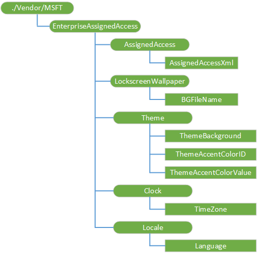
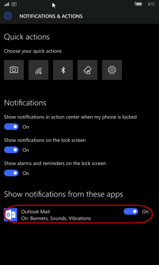

# <a name="enterpriseassignedaccess-csp"></a>EnterpriseAssignedAccess 的 CSP


EnterpriseAssignedAccess 配置服务提供程序允许 IT 管理员配置设置，例如语言和主题，锁定设备，并在设备上配置自定义布局。 例如，管理员可以锁定设备，以便只允许列表中指定的应用程序是可用。 不在允许列表上的应用程序保留其安装在设备上，而是从视图中隐藏，阻止其启动。

> **请注意**  在 Windows 10 Mobile 只支持 EnterpriseAssignedAccess CSP。

 

有关如何在运行时锁定 XML 与交互的详细信息，请参阅[**DeviceLockdownProfile 类**](https://msdn.microsoft.com/library/windows/hardware/mt186983)。

下图显示树状格式由开放移动联盟 (OMA) 设备管理 (DM) 和 OMA 客户端资源调配使用 EnterpriseAssignedAccess 配置服务提供程序。



下面的列表显示的特征和参数。

<a href="" id="-vendor-msft-enterpriseassignedaccess-"></a>**.供应商/MSFT/EnterpriseAssignedAccess /**  
EnterpriseAssignedAccess 配置服务提供程序的根节点。 支持的操作是添加、 删除、 获取和替换。

<a href="" id="assignedaccess-"></a>**AssignedAccess /**  
分配访问 XML 父节点。

<a href="" id="assignedaccess-assignedaccessxml"></a>**AssignedAccess/AssignedAccessXml**  
用于控制将应用于该设备分配访问权限设置的 XML 代码。

支持的操作是添加、 删除、 获取和替换。

锁定 XML 的应用程序和设置部分构成一个允许列表。 任何应用程序或不在 AssignedAccessXML 中指定的设置不会对用户设备上的可用。 下表说明了在锁定 XML 条目。

> **重要**  
当使用 AssignedAccessXml 在 EnterpriseAssignedAccess CSP 中通过 MDM，XML 必须使用转义的字符，如&lt;而不是&lt;因为它嵌入到 XML 中。 主题中提供的示例进行格式化以便于阅读。

当使用 Windows 图像处理和配置设计器 (ICD) 工具的供应包中使用 AssignedAccessXml，不要使用转义的字符。

 

<table>
<colgroup>
<col width="50%" />
<col width="50%" />
</colgroup>
<thead>
<tr class="header">
<th>项</th>
<th>说明</th>
</tr>
</thead>
<tbody>
<tr class="odd">
<td style="vertical-align:top"><p>ActionCenter</p></td>
<td><p>您可以启用或禁用该设备上的操作中心 （以前称为通知中心）。 设置为 true 以启用操作中心或设置为 false 以禁用操作中心。</p>
<p>示例：</p>
<pre class="syntax" space="preserve"><code>&lt;ActionCenter enabled=&quot;true&quot;&gt;&lt;/ActionCenter&gt;</code></pre>
<p>Windows 10 中禁用操作中心时，上方锁定通知和 toasts 也将禁用。 启用操作中心后，还将启用下列策略︰</p>
<ul>
<li>AboveLock/AllowActionCenterNotifications</li>
<li>AboveLock/AllowToasts</li>
</ul>
<p>有关这些策略的详细信息，请参阅[策略 CSP](policy-configuration-service-provider.md)</p>
<p>此外可以重写默认行为的 ActionCenter 元素以下可选特性︰</p>
<ul>
<li>aboveLockToastEnabled</li>
<li>actionCenterNotificationEnabled</li>
</ul>
<p>有效值为 0 （禁用策略）、 1 （启用的策略） 和-1 （未设置，启用策略）。</p>
<p>在此示例中，操作中心启用和禁用这两个策略。</p>
<pre class="syntax" space="preserve"><code>&lt;ActionCenter enabled=&quot;true&quot; aboveLockToastEnabled=&quot;0&quot; actionCenterNotificationEnabled=&quot;0&quot;/&gt;</code></pre>
<p>这些可选的特性是相互独立。</p>
<p>在此示例中，已启用的操作中心，通知策略被禁用，祝酒策略默认启用，因为它未设置。</p>
<pre class="syntax" space="preserve"><code>&lt;ActionCenter enabled=&quot;true&quot; actionCenterNotificationEnabled=&quot;0&quot;/&gt;</code></pre></td>
</tr>
<tr class="even">
<td style="vertical-align:top"><p>StartScreenSize</p></td>
<td><p>指定开始屏幕的大小。 除了 4/6 列，还可以使用 4/6/8 取决于屏幕分辨率。</p>
<p>有效值︰</p>
<ul>
<li><strong>小</strong>设备短轴上将宽度设置为 4 列&lt;400epx 或具有设备上的 6 列短轴&gt;= 400epx。</li>
<li><strong>大</strong>设备与短轴上将宽度设置为 6 列&lt;400epx 或与设备上的 8 列短轴&gt;= 400epx。</li>
</ul>
<p>如果您有现有的锁定 XML，您必须更新您的设备是否&gt;= 400epx 在其短轴上的，使拼贴的开始可以填充所有 8 列，如果您想要使用所有 8 列而不是 6，或使用而不是 4 6 列。</p>
<p>示例：</p>
<pre class="syntax" space="preserve"><code>&lt;StartScreenSize&gt;Large&lt;/StartScreenSize&gt;</code></pre></td>
</tr>
<tr class="odd">
<td style="vertical-align:top"><p>应用程序	</p></td>
<td><p>每个应用程序可在设备上提供的产品 ID。</p>
<p>有关本地开发的应用程序在该应用程序的 AppManifest.xml 文件中可以找到产品 ID。 产品 ID 和 AUMID 列表请参见[在 Windows 10 移动中的 ProductIDs](#productid)。</p>
<p>若要启用 Windows 应用程序的通知，必须锁定 XML 中包含应用程序的 AUMID。 但是，用户可以从用户界面更改在任何时间设置。</p>
<pre class="syntax" space="preserve"><code>&lt;Application productId=&quot;{A558FEBA-85D7-4665-B5D8-A2FF9C19799B}&quot; aumid=&quot;microsoft.windowscommunicationsapps_8wekyb3d8bbwe!microsoft.windowslive.mail&quot;/&gt;</code></pre>

<p>包括 PinToStart 开始在屏幕上显示一个应用程序。 用于固定到开始屏幕的应用程序，标识 （小型、 中型或大型） 的拼贴大小和位置。 小图块的大小是 1 列 x 1 行、 中等拼贴是 2 x 2，和大拼贴为 4 x 2。</p>
<p>拼贴的位置，第一个值指示的列和第二个值指示的行。 值为<strong>0</strong>表示第一列， <strong>1</strong>表示第二列，依次类推。</p>
<p>作为属性来配置该应用程序自动运行，包括自动运行。</p>
<p>示例：</p>
<pre class="syntax" space="preserve"><code>&lt;Application productId=&quot;{2A4E62D8-8809-4787-89F8-69D0F01654FB}&quot; autoRun=&quot;true&quot;&gt;
   &lt;PinToStart&gt;
      &lt;Size&gt;Large&lt;/Size&gt;
      &lt;Location&gt;
         &lt;LocationX&gt;0&lt;/LocationX&gt;
         &lt;LocationY&gt;2&lt;/LocationY&gt;
      &lt;/Location&gt;
   &lt;/PinToStart&gt;
&lt;/Application&gt;</code></pre>
<p>多个应用程序软件包可使多个应用程序可以存在于同一个包内。 因为 ProductIds 识别软件包并不是应用程序，指定产品 Id 不足够多的 app 包装箱内的各个应用程序之间进行区分。 尝试包括从多个应用程序软件包只是产品 id 与应用程序可能会导致意外的行为。</p>
<p>若要支持多个应用程序程序包中钉住的应用程序，请选择锁定 XML 使用 AUMID 参数。 产品 ID 和 AUMID 列表，请参阅[在 Windows 10 移动中的 ProductIDs](#productid)。 下面的示例演示如何将 Outlook 邮件和 Outlook 日历。</p>
<pre class="syntax" space="preserve"><code>&lt;Apps&gt;
    &lt;!-- Outlook Calendar --&gt;
    &lt;Application productId=&quot;{A558FEBA-85D7-4665-B5D8-A2FF9C19799B}&quot; 
aumid=&quot;microsoft.windowscommunicationsapps_8wekyb3d8bbwe!microsoft.windowslive.calendar&quot;&gt;
        &lt;PinToStart&gt;
            &lt;Size&gt;Large&lt;/Size&gt;
            &lt;Location&gt;
                &lt;LocationX&gt;1&lt;/LocationX&gt;
                &lt;LocationY&gt;4&lt;/LocationY&gt;
            &lt;/Location&gt;
        &lt;/PinToStart&gt;
    &lt;/Application&gt;
    &lt;!-- Outlook Mail--&gt;
    &lt;Application productId=&quot;{A558FEBA-85D7-4665-B5D8-A2FF9C19799B}&quot; 
aumid=&quot;microsoft.windowscommunicationsapps_8wekyb3d8bbwe!microsoft.windowslive.mail&quot;&gt;
        &lt;PinToStart&gt;
            &lt;Size&gt;Large&lt;/Size&gt;
            &lt;Location&gt;
                &lt;LocationX&gt;1&lt;/LocationX&gt;
                &lt;LocationY&gt;6&lt;/LocationY&gt;
            &lt;/Location&gt;
        &lt;/PinToStart&gt;
    &lt;/Application&gt;
&lt;/Apps&gt;</code></pre></td>
</tr>
<tr class="even">
<td style="vertical-align:top"><p>Folder</p></td>
<td><p>一个文件夹应包含在&lt;应用程序 /&gt;节点间与其他&lt;应用程序 /&gt;节点，其大多数语法与共享应用程序节点中，<strong>文件夹 Id</strong>是必需的<strong>文件夹名称</strong>是可选的它是在开始显示的文件夹名称。 <strong>文件夹 Id</strong>为每个文件夹的唯一无符号的整数。</p>
<p>例如︰</p>
<pre class="syntax" space="preserve"><code>&lt;Application folderId=&quot;4&quot; folderName=&quot;foldername&quot;&gt;
    &lt;PinToStart&gt;
        &lt;Size&gt;Large&lt;/Size&gt;
        &lt;Location&gt;
            &lt;LocationX&gt;0&lt;/LocationX&gt;
            &lt;LocationY&gt;2&lt;/LocationY&gt;
        &lt;/Location&gt;
    &lt;/PinToStart&gt;
&lt;/Application&gt;</code></pre>
<p>应用程序所属的文件夹中添加可选属性<strong>ParentFolderId</strong>，它将映射到的文件夹的<strong>文件夹 Id</strong> 。 在这种情况下，将在文件夹内位于此应用程序的位置。</p>
<pre class="syntax" space="preserve"><code>&lt;Application productId=&quot;{2A4E62D8-8809-4787-89F8-69D0F01654FB}&quot;&gt;
    &lt;PinToStart&gt;
        &lt;Size&gt;Medium&lt;/Size&gt;
        &lt;Location&gt;
            &lt;LocationX&gt;0&lt;/LocationX&gt;
            &lt;LocationY&gt;0&lt;/LocationY&gt;
        &lt;/Location&gt;
        &lt;ParentFolderId&gt;2&lt;/ParentFolderId&gt;
    &lt;/PinToStart&gt;
&lt;/Application&gt;</code></pre></td>
</tr>
<tr class="odd">
<td style="vertical-align:top"><p>Settings</p></td>
<td><p><strong>设置页面</strong></p>
<p>启动 Windows 10 1511，版本中可以锁定 XML 文件中指定以下设置页。</p>
<div class="alert">
<strong>重要</strong> 不要指定组条目没有页面条目，因为它将导致未定义的行为。
</div>
<div>
 
</div>
<ul>
<li>系统 （主菜单）-SettingsPageGroupPCSystem
<ul>
<li>显示-SettingsPageDisplay</li>
<li>通知&amp;操作-SettingsPageAppsNotifications</li>
<li>电话-SettingsPageCalls</li>
<li>消息-SettingsPageMessaging</li>
<li>节电-SettingsPageBatterySaver</li>
<li>存储-SettingsPageStorageSenseStorageOverview</li>
<li>推动模式-SettingsPageDrivingMode</li>
<li>离线地图-SettingsPageMaps</li>
<li>有关-SettingsPagePCSystemInfo</li>
<li>应用程序的网站-SettingsPageAppsForWebsites</li>
</ul></li>
<li>设备 （主菜单）-SettingsPageGroupDevices
<ul>
<li>默认相机-SettingsPagePhotos</li>
<li>Bluetooth-SettingsPagePCSystemBluetooth</li>
<li>NFC-SettingsPagePhoneNFC</li>
<li>鼠标-SettingsPageMouseTouchpad</li>
<li>USB-SettingsPageUsb</li>
</ul></li>
<li>网络和无线 （主菜单）-SettingsPageGroupNetwork
<ul>
<li>手机和 sim 卡-SettingsPageNetworkCellular</li>
<li>Wi-Fi-SettingsPageNetworkWiFi</li>
<li>飞机模式-SettingsPageNetworkAirplaneMode</li>
<li>数据使用-SettingsPageDataSenseOverview</li>
<li>移动热点-SettingsPageNetworkMobileHotspot</li>
<li>VPN 的 SettingsPageNetworkVPN</li>
<li></li>
</ul></li>
<li>个性化设置 （主菜单）-SettingsPageGroupPersonalization
<ul>
<li>开始-SettingsPageBackGround</li>
<li>颜色-SettingsPageColors</li>
<li>声音-SettingsPageSounds</li>
<li>锁定屏幕-SettingsPageLockscreen</li>
<li>快速-SettingsPageGlance</li>
<li>导航栏-SettingsNavigationBar</li>
</ul></li>
<li>帐户 （主菜单）-SettingsPageGroupAccounts
<ul>
<li>您的帐户-SettingsPageAccountsPicture</li>
<li>登录选项-SettingsPageAccountsSignInOptions</li>
<li>工作访问-SettingsPageWorkAccess</li>
<li>同步您的设置-SettingsPageAccountsSync</li>
<li>应用角 *-SettingsPageAppsCorner</li>
<li>电子邮件-SettingsPageAccountsEmailApp</li>
</ul></li>
<li>时间和语言 （主菜单）-SettingsPageGroupTimeRegion
<ul>
<li>日期和时间-SettingsPageTimeRegionDateTime</li>
<li>语言-SettingsPageTimeLanguage</li>
<li>区域-SettingsPageRegion</li>
<li>键盘-SettingsPageKeyboard</li>
<li>语音-SettingsPageSpeech</li>
</ul></li>
<li>轻松访问 （主菜单）-SettingsPageGroupEaseOfAccess
<ul>
<li>讲述人-SettingsPageEaseOfAccessNarrator</li>
<li>放大镜-SettingsPageEaseOfAccessMagnifier</li>
<li>高对比度-SettingsPageEaseOfAccessHighContrast</li>
<li>关闭的字幕-SettingsPageEaseOfAccessClosedCaptioning</li>
<li>更多的选项-SettingsPageEaseOfAccessMoreOptions</li>
</ul></li>
<li>隐私 （主菜单）-SettingsPageGroupPrivacy
<ul>
<li>位置 — SettingsPagePrivacyLocation</li>
<li>相机-SettingsPagePrivacyWebcam</li>
<li>麦克风-SettingsPagePrivacyMicrophone</li>
<li>运动-SettingsPagePrivacyMotionData</li>
<li>语音的墨迹书写并键入-SettingsPagePrivacyPersonalization</li>
<li>帐户信息-SettingsPagePrivacyAccountInfo</li>
<li>联系人-SettingsPagePrivacyContacts</li>
<li>日历-SettingsPagePrivacyCalendar</li>
<li>消息-SettingsPagePrivacyMessaging</li>
<li>无线电收发器-SettingsPagePrivacyRadios</li>
<li>背景的应用程序-SettingsPagePrivacyBackgroundApps</li>
<li>附件的应用程序-SettingsPageAccessories</li>
<li>广告 ID-SettingsPagePrivacyAdvertisingId</li>
<li>其他设备-SettingsPagePrivacyCustomPeripherals</li>
<li>反馈&amp;诊断程序-SettingsPagePrivacySIUFSettings</li>
<li>通话记录-SettingsPagePrivacyCallHistory</li>
<li>电子邮件-SettingsPagePrivacyEmail</li>
<li>电话-SettingsPagePrivacyPhoneCall</li>
<li>通知-SettingsPagePrivacyNotifications</li>
<li>CDP-SettingsPagePrivacyCDP</li>
</ul></li>
<li>更新和安全 （主菜单）-SettingsPageGroupRestore
<ul>
<li>电话更新-SettingsPageRestoreMusUpdate</li>
<li>备份-SettingsPageRestoreOneBackup</li>
<li>找到我的电话-SettingsPageFindMyDevice</li>
<li>对于开发人员来说-SettingsPageSystemDeveloperOptions</li>
<li>Windows 内幕计划-SettingsPageFlights</li>
<li>设备加密-SettingsPageGroupPCSystemDeviceEncryption</li>
</ul></li>
<li>OEM （主菜单）-SettingsPageGroupExtensibility
<ul>
<li>可扩展性-SettingsPageExtensibility</li>
</ul></li>
</ul>
<p><strong>快速的动作设置</strong></p>
<p>启动 Windows 10 1511，版本中可以锁定 XML 文件中指定下面的快速操作设置。 下面的列表显示的快速操作设置和设置页 （组和页面） 的相关性。 当锁定 XML 中指定的快速反应项目自动添加的从属设置组和页面。</p>
<ul>
<li><p>SystemSettings_System_Display_QuickAction_Brightness</p>
<p>依赖项-SettingsPageSystemDisplay，SettingsPageDisplay</p></li>
<li><p>SystemSettings_System_Display_Internal_Rotation</p>
<p>依赖项-SettingsPageSystemDisplay，SettingsPageDisplay</p></li>
<li><p>SystemSettings_QuickAction_WiFi</p>
<p>依赖项-SettingsPageGroupNetwork，SettingsPageNetworkWiFi</p></li>
<li><p>SystemSettings_QuickAction_InternetSharing</p>
<p>依赖项-SettingsPageGroupNetwork，SettingsPageInternetSharing</p></li>
<li><p>SystemSettings_QuickAction_CellularData</p>
<p>依赖项-SettingsPageGroupNetwork，SettingsPageNetworkCellular</p></li>
<li><p>SystemSettings_QuickAction_AirplaneMode</p>
<p>依赖项-SettingsPageGroupNetwork，SettingsPageNetworkAirplaneMode</p></li>
<li><p>SystemSettings_Privacy_LocationEnabledUserPhone</p>
<p>依赖项-SettingsGroupPrivacyLocationGlobals，SettingsPagePrivacyLocation</p></li>
<li><p>SystemSettings_Network_VPN_QuickAction</p>
<p>依赖项-SettingsPageGroupNetwork，SettingsPageNetworkVPN</p></li>
<li><p>SystemSettings_Launcher_QuickNote</p>
<p>依赖项-无</p></li>
<li><p>SystemSettings_Flashlight_Toggle</p>
<p>依赖项-无</p></li>
<li><p>SystemSettings_Device_BluetoothQuickAction</p>
<p>依赖项-SettingsPageGroupDevices，SettingsPagePCSystemBluetooth</p></li>
<li><p>SystemSettings_BatterySaver_LandingPage_OverrideControl</p>
<p>依赖项-BatterySaver_LandingPage_SettingsConfiguration，SettingsPageBatterySaver</p></li>
<li><p>QuickActions_Launcher_DeviceDiscovery</p>
<p>依赖项-无</p></li>
<li><p>QuickActions_Launcher_AllSettings</p>
<p>依赖项-无</p></li>
<li><p>SystemSettings_QuickAction_QuietHours</p>
<p>依赖项-无</p></li>
<li><p>SystemSettings_QuickAction_Camera</p>
<p>依赖项-无</p></li>
</ul>
<p>在此示例中，允许所有设置页和快速的动作设置。 空&lt;设置&gt;节点表示会阻止任何设置。</p>
<pre class="syntax" space="preserve"><code>&lt;Settings&gt;
&lt;/Settings&gt;</code></pre>
<p>在此示例中，将启用所有系统设置页面。 请注意，系统页面组被添加和所有系统的子页面名称。</p>
<pre class="syntax" space="preserve"><code>&lt;Settings&gt; 
  &lt;System name=&quot;SettingsPageGroupPCSystem&quot; /&gt; 
  &lt;System name=&quot;SettingsPageDisplay&quot; /&gt; 
  &lt;System name=&quot;SettingsPageAppsNotifications&quot; /&gt;
  &lt;System name=&quot;SettingsPageCalls&quot; /&gt;
  &lt;System name=&quot;SettingsPageMessaging&quot; /&gt; 
  &lt;System name=&quot;SettingsPageBatterySaver&quot; /&gt; 
  &lt;System name=&quot;SettingsPageStorageSenseStorageOverview&quot; /&gt;
  &lt;System name=&quot;SettingsPageGroupPCSystemDeviceEncryption&quot; /&gt; 
  &lt;System name=&quot;SettingsPageDrivingMode&quot; /&gt; 
  &lt;System name=&quot;SettingsPagePCSystemInfo&quot; /&gt; 
 &lt;/Settings&gt;</code></pre>
<p>要卸下系统中的访问权限的所有设置，设置应用程序将只需不列出某个特定角色的应用程序列表中。</p></td>
</tr>
<tr class="even">
<td style="vertical-align:top"><p>按钮</p></td>
<td><p>以下列表标识了锁定<strong>ButtonLockdownList</strong>设备上的硬件按钮。 当用户点击按钮锁定列表中时，不会发生。</p>
<ul>
<li><p>Start</p>
<div class="alert">
<strong>请注意</strong>  
<p>锁定的开始按钮只是防止按下并保持事件。</p>
</div>
<div>
 
</div></li>
<li><p>返回</p></li>
<li><p>搜索</p></li>
<li><p>照相机</p></li>
<li><p>自定义 1</p></li>
<li><p>Custom2</p></li>
<li><p>自定义 3</p>
<div class="alert">
<strong>请注意</strong>  
<p>自定义按钮是通过 Oem 可以添加到设备的硬件按钮。</p>
</div>
<div>
 
</div></li>
</ul>
<p>示例：</p>
<pre class="syntax" space="preserve"><code>&lt;Buttons&gt;
   &lt;ButtonLockdownList&gt;
      &lt;!-- Lockdown all buttons --&gt;
         &lt;Button name=&quot;Search&quot;&gt;
         &lt;/Button&gt;
         &lt;Button name=&quot;Camera&quot;&gt;
         &lt;/Button&gt;
         &lt;Button name=&quot;Custom1&quot;&gt;
         &lt;/Button&gt;
         &lt;Button name=&quot;Custom2&quot;&gt;
         &lt;/Button&gt;
         &lt;Button name=&quot;Custom3&quot;&gt;
         &lt;/Button&gt;
   &lt;/ButtonLockdownList&gt;</code></pre>
<p>搜索和自定义按钮可<em>重新映射</em>，或配置为打开特定的应用程序。 重新映射按钮设备生效，并适用于所有用户。</p>
<div class="alert">
<strong>请注意</strong>  
<p>一个按钮，每个用户角色的锁定设置将应用与按钮映射无关。</p>
</div>
<div>
 
</div>
<div class="alert">
<strong>警告</strong>  
<p>重新映射按钮可使用户能够打开的应用程序不在允许列表中。 使用向下按钮锁定以防止应用程序访问权限的用户角色。</p>
</div>
<div>
 
</div>
<p>重新映射锁定 XML 中的按钮，您提供的按钮名称，按钮事件 (通常&quot;按&quot;)，和按钮将会打开应用程序的产品 ID。</p>
<p>示例：</p>
<pre class="syntax" space="preserve"><code>&lt;ButtonRemapList&gt;
   &lt;Button name=&quot;Search&quot;&gt;
      &lt;ButtonEvent name=&quot;Press&quot;&gt;
         &lt;!-- Alarms --&gt;
         &lt;Application productId=&quot;{08179793-ED2E-45EA-BA12-BDE3EE9C3CE3}&quot; parameters=&quot;&quot; /&gt;
          &lt;/ButtonEvent&gt;
   &lt;/Button&gt;
&lt;/ButtonRemapList&gt;</code></pre>
<p><strong>禁用导航按钮</strong></p>
<p>要禁用锁定 XML 中的导航按钮 （如家庭或后退），您提供的名称 （例如，开始） 和按钮事件 (通常&quot;按&quot;)。</p>
<p>下一节包含演示如何禁用导航按钮的示例锁定 XML 文件。</p>
<p>示例：</p>
<pre class="syntax" space="preserve"><code>&lt;?xml version=&quot;1.0&quot; encoding=&quot;utf-8&quot;?&gt;
&lt;HandheldLockdown version=&quot;1.0&quot; &gt;
    &lt;Default&gt;
        &lt;ActionCenter enabled=&quot;false&quot; /&gt;
        &lt;Apps&gt;
            &lt;!-- Settings --&gt;
            &lt;Application productId=&quot;{2A4E62D8-8809-4787-89F8-69D0F01654FB}&quot;&gt;
                &lt;PinToStart&gt;
                    &lt;Size&gt;Large&lt;/Size&gt;
                    &lt;Location&gt;
                        &lt;LocationX&gt;0&lt;/LocationX&gt;
                        &lt;LocationY&gt;0&lt;/LocationY&gt;
                    &lt;/Location&gt;
                &lt;/PinToStart&gt;
            &lt;/Application&gt;

            &lt;!-- Phone Apps --&gt;
            &lt;Application productId=&quot;{F41B5D0E-EE94-4F47-9CFE-3D3934C5A2C7}&quot;&gt;
                &lt;PinToStart&gt;
                    &lt;Size&gt;Small&lt;/Size&gt;
                    &lt;Location&gt;
                        &lt;LocationX&gt;2&lt;/LocationX&gt;
                        &lt;LocationY&gt;2&lt;/LocationY&gt;
                    &lt;/Location&gt;
                &lt;/PinToStart&gt;
            &lt;/Application&gt;
        &lt;/Apps&gt;
        &lt;Buttons&gt;
            &lt;ButtonLockdownList&gt;
                &lt;Button name=&quot;Start&quot;&gt;
                    &lt;ButtonEvent name=&quot;Press&quot; /&gt;
                &lt;/Button&gt;
                &lt;Button name=&quot;Back&quot;&gt;
                    &lt;ButtonEvent name=&quot;Press&quot; /&gt;
                    &lt;ButtonEvent name=&quot;PressAndHold&quot; /&gt;
                &lt;/Button&gt;
                &lt;Button name=&quot;Search&quot;&gt;
                    &lt;ButtonEvent name=&quot;All&quot; /&gt;
                &lt;/Button&gt;
                &lt;Button name=&quot;Camera&quot;&gt;
                    &lt;ButtonEvent name=&quot;Press&quot; /&gt;
                    &lt;ButtonEvent name=&quot;PressAndHold&quot; /&gt;
                &lt;/Button&gt;
                &lt;Button name=&quot;Custom1&quot;&gt;
                    &lt;ButtonEvent name=&quot;Press&quot; /&gt;
                    &lt;ButtonEvent name=&quot;PressAndHold&quot; /&gt;
                &lt;/Button&gt;
                &lt;Button name=&quot;Custom2&quot;&gt;
                    &lt;ButtonEvent name=&quot;Press&quot; /&gt;
                    &lt;ButtonEvent name=&quot;PressAndHold&quot; /&gt;
                &lt;/Button&gt;
                &lt;Button name=&quot;Custom3&quot;&gt;
                    &lt;ButtonEvent name=&quot;Press&quot; /&gt;
                    &lt;ButtonEvent name=&quot;PressAndHold&quot; /&gt;
                &lt;/Button&gt;
            &lt;/ButtonLockdownList&gt;
            &lt;ButtonRemapList /&gt;
        &lt;/Buttons&gt;
        &lt;MenuItems&gt;
            &lt;DisableMenuItems/&gt;
        &lt;/MenuItems&gt;
        &lt;Settings&gt;
        &lt;/Settings&gt;
        &lt;Tiles&gt;
            &lt;EnableTileManipulation/&gt;
        &lt;/Tiles&gt;
        &lt;StartScreenSize&gt;Small&lt;/StartScreenSize&gt;
    &lt;/Default&gt;
&lt;/HandheldLockdown&gt;</code></pre></td>
</tr>
<tr class="odd">
<td style="vertical-align:top"><p>菜单项</p></td>
<td><p>使用<strong>DisableMenuItems</strong>来防止使用上下文菜单中，当用户按下并在所有程序列表中包含某个应用程序时显示。 和您创建的任何其他用户角色配置文件中的默认配置文件，您可以包括此项。</p>
<p>示例：</p>
<pre class="syntax" space="preserve"><code>&lt;MenuItems&gt;
   &lt;DisableMenuItems/&gt;
&lt;/MenuItems&gt;</code></pre>
<div class="alert">
<strong>重要</strong>  
<p>如果<strong>DisableMenuItems</strong>不包含在配置文件中，该配置文件的用户可以卸载应用程序。</p>
</div>
<div>
 
</div></td>
</tr>
<tr class="even">
<td style="vertical-align:top"><p>平铺</p></td>
<td><p><strong>平铺在车削操作</strong></p>
<p>默认情况下分配访问权限，图块操作已关闭 （阻止），只可用的用户配置文件中启用。</p>
<p>如果在用户的配置文件中启用了图块操作，它们可以脱离针 /、 移动和调整根据他们的喜好的拼贴。 当多人使用一台设备，并且想要启用多个用户图块操作时，则必须为每个用户在用户配置文件中启用它。</p>
<div class="alert">
<strong>重要</strong>  
<p>如果关闭然后重新打开，拼贴重置为其预定义的布局，设备处于打开状态。 如果一个设备具有只有一个配置文件，重置拼贴的唯一方法是关闭然后打开设备。 如果一个设备具有多个配置文件，则设备将拼贴重置为基于已登录的用户的配置文件的预定义布局。</p>
</div>
<div>
 
</div>
<p>下面的示例文件包含启用图块操作的配置。</p>
<div class="alert">
<strong>请注意</strong>  
<p>平铺操作被禁用时不具有<code>&lt;Tiles&gt;</code>节点中锁定的 XML，或者如果您有<code>&lt;Tiles&gt;</code>节点但没有<code>&lt;EnableTileManipulation/&gt;</code>节点。</p>
</div>
<div>
 
</div>
<p>示例：</p>
<pre class="syntax" space="preserve"><code>&lt;?xml version=&quot;1.0&quot; encoding=&quot;utf-8&quot;?&gt;
&lt;HandheldLockdown version=&quot;1.0&quot; &gt;
    &lt;Default&gt;
        &lt;ActionCenter enabled=&quot;false&quot; /&gt;
        &lt;Apps&gt;
            &lt;!-- Settings --&gt;
            &lt;Application productId=&quot;{2A4E62D8-8809-4787-89F8-69D0F01654FB}&quot;&gt;
                &lt;PinToStart&gt;
                    &lt;Size&gt;Large&lt;/Size&gt;
                    &lt;Location&gt;
                        &lt;LocationX&gt;0&lt;/LocationX&gt;
                        &lt;LocationY&gt;0&lt;/LocationY&gt;
                    &lt;/Location&gt;
                &lt;/PinToStart&gt;
            &lt;/Application&gt;

            &lt;!-- Phone Apps --&gt;
            &lt;Application productId=&quot;{F41B5D0E-EE94-4F47-9CFE-3D3934C5A2C7}&quot;&gt;
                &lt;PinToStart&gt;
                    &lt;Size&gt;Small&lt;/Size&gt;
                    &lt;Location&gt;
                        &lt;LocationX&gt;2&lt;/LocationX&gt;
                        &lt;LocationY&gt;2&lt;/LocationY&gt;
                    &lt;/Location&gt;
                &lt;/PinToStart&gt;
            &lt;/Application&gt;
        &lt;/Apps&gt;
        &lt;Buttons&gt;
            &lt;ButtonLockdownList&gt;
                &lt;Button name=&quot;Start&quot;&gt;
                    &lt;ButtonEvent name=&quot;Press&quot; /&gt;
                &lt;/Button&gt;
                &lt;Button name=&quot;Back&quot;&gt;
                    &lt;ButtonEvent name=&quot;Press&quot; /&gt;
                    &lt;ButtonEvent name=&quot;PressAndHold&quot; /&gt;
                &lt;/Button&gt;
                &lt;Button name=&quot;Search&quot;&gt;
                    &lt;ButtonEvent name=&quot;All&quot; /&gt;
                &lt;/Button&gt;
                &lt;Button name=&quot;Camera&quot;&gt;
                    &lt;ButtonEvent name=&quot;Press&quot; /&gt;
                    &lt;ButtonEvent name=&quot;PressAndHold&quot; /&gt;
                &lt;/Button&gt;
                &lt;Button name=&quot;Custom1&quot;&gt;
                    &lt;ButtonEvent name=&quot;Press&quot; /&gt;
                    &lt;ButtonEvent name=&quot;PressAndHold&quot; /&gt;
                &lt;/Button&gt;
                &lt;Button name=&quot;Custom2&quot;&gt;
                    &lt;ButtonEvent name=&quot;Press&quot; /&gt;
                    &lt;ButtonEvent name=&quot;PressAndHold&quot; /&gt;
                &lt;/Button&gt;
                &lt;Button name=&quot;Custom3&quot;&gt;
                    &lt;ButtonEvent name=&quot;Press&quot; /&gt;
                    &lt;ButtonEvent name=&quot;PressAndHold&quot; /&gt;
                &lt;/Button&gt;
            &lt;/ButtonLockdownList&gt;
            &lt;ButtonRemapList /&gt;
        &lt;/Buttons&gt;
        &lt;MenuItems&gt;
            &lt;DisableMenuItems/&gt;
        &lt;/MenuItems&gt;
        &lt;Settings&gt;
        &lt;/Settings&gt;
        &lt;Tiles&gt;
            &lt;EnableTileManipulation/&gt;
        &lt;/Tiles&gt;
        &lt;StartScreenSize&gt;Small&lt;/StartScreenSize&gt;
    &lt;/Default&gt;
&lt;/HandheldLockdown&gt;</code></pre></td>
</tr>
<tr class="odd">
<td style="vertical-align:top"><p>CSP 运行程序</p></td>
<td><p>允许在每个用户角色的设备上执行的 Csp。 可以使用此实现角色特定策略，例如，当管理员登录设备，更改配色方案或设置每个角色的配置。</p></td>
</tr>
</tbody>
</table>

 

<a href="" id="lockscreenwallpaper-"></a>**LockscreenWallpaper /**  
父节点的锁定屏幕相关参数允许管理员查询和管理设备上的锁定屏幕图像。 支持的操作是添加、 删除、 获取和替换。

<a href="" id="lockscreenwallpaper-bgfilename"></a>**LockscreenWallpaper/BGFileName**  
文件锁定屏幕的名称。 锁定屏幕的图像文件可为.jpg 或.png 格式和不能超过 2 MB。 文件名也可以以通用命名约定 (UNC) 格式，此时设备下载它从共享网络，然后将其设置为锁定屏幕墙纸。

支持的操作是添加，获取，并更换。

<a href="" id="theme-"></a>**主题 /**  
父节点的与主题相关的参数。

支持的操作是添加、 删除、 获取和替换。

<a href="" id="theme-themebackground"></a>**主题/ThemeBackground**  
指示是否亮或暗的背景色。 设置为**0**的光;设置为**1** ，若要获得暗色。

支持的操作包括获取和替换。

<a href="" id="theme-themeaccentcolorid"></a>**主题/ThemeAccentColorID**  
强调文字颜色作为前景色的拼贴、 控件和其他可视元素在设备上的应用。 下表显示了可能的值。

<table>
<colgroup>
<col width="50%" />
<col width="50%" />
</colgroup>
<thead>
<tr class="header">
<th>值</th>
<th>说明</th>
</tr>
</thead>
<tbody>
<tr class="odd">
<td><p><strong>0</strong></p></td>
<td><p>酸橙色</p></td>
</tr>
<tr class="even">
<td><p><strong>1</strong></p></td>
<td><p>绿色</p></td>
</tr>
<tr class="odd">
<td><p><strong>2</strong></p></td>
<td><p>Emerald</p></td>
</tr>
<tr class="even">
<td><p><strong>3</strong></p></td>
<td><p>青色 (Viridian)</p></td>
</tr>
<tr class="odd">
<td><p><strong>4</strong></p></td>
<td><p>青色 （蓝色）</p></td>
</tr>
<tr class="even">
<td><p><strong>5</strong></p></td>
<td><p>钴</p></td>
</tr>
<tr class="odd">
<td><p><strong>6</strong></p></td>
<td><p>靛蓝色</p></td>
</tr>
<tr class="even">
<td><p><strong>7</strong></p></td>
<td><p>紫色 （紫色）</p></td>
</tr>
<tr class="odd">
<td><p><strong>8</strong></p></td>
<td><p>粉红色</p></td>
</tr>
<tr class="even">
<td><p><strong>9</strong></p></td>
<td><p>洋红色</p></td>
</tr>
<tr class="odd">
<td><p><strong>10</strong></p></td>
<td><p>暗红色</p></td>
</tr>
<tr class="even">
<td><p><strong>11</strong></p></td>
<td><p>红色</p></td>
</tr>
<tr class="odd">
<td><p><strong>12</strong></p></td>
<td><p>橙色 （芒果）</p></td>
</tr>
<tr class="even">
<td><p><strong>13</strong></p></td>
<td><p>琥珀色</p></td>
</tr>
<tr class="odd">
<td><p><strong>14</strong></p></td>
<td><p>黄色</p></td>
</tr>
<tr class="even">
<td><p><strong>15</strong></p></td>
<td><p>褐色</p></td>
</tr>
<tr class="odd">
<td><p><strong>16</strong></p></td>
<td><p>橄榄色</p></td>
</tr>
<tr class="even">
<td><p><strong>17</strong></p></td>
<td><p>青灰色</p></td>
</tr>
<tr class="odd">
<td><p><strong>18</strong></p></td>
<td><p>Mauve</p></td>
</tr>
<tr class="even">
<td><p><strong>19</strong></p></td>
<td><p>赭石</p></td>
</tr>
<tr class="odd">
<td><p><strong>101</strong>至<strong>104</strong></p></td>
<td><p>由 OEM 定义的可选颜色</p></td>
</tr>
<tr class="even">
<td><p><strong>第 151</strong></p></td>
<td><p>企业自定义的强调文字颜色</p></td>
</tr>
</tbody>
</table>

 

支持的操作包括获取和替换。

<a href="" id="theme-themeaccentcolorvalue"></a>**主题/ThemeAccentColorValue**  
要应用于控件和其他可视元素的强调文字颜色 6 个字符的字符串。

要对企业使用自定义的强调文字颜色，输入**151** *ThemeAccentColorID* *ThemeAccentColorValue*之前选择 XML 锁定。 *ThemeAccentColorValue*配置使用红色、 绿色和蓝色，RRGGBB 格式的十六进制值的自定义的强调文字颜色。 例如，输入 FF0000 红色。

支持的操作包括获取和替换。

<a href="" id="persistdata"></a>**PersistData**  
不支持 Windows 10。

是否要将已设置设备的数据保持父节点。

<a href="" id="persistdata-persistprovisioneddata"></a>**PersistData/PersistProvisionedData**  
不支持 Windows 10。 使用 doWipePersistProvisionedData 中[RemoteWipe 的 CSP](remotewipe-csp.md) 。

<a href="" id="clock-timezone-"></a>**时区时钟 / /**  
一个整数，指定设备的时区。 下表显示了可能的值。

<table>
<colgroup>
<col width="20%" />
<col width="80%" />
</colgroup>
<thead>
<tr class="header">
<th>值</th>
<th>时区</th>
</tr>
</thead>
<tbody>
<tr class="odd">
<td><p><strong>0</strong></p></td>
<td><p>UTC 12 国际日期变更线西</p></td>
</tr>
<tr class="even">
<td><p><strong>100</strong></p></td>
<td><p>UTC + 13 萨摩亚</p></td>
</tr>
<tr class="odd">
<td><p><strong>110</strong></p></td>
<td><p>协调通用时间的 UTC-11-11</p></td>
</tr>
<tr class="even">
<td><p><strong>200</strong></p></td>
<td><p>UTC 10 夏威夷</p></td>
</tr>
<tr class="odd">
<td><p><strong>300</strong></p></td>
<td><p>UTC 09 阿拉斯加</p></td>
</tr>
<tr class="even">
<td><p><strong>400</strong></p></td>
<td><p>UTC 08 太平洋时间 (美国&amp;加拿大)</p></td>
</tr>
<tr class="odd">
<td><p><strong>410</strong></p></td>
<td><p>UTC 08 下加利福尼亚州</p></td>
</tr>
<tr class="even">
<td><p><strong>500</strong></p></td>
<td><p>UTC 07 山地时间 (美国&amp;加拿大)</p></td>
</tr>
<tr class="odd">
<td><p><strong>510</strong></p></td>
<td><p>UTC 07 Chihuahua，拉巴斯马萨特兰</p></td>
</tr>
<tr class="even">
<td><p><strong>520</strong></p></td>
<td><p>UTC 07 亚利桑那州</p></td>
</tr>
<tr class="odd">
<td><p><strong>600</strong></p></td>
<td><p>UTC 06 萨斯喀彻温</p></td>
</tr>
<tr class="even">
<td><p><strong>610</strong></p></td>
<td><p>UTC 06 中美洲</p></td>
</tr>
<tr class="odd">
<td><p><strong>620</strong></p></td>
<td><p>UTC 06 中部时间 (美国&amp;加拿大)</p></td>
</tr>
<tr class="even">
<td><p><strong>630</strong></p></td>
<td><p>UTC 06 Guadalajara，墨西哥城蒙特雷</p></td>
</tr>
<tr class="odd">
<td><p><strong>700</strong></p></td>
<td><p>UTC 05 东部时间 (美国&amp;加拿大)</p></td>
</tr>
<tr class="even">
<td><p><strong>710</strong></p></td>
<td><p>UTC 05 波哥大，利马，Quito</p></td>
</tr>
<tr class="odd">
<td><p><strong>720</strong></p></td>
<td><p>UTC 05 印第安纳州 （东部）</p></td>
</tr>
<tr class="even">
<td><p><strong>800</strong></p></td>
<td><p>UTC 04 大西洋时间 （加拿大）</p></td>
</tr>
<tr class="odd">
<td><p><strong>810</strong></p></td>
<td><p>UTC 04 Cuiaba</p></td>
</tr>
<tr class="even">
<td><p><strong>820</strong></p></td>
<td><p>UTC 04 圣地亚哥</p></td>
</tr>
<tr class="odd">
<td><p><strong>830</strong></p></td>
<td><p>UTC 04 乔治敦，拉巴斯 Manaus 圣胡安</p></td>
</tr>
<tr class="even">
<td><p><strong>840</strong></p></td>
<td><p>UTC 04 加拉加斯</p></td>
</tr>
<tr class="odd">
<td><p><strong>850</strong></p></td>
<td><p>UTC 04 亚松</p></td>
</tr>
<tr class="even">
<td><p><strong>900</strong></p></td>
<td><p>UTC 03:30 纽芬兰</p></td>
</tr>
<tr class="odd">
<td><p><strong>910</strong></p></td>
<td><p>UTC 03 巴西利亚</p></td>
</tr>
<tr class="even">
<td><p><strong>920</strong></p></td>
<td><p>UTC 03 格陵兰</p></td>
</tr>
<tr class="odd">
<td><p><strong>930</strong></p></td>
<td><p>UTC 03 蒙得维的亚</p></td>
</tr>
<tr class="even">
<td><p><strong>940</strong></p></td>
<td><p>UTC 03 卡宴 Fortaleza</p></td>
</tr>
<tr class="odd">
<td><p><strong>950</strong></p></td>
<td><p>UTC 03 布宜诺斯艾利斯</p></td>
</tr>
<tr class="even">
<td><p><strong>960</strong></p></td>
<td><p>UTC 03 萨尔瓦多</p></td>
</tr>
<tr class="odd">
<td><p><strong>1000</strong></p></td>
<td><p>UTC 02 中大西洋</p></td>
</tr>
<tr class="even">
<td><p><strong>1010</strong></p></td>
<td><p>协调通用时间的 UTC-02-02</p></td>
</tr>
<tr class="odd">
<td><p><strong>1100</strong></p></td>
<td><p>UTC 01 亚速尔群岛</p></td>
</tr>
<tr class="even">
<td><p><strong>1110</strong></p></td>
<td><p>UTC 01 Cabo 群岛</p></td>
</tr>
<tr class="odd">
<td><p><strong>1200</strong></p></td>
<td><p>UTC 都柏林，爱丁堡、 里斯本、 伦敦</p></td>
</tr>
<tr class="even">
<td><p><strong>1210</strong></p></td>
<td><p>UTC 蒙罗维亚雷克雅未克</p></td>
</tr>
<tr class="odd">
<td><p><strong>1220</strong></p></td>
<td><p>UTC 卡萨布兰卡</p></td>
</tr>
<tr class="even">
<td><p><strong>1230</strong></p></td>
<td><p>UTC 协调通用时间</p></td>
</tr>
<tr class="odd">
<td><p><strong>1300</strong></p></td>
<td><p>UTC + 01 贝尔格莱德、 Bratislava、 布达佩斯、 卢布尔雅那、 布拉格</p></td>
</tr>
<tr class="even">
<td><p><strong>1310</strong></p></td>
<td><p>UTC + 01 萨拉热窝，斯科普里，华沙，萨格勒布</p></td>
</tr>
<tr class="odd">
<td><p><strong>1320</strong></p></td>
<td><p>UTC + 01 布鲁塞尔，哥本哈根，马德里，巴黎</p></td>
</tr>
<tr class="even">
<td><p><strong>1330</strong></p></td>
<td><p>UTC + 01 西非中央</p></td>
</tr>
<tr class="odd">
<td><p><strong>1340</strong></p></td>
<td><p>UTC + 01 阿姆斯特丹、 柏林、 伯尔尼、 罗马、 斯德哥尔摩、 维也纳</p></td>
</tr>
<tr class="even">
<td><p><strong>1350</strong></p></td>
<td><p>UTC + 01 Windhoek</p></td>
</tr>
<tr class="odd">
<td><p><strong>1360</strong></p></td>
<td><p>UTC + 01 的黎波里</p></td>
</tr>
<tr class="even">
<td><p><strong>1400</strong></p></td>
<td><p>UTC + 02 东欧</p></td>
</tr>
<tr class="odd">
<td><p><strong>1410</strong></p></td>
<td><p>UTC + 02 开罗</p></td>
</tr>
<tr class="even">
<td><p><strong>1420</strong></p></td>
<td><p>UTC + 02 赫尔辛基、 基辅、 Riga、 索非亚、 Tallinn Vilnius</p></td>
</tr>
<tr class="odd">
<td><p><strong>1430</strong></p></td>
<td><p>UTC + 02 雅典，布加勒斯特</p></td>
</tr>
<tr class="even">
<td><p><strong>1440</strong></p></td>
<td><p>UTC + 02 耶路撒冷</p></td>
</tr>
<tr class="odd">
<td><p><strong>1450</strong></p></td>
<td><p>UTC + 02 Amman</p></td>
</tr>
<tr class="even">
<td><p><strong>1460</strong></p></td>
<td><p>UTC + 02 贝鲁特</p></td>
</tr>
<tr class="odd">
<td><p><strong>1470</strong></p></td>
<td><p>UTC + 02 哈拉雷，Pretoria</p></td>
</tr>
<tr class="even">
<td><p><strong>1480</strong></p></td>
<td><p>UTC + 02 大马士革</p></td>
</tr>
<tr class="odd">
<td><p><strong>1490</strong></p></td>
<td><p>UTC + 02 伊斯坦布尔</p></td>
</tr>
<tr class="even">
<td><p><strong>1500</strong></p></td>
<td><p>UTC + 03 科威特，利雅得</p></td>
</tr>
<tr class="odd">
<td><p><strong>1510</strong></p></td>
<td><p>UTC + 03 巴格达</p></td>
</tr>
<tr class="even">
<td><p><strong>1520</strong></p></td>
<td><p>UTC + 03 内罗毕</p></td>
</tr>
<tr class="odd">
<td><p><strong>1530</strong></p></td>
<td><p>UTC + 03 加里宁格勒，明斯克</p></td>
</tr>
<tr class="even">
<td><p><strong>1540</strong></p></td>
<td><p>UTC + 04 莫斯科，圣彼得堡，伏尔加格勒</p></td>
</tr>
<tr class="odd">
<td><p><strong>1550</strong></p></td>
<td><p>UTC + 03 德黑兰</p></td>
</tr>
<tr class="even">
<td><p><strong>1600</strong></p></td>
<td><p>UTC + 04 阿布扎比，马斯喀特</p></td>
</tr>
<tr class="odd">
<td><p><strong>于 1610</strong></p></td>
<td><p>UTC + 04 巴库</p></td>
</tr>
<tr class="even">
<td><p><strong>1620</strong></p></td>
<td><p>UTC + 04 埃里温</p></td>
</tr>
<tr class="odd">
<td><p><strong>1630</strong></p></td>
<td><p>UTC + 04 喀布尔</p></td>
</tr>
<tr class="even">
<td><p><strong>1640</strong></p></td>
<td><p>UTC + 04 第比利斯</p></td>
</tr>
<tr class="odd">
<td><p><strong>1650</strong></p></td>
<td><p>UTC + 04 端口 Louis</p></td>
</tr>
<tr class="even">
<td><p><strong>1700</strong></p></td>
<td><p>UTC + 06 叶卡特琳堡</p></td>
</tr>
<tr class="odd">
<td><p><strong>1710</strong></p></td>
<td><p>UTC + 05 塔什干</p></td>
</tr>
<tr class="even">
<td><p><strong>1720</strong></p></td>
<td><p>UTC + 05 马德拉斯，Kolkata，孟买，新德里</p></td>
</tr>
<tr class="odd">
<td><p><strong>1730</strong></p></td>
<td><p>UTC + 05 斯里兰卡科特</p></td>
</tr>
<tr class="even">
<td><p><strong>1740</strong></p></td>
<td><p>UTC + 05 加德满都</p></td>
</tr>
<tr class="odd">
<td><p><strong>1750</strong></p></td>
<td><p>UTC + 05 伊斯兰堡，卡拉奇</p></td>
</tr>
<tr class="even">
<td><p><strong>1800</strong></p></td>
<td><p>UTC + 06 阿斯塔纳</p></td>
</tr>
<tr class="odd">
<td><p><strong>1810</strong></p></td>
<td><p>UTC + 07 新西伯利亚</p></td>
</tr>
<tr class="even">
<td><p><strong>1820</strong></p></td>
<td><p>UTC + 06 Yangon (Rangoon)</p></td>
</tr>
<tr class="odd">
<td><p><strong>1830</strong></p></td>
<td><p>UTC + 06 达卡</p></td>
</tr>
<tr class="even">
<td><p><strong>1900</strong></p></td>
<td><p>UTC + 08 Krasnoyarsk</p></td>
</tr>
<tr class="odd">
<td><p><strong>1910</strong></p></td>
<td><p>UTC + 07 曼谷，河内，雅加达</p></td>
</tr>
<tr class="even">
<td><p><strong>1900</strong></p></td>
<td><p>UTC + 08 Krasnoyarsk</p></td>
</tr>
<tr class="odd">
<td><p><strong>2000</strong></p></td>
<td><p>UTC + 08 北京，重庆，香港特别行政区、 乌鲁木齐</p></td>
</tr>
<tr class="even">
<td><p><strong>2010</strong></p></td>
<td><p>UTC + 09 伊尔库茨克</p></td>
</tr>
<tr class="odd">
<td><p><strong>2020</strong></p></td>
<td><p>UTC + 08 吉隆坡，新加坡</p></td>
</tr>
<tr class="even">
<td><p><strong>2030</strong></p></td>
<td><p>UTC + 08 台北</p></td>
</tr>
<tr class="odd">
<td><p><strong>2040</strong></p></td>
<td><p>UTC + 08 珀斯</p></td>
</tr>
<tr class="even">
<td><p><strong>2050</strong></p></td>
<td><p>UTC + 08 乌兰巴托</p></td>
</tr>
<tr class="odd">
<td><p><strong>2100</strong></p></td>
<td><p>UTC + 09 首尔</p></td>
</tr>
<tr class="even">
<td><p><strong>2110</strong></p></td>
<td><p>UTC + 09 大阪，Sapporo，东京</p></td>
</tr>
<tr class="odd">
<td><p><strong>2120</strong></p></td>
<td><p>UTC + 10 的雅库茨克</p></td>
</tr>
<tr class="even">
<td><p><strong>2130</strong></p></td>
<td><p>UTC + 09 达尔文</p></td>
</tr>
<tr class="odd">
<td><p><strong>2140</strong></p></td>
<td><p>UTC + 09 阿德莱德</p></td>
</tr>
<tr class="even">
<td><p><strong>2200</strong></p></td>
<td><p>UTC + 10 的堪培拉、 墨尔本、 悉尼</p></td>
</tr>
<tr class="odd">
<td><p><strong>2210</strong></p></td>
<td><p>UTC + 10 布里斯班</p></td>
</tr>
<tr class="even">
<td><p><strong>2220</strong></p></td>
<td><p>UTC + 10 霍巴特</p></td>
</tr>
<tr class="odd">
<td><p><strong>2230</strong></p></td>
<td><p>UTC + 11 符拉迪沃斯托克 （海参崴）</p></td>
</tr>
<tr class="even">
<td><p><strong>2240</strong></p></td>
<td><p>UTC + 10 关岛，莫尔斯比港</p></td>
</tr>
<tr class="odd">
<td><p><strong>2300</strong></p></td>
<td><p>UTC + 11 索罗门是，新喀里多尼亚</p></td>
</tr>
<tr class="even">
<td><p><strong>2310</strong></p></td>
<td><p>UTC + 12 的马加丹</p></td>
</tr>
<tr class="odd">
<td><p><strong>2400</strong></p></td>
<td><p>UTC + 12 斐济</p></td>
</tr>
<tr class="even">
<td><p><strong>2410</strong></p></td>
<td><p>UTC + 12 奥克兰，惠灵顿</p></td>
</tr>
<tr class="odd">
<td><p><strong>2420</strong></p></td>
<td><p>UTC + 12 Petropavlovsk Kamchatsky</p></td>
</tr>
<tr class="even">
<td><p><strong>2430</strong></p></td>
<td><p>UTC + 12 协调通用时间 + 12</p></td>
</tr>
<tr class="odd">
<td><p><strong>2500</strong></p></td>
<td><p>UTC + 13 Nuku'alofa</p></td>
</tr>
</tbody>
</table>

 

支持的操作包括获取和替换。

<a href="" id="locale-language-"></a>**区域设置/语言 /**  
标识要在设备上显示的语言并指定数字、 货币、 时间和日期的格式设置的区域性代码。 对于语言值，请参阅[microsoft 的区域设置 Id 分配](http://go.microsoft.com/fwlink/p/?LinkID=189567)。

仅在默认用户配置文件中配置语言设置。

> **请注意** 内置于，并且相应的语言包支持的设备上运行的 OS 映像后，才应用区域设置 ID。 将作为电话语言应用指定的语言，可能需要重新启动。

 

支持的操作包括获取和替换。

## <a name="oma-client-provisioning-examples"></a>OMA 客户端配置示例


这一节中的 XML 示例演示如何通过使用 OMA 客户端配置中执行各种任务。

> **请注意** 这些示例将 XML 代码段，并不包括所需的完整的锁定 XML 文件的所有部分。

 

### <a name="assigned-access-settings"></a>指定的访问设置

下面的示例演示如何添加新的策略。

``` syntax
<wap-provisioningdoc> 
  <characteristic type="EnterpriseAssignedAccess"> 
    <characteristic type="AssignedAccess"> 
      <parm name=" AssignedAccessXml" datatype="string" 
            value="&lt;?xml version=&quot;1.0&quot; encoding=&quot;utf-8&quot;?&gt;&lt;HandheldLockdown version=&quot;1.0&quot;&gt;&lt;Default&gt;&lt;Apps&gt;&lt;Application productId=&quot;{5B04B775-356B-4AA0-AAF8-6491FFEA5615}&quot; pinToStart=&quot;1&quot;/&gt;&lt;Application productId=&quot;{5B04B775-356B-4AA0-AAF8-6491FFEA5612}&quot; pinToStart=&quot;0&quot;/&gt;&lt;/Apps&gt;&lt;Settings&gt;&lt;System name=&quot;Microsoft.Themes&quot; /&gt;&lt;System name=&quot;Microsoft.About&quot; /&gt;&lt;/Settings&gt;&lt;Buttons&gt;&lt;ButtonLockdownList&gt;&lt;Button name=&quot;Start&quot;&gt;&lt;ButtonEvent name=&quot;Press&quot; /&gt;&lt;ButtonEvent name=&quot;PressAndHold&quot; /&gt;&lt;/Button&gt;&lt;Button name=&quot;Camera&quot;&gt;&lt;ButtonEvent name=&quot;Press&quot; /&gt;&lt;ButtonEvent name=&quot;PressAndHold&quot; /&gt;&lt;/Button&gt;&lt;Button name=&quot;Search&quot;&gt;&lt;ButtonEvent name=&quot;Press&quot; /&gt;&lt;ButtonEvent name=&quot;PressAndHold&quot; /&gt;&lt;/Button&gt;&lt;/ButtonLockdownList&gt;&lt;ButtonRemapList/&gt;&lt;/Buttons&gt;&lt;MenuItems&gt;&lt;DisableMenuItems/&gt;&lt;/MenuItems&gt;&lt;/Default&gt;&lt;RoleList&gt;&lt;Role guid=&quot;{76C01983-A872-4C4E-B4C6-321EAC709CEA}&quot; name=&quot;Associate&quot;&gt;&lt;Apps&gt;&lt;Application productId=&quot;{5B04B775-356B-4AA0-AAF8-6491FFEA5615}&quot; pinToStart=&quot;1&quot;/&gt;&lt;/Apps&gt;&lt;Settings&gt;&lt;System name=&quot;Microsoft.Themes&quot; /&gt;&lt;System name=&quot;Microsoft.About&quot; /&gt;&lt;/Settings&gt;&lt;Buttons&gt;&lt;ButtonLockdownList&gt;&lt;Button name=&quot;Start&quot;&gt;&lt;ButtonEvent name=&quot;Press&quot; /&gt;&lt;ButtonEvent name=&quot;PressAndHold&quot; /&gt;&lt;/Button&gt;&lt;Button name=&quot;Camera&quot;&gt;&lt;ButtonEvent name=&quot;Press&quot; /&gt;&lt;ButtonEvent name=&quot;PressAndHold&quot; /&gt;&lt;/Button&gt;&lt;/ButtonLockdownList&gt;&lt;ButtonRemapList/&gt;&lt;/Buttons&gt;&lt;MenuItems&gt;&lt;DisableMenuItems/&gt;&lt;/MenuItems&gt;&lt;/Role&gt;&lt;Role guid=&quot;{8ABB8A10-4418-4467-9E18-99D11FA54E30}&quot; name=&quot;Manager&quot;&gt;&lt;Apps&gt;&lt;Application productId=&quot;{5B04B775-356B-4AA0-AAF8-6491FFEA5612}&quot; pinToStart=&quot;1&quot;/&gt;&lt;/Apps&gt;&lt;Settings&gt;&lt;System name=&quot;Microsoft.Themes&quot; /&gt;&lt;/Settings&gt;&lt;Buttons&gt;&lt;ButtonLockdownList&gt;&lt;Button name=&quot;Start&quot;&gt;&lt;ButtonEvent name=&quot;Press&quot; /&gt;&lt;ButtonEvent name=&quot;PressAndHold&quot; /&gt;&lt;/Button&gt;&lt;/ButtonLockdownList&gt;&lt;ButtonRemapList/&gt;&lt;/Buttons&gt;&lt;MenuItems&gt;&lt;DisableMenuItems/&gt;&lt;/MenuItems&gt;&lt;/Role&gt;&lt;/RoleList&gt;&lt;/HandheldLockdown&gt;"/> 
    </characteristic> 
  </characteristic> 
</wap-provisioningdoc> 
```

### <a name="language"></a>语言

下面的示例演示如何指定要在该设备上显示的语言。

``` syntax
<wap-provisioningdoc> 
   <characteristic type="EnterpriseAssignedAccess"> 
  <characteristic type="Language"> 
      <parm name="Language" datatype="string" 
   <parm name="Language" value="1033" />
   </characteristic> 
</wap-provisioningdoc> 
```

## <a name="oma-dm-examples"></a>OMA DM 示例


这些 XML 示例显示如何执行使用 OMA DM 的各种任务。

### <a name="assigned-access-settings"></a>指派的访问设置

下面的示例演示如何锁定设备。

``` syntax
<SyncML xmlns="SYNCML:SYNCML1.2"> 
   <SyncBody> 
      <Add> 
         <CmdID>2</CmdID> 
         <Item> 
            <Target> 
               <LocURI>./Vendor/MSFT/EnterpriseAssignedAccess/AssignedAccess/AssignedAccessXml</LocURI> 
            </Target> 
            <Data>&lt;?xml version=&quot;1.0&quot; encoding=&quot;utf-8&quot;?&gt;&lt;HandheldLockdown version=&quot;1.0&quot;&gt;&lt;Default&gt;&lt;Apps&gt;&lt;Application productId=&quot;{5B04B775-356B-4AA0-AAF8-6491FFEA5615}&quot; pinToStart=&quot;1&quot;/&gt;&lt;Application productId=&quot;{5B04B775-356B-4AA0-AAF8-6491FFEA5612}&quot; pinToStart=&quot;2&quot;/&gt;&lt;/Apps&gt;&lt;Settings&gt;&lt;System name=&quot;Microsoft.Themes&quot; /&gt;&lt;System name=&quot;Microsoft.About&quot; /&gt;&lt;/Settings&gt;&lt;Buttons&gt;&lt;Button name=&quot;Start&quot; disableEvents=&quot;PressAndHold&quot; /&gt;&lt;Button name=&quot;Camera&quot; disableEvents=&quot;All&quot; /&gt;&lt;Button name=&quot;Search&quot; disableEvents=&quot;All&quot; /&gt;&lt;/Buttons&gt;&lt;MenuItems&gt;&lt;DisableMenuItems/&gt;&lt;/MenuItems&gt;&lt;/Default&gt;&lt;RoleList&gt;&lt;Role guid=&quot;{76C01983-A872-4C4E-B4C6-321EAC709CEA}&quot; name=&quot;Associate&quot;&gt;&lt;Apps&gt;&lt;Application productId=&quot;{5B04B775-356B-4AA0-AAF8-6491FFEA5615}&quot; pinToStart=&quot;1&quot;/&gt;&lt;/Apps&gt;&lt;Settings&gt;&lt;System name=&quot;Microsoft.Themes&quot; /&gt;&lt;System name=&quot;Microsoft.About&quot; /&gt;&lt;/Settings&gt;&lt;Buttons&gt;&lt;Button name=&quot;Start&quot; disableEvents=&quot;PressAndHold&quot; /&gt;&lt;Button name=&quot;Camera&quot; disableEvents=&quot;All&quot; /&gt;&lt;/Buttons&gt;&lt;MenuItems&gt;&lt;DisableMenuItems/&gt;&lt;/MenuItems&gt;&lt;/Role&gt;&lt;Role guid=&quot;{8ABB8A10-4418-4467-9E18-99D11FA54E30}&quot; name=&quot;Manager&quot;&gt;&lt;Apps&gt;&lt;Application productId=&quot;{5B04B775-356B-4AA0-AAF8-6491FFEA5612}&quot; pinToStart=&quot;1&quot;/&gt;&lt;/Apps&gt;&lt;Settings&gt;&lt;System name=&quot;Microsoft.Themes&quot; /&gt;&lt;/Settings&gt;&lt;Buttons&gt;&lt;Button name=&quot;Start&quot; disableEvents=&quot;PressAndHold&quot; /&gt;&lt;/Buttons&gt;&lt;MenuItems&gt;&lt;DisableMenuItems/&gt;&lt;/MenuItems&gt;&lt;/Role&gt;&lt;/RoleList&gt;&lt;/HandheldLockdown&gt;</Data> 
         </Item> 
      </Add> 
      <Final/> 
   </SyncBody> 
</SyncML> 
```

### <a name="theme"></a>主题

下面的示例演示如何将的强调文字颜色更改为一种标准的颜色。

``` syntax
<SyncML xmlns="SYNCML:SYNCML1.2"> 
   <SyncBody> 
      <Replace> 
         <CmdID>1</CmdID> 
         <Item> 
            <Target> 
             <LocURI>./Vendor/MSFT/EnterpriseAssignedAccess/Theme/ThemeAccentColorID</LocURI> 
            </Target> 
            <Meta> 
               <Format xmlns="syncml:metinf">int</Format> 
            </Meta> 
            <!-- zero based index of available theme colors --> 
            <Data>7</Data> 
         </Item> 
      </Replace> 
      <Final/> 
   </SyncBody> 
</SyncML>
```

下面的示例演示如何更改主题。

``` syntax
<SyncML xmlns="SYNCML:SYNCML1.2"> 
   <SyncBody> 
       <Replace> 
           <CmdID>1</CmdID> 
           <Item> 
               <Target> 
                   <LocURI>./Vendor/MSFT/EnterpriseAssignedAccess/Theme/ThemeBackground</LocURI> 
               </Target> 
               <Meta> 
                   <Format xmlns="syncml:metinf">int</Format> 
               </Meta> 
               <!-- 0 for "light", 1 for "dark" --> 
               <Data>1</Data> 
           </Item> 
       </Replace> 
       <Final/> 
   </SyncBody> 
</SyncML> 
```

下面的示例演示如何设置自定义主题强调文字颜色的企业环境。

``` syntax
<SyncBody> 
   <Replace> 
      <CmdID>1</CmdID> 
      <Item> 
         <Target> 
             <LocURI>./Vendor/MSFT/EnterpriseAssignedAccess/Theme/ThemeAccentColorID</LocURI> 
         </Target> 
         <Meta> 
            <Format xmlns="syncml:metinf">int</Format> 
         </Meta> 
         <!—set to Enterprise custom --> 
         <Data>151</Data> 
      </Item> 
   </Replace> 
   <Replace>
      <CmdID>2</CmdID>
      <Item>
         <Target>
            <LocURI>./Vendor/MSFT/EnterpriseAssignedAccess/Theme/ThemeAccentColorValue</LocURI>
         </Target>
         <Meta>
            <Format xmlns="syncml:metinf">chr</Format>
         </Meta>
         <!—sets custom accent color of red -->
         <Data>FF0000</Data>
      </Item>
   </Replace>
   <Final/> 
</SyncBody> 
```

### <a name="lock-screen"></a>锁定屏幕

使用本节中的示例设置新的锁定屏幕和锁定屏幕功能管理。 如果使用 UNC 路径，格式为 LocURI \\\\主机\\共享\\盘根目录。

``` syntax
<Add> 
  <CmdID>2</CmdID> 
  <Item> 
    <Target> 
      <LocURI>./Vendor/MSFT/EnterpriseAssignedAccess/LockScreenWallpaper/BGFileName</LocURI> 
    <Meta> 
      <Format xmlns="syncml:metinf">chr</Format> 
      <Type xmlns="syncml:metinf">text/plain</Type> 
    </Meta> 
    <Data>c:\windows\system32\lockscreen\480x800\Wallpaper_015.jpg </Data> 
    </Target> 
  </Item> 
</Add> 
```

下面的示例演示如何查询文件被用作锁定屏幕的设备。

``` syntax
<Get> 
  <CmdID>2</CmdID> 
  <Item> 
    <Target> 
      <LocURI>./Vendor/MSFT/EnterpriseAssignedAccess/LockScreenWallpaper/BGFileName</LocURI> 
    </Target> 
  </Item> 
</Get> 
```

下面的示例演示如何将现有的锁定屏幕图像更改为您选择。

``` syntax
<SyncML xmlns="SYNCML:SYNCML1.2"> 
   <SyncBody> 
      <Replace> 
         <CmdID>2</CmdID> 
         <Item> 
            <Target> 
               <LocURI>./Vendor/MSFT/EnterpriseAssignedAccess/LockScreenWallpaper/BGFileName</LocURI> 
            </Target> 
            <Meta> 
               <Format xmlns="syncml:metinf">chr</Format> 
               <Type xmlns="syncml:metinf">text/plain</Type> 
            </Meta> 
            <Data>c:\windows\system32\lockscreen\480x800\Wallpaper_015.jpg</Data> 
         </Item> 
      </Replace> 
      <Final/> 
   </SyncBody> 
</SyncML> 
```

### <a name="time-zone"></a>时区

下面的示例演示如何设置时区与 UTC 07 山地时间 （美国和加拿大）。

``` syntax
<SyncML xmlns="SYNCML:SYNCML1.2"> 
   <SyncBody> 
      <Replace> 
         <CmdID>2</CmdID> 
         <Item> 
            <Target> 
               <LocURI>./Vendor/MSFT/EnterpriseAssignedAccess/Clock/TimeZone</LocURI> 
            </Target> 
            <Meta> 
               <Format xmlns="syncml:metinf">int</Format> 
            </Meta> 
            <Data>500</Data> 
         </Item> 
      </Replace> 
      <Final/> 
   </SyncBody> 
</SyncML> 
```

下面的示例演示如何将时区设置为太平洋标准时间 (UTC-08:00) 而不观察夏时制节约时间 （UTC + 01:00）。

``` syntax
<SyncML xmlns="SYNCML:SYNCML1.2"> 
   <SyncBody> 
      <Replace> 
         <CmdID>2</CmdID> 
         <Item> 
            <Target> 
               <LocURI>./Vendor/MSFT/EnterpriseAssignedAccess/Clock/TimeZone</LocURI> 
            </Target> 
            <Meta> 
               <Format xmlns="syncml:metinf">int</Format> 
            </Meta> 
            <Data>400 </Data> 
         </Item> 
      </Replace> 
      <Final/> 
   </SyncBody> 
</SyncML> 
```

### <a name="language"></a>语言

下面的示例演示如何设置语言。

``` syntax
<SyncML xmlns="SYNCML:SYNCML1.2"> 
   <SyncBody> 
      <Replace> 
         <CmdID>1</CmdID> 
         <Item> 
            <Target> 
               <LocURI>./Vendor/MSFT/EnterpriseAssignedAccess/Locale/Language</LocURI> 
            </Target> 
            <Meta> 
               <Format xmlns="syncml:metinf">int</Format> 
            </Meta> 
            <Data>1033</Data> 
         </Item> 
      </Replace> 
      <Final/> 
   </SyncBody> 
</SyncML> 
```

## <a name="a-href-idproductidaproduct-ids-in-windows-10-mobile"></a><a href="" id="productid"></a>在 Windows 10 移动中的产品 Id


下表列出的产品 ID 和 AUMID 为每个应用程序包含在 Windows 10 移动。

<table>
<colgroup>
<col width="33%" />
<col width="33%" />
<col width="33%" />
</colgroup>
<thead>
<tr class="header">
<th>应用程序</th>
<th>产品 ID</th>
<th>AUMID</th>
</tr>
</thead>
<tbody>
<tr class="odd">
<td>警报和时钟</td>
<td>44F7D2B4-553D-4BEC-A8B7-634CE897ED5F</td>
<td>Microsoft.WindowsAlarms_8wekyb3d8bbwe ！应用程序</td>
</tr>
<tr class="even">
<td>计算器</td>
<td>B58171C6-C70C-4266-A2E8-8F9C994F4456</td>
<td>Microsoft.WindowsCalculator_8wekyb3d8bbwe ！应用程序</td>
</tr>
<tr class="odd">
<td>照相机</td>
<td>F0D8FEFD-31CD-43A1-A45A-D0276DB069F1</td>
<td>Microsoft.WindowsCamera_8wekyb3d8bbwe ！应用程序</td>
</tr>
<tr class="even">
<td>与支持部门联系</td>
<td>0DB5FCFF-4544-458A-B320-E352DFD9CA2B</td>
<td>Windows.ContactSupport_cw5n1h2txyewy ！应用程序</td>
</tr>
<tr class="odd">
<td>Cortana</td>
<td>FD68DCF4-166F-4C55-A4CA-348020F71B94</td>
<td>Microsoft.Windows.Cortana_cw5n1h2txyewy ！CortanaUI</td>
</tr>
<tr class="even">
<td>Excel</td>
<td>EAD3E7C0-FAE6-4603-8699-6A448138F4DC</td>
<td>Microsoft.Office.Excel_8wekyb3d8bbwe!microsoft.excel</td>
</tr>
<tr class="odd">
<td>Facebook</td>
<td>82A23635-5BD9-DF11-A844-00237DE2DB9E</td>
<td>Microsoft.MSFacebook_8wekyb3d8bbwe!x82a236355bd9df11a84400237de2db9e</td>
</tr>
<tr class="even">
<td>文件资源管理器</td>
<td>C5E2524A-EA46-4F67-841F-6A9465D9D515</td>
<td>c5e2524a-ea46-4f67-841f-6a9465d9d515_cw5n1h2txyewy ！应用程序</td>
</tr>
<tr class="odd">
<td>调频广播</td>
<td>F725010E-455D-4C09-AC48-BCDEF0D4B626</td>
<td>N/A</td>
</tr>
<tr class="even">
<td>入门</td>
<td>B3726308-3D74-4A14-A84C-867C8C735C3C</td>
<td>Microsoft.Getstarted_8wekyb3d8bbwe ！应用程序</td>
</tr>
<tr class="odd">
<td>坡口音乐</td>
<td>D2B6A184-DA39-4C9A-9E0A-8B589B03DEC0</td>
<td>Microsoft.ZuneMusic_8wekyb3d8bbwe ！Microsoft.ZuneMusic</td>
</tr>
<tr class="even">
<td>映射</td>
<td>ED27A07E-AF57-416B-BC0C-2596B622EF7D</td>
<td>Microsoft.WindowsMaps_8wekyb3d8bbwe ！应用程序</td>
</tr>
<tr class="odd">
<td>消息</td>
<td>27E26F40-E031-48A6-B130-D1F20388991A</td>
<td>Microsoft.Messaging_8wekyb3d8bbwe!x27e26f40ye031y48a6yb130yd1f20388991ax</td>
</tr>
<tr class="even">
<td>Microsoft 的边缘</td>
<td>395589FB-5884-4709-B9DF-F7D558663FFD</td>
<td>Microsoft.MicrosoftEdge_8wekyb3d8bbwe ！MicrosoftEdge</td>
</tr>
<tr class="odd">
<td>资金</td>
<td>1E0440F1-7ABF-4B9A-863D-177970EEFB5E</td>
<td>Microsoft.BingFinance_8wekyb3d8bbwe ！AppexFinance</td>
</tr>
<tr class="even">
<td>电影和电视节目</td>
<td>6AFFE59E-0467-4701-851F-7AC026E21665</td>
<td>Microsoft.ZuneVideo_8wekyb3d8bbwe ！Microsoft.ZuneVideo</td>
</tr>
<tr class="odd">
<td>新闻</td>
<td>9C3E8CAD-6702-4842-8F61-B8B33CC9CAF1</td>
<td>Microsoft.BingNews_8wekyb3d8bbwe ！AppexNews</td>
</tr>
<tr class="even">
<td>OneDrive</td>
<td>AD543082-80EC-45BB-AA02-FFE7F4182BA8</td>
<td>Microsoft.MicrosoftSkydrive_8wekyb3d8bbwe ！应用程序</td>
</tr>
<tr class="odd">
<td>OneNote</td>
<td>CA05B3AB-F157-450C-8C49-A1F127F5E71D</td>
<td>Microsoft.Office.OneNote_8wekyb3d8bbwe!microsoft.onenoteim</td>
</tr>
<tr class="even">
<td>Outlook 日历</td>
<td><p>A558FEBA-85D7-4665-B5D8-A2FF9C19799B</p></td>
<td><p>Microsoft.WindowsCommunicationsApps_8wekyb3d8bbwe ！Microsoft.WindowsLive.Calendar</p></td>
</tr>
<tr class="odd">
<td>Outlook 邮件</td>
<td><p>A558FEBA-85D7-4665-B5D8-A2FF9C19799B</p></td>
<td><p>Microsoft.WindowsCommunicationsApps_8wekyb3d8bbwe ！Microsoft.WindowsLive.Mail</p></td>
</tr>
<tr class="even">
<td>人脉</td>
<td>60BE1FB8-3291-4B21-BD39-2221AB166481</td>
<td>Microsoft.People_8wekyb3d8bbwe!xb94d6231y84ddy49a8yace3ybc955e769e85x</td>
</tr>
<tr class="odd">
<td>电话 （拨号）</td>
<td>F41B5D0E-EE94-4F47-9CFE-3D3934C5A2C7</td>
<td>Microsoft.CommsPhone_8wekyb3d8bbwe!App</td>
</tr>
<tr class="even">
<td>照片</td>
<td>FCA55E1B-B9A4-4289-882F-084EF4145005</td>
<td>Microsoft.Windows.Photos_8wekyb3d8bbwe ！应用程序</td>
</tr>
<tr class="odd">
<td>播客</td>
<td>C3215724-B279-4206-8C3E-61D1A9D63ED3</td>
<td>Microsoft.MSPodcast_8wekyb3d8bbwe!xc3215724yb279y4206y8c3ey61d1a9d63ed3x</td>
</tr>
<tr class="even">
<td>Powerpoint</td>
<td>B50483C4-8046-4E1B-81BA-590B24935798</td>
<td>Microsoft.Office.PowerPoint_8wekyb3d8bbwe!microsoft.pptim</td>
</tr>
<tr class="odd">
<td>Settings</td>
<td>2A4E62D8-8809-4787-89F8-69D0F01654FB</td>
<td>2a4e62d8-8809-4787-89f8-69d0f01654fb_8wekyb3d8bbwe ！应用程序</td>
</tr>
<tr class="even">
<td>Skype</td>
<td>C3F8E570-68B3-4D6A-BDBB-C0A3F4360A51</td>
<td>Microsoft.SkypeApp_kzf8qxf38zg5c ！Skype.AppId</td>
</tr>
<tr class="odd">
<td>Skype 视频</td>
<td>27E26F40-E031-48A6-B130-D1F20388991A</td>
<td>Microsoft.Messaging_8wekyb3d8bbwe ！应用程序</td>
</tr>
<tr class="even">
<td>体育</td>
<td>0F4C8C7E-7114-4E1E-A84C-50664DB13B17</td>
<td>Microsoft.BingSports_8wekyb3d8bbwe ！AppexSports</td>
</tr>
<tr class="odd">
<td>Storage</td>
<td>5B04B775-356B-4AA0-AAF8-6491FFEA564D</td>
<td>N/A</td>
</tr>
<tr class="even">
<td>Store</td>
<td>7D47D89A-7900-47C5-93F2-46EB6D94C159</td>
<td>Microsoft.WindowsStore_8wekyb3d8bbwe ！应用程序</td>
</tr>
<tr class="odd">
<td>录音机</td>
<td>7311B9C5-A4E9-4C74-BC3C-55B06BA95AD0</td>
<td>Microsoft.WindowsSoundRecorder_8wekyb3d8bbwe ！应用程序</td>
</tr>
<tr class="even">
<td>钱包</td>
<td>587A4577-7868-4745-A29E-F996203F1462</td>
<td>Microsoft.MicrosoftWallet_8wekyb3d8bbwe ！应用程序</td>
</tr>
<tr class="odd">
<td>Weather</td>
<td>63C2A117-8604-44E7-8CEF-DF10BE3A57C8</td>
<td>Microsoft.BingWeather_8wekyb3d8bbwe ！应用程序</td>
</tr>
<tr class="even">
<td>Windows 反馈</td>
<td>7604089D-D13F-4A2D-9998-33FC02B63CE3</td>
<td>Microsoft.WindowsFeedback_8wekyb3d8bbwe ！应用程序</td>
</tr>
<tr class="odd">
<td>单词</td>
<td>258F115C-48F4-4ADB-9A68-1387E634459B</td>
<td>Microsoft.Office.Word_8wekyb3d8bbwe!microsoft.word</td>
</tr>
<tr class="even">
<td>Xbox</td>
<td>B806836F-EEBE-41C9-8669-19E243B81B83</td>
<td>Microsoft.XboxApp_8wekyb3d8bbwe ！Microsoft.XboxApp</td>
</tr>
</tbody>
</table>

 

 

 


