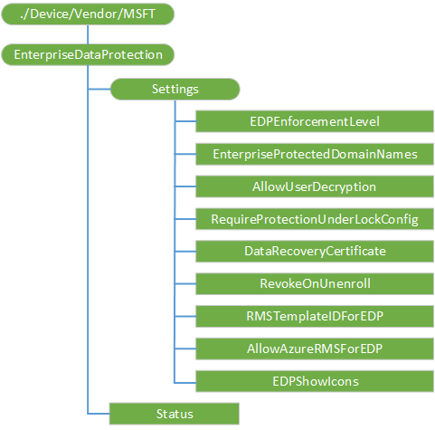

# <a name="enterprisedataprotection-csp"></a>EnterpriseDataProtection 的 CSP


EnterpriseDataProtection 配置服务提供程序 (CSP) 用于配置 Windows 信息保护 (WIP) （以前称为企业数据保护） 的特定设置。 关于 WIP 的详细信息，请参阅[保护企业数据使用 Windows 的信息保护 (WIP)](https://technet.microsoft.com/itpro/windows/keep-secure/protect-enterprise-data-using-wip)。

> **请注意**  
>- 要使 WIP AppLocker CSP 和网络隔离特定设置起作用还必须配置。 有关详细信息，请参阅[策略 CSP](policy-configuration-service-provider.md)中的[AppLocker CSP](applocker-csp.md)和 NetworkIsolation 策略。
>- Windows 10，1607年版本中添加了该 CSP。

 

WIP 在 VPN 上有没有硬的依赖性，而为了获得最佳结果应该配置 VPN 配置文件第一次配置 WIP 策略之前。 最佳做法建议的 VPN，请参阅[VPNv2 CSP](vpnv2-csp.md)。

若要了解有关 WIP 的详细信息，请参阅以下 TechNet 主题︰

-   [创建一个 Windows 的信息保护 (WIP) 策略](https://technet.microsoft.com/itpro/windows/keep-secure/overview-create-wip-policy)
-   [一般性指导原则和最佳做法为 Windows 的信息保护 (WIP)](https://technet.microsoft.com/itpro/windows/keep-secure/guidance-and-best-practices-wip)

下面的关系图以树格式显示 EnterpriseDataProtection CSP。



<a href="" id="--device-vendor-msft-enterprisedataprotection"></a>**./Device/Vendor/MSFT/EnterpriseDataProtection**  
<p style="margin-left: 20px">CSP 的根节点。

<a href="" id="settings"></a>**设置**  
<p style="margin-left: 20px">Windows 的信息保护 (WIP) 配置设置根节点。

<a href="" id="settings-edpenforcementlevel"></a>**设置/EDPEnforcementLevel**  
<p style="margin-left: 20px">将 WIP 强制级别设置。 请注意，设置此值不能在设备上启用 WIP。 当运行 WIP 清理时将无法更改此值。

<p style="margin-left: 20px">下面的列表显示了受支持的值︰

-   0 （默认）-关闭 / 无 （解密以前受保护的数据） 的保护。
-   1--安静模式 （加密和仅用于审核）。
-   2 – 替代模式 （加密、 提示，并审核）。
-   3 – 块模式 （加密、 阻止，并审核）。

<p style="margin-left: 20px">支持的操作是添加、 获取、 替换和删除。 值类型是整数。

<a href="" id="settings-enterpriseprotecteddomainnames"></a>**设置/EnterpriseProtectedDomainNames**  
<p style="margin-left: 20px">用管道分隔为其用户标识企业所使用的域的列表 ("|")。在列表中的第一个域必须是主企业 ID，WIP 为代表的管理机构，即一个。 企业托管帐户和应受保护的数据与之关联，被认为从这些域之一的用户标识。 例如，企业所拥有的所有电子邮件帐户的域将有望出现在此列表中。 当运行 WIP 清理时将无法更改此值。

<p style="margin-left: 20px">更改主企业 ID 不受支持，客户端可能会导致意外的行为。

> **请注意** 客户端需要域名要规范，否则此设置将拒绝客户端。

 

<p style="margin-left: 20px">下面是创建规范域名的步骤︰

1.  转换成小写字母的 ASCII 字符 (只一个 Z)。 例如，Microsoft.COM-&gt; microsoft.com。
2.  调用与 IDN [IdnToAscii](https://msdn.microsoft.com/library/windows/desktop/dd318149.aspx) \_使用\_STD3\_ASCII\_作为标志的规则。
3.  [IdnToUnicode](https://msdn.microsoft.com/library/windows/desktop/dd318151.aspx)不带标记集的调用 (dwFlags = 0)。

<p style="margin-left: 20px">支持的操作是添加、 获取、 替换和删除。 值类型是字符串。

<a href="" id="settings-allowuserdecryption"></a>**设置/AllowUserDecryption**  
<p style="margin-left: 20px">允许用户对文件进行解密。 如果该选项设置为 0 （不允许），用户将无法通过操作系统或应用程序的用户体验的企业内容中删除保护。

<p style="margin-left: 20px">下面的列表显示了受支持的值︰

-   0 – 不允许。
-   1 （缺省值）-允许。

<p style="margin-left: 20px">最受限制的值为 0。

<p style="margin-left: 20px">支持的操作是添加、 获取、 替换和删除。 值类型是整数。

<a href="" id="settings-requireprotectionunderlockconfig"></a>**设置/RequireProtectionUnderLockConfig**  
<p style="margin-left: 20px">指定是否应配置下锁定功能 （也称作为下 pin 加密） 的保护。

<p style="margin-left: 20px">CSP 检查当前版本和硬件支持 (TPM)，并返回一个错误信息，如果设备不具备所需的硬件。

> **请注意** 此设置仅支持在 Windows 10 移动。

 

<p style="margin-left: 20px">支持的操作是添加、 获取、 替换和删除。 值类型是整数。

<a href="" id="settings-datarecoverycertificate"></a>**设置/DataRecoveryCertificate**  
<p style="margin-left: 20px">指定可用于数据恢复的加密文件恢复证书。 这是数据恢复代理 (DRA) 证书用于加密文件系统 (EFS) 通过 MDM 而不是组策略只提供相同。

> **请注意** 如果两者都配置这项策略和相应的组策略设置，实施组策略设置。

<p style="margin-left: 20px">从 MDM 策略 DRA 信息必须可序列化二进制 blob 与我们所期望的从 GP。
二进制的 blob 是以下结构的序列化的版本︰

``` syntax
//
//  Recovery Policy Data Structures
//
 
typedef struct _RECOVERY_POLICY_HEADER {
    USHORT      MajorRevision;
    USHORT      MinorRevision;
    ULONG       RecoveryKeyCount;
} RECOVERY_POLICY_HEADER, *PRECOVERY_POLICY_HEADER;
 
typedef struct _RECOVERY_POLICY_1_1    {
        RECOVERY_POLICY_HEADER  RecoveryPolicyHeader;
        RECOVERY_KEY_1_1        RecoveryKeyList[1];
}   RECOVERY_POLICY_1_1, *PRECOVERY_POLICY_1_1;
 
#define EFS_RECOVERY_POLICY_MAJOR_REVISION_1   (1)
#define EFS_RECOVERY_POLICY_MINOR_REVISION_0   (0)
 
#define EFS_RECOVERY_POLICY_MINOR_REVISION_1   (1)
 
///////////////////////////////////////////////////////////////////////////////
//                                                                            /
//  RECOVERY_KEY Data Structure                                               /
//                                                                            /
///////////////////////////////////////////////////////////////////////////////
 
//
// Current format of recovery data.
//
 
typedef struct _RECOVERY_KEY_1_1   {
        ULONG               TotalLength;
        EFS_PUBLIC_KEY_INFO PublicKeyInfo;
} RECOVERY_KEY_1_1, *PRECOVERY_KEY_1_1;
 
 
typedef struct _EFS_PUBLIC_KEY_INFO {
 
    //
    // The length of this entire structure, including string data
    // appended to the end. The length should be a multiple of 8 for
    // 64 bit alignment
    //
 
    ULONG Length;
 
    //
    // Sid of owner of the public key (regardless of format).
   // This field is to be treated as a hint only.
    //
 
    ULONG PossibleKeyOwner;
 
    //
    // Contains information describing how to interpret
    // the public key information
    //
 
    ULONG KeySourceTag;
 
    union {
 
        struct {
 
            //
            // The following fields contain offsets based at the
            // beginning of the structure.  Each offset is to
            // a NULL terminated WCHAR string.
            //
 
            ULONG ContainerName;
            ULONG ProviderName;
 
            //
            // The exported public key used to encrypt the FEK.
            // This field contains an offset from the beginning of the
            // structure.
            //
 
            ULONG PublicKeyBlob;
 
            //
            // Length of the PublicKeyBlob in bytes
            //
 
            ULONG PublicKeyBlobLength;
 
        } ContainerInfo;
 
        struct {
 
            ULONG CertificateLength;       // in bytes
            ULONG Certificate;             // offset from start of structure
 
        } CertificateInfo;
 
 
        struct {
 
            ULONG ThumbprintLength;        // in bytes
            ULONG CertHashData;            // offset from start of structure
 
        } CertificateThumbprint;
    };
 
 
 
} EFS_PUBLIC_KEY_INFO, *PEFS_PUBLIC_KEY_INFO;
 
//
// Possible KeyTag values
//
 
typedef enum _PUBLIC_KEY_SOURCE_TAG {
    EfsCryptoAPIContainer = 1,
    EfsCertificate,
    EfsCertificateThumbprint
} PUBLIC_KEY_SOURCE_TAG, *PPUBLIC_KEY_SOURCE_TAG;
 
```

<p style="margin-left: 20px">为 EFSCertificate KeyTag，它将成为 DER 编码二进制证书。

<p style="margin-left: 20px">支持的操作是添加、 获取、 替换和删除。 值类型是 base 64 编码的证书。

<a href="" id="settings-revokeonunenroll"></a>**设置/RevokeOnUnenroll**  
<p style="margin-left: 20px">此策略控制是否废除 WIP 键时设备 unenrolls 从管理服务。 如果设置为 0 （不撤消键），这些键将不被吊销，并且用户将继续有权访问受保护的文件后注销。 如果密钥没有被吊销，没有吊销的文件清理随后。 发送 unenroll 命令，在需要时它是 unenrolled，如何选择性擦除设备时然后应该显式设置此策略为 1。

<p style="margin-left: 20px">下面的列表显示了受支持的值︰

-   0 – 不撤消键。
-   1 （缺省值）-[撤消] 键。

<p style="margin-left: 20px">支持的操作是添加、 获取、 替换和删除。 值类型是整数。

<a href="" id="settings-rmstemplateidforedp"></a>**设置/RMSTemplateIDForEDP**  
<p style="margin-left: 20px">要用于 RMS 加密的模板 Id GUID。 RMS 模板允许 IT 管理员配置详细信息，关于有权访问 RMS 保护的文件，并在其有权访问多长时间。

<p style="margin-left: 20px">支持的操作是添加、 获取、 替换和删除。 值类型是字符串 (GUID)。

<a href="" id="settings-allowazurermsforedp"></a>**设置/AllowAzureRMSForEDP**  
<p style="margin-left: 20px">指定是否允许针对 WIP Azure RMS 加密。

-   0 （默认）-不使用 RMS。
-   1 – 使用 RMS。

<p style="margin-left: 20px">支持的操作是添加、 获取、 替换和删除。 值类型是整数。

<a href="" id="settings-edpshowicons"></a>**设置/EDPShowIcons**  
<p style="margin-left: 20px">确定是否覆盖添加到 WIP 的图标受保护的资源管理器和企业唯一的应用程序图块在开始菜单中的文件。

<p style="margin-left: 20px">下面的列表显示了受支持的值︰

-   0 （缺省值）-无 WIP 图标或拼贴贴。
-   1--在受保护的文件和应用程序只能创建企业内容显示 WIP 叠加。

<p style="margin-left: 20px">支持的操作是添加、 获取、 替换和删除。 值类型是整数。

<a href="" id="status"></a>**状态**  
<p style="margin-left: 20px">只读的位掩码，表示设备上的 WIP 的当前状态。 MDM 服务可以使用此值来确定当前整体状态的 WIP。 WIP 只能上 （0 = 1 位） 是 WIP 强制策略和 WIP AppLocker 设置进行配置。

<p style="margin-left: 20px">建议的值︰

<table>
<colgroup>
<col width="20%" />
<col width="20%" />
<col width="20%" />
<col width="20%" />
<col width="20%" />
</colgroup>
<tbody>
<tr class="odd">
<td><p>保留供将来使用</p></td>
<td><p>WIP 强制设置</p>
<p>设置 = 1</p>
<p>未设置 = 0</p></td>
<td><p>保留供将来使用</p></td>
<td><p>AppLocker 配置</p>
<p>是 = 1</p>
<p>不 = 0</p></td>
<td><p>WIP 开 = 1</p>
<p>WIP 关闭 = 0</p></td>
</tr>
<tr class="even">
<td><p>4</p></td>
<td><p>3</p></td>
<td><p>2</p></td>
<td><p>1</p></td>
<td><p>0</p></td>
</tr>
</tbody>
</table>

 

<p style="margin-left: 20px">位 0 指示 WIP 是否打开或关闭。

<p style="margin-left: 20px">1 位指示是否设置 AppLocker WIP 策略。

<p style="margin-left: 20px">3 位指示是否强制性的 WIP 策略配置。 如果不配置一个或多个必需的 WIP 策略，3 位设置为 0 （零）。

<p style="margin-left: 20px">这是强制性的 WIP 策略的列表︰

-   EDPEnforcementLevel 在 EnterpriseDataProtection CSP
-   DataRecoveryCertificate 在 EnterpriseDataProtection CSP
-   EnterpriseProtectedDomainNames 在 EnterpriseDataProtection CSP
-   NetworkIsolation/EnterpriseIPRange 策略的 CSP 中
-   NetworkIsolation/EnterpriseNetworkDomainNames 策略的 CSP 中

<p style="margin-left: 20px">2 和第 4 位被保留供将来使用。

<p style="margin-left: 20px">受支持的操作是获得。 值类型是整数。

 

 


