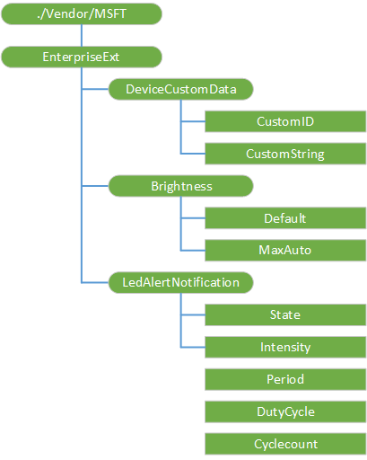

# <a name="enterpriseext-csp"></a>EnterpriseExt 的 CSP


EnterpriseExt 配置服务提供程序使 Oem 可以设置自己对其设备的唯一 ID，设置显示亮度值，并设置指示灯的行为。

> **请注意**  在 Windows 10 Mobile 只支持 EnterpriseExt CSP。

 

下图显示树状格式由开放移动联盟 (OMA) 设备管理 (DM) 和 OMA 客户端资源调配使用 EnterpriseExt 配置服务提供程序。



下面的列表显示的特征和参数。

<a href="" id="--vendor-msft-enterpriseext"></a>**./Vendor/MSFT/EnterpriseExt**  
EnterpriseExt 配置服务提供程序的根节点。 支持的操作是获得。

<a href="" id="devicecustomdata"></a>**DeviceCustomData**  
用于设置自定义的设备 ID 和字符串的节点。

<a href="" id="devicecustomdata-customid"></a>**DeviceCustomData/CustomID**  
任何字符串值作为设备 id。 此值将出现在**设置** &gt; **有关** &gt; **信息**。

下面是一个示例获取自定义数据。

``` syntax
<?xml version="1.0"?>
<SyncML xmlns="SYNCML:SYNCML1.2">
    <SyncBody>
        <Get>
            <CmdID>1</CmdID>
            <Item>
                <Target>
                    <LocURI>./Vendor/MSFT/EnterpriseExt/DeviceCustomData/CustomID</LocURI>
                </Target>
            </Item>
            <Item>
                <Target>
                    <LocURI>./Vendor/MSFT/EnterpriseExt/DeviceCustomData/CustomString</LocURI>
                </Target>
            </Item>
        </Get>
        <Final/>
    </SyncBody>
</SyncML>
```

<a href="" id="devicecustomdata-customstring"></a>**DeviceCustomData/CustomString**  
任何与该设备相关联的字符串值。

下面是一个用于设置自定义数据的示例。

``` syntax
<?xml version="1.0"?>
<SyncML xmlns="SYNCML:SYNCML1.2">
    <SyncBody>
        <Replace>
            <CmdID>1</CmdID>
            <Item>
                <Target>
                    <LocURI>./Vendor/MSFT/EnterpriseExt/DeviceCustomData/CustomID</LocURI>
                </Target>
                <Data>urn:uuid:130CCE0D-0187-5866-855A-DE7406F76046</Data> 
            </Item>
            <Item>
                <Target>
                    <LocURI>./Vendor/MSFT/EnterpriseExt/DeviceCustomData/CustomString</LocURI>
                </Target>
                <Data>{"firstName":"John","lastName":"Doe"}</Data> 
            </Item>
        </Replace>
        <Final/>
    </SyncBody>
</SyncML>
```

<a href="" id="brightness"></a>**亮度**  
用于设置设备亮度值的节点。

<a href="" id="brightness-default"></a>**亮度/默认值**  
默认显示亮度值。 例如，可以使电池寿命最大化减少默认值或将其设置为在通常更暗的设施中。

有效值包括︰

-   自动-设备确定亮度
-   Low
-   Medium
-   High

支持的操作包括获取和替换。

下面是一个示例获取当前的默认值。

``` syntax
<?xml version="1.0"?>
<SyncML xmlns="SYNCML:SYNCML1.2">
  <SyncBody>
    <Get>
      <CmdID>2</CmdID>
      <Item>
        <Target>
          <LocURI>./Vendor/MSFT/EnterpriseExt/Brightness/Default</LocURI>
        </Target>
      </Item>
    </Get>
    <Final/>
  </SyncBody>
</SyncML>
```

下面是一个示例的默认值设置为中。

``` syntax
<?xml version="1.0"?>
<SyncML xmlns="SYNCML:SYNCML1.2">
  <SyncBody>
    <Replace>
      <CmdID>2</CmdID>
      <Item>
        <Target>
          <LocURI>./Vendor/MSFT/EnterpriseExt/Brightness/Default</LocURI>
        </Target>
        <Data>medium</Data>
      </Item>
    </Replace>
    <Final/>
  </SyncBody>
</SyncML>
```

<a href="" id="brightness-maxauto"></a>**亮度/MaxAuto**  
当将设备设置为自动模式时的最大显示亮度值。 设备亮度不会高于 MaxAuto 值。 值是︰

-   Low
-   Medium
-   High

支持的操作包括获取和替换。

下面是一个示例设置为中最大的自动亮度。

``` syntax
<?xml version="1.0"?>
<SyncML xmlns="SYNCML:SYNCML1.2">
  <SyncBody>
    <Replace>
      <CmdID>2</CmdID>
      <Item>
        <Target>
          <LocURI>./Vendor/MSFT/EnterpriseExt/Brightness/MaxAuto</LocURI>
        </Target>
        <Data>medium</Data>
      </Item>
    </Replace>
    <Final/>
  </SyncBody>
</SyncML>
```

<a href="" id="ledalertnotification"></a>**LedAlertNotification**  
设置指示灯行为的设备节点。

<a href="" id="ledalertnotification-state"></a>**LedAlertNotification/状态**  
LED 的状态。 有效值包括︰

-   0-禁用
-   1-上
-   2-闪烁

示例︰ 指示灯亮起

``` syntax
<?xml version="1.0"?>
<SyncML xmlns="SYNCML:SYNCML1.2">
  <SyncBody>
    <Replace>
      <CmdID>3</CmdID>
      <Item>
        <Target>
          <LocURI>./Vendor/MSFT/EnterpriseExt/LedAlertNotification/Intensity</LocURI>
        </Target>
        <Meta>
          <Format xmlns="syncml:metinf">int</Format>
        </Meta>        
        <Data>100</Data>
      </Item>
      <Item>
        <Target>
          <LocURI>./Vendor/MSFT/EnterpriseExt/LedAlertNotification/State</LocURI>
        </Target>
        <Meta>
          <Format xmlns="syncml:metinf">int</Format>
        </Meta>        
        <Data>1</Data>
      </Item>
    </Replace>
    <Final/>
  </SyncBody>
</SyncML>
```

示例︰ 指示灯不亮

``` syntax
<?xml version="1.0"?>
<SyncML xmlns="SYNCML:SYNCML1.2">
  <SyncBody>
    <Replace>
      <CmdID>3</CmdID>
      <Item>
        <Target>
          <LocURI>./Vendor/MSFT/EnterpriseExt/LedAlertNotification/State</LocURI>
        </Target>
        <Meta>
          <Format xmlns="syncml:metinf">int</Format>
        </Meta>        
        <Data>0</Data>
      </Item>
    </Replace>
    <Final/>
  </SyncBody>
</SyncML>
```

<a href="" id="ledalertnotification-intensity"></a>**LedAlertNotification/强度**  
亮度的 LED 亮度。 您可以设置 1-100 之间的值。

示例︰ 指示灯闪烁

``` syntax
<?xml version="1.0"?>
<SyncML xmlns="SYNCML:SYNCML1.2">
  <SyncBody>
    <Replace>
      <CmdID>3</CmdID>
      <Item>
        <Target>
          <LocURI>./Vendor/MSFT/EnterpriseExt/LedAlertNotification/Period</LocURI>
        </Target>
        <Meta>
          <Format xmlns="syncml:metinf">int</Format>
        </Meta>        
        <Data>500</Data>
      </Item>
      <Item>
        <Target>
          <LocURI>./Vendor/MSFT/EnterpriseExt/LedAlertNotification/Dutycycle</LocURI>
        </Target>
        <Meta>
          <Format xmlns="syncml:metinf">int</Format>
        </Meta>        
        <Data>70</Data>
      </Item>
      <Item>
        <Target>
          <LocURI>./Vendor/MSFT/EnterpriseExt/LedAlertNotification/Intensity</LocURI>
        </Target>
        <Meta>
          <Format xmlns="syncml:metinf">int</Format>
        </Meta>        
        <Data>100</Data>
      </Item>
      <Item>
        <Target>
          <LocURI>./Vendor/MSFT/EnterpriseExt/LedAlertNotification/Cyclecount</LocURI>
        </Target>
        <Meta>
          <Format xmlns="syncml:metinf">int</Format>
        </Meta>        
        <Data>543210</Data>
      </Item>
      <Item>
        <Target>
          <LocURI>./Vendor/MSFT/EnterpriseExt/LedAlertNotification/State</LocURI>
        </Target>
        <Meta>
          <Format xmlns="syncml:metinf">int</Format>
        </Meta>        
        <Data>2</Data>
      </Item>
    </Replace>
    <Final/>
  </SyncBody>
</SyncML>
```

<a href="" id="ledalertnotification-period"></a>**LedAlertNotification/期间**  
每个闪烁，这是时间上的持续时间 + OFF。 值是以毫秒为单位。 这是仅适用于闪烁。

<a href="" id="ledalertnotification-dutycycle"></a>**LedAlertNotification/DutyCycle**  
指示灯点亮在闪烁一次周期的持续时间。 您可以设置 1-100 之间的值。 这是仅适用于闪烁。

<a href="" id="ledalertnotification-cyclecount"></a>**LedAlertNotification/Cyclecount**  
闪烁周期数。 数据类型是一个 4 字节有符号的整数。 任何负值或零将导致一个错误。 此节点所适用的闪烁。

<a href="" id="devicereboot"></a>**DeviceReboot**  
在 10 窗口中删除。

<a href="" id="devicereboot-waittime"></a>**DeviceReboot/WaitTime**  
在 10 窗口中删除。

<a href="" id="maintenancewindow"></a>**MaintenanceWindow**  
在 10 窗口中删除。

<a href="" id="maintenancewindow-maintenanceallowed"></a>**MaintenanceWindow/MaintenanceAllowed**  
在 10 窗口中删除。

<a href="" id="maintenancewindow-mwmandatory"></a>**MaintenanceWindow/MWMandatory**  
在 10 窗口中删除。

<a href="" id="maintenancewindow-schedulexml"></a>**MaintenanceWindow/ScheduleXML**  
在 10 窗口中删除。

<a href="" id="maintenancewindow-mwnotificationduration"></a>**MaintenanceWindow/MWNotificationDuration**  
在 10 窗口中删除。

<a href="" id="maintenancewindow-mwminimumduration"></a>**MaintenanceWindow/MWminimumDuration**  
在 10 窗口中删除。

<a href="" id="deviceupdate"></a>**DeviceUpdate**  
在 10 窗口中删除。

<a href="" id="deviceupdate-datetimestamp"></a>**DeviceUpdate/DateTimeStamp**  
在 10 窗口中删除。

<a href="" id="deviceupdate-updateresultxml"></a>**DeviceUpdate/UpdateResultXml**  
在 10 窗口中删除。

<a href="" id="mdm"></a>**MDM**  
在 10 窗口中删除。

<a href="" id="mdm-server"></a>**MDM/服务器**  
在 10 窗口中删除。

<a href="" id="mdm-username"></a>**MDM/用户名**  
在 10 窗口中删除。

<a href="" id="mdm-password"></a>**MDM/密码**  
在 10 窗口中删除。

<a href="" id="mdm-enabledeviceenrollment"></a>**MDM/EnableDeviceEnrollment**  
在 10 窗口中删除。

<a href="" id="pfx"></a>**Pfx**  
在 10 窗口中删除。

<a href="" id="disableenterprisevalidation"></a>**DisableEnterpriseValidation**  
在 10 窗口中删除。

 

 

2016 年 10/10


