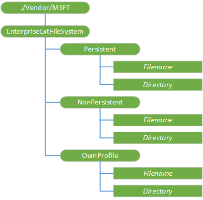

# <a name="enterpriseextfilesystem-csp"></a>EnterpriseExtFileSystem 的 CSP


EnterpriseExtFileSystem 配置服务提供程序 (CSP)，IT 管理员可以添加、 检索或更改的文件在文件系统中通过移动设备管理 (MDM) 服务。 例如，可以使用此配置服务提供程序将推送到通过 MDM 服务，设备的置备 XML 文件或一个新的锁定屏幕背景图像文件并还检索日志，从企业环境中的设备。

> **请注意** 在 Windows 10 Mobile 只支持 EnterpriseExtFileSystem CSP。

 

可以从设备中检索该文件的大小限制是直接到 syncML 消息中，嵌入文件的内容。 默认限制为 0x100000 (1 MB)。 您可以通过使用下面的注册表项来配置此限制︰**软件\\Microsoft\\资源调配\\Csp\\。\\供应商\\MSFT\\EnterpriseExtFileSystem\\MaxFileReadSize**。

下图显示了使用开放移动联盟 (OMA) 设备管理 (DM) 的树格式 EnterpriseExtFileSystem 配置服务提供程序。



下面的列表描述特征和参数。

<a href="" id="--vendor-msft-enterpriseextfilesystem"></a>**./Vendor/MSFT/EnterpriseExtFileSystem**  
<p style="margin-left: 25px">EnterpriseExtFileSystem 配置服务提供程序的根节点。 支持的操作包括添加和获取。</p>

<a href="" id="persistent"></a>**持久性**  
<p style="margin-left: 25px">EnterpriseExtFileSystem CSP 使企业可以读取、 写入、 删除和列出此文件夹中的文件。 当应用程序将数据写入到持久的文件夹时，它访问该数据从 EnterpriseExtFileSystem\\持久节点。 写入到持久的文件夹中的文件仍然出现在普通的电源周期。</p>

> **重要** 没有限制可以保持，这是其中一个分区上的可用磁盘空间量而异的数据量。 此数据上限金额 （即可以保持） 因制造商而异。

 

> **请注意**  当 IT 管理员触发时使用[的 CSP RemoteWipe](remotewipe-csp.md) **doWipePersistProvisionedData**操作时，保持通过擦除并且还原设备再次启动时持久的文件夹中存储的项目。 如果**doWipe**操作被触发，则不会保留内容。

 

<a href="" id="nonpersistent"></a>**非持久性**  
<p style="margin-left: 25px">EnterpriseExtFileSystem CSP 使企业可以读取、 写入、 删除和列出此文件夹中的文件。 当应用程序将数据写入而非持续的文件夹中，它从 EnterpriseExtFileSystem 访问该数据\\非持久性的节点。 写入到临时文件夹中的文件将保留在普通的电源周期。</p>  

<p style="margin-left: 25px">当擦除设备后时，将删除存储在临时文件夹中的任何数据。</p>

<a href="" id="oemprofile"></a>**OemProfile**  
<p style="margin-left: 25px">添加 Windows 10 1511年版本中。 EnterpriseExtFileSystem CSP 使企业可以部署 OEM 配置文件在设备上，如条形码扫描仪配置文件，然后可由 OEM 条形码扫描仪驱动程序。 该文件将被放入\\数据\\shareddata\\oem\\公用\\配置文件\\的设备文件夹。</p>

<a href="" id="directory"></a>***目录***  
<p style="margin-left: 25px">设备文件系统中的目录的名称。 *目录*中的任何节点作为子节点可以有目录和文件。</p>

<p style="margin-left: 25px">使用 Add 命令来创建一个新目录。 不能使用它来添加一个新的文件系统根目录下的目录。</p>

<p style="margin-left: 25px">使用 Get 命令返回*目录*下的子节点名称的列表。</p>

<p style="margin-left: 25px">通过 ?List 使用 Get 命令以递归方式返回所有子节点名称，包括*目录*下的子目录名称都 = 结构。</p>

<a href="" id="filename"></a>***文件名***  
<p style="margin-left: 25px">设备文件系统中文件的名称。</p>

支持的操作是获得。

## <a name="oma-dm-examples"></a>OMA DM 示例


下面的示例演示如何从设备中检索文件。

``` syntax
<Get>
    <CmdID>2</CmdID>
    <Item>
        <Target>
            <LocURI>./Vendor/MSFT/EnterpriseExtFileSystem/Persistent/file.txt</LocURI>
        </Target>
    </Item>
</Get>
```

下面的示例演示返回的 syncML 响应正文中的文件名称。 在此示例中，该设备上的完整路径是文件的 C:/data/test/bin/filename.txt。

``` syntax
<Results>
    <CmdID>3</CmdID>
    <MsgRef>1</MsgRef>
    <CmdRef>2</CmdRef>
    <Item>
        <Source>
            <LocURI>./Vendor/MSFT/EnterpriseExtFileSystem/Persistent/filename.txt</LocURI>
        </Source>
        <Meta>
            <Format xmlns="syncml:metinf">b64</Format>
            <Type xmlns="syncml:metinf">application/octet-stream</Type>
        </Meta>
        <Data>aGVsbG8gd29ybGQ=</Data>
    </Item>
</Results>
```

下面的示例演示如何将一个文件推送到该设备。

``` syntax
<Add>
   <CmdID>2</CmdID>
   <Item>
      <Target>
         <LocURI>./Vendor/MSFT/EnterpriseExtFileSystem/Persistent/new.txt</LocURI>
      </Target>
      <Meta>
          <Format xmlns="syncml:metinf">b64</Format>
          <Type xmlns="syncml:metinf">application/octet-stream</Type>
      </Meta>
      <Data>aGVsbG8gd29ybGQ=</Data>
   </Item>
</Add>
```

 

 


