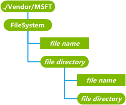

# 文件系统 CSP

文件系统配置服务提供程序用于查询、 添加、 修改和删除文件、 文件目录和移动设备上的文件属性。 它可以检索有关其的信息或管理 ROM、 持久存储区中的文件和设备中存在任何可移动存储卡上的文件中的文件。 它适用于文件处于隐藏状态的用户，以及那些对用户可见。

> **请注意** 在 Windows 10 Mobile 只支持文件系统的 CSP。

 

> **请注意**  此配置服务提供商要求使用 ID\_CAP\_CSP\_基础和 ID\_CAP\_CSP\_OEM 功能从网络配置应用程序进行访问。

 

下图显示了文件系统配置服务提供程序管理对象以树格式由 OMA DM。 OMA 客户端资源调配协议不支持此配置服务提供程序。

**文件系统**  
必需。 定义文件系统管理对象的根。 它将作为文件系统查询根目录。

此元素不支持递归查询或删除。 添加命令将添加新的文件或目录的根路径下。

对于根节点支持以下属性︰

-   `Name`︰ 该根节点名称。 Get 命令是唯一受支持的命令。

-   `Type`: 文件，它是 com.microsoft/windowsmobile/1.1/FileSystemMO MIME 类型。 Get 命令是唯一受支持的命令。

-   `Format`: 格式为`node`。 Get 命令是唯一受支持的命令。

-   `TStamp`︰ 指示上次文件目录标准 OMA 属性已更改。 通过包含 UTC，基本的 ISO 8601 格式、 完整表示的日期和时间值的字符串表示的值，例如 20010711T163817Z 意味着 16 小时，38 分 17 秒在 2001 年 7 月 11 日。 Get 命令是唯一受支持的命令。

-   `Size`︰ 不受支持。

-   `msft:SystemAttributes`︰ 一个包含文件目录属性的自定义属性。 此值是对应于文件整型位掩码\_属性值和标头文件 winnt.h 中的定义的标志。 这支持 Get 命令和替换命令。

***文件目录***  
可选项。 设备文件系统中返回的目录名称。 *文件目录*中的任何元素作为子元素可以包含目录和文件。

Get 命令返回的文件目录的名称。 使用 Get 命令`?List=Struct`将以递归方式返回所有子元素名称 （包括子目录的名称）。 使用 Get 命令`?list=StructData`查询不支持并且返回 406 错误代码。

添加命令用于创建新的目录。 添加一个新的文件系统根目录下的目录不支持并返回 405 的错误代码。

不支持替换命令。

删除命令用于删除所有文件和该*文件目录*下的子文件夹。

文件目录支持以下属性︰

-   `Name`: 文件的目录名称。 Get 命令是唯一受支持的命令。

-   `Type`︰ 空字符串不是根节点的目录文件 MIME 类型。 Get 命令是唯一受支持的命令。

-   `Format`: 格式为`node`。 Get 命令是唯一受支持的命令。

-   `TStamp`︰ 指示上次文件目录标准 OMA 属性已更改。 通过包含 UTC，基本的 ISO 8601 格式、 完整表示的日期和时间值的字符串表示的值，例如 20010711T163817Z 意味着 16 小时，38 分 17 秒在 2001 年 7 月 11 日。 Get 命令是唯一受支持的命令。

-   `Size`︰ 不受支持。

-   `msft:SystemAttributes`︰ 一个包含文件目录属性的自定义属性。 此值是对应于文件整型位掩码\_属性值和标头文件 winnt.h 中的定义的标志。 这支持 Get 命令和替换命令。

***文件名称***  
可选项。 将文件返回的二进制格式。 如果文件太大，要返回的配置服务，它会返回错误代码 413 （请求实体太大），相反。

删除命令删除该文件。

替换命令更新整个文件与新文件的内容。

添加命令将文件添加到文件的目录

Get 命令不支持在*文件名称*元素，仅在元素的属性。

文件支持以下属性︰

-   `Name`: 文件的名称。 Get 命令是唯一受支持的命令。

-   `Type`︰ 文件 MIME 类型。 此值始终设置为通用的 MIME 类型︰ `application/octet-stream`。 Get 命令是唯一受支持的命令。

-   `Format`︰ wbxml 上发送二进制数据的情况下，通过 XML 和 bin 格式发送格式，这是 b64 为二进制数据编码。 Get 命令是唯一受支持的命令。

-   `TStamp`︰ 指示该文件的最后一次一个标准的 OMA 属性已更改。 通过包含 UTC，基本的 ISO 8601 格式、 完整表示的日期和时间值的字符串表示的值，例如 20010711T163817Z 意味着 16 小时，38 分 17 秒在 2001 年 7 月 11 日。 Get 命令是唯一受支持的命令。

-   `Size`︰ 未编码的文件内容大小以字节为单位。 Get 命令是唯一受支持的命令。

-   `msft:SystemAttributes`: 自定义属性，该属性包含文件属性。 此值是对应于文件整型位掩码\_属性值和标头文件 winnt.h 中的定义的标志。 这支持 Get 命令和替换命令。

## 相关的主题

[配置服务提供程序的引用](configuration-service-provider-reference.md)

 

 

