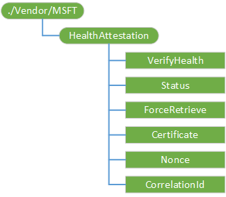

# <a name="healthattestation-csp"></a>HealthAttestation 的 CSP


HealthAttestation 配置服务提供程序，使得企业 IT 经理可以评估的受管理设备的运行状况，并采取的策略操作的企业。

以下是由 HealthAttestation CSP 执行的函数的列表︰

-   收集数据来验证设备健康状态
-   将数据转发到运行状况审计服务 (HAS)
-   规定从 HAS 接收状况审计证书
-   接到请求时，会将转发 （来自 HAS） 健全审计证书和相关的运行时信息到 MDM 服务器以进行验证

下面的关系图以树格式显示 HealthAttestation 配置服务提供程序。



<a href="" id="--vendor-msft"></a>**./Vendor/MSFT**  
HealthAttestation 配置服务提供程序的根节点。

<a href="" id="verifyhealth--required-"></a>**VerifyHealth**（必需）  
通知设备准备健康证书验证请求。

受支持的操作被执行。

<a href="" id="status--required-"></a>**状态**（必需）  
提供健康请求的当前状态。

受支持的操作是获得。

下面的列表显示了受支持的值︰

-   1-HEALTHATTESTATION\_证书\_RETRI\_初始化准备一个请求以获取新的健康证书从健全审计服务 (HAS)。
-   2-HEALTHATTESTATION\_证书\_RETRI\_请求等待的健全审计服务 (HAS) 来回复。
-   3 – HEALTHATTESTATION\_证书\_RETRI\_完整健康数据已准备好拿。

<a href="" id="forceretrieve--optional-"></a>**ForceRetrieve**（可选）  
指示客户端健康证书给从健全审计服务 (HAS) 启动一个新的请求并获得新的健康证书。 如果 MDM 服务器强制执行证书的新鲜策略，应使用此选项。 此外，您需要在验证请求时创建的证书。

受支持的操作被替换。

<a href="" id="certificate--required-"></a>**证书**（必需）  
MDM 服务器以加密格式指示健康 CSP 转发打包与现时的健康证书数据和相关的健康数据 （当前 PCR 值）。

受支持的操作是获得。

<a href="" id="nonce--required-"></a>**现时**（必需）  
保护与由 MDM 服务器生成的加密 nonce 的健全审计通信。

现时是十六进制格式表示，用 8 个字节的最小大小和最大为 32 字节。

受支持的操作被替换。

<a href="" id="correlationid--required-"></a>**都会**（必需）  
都会是一个十进制值，标识征集健康证书。 可用于将健全审计服务器 (HAS) 日志与 MDM 事件服务器和客户端调试、 审核，或排除故障的事件日志相关联。

受支持的操作是获得。

## <a name="integrating-health-attestation"></a>**将集成健全审计**


为了将健全审计集成到您的环境中，您需要完成以下步骤︰

1.  [请验证 HTTPS 访问](#verify-access)
2.  [指示客户端准备健康数据以进行验证](#prepare-health-data)
3.  [基于客户端响应采取行动](#take-action-client-response)
4.  [指示客户端将健全审计数据进行验证](#forward-health-attestation)
5.  [转发到健全审计服务 (HAS) 的健全审计数据](#foward-data-to-has)
6.  [从 HAS 接收响应](#receive-has-response)
7.  [采取相应的策略措施，根据评估结果](#take-policy-action)

在本主题的以下各节将详细介绍每个步骤。

## <a name="a-href-idverify-accessaverify-https-access"></a><a href="" id="verify-access"></a>**请验证 HTTPS 访问**


验证每台 MDM 服务器和设备 （MDM 客户机） 都可以访问**has.spserv.microsoft.com**使用 TCP 协议使用端口 443 (HTTPS)。

## <a name="a-href-idprepare-health-dataainstruct-client-to-prepare-health-data-for-verification"></a><a href="" id="prepare-health-data"></a>**指示客户端准备健康数据以进行验证**


访问验证后，颁发 SyncML 原子调用启动运行状况数据的集合。

下面的示例演示示例原子调用触发集合和从托管设备的运行状况审计数据的验证。

``` syntax
<SyncML xmlns="SYNCML: SYNCML1.2">

    // Header starts here 
    <SyncHdr>
        <VerDTD> 1.2 </VerDTD>
        <VerProto> DM/1.2 </VerProto>
        <SessionID> [Session ID] </SessionID>
        <MsgID> [Message ID] </MsgID>
        <Target>
            <LocURI> ./Vendor/MSFT/HealthAttestation/Certificate 
        </LocURI>
        </Target>
        <Source>
            <LocURI> [URL of MDM Server] </LocURI>
        </Source>
    </SyncHdr>

    // Body starts here 
    <SyncBody>
    
    //Start an atomic call
        <Atomic>
            <CmdID> [Command ID] </CmdID>

            //The first item is an optional call.
            //"ForceRetrieve" node instructs the client to
            //initiate a new request to Health certificate from 
            //Health Attestation Service (HAS), get a new health
            //certificate. This option should be used if MDM 
            //server enforces a certificate freshness policy, 
            //requires a certificate that is created at 
            //verification request time.  
            <Set>
                <CmdID> [Command ID] </CmdID>
                <Item>
                    <Target>
                      <LocURI>
                  ./Vendor/MSFT/HealthAttestation/ForceRetrieve
                      </LocURI>
                    </Target>
                </Item>
            </Set>

            //Tell the device to create an encrypted payload that
            //contains health attestation related data  
            <Exec>
                <CmdID> [Command ID] </CmdID>
                <Item>
                    <Target>
                      <LocURI> 
                ./Vendor/MSFT/HealthAttestation/VerifyHealth
       </LocURI>
                    </Target>
                </Item>
            </Exec>

            //Forward a cryptographic strong nonce to the client
            //The nonce must be a hexadecimal string that is
            //between 8 and 32 bytes
            <Set>
                <CmdID> [Command ID] </CmdID>
                <Item>
                    <Target>
                      <LocURI> ./Vendor/MSFT/HealthAttestation/Nonce
                      </LocURI>
                    </Target>
                    <Data> [hexadecimal string] </Data>
                </Item>
            </Set>

            //Ask for status
            <Get>
                <CmdID> [Command ID] </CmdID>
                <Item>    
                    <Target>
                      <LocURI> 
              ./Vendor/MSFT/HealthAttestation/Status
                      </LocURI>
                    </Target>
                </Item>
            </Get>
        </Atomic>
    </SyncBody>   
</SyncML>
```

## <a name="a-href-idtake-action-client-responseatake-action-based-on-the-clients-response"></a><a href="" id="take-action-client-response"></a>**基于客户端响应采取行动**


客户端接收到健全审计请求后，它将发送响应。 下面的列表描述的响应，以及采取建议措施︰

-   如果对任何被称为节点的响应是"失败"，采取适当的纠正措施，然后重新提交请求。
-   如果响应是**HEALTHATTESTATION\_证书\_RETRI\_请求 (1)**或**HEALTHATTESTATION\_证书\_RETRI\_未初始化 (0)**等待警报 （由客户机启动请求告知 MDM 服务器运行状况数据打包并准备领取，然后前进到下一节。）
-   如果响应是**HEALTHATTESTATION\_证书\_RETRI\_COMPLETE(3)**然后继续执行下一节。

## <a name="a-href-idforward-health-attestationainstruct-the-client-to-forward-health-attestation-data-for-verification"></a><a href="" id="forward-health-attestation"></a>**指示客户端将健全审计数据进行验证**


接下来，必须转发健全审计数据，以便可以验证的数据。 若要执行此操作，创建的证书和 CallIdentifier 节点到原子联络、 领取包括健康证书和设备中的相关的数据的加密有效负载。

下面的示例演示一个示例原子调用︰

``` syntax
<SyncML xmlns="SYNCML: SYNCML1.2">

    // Header Starts here 
    <SyncHdr>
        <VerDTD> 1.2 </VerDTD>
        <VerProto> DM/1.2 </VerProto>
        <SessionID> [Session ID] </SessionID>
        <MsgID> [Message ID] </MsgID>
        <Target>
            <LocURI>./Vendor/MSFT/HealthAttestation/Certificate
            </LocURI>
        </Target>
        <Source>
            <LocURI> [URL of MDM Server] </LocURI>
        </Source>
    </SyncHdr>

    // Body Starts here 
    <SyncBody>
    
    //Start an atomic call
        <Atomic>

            //Call Health CSP to get the packaged data and 
            //call identifier 
            <CmdID> [Command ID] </CmdID>

            //Get the packaged data
            <Get>
                <CmdID> [Command ID] </CmdID>
                <Item>    
                    <Target>
                   <LocURI>
                    ./Vendor/MSFT/HealthAttestation/Certificate
                    </LocURI>
                    </Target>
                </Item>
            </Get>
    
            //Get the health attestation call identifier 
            <Get>
                <CmdID> [Command ID] </CmdID>
                <Item>    
                    <Target>
                      <LocURI>
                      ./Vendor/MSFT/HealthAttestation/CorrelationId
                      </LocURI>
                    </Target>
                </Item>
            </Get>
        </Atomic>
    </SyncBody>   

</SyncML>
```

## <a name="a-href-idfoward-data-to-hasaforward-health-attestation-data-to-health-attestation-service-has"></a><a href="" id="foward-data-to-has"></a>**转发到健全审计服务 (HAS) 的健全审计数据**


在上一步中已发送的请求的响应，MDM 客户端转发 XML 格式 blob 和下面的格式中的调用标识符。

``` syntax
<?xml version="1.0" encoding="utf-8"?>
<HealthCertificateValidationRequest ProtocolVersion="1" 
    xmlns="http://schemas.microsoft.com/windows/security/healthcertificate/validation/request/v1">
    <Claims> [base64 blob, eg ‘ABc123+/…==’] </Claims>
    <HealthCertificateBlob> [base64 blob, eg ‘ABc123+/...==’]
    </HealthCertificateBlob>
</HealthCertificateValidationRequest>
```

MDM 服务器在收到上面的数据，它必须记录关联的调用的调用标识符 （供将来参考）。 添加在收到来自客户端的 XML blob 中生成 nonce，然后向前 (HTTP Post) 以下格式向健全审计服务 (HAS) 中的数据

``` syntax
<?xml version="1.0" encoding="UTF-8"?>
<xs:schema xmlns:xs=http://www.w3.org/2001/XMLSchema
xmlns=http://schemas.microsoft.com/windows/security/healthcertificate/validation/request/v1  targetNamespace=http://schemas.microsoft.com/windows/security/healthcertificate/validation/request/v1  elementFormDefault="qualified">
<xs:element name="HealthCertificateValidationRequest" type="HealthCertificateValidationRequest_T"/>
  <xs:complexType name="HealthCertificateValidationRequest_T">
    <xs:annotation>
      <xs:documentation> A request for Health Certificate 
   validation </xs:documentation>
    </xs:annotation>
    <xs:sequence>
      <xs:element name="Nonce" type="xs:hexBinary"/>
      <xs:element name="Claims" type="xs:base64Binary"/>
      <xs:element name="HealthCertificateBlob" 
    type="xs:base64Binary"/>
    </xs:sequence>
    <xs:attribute name="ProtocolVersion" use="required">
      <xs:simpleType>
        <xs:restriction base="xs:int">
          <xs:minInclusive value="1"/>
        </xs:restriction>
      </xs:simpleType>
    </xs:attribute>
  </xs:complexType>
</xs:schema>
```

## <a name="a-href-idreceive-has-responseareceive-response-from-the-has"></a><a href="" id="receive-has-response"></a>**从 HAS 接收响应**


当运行状况审计服务接收验证请求时，它将执行以下步骤︰

-   对接收的加密的数据进行解密。
-   验证运行状况数据。
-   验证不是重复请求通过检查嵌入到加密的斑点，从 MDM 服务器接收现时针对现时。
-   以 XML 格式创建一个报告，并将转发到 MDM 服务器用以下格式的计算结果。

    ``` syntax
    <?xml version=\"1.0\"?>

    <HealthCertificateValidationResponse 
       xmlns:xsd=\"http://www.w3.org/2001/XMLSchema\" 
       xmlns:xsi=\"http://www.w3.org/2001/XMLSchema-instance\" 
       ErrorCode=\"0\" 
       xmlns=\"http://schemas.microsoft.com/windows/security/healthcertificate/validation/response/v1\">
        <HealthCertificateProperties>

            <Issued> 
                2015-02-23T17:43:27.5229876Z 
            </Issued>

            <AIKPresent>
                False
            </AIKPresent>

            <ResetCount>
                [INT]
            </ResetCount>

            <RestartCount> 
                [INT]
            </RestartCount>

            <DEPPolicy>
                [Boolean - 0, 1]
            </DEPPolicy>

            <BitlockerStatus> 
                [Boolean - 0, 1] 
            </BitlockerStatus>

            <BootManagerRevListVersion>
                [INT]
            </BootManagerRevListVersion>

            <CodeIntegrityRevListVersion>
                [INT] 
            </CodeIntegrityRevListVersion>

            <SecureBootEnabled> 
                [Boolean- 0, 1]
            </SecureBootEnabled>

            <BootDebuggingEnabled>
                [Boolean- 0, 1]
         </BootDebuggingEnabled>

            <OSKernelDebuggingEnabled>
                [Boolean-0, 1]
            </OSKernelDebuggingEnabled>
            
            <CodeIntegrityEnabled> 
                [Boolean - 0, 1]
            </CodeIntegrityEnabled>
            
            <TestSigningEnabled> 
                [Boolean - 0, 1]
            </TestSigningEnabled>
            
            <SafeMode> 
                [Boolean - 0, 1] 
            </SafeMode>
            
            <WinPE> 
                [Boolean - 0, 1] 
            </WinPE>
            
            <ELAMDriverLoaded> 
                [Boolean - 0, 1] 
            </ELAMDriverLoaded>
            
            <VSMEnabled> 
                [Boolean - 0, 1] 
            </VSMEnabled>
             
            <CIPolicyHash> 
                [INT] 
            </CIPolicyHash>

            <SBCPPolicyHash> 
                [INT] 
            </SBCPPolicyHash>

            <PCR0> 
                [INT] 
            </PCR0>
        
        </HealthCertificateProperties>

    </HealthCertificateValidationResponse>
    ```

## <a name="a-href-idtake-policy-actionatake-appropriate-policy-action-based-on-evaluation-results"></a><a href="" id="take-policy-action"></a>**采取相应的策略措施，根据评估结果**


MDM 服务器接收到的已验证的数据后，信息可以用于通过计算数据进行策略决策。 将可能采取的操作︰

-   允许设备进行访问。
-   允许设备访问的资源，但标记的设备来进行进一步调查。
-   防止设备访问的资源。

以下是一份经过 HAS 的数据点︰

-   AIKPresent
-   DEPPolicy
-   BitlockerStatus
-   SecureBootEnabled
-   CodeIntegrityEnabled
-   安全模式
-   WinPE
-   ELAMDriverLoaded
-   VSMEnabled
-   BootDebuggingEnabled
-   OSKernelDebuggingEnabled
-   TestSigningEnabled
-   BootManagerRevListVersion
-   CodeIntegrityRevListVersion
-   CIPolicyHash
-   SBCPPolicyHash
-   PCR0

在下面的部分，同时建议要采取的措施的详细介绍其中的每个。

<a href="" id="aikpresent"></a>**AIKPresent**  
在设备上存在审计标识键 (AIK) 时，它指示设备已认可密钥 (EK) 证书。 它可以是比没有 EK 证书的设备更可靠。

如果 AIKPresent = True (1)，然后允许访问。

如果 AIKPresent = False (0)，然后采取配合企业策略的下列操作之一︰

-   禁止所有访问
-   禁止访问 HBI 资产
-   允许根据在评估时有其他数据点的条件访问。 例如，其他健康证书，或过去的活动和信任历史记录设备属性。
-   执行上一操作之一，此外将监控设备的潜在风险更密切地监视列表中的设备。

<a href="" id="deppolicy"></a>**DEPPolicy**  
一个设备可以信任更多如果在设备上启用 DEP 策略。

数据执行保护 (DEP) 策略定义一套执行额外检查以帮助防止在系统上运行恶意代码的内存的硬件和软件技术。 安全启动 x86/amd64 允许有限的列表，在 ARM NTOS 锁定它为 on。

DEPPolicy 可以禁用或启用使用 WMI 或 PowerShell 脚本中的以下命令︰

-   若要禁用 DEP，请键入**bcdedit.exe {当前} /set nx AlwaysOff**
-   若要启用 DEP，请键入**bcdedit.exe {当前} /set nx AlwaysOn**

如果 DEPPolicy = 1 （打开），然后允许访问。

如果 DEPPolicy = 0 （关闭），然后采取配合企业策略的下列操作之一︰

-   禁止所有访问
-   禁止访问 HBI 资产
-   允许根据在评估时有其他数据点的条件访问。 例如，其他健康证书，或过去的活动和信任历史记录设备属性。
-   执行上一操作之一，此外将监控设备的潜在风险更密切地监视列表中的设备。

<a href="" id="bitlockerstatus"></a>**BitlockerStatus**  
打开 Bitlocker 时，该设备就能够保护系统处于关闭状态或进入休眠状态时，未经授权的访问，从驱动器存储的数据。

Windows BitLocker 驱动器加密，对 Windows 操作系统的系统卷上存储的所有数据进行都加密。 BitLocker 使用 TPM 保护的 Windows 操作系统和用户数据，并有助于确保计算机不会被篡改，即使处于无人值守、 丢失或被盗。

如果计算机配具备兼容的 TPM，BitLocker 使用 TPM 锁定保护的数据的加密密钥。 因此，直到在 TPM 已验证计算机的状态，则无法访问项。

如果 BitLockerStatus = 1 （打开），然后允许访问。

如果 BitLockerStatus = 0 （关闭），然后采取配合企业策略的下列操作之一︰

-   禁止所有访问
-   禁止访问 HBI 资产
-   允许根据在评估时有其他数据点的条件访问。 例如，其他健康证书，或过去的活动和信任历史记录设备属性。
-   执行上一操作之一，此外将监控设备的潜在风险更密切地监视列表中的设备。

<a href="" id="securebootenabled"></a>**SecureBootEnabled**  
启用安全启动后，系统将强制引导到工厂受信任状态。 此外，启用安全启动后，用来启动计算机的核心组件必须具有正确的制造设备的组织信任的加密签名。 UEFI 固件可以验证这一点之前可以启动的计算机。 如果任何文件已经被篡改，破坏他们的签名，系统将无法启动。

如果 SecureBootEnabled = 1 (True)，则允许访问。

如果 SecurebootEnabled = 0 (False)，则采取配合企业策略的下列操作之一︰

-   禁止所有访问
-   禁止访问 HBI 资产
-   允许根据在评估时有其他数据点的条件访问。 例如，其他健康证书，或过去的活动和信任历史记录设备属性。
-   执行上一操作之一，此外将监控设备的潜在风险更密切地监视列表中的设备。

<a href="" id="codeintegrityenabled"></a>**CodeIntegrityEnabled**  
启用代码完整性时，执行代码被限制为完整性验证代码。

代码完整性是一种功能，验证每次加载到内存的驱动程序或系统文件的完整性。 代码完整性检测未经签名的驱动程序或系统文件被加载到内核中，还是已被正在运行的用户帐户具有管理员权限的恶意软件修改系统文件。

在基于 x64 版本的操作系统中，内核模式的驱动程序必须经过数字签名。

如果 CodeIntegrityEnabled = 1 (True)，则允许访问。

如果 CodeIntegrityEnabled = 0 (False)，则采取配合企业策略的下列操作之一︰

-   禁止所有访问
-   禁止访问 HBI 资产
-   允许根据在评估时有其他数据点的条件访问。 例如，其他健康证书，或过去的活动和信任历史记录设备属性。
-   执行上一操作之一，此外将监控设备的潜在风险更密切地监视列表中的设备。

<a href="" id="safemode"></a>**安全模式**  
安全模式是在限制状态启动您的计算机的 Windows 的故障排除选项。 基本的文件和运行 Windows 所需的驱动程序才会启动。

如果安全模式 = 0 (False)，则允许访问。

如果安全模式 = 1 (True)，则采取配合企业策略的下列操作之一︰

-   禁止所有访问
-   禁止访问 HBI 资产
-   触发的纠正措施，如告知技术支持团队联系负责人调查该问题。

<a href="" id="winpe"></a>**WinPE**  
Windows 预安装环境 (Windows PE) 是一个最小操作系统与有限的服务，用于准备 Windows 安装，将磁盘映像复制从网络文件服务器，并启动 Windows 安装程序的计算机。

如果 WinPE = 0 (False)，则允许访问。

如果 WinPE = 1 (True)，则限制访问远程资源所需的 Windows 操作系统安装。

<a href="" id="elamdriverloaded"></a>**ELAMDriverLoaded**  
它们启动时，在第三方驱动程序初始化之前，早期启动反恶意软件 (ELAM) 提供对您网络中的计算机的保护。

如果 ELAMDriverLoaded = 1 (True)，则允许访问。

如果 ELAMDriverLoaded = 0 (False)，则采取配合您的企业策略，还考虑是否桌面或移动设备的以下操作之一︰

-   禁止所有访问
-   禁止访问 HBI 资产
-   触发的纠正措施，如告知技术支持团队联系负责人调查该问题。

<a href="" id="vsmenabled"></a>**VSMEnabled**  
虚拟安全模式 （家） 是一个容器，从受损的内核保护高价值资产。 家将需要大约 1GB 的内存--它有足够能力，可以运行 LSA 服务使用的所有身份验证代理。

可以使用 WMI 或 PowerShell 脚本中的以下命令启用家︰

**Bcdedit.exe vsmlaunchtype 自动 /set {当前}**

如果 ELAMDriverLoaded = 1 (True)，则允许访问。

如果 ELAMDriverLoaded = 0 (False)，则采取配合企业策略的下列操作之一︰

-   禁止所有访问
-   禁止访问 HBI 资产
-   触发的纠正措施，如告知技术支持团队联系负责人调查该问题。

**BootDebuggingEnabled**启动调试启用指向在开发和测试中使用的设备。 通常用于测试和开发用的设备是不太安全︰ 该设备可能会运行不稳定的代码，或用较少的安全限制所需的测试和开发配置。

启动调试可以禁用或启用使用 WMI 或 PowerShell 脚本中的以下命令︰

-   要禁用启动调试，请键入**bcdedit.exe /set {当前} bootdebug 关闭**
-   若要启用启动调试，请键入**bcdedit.exe /set {当前} bootdebug 上**

如果 BootdebuggingEnabled = 0 (False)，则允许访问。

如果 BootDebuggingEnabled = 1 (True)，则采取配合企业策略的下列操作之一︰

-   禁止所有访问
-   禁止访问 HBI 资产
-   地方监视列表中的设备监控设备更接近的潜在风险。
-   触发的纠正措施，例如启用使用 WMI 或 Powershell 脚本的家。

**OSKernelDebuggingEnabled**OSKernelDebuggingEnabled 指出在开发和测试中使用的设备。 通常用于测试和开发用的设备是不太安全︰ 它们可能运行不稳定的代码，或用较少的安全限制所需的测试和开发配置。

如果 OSKernelDebuggingEnabled = 0 (False)，则允许访问。

如果 OSKernelDebuggingEnabled = 1 (True)，则采取配合企业策略的下列操作之一︰

-   禁止所有访问
-   禁止访问 HBI 资产
-   地方监视列表中的设备监控设备更接近的潜在风险。
-   如告知技术支持团队联系负责人调查问题触发的纠正措施。

**TestSigningEnabled**启用测试签名后，该设备不强制启动期间，签名验证，允许未签名的驱动程序 （如无符号 UEFI 模块） 在启动过程中加载。

测试签名可以禁用或启用使用 WMI 或 PowerShell 脚本中的以下命令︰

-   要禁用启动调试，请键入**bcdedit.exe {当前} /set testsigning 关闭**
-   若要启用启动调试，请键入**bcdedit.exe {当前} /set testsigning 上**

如果 TestSigningEnabled = 0 (False)，则允许访问。

如果 TestSigningEnabled = 1 (True)，则采取配合企业策略的下列操作之一︰

-   禁止所有访问
-   禁止访问 HBI 和 MBI 的资产
-   地方监视列表中的设备监控设备更接近的潜在风险。
-   触发的纠正措施，例如启用测试签名使用 WMI 或 Powershell 脚本。

**BootManagerRevListVersion**此属性指示版本的启动管理器在设备上，以便您可以跟踪和管理的引导序列/环境的安全运行。

如果 BootManagerRevListVersion = \[CurrentVersion\]，然后允许访问。

如果 BootManagerRevListVersion ！ = \[CurrentVersion\]，然后采取配合企业策略的下列操作之一︰

-   禁止所有访问
-   禁止访问 HBI 和 MBI 的资产
-   地方监视列表中的设备监控设备更接近的潜在风险。
-   如告知技术支持团队联系负责人调查问题触发的纠正措施。

**CodeIntegrityRevListVersion**此属性指示在启动过程中执行完整性检查的代码的版本。 使用此属性可以帮助您确定该设备是否运行最新版本的代码来执行完整性检查，或者如果它暴露于安全风险 （废除），并实施适当的策略操作。

如果 CodeIntegrityRevListVersion = \[CurrentVersion\]，然后允许访问。

如果 CodeIntegrityRevListVersion ！ = \[CurrentVersion\]，然后采取配合企业策略的下列操作之一︰

-   禁止所有访问
-   禁止访问 HBI 和 MBI 的资产
-   地方监视列表中的设备监控设备更接近的潜在风险。
-   如告知技术支持团队联系负责人调查问题触发的纠正措施。

**CIPolicyHash**此属性指示代码完整性策略所控制的引导环境的安全。

如果 CIPolicyHash 不存在，或已接受 （白名单） 值，则允许访问。

如果 CIPolicyHash 存在并且不是白名单值，然后采取配合企业策略的下列操作之一︰

-   禁止所有访问
-   地方监视列表中的设备监控设备更接近的潜在风险。

**SBCPPolicyHash**SBCPPolicyHash 是哈希值的自定义安全引导配置策略 (SBCP)。

如果设备正在使用默认策略 （即嵌入 bootmgr） 不添加任何哈希。

如果一个设备正在使用自定义策略中的"自定义"策略哈希，它将测量并添加到 TPM 日志。

如果 SBCPPolicyHash 不存在，或已接受 （白名单） 值，则允许访问。

如果 SBCPPolicyHash 存在并且不是白名单值，然后采取配合企业策略的下列操作之一︰

-   禁止所有访问
-   地方监视列表中的设备监控设备更接近的潜在风险。

**PCR0**在 PCR 中捕获的量化指标\[0\]通常表示主机平台引导周期之间的一致视图。 它包含由主机平台制造商提供的组件的度量单位。

企业管理员可以创建受信任的 PCR 的白名单\[0\]值，比较 PCR\[0\]的受管理设备 （验证和报告 HAS 的值） 的值与白名单，然后将信任决定根据比较的结果。

如果您的企业没有接受 PCR 的白名单\[0\]的值，然后不执行任何操作。

如果 PCR\[0\]等于接受列入白名单的值，则允许访问。

如果 PCR\[0\]没有等于接受列入白名单的任何值，然后采用配合企业策略的下列操作之一︰

-   禁止所有访问
-   直接设备连接到企业 honeypot，来进一步监视设备的活动。

## <a name="additional-examples"></a>**其他示例**


以下是其他代码示例，以帮助您将健全审计集成到您的企业。

## <a name="health-certificate-request"></a>健康证书申请


``` syntax
<HealthCertificateRequest ProtocolVersion="1" xmlns="http://schemas.microsoft.com/windows/security/healthcertificate/request/v1">
  <Claims>AAECAwQFBgcICQoLDA0ODw==</Claims>
  <AIKCertificate>AAECAwQFBgcICQoLDA0ODw==</AIKCertificate>
</HealthCertificateRequest>
```

## <a name="health-certificate-response"></a>健康证书响应


``` syntax
<?xml version="1.0" encoding="UTF-8"?>
<xs:schema id="HealthCertificateResponse"
           xmlns="http://schemas.microsoft.com/windows/security/healthcertificate/response/v1"
xmlns:xs="http://www.w3.org/2001/XMLSchema"           targetNamespace="http://schemas.microsoft.com/windows/security/healthcertificate/response/v1"
elementFormDefault="qualified">

    <xs:element name="HealthCertificateResponse" type="HealthCertificateResponse_T"/>

    <xs:complexType name="ResponseCommon_T">
        <xs:attribute name="ErrorCode" type="xs:int" use="required"/>
        <xs:attribute name="ErrorMessage" type="xs:string" use="required"/>
    </xs:complexType>

    <xs:group name="HealthCertificateResponseData">
        <xs:annotation>
            <xs:documentation>Health certificate response data</xs:documentation>
        </xs:annotation>
        <xs:sequence>
            <xs:element name="HealthCertificateBlob"  minOccurs="1" maxOccurs="1">
                <xs:annotation>
                    <xs:documentation>
                      The base 64 encoded Health Certificate blob.
                    </xs:documentation>
                </xs:annotation>
                <xs:simpleType>
                    <xs:restriction base="xs:base64Binary">
                        <xs:minLength value="1"/>
                    </xs:restriction>
                </xs:simpleType>
            </xs:element>
        </xs:sequence>
    </xs:group>

    <xs:complexType name="HealthCertificateResponse_T" >
        <xs:complexContent>
            <xs:extension base="ResponseCommon_T">
                <xs:group ref="HealthCertificateResponseData" minOccurs="0"/>
            </xs:extension>
        </xs:complexContent>
    </xs:complexType>
</xs:schema>
```

## <a name="health-certificate-response-example"></a>健康证书响应示例


``` syntax
<HealthCertificateResponse ErrorCode="1" ErrorMessage="ErrorMessage1" xmlns="http://schemas.microsoft.com/windows/security/healthcertificate/response/v1">
  <HealthCertificateBlob>AAECAwQFBgcICQoLDA0ODw==</HealthCertificateBlob>
</HealthCertificateResponse>
```

## <a name="health-state-validation-request"></a>健康状态验证请求


``` syntax
<?xml version="1.0" encoding="UTF-8"?>
<xs:schema xmlns:xs="http://www.w3.org/2001/XMLSchema"
xmlns="http://schemas.microsoft.com/windows/security/healthcertificate/validation/request/v1"
targetNamespace="http://schemas.microsoft.com/windows/security/healthcertificate/validation/request/v1"
elementFormDefault="qualified">

  <xs:element name="HealthCertificateValidationRequest"   type="HealthCertificateValidationRequest_T"/>

  <xs:complexType name="HealthCertificateValidationRequest_T">
    <xs:annotation>
      <xs:documentation>A request for Health Certificate validation </xs:documentation>
    </xs:annotation>
    <xs:sequence>
      <xs:element name="Nonce"                    type="xs:hexBinary"/>
      <xs:element name="Claims"                   type="xs:base64Binary"/>
      <xs:element name="HealthCertificateBlob"    type="xs:base64Binary"/>
    </xs:sequence>
    <xs:attribute name="ProtocolVersion" use="required">
      <xs:simpleType>
        <xs:restriction base="xs:int">
          <xs:minInclusive value="1"/>
        </xs:restriction>
      </xs:simpleType>
    </xs:attribute>
  </xs:complexType>
</xs:schema>
```

## <a name="health-state-validation-request-example"></a>健康状态验证请求示例


``` syntax
<HealthCertificateValidationRequest ProtocolVersion="1" xmlns="http://schemas.microsoft.com/windows/security/healthcertificate/validation/request/v1">
  <Nonce>0FB7</Nonce>
  <Claims>AAECAwQFBgcICQoLDA0ODw==</Claims>
  <HealthCertificateBlob>AAECAwQFBgcICQoLDA0ODw==</HealthCertificateBlob>
</HealthCertificateValidationRequest>
```

## <a name="health-state-validation-response"></a>健康状态验证响应


``` syntax
<?xml version="1.0" encoding="UTF-8"?>
<xs:schema xmlns:xs="http://www.w3.org/2001/XMLSchema"
           xmlns="http://schemas.microsoft.com/windows/security/healthcertificate/validation/response/v1"
           targetNamespace="http://schemas.microsoft.com/windows/security/healthcertificate/validation/response/v1"
           elementFormDefault="qualified">

    <xs:element name="HealthCertificateValidationResponse" type="HealthCertificateValidationResponse_T"/>

    <xs:complexType name="ResponseCommon_T">
        <xs:attribute name="ErrorCode" type="xs:int" use="required"/>
        <xs:attribute name="ErrorMessage" type="xs:string" use="required"/>
    </xs:complexType>

    <xs:complexType name="HealthCertificatePublicProperties_T">
        <xs:annotation>
            <xs:documentation>Health certificate non machine identifiable properties </xs:documentation>
        </xs:annotation>
        <xs:sequence>
            <xs:element name="Issued"                       type="xs:dateTime"/>
            <xs:element name="ResetCount"                   type="xs:unsignedInt"/>
            <xs:element name="RestartCount"                 type="xs:unsignedInt"/>
            <xs:element name="DEPPolicy"                    type="xs:unsignedInt"/>
            <xs:element name="BitlockerStatus"              type="xs:unsignedInt"/>
            <xs:element name="SecureBootEnabled"            type="Boolean_T"/>
            <xs:element name="BootDebuggingEnabled"         type="Boolean_T"/>
            <xs:element name="OSKernelDebuggingEnabled"     type="Boolean_T"/>
            <xs:element name="CodeIntegrityEnabled"         type="Boolean_T"/>
            <xs:element name="TestSigningEnabled"           type="Boolean_T"/>
            <xs:element name="SafeMode"                     type="Boolean_T"/>
            <xs:element name="WinPE"                        type="Boolean_T"/>
            <xs:element name="ELAMDriverLoaded"             type="Boolean_T"/>
            <xs:element name="VSMEnabled"                   type="Boolean_T"/>
        </xs:sequence>
    </xs:complexType>

    <xs:complexType name="HealthStatusProperties_T">
        <xs:annotation>
            <xs:documentation>Health certificate validation response data</xs:documentation>
        </xs:annotation>
        <xs:sequence>
            <xs:element name="RestartCount"                  type="xs:unsignedInt"/>
        </xs:sequence>
    </xs:complexType>

    <xs:complexType name="HealthCertificateValidationResponse_T" >
        <xs:annotation>
            <xs:documentation>Health certificate validation response </xs:documentation>
        </xs:annotation>
        <xs:complexContent>
            <xs:extension base="ResponseCommon_T">
                <xs:sequence>
                    <!--Optional element, present only when the certificate can be verified and decrypted-->
                    <xs:element name="HealthCertificateProperties"  type="HealthCertificatePublicProperties_T"  minOccurs="0"/>
                    <!--Optional element, present only when the reason for a validation failure is a mismatch between the 
                    current health state and the certificate health state-->
                    <xs:element name="HealthStatusProperties"       type="HealthStatusProperties_T"             minOccurs="0"/>
                </xs:sequence>
            </xs:extension>
        </xs:complexContent>
    </xs:complexType>
```

## <a name="related-topics"></a>相关的主题


[配置服务提供程序的引用](configuration-service-provider-reference.md)

 

 


