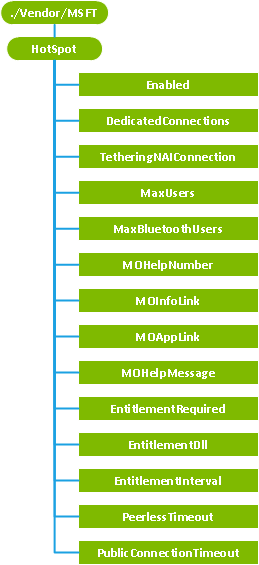

# <a name="hotspot-csp"></a>CSP 热点


用于配置和启用该设备，在其中可以配置设备可以通过 Wi-Fi 与共享其蜂窝连接，最多 8 个客户端设备或计算机上的共享的互联网热点配置服务提供程序。

> **请注意** 在 Windows 10 Mobile 只支持热点的 CSP。

 

> **请注意**  此配置服务提供商要求使用 ID\_CAP\_CSP\_基础功能从网络配置应用程序进行访问。

 

下图显示了热点配置服务提供程序管理对象以树格式由 OMA 客户端资源调配使用。 OMA DM 协议不支持此配置服务提供程序。



<a href="" id="enabled"></a>**启用**  
必需。 指定是否启用了 Internet 共享设备上。 默认值为 false。

如果这最初设置为 false，该功能已关闭，互联网共享屏幕从设置，以便用户不能访问它。 配置更改或连接共享状态更改，将不能进行。

当该选项设置为 true，则的 Internet 共享屏幕添加到设置，但共享是默认关闭直到用户开启。

此设置可以配置在空气中，但它可能需要重新启动，如果这第一次启用时，设置处于打开状态。

<a href="" id="dedicatedconnections"></a>**DedicatedConnections**  
可选项。 指定连接管理器移动电话连接的 Internet 共享公用连接将使用的以分号分隔的列表。

默认情况下，将作为公共连接使用任何可用的连接。 但是，此节点允许移动运营商可以指定一个或多个要用作公共连接的连接名称。

将映射指定的连接策略，互联网共享服务。 枚举连接管理器连接互联网共享服务的所有尝试都将都返回只映射的连接。

> **请注意**  该映射策略还将包括的**TetheringNAIConnection**值中指定的连接。

 

如果不存在指定的连接，Internet 共享将不启动，因为它将没有可供共享任何移动电话连接

如果 Internet 共享服务已经处于共享状态，设置此节点才会生效直至共享停止并重新启动。

<a href="" id="tetheringnaiconnection"></a>**TetheringNAIConnection**  
可选项。 指定 Internet 共享作为公共连接将使用 CDMA TetheringNAI 连接管理器移动电话连接。

CDMA 移动运营商需要在 Internet 共享过程中使用 Tethering NAI，如果它们必须使用[厘米\_CellularEntries 配置服务提供商](cm-cellularentries-csp.md)提供的 TetheringNAI 连接并指定已设置的连接此节点中。

将映射指定的连接策略，互联网共享服务。 枚举连接管理器连接互联网共享服务的所有尝试都将都返回只映射的连接。

> **请注意**  该映射策略还将包括在**DedicatedConnections**以及中指定的连接。

 

如果不存在指定的连接，Internet 共享将不启动，因为它将没有可供共享任何移动电话连接

如果 Internet 共享服务已经处于共享状态，设置此节点才会生效直至共享停止并重新启动。

<a href="" id="maxusers"></a>**MaxUsers**  
可选项。 指定同时访问的用户可以连接到处于共享状态时设备的最大数目。 值必须是介于 1 和非独占 8。 默认值为 5。

如果 Internet 共享服务已经处于共享状态，设置此节点才会生效直至共享停止并重新启动。

<a href="" id="maxbluetoothusers"></a>**MaxBluetoothUsers**  
可选项。 指定的最大并发 Bluetooth 用户同时共享通过 Bluetooth 设备连接数。 该值必须介于含 1 和 7 之间。 缺省值为 7。

<a href="" id="mohelpnumber"></a>**MOHelpNumber**  
可选项。 在互联网共享服务启动失败时向用户显示一个移动指定运算符 – 设备数字。 用户界面会显示一条消息，通知用户，他们可以帮助调用指定的数量。

<a href="" id="moinfolink"></a>**MOInfoLink**  
可选项。 不享受移动指定运算符 — HTTP 链接到 Internet 共享被禁用时，用户或设备显示。 用户界面会显示一条消息，通知用户他们可以访问指定有关如何启用此功能的详细信息的链接。

<a href="" id="moapplink"></a>**MOAppLink**  
可选项。 Windows 设备应用程序链接指向一个预安装的应用程序，由移动运营商，这将有利于用户订阅移动运营商互联网共享服务时没有设置 Internet 共享或权利失败。 常规格式的链接是`app://MOapp`。

<a href="" id="mohelpmessage"></a>**MOHelpMessage**  
可选项。 引用提供的移动运营商，由于权利失败未启用 Internet 共享时，将显示的本地化字符串。 该节点采用了非特定语言的注册表值的字符串具有以下形式︰

`@<path_to_res_dll>,-<str_id>`

其中`<path_to_res_dll>`是包含字符串的资源 dll 的路径和`<str_id>`的字符串标识符。 非特定语言的字符串资源的注册表值的详细信息，请参阅 MSDN 上的[使用注册表字符串重定向](http://msdn.microsoft.com/library/windows/desktop/dd374120.aspx)。

> **请注意** MOAppLink 需要使用 MOHelpMessage 设置。

 

<a href="" id="entitlementrequired"></a>**EntitlementRequired**  
可选项。 指定设备是否需要权利检查以确定是否应启用 Internet 共享。 此节点设置为的布尔值。 默认值为**True**。

默认情况下互联网共享服务将检查权利，每次尝试启用 Internet 共享。 互联网共享应设置为**False**载波解锁设备。

<a href="" id="entitlementdll"></a>**EntitlementDll**  
如果使用`EntitlementRequired`被设置为 true。 DLL 用于使权利的权利的路径检查用于验证设备有权使用 Internet 共享移动运营商的网络上的服务。 值是一个字符串，表示到 DLL 的权利的一个有效的文件系统路径。 默认情况下，Internet 共享服务如果权利检查此设置已丢失或为空。 有关详细信息，请参见本主题后面的[创建权利 DLL](#creating-entitlement-dll) 。

<a href="" id="entitlementinterval"></a>**EntitlementInterval**  
可选项。 时间间隔，以秒为单位的权利之间检查。 默认值为 86400 秒 （24 小时）。

如果定期权利检查失败，将自动禁用 Internet 共享。

<a href="" id="peerlesstimeout"></a>**PeerlessTimeout**  
可选项。 超时时间，以分钟为单位后的 Internet 共享应自动关闭如果不能再有任何活动的客户端。 此节点可以设置为介于 1 和含 120 之间的任何值。 不支持的值为 0。 默认值为 5 分钟。

对此节点更改生效之前，可能需要重新启动。

<a href="" id="publicconnectiontimeout"></a>**PublicConnectionTimeout**  
可选项。 超时值，以分钟为单位之后的 Internet 共享会自动关闭如果蜂窝连接不可用。 这个节点可以设置为任何值介于 1 和 60 非独占。 默认值为 20 分钟。 超时不需要，因此不支持的值为 0。

对此节点的更改需要重新启动。

<a href="" id="minwifikeylength"></a>**MinWifiKeyLength**  
> **重要**  对于 Windows Phone 8.1 不再支持此参数。 Wi-Fi 键强制最小允许的长度为 8。

 

<a href="" id="minwifissidlength"></a>**MinWifiSSIDLength**  
> **重要**  对于 Windows Phone 8.1 不再支持此参数。 Wi-Fi SSID 的强制最小允许的长度为 1。

 

## <a name="additional-requirements-for-cdma-networks"></a>对于 CDMA 网络的附加要求


对于 Internet 共享使用单独的网络访问身份 (NAI) 的 CDMA 网络，具有中添加新参数，TetheringNAI，[厘米\_CellularEntries 配置服务提供商](cm-cellularentries-csp.md)配置服务提供程序。 下面的示例演示如何指定连接。

``` syntax
<wap-provisioningdoc>
    <characteristic type="CM_CellularEntries">
        <characteristic type="TetheringNAIConn">
            <parm name="Version" value="1"/>
            <parm name="UserName" value=""/>
            <parm name="Password" value=""/>
            <parm name="TetheringNAI" value="1"/>
        </characteristic>
    </characteristic>
    <characteristic type="HotSpot">
        <parm name="Enabled" value="true" datatype="boolean"/>
        <parm name="EntitlementRequired" value="false" datatype="boolean"/>
        <parm name="TetheringNAIConnection" value="TetheringNAIConn" datatype="string"/>
    </characteristic>
</wap-provisioningdoc>
```

> **请注意** CDMA 设备仅限于一次一个活动的数据连接。 这意味着任何应用程序或服务 （如电子邮件或 MMS） 绑定到另一个连接打开 Internet 共享时可能无法工作。

 

## <a name="a-href-idcreating-entitlement-dllacreating-an-entitlement-dll"></a><a href="" id="creating-entitlement-dll"></a>创建 DLL 的权利


对于要求权利检查的移动运营商网络，OEM 必须提供设备图像中实现具有以下签名的函数的 DLL:

`ICS_ENTITLEMENT_RESULT IsEntitled(void);`

`EntitlementDll`热点配置服务提供程序的参数必须设置为一个字符串，表示此 DLL 的路径。

DLL 必须是特定方式签名的代码，请参见[符号二进制文件和包](https://msdn.microsoft.com/en-us/library/windows/hardware/dn789217(v=vs.85).aspx)。

在权利检查 Internet 共享服务加载指定的 DLL，然后调用`IsEntitled`函数。 该函数必须连接到服务器以执行任何必需的验证，然后再返回下列之一**ICS\_权利\_结果**枚举值。

<table>
<colgroup>
<col width="50%" />
<col width="50%" />
</colgroup>
<thead>
<tr class="header">
<th>值</th>
<th>说明</th>
</tr>
</thead>
<tbody>
<tr class="odd">
<td><p><strong>ENTITLEMENT_SUCCESS</strong></p></td>
<td><p>该设备可以连接到服务器。</p></td>
</tr>
<tr class="even">
<td><p><strong>ENTITLEMENT_FAILED</strong></p></td>
<td><p>不允许此设备连接到服务器</p></td>
</tr>
<tr class="odd">
<td><p><strong>ENTITLEMENT_UNAVAILABLE</strong></p></td>
<td><p>由于该设备无法与服务器联系或获取连接验证资格，权利检查失败。</p></td>
</tr>
</tbody>
</table>

 

用于定义**ICS\_权利\_结果**头文件中是`IcsEntitlementh`，随 Windows 适配套件。

## <a name="related-topics"></a>相关的主题


[配置服务提供程序的引用](configuration-service-provider-reference.md)

 

 


