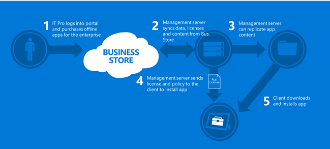
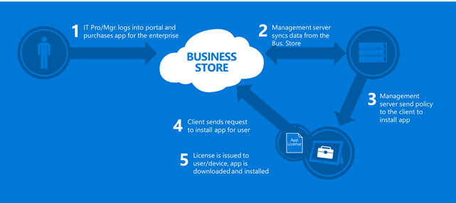
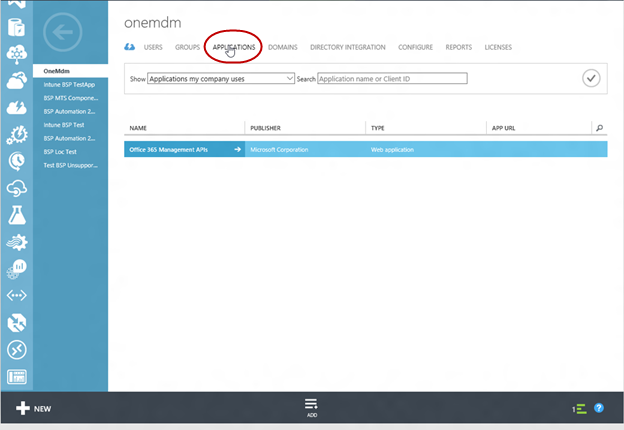
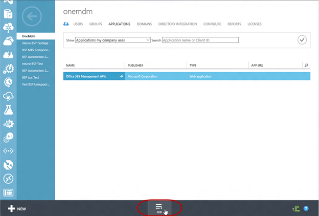
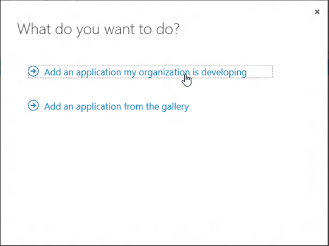
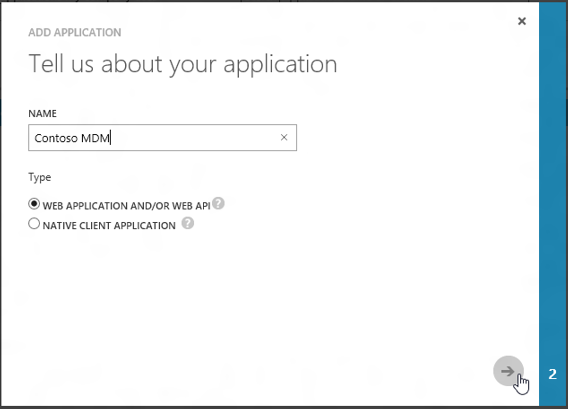
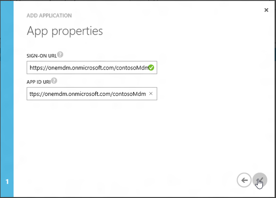
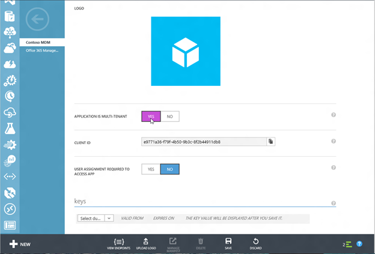
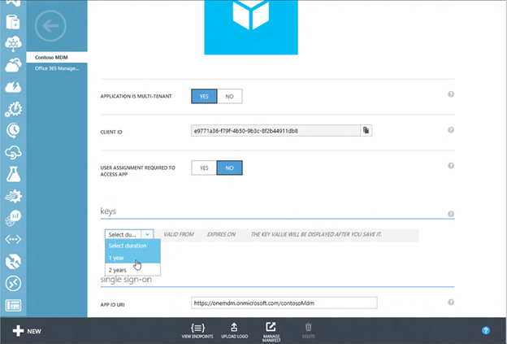
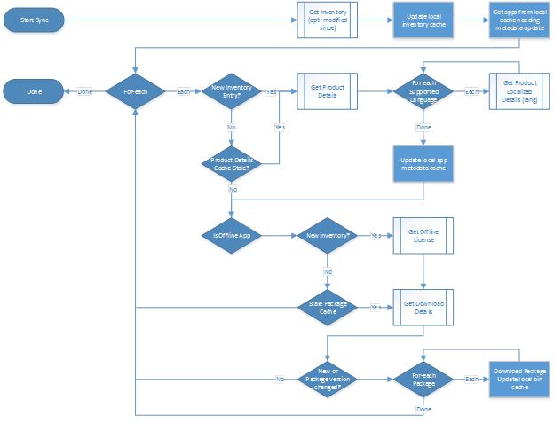

# 为 Windows 应用商店业务管理工具

Windows 应用商店业务有新的 web 服务以获取、 管理和分发应用程序批量的企业而设计。 业务的存储区启用了多种功能所需的企业要从购置到更新管理应用程序的生命周期。

以下是可用的功能的列表︰

-   企业标识 – 使最终用户在组织中使用的标识，在组织内提供给他们的支持。 这使组织若要保留控件的应用程序并不需要组织维护另一套为其用户的标识。
-   批量购买支持的应用程序 — 使 IT 管理员获得大容量的应用程序。 IT 部门现在可以控制的采购和分发的应用程序。 以前，用户手动获取应用程序。
-   许可回收并重复使用 – 使得企业能够通过允许不指派访问权限的应用，能够保留其采购中的值，然后重新分配给另一个用户的应用程序。 在 Windows 应用商店今天，当使用 Microsoft 帐户的用户离开组织时他保留所有权的应用程序。
-   灵活的分发模型用于 Windows 应用商店应用程序 – 允许企业与组织的基础结构集成分发到业务服务的存储和业务服务无法连接到存储设备连接的设备应用程序的进程。
-   自定义的业务线应用程序支持 — 支持管理和企业级应用程序的存储业务通过分发。
-   支持 windows 桌面和移动设备的存储业务支持桌面和移动设备。

商店的业务有关的其他信息，请参阅[Windows 应用商店业务](https://technet.microsoft.com/library/mt606951.aspx)中的 TechNet 主题。

## 管理服务

企业存储提供了服务，使同步组织代表的新的和更新的应用程序管理工具。 一旦进行同步，则可以分发新的和更新的应用程序使用 Windows 管理框架。 服务提供了多种功能，包括提供应用程序数据、 分配和回收应用程序的能力和可以下载脱机许可应用程序包。

<table>
<colgroup>
<col width="50%" />
<col width="50%" />
</colgroup>
<tbody>
<tr class="odd">
<td style="vertical-align:top">
应用程序数据
</td>
<td style="vertical-align:top">
业务服务的存储区的已经获得通过的商店的业务应用程序提供元数据。 这包括应用程序标识符，用于部署在线许可证的应用程序，应用程序用来创建公司门户，图稿和本地化的应用程序的描述。
</td>
</tr>
<tr class="even">
<td style="vertical-align:top">
授权模式
</td>
<td style="vertical-align:top">
<strong>脱机和联机</strong>

联机获得许可的应用程序需要连接到 Windows 应用商店。 用户需要 Azure Active Directory 标识，并且依赖于能够获得应用程序从存储设备上的存储服务。 它是类似于应用程序从 Windows 应用商店使用 Microsoft 客户的购买方式。 分配或回收应用程序使用点需要存储调用业务服务。

脱机许可应用程序使组织能够用于成像和可能没有连接到存储区或可能没有 Azure Active Directory 的设备使用的应用程序。 离线许可的应用程序不需要连接到存储区，但它可以更新直接从存储区如果该设备已连接，并且应用程序更新策略允许通过存储分发更新。
</td>
</tr>
</tbody>
</table>

 

### 脱机许可应用程序分发

下图概述了从脱机许可应用程序分发到收购到客户端的应用程序分发。 一旦同步从存储区的业务，管理工具可以使用 Windows 管理框架将设备应用程序分发。

### 联机许可应用程序分发

下图概述了从在线授权应用程序分发到收购到客户端的应用程序分发。 一旦同步从存储区的业务，管理工具可以使用 Windows 管理框架将设备应用程序分发。 对于在线许可的应用程序，管理工具回拨到业务管理服务的存储分配策略在签发之前应用程序来安装该应用程序。

## 将与 Azure Active Directory 集成

业务服务的存储依赖 Azure Active Directory 进行身份验证。 管理工具必须注册为 Azure 广告中的应用程序组织租户以进行身份验证的存储业务。

若要了解 Azure 广告有关的详细信息以及如何注册 Azure 的广告在您的应用程序，下面是这些主题可帮助您入门︰

-   添加到 Azure Active Directory 的[Azure Active Directory 集成与 MDM](azure-active-directory-integration-with-mdm.md)应用程序
-   访问其他 Web 应用程序和配置应用程序访问其他 Api 的[使用 Azure Active Directory 集成应用程序](http://go.microsoft.com/fwlink/p/?LinkId=623021)
-   通过 Azure AD- [Azure Active Directory 的身份验证方案](http://go.microsoft.com/fwlink/p/?LinkId=623023)的业务服务的存储进行身份验证

有关代码示例，请参阅[Microsoft Azure 活动目录示例和文档](http://go.microsoft.com/fwlink/p/?LinkId=623024)在 GitHub 中。 模式是非常类似于[后台程序最低](http://go.microsoft.com/fwlink/p/?LinkId=623025)， [ConsoleApp-GraphAPI-最低](http://go.microsoft.com/fwlink/p/?LinkId=623026)。

## 配置 AD Azure 应用程序

以下是配置您 Azure AD 的应用程序的步骤。 有关其他信息，请参阅[使用 Azure Active Directory 集成应用程序](http://go.microsoft.com/fwlink/p/?LinkId=623021)︰

1.  登录到 Microsoft Azure 管理门户 (https:manage.windowsazure.com)
2.  转到活动目录模块。
3.  选择您的目录。
4.  单击**应用程序**选项卡。

    

5.  单击**添加**。

    

6.  选择**添加我的公司正在开发的应用程序**。

    

7.  指定一个名称，然后选择**WEB 应用程序和/或 WEB API**。

    

8.  指定应用程序的**符号打开 URL** 。

    

9.  指定您的应用程序是多租户或单租户。 有关详细信息，请参阅[使用 Azure Active Directory 集成应用程序](http://go.microsoft.com/fwlink/p/?LinkId=623021)。

    

10. 创建客户机密钥。

    

   > **请注意** 在以前版本的工具，对应用程序清单的更新才能授权应用程序。 这不再是必需的。
     
11. 登录到存储区的业务，并使您的应用程序。 有关分步指南，请参阅[配置 MDM 提供程序](https://technet.microsoft.com/library/mt606939.aspx)。

## MTS 的 azure AD 身份验证

MTS 要求使用 Azure AD OAuth 载体令牌进行身份验证的调用。 授权令牌是 Azure AD 应用程序表示的从事代表目录/租户上下文中的每台 MDM 组件 （服务/守护程序/上 prem 实例）-。

下面是请求授权令牌的详细信息︰

-   登录权限 = https://login.windows.net/&lt;TargetTenantId&gt;
-   资源/观众\*= https://onestore.microsoft.com
-   客户机 Id = 您 AAD 应用程序的客户端 id
-   ClientSecret = 您 AAD 应用程序客户端/密钥

\*令牌观众 URI 用作为其正在生成该标记，该应用程序的标识符，它不是一个服务终结点或 web 页的 URL。

## 使用管理工具

注册后您管理工具使用 Azure 的广告，可以调用管理服务管理工具。 有几个呼叫模式︰

-   第一个能够获取新的或更新的应用程序。
-   第二个分配或回收应用程序的能力。

下图显示了获取新的或更新的应用程序的调用模式。

**下面是可用操作的列表**︰

-   [获取清单](get-inventory.md)
-   [获得产品的详细信息](get-product-details.md)
-   [获取本地化的产品详细信息](get-localized-product-details.md)
-   [获取脱机许可证](get-offline-license.md)
-   [获取产品包](get-product-packages.md)
-   [获取产品包](get-product-package.md)
-   [获得席位](get-seats.md)
-   [获取客户](get-seat.md)
-   [分配座位](assign-seats.md)
-   [回收从用户的座位](reclaim-seat-from-user.md)
-   [大容量分配和回收用户的座位](bulk-assign-and-reclaim-seats-from-user.md)
-   [获取分配给用户的座位](get-seats-assigned-to-a-user.md)

 

