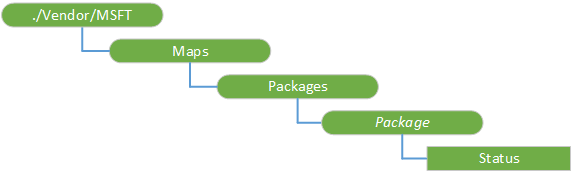

# <a name="maps-csp"></a>映射的 CSP


映射配置服务提供程序 (CSP) 用于配置下载到设备的映射。 Windows 10 1511年版本中添加了该 CSP。

> **请注意** 在 Windows 10 Mobile 只支持映射 CSP。

 

下面的关系图以树格式显示映射配置服务提供程序。



<a href="" id="maps"></a>**地图**  
根节点。

<a href="" id="packages"></a>**软件包**  
表示映射包安装在设备上。

<a href="" id="packages-package"></a>**包 / ***_包_**  
一个表示映射包的 GUID。 添加*程序包*节点时，Windows 会将其添加到下载到设备队列。 请参见下表以了解各种地图和相应的 GUID 的列表。

<a href="" id="packages-package-status"></a>**包 /*包*/Status**  
表示设备上安装该软件包的状态。

有效值︰

-   1-指定的映射包将排队等待下载。
-   2-指定的映射包已下载或安装。

受支持的操作是获得。 如果不排队地图，下载，或已安装，然后您将得到 404 从 Get 请求。

## <a name="examples"></a>示例


这是大多数下载 reqions 的 Guid 列表。

| 地区                        | GUID                                 |
|-------------------------------|--------------------------------------|
| **德国**                   |                                      |
| Baden Wuerttemberg            | bab02b93-31c4-413a-b0fe-95a43e186d8c |
| Bavaria                       | dceea482-12e9-458e-9f0f-21def9a70ed7 |
| 柏林勃兰登堡 /            | d8a80d64-07ef-4145-82e5-97910f1012df |
| Hesse                         | b28e2071-678b-4671-8eff-97e1c124f2fb |
| 低 Saxony/Bremen           | e3ac0f21-7209-4f42-93bf-a0d12c7df2e5 |
| Mecklenburg 西部 Pomerania | 75760c3d-e651-4b4a-abfb-c22e2bf1ed93 |
| 北美 Rhine Westphalia        | 3846905a-891e-46a9-bc6a-53ec43edcab0 |
| Rhineland-Palatinate/萨尔州 | b4c18bb5-1bfe-4da8-a951-833046e37c90 |
| Saxony                        | 8899e1a8-fc79-4f3a-a591-85f15dfb1adb |
| Saxony Anhalt                 | fdd9a3eb-4253-4c4b-b34d-66265775518d |
| Schleswig-Holstein/汉堡    | 74d868dd-99a7-492f-93ee-2b9c0a6b7ebc |
| Thuringia                     | 399a3387-a545-4249-9925-04660426ef1c |
| **英国**            |                                      |
| 英格兰                       | bf612bb8-4094-4158-ac06-96171fa7ffdf |
| 北爱尔兰              | 07f1d10f-cd72-4801-912a-7ba75ef5a627 |
| 苏格兰                      | cade44ea-4421-4023-9498-bf1f92025c9e |
| 威尔士                         | 869f9131-e3c7-41df-b106-9d787c633a10 |
| **美国**                       |                                      |
| 阿拉巴马                       | 4fdaabf4-0160-4075-b7ad-7a8a71e69e7e |
| 阿拉斯加                        | f691e35f-a6b9-4d6c-b657-0f092d5f2f0e |
| 亚利桑那州                       | 4a179b8e-c993-4c4b-a242-51f69068d73b |
| 阿肯色                      | 4d152d48-92aa-4696-b8b2-c0bbacd421b6 |
| 加利福尼亚州                    | 1859bd60-854a-40e3-9216-6e9cf1fcfdce |
| 科罗拉多州                      | d7b4de3d-370c-44dc-8dc7-dcafe676d5ff |
| 康涅狄格州                   | 47fbdbe0-6c4d-4966-9a02-8decc94a5a1c |
| 特拉华州                      | b2882156-e75c-4bdf-8f9f-45cbfac6b915 |
| 佛罗里达州                       | 1769c37c-f22a-4212-bd4b-47036693b034 |
| 格鲁吉亚                       | ad34ec5d-d84c-42fa-bec1-fe6143d2e68d |
| 夏威夷                        | 4019c8a1-0d8f-43c6-baa6-7ff5a7888f21 |
| 爱达荷                         | 008d318b-5004-4e13-a4a4-f520e7969026 |
| 伊利诺斯                      | a2c35505-daf5-432d-a4df-544a5c2987c2 |
| 印地安那州                       | 4c3b6963-e380-45a9-8b25-2bdc4ce1ab26 |
| 爱荷华州                          | e07df1bc-01e6-4ffb-9a20-a142a6d38218 |
| 堪萨斯州                        | 3397467d-3fb9-4ded-b6ad-3ab7313f8ff1 |
| 美国肯塔基                      | bc751324-a591-4ecd-b27a-af15b5518051 |
| 路易斯安那州                     | d11a119c-9e25-40d9-aef9-ed2f161113b0 |
| 缅因                         | db5e6077-f4dd-4548-b50e-ebd147d20c37 |
| 马里兰州                      | 17739d09-a70a-4a23-859c-eabc57418d2f |
| 马萨诸塞州                 | d168d0d5-7683-45a4-afd4-767fd1359ad8 |
| 密歇根                      | 0abd961b-9602-4a2e-b093-c43a2a80aab5 |
| 明尼苏达                     | 2946ed46-b171-4e38-9278-e33a6967f143 |
| 密西西比河                   | 78a38671-a8e8-48f1-a23b-3576df370437 |
| 密苏里州                      | 5c885acb-5fdc-4305-84f1-e18d3163724b |
| 蒙大拿                       | baf84353-89cf-4abd-9226-b932fd2294a4 |
| 内布拉斯加州                      | e389c2f8-41a0-4121-a654-77c52fbd61ed |
| 内华达                        | 8c321bdc-8e37-4be6-96e0-1d85c77c89f0 |
| 新罕布什尔州                 | 38c35895-98ce-4ee4-bb47-7291b5e8543a |
| 新泽西州                    | 70b1d647-ff93-415f-b2be-da06ee800516 |
| 新墨西哥州                    | b434ea36-03ca-405c-8332-044b602e7b49 |
| 纽约                      | 93f2ba61-e03d-4b30-9be3-6e10728302d4 |
| 北卡罗莱纳州                | d07208ed-50da-42f2-bade-cb26f283e113 |
| 北达科他州                  | 8c6f0ebb-f282-431e-b4be-8faca5f12be0 |
| 俄亥俄                          | 36553594-8197-497f-911e-f1cd976c2e00 |
| 俄克拉荷马州                      | 4e3a77ff-9dca-4add-93e9-2a9d6bc244a6 |
| 俄勒冈州                        | cf99c8ce-1b11-4972-9e12-f8c2717ade98 |
| 宾夕法尼亚州                  | cb7c0dea-1f9d-41ae-b81c-e683488d260c |
| 罗德岛                  | 737c2fca-efd3-4f5a-9359-0c301ecc0813 |
| 南卡罗莱纳州                | c0a5542f-5efb-49ae-9d80-3914faa4cf77 |
| 南达科他州                  | dbd8268b-7502-4f71-ba1c-2d452d496b18 |
| 覆盖田纳西州                     | b51f7ae4-9eac-4a2b-b605-c2f9736b3481 |
| 德克萨斯州                         | 4cc26a23-596f-4164-b9c2-ce0267b1ada7 |
| 犹他州                          | 50b2e947-e7b3-41b2-b595-8446f3f425ca |
| 佛蒙特                       | a888d9cc-9f2a-4f18-a00a-15fa860d355d |
| 弗吉尼亚州                      | bfb4cce0-8fa5-4e70-a3c7-a69adce17fc9 |
| 华盛顿                    | 1734acf4-3f87-47db-aec2-2b24c08f5a60 |
| 华盛顿特区               | 271328d6-8409-4975-ba8c-ba44e02fd3e0 |
| 西弗吉尼亚州                 | 638b6499-749b-4908-bfe6-1b9dcf5eb675 |
| 威斯康星州                     | 0b5a98f7-489d-4a07-859b-4e01fe9e1b32 |
| 怀俄明                       | 360e0c25-a3bb-4e29-939a-3631eae46e9a |

 

下面是示例队列映射的纽约包下载。

``` syntax
<SyncML>
    <SyncBody>
       <Add>
            <CmdID>1</CmdID>
            <Item>
                <Target>
                    <LocURI>./Vendor/MSFT/Maps/Packages/93f2ba61-e03d-4b30-9be3-6e10728302d4</LocURI>
                </Target>
            </Item>
        </Add>
        <Final/>
    </SyncBody>
</SyncML>
```

下面是一个示例，获取设备上纽约地图包的状态。

``` syntax
<SyncML>
    <SyncBody>
       <Get>
            <CmdID>1</CmdID>
            <Item>
                <Target>
                    <LocURI>./Vendor/MSFT/Maps/Packages/93f2ba61-e03d-4b30-9be3-6e10728302d4/Status</LocURI>
                </Target>
            </Item>
        </Get>
        <Final/>
    </SyncBody>
</SyncML>
```

 

 


