# 基于 Windows 的设备的 MDM 注册

本主题介绍注册基于 Windows 10 的 Pc 和设备的用户体验。

在今天的云第一个世界中，企业 IT 部门越来越多地想让员工使他们自己的设备，或甚至选择和购买企业所拥有的设备。 连接您的设备，工作方便您可以访问您的组织的资源 （如应用程序、 公司网络和电子邮件）。

> **请注意** 连接您的设备使用移动设备管理 (MDM) 注册时，您的组织可能强制实施某些策略在您的设备上。

 

## 将企业所拥有的基于 Windows 10 的设备连接

公司拥有设备可连接工作或者通过将该设备连接到 Active Directory 域或 Azure 活动目录 (AD Azure) 域。 Windows 10 不需要加入到 Azure AD 的设备上的个人 Microsoft 帐户或内部部署 Active Directory 域。

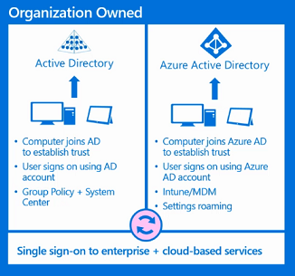

### 您将设备连接到 Active Directory 域 （加入域）

运行 Windows 10 专业的设备，Windows 10 企业或 Windows 10 教育可以连接到 Active Directory 域。 这些设备可以使用设置应用程序进行连接。

> **请注意** 无法将移动设备连接到 Active Directory 域。

 

### 出的体验 (OOBE)

将您的设备在 OOBE 期间加入到 Active Directory 域不受支持，因为您需要首先创建一个本地帐户，然后连接使用设置应用程序的设备。

1.  在**谁拥有这台电脑？**页上，选择**我的工作或学校拥有它**。

    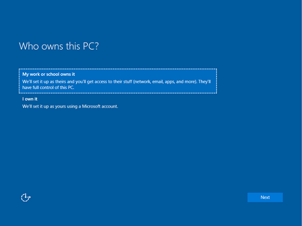

2.  接下来，选择**加入域**。

    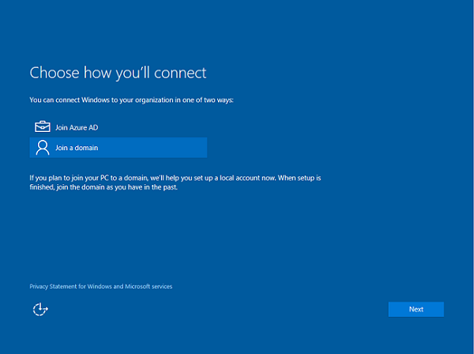

3.  接下来，您将看到一个提示设置设备上的本地帐户。 输入本地帐户详细信息，然后单击**下一步**以继续。

    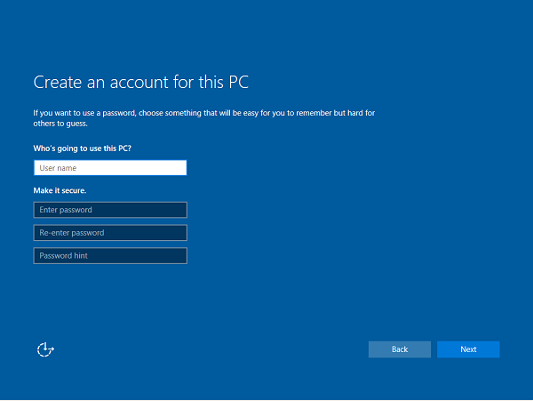

### 使用应用程序设置

1.  启动设置应用程序。

    

2.  接下来，选择**帐户**。

    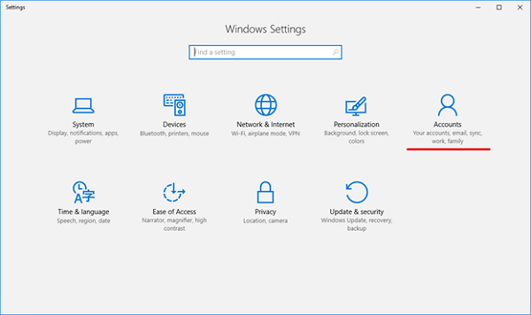

3.  导航到**访问工作或学校**。

    

4.  单击**连接**。

    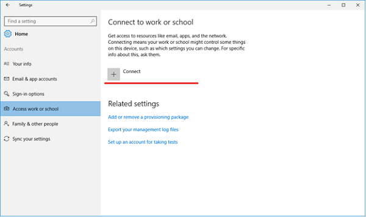

5.  在**其他操作**，单击**加入此设备到本地的 Active Directory 域**。

    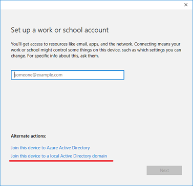

6.  键入您的域名中，按照说明进行操作，然后单击**下一步**要继续。 完成流程并重新启动设备后，应到 Active Directory 域连接。 您现在可以登录设备使用域凭据。

    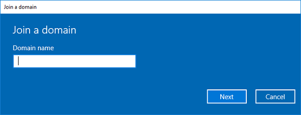

### 与连接到 Active Directory 域帮助

在一些情况下您的设备无法连接到 Active Directory 域︰

| 连接问题                                                | 说明                                                                                                                                                                                                               |
|-----------------------------------------------------------------|---------------------------------------------------------------------------------------------------------------------------------------------------------------------------------------------------------------------------|
| 您的设备已经连接到活动目录域。 | 一次可以到只有一个 Active Directory 域连接您的设备。                                                                                                                                          |
| 您的设备连接到 Azure AD 域。                 | 或者，您的设备可以连接到 Azure AD 域或 Active Directory 域中。 您不能同时连接到两者。                                                                                       |
| 以标准用户的身份登录。                           | 如果以管理员用户身份登录，您的设备可以只连接到 Azure AD 域。 您需要切换到管理员帐户以继续。                                                    |
| 主窗口 10 运行您的设备。                         | 此功能不可用在 Windows 10 家，因此您将不能连接到 Active Directory 域。 您将需要升级到 Windows 10 专业、 Windows 10 企业或 Windows 10 教育继续。 |

 

### 您将设备连接到 Azure AD 域 （连接 Azure 广告）

所有 Windows 设备可以都连接到 Azure AD 域。 可以将这些设备连接在 OOBE 期间。 此外，桌面设备可以连接到 Azure AD 域使用设置应用程序中。

### 出的体验 (OOBE)

1.  选择**我的工作或学校拥有它**，然后单击**下一步。**

    

2.  单击**加入 Azure 的广告**，然后单击**下一步。**

    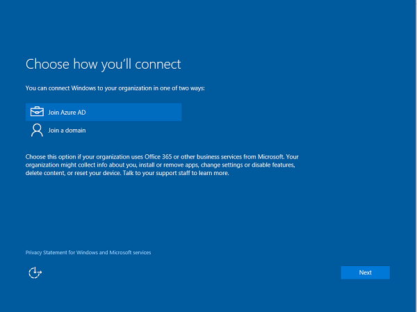

3.  在 Azure AD 用户名键入。 这是您用于登录到 Microsoft Office 365 和类似服务的电子邮件地址。

    租户是否仅云租户，此页将显示组织的自定义标签，并将能够直接在此页上输入您的密码。 如果租户的联盟域的一部分，您将重定向到组织内部联合身份验证服务器，如身份验证为 Active Directory 联合身份验证服务 (AD FS)。

    根据 IT 策略，您可能还会提示您提供身份验证此时第二个因素。 Azure AD 租户已配置自动注册，如果您的设备将还登记到 MDM 这个流量过程。 有关详细信息，请参见[以下博客文章](https://blogs.technet.microsoft.com/enterprisemobility/2015/08/14/windows-10-azure-ad-and-microsoft-intune-automatic-mdm-enrollment-powered-by-the-cloud/)。 如果未配置为自动注册您的租户，必须经过注册流量第二次将设备连接到 mdm。 完成流程后，您的设备将连接到您的组织的 Azure AD 域。

    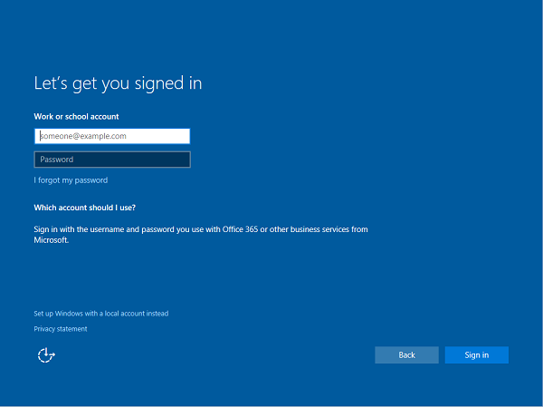

### 使用应用程序设置

1.  启动设置应用程序。

    

2.  接下来，进入**帐户**。

    

3.  导航到**访问工作或学校**。

    

4.  单击**连接**。

    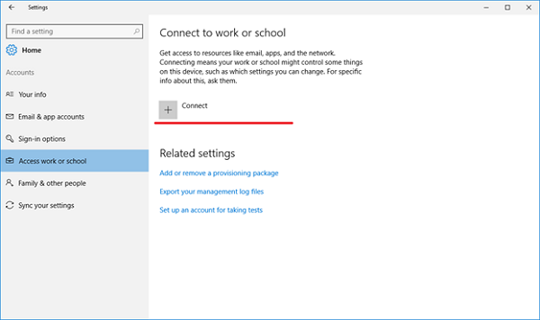

5.  在**其他操作**，单击**加入到 Azure Active Directory 该设备**。

    

6.  在 Azure AD 用户名键入。 这是您用于登录到 Office 365 和类似服务的电子邮件地址。

    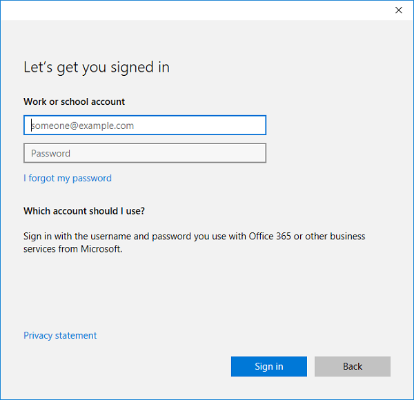

7.  如果租户是云仅租户、 此页面将显示组织的自定义品牌，和您将能够直接在此页上输入您的密码。 如果租户的联盟域的一部分，您将重定向到组织内部联合身份验证服务器，如 AD FS 中，身份验证。

    根据 IT 策略，您可能还会提示您提供身份验证此时第二个因素。

    Azure AD 租户已配置自动注册，如果您的设备将还登记到 MDM 这个流量过程。 有关详细信息，请参见[以下博客文章](https://blogs.technet.microsoft.com/enterprisemobility/2015/08/14/windows-10-azure-ad-and-microsoft-intune-automatic-mdm-enrollment-powered-by-the-cloud/)。 如果未配置为自动注册您的租户，必须经过注册流量第二次将设备连接到 mdm。

    到达流的末尾后，应到您的组织的 Azure AD 域连接您的设备。 您现在可能注销当前帐户并使用 Azure AD 用户名进行登录。

    

### 与连接到 Azure AD 域帮助

在一些情况下您的设备无法连接到 Azure AD 域︰

| 连接问题                                                | 说明                                                                                                                                                                                                                |
|-----------------------------------------------------------------|----------------------------------------------------------------------------------------------------------------------------------------------------------------------------------------------------------------------------|
| 您的设备连接到 Azure AD 域。                 | 您的设备只能连接到单个 Azure AD 域一次。                                                                                                                                                   |
| 您的设备已经连接到活动目录域。 | 或者，您的设备可以连接到 Azure AD 域或 Active Directory 域中。 您不能同时连接到两者。                                                                                        |
| 您的设备已经连接到工作帐户的用户。     | 您可以连接到 Azure AD 域，或连接到工作或学校的帐户。 您不能同时连接到两者。                                                                                            |
| 以标准用户的身份登录。                           | 如果以管理员用户身份登录，您的设备可以只连接到 Azure AD 域。 您需要切换到管理员帐户以继续。                                                     |
| 您的设备已被管理由 mdm。                          | 连接到 Azure 的广告流量将尝试到 MDM 注册您的设备，如果 Azure AD 租户有预配置的 MDM 终结点。 您的设备必须被 unenrolled 从 MDM 能够在这种情况下连接到 Azure 的广告。 |
| 主窗口 10 运行您的设备。                         | 此功能不可用在 Windows 10 家，因此您将不能连接到 Azure AD 域。 您将需要升级到 Windows 10 专业、 Windows 10 企业或 Windows 10 教育继续。          |

 

## 连接个人所拥有的设备 （使您自己的设备）

也称为个人所拥有的设备，使设备或 BYOD，可以连接到一个工作或学校的帐户或 mdm。 Windows 10 不需要在设备连接到学校或工作上的个人 Microsoft 帐户。

### 连接到工作或学校的帐户

所有基于 Windows 10 的设备可以连接到一个工作或学校的帐户。 您可以连接到在设置应用程序或通过例如通用的 Office 应用程序的许多通用 Windows 平台 (UWP) 应用程序的任何工作或学校科目。

### 使用应用程序设置

1.  启动设置应用程序。

    

2.  接下来，进入**帐户**。

    

3.  导航到**访问工作或学校**。

    

4.  单击**连接**。

    

5.  在 Azure AD 用户名键入。 这是您用于登录到 Office 365 和类似服务的电子邮件地址。

    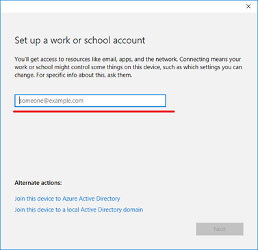

6.  如果租户是云仅租户、 此页面将显示组织的自定义品牌，和您将能够直接在页中输入您的密码。 如果租户的联盟域的一部分，您将重定向到组织内部联合身份验证服务器，如 AD FS 中，身份验证。

    根据 IT 策略，您可能还会提示您提供身份验证此时第二个因素。

    Azure AD 租户已配置自动注册，如果您的设备将还登记到 MDM 这个流量过程。 有关详细信息，请参见[以下博客文章](https://blogs.technet.microsoft.com/enterprisemobility/2015/08/14/windows-10-azure-ad-and-microsoft-intune-automatic-mdm-enrollment-powered-by-the-cloud/)。 如果未配置为自动注册您的租户，必须经过注册流量第二次将设备连接到 mdm。

    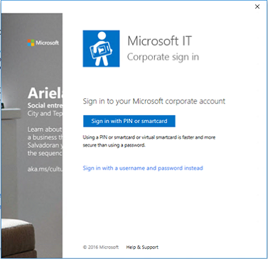

7.  完成流程后，Microsoft 客户将连接到您的工作或学校的帐户。

    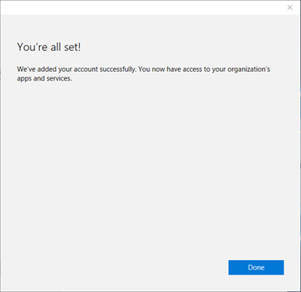

### 在桌面上 (在设备管理中的 Enrolling) 连接到每台 MDM

所有基于 Windows 10 的设备可以连接到 mdm。 您可以连接到每台 MDM 通过设置应用程序。

### 使用应用程序设置

1.  启动设置应用程序。

    

2.  接下来，进入**帐户**。

    

3.  导航到**访问工作或学校**。

    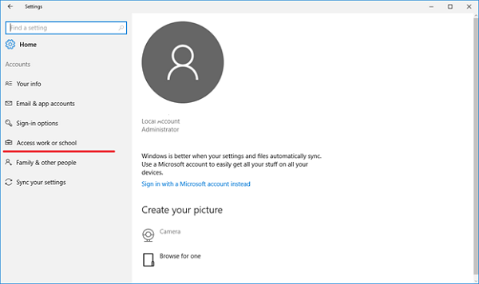

4.  单击**注册，只在设备管理**链接 （适用于服务生成 14393.82，KB3176934）。 对于较早版本中，使用[连接基于 Windows 10 的设备来使用深层链接正常工作](#connecting-your-windows-10-based-device-to-work-using-a-deep-link)。

    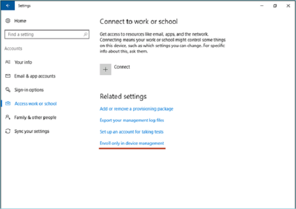

5.  键入您的工作电子邮件地址。

    

6.  如果设备发现仅支持内部身份验证某个终结点，此页将更改，并要求您提供密码。 如果设备发现 MDM 终结点支持联合身份验证，则会显示一个新窗口，将要求您提供额外的身份验证信息。

    根据 IT 策略，您可能还会提示您提供身份验证此时第二个因素。

    完成流程后，您的设备将连接到组织的 mdm。

    

### 在电话 (在设备管理中的 Enrolling) 上连接到每台 MDM

1.  启动**设置**应用程序，然后单击**帐户**。

    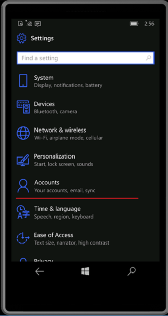

2.  单击**访问工作或学校**。

    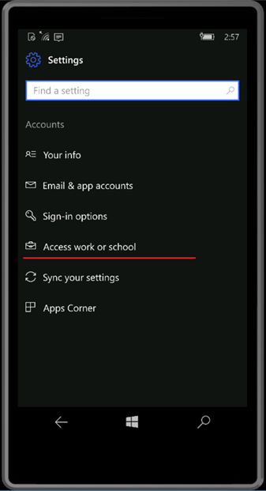

3.  单击**仅在设备管理中的注册**链接。 此窗口才可用服务生成 14393.82 (KB3176934) 中。 对于较早版本中，使用[连接基于 Windows 10 的设备来使用深层链接正常工作](#connecting-your-windows-10-based-device-to-work-using-a-deep-link)。

    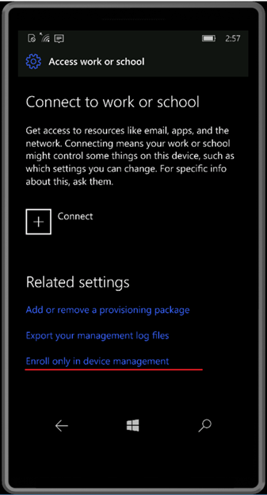

4.  请输入您的工作电子邮件地址。

    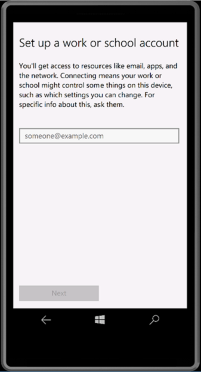

5.  如果设备发现仅支持内部身份验证某个终结点，此页将更改，并要求您提供密码。 如果设备发现 MDM 终结点支持联合身份验证，则会显示一个新窗口，将要求您提供额外的身份验证信息。

    根据 IT 策略，您可能还会提示您提供身份验证此时第二个因素。

6.  完成流程后，您的设备将连接到组织的 mdm。

    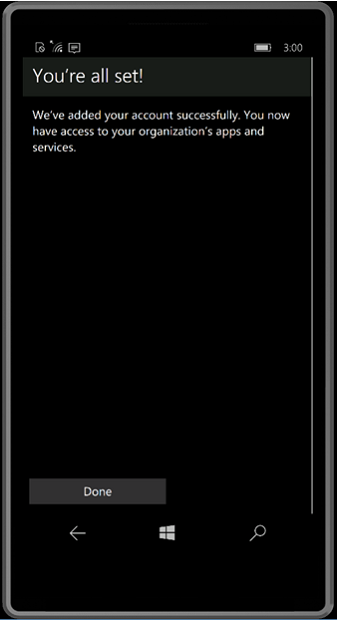

### 帮助个人拥有的设备的连接

有极少数情况下，您的设备可能不能连接工作，如下表中所述。

| 错误消息                                                                                                                                                                              | 说明                                                                                         |
|--------------------------------------------------------------------------------------------------------------------------------------------------------------------------------------------|-----------------------------------------------------------------------------------------------------|
| 您的设备已连接到您的组织的云。                                                                                                                             | 您的设备已经连接到任一 Azure 的广告，某一工作或学校帐户或 AD 域。     |
| 我们在找不到您的身份信息组织的云。                                                                                                                              | 在 Azure AD 租户找不到您输入的用户名。                                     |
| 您的设备已被管理的组织。                                                                                                                                   | 您的设备也已由 MDM 或系统中心配置管理器管理。                |
| 您没有执行此操作的适当权限。 请与您的管理员。                                                                                                  | 作为标准用户，不能到 MDM 注册您的设备。 您必须是管理员帐户。 |
| 我们不能自动发现匹配输入的用户名的管理方终结点。 请检查您的用户名，然后重试。 如果您知道您管理端点 URL，请输入它。 | 您需要提供您每台 MDM 服务器 URL 或检查您输入的用户名的拼写。  |

 

## 连接基于 Windows 10 的设备来使用深层链接正常工作

可能连接 10 基于 Windows 的设备来使用深层链接正常工作。 用户可以单击或打开中特定的链接从任何地方在 Windows 10 格式，并将重定向到新的注册体验到。

在第 10 Windows 版本 1607，深层链接将仅支持用于将设备连接到 mdm。 它不支持添加某一工作或学校设备加入 Azure 的广告，并将设备连接到活动目录的帐户。

用来连接您的设备来处理深层链接将始终使用以下格式︰

**ms-设备-注册︰ ?mode = {模式\_名称}**

| 参数 | 说明                                                  | 受支持的值为 Windows 10，1607年版本 |
|-----------|--------------------------------------------------------------|----------------------------------------------|
| 模式      | 描述在应用程序中注册，将执行哪种模式。 | "mdm"                                        |

 

### 连接到每台 MDM 使用深层链接

连接到每台 MDM 使用深层链接时，您应该使用的 URI 是

**ms-设备-注册︰ ?mode = mdm**

下面的过程描述用户如何能够他们的设备连接到 MDM 使用深层链接。

1.  开头第 10 Windows 版本 1607，您可以创建一个链接以启动内置注册应用程序使用 URI **ms-设备-注册︰ ?mode = mdm**和用户友好的显示文本，例如，**单击此处可连接 Windows 能够**︰

    > **请注意** 这将启动注册与等效流到 Windows 10 1511年版本中的设备管理选项。

    - IT 管理员可以将此链接添加到的欢迎电子邮件，用户可以单击要注册到 mdm。

      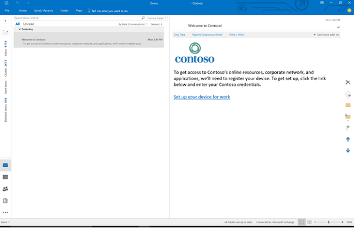

    - IT 管理员还可以为内部 web 页的用户，请参阅注册说明添加此链接。

2.  在单击的链接或运行它之后, Windows 10 将启动注册应用程序以特殊模式只允许 MDM 的招生名额 （类似于 Windows 10 1511年版本中的设备管理选项到注册）。

    键入您的工作电子邮件地址。

    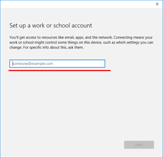

3.  如果设备发现仅支持内部身份验证某个终结点，此页将更改，并要求您提供密码。 如果设备发现 MDM 终结点支持联合身份验证，则会显示一个新窗口，将要求您提供额外的身份验证信息。

    > **请注意** 根据 IT 策略，您可能还会提示您提供身份验证此时第二个因素。

    完成流程后，您的设备将连接到组织的 mdm。

    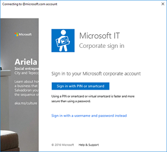

## 管理连接

可以**设置**管理您的工作或学校连接&gt;**帐户** &gt; **访问工作或学校**的网页。 您的连接将显示在此页上，单击其中一个将展开该连接的选项。

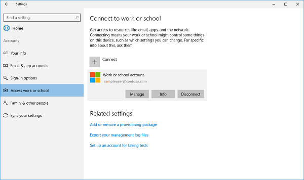

### 管理

在工作或学校连接涉及到 Azure 广告上找不到**管理**按钮。 这包括以下方案︰

-   您将设备连接到 Azure AD 域
-   连接到工作或学校的帐户。

单击管理按钮将打开默认浏览器中的连接相关联的 Azure 广告门户网站。

### 信息

**信息**按钮可以找到工作或学校连接涉及 mdm。 这包括以下方案︰

-   您将设备连接到 Azure AD 域具有自动注册到 MDM 配置。
-   为工作或学校的帐户具有连接您的设备自动注册到 MDM 配置。
-   将您的设备连接到 mdm。

在设置应用程序中提供有关每台 MDM 连接的详细信息，单击**信息**按钮将打开一个新页面。 您可以在此页上查看您的组织支持信息 （如果配置）。 您还可以启动一个同步会话，则会强制您的设备与 MDM 服务器通信并向策略获取的任何更新，如果需要。

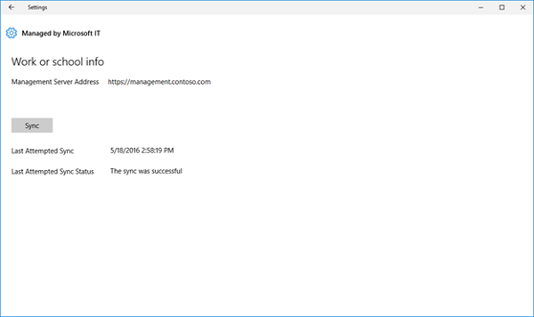

### 断开连接

**断开连接**按钮可以找到工作的所有连接上。 通常情况下，单击**断开连接**按钮将该连接从设备上删除。 有几个例外情况︰

-   AllowManualMDMUnenrollment 策略强制实施的设备将不允许用户删除 MDM 的招生名额。 必须通过删除这些连接服务器启动 unenroll 命令。
-   在移动设备上无法断开连接从 Azure 的广告。 擦除设备，仅可以删除这些连接。

> **警告** 断开连接可能会导致在该设备上的数据丢失。

 

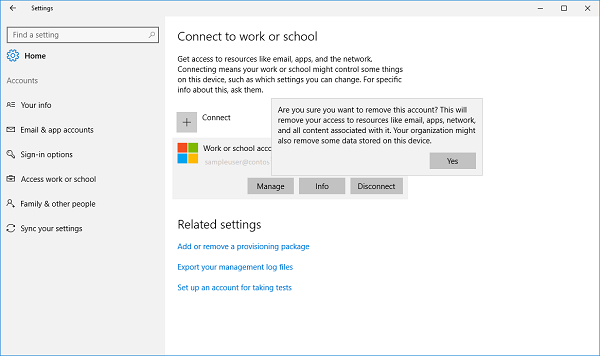

## 正在收集诊断日志

您可以通过转到**设置**诊断日志收集周围工作连接&gt;**帐户** &gt; **访问工作或学校**，以及**相关的设置**下单击**导出管理日志**的链接。 单击此链接后，单击**导出**，然后按照显示检索管理日志文件的路径。

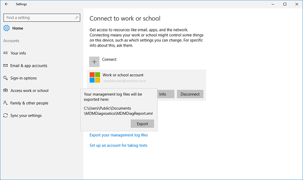

 

