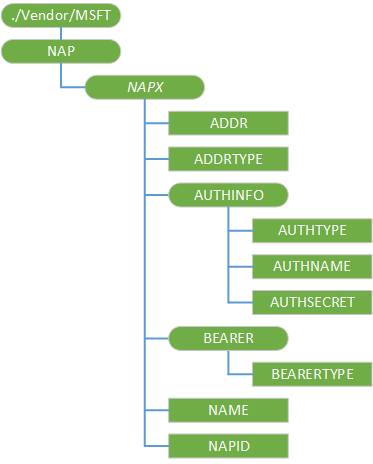

# NAP CSP

用于管理和查询 GPRS 和 CDMA 连接 （网络访问点） NAP 配置服务提供程序。

> **请注意**  此配置服务提供商要求使用 ID\_CAP\_CSP\_基础和 ID\_CAP\_网络\_管理功能从网络配置应用程序进行访问。

 

对于 NAP 的 CSP，不能使用替换命令，除非该节点已存在。

下图显示了 NAP 配置服务提供程序管理对象以树格式由 OMA DM。 OMA 客户端资源调配协议不支持此配置服务提供程序。

**./Vendor/MSFT/NAP**  
根节点。

***NAPX***  
必需。 定义网络接入点的名称。

建议此元素名称，被指定为从零开始的编号的节点。 例如，若要设置两个网络接入点，使用"NAP0"和"NAP1"作为元素名称。 可以使用任何唯一的名称，如果需要 （例如"GPRS 的 NAP")，但不能含有空格可能出现在名称 （而是使用 20%）。

***NAPX*/NAPID**  
必需。 指定目标网络的标识符。

NAPID 值中不能包含"@"字符。 如果 NAPDEF 配置服务提供程序定义为“connectionID@WAP”,此值应设置为"connectionID"。

***NAPX*/NAME**  
可选项。 指定该连接的用户友好名称。

***NAPX*/ADDR**  
必需。 指定目标网络地址。

地址可能的 URL 访问点、 GPRS 接入点的 APN 名称、 应答调制解调器或任何其他字符串用来唯一标识的目标网络地址的电话号码。

***NAPX*/ADDRTYPE**  
必需。 指定用于识别目标网络地址的类型。

下表显示了一些常用的 ADDRTYPE 值和对应的连接的类型的每个值。

<table>
<colgroup>
<col width="50%" />
<col width="50%" />
</colgroup>
<thead>
<tr class="header">
<th>ADDRTYPE 值</th>
<th>连接类型</th>
</tr>
</thead>
<tbody>
<tr class="odd">
<td>
E164
</td>
<td>
RAS 连接
</td>
</tr>
<tr class="even">
<td>
APN
</td>
<td>
GPRS 连接
</td>
</tr>
<tr class="odd">
<td>
Alpha
</td>
<td>
基于 Wi-Fi 连接
</td>
</tr>
</tbody>
</table>

 

***NAPX*/AuthInfo**  
可选的节点。 指定的身份验证信息，包括协议、 用户名称和密码。

****NAPX/AuthInfo/AuthType**  
可选项。 指定身份验证的方法。 一些受支持的协议是 PAP，CHAP，HTTP 基本 HTTP 摘要式 WTLS-SS，MD5。

****NAPX/AuthInfo/AuthName**  
可选项。 指定的用户名和域身份验证过程中使用。 此字段在表单*域*中为\\*的用户名*。

****NAPX/AuthInfo/AuthSecret**  
可选项。 指定在身份验证过程中使用的密码。

此字段的查询将返回一个字符串组成，十六个星号 (\*)。

***NAPX*/Bearer**  
节点。

****NAPX/载体/BearerType**  
必需。 指定目标网络的网络类型。 这可设为 GPRS、 CDMA2000、 WCDMA、 TDMA、 CSD、 DTPT、 WiFi。

## 相关的主题

[配置服务提供程序的引用](configuration-service-provider-reference.md)

 

 

