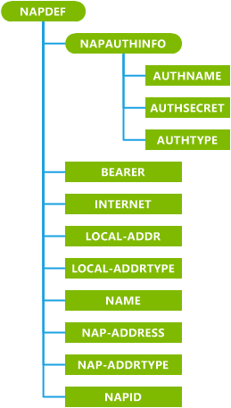
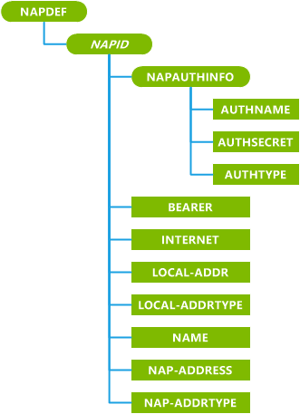

# NAPDEF 的 CSP

NAPDEF 配置服务提供程序用于添加、 修改或删除 WAP 网络接入点 (NAPs)。 有关这些设置的完整信息，请参阅标准 WAP 规范 WAP-183-ProvCont-20010724-a。

> **请注意** 不能在桌面上使用 NAPDEF CSP 更新推送代理网关 (PPG) 列表。

 

> **请注意**  此配置服务提供商要求使用 ID\_CAP\_CSP\_基础和 ID\_CAP\_网络\_管理功能从网络配置应用程序进行访问。

 

下图显示了 NAPDEF 配置服务提供程序管理对象以树格式由 OMA 客户端设置为**初始引导的电话**。 OMA DM 协议不支持此配置服务提供程序。

下图显示了 NAPDEF 配置服务提供程序管理对象由 OMA 客户端资源调配用于**更新电话引导**的树格式。 OMA DM 协议不支持此配置服务提供程序。

**NAPAUTHINFO**  
定义一组身份验证设置。

**AUTHNAME**  
指定用来对用户进行身份验证的名称。

**AUTHSECRET**  
指定用来对用户进行身份验证的密码。

此参数的查询返回星号 (\*) 在结果中。

**AUTHTYPE**  
指定用于验证用户身份的协议。

此元素的唯一允许的值是"POP"（密码身份验证协议） 和"CHAP"（挑战握手认证协议） 身份验证协议。 注意

> **请注意**如果**AuthType**未包括在该初始设备的配置，则不创建**AuthName**和**AuthSecret** 。   如果**AuthType**不包括在置备 XML 用于进行更改，则无法更改**AuthName**和**AuthSecret** 。

 

**持有者**  
指定的类型的载体。

仅全局系统移动通信 (GSM) 和 GSM 通用数据包无线服务 (GPRS) 都受支持。

**互联网**  
可选项。 指定是否 AlwaysOn 连接。

如果**互联网**存在，连接 AlwaysOn 连接并且不需要连接管理器策略。

如果没有**互联网**，连接未 AlwaysOn 连接和连接要求连接管理器连接策略设置。

**本地地址**  
所需的 GPRS。 指定 GPRS 接入点的 WAP 客户端的本地地址。

**本地 ADDRTYPE**  
所需的 GPRS。 指定的**本地地址**元素的地址格式。

当地 ADDRTYPE 的值可以是"IPv4"。

**名称**  
指定 NAP 的逻辑、 用户可读的身份。

**NAP 地址**  
指定 NAP 的地址。

**NAP ADDRTYPE**  
指定的格式和协议的**NAP 地址**元素。

支持仅访问点名称 (APN) 和 E164。

**NAPID**  
所需的初始引导。 指定 NAP 的名称。

**NAPID**值的最大长度为 16 个字符。

***NAPID***  
所需的引导更新。 定义 NAP 的名称。

*NAPID*元素的名称是在初始引导过程中传递的值相同。 此外，NAPDEF 的 Microsoft 格式包含置备 XML 特性 mwid。 添加盹或代理服务器时，此自定义属性是可选的。 它是必需的*NAPID*更新和删除现有 NAPs 和代理服务器时，必须有它的值设置为 1。

## Microsoft 的自定义元素

下表显示了此配置服务提供程序支持 OMA 客户端资源调配的 Microsoft 自定义元素。

<table>
<colgroup>
<col width="20%" />
<col width="80%" />
</colgroup>
<thead>
<tr class="header">
<th>元素</th>
<th>可用</th>
</tr>
</thead>
<tbody>
<tr class="odd">
<td>
参数查询
</td>
<td>
是

请注意一些 GPRS 参数将不必包含完全相同的值被设置为。
</td>
</tr>
<tr class="even">
<td>
noparm
</td>
<td>
是
</td>
</tr>
<tr class="odd">
<td>
nocharacteristic
</td>
<td>
是
</td>
</tr>
<tr class="even">
<td>
特征查询
</td>
<td>
是
</td>
</tr>
</tbody>
</table>

 

## 相关的主题

[配置服务提供程序的引用](configuration-service-provider-reference.md)

 

 

