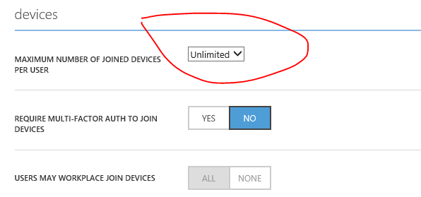

# <a name="whats-new-in-mdm-enrollment-and-management"></a>在 MDM 注册和管理的新增功能


本主题提供了有关 Windows 10 移动设备管理 (MDM) 注册中的新的和重大更改的信息和管理经验在所有 Windows 10 设备。

有关 Microsoft Windows 10 的移动设备管理协议请参阅[\[MS MDM\]︰ 移动设备管理协议](http://go.microsoft.com/fwlink/p/?LinkId=619346)和[\[MS MDE2\]︰ 移动设备注册协议版本 2]( http://go.microsoft.com/fwlink/p/?LinkId=619347)。

## <a name="in-this-section"></a>在这一节


-   [Windows 10 1511年版本中的新增功能](#whatsnew)
-   [Windows 10，1607年版本中的新增功能](#whatsnew1607)
-   [这种手段和已知的问题](#breaking-changes-and-known-issues)
    -   [Get 命令内原子的命令不受支持](#getcommand)
    -   [通知信道的 URI 从 Windows 8.1 升级到 Windows 10 过程中不保留](#notification)
    -   [使用 WMI 类安装的应用程序不会被删除](#appsnotremoved)
    -   [在 SyncML 传递 CDATA 不起作用](#cdata)
    -   [SCEP 在 IIS 服务器的 SSL 设置必须设置为"忽略"](#sslsettings)
    -   [MDM 注册移动设备上要通过代理服务器通信时出现故障](#enrollmentviaproxy)
    -   [服务器启动 unenroll 故障](#unenrollment)
    -   [造成问题的原因与 Wi-Fi 和 VPN 的证书](#certissues)
    -   [移动设备的版本信息](#versioninformation)
    -   [使用应用程序添加到白名单使用 ApplicationRestriction 策略升级 Windows Phone 8.1 设备时出现问题](#whitelist)
    -   [应用程序依赖于 Microsoft 框架可能被阻止](#frameworks)
    -   [多个证书可能会导致 Windows 10 移动 Wi-fi 连接不稳定这些现象](#wificertissue)
    -   [远程重置 PIN 不支持在 Azure Active Directory 中加入移动设备](#remote)
    -   [MDM 客户机将立即签入与 MDM 服务器后在客户端更新 WNS 信道的 URI](#renewwns)
    -   [Azure Active Directory 中的用户设置失败加入 Windows 10 PC](#userprovisioning)
    -   [请注意对于 VPN 还可以用于 Kerberos 身份验证的证书的要求](#kerberos)
    -   [依靠以点击方式重置设备管理代理无法正常工作](#pushbuttonreset)
-   [在 MDM 文档的更改历史记录](#change-history-in-mdm-documentation)
-   [常见问题](#faq)

## <a name="a-href-idwhatsnewawhats-new-in-windows-10-version-1511"></a><a href="" id="whatsnew"></a>Windows 10 1511年版本中的新增功能

<table>
<colgroup>
<col width="25%" />
<col width="75%" />
</colgroup>
<thead>
<tr class="header">
<th>项目</th>
<th>说明</th>
</tr>
</thead>
<tbody>
<tr class="odd">
<td style="vertical-align:top"><p>新配置服务提供程序添加到 Windows 10 1511年版本中</p></td>
<td style="vertical-align:top"><ul>
<li>[AllJoynManagement 的 CSP](alljoynmanagement-csp.md)</li>
<li>[映射的 CSP](maps-csp.md)</li>
<li>[报告 CSP](reporting-csp.md)</li>
<li>[SurfaceHub 的 CSP](surfacehub-csp.md)</li>
<li>[WindowsSecurityAuditing 的 CSP](windowssecurityauditing-csp.md)</li>
</ul></td>
</tr>
<tr class="even">
<td style="vertical-align:top"><p>在策略的 CSP 的新增和更新策略</p></td>
<td style="vertical-align:top"><p>已添加到[策略 CSP](policy-configuration-service-provider.md)以下策略︰</p>
<ul>
<li>帐户/DomainNamesForEmailSync</li>
<li>ApplicationManagement/AllowWindowsBridgeForAndroidAppsExecution</li>
<li>Bluetooth/ServicesAllowedList</li>
<li>数据保护/AllowAzureRMSForEDP</li>
<li>数据保护/RevokeOnUnenroll</li>
<li>DeviceLock/DevicePasswordExpiration</li>
<li>DeviceLock/DevicePasswordHistory</li>
<li>文本输入/AllowInputPanel</li>
<li>更新/PauseDeferrals</li>
<li>更新/RequireDeferUpdate</li>
<li>更新/RequireUpdateApproval</li>
</ul>
<p>在 CSP 中策略已更新下列策略︰</p>
<ul>
<li>系统/AllowLocation</li>
<li>更新/RequireDeferUpgrade</li>
</ul>
<p>在策略 CSP 中不建议使用以下策略︰</p>
<ul>
<li>文本输入/AllowKoreanExtendedHanja</li>
<li>WiFi/AllowWiFiHotSpotReporting</li>
</ul></td>
</tr>
<tr class="odd">
<td style="vertical-align:top"><p>为 Windows 应用商店业务管理工具</p></td>
<td style="vertical-align:top"><p>新的主题。 企业存储中有新的 web 服务以获取、 管理和分发应用程序批量的企业而设计。 它使一些所需的企业要从购置到更新管理应用程序生命周期的功能。</p></td>
</tr>
<tr class="even">
<td style="vertical-align:top"><p>自定义标头一般警报</p></td>
<td style="vertical-align:top"><p>MDM GenericAlert 是一个新的自定义标头承载一个或多个设备发送到服务器期间 OMA DM 会话的 http 消息中提供的预警信息。 如果会话由于一个或多个关键或致命警报设备由触发，发送一般性警报。 以下是通知的格式︰</p>
<code>MDM-GenericAlert: &lt;AlertType1&gt;&lt;AlertType2&gt;</code>
<p>MDM GenericAlert 如果存在，则显示在每个传出 MDM 消息同一 OMA DM 会话中的。 关于一般警报的详细信息，请参阅此[OMA 网站](http://go.microsoft.com/fwlink/p/?LinkId=267526)OMA 设备管理协议，已批准版本 1.2.1 中的部分为 8.7。</p></td>
</tr>
<tr class="odd">
<td style="vertical-align:top"><p>对于较慢的客户端响应的警报消息</p></td>
<td style="vertical-align:top"><p>当 MDM 服务器发送配置请求时，有时花客户端 HTTP 超时比长聚在一起的所有信息，并且会话然后因超时而意外结束。 默认情况下，MDM 客户机不发送警报的 DM 请求处于挂起状态。</p>
<p>要解决超时值，可以使用 EnableOmaDmKeepAliveMessage 设置使通过回发到服务器发送心跳消息的会话保持活动状态。 这被通过在正文中发送与特定设备警报元素 SyncML 消息，直到该客户端能够响应回发到服务器的请求信息。 有关详细信息，请参阅 EnableOmaDmKeepAliveMessage 节点中[DMClient 的 CSP](dmclient-csp.md)。</p></td>
</tr>
<tr class="even">
<td style="vertical-align:top"><p>在 DMClient 的 CSP 的新节点</p></td>
<td style="vertical-align:top"><p>添加新节点 EnableOmaDmKeepAliveMessage 到[DMClient 的 CSP](dmclient-csp.md) ，更新 ManagementServerAddress 来指示，它可以包含 Url 的列表。</p></td>
</tr>
<tr class="odd">
<td style="vertical-align:top"><p>在 EnterpriseModernAppManagement CSP 中新节点</p></td>
<td style="vertical-align:top"><p>添加到[EnterpriseModernAppManagement CSP](enterprisemodernappmanagement-csp.md)中的以下节点︰</p>
<ul>
<li>AppManagement/GetInventoryQuery</li>
<li>AppManagement/GetInventoryResults</li>
<li>.../<em>PackageFamilyName</em>/AppSettingPolicy/<em>SettingValue</em></li>
<li><em>AppLicenses/StoreLicenses/LicenseID</em>/LicenseCategory</li>
<li><em>AppLicenses/StoreLicenses/LicenseID</em>/LicenseUsage</li>
<li><em>AppLicenses/StoreLicenses/LicenseID</em>/RequesterID</li>
<li><em>AppLicenses/StoreLicenses/LicenseID</em>/GetLicenseFromStore</li>
</ul></td>
</tr>
<tr class="even">
<td style="vertical-align:top"><p>在 EnterpriseExt CSP 中新节点</p></td>
<td style="vertical-align:top"><p>添加到[EnterpriseExt CSP](enterpriseext-csp.md)中的以下节点︰</p>
<ul>
<li>DeviceCustomData （CustomID，CustomeString）</li>
<li>亮度 （默认、 MaxAuto）</li>
<li>LedAlertNotification （状态、 强度、 时间段、 DutyCycle、 Cyclecount）</li>
</ul></td>
</tr>
<tr class="odd">
<td style="vertical-align:top"><p>在 EnterpriseExtFileSystem 的 CSP 的新节点</p></td>
<td style="vertical-align:top"><p>添加到[EnterpriseExtFileSystem 的 CSP](enterpriseextfilessystem-csp.md)的 OemProfile 节点。</p></td>
</tr>
<tr class="even">
<td style="vertical-align:top"><p>在 PassportForWork CSP 中新节点</p></td>
<td style="vertical-align:top"><p>添加到[PassportForWork CSP](passportforwork-csp.md)中的以下节点︰</p>
<ul>
<li>TenantId/策略/PINComplexity/历史记录</li>
<li>TenantId/策略/PINComplexity/过期</li>
<li>TenantId/策略/远程/UseRemotePassport （仅适用于./Device/Vendor/MSFT)</li>
<li>生物/UseBiometrics （仅适用于./Device/Vendor/MSFT)</li>
<li>生物/FacialFeaturesUseEnhancedAntiSpoofing （仅适用于./Device/Vendor/MSFT)</li>
</ul></td>
</tr>
<tr class="odd">
<td style="vertical-align:top"><p>更新的 EnterpriseAssignedAccess CSP</p></td>
<td style="vertical-align:top"><p>以下是[EnterpriseAssignedAccess CSP](enterpriseassignedaccess-csp.md)的变化︰</p>
<ul>
<li>在 AssignedAccessXML 节点添加新的页面设置和快速的操作设置。</li>
<li>在 AssignedAccessXML 节点，针应用程序使用 AUMID 的多个应用程序程序包中添加有关方法的示例。</li>
<li>更新[EnterpriseAssignedAccess XSD](enterpriseassignedaccess-xsd.md)主题。</li>
</ul></td>
</tr>
<tr class="even">
<td style="vertical-align:top"><p>在 DevDetail CSP 中新节点</p></td>
<td style="vertical-align:top"><p>以下是[DevDetail CSP](devdetail-csp.md)的变化︰</p>
<ul>
<li>已添加的 TotalStore 和 TotalRAM 设置。</li>
<li>添加了对设备名称设置为替换命令的支持。</li>
</ul></td>
</tr>
<tr class="odd">
<td style="vertical-align:top"><p>处理大型对象</p></td>
<td style="vertical-align:top"><p>增加了处理上载到服务器的大型对象的客户端支持。</p></td>
</tr>
</tbody>
</table>

 

## <a name="a-href-idwhatsnew1607awhats-new-in-windows-10-version-1607"></a><a href="" id="whatsnew1607"></a>Windows 10，1607年版本中的新增功能


<table>
<colgroup>
<col width="25%" />
<col width="75%" />
</colgroup>
<thead>
<tr class="header">
<th>项目</th>
<th>说明</th>
</tr>
</thead>
<tbody>
<tr class="odd">
<td style="vertical-align:top"><p>Sideloading 的应用程序</p></td>
<td style="vertical-align:top"><p>启动 Windows 10 版 1607 中, sideloading 的应用程序只能通过[EnterpriseModernAppManagement 的 CSP](enterprisemodernappmanagement-csp.md)。 产品密钥 (5 x 5) 就不再支持启用 Windows 10 版本 1607年设备上的 sideloading。</p></td>
</tr>
<tr class="even">
<td style="vertical-align:top"><p>[NodeCache 的 CSP](nodecache-csp.md)的新值</p></td>
<td style="vertical-align:top"><p>在[NodeCache 的 CSP](nodecache-csp.md)，启动 Windows 10 中的 NodeCache 根节点的值 1607年版本是 com.microsoft/1.0/MDM/NodeCache。</p></td>
</tr>
<tr class="odd">
<td style="vertical-align:top">[EnterpriseDataProtection 的 CSP](enterprisedataprotection-csp.md)</td>
<td style="vertical-align:top"><p>新的 CSP。</p></td>
</tr>
<tr class="even">
<td style="vertical-align:top">[CSP 的策略](policy-configuration-service-provider.md)</td>
<td style="vertical-align:top"><p>删除下列策略︰</p>
<ul>
<li>数据保护/AllowAzureRMSForEDP-移动到[EnterpriseDataProtection CSP](enterprisedataprotection-csp.md)的此策略</li>
<li>数据保护/AllowUserDecryption-移动到[EnterpriseDataProtection CSP](enterprisedataprotection-csp.md)的此策略</li>
<li>数据保护/EDPEnforcementLevel-移动到[EnterpriseDataProtection CSP](enterprisedataprotection-csp.md)的此策略</li>
<li>数据保护/RequireProtectionUnderLockConfig-移动到[EnterpriseDataProtection CSP](enterprisedataprotection-csp.md)的此策略</li>
<li>数据保护/RevokeOnUnenroll-移动到[EnterpriseDataProtection CSP](enterprisedataprotection-csp.md)的此策略</li>
<li>数据保护/EnterpriseCloudResources-NetworkIsolation 策略移动此策略</li>
<li>数据保护/EnterpriseInternalProxyServers-NetworkIsolation 策略移动此策略</li>
<li>数据保护/EnterpriseIPRange-NetworkIsolation 策略移动此策略</li>
<li>数据保护/EnterpriseNetworkDomainNames-NetworkIsolation 策略移动此策略</li>
<li>数据保护/EnterpriseProxyServers-NetworkIsolation 策略移动此策略</li>
<li>安全/AllowAutomaticDeviceEncryptionForAzureADJoinedDevices-该策略已被否决。</li>
</ul>
<p>Windows 10，1607年版本中添加的<strong>WiFi/AllowManualWiFiConfiguration</strong>和<strong>WiFi/AllowWiFi</strong>策略︰</p>
<ul>
<li>Windows 10 专业</li>
<li>Windows 10 企业</li>
<li>Windows 10 教育</li>
</ul>
<p>添加下面的新策略︰</p>
<ul>
<li>AboveLock/AllowCortanaAboveLock</li>
<li>ApplicationManagement/DisableStoreOriginatedApps</li>
<li>身份验证/AllowSecondaryAuthenticationDevice</li>
<li>Bluetooth/AllowPrepairing</li>
<li>浏览器/AllowExtensions</li>
<li>浏览器/PreventAccessToAboutFlagsInMicrosoftEdge</li>
<li>浏览器/ShowMessageWhenOpeningSitesInInternetExplorer</li>
<li>DeliveryOptimization/DOAbsoluteMaxCacheSize</li>
<li>DeliveryOptimization/DOMaxDownloadBandwidth</li>
<li>DeliveryOptimization/DOMinBackgroundQoS</li>
<li>DeliveryOptimization/DOModifyCacheDrive</li>
<li>DeliveryOptimization/DOMonthlyUploadDataCap</li>
<li>DeliveryOptimization/DOPercentageMaxDownloadBandwidth</li>
<li>DeviceLock/EnforceLockScreenAndLogonImage</li>
<li>DeviceLock/EnforceLockScreenProvider</li>
<li>Defender/PUAProtection</li>
<li>体验/AllowThirdPartySuggestionsInWindowsSpotlight</li>
<li>体验/AllowWindowsSpotlight</li>
<li>体验/ConfigureWindowsSpotlightOnLockScreen</li>
<li>体验/DoNotShowFeedbackNotifications</li>
<li>许可/AllowWindowsEntitlementActivation</li>
<li>许可/DisallowKMSClientOnlineAVSValidation</li>
<li>锁定/AllowEdgeSwipe</li>
<li>图/EnableOfflineMapsAutoUpdate</li>
<li>图/AllowOfflineMapsDownloadOverMeteredConnection</li>
<li>消息 AllowMessageSync</li>
<li>NetworkIsolation/EnterpriseCloudResources</li>
<li>NetworkIsolation/EnterpriseInternalProxyServers</li>
<li>NetworkIsolation/EnterpriseIPRange</li>
<li>NetworkIsolation/EnterpriseIPRangesAreAuthoritative</li>
<li>NetworkIsolation/EnterpriseNetworkDomainNames</li>
<li>NetworkIsolation/EnterpriseProxyServers</li>
<li>NetworkIsolation/EnterpriseProxyServersAreAuthoritative</li>
<li>NetworkIsolation/NeutralResources</li>
<li>通知/DisallowNotificationMirroring</li>
<li>隐私/DisableAdvertisingId</li>
<li>隐私/LetAppsAccessAccountInfo</li>
<li>隐私/LetAppsAccessAccountInfo_ForceAllowTheseApps</li>
<li>隐私/LetAppsAccessAccountInfo_ForceDenyTheseApps</li>
<li>隐私/LetAppsAccessAccountInfo_UserInControlOfTheseApps</li>
<li>隐私/LetAppsAccessCalendar</li>
<li>隐私/LetAppsAccessCalendar_ForceAllowTheseApps</li>
<li>隐私/LetAppsAccessCalendar_ForceDenyTheseApps</li>
<li>隐私/LetAppsAccessCalendar_UserInControlOfTheseApps</li>
<li>隐私/LetAppsAccessCallHistory</li>
<li>隐私/LetAppsAccessCallHistory_ForceAllowTheseApps</li>
<li>隐私/LetAppsAccessCallHistory_ForceDenyTheseApps</li>
<li>隐私/LetAppsAccessCallHistory_UserInControlOfTheseApps</li>
<li>隐私/LetAppsAccessCamera</li>
<li>隐私/LetAppsAccessCamera_ForceAllowTheseApps</li>
<li>隐私/LetAppsAccessCamera_ForceDenyTheseApps</li>
<li>隐私/LetAppsAccessCamera_UserInControlOfTheseApps</li>
<li>隐私/LetAppsAccessContacts</li>
<li>隐私/LetAppsAccessContacts_ForceAllowTheseApps</li>
<li>隐私/LetAppsAccessContacts_ForceDenyTheseApps</li>
<li>隐私/LetAppsAccessContacts_UserInControlOfTheseApps</li>
<li>隐私/LetAppsAccessEmail</li>
<li>隐私/LetAppsAccessEmail_ForceAllowTheseApps</li>
<li>隐私/LetAppsAccessEmail_ForceDenyTheseApps</li>
<li>隐私/LetAppsAccessEmail_UserInControlOfTheseApps</li>
<li>隐私/LetAppsAccessLocation</li>
<li>隐私/LetAppsAccessLocation_ForceAllowTheseApps</li>
<li>隐私/LetAppsAccessLocation_ForceDenyTheseApps</li>
<li>隐私/LetAppsAccessLocation_UserInControlOfTheseApps</li>
<li>隐私/LetAppsAccessMessaging</li>
<li>隐私/LetAppsAccessMessaging_ForceAllowTheseApps</li>
<li>隐私/LetAppsAccessMessaging_ForceDenyTheseApps</li>
<li>隐私/LetAppsAccessMessaging_UserInControlOfTheseApps</li>
<li>隐私/LetAppsAccessMicrophone</li>
<li>隐私/LetAppsAccessMicrophone_ForceAllowTheseApps</li>
<li>隐私/LetAppsAccessMicrophone_ForceDenyTheseApps</li>
<li>隐私/LetAppsAccessMicrophone_UserInControlOfTheseApps</li>
<li>隐私/LetAppsAccessMotion</li>
<li>隐私/LetAppsAccessMotion_ForceAllowTheseApps</li>
<li>隐私/LetAppsAccessMotion_ForceDenyTheseApps</li>
<li>隐私/LetAppsAccessMotion_UserInControlOfTheseApps</li>
<li>隐私/LetAppsAccessNotifications</li>
<li>隐私/LetAppsAccessNotifications_ForceAllowTheseApps</li>
<li>隐私/LetAppsAccessNotifications_ForceDenyTheseApps</li>
<li>隐私/LetAppsAccessNotifications_UserInControlOfTheseApps</li>
<li>隐私/LetAppsAccessPhone</li>
<li>隐私/LetAppsAccessPhone_ForceAllowTheseApps</li>
<li>隐私/LetAppsAccessPhone_ForceDenyTheseApps</li>
<li>隐私/LetAppsAccessPhone_UserInControlOfTheseApps</li>
<li>隐私/LetAppsAccessRadios</li>
<li>隐私/LetAppsAccessRadios_ForceAllowTheseApps</li>
<li>隐私/LetAppsAccessRadios_ForceDenyTheseApps</li>
<li>隐私/LetAppsAccessRadios_UserInControlOfTheseApps</li>
<li>隐私/LetAppsAccessTrustedDevices</li>
<li>隐私/LetAppsAccessTrustedDevices_ForceAllowTheseApps</li>
<li>隐私/LetAppsAccessTrustedDevices_ForceDenyTheseApps</li>
<li>隐私/LetAppsAccessTrustedDevices_UserInControlOfTheseApps</li>
<li>隐私/LetAppsSyncWithDevices</li>
<li>隐私/LetAppsSyncWithDevices_ForceAllowTheseApps</li>
<li>隐私/LetAppsSyncWithDevices_ForceDenyTheseApps</li>
<li>隐私/LetAppsSyncWithDevices_UserInControlOfTheseApps</li>
<li>安全/PreventAutomaticDeviceEncryptionForAzureADJoinedDevices</li>
<li>设置/AllowEditDeviceName</li>
<li>语音/AllowSpeechModelUpdate</li>
<li>系统/TelemetryProxy</li>
<li>更新/ActiveHoursStart</li>
<li>更新/ActiveHoursEnd</li>
<li>更新/AllowMUUpdateService</li>
<li>更新/BranchReadinessLevel</li>
<li>更新/DeferFeatureUpdatesPeriodInDays</li>
<li>更新/DeferQualityUpdatesPeriodInDays</li>
<li>更新/ExcludeWUDriversInQualityUpdate</li>
<li>更新/PauseFeatureUpdates</li>
<li>更新/PauseQualityUpdates</li>
<li>WindowsInkWorkspace/AllowWindowsInkWorkspace</li>
<li>WindowsInkWorkspace/AllowSuggestedAppsInWindowsInkWorkspace</li>
<li>WirelessDisplay/AllowProjectionToPC</li>
<li>WirelessDisplay/RequirePinForPairing</li>
</ul>
<p>更新<strong>隐私/AllowAutoAcceptPairingAndPrivacyConsentPrompts</strong>说明以删除过期的信息。</p>
<p>更新的 DeliveryOptimization/DODownloadMode 以添加新值。</p>
<p>执行更新的经验/AllowCortana 说明，以阐明每个受支持的值。</p>
<p>执行更新的安全/AntiTheftMode 说明，以阐明每个受支持的值。</p></td>
</tr>
<tr class="odd">
<td style="vertical-align:top">[DMClient 的 CSP](dmclient-csp.md)</td>
<td style="vertical-align:top"><p>添加以下设置︰</p>
<ul>
<li>ManagementServerAddressList</li>
<li>AADDeviceID</li>
<li>EnrollmentType</li>
<li>HWDevID</li>
<li>CommercialID</li>
</ul>
<p>删除 EnrollmentID 设置。</p></td>
</tr>
<tr class="even">
<td style="vertical-align:top">[报告 CSP](reporting-csp.md)</td>
<td style="vertical-align:top"><p>增加了<strong>安全审计</strong>设置为桌面支持。</p></td>
</tr>
<tr class="odd">
<td style="vertical-align:top">[DeviceManageability 的 CSP](devicemanageability-csp.md)</td>
<td style="vertical-align:top"><p>新的 CSP。</p></td>
</tr>
<tr class="even">
<td style="vertical-align:top">[DeviceStatus 的 CSP](devicestatus-csp.md)</td>
<td style="vertical-align:top"><p>添加以下新的设置︰</p>
<ul>
<li>DeviceStatus/TPM/SpecificationVersion</li>
<li>DeviceStatus/操作系统/版本</li>
<li>SignatureStatus/DeviceStatus/防病毒软件</li>
<li>DeviceStatus/防病毒/状态</li>
<li>SignatureStatus/DeviceStatus/反间谍软件</li>
<li>DeviceStatus/反间谍软件/状态</li>
<li>DeviceStatus/防火墙/状态</li>
<li>DeviceStatus/UAC/状态</li>
<li>DeviceStatus/电池/状态</li>
<li>DeviceStatus/电池/EstimatedChargeRemaining</li>
<li>DeviceStatus/电池/余</li>
</ul></td>
</tr>
<tr class="odd">
<td style="vertical-align:top">[AssignedAccess 的 CSP](assignedaccess-csp.md)</td>
<td style="vertical-align:top"><p>增加了 SyncML 示例。</p></td>
</tr>
<tr class="even">
<td style="vertical-align:top">[EnterpriseAssignedAccess 的 CSP](enterpriseassignedaccess-csp.md)</td>
<td style="vertical-align:top"><ul>
<li>AssignedAccess/AssignedAccessXml 描述中添加一个新的文件夹表条目。</li>
<li>更新 DDF 和 XSD 文件部分。</li>
</ul></td>
</tr>
<tr class="odd">
<td style="vertical-align:top">[SecureAssessment 的 CSP](secureassessment-csp.md)</td>
<td style="vertical-align:top"><p>新的 CSP 的 Windows 10 版本 1607</p></td>
</tr>
<tr class="even">
<td style="vertical-align:top">[DiagnosticLog 的 CSP](diagnosticlog-csp.md)
<p>[DiagnosticLog DDF](diagnosticlog-ddf.md)</p></td>
<td style="vertical-align:top"><p>两个新的设置与 CSP 添加的版本 1.3。 添加新 DDF 的 1.3 版本。 Windows 10，1607年版本中添加以下新的设置。</p>
<ul>
<li>DeviceStateData</li>
<li>DeviceStateData/MdmConfiguration</li>
</ul></td>
</tr>
<tr class="odd">
<td style="vertical-align:top">[重新启动 CSP](reboot-csp.md)</td>
<td style="vertical-align:top"><p>新的 CSP 的 Windows 10 版本 1607</p></td>
</tr>
<tr class="even">
<td style="vertical-align:top">[CMPolicyEnterprise 的 CSP](cmpolicyenterprise-csp.md)</td>
<td style="vertical-align:top"><p>新的 CSP 的 Windows 10 版本 1607</p></td>
</tr>
<tr class="odd">
<td style="vertical-align:top">[VPNv2 的 CSP](vpnv2-csp.md)</td>
<td style="vertical-align:top"><p>添加以下设置以用于 Windows 10，1607年版本</p>
<ul>
<li><em>ProfileName</em>/RouteList/routeRowId/ExclusionRoute</li>
<li><em>ProfileName</em>/DomainNameInformationList/<em>dniRowId</em>/AutoTrigger</li>
<li><em>ProfileName</em>/DomainNameInformationList/dniRowId/Persistent</li>
<li><em>ProfileName</em>/ProfileXML</li>
<li><em>ProfileName</em>/DeviceCompliance/启用</li>
<li><em>ProfileName</em>/DeviceCompliance/Sso</li>
<li><em>ProfileName</em>/DeviceCompliance/Sso/Enabled</li>
<li><em>ProfileName</em>/DeviceCompliance/Sso/IssuerHash</li>
<li><em>ProfileName</em>/DeviceCompliance/Sso/Eku</li>
<li><em>ProfileName</em>/NativeProfile/CryptographySuite</li>
<li><em>ProfileName</em>/NativeProfile/CryptographySuite/AuthenticationTransformConstants</li>
<li><em>ProfileName</em>/NativeProfile/CryptographySuite/CipherTransformConstants</li>
<li><em>ProfileName</em>/NativeProfile/CryptographySuite/EncryptionMethod</li>
<li><em>ProfileName</em>/NativeProfile/CryptographySuite/IntegrityCheckMethod</li>
<li><em>ProfileName</em>/NativeProfile/CryptographySuite/DHGroup</li>
<li><em>ProfileName</em>/NativeProfile/CryptographySuite/PfsGroup</li>
<li><em>ProfileName</em>/NativeProfile/L2tpPsk</li>
</ul></td>
</tr>
<tr class="even">
<td style="vertical-align:top">[Win32AppInventory 的 CSP](win32appinventory-csp.md)
<p>[Win32AppInventory DDF](win32appinventory-ddf-file.md)</p></td>
<td style="vertical-align:top"><p>新的 CSP 的 Windows 10，1607年版本。</p></td>
</tr>
<tr class="odd">
<td style="vertical-align:top">[SharedPC 的 CSP](sharedpc-csp.md)</td>
<td style="vertical-align:top"><p>新的 CSP 的 Windows 10，1607年版本。</p></td>
</tr>
<tr class="even">
<td style="vertical-align:top">[WindowsAdvancedThreatProtection 的 CSP](windowsadvancedthreatprotection-csp.md)</td>
<td style="vertical-align:top"><p>新的 CSP 的 Windows 10，1607年版本。</p></td>
</tr>
<tr class="odd">
<td style="vertical-align:top">[MDM 桥 WMI 提供程序](https://msdn.microsoft.com/library/windows/hardware/dn905224)</td>
<td style="vertical-align:top"><p>Windows 10，1607年版本添加新类。</p></td>
</tr>
<tr class="even">
<td style="vertical-align:top">[Windows 设备的 MDM 注册](mdm-enrollment-of-windows-devices.md)</td>
<td style="vertical-align:top"><p>从主题重命名&quot;注册用户界面&quot;。</p>
<p>完全更新注册过程和屏幕抓图。</p></td>
</tr>
<tr class="odd">
<td style="vertical-align:top">[UnifiedWriteFilter 的 CSP](unifiedwritefilter-csp.md)
<p>[UnifiedWriteFilter DDF 文件](unifiedwritefilter-ddf.md)</p></td>
<td style="vertical-align:top"><p>添加以下新 Windows 10，1607年版本的设置︰</p>
<ul>
<li>NextSession/HORMEnabled</li>
</ul></td>
</tr>
<tr class="even">
<td style="vertical-align:top">[CertificateStore 的 CSP](certificatestore-csp.md)
<p>[CertificateStore DDF 文件](certificatestore-ddf-file.md)</p></td>
<td style="vertical-align:top"><p>Windows 10，1607年版本中添加以下新的设置︰</p>
<ul>
<li>我/WSTEP/续订/LastRenewalAttemptTime</li>
<li>我/WSTEP/续订/RenewNow</li>
</ul></td>
</tr>
</tbody>
</table>

 

## <a name="breaking-changes-and-known-issues"></a>这种手段和已知的问题


### <a name="a-href-idgetcommandaget-command-inside-an-atomic-command-is-not-supported"></a><a href="" id="getcommand"></a>Get 命令内原子的命令不受支持

在 Windows 10 Get 命令内原子的命令不支持。 这被允许 Windows Phone 8 和 Windows Phone 8.1 中。

### <a name="a-href-idnotificationanotification-channel-uri-not-preserved-during-upgrade-from-windows-81-to-windows-10"></a><a href="" id="notification"></a>通知信道的 URI 从 Windows 8.1 升级到 Windows 10 过程中不保留

在从 Windows 8.1 升级至 Windows 10，不保留通知通道 URI 信息。 另外，MDM 客户端失去 PFN、 应用程序标识和客户的机密。

升级到 Windows 10 后，您应该调用 MDM\_WNSConfiguration 类来重新创建该通知信道的 URI。

### <a name="a-href-idappsnotremovedaapps-installed-using-wmi-classes-are-not-removed"></a><a href="" id="appsnotremoved"></a>使用 WMI 类安装的应用程序不会被删除

从设备中移除 MDM 帐户时，安装使用 WMI 类的应用程序不会删除。

### <a name="a-href-idcdataapassing-cdata-in-syncml-does-not-work"></a><a href="" id="cdata"></a>在 SyncML 传递 CDATA 不起作用

Windows 10 中，传入到 ConfigManager 和 Csp CDATA SyncML 数据不起作用。 它在 Windows Phone 8 中所起的作用。

### <a name="a-href-idsslsettingsassl-settings-in-iis-server-for-scep-must-be-set-to-ignore"></a><a href="" id="sslsettings"></a>SCEP 在 IIS 服务器的 SSL 设置必须设置为"忽略"

证书设置在"SSL 设置"下，在 IIS 服务器中 SCEP 必须设置为"忽略"Windows 10 中。 Windows Phone 8.1 中设置为"接受"，该客户端证书时它工作正常。


### <a name="a-href-idenrollmentviaproxyamdm-enrollment-fails-on-the-mobile-device-when-traffic-is-going-through-proxy"></a><a href="" id="enrollmentviaproxy"></a>MDM 注册移动设备上要通过代理服务器通信时出现故障

当移动设备配置为使用代理服务器要求身份验证时，则注册将失败。 要变通解决此问题，用户可以使用代理服务器不要求进行身份验证或移除连接的网络的代理设置。

### <a name="a-href-idunenrollmentaserver-initiated-unenrollment-failure"></a><a href="" id="unenrollment"></a>服务器启动注销失败

通过以无提示方式添加工作帐户注册设备的服务器启动注销失败离开 MDM 帐户活动。 MDM 策略和资源仍然存在，并且客户端可以继续与服务器同步。

移动设备注册 Azure 活动目录加入通过禁用远程服务器注销。 它向服务器返回一条错误消息。 删除注册 Azure ad 连接的移动设备的唯一办法是通过远程擦除设备。

### <a name="a-href-idcertissuesacertificates-causing-issues-with-wi-fi-and-vpn"></a><a href="" id="certissues"></a>造成问题的原因与 Wi-Fi 和 VPN 的证书

当前在 Windows 10 版本 1511，当使用 ClientCertificateInstall 来将证书安装到设备存储和用户存储区的两个证书都发送到设备在相同的 MDM 负载中，适用于设备存储区的证书也将安装在用户存储区。 选择正确的证书以建立连接时，这可能与 Wi-Fi 或 VPN 导致问题。 我们正在努力解决此问题。

### <a name="a-href-idversioninformationaversion-information-for-mobile-devices"></a><a href="" id="versioninformation"></a>移动设备的版本信息

从**DevDetail/SwV**软件版本信息与在**系统 / 关于**下的**设置**中的版本不匹配。

### <a name="a-href-idwhitelistaupgrading-windows-phone-81-devices-with-app-whitelisting-using-applicationrestriction-policy-has-issues"></a><a href="" id="whitelist"></a>使用应用程序添加到白名单使用 ApplicationRestriction 策略升级 Windows Phone 8.1 设备时出现问题

-   在 Windows Phone 8.1 设备升级到 Windows 10 手机，ApplicationRestrictions 使用允许的应用程序的列表时，某些窗口收件箱的应用程序被阻止导致意外的行为。 要变通解决此问题，必须包括[收件箱的应用程序](applocker-csp.md#inboxappsandcomponents)所需的允许的应用程序列表。

    下面是升级过程的附加指南︰

    -   在[收件箱的应用程序](applocker-csp.md#inboxappsandcomponents)中列出的应用程序使用 Windows 10 产品 Id。
    -   使用新的 Microsoft 发布服务器名称 (PublisherName ="CN = Microsoft Corporation，O = Microsoft Corporation，L = 雷蒙德，S = 华盛顿，C = 美国") 和出版商 ="CN = Microsoft Windows 中，O = Microsoft Corporation，L = 雷蒙德，S = 华盛顿，C = 美国"如果使用发行者策略。 如果您正在使用它，则不要删除 Windows Phone 8.1 发布者规则。
    -   在 SyncML，必须使用小写的产品 id。
    -   不复制产品 id。 消息和 Skype 视频使用相同的产品 id。 重复值会导致错误。

    有关其他详细信息，请参阅[ApplicationRestrictions PolicyManager CSP 中](policymanager-csp.md#applicationmanagement-applicationrestrictions)。

-   即使使用 Windows Phone 8.1 发布者规则指定的发行者策略，Silverlight xaps 可能无法安装。 例如，Silverlight 应用程序"级别"将无法安装，即使您指定&lt;出版商 PublisherName ="微软公司"/&gt;。

    解决此问题，请删除 Windows Phone 8.1 发布者规则并添加您想要允许到允许的应用程序列表中每个 Silverlight 应用程序的特定产品 ID。

-   某些应用程序 （特别是作为 AppX 捆绑 Windows 应用商店发布的那些） 阻止甚至当它们包含在应用程序列表时，才安装。

    这一次没有解决方法才可用。 不久就会出现操作系统更新，以修复此问题。

### <a name="a-href-idframeworksaapps-dependent-on-microsoft-frameworks-may-get-blocked-in-phones-prior-to-build-10586218"></a><a href="" id="frameworks"></a>应用程序依赖于 Microsoft 框架可能生成 10586.218 在电话中被阻止

仅适用于在生成 10586.218 电话︰ 当 ApplicationManagement/ApplicationRestrictions 策略部署到 Windows 10 移动设备、 安装和更新的应用程序相关的 Microsoft 框架可能被阻止出现错误 0x80073CF9。 要变通解决此问题，必须到允许的应用程序列表包括 Microsoft 框架 Id。

``` syntax
<App ProductId="{00000000-0000-0000-0000-000000000000}" PublisherName="CN=Microsoft Corporation, O=Microsoft Corporation, L=Redmond, S=Washington, C=US"/>
```

### <a name="a-href-idwificertissueamultiple-certificates-might-cause-wi-fi-connection-instabilities-in-windows-10-mobile"></a><a href="" id="wificertissue"></a>多个证书可能会导致 Windows 10 移动 Wi-fi 连接不稳定这些现象

在您的部署中，如果您有多个证书在该设备上设置和配置的 Wi-Fi 配置文件并没有严格的筛选条件，您可能看到连接故障时连接到 Wi-fi。 解决方案是确保 Wi-Fi 配置文件设置有严格的筛选条件，以便它与一个证书匹配。

企业部署证书基于 EAP 身份验证的 VPN/Wi-Fi 可面临的情况有多个符合默认条件用于身份验证的证书。 这可能会导致的问题如︰

-   可能会提示用户选择证书。
-   错误的证书可能获取自动选择，并会导致身份验证失败。

生产准备部署必须相应证书的详细信息与部署配置文件的一部分。 以下信息解释如何创建或更新 EAP 配置 XML，以便多余的证书将被过滤掉并适当的证书可以用于身份验证。

EAP XML 必须进行这种手动编辑 XML 示例下面，或者使用步骤的用户界面指南为您的环境的相关信息更新。 EAP XML 更新后，请参阅说明从您的 MDM 部署更新的配置，如下所示︰

-   对于 Wi-fi，查找&lt;EAPConfig&gt; （这是您所指定的 Wi-Fi CSP 中的 WLanXml 节点） 您当前 WLAN 配置文件 XML 的部分。 在这些标记中，您会发现完整的 EAP 配置。 替换部分下的&lt;EAPConfig&gt;与您更新 XML 并更新您的 Wi-fi® 配置文件。 您可能需要引用 MDM 的指导如何部署新的 Wi-Fi 配置文件。
-   对于 VPN，EAP 配置为 MDM 配置单独的域。 使用 MDM 提供程序确定并更新相应的字段。

有关设置的详细说明，请参见<https://technet.microsoft.com/library/hh945104.aspx#BKMK_Cfg_cert_Selct>

有关生成 EAP XML 的信息，请参阅[EAP 配置](eap-configuration.md)

扩展的密钥用法的详细信息，请参见<http://tools.ietf.org/html/rfc5280#section-4.2.1.12>

有关将扩展密钥用法 (EKU) 添加到证书的信息，请参见<https://technet.microsoft.com/library/cc731792.aspx>

下面的列表描述了证书 EAP 与一起使用的系统必备组件︰

-   证书必须具有至少下列 EKU （扩展密钥用法） 属性之一︰

    -   客户端身份验证
    -   按照 RFC 5280 的定义，这是一个定义完善的 OID 值 1.3.6.1.5.5.7.3.2
    -   任何目的
    -   EKU 定义和由 Microsoft 发布的是一个定义完善的 OID 值 1.3.6.1.4.1.311.10.12.1。 包含该 OID 意味着证书可以用于任何目的。 此 EKU 所有目的 EKU 相比的优势是其他非临界或自定义 Eku 仍然可以添加到有效筛选的证书。
    -   所有目的
    -   如果 CA 中包含扩展的密钥用法，以满足某些应用程序需要但不希望限制使用的密钥由 RFC 5280，CA 可以添加一个扩展的密钥用法值为 0。 具有这种 EKU 的证书可以用于所有目的。
-   用户或客户端链接到受信任的根 CA 上的计算机证书
-   用户或计算机证书不会失败任何一种由 CryptoAPI 证书存储区中，执行检查和证书通过远程访问策略中的要求。
-   用户或计算机证书不会失败的证书对象标识符检查 Internet 验证服务 (IAS) 中指定的任何一个 / Radius 服务器。
-   主题备用名称 (SubjectAltName) 扩展的证书中包含的用户的用户主体名称 (UPN)。

以下 XML 示例解释为包括证书的 EAP TLS XML 属性。

> **请注意** PEAP 或 TTLS 配置式 EAP TLS XML 嵌入一些 PEAP 或 TTLS 特定的元素。

 
``` syntax
<EapHostConfig xmlns="http://www.microsoft.com/provisioning/EapHostConfig">
 <EapMethod>
  <Type xmlns="http://www.microsoft.com/provisioning/EapCommon">13</Type>
  <!--The above property defines the Method type for EAP, 13 means EAP TLS -->

  <VendorId xmlns="http://www.microsoft.com/provisioning/EapCommon">0</VendorId>
  <VendorType xmlns="http://www.microsoft.com/provisioning/EapCommon">0</VendorType>
  <AuthorId xmlns="http://www.microsoft.com/provisioning/EapCommon">0</AuthorId>
  <!--The 3 properties above define the method publishers, this is seen primarily in 3rd party Vendor methods.-->
  <!-- For Microsoft EAP TLS the value of the above fields will always be 0 --> 
 </EapMethod>
 <!-- Now that the EAP Method is Defined we will go into the Configuration --> 
 <Config xmlns="http://www.microsoft.com/provisioning/EapHostConfig">
  <Eap xmlns="http://www.microsoft.com/provisioning/BaseEapConnectionPropertiesV1">
   <Type>13</Type>
   <EapType xmlns="http://www.microsoft.com/provisioning/EapTlsConnectionPropertiesV1">
    <CredentialsSource>
     <!-- Credential Source can be either CertificateStore or SmartCard --> 
     <CertificateStore>
      <SimpleCertSelection>true</SimpleCertSelection>
      <!--SimpleCertSelection automatically selects a cert if there are mutiple identical (Same UPN, Issuer, etc.) certs.-->
      <!--It uses a combination of rules to select the right cert-->
     </CertificateStore>
    </CredentialsSource>
    <ServerValidation>
     <!-- ServerValidation fields allow for checks on whether the server being connected to and the server cert being used are trusted -->
     <DisableUserPromptForServerValidation>false</DisableUserPromptForServerValidation>
     <ServerNames/>
    </ServerValidation>
    <DifferentUsername>false</DifferentUsername>
    <PerformServerValidation xmlns="http://www.microsoft.com/provisioning/EapTlsConnectionPropertiesV2">false</PerformServerValidation>
    <AcceptServerName xmlns="http://www.microsoft.com/provisioning/EapTlsConnectionPropertiesV2">false</AcceptServerName>
    <TLSExtensions xmlns="http://www.microsoft.com/provisioning/EapTlsConnectionPropertiesV2">
     <!-- For filtering the relevant information is below -->
     <FilteringInfo xmlns="http://www.microsoft.com/provisioning/EapTlsConnectionPropertiesV3">
      <CAHashList Enabled="true">
       <!-- The above implies that you want to filter by Issuer Hash -->
       <IssuerHash>ff ff ff ff ff ff ff ff ff ff ff ff ff ff ff ff ff ff ff ff
        <!-- Issuing certs thumbprint goes here-->
       </IssuerHash>
       <!-- You can add multiple entries and it will find the list of certs that have at least one of these certs in its chain--> 
      </CAHashList>
      <EKUMapping>
       <!-- This section defines Custom EKUs that you may be adding-->
       <!-- You do not need this section if you do not have custom EKUs -->
       <!-- You can have multiple EKUs defined here and then referenced below as shown -->
       <EKUMap>
        <EKUName>
         <!--Add a friendly Name for an EKU here for example -->ContostoITEKU</EKUName> 
        <EKUOID>
         <!--Add the OID Value your CA adds to the certificate here, for example -->1.3.6.1.4.1.311.42.1.15</EKUOID> 
       </EKUMap>
        <!-- All the EKU Names referenced in the example below must first be defined here
       <EKUMap>
        <EKUName>Example1</EKUName>
        <EKUOID>2.23.133.8.3</EKUOID>
      
       </EKUMap>
       <EKUMap>
        <EKUName>Example2</EKUName>
        <EKUOID>1.3.6.1.4.1.311.20.2.1</EKUOID>
       </EKUMap>
       -->
      </EKUMapping>
      <ClientAuthEKUList Enabled="true">
       <!-- The above implies that you want certs with Client Authentication EKU to be used for authentication -->
       <EKUMapInList>
        <!-- This section implies that the certificate should have the following custom EKUs in addition to the Client Authentication EKU -->
        <EKUName>
         <!--Use the name from the EKUMap Field above-->ContostoITEKU</EKUName> 
       </EKUMapInList>
       <!-- You can have multiple Custom EKUs mapped here, Each additional EKU will be processed with an AND operand -->
       <!-- For example, Client Auth EKU AND ContosoITEKU AND Example1 etc. -->
       <EKUMapInList>
        <EKUName>Example1</EKUName>
       </EKUMapInList>
      </ClientAuthEKUList>
      <AllPurposeEnabled>true</AllPurposeEnabled>
      <!-- Implies that a certificate with the EKU field = 0 will be selected --> 
      <AnyPurposeEKUList Enabled="true"/>
      <!-- Implies that a certificate with the EKU oid Value of 1.3.6.1.4.1.311.10.12.1 will be selected --> 
      <!-- Like for Client Auth you can also add Custom EKU properties with AnyPurposeEKUList (but not with AllPurposeEnabled) -->
      <!-- So here is what the above policy implies. 
      The certificate selected will have
      Issuer Thumbprint = ff ff ff ff ff ff ff ff ff ff ff ff ff ff ff ff ff ff ff ff
      AND
      ((Client Authentication EKU AND ContosoITEKU) OR (AnyPurposeEKU) OR AllPurpose Certificate)
      
      Any certificate(s) that match these criteria will be utilised for authentication
      -->
     </FilteringInfo>
    </TLSExtensions>
   </EapType>
  </Eap>
 </Config>
</EapHostConfig>
```

> **请注意** EAP TLS XSD 位于**%系统驱动器 %\\Windows\\架构\\EAPMethods\\eaptlsconnectionpropertiesv3.xsd**

 

也可以使用以下过程创建 EAP 配置 XML。

1.  请按照步骤 1 至 7 的[EAP 配置](eap-configuration.md)主题。
2.  在 Microsoft VPN SelfHost 属性对话框中，选择**Microsoft︰ 智能卡或其他证书**从下拉列表 （此选择 EAP-TLS。）

    

    > **请注意** PEAP 或 TTLS，选择适当的方法，并继续执行此过程。

3.  单击**属性**按钮下面的下拉菜单。
4.  在**智能卡或其他证书属性**菜单中，选择**高级**按钮。

    
5.  在**配置证书选择**菜单中，根据需要调整筛选器。

    
6.  单击**确定**以关闭窗口以返回到主 rasphone.exe 对话框中。
7.  关闭 rasphone 将对话框。
8.  继续执行步骤 9 以获取配置文件与相应筛选的 EAP-TLS 的[EAP 配置](eap-configuration.md)主题中的过程。

> **请注意** 您还可以设置所有其他适用的 EAP 属性通过此的用户界面。 [可扩展身份验证协议 (EAP) 的网络访问设置](https://technet.microsoft.com/library/hh945104.aspx)主题中，可以找到的指南，这些属性的含义是什么。


### <a name="a-href-idremotearemote-pin-reset-not-supported-in-azure-active-directory-joined-mobile-devices"></a><a href="" id="remote"></a>远程重置 PIN 不支持在 Azure Active Directory 中加入移动设备

在 Windows 10 手机，远程 PIN 重置在 Azure AD 连接的设备不支持。 当您发出远程 PIN 重置命令使用 RemoteLock 的 CSP，设备都将被清除。

### <a name="a-href-idrenewwnsamdm-client-will-immediately-check-in-with-the-mdm-server-after-client-renews-wns-channel-uri"></a><a href="" id="renewwns"></a>MDM 客户机将立即签入与 MDM 服务器后在客户端更新 WNS 信道的 URI

后 MDM 客户机将自动续订该 WNS 信道的 URI，请启动 Windows 10 中，MDM 客户端会立即签入与 MDM 服务器。 从今以后，为每个 MDM 客户端签入，MDM 服务器应该发送 GET 请求的"ProviderID/推/ChannelURI"以检索最新的信道 URI 并比较它与现有的信道 URI;如有必要，然后更新该信道的 URI。

### <a name="a-href-iduserprovisioningauser-provisioning-failure-in-azure-active-directory-joined-windows-10-pc"></a><a href="" id="userprovisioning"></a>Azure Active Directory 中的用户设置失败加入 Windows 10 PC

在 Azure AD 中加入 Windows 10 PC，调配 /。作为 Azure AD 用户未登录用户时，用户资源将失败。 如果您尝试加入从**设置**Azure AD &gt; **系统** &gt; **有关**用户界面，请一定先注销，然后使用 Azure 广告从 MDM 服务器获取您的组织配置的凭据登录。 这种现象是设计使然。

### <a name="a-href-idkerberosarequirements-to-note-for-vpn-certificates-also-used-for-kerberos-authentication"></a><a href="" id="kerberos"></a>请注意对于 VPN 还可以用于 Kerberos 身份验证的证书的要求

如果要使用用于还对 Kerberos 身份验证 （如果您需要访问后端资源使用 NTLM 或 Kerberos 必需） 的 VPN 身份验证的证书，用户的证书必须满足智能卡证书的要求，主题字段应包含 DNS 域名 DN 或 SAN 中的应包含完全限定的 UPN 以便可以找到从 DNS 注册 DC。 如果不满足这些要求的证书用于 VPN，用户可能无法访问要求 Kerberos 身份验证的资源。 此问题主要影响 Windows Phone。

### <a name="a-href-idpushbuttonresetadevice-management-agent-for-the-push-button-reset-is-not-working"></a><a href="" id="pushbuttonreset"></a>依靠以点击方式重置设备管理代理无法正常工作

[点击式重置](https://msdn.microsoft.com/windows/hardware/commercialize/manufacture/desktop/push-button-reset-overview)的 DM 代理 OMA DM 会话，保留的注册表设置，但删除任务计划。 注册客户端得以保留，但它永远不会与 MDM 服务同步。


## <a name="change-history-in-mdm-documentation"></a>在 MDM 文档的更改历史记录

### <a name="november-2016"></a>2016 年 11 月

<table>
<colgroup>
<col width="25%" />
<col width="75%" />
</colgroup>
<thead>
<tr class="header">
<th>新的或更新的主题</th>
<th>说明</th>
</tr>
</thead>
<tbody>
<tr class="odd">
<td style="vertical-align:top">[EnterpriseAPN 的 CSP](enterpriseapn-csp.md)</td>
<td style="vertical-align:top"><p>EnterpriseAPN 配置服务提供程序 (CSP) 不支持在 Windows 10 1511年和 1607年台式机版 （家庭、 Pro、 企业和教育） 版本。</p>
</td>
</tr><tr class="even">
<td style="vertical-align:top">[Defender CSP](defender-csp.md)</td>
<td style="vertical-align:top"><p>添加 Defender/扫描设置为以下值︰</p>
<ul>
<li>1-快速扫描</li>
<li>2-完全扫描</li>
</ul>
</td>
</tr><tr class="odd">
<td style="vertical-align:top">[EnterpriseDataProtection 的 CSP](enterprisedataprotection-csp.md)</td>
<td style="vertical-align:top"><p>设置/DataRecoveryCertificate 中添加数据恢复代理 (DRA) 信息。</p>
</td>
</tr><tr class="even">
<td style="vertical-align:top">[从管理基础架构 （注销） 断开连接](disconnecting-from-mdm-unenrollment.md)</td>
<td style="vertical-align:top"><p>添加了有关从 Azure 活动目录加入注销。</p>
</td>
</tr><tr class="odd">
<td style="vertical-align:top">[CSP 的策略](policy-configuration-service-provider.md)</td>
<td style="vertical-align:top"><p>更新以下策略的说明。<ul>
<li>[浏览器/主页](policy-configuration-service-provider#browser-homepages)</li>
<li>[DeviceLock/MaxInactivityTimeDeviceLock](policy-configuration-service-provider#devicelock-maxinactivitytimedevicelock)</li>
</ul></p>
</td>
</tr>
</tbody>
</table>

### <a name="october-27-2016"></a>2016 年 10 月 27日，

<table>
<colgroup>
<col width="25%" />
<col width="75%" />
</colgroup>
<thead>
<tr class="header">
<th>新的或更新的主题</th>
<th>说明</th>
</tr>
</thead>
<tbody>
<tr class="odd">
<td style="vertical-align:top">[CM_ProxyEntries 的 CSP](cm-proxyentries-csp.md)</td>
<td style="vertical-align:top"><p>Windows 10，1607年版本中添加了对 OMA DM 的支持</p>
</td></tr>
<tr class="even">
<td style="vertical-align:top">[AppLocker CSP](applocker-csp.md)</td>
<td style="vertical-align:top"><p> [推荐 deny 列表窗口信息保护](applocker-csp.md#recommended-deny-list-for-windows-information-protection)-示例第 10 Windows 版本 1607年拒绝访问企业数据作为允许应用程序已知 unenlightened 的 Microsoft 应用程序。 这可确保管理员不会不会意外地使这些应用程序将允许 Windows 的信息保护，并避免使用这些应用程序的已知兼容性问题相关的自动文件加密。 
</p>
</td>
</tr>
</tbody>
</table>

### <a name="october-21-2016"></a>2016 年 10 月 21日，

<table>
<colgroup>
<col width="25%" />
<col width="75%" />
</colgroup>
<thead>
<tr class="header">
<th>新的或更新的主题</th>
<th>说明</th>
</tr>
</thead>
<tbody>
<tr class="odd">
<td style="vertical-align:top">[CSP 的策略](policy-configuration-service-provider.md)</td>
<td style="vertical-align:top"><p>更新以下策略最受限制的值︰</p>
<ul>
<li>浏览器/AllowDoNotTrack</li>
<li>浏览器/AllowPasswordManager</li>
<li>浏览器/AllowPopups</li>
<li>浏览器/AllowSmartScreen</li>
</ul></td>
</tr>
</tbody>
</table>

 

### <a name="october-6-2016"></a>2016 年 10 月 6日，

<table>
<colgroup>
<col width="25%" />
<col width="75%" />
</colgroup>
<thead>
<tr class="header">
<th>新的或更新的主题</th>
<th>说明</th>
</tr>
</thead>
<tbody>
<tr class="odd">
<td style="vertical-align:top"><p>WindowsTeam 的 CSP</p></td>
<td style="vertical-align:top"><p>删除 WindowsTeam CSP 主题。 您应使用[SurfaceHub](surfacehub-csp.md) 。</p></td>
</tr>
<tr class="even">
<td style="vertical-align:top">[CSP 的策略](policy-configuration-service-provider.md)</td>
<td style="vertical-align:top"><p>添加下列策略︰</p>
<ul>
<li>搜索/DisableBackoff</li>
<li>搜索/DisableRemovableDriveIndexing</li>
<li>搜索/PreventIndexingLowDiskSpaceMB</li>
<li>搜索/PreventRemoteQueries</li>
</ul></td>
</tr>
</tbody>
</table>

 

### <a name="september-29-2016"></a>2016 年 9 月 29日，

<table>
<colgroup>
<col width="25%" />
<col width="75%" />
</colgroup>
<thead>
<tr class="header">
<th>新的或更新的主题</th>
<th>说明</th>
</tr>
</thead>
<tbody>
<tr class="odd">
<td style="vertical-align:top">[CSP 的策略](policy-configuration-service-provider.md)</td>
<td style="vertical-align:top"><p>更新以下策略︰</p>
<ul>
<li>系统/AllowBuildPreview-10 Windows Mobile 和 Windows 10 移动企业支持</li>
<li>体验/AllowThirdPartySuggestionsInWindowsSpotlight-Windows 10 专业支持。</li>
</ul></td>
</tr>
</tbody>
</table>

 

### <a name="september-22-2016"></a>2016 年 9 月 22日，

<table>
<colgroup>
<col width="25%" />
<col width="75%" />
</colgroup>
<thead>
<tr class="header">
<th>新的或更新的主题</th>
<th>说明</th>
</tr>
</thead>
<tbody>
<tr class="odd">
<td style="vertical-align:top">[AppLocker CSP](applocker-csp.md)</td>
<td style="vertical-align:top"><p>添加以下注释[的收件箱的应用程序和组件](applocker-csp.md#inboxappsandcomponents)的列表︰</p>
<div class="alert">
<strong>请注意</strong>此列表列出了系统应用程序交付 Windows，可以将其添加到您 AppLocker 策略，以确保系统的正常的一部分。 如果您决定要阻止某些这些应用程序，我们建议在部署到生产环境之前进行全面测试。 如果不这样做可能会导致意外故障，会极大地降低了用户体验。
</div>
</td>
</tr>
<tr class="even">
<td style="vertical-align:top"><p>在 Windows 资源调配设置参考[计算机名](https://msdn.microsoft.com/library/windows/hardware/mt188590)</p></td>
<td style="vertical-align:top"><p>计算机名不支持星号 （*），并且不支持空字符串。</p></td>
</tr>
<tr class="odd">
<td style="vertical-align:top">[CSP 的策略](policy-configuration-service-provider.md)</td>
<td style="vertical-align:top"><p>为[更新/BranchReadinessLevel](policy-configuration-service-provider.md#update-branchreadinesslevel)更新受支持的值</p></td>
</tr>
<tr class="even">
<td style="vertical-align:top">[设备更新管理](device-update-management.md)</td>
<td style="vertical-align:top"><p>更新了以下部分︰</p>
<ul>
<li>[获取更新元数据中使用了服务器的同步协议](device-update-management.md#gettingupdatemetadata)</li>
</ul></td>
</tr>
</tbody>
</table>

 

### <a name="september-12-2016"></a>2016 年 9 月 12日，

<table>
<colgroup>
<col width="25%" />
<col width="75%" />
</colgroup>
<thead>
<tr class="header">
<th>新的或更新的主题</th>
<th>说明</th>
</tr>
</thead>
<tbody>
<tr class="odd">
<td style="vertical-align:top">[CSP 的策略](policy-configuration-service-provider.md)</td>
<td style="vertical-align:top"><p>将以下语句添加到更新/DeferUpdatePeriod 策略︰</p>
<p>在 Windows 10 移动企业版本 1511年设备设置为自动更新，为 DeferUpdatePeriod 工作，必须设置下列各项︰</p>
<ul>
<li>必须将更新/RequireDeferUpgrade 设置为 1</li>
<li>系统/AllowTelemetry 必须设置为 1 或更高版本</li>
</ul>
<p>Windows 10，1607年版本中添加新策略的经验/AllowThirdPartySuggestionsInWindowsSpotlight。</p></td>
</tr>
</tbody>
</table>

 

### <a name="september-8-2016"></a>2016 年 9 月 8日，

<table>
<colgroup>
<col width="25%" />
<col width="75%" />
</colgroup>
<thead>
<tr class="header">
<th>新的或更新的主题</th>
<th>说明</th>
</tr>
</thead>
<tbody>
<tr class="odd">
<td style="vertical-align:top">[EnterpriseModernAppManagement 的 CSP](enterprisemodernappmanagement-csp.md)</td>
<td style="vertical-align:top"><p>更新以下设置的名称︰</p>
<ul>
<li>AppInventoryQuery</li>
<li>AppInventoryResults</li>
</ul></td>
</tr>
<tr class="even">
<td style="vertical-align:top">[CSP 的策略](policy-configuration-service-provider.md)</td>
<td style="vertical-align:top"><p>更新下面的策略描述︰</p>
<p></p>
<dl>
<dt><strong>系统/AllowTelemetry</strong></dt>
<dd><p>允许设备发送诊断程序和使用的遥测数据，Watson 等。</p>
<p>下面的列表描述了受支持的值︰</p>
<p><strong>Windows 8.1 值</strong></p>
<ul>
<li>0 – 不允许</li>
<li>1 – 允许，辅助数据的请求除外。</li>
<li>2 （默认）-允许。</li>
</ul>
<p><strong>Windows 10 值</strong></p>
<ul>
<li>0 – 安全。 信息时所需帮助保持 Windows 更安全，其中包括有关连接的用户体验和遥测组件设置，恶意软件删除工具，以及 Windows Defender 的数据。
<div class="alert">
<strong>请注意</strong> 此值仅适用于 Windows 10 企业、 Windows 10 教育、 Windows 10 移动企业、 Windows 10 IoT 核心 （IoT 核心） 和 Windows 服务器 2016年。 在其他设备上使用此设置等效于设置值为 1。
</div>
</li>
<li>1 个基本。 基本设备的信息，包括︰ 与质量相关的数据、 应用程序兼容性、 应用程序使用数据，以及数据的安全级别。</li>
<li>2 – 增强。 其他建议，包括︰ 如何使用 Windows、 Windows 服务器、 系统中心和应用程序、 它们如何执行、 高级的可靠性数据和基本和安全级别中的数据。</li>
<li>3 – 完全。 所有的数据，确认并协助解决问题，有必要加的安全、 基本和增强级别的数据。</li>
</ul>
<div class="alert">
<strong>重要</strong> 如果您使用的 Windows 8.1 MDM server 并设置值为 0，Windows 10 移动设备上使用旧版的 AllowTelemetry 策略，不考虑值，和遥测级别自动设置为级别 1。
</div>
<p>最受限制的值为 0。</p>
</dd>
</dl></td>
</tr>
<tr class="odd">
<td style="vertical-align:top">[OMA DM 协议支持](oma-dm-protocol-support.md)</td>
<td style="vertical-align:top"><p>更新以下说明︰</p>
<ul>
<li>LocURI-指定的目标或源位置的地址。 如果地址中包含非字母数字字符，它必须被正确地转义 URL 编码标准。</li>
</ul></td>
</tr>
<tr class="even">
<td style="vertical-align:top">[VPNv2 的 CSP](vpnv2-csp.md)</td>
<td style="vertical-align:top"><p>更新以下说明︰</p>
<ul>
<li><p>VPNv2/ProfileName-配置文件的唯一字母数字标识符。 配置式名称不能包含正斜杠 （/）。</p>
<p>支持的操作包括获取，添加和删除。</p>
<div class="alert">
<strong>请注意</strong> 如果配置文件名称中有空格或其他非字母数字字符，它必须被正确地转义 URL 编码标准。
</div>
</li>
</ul></td>
</tr>
<tr class="odd">
<td style="vertical-align:top">[MDM 桥 WMI 提供程序](https://msdn.microsoft.com/library/windows/hardware/dn905224)</td>
<td style="vertical-align:top"><p>每个类成员的说明替换 CSP 主题中相应节点的链接。 CSP 主题包含最新信息。</p></td>
</tr>
</tbody>
</table>

 

### <a name="september-2-2016"></a>2016 年 9 月 2日，

<table>
<colgroup>
<col width="25%" />
<col width="75%" />
</colgroup>
<thead>
<tr class="header">
<th>新的或更新的主题</th>
<th>说明</th>
</tr>
</thead>
<tbody>
<tr class="odd">
<td style="vertical-align:top">[CSP 的策略](policy-configuration-service-provider.md)
<p>[PolicyManager 的 CSP](policymanager-csp.md)</p></td>
<td style="vertical-align:top"><p>添加以下注释︰</p>
<ul>
<li>不能禁用或启用<strong>与客户支持联系</strong>和<strong>Windows 反馈</strong>应用程序使用 ApplicationManagement/ApplicationRestrictions 策略，尽管这些在[收件箱的应用程序](applocker-csp.md#inboxappsandcomponents)中列出。</li>
</ul></td>
</tr>
<tr class="even">
<td style="vertical-align:top">[PassportForWork 的 CSP](passportforwork-csp.md)</td>
<td style="vertical-align:top"><p>添加以下注释︰</p>
<div class="alert">
<strong>重要</strong> 开始使用 Windows 10，版本 1607年所有设备仅都有一个插针与 Windows Hello 业务相关联。 这意味着在设备上的任何针脚将受到 PassportForWork CSP 中指定的策略。 指定的值优先于通过 Exchange ActiveSync (EAS) 或 DeviceLock CSP 设置的任何复杂规则。
</div>
</td>
</tr>
<tr class="odd">
<td style="vertical-align:top">[ProfileXML XSD](vpnv2-profile-xsd.md)</td>
<td style="vertical-align:top"><p>更新[本地配置文件](vpnv2-profile-xsd.md#native-profile-example)的示例。</p></td>
</tr>
<tr class="even">
<td style="vertical-align:top">[CSP 的策略](policy-configuration-service-provider.md)
<p>[设备更新管理](device-update-management.md)</p></td>
<td style="vertical-align:top"><p>在 Windows 10 移动企业中不支持下列策略︰</p>
<ul>
<li>DeferUpgradePeriod</li>
<li>DeferFeatureUpdatesPeriodInDays</li>
<li>PauseFeatureUpdates</li>
<li>ExcludeWUDrivers</li>
</ul>
<div class="alert">
<strong>请注意</strong> 这些策略不会阻止，因为使用它们来配置 Windows 10 移动企业设备时将不会获得失败消息。 但是，这些策略不会生效。
</div>
<p>添加了更新策略支持 Windows 更新的[Windows 10，1607年版本中的更改更新管理](device-update-management.md#windows10version1607forupdatemanagement)的业务有关的其他信息。</p></td>
</tr>
<tr class="odd">
<td style="vertical-align:top">[DevDetail 的 CSP](devdetail-csp.md)</td>
<td style="vertical-align:top"><p>设备名称 Ext/Microsoft 节点中替换操作是只支持 Windows 10 手机，并在桌面中不支持。</p></td>
</tr>
</tbody>
</table>

 

### <a name="august-25-2016"></a>2016 年 8 月 25日日，

<table>
<colgroup>
<col width="25%" />
<col width="75%" />
</colgroup>
<thead>
<tr class="header">
<th>新的或更新的主题</th>
<th>说明</th>
</tr>
</thead>
<tbody>
<tr class="odd">
<td style="vertical-align:top">[DDF 策略文件](policy-ddf-file.md)</td>
<td style="vertical-align:top"><p>Windows 10，1607年版本的更新的版本</p></td>
</tr>
<tr class="even">
<td style="vertical-align:top">[Windows 设备的 MDM 注册](mdm-enrollment-of-windows-devices.md)</td>
<td style="vertical-align:top"><p>更新了有关在 MDM 注册在桌面上的部分。 添加一个新节在 MDM 登记在电话上。</p></td>
</tr>
</tbody>
</table>

 

### <a name="august-18-2016"></a>2016 年 8 月 18日，

<table>
<colgroup>
<col width="25%" />
<col width="75%" />
</colgroup>
<thead>
<tr class="header">
<th>新的或更新的主题</th>
<th>说明</th>
</tr>
</thead>
<tbody>
<tr class="odd">
<td style="vertical-align:top">[CertificateStore 的 CSP](certificatestore-csp.md)
<p>[CertificateStore DDF 文件](certificatestore-ddf-file.md)</p></td>
<td style="vertical-align:top"><p>Windows 10，1607年版本中添加以下新的设置︰</p>
<ul>
<li>我/WSTEP/续订/LastRenewalAttemptTime</li>
<li>我/WSTEP/续订/RenewNow</li>
</ul></td>
</tr>
</tbody>
</table>

 

### <a name="august-11-2016"></a>2016 年 8 月 11日，

<table>
<colgroup>
<col width="25%" />
<col width="75%" />
</colgroup>
<thead>
<tr class="header">
<th>新的或更新的主题</th>
<th>说明</th>
</tr>
</thead>
<tbody>
<tr class="odd">
<td style="vertical-align:top">[批量注册](bulk-enrollment-using-windows-provisioning-tool.md)</td>
<td style="vertical-align:top"><p>添加新的部分︰</p>
<ul>
<li>[重试逻辑发生故障时](bulk-enrollment-using-windows-provisioning-tool.md#retry-logic-in-case-of-a-failure)</li>
</ul></td>
</tr>
<tr class="even">
<td style="vertical-align:top">[与 MDM azure Active Directory 集成](azure-active-directory-integration-with-mdm.md)</td>
<td style="vertical-align:top"><p>将链接添加到 MDM 注册模板和 CSS 文件︰</p>
<ul>
<li>[下载 Windows 10 模板和 CSS 文件](http://download.microsoft.com/download/3/E/5/3E535D52-6432-47F6-B460-4E685C5D543A/MDM-ISV_1.1.3.zip)</li>
</ul></td>
</tr>
</tbody>
</table>

 

### <a name="august-2-2016"></a>2016 年 8 月 2日，

<table>
<colgroup>
<col width="25%" />
<col width="75%" />
</colgroup>
<thead>
<tr class="header">
<th>新的或更新的主题</th>
<th>说明</th>
</tr>
</thead>
<tbody>
<tr class="odd">
<td style="vertical-align:top">[OMA DM 协议支持](oma-dm-protocol-support.md)</td>
<td style="vertical-align:top"><p>添加了表的 OMA DM 会话过程中出现的常见 SyncML 响应代码。</p></td>
</tr>
<tr class="even">
<td style="vertical-align:top">[移动设备注册](mobile-device-enrollment.md)</td>
<td style="vertical-align:top"><p>更新了以下部分︰</p>
<ul>
<li>[注册错误消息](mobile-device-enrollment.md#enrollment-error-messages)</li>
</ul></td>
</tr>
<tr class="odd">
<td style="vertical-align:top">[SUPL CSP](supl-csp.md)</td>
<td style="vertical-align:top"><p>LocMasterSwitchDependencyNII 设置不被否决。 删除注释窗口 10 中已弃用。</p></td>
</tr>
<tr class="even">
<td style="vertical-align:top">[推送通知支持的设备管理](push-notification-windows-mdm.md)</td>
<td style="vertical-align:top"><p>添加以下部分︰</p>
<ul>
<li>[获取 WNS 凭据和 PFN MDM 推式通知](push-notification-windows-mdm.md#get-wns-credentials-and-pfn-for-mdm-push-notification)</li>
</ul></td>
</tr>
<tr class="odd">
<td style="vertical-align:top">[RemoteWipe 的 CSP](remotewipe-csp.md)</td>
<td style="vertical-align:top"><p>更新[远程擦除过程](remotewipe-csp.md#the-remote-wipe-process)部分。 添加以下注释︰</p>
<div class="alert">
<strong>请注意</strong> 在桌面上，远程擦除有效地执行出厂重置和擦除完成后，电脑将不会保留该命令有关的任何信息。 来自设备的实际状态或该命令的结果的任何响应可能是不一致而且不可靠，因为 MDM 信息已被删除。
</div>
</td>
</tr>
<tr class="even">
<td style="vertical-align:top">[批量注册](bulk-enrollment-using-windows-provisioning-tool.md)</td>
<td style="vertical-align:top"><p>添加新分步指南创建和应用资源调配的文件包。</p></td>
</tr>
</tbody>
</table>

 

## <a name="faq"></a>常见问题


<a href="" id="can-there-be-more-than-1-mdm-server-to-enroll-and-manage-devices-in--"></a>**可以有多个 MDM 服务器注册和管理 Windows 10 中的设备？**  
No. 只有一个 MDM 被允许。

<a href="" id="how-do-i-set-the-maximum-number-of-azure-active-directory-joined-devices-per-user-"></a>**如何设置 Azure Active Directory 加入设备每个用户的最大数目？**  
1.  登录到作为租户管理门户网站︰ https://manage.windowsazure.com。
2.  单击左侧窗格中的 Active Directory。
3.  选择您的租户。
4.  单击**配置**。
5.  将配额设置为无限制。

    

 

 


