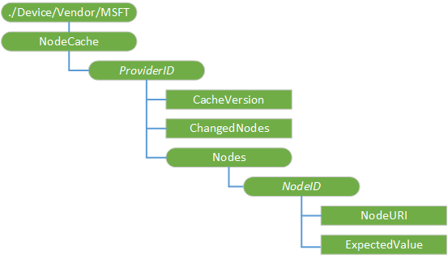

# <a name="nodecache-csp"></a>NodeCache 的 CSP


NodeCache 配置服务提供程序用于管理客户端缓存。 此配置服务提供程序是仅由企业管理服务器。 它提供了某种程度的精简，将分离的节点列表中特定的备份存储区管理。 它的服务器端缓存同步客户端高速缓存。 它还提供了一个 API 监视设备端缓存的更改。

下面的关系图以树格式显示 NodeCache 配置服务提供程序。



<a href="" id="--device-vendor-msft"></a>**./Device/Vendor/MSFT**  
必需。 NodeCache 对象根节点。 受支持的操作是获得。 此配置服务提供程序用于企业设备管理。 这是预定义的 MIME 类型来标识此 OMA DM 语法中的托管的对象。 启动 Windows 10 版本 1607年中值是 com.microsoft/1.0/MDM/NodeCache。

<a href="" id="providerid"></a>***ProviderID***  
可选项。 组每个 DM 服务器的设置。 每个组设置不同的服务器提供商 id。 它应该是同一个 DM 服务器通过[w7 应用程序配置服务提供程序](w7-application-csp.md)XML 在注册过程中提供的**提供程序 ID**值。 支持一个企业管理服务器。 也就是说，应该有下**NodeCache**的一个*ProviderID*节点。 作用域是动态的。

支持的操作是 Get，添加和删除。

<a href="" id="providerid-cacheversion"></a>***ProviderID*/CacheVersion**  
可选项。 表示由服务器设置的缓存版本的字符串。 作用域是动态的。

数据类型为字符串。 支持的操作是 Get，添加和替换。

<a href="" id="providerid-changednodes"></a>***ProviderID*/ChangedNodes**  
可选项。 其值与所指定在其预期值不匹配的节点列表**/*NodeID*/ExpectedValue**。 作用域是动态的。

数据类型为字符串。 受支持的操作是获得。

<a href="" id="providerid-nodes"></a>***ProviderID*/Nodes**  
必需。 对于缓存节点的根节点。 作用域是动态的。

受支持的操作是获得。

<a href="" id="-nodes-nodeid"></a>**/ 节点 / ***_NodeID_**  
可选项。 有关缓存的每个节点的信息存储*NodeID*下所指定的服务器。 此值不能包含逗号。 作用域是动态的。

支持的操作是 Get，添加和删除。

<a href="" id="-nodeid-nodeuri"></a>* */*NodeID*/NodeURI**  
必需。 此节点的值是一个完整的 OMA DM 节点 URI。 在设备管理树中，它可以指定内部或叶节点。 作用域是动态的。

数据类型为字符串。 支持的操作是 Get，添加和删除。

<a href="" id="-nodeid-expectedvalue"></a>* */*NodeID*/ExpectedValue**  
必需。 这是服务器要求在设备的值。 当配置服务提供程序启动会话时，它会检查根据节点的实际值的预期值。 作用域是动态的。 受支持的值是字符串和 x-nodemon-不存在。

支持的操作是 Get，添加和删除。

下面是一个示例将 ExpectedValue 设置为不存在的。

``` syntax
<Add>
   <CmdID>10</CmdID>
   <Item>
      <Target>
         <LocURI>./Vendor/MSFT/NodeCache/MDMSRV1/Nodes/Node_0002/ExpectedValue</LocURI>
      </Target>
      <Meta>
         <Format xmlns="syncml:metinf">chr</Format>
         <Type xmlns="syncml:metinf">application/x-nodemon-nonexistent</Type>
      </Meta>
   </Item>
</Add>
```

## <a name="a-typical-dm-session-with-the-nodecache-configuration-service-provider"></a>典型的 DM 会话使用 NodeCache 配置服务提供程序


1.  将设备连接到 DM 服务器。

2.  服务器查询通过发出 Get 操作的./Vendor/MSFT/NodeCache/*ProviderID*CacheVersion LocURI **NodeCache**版本

3.  如果**CacheVersion**的设备和服务器端缓存不同 （由于设备故障或服务器故障），服务器可以清除服务器端缓存，请转到步骤 5。

4.  服务器将更新服务器端缓存︰

    1.  发送 Get 操作的./Vendor/MSFT/NodeCache/*ProviderID*ChangedNodes LocURI

    2.  响应是节点的已更改 Id 的列表。 在列表中的每个 ID 对应于./Vendor/MSFT/NodeCache/*ProviderID*/Nodes 根下的一个节点

    3.  对于无效的节点列表中的每个节点，服务器将发送`GET`命令以检索节点的实际值。 例如， `GET <NodeURI>`，其中`NodeURI`是完整设备与无效的缓存节点相对应的 LocURI。

    4.  在服务器端缓存中的节点会更新从该设备接收的实际值。

    5.  对于每个更新后的节点，`REPLACE`命令发送到设备更新设备端缓存︰

        `REPLACE ./Vendor/MSFT/NodeCache/ProviderID/Nodes/NodeID/ExpectedValue => ActualValue`

    6.  创建新缓存版本并将其发送到设备︰

        `REPLACE ./Vendor/MSFT/NodeCache/ProviderID/CacheVersion => new_version`

        `new_version`值存储的服务器。

5.  管理服务器从服务器端缓存中检索相应的值︰

    1.  如果在服务器端缓存中已存在的值，而无需转到设备服务器端缓存中检索的值。

    2.  如果一个值在服务器端缓存中不存在，请执行以下操作︰

        1.  使用服务器端缓存中唯一*NodeID*创建一个新条目。

        2.  查询检索的 uri 实际值的设备。

        3.  创建*NodeID*值下./Vendor/MSFT/NodeCache/*ProviderID*/Nodes 的新节点。

        4.  设置**NodeURI**和**ExpectedValue** ./Vendor/MSFT/NodeCache/*ProviderID*/Nodes/*NodeID*节点。

        5.  更新的**CachedNodes**版本。

## <a name="oma-dm-examples"></a>OMA DM 示例


正在创建节点缓存的设置︰

``` syntax
<Add>
   <CmdID>2</CmdID>
   <Item>
      <Target>
         <LocURI>./Vendor/MSFT/NodeCache/MDMSRV1</LocURI>
      </Target>
      <Meta>
         <Format xmlns="syncml:metinf">node</Format>
      </Meta>
   </Item>
</Add>
<Add>
   <CmdID>4</CmdID>
   <Item>
      <Target>
         <LocURI>./Vendor/MSFT/NodeCache/MDMSRV1/Nodes/Node_0001</LocURI>
      </Target>
      <Meta>
         <Format xmlns="syncml:metinf">node</Format>
      </Meta>
   </Item>
</Add>
<Add>
   <CmdID>5</CmdID>
   <Item>
      <Target>
         <LocURI>./Vendor/MSFT/NodeCache/MDMSRV1/Nodes/Node_0001/NodeURI</LocURI>
      </Target>
      <Data>./Vendor/MSFT/DeviceLock/Provider/MDMSRV1/DevicePasswordEnabled</Data>
   </Item>
</Add>
<Add>
   <CmdID>6</CmdID>
   <Item>
      <Target>
         <LocURI>./Vendor/MSFT/NodeCache/MDMSRV1/Nodes/Node_0001/ExpectedValue</LocURI>
      </Target>
      <Data>0</Data>
   </Item>
</Add>
<Add>
   <CmdID>8</CmdID>
   <Item>
      <Target>
         <LocURI>./Vendor/MSFT/NodeCache/MDMSRV1/Nodes/Node_0002</LocURI>
      </Target>
      <Meta>
         <Format xmlns="syncml:metinf">node</Format>
      </Meta>
   </Item>
</Add>
<Add>
   <CmdID>9</CmdID>
   <Item>
      <Target>
         <LocURI>./Vendor/MSFT/NodeCache/MDMSRV1/Nodes/Node_0002/NodeURI</LocURI>
      </Target>
      <Data>
         ./Vendor/MSFT/DeviceLock/Provider/MDMSRV1/AlphanumericDevicePasswordRequired
      </Data>
   </Item>
</Add>
<Add>
   <CmdID>10</CmdID>
   <Item>
      <Target>
         <LocURI>./Vendor/MSFT/NodeCache/MDMSRV1/Nodes/Node_0002/ExpectedValue</LocURI>
      </Target>
      <Data>0</Data>
   </Item>
</Add>
```

获取节点下的子提供程序 ID MDMSRV1，缓存版本、 更改的节点、 节点、 预期值︰

``` syntax
<Get>
   <CmdID>18</CmdID>
   <Item>
      <Target>
         <LocURI>./Vendor/MSFT/NodeCache/MDMSRV1</LocURI>
      </Target>
   </Item>
</Get>
<Get>
   <CmdID>19</CmdID>
   <Item>
      <Target>
         <LocURI>./Vendor/MSFT/NodeCache/MDMSRV1/CacheVersion</LocURI>
      </Target>
   </Item>
</Get>
<Get>
   <CmdID>20</CmdID>
   <Item>
      <Target>
         <LocURI>./Vendor/MSFT/NodeCache/MDMSRV1/ChangedNodes</LocURI>
      </Target>
   </Item>
</Get>
<Get>
   <CmdID>21</CmdID>
   <Item>
      <Target>
         <LocURI>./Vendor/MSFT/NodeCache/MDMSRV1/Nodes/Node_0001</LocURI>
      </Target>
   </Item>
</Get>
<Get>
   <CmdID>22</CmdID>
   <Item>
      <Target>
         <LocURI>./Vendor/MSFT/NodeCache/MDMSRV1/Nodes/Node_0001/ExpectedValue</LocURI>
      </Target>
   </Item>
</Get>
```

替换高速缓存版本、 节点 URI 和所需的值︰

``` syntax
<Replace>
   <CmdID>2</CmdID>
   <Item>
      <Target>
         <LocURI>./Vendor/MSFT/NodeCache/MDMSRV1/CacheVersion</LocURI>
      </Target>
      <Data>SCCM0001@!Replace</Data>
   </Item>
</Replace>
<Replace>
   <CmdID>2</CmdID>
   <Item>
      <Target>
         <LocURI>./Vendor/MSFT/NodeCache/MDMSRV1/Nodes/Node_0001/NodeURI</LocURI>
      </Target>
      <Data>./Vendor/MSFT/DeviceLock/DeviceValue/AllowSimpleDevicePassword</Data>
    </Item>
</Replace>
<Replace>
   <CmdID>2</CmdID>
   <Item>
      <Target>
         <LocURI>./Vendor/MSFT/NodeCache/MDMSRV1/Nodes/Node_0001/ExpectedValue</LocURI>
      </Target>
      <Data>2</Data>
   </Item>
</Replace>
```

## <a name="related-topics"></a>相关的主题


[配置服务提供程序的引用](configuration-service-provider-reference.md)

 

 


