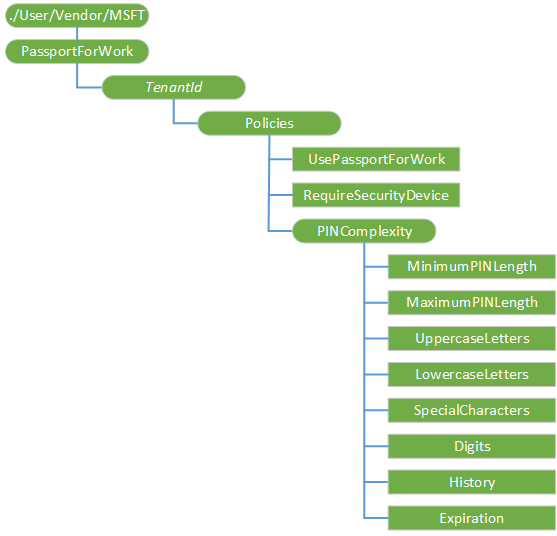
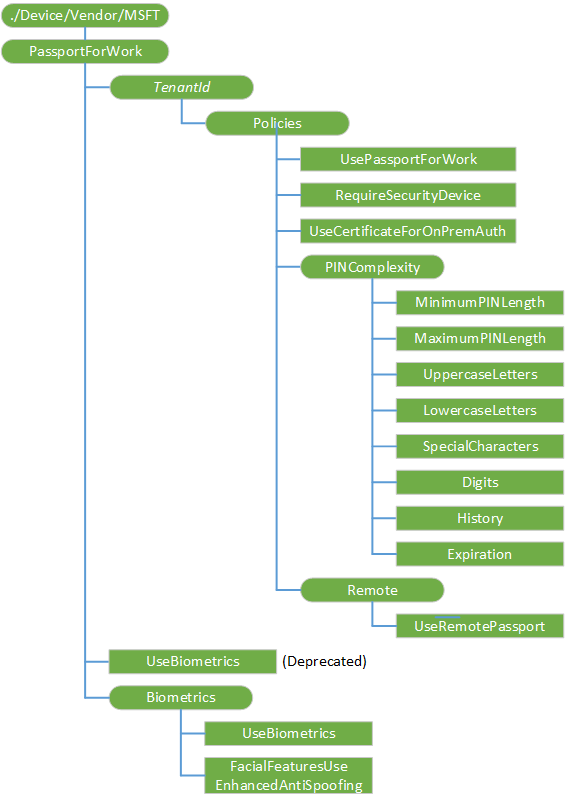

# <a name="passportforwork-csp"></a>PassportForWork 的 CSP


PassportForWork 配置服务提供程序用于配置 Windows Hello (以前工作的 Microsoft Passport) 业务。 它允许您登录到 Windows 使用 Active Directory 或 Azure Active Directory 帐户并替换密码、 智能卡和虚拟智能卡。

> **重要** 开始使用 Windows 10，版本 1607年所有设备仅都有一个插针与 Windows Hello 业务相关联。 这意味着在设备上的任何针脚将受到 PassportForWork CSP 中指定的策略。 指定的值优先于通过 Exchange ActiveSync (EAS) 或 DeviceLock CSP 设置的任何复杂规则。

 

### <a name="user-configuration-diagram"></a>用户配置图

下面的关系图以树格式显示 PassportForWork 配置服务提供程序。



### <a name="device-configuration-diagram"></a>设备配置图

下面的关系图以树格式显示 PassportForWork 配置服务提供程序。



<a href="" id="passportforwork"></a>**PassportForWork**  
PassportForWork 配置服务提供程序的根节点。

<a href="" id="tenantid"></a>***TenantId***  
全局唯一标识符 (GUID) 没有大括号 （{，}）。

<a href="" id="tenantid-policies"></a>***TenantId*/Policies**  
用于定义 Windows Hello 业务策略设置的节点。

<a href="" id="tenantid-policies-usepassportforwork"></a>****TenantId/策略/UsePassportForWork**  
设置 Windows Hello 业务作为一种方法用于登录到 Windows 的布尔值。

默认值为 true。 此策略设置为 false 时，如果用户无法提供 Windows Hello 业务除 Azure Active Directory 加入其中供应是必需的移动电话上。

支持的操作是添加 Get，删除和替换。

<a href="" id="tenantid-policies-requiresecuritydevice"></a>****TenantId/策略/RequireSecurityDevice**  
对于 Windows Hello 业务需要受信任的平台模块 (TPM) 的布尔值。 TPM 好处其他安全软件通过，以便在其中存储的数据不能使用在其他设备上。

默认值为 false。 如果此策略设置为 true 时，只使用 TPM 的设备可以设置 Windows 你好的业务。 如果此策略设置为 false 时，所有的设备可以设置 Windows Hello 适合企业使用的软件，即使不使用 TPM。 如果您不配置此设置，所有的设备可以设置 Windows Hello 企业使用的软件，如果 TPM 已无法正常工作或不可用的。

支持的操作是添加 Get，删除和替换。

<a href="" id="tenantid-policies-usecertificateforonpremauth--only-for---device-vendor-msft-"></a>** *TenantId*/Policies/UseCertificateForOnPremAuth**（仅适用于./Device/Vendor/MSFT)  
使 Windows Hello 为企业可以使用证书进行身份验证后端资源的布尔值。

如果您启用此策略设置，Windows Hello 业务将一直等到设备接收证书有效负载从企业证书颁发机构之前提供一个 PIN。

如果您禁用或不配置此策略设置，用户登录，而无需等待证书有效负载时将提供 PIN。

支持的操作是添加 Get，删除和替换。

<a href="" id="tenantid-policies-pincomplexity"></a>****TenantId/策略/PINComplexity**  
用于定义 PIN 设置的节点。

<a href="" id="tenantid-policies-pincomplexity-minimumpinlength"></a>***TenantId*/Policies/PINComplexity/MinimumPINLength**  
设置最小针的工作所需的字符数的整数值。 默认值为 4。 最小的数字，您可以配置此策略设置为 4。 可配置的最大值必须是小于 127 号大针长度策略设置中配置的数字，较低者为准。

如果您配置此策略设置，工作针长度必须大于或等于此数字。 如果您禁用或不配置此策略设置，工作针长度必须大于或等于 4。

> **请注意** 如果不满足上面的最小的针长度为指定的条件，将这两个最大和最小针长度为使用默认值。

 

值类型是 int。 支持的操作是添加 Get，删除和替换。

<a href="" id="tenantid-policies-pincomplexity-maximumpinlength"></a>***TenantId*/Policies/PINComplexity/MaximumPINLength**  
设置的最大工作针所允许的字符数的整数值。 默认值为 127。 您可以配置此策略设置的最大值为 127。 您可以配置最低数量必须大于最小针长度策略设置或数字 4 中配置的数值，较大者为准。

如果您配置此策略设置，工作针长度必须小于或等于此数字。 如果您禁用或不配置此策略设置，工作针长度必须小于或等于 127。

> **请注意** 如果不满足上面指定的最大的针长度的条件，将这两个最大和最小针长度为使用默认值。

 

支持的操作是添加 Get，删除和替换。

<a href="" id="tenantid-policies-pincomplexity-uppercaseletters"></a>***TenantId*/Policies/PINComplexity/UppercaseLetters**  
配置使用大写的字母中 Windows 你好的业务针的整数值。

有效值︰

-   0-允许中针使用大写的字母。
-   1-需要使用 pin 码中的至少一个大写字母。
-   2-在针不允许使用大写的字母。

默认值为 2。 默认 PIN 复杂性行为是不允许所有其他字符集和数字是必需的。 如果允许所有字符集，但没有明确要求，将应用默认 PIN 复杂性行为。

支持的操作是添加 Get，删除和替换。

<a href="" id="tenantid-policies-pincomplexity-lowercaseletters"></a>***TenantId*/Policies/PINComplexity/LowercaseLetters**  
配置使用小写字母中 Windows 你好的业务针的整数值。

有效值︰

-   0-允许中针使用小写字母。
-   1-需要使用 pin 码中的至少一个小写字母。
-   2-在针不允许使用小写字母。

默认值为 2。 默认 PIN 复杂性行为是不允许所有其他字符集和数字是必需的。 如果允许所有字符集，但没有明确要求，将应用默认 PIN 复杂性行为。

支持的操作是添加 Get，删除和替换。

<a href="" id="tenantid-policies-pincomplexity-specialcharacters"></a>***TenantId*/Policies/PINComplexity/SpecialCharacters**  
为业务针在 Windows Hello 配置使用的特殊字符的整数值。 有效的 Windows Hello 业务针笔势的特殊字符包括: ！ " \# $ % & ' ( ) \* + , - . / : ; &lt; = &gt; ? @\[ \\ \] ^ \_ \` { | } ~ .

有效值︰

-   0-针中允许使用特殊字符。
-   1-需要使用针中的至少一个特殊字符。
-   2-在针不允许使用特殊字符。

默认值为 2。 默认 PIN 复杂性行为是不允许所有其他字符集和数字是必需的。 如果允许所有字符集，但没有明确要求，将应用默认 PIN 复杂性行为。

支持的操作是添加 Get，删除和替换。

<a href="" id="tenantid-policies-pincomplexity-digits"></a>***TenantId*/Policies/PINComplexity/Digits**  
为业务针在 Windows Hello 配置使用的位数的整数值。

有效值︰

-   0-针中允许使用的位数。
-   1-需要使用针中的至少一个数字。
-   2-不允许使用的数字 pin 码中。

默认值为 1。 默认 PIN 复杂性行为是不允许所有其他字符集和数字是必需的。 如果允许所有字符集，但没有明确要求，将应用默认 PIN 复杂性行为。

支持的操作是添加 Get，删除和替换。

<a href="" id="tenantid-policies-pincomplexity-history"></a>***TenantId*/Policies/PINComplexity/History**  
指定可与不能重复使用的用户帐户相关联的过去针脚数的整数值。 您可以配置此策略设置的最大值为 50。 您可以配置此策略设置的最低值为 0。 如果此策略被设置为 0，则不需要存储以前的插针。 此节点已添加 Windows 10 1511年版本中。

针脚与用户帐户相关联的一组中包括当前用户的 PIN。 PIN 历史不保留通过 PIN 重置。

默认值为 0。

支持的操作是添加 Get，删除和替换。

<a href="" id="tenantid-policies-pincomplexity-expiration"></a>***TenantId*/Policies/PINComplexity/Expiration**  
整数值，指定的时间 （以天为单位），PIN 可以是系统要求用户更改其密码之前使用。 您可以配置此策略设置的最大数是 730。 您可以配置此策略设置的最低值为 0。 如果此策略被设置为 0，该用户的 PIN 将永不过期。 此节点已添加 Windows 10 1511年版本中。

默认值为 0。

支持的操作是添加 Get，删除和替换。

<a href="" id="tenantid-policies-remote--only-for---device-vendor-msft-"></a>** *TenantId*/Policies/Remote**（仅适用于./Device/Vendor/MSFT)  
用于定义远程 Windows Hello 业务策略的内部节点。 此节点已添加 Windows 10 1511年版本中。

<a href="" id="tenantid-policies-remote-useremotepassport--only-for---device-vendor-msft-"></a>** *TenantId*/Policies/Remote/UseRemotePassport**（仅适用于./Device/Vendor/MSFT)  
用来启用或禁用业务使用的远程 Windows 你好的布尔值。 远程 Windows Hello 为企业提供可移植的、 已注册设备用作桌面身份验证的配套设备的能力。 远程 Windows Hello 业务需要桌面被加入的 Azure AD 和配套设备上有 Windows 你好的业务针。 此节点已添加 Windows 10 1511年版本中。

默认值为 false。 此策略设置为 true 时，如果远程 Windows Hello 业务将启用，可移植的、 已注册的设备可用作桌面身份验证的配套设备。 此策略设置为 false 时，如果远程 Windows Hello 业务将被禁用。

支持的操作是添加 Get，删除和替换。

<a href="" id="usebiometrics"></a>**UseBiometrics**  
此节点已被否决。 请改用**生物/UseBiometrics**节点。

<a href="" id="biometrics--only-for---device-vendor-msft-"></a>**生物测定**（仅适用于./Device/Vendor/MSFT)  
用于定义生物设置的节点。 此节点已添加 Windows 10 1511年版本中。

<a href="" id="biometrics-usebiometrics--only-for---device-vendor-msft-"></a>**生物/UseBiometrics**（仅适用于./Device/Vendor/MSFT)  
用来启用或禁用使用生物识别手势，如面和指纹识别，代替 PIN 手势为 Windows Hello 业务的布尔值。 如果它们配置生物识别手势用于在出现故障时，用户仍然必须配置 PIN。 此节点已添加 Windows 10 1511年版本中。

默认值为 true。 如果此策略设置为 true 时，生物识别笔势允许使用与 Windows 你好的业务。 如果此策略设置为 false 时，生物识别手势被禁止使用与 Windows 你好的业务。

支持的操作是添加 Get，删除和替换。

<a href="" id="biometrics-facialfeaturesuseenhancedantispoofing--only-for---device-vendor-msft-"></a>**生物/FacialFeaturesUseEnhancedAntiSpoofing**（仅适用于./Device/Vendor/MSFT)  
布尔值，该值用于启用或禁用增强反欺骗为支持它的设备上的面部特征识别。 此节点已添加 Windows 10 1511年版本中。

如果不配置此策略，用户可以选择是否要打开或关闭反欺骗。 如果将此策略设置为 true，增强反欺骗需要支持它的设备上。 如果此策略设置为 false 时，增强反欺骗处于关闭状态，用户不能将其打开。

支持的操作是添加 Get，删除和替换。

## <a name="examples"></a>示例


下面是一个示例设置 Windows Hello 业务和设置 PIN 策略。 它也开启使用生物和 TPM。

``` syntax
<SyncML xmlns="SYNCML:SYNCML1.2">
          <SyncBody>
            <Add>
              <CmdID>2</CmdID>
              <Item>
                <Target>
                  <LocURI>
                    ./Vendor/MSFT/PassportForWork/5NEMDU42-45CC-8CBL-8BPF-D7092646325F
                  </LocURI>
                </Target>
              </Item>
            </Add>
            <Add>
              <CmdID>3</CmdID>
              <Item>
                <Target>
                  <LocURI>
                    ./Vendor/MSFT/PassportForWork/5NEMDU42-45CC-8CBL-8BPF-D7092646325F/Policies/UsePassportForWork
                  </LocURI>
                </Target>
                <Meta>
                  <Format xmlns="syncml:metinf">bool</Format>
                  <Type>text/plain</Type>
                </Meta>
                <Data>true</Data>
              </Item>
            </Add>
            <Add>
              <CmdID>4</CmdID>
              <Item>
                <Target>
                  <LocURI>
                    ./Vendor/MSFT/PassportForWork/5NEMDU42-45CC-8CBL-8BPF-D7092646325F/Policies/RequireSecurityDevice
                  </LocURI>
                </Target>
                <Meta>
                  <Format xmlns="syncml:metinf">bool</Format>
                  <Type>text/plain</Type>
                </Meta>
                <Data>true</Data>
              </Item>
            </Add>
            <Add>
              <CmdID>5</CmdID>
              <Item>
                <Target>
                  <LocURI>
                    ./Vendor/MSFT/PassportForWork/5NEMDU42-45CC-8CBL-8BPF-D7092646325F/Policies/PINComplexity/MinimumPINLength
                  </LocURI>
                </Target>
                <Meta>
                  <Format xmlns="syncml:metinf">int</Format>
                  <Type>text/plain</Type>
                </Meta>
                <Data>8</Data>
              </Item>
            </Add>
            <Add>
              <CmdID>6</CmdID>
              <Item>
                <Target>
                  <LocURI>
                    ./Vendor/MSFT/PassportForWork/5NEMDU42-45CC-8CBL-8BPF-D7092646325F/Policies/PINComplexity/MaximumPINLength
                  </LocURI>
                </Target>
                <Meta>
                  <Format xmlns="syncml:metinf">int</Format>
                  <Type>text/plain</Type>
                </Meta>
                <Data>16</Data>
              </Item>
            </Add>
            <Add>
              <CmdID>7</CmdID>
              <Item>
                <Target>
                  <LocURI>
                    ./Vendor/MSFT/PassportForWork/5NEMDU42-45CC-8CBL-8BPF-D7092646325F/Policies/PINComplexity/UppercaseLetters
                  </LocURI>
                </Target>
                <Meta>
                  <Format xmlns="syncml:metinf">int</Format>
                  <Type>text/plain</Type>
                </Meta>
                <Data>0</Data>
              </Item>
            </Add>
            <Add>
              <CmdID>8</CmdID>
              <Item>
                <Target>
                  <LocURI>
                    ./Vendor/MSFT/PassportForWork/5NEMDU42-45CC-8CBL-8BPF-D7092646325F/Policies/PINComplexity/LowercaseLetters
                  </LocURI>
                </Target>
                <Meta>
                  <Format xmlns="syncml:metinf">int</Format>
                  <Type>text/plain</Type>
                </Meta>
                <Data>1</Data>
              </Item>
            </Add>
            <Add>
              <CmdID>9</CmdID>
              <Item>
                <Target>
                  <LocURI>
                    ./Vendor/MSFT/PassportForWork/5NEMDU42-45CC-8CBL-8BPF-D7092646325F/Policies/PINComplexity/SpecialCharacters
                  </LocURI>
                </Target>
                <Meta>
                  <Format xmlns="syncml:metinf">int</Format>
                  <Type>text/plain</Type>
                </Meta>
                <Data>2</Data>
              </Item>
            </Add>
            <Add>
              <CmdID>10</CmdID>
              <Item>
                <Target>
                  <LocURI>
                    ./Vendor/MSFT/PassportForWork/5NEMDU42-45CC-8CBL-8BPF-D7092646325F/Policies/PINComplexity/Digits
                  </LocURI>
                </Target>
                <Meta>
                  <Format xmlns="syncml:metinf">int</Format>
                  <Type>text/plain</Type>
                </Meta>
                <Data>1</Data>
              </Item>
            </Add>
            <Add>
              <CmdID>11</CmdID>
              <Item>
                <Target>
                  <LocURI>
                    ./Vendor/MSFT/PassportForWork/5NEMDU42-45CC-8CBL-8BPF-D7092646325F/Policies/PINComplexity/History
                  </LocURI>
                </Target>
                <Meta>
                  <Format xmlns="syncml:metinf">int</Format>
                  <Type>text/plain</Type>
                </Meta>
                <Data>20</Data>
              </Item>
            </Add>
            <Add>
              <CmdID>12</CmdID>
              <Item>
                <Target>
                  <LocURI>
                    ./Vendor/MSFT/PassportForWork/5NEMDU42-45CC-8CBL-8BPF-D7092646325F/Policies/PINComplexity/Expiration
                  </LocURI>
                </Target>
                <Meta>
                  <Format xmlns="syncml:metinf">int</Format>
                  <Type>text/plain</Type>
                </Meta>
                <Data>70</Data>
              </Item>
            </Add>
            <Add>
              <CmdID>13</CmdID>
              <Item>
                <Target>
                  <LocURI>
                    ./Vendor/MSFT/PassportForWork/5NEMDU42-45CC-8CBL-8BPF-D7092646325F/Policies/Remote/UseRemotePassport
                  </LocURI>
                </Target>
                <Meta>
                  <Format xmlns="syncml:metinf">bool</Format>
                  <Type>text/plain</Type>
                </Meta>
                <Data>true</Data>
              </Item>
            </Add>
            <Add>
              <CmdID>14</CmdID>
              <Item>
                <Target>
                  <LocURI>
                    ./Vendor/MSFT/PassportForWork/Biometrics/UseBiometrics
                  </LocURI>
                </Target>
                <Meta>
                  <Format xmlns="syncml:metinf">bool</Format>
                  <Type>text/plain</Type>
                </Meta>
                <Data>true</Data>
              </Item>
            </Add>
    <Add>
              <CmdID>15</CmdID>
              <Item>
                <Target>
                  <LocURI>
                    ./Vendor/MSFT/PassportForWork/Biometrics/FacialFeatureUseEnhancedAntiSpoofing
                  </LocURI>
                </Target>
                <Meta>
                  <Format xmlns="syncml:metinf">bool</Format>
                  <Type>text/plain</Type>
                </Meta>
                <Data>true</Data>
              </Item>
            </Add>
            <Final/> 
          </SyncBody>
        </SyncML>
```

 

 


