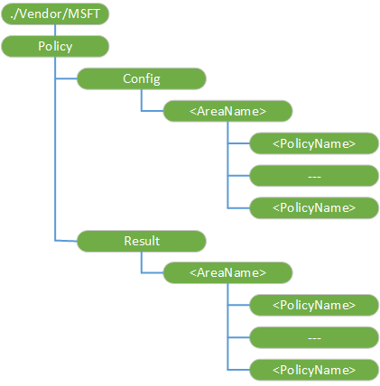

# <a name="policy-csp"></a>CSP 的策略

策略配置服务提供程序使得企业能够在 Windows 10 上配置策略。 使用此配置服务提供程序来配置任何公司政策。

策略配置服务提供程序具有以下子类别︰

-   *'区域名'* – 处理来自服务器的策略配置请求。
-   *'区域名'* – 提供只读设备上强制实施的策略路径。

下图显示树状格式由开放移动联盟设备管理 (OMA DM) 和 OMA 客户端资源调配策略配置服务提供程序。




<a href="" id="--vendor-msft-policy"></a>**./Vendor/MSFT/Policy**  
<p style="margin-left: 20px">策略配置服务提供程序的根节点。

<p style="margin-left: 20px">受支持的操作是获得。

<a href="" id="policy-config"></a>**策略/配置**  
<p style="margin-left: 20px">为分组所有的策略配置一个源节点。 配置源可以使用此路径来设置策略的值和以后查询它以前设置的任何策略值。 一个策略可以由多个配置源配置。 如果配置源需要查询的冲突解决的结果 （例如，如果 Exchange 和 MDM 都试图设置的值），配置源可以使用策略/结果路径检索所得到的值。

<p style="margin-left: 20px">受支持的操作是获得。

<a href="" id="policy-config-areaname"></a>**策略/配置 / ***_'区域名'_**  
<p style="margin-left: 20px">可以为单个提供程序配置的一种技术区域组。 一旦添加，无法更改的值。

<p style="margin-left: 20px">支持的操作是 Get，添加和删除。

<a href="" id="policy-config-areaname-policyname"></a>**策略/配置 / ***_/ PolicyName '区域名' 的_**  
<p style="margin-left: 20px">指定策略中使用的名称/值对。

<p style="margin-left: 20px">下面的列表显示了一些提示，帮助您配置策略时︰

-   单独的子字符串的 Unicode 值 &\#xF000;在 XML 文件中。

> **请注意** 为每个调用方可能具有不同值的命名策略，从不同的调用方的查询可以提供不同的值。

-   在 SyncML，环绕此策略使其原子的命令，以便作为单个事务处理策略设置。
-   支持的操作是添加 Get，删除和替换。
-   值类型是字符串。

<a href="" id="policy-result"></a>**策略/结果**  
<p style="margin-left: 20px">组中所有可配置的提供程序的计算策略。

<p style="margin-left: 20px">受支持的操作是获得。

<a href="" id="policy-result-areaname"></a>**策略/结果 / ***_'区域名'_**  
<p style="margin-left: 20px">可以通过独立于提供商的一种技术来配置区域组。

<p style="margin-left: 20px">受支持的操作是获得。

<a href="" id="policy-result-areaname-policyname"></a>**策略/结果 / ***_/ PolicyName '区域名' 的_**  
<p style="margin-left: 20px">指定策略中使用的名称/值对。

<p style="margin-left: 20px">受支持的操作是获得。

## <a name="policy-tables"></a>**策略表**

用于桌面或者 Windows 10 或 10 Windows Mobile 只有支持的一些策略。 此外，某些策略也有相应的组策略。 以下各表提供以下信息︰

-   [表的策略对于 Windows 10](#mainpolicytable) -Windows 10 中每个 sku 列出的所有策略。 它还会通知您可以使用 Exchange 活动同步 (EAS) 设置的策略。
-   [支持 Windows 全息企业策略](#hololenspolicies)-列出 Windows 10 全息企业支持的策略。
-   [Microsoft Surface 集线器支持的策略](#surfacehubpolicies)-列出由 Microsoft Surface 集线器支持的策略。

## <a name="a-href-idmainpolicytableatable-of-policies-for-windows-10"></a><a href="" id="mainpolicytable"></a>表的策略 Windows 10

> **重要** 水平定位表，表上单击然后使用键盘上的向左、 右滚动键或在表的底部使用滚动条。

<table>
<tr>
<th>区域名称 / 策略名称</th>
<th>在家庭中受支持</th>
<th>在 Pro 支持</th>
<th>在企业支持</th>
<th>在教育中受支持</th>
<th>中移动支持</th>
<th>中移动企业支持</th>
<th>在 IoT 核心支持</th>
<th>
       可以使用 Exchange 活动同步 (EAS) 设置</th>
</tr>
<tr>
<td style="vertical-align:top"><a href="#abovelock-allowactioncenternotifications">AboveLock/AllowActionCenterNotifications</a></td>
<td style="vertical-align:top"><p>主页 </p>
</td>
<td style="vertical-align:top"><p>专业人员</p>
</td>
<td style="vertical-align:top"><p>企业</p>
</td>
<td style="vertical-align:top"><p>教育</p>
</td>
<td style="vertical-align:top"><p>移动</p>
</td>
<td style="vertical-align:top"><p>移动企业</p>
</td>
<td style="vertical-align:top"><p>IoT 核心</p>
</td>
<td style="vertical-align:top"><p>EAS</p>
</td>
</tr>
<tr>
<td style="vertical-align:top"><a href="#abovelock-allowcortanaabovelock">AboveLock/AllowCortanaAboveLock</a></td>
<td style="vertical-align:top"><p>主页 </p>
</td>
<td style="vertical-align:top">*
      <p>专业人员</p>
</td>
<td style="vertical-align:top">*
      <p>企业</p>
</td>
<td style="vertical-align:top">*
      <p>教育</p>
</td>
<td style="vertical-align:top">*
      <p>移动</p>
</td>
<td style="vertical-align:top">*
      <p>移动企业</p>
</td>
<td style="vertical-align:top"><p>IoT 核心</p>
</td>
<td style="vertical-align:top"><p>EAS</p>
</td>
</tr>
<tr>
<td style="vertical-align:top"><a href="#abovelock-allowtoasts">AboveLock/AllowToasts</a></td>
<td style="vertical-align:top"><p>主页 </p>
</td>
<td style="vertical-align:top"><p>专业人员</p>
</td>
<td style="vertical-align:top"><p>企业</p>
</td>
<td style="vertical-align:top"><p>教育</p>
</td>
<td style="vertical-align:top"><p>移动</p>
</td>
<td style="vertical-align:top"><p>移动企业</p>
</td>
<td style="vertical-align:top"><p>IoT 核心</p>
</td>
<td style="vertical-align:top"><p>EAS</p>
</td>
</tr>
<tr>
<td style="vertical-align:top"><a href="#accounts-allowaddingnonmicrosoftaccountsmanually">帐户/AllowAddingNonMicrosoftAccountsManually</a></td>
<td style="vertical-align:top"><p>主页 </p>
</td>
<td style="vertical-align:top"><p>专业人员</p>
</td>
<td style="vertical-align:top"><p>企业</p>
</td>
<td style="vertical-align:top"><p>教育</p>
</td>
<td style="vertical-align:top"><p>移动</p>
</td>
<td style="vertical-align:top"><p>移动企业</p>
</td>
<td style="vertical-align:top"><p>IoT 核心</p>
</td>
<td style="vertical-align:top"><p>EAS</p>
</td>
</tr>
<tr>
<td style="vertical-align:top"><a href="#accounts-allowmicrosoftaccountconnection">帐户/AllowMicrosoftAccountConnection</a></td>
<td style="vertical-align:top"><p>主页 </p>
</td>
<td style="vertical-align:top"><p>专业人员</p>
</td>
<td style="vertical-align:top"><p>企业</p>
</td>
<td style="vertical-align:top"><p>教育</p>
</td>
<td style="vertical-align:top"><p>移动</p>
</td>
<td style="vertical-align:top"><p>移动企业</p>
</td>
<td style="vertical-align:top"><p>IoT 核心</p>
</td>
<td style="vertical-align:top"><p>EAS</p>
</td>
</tr>
<tr>
<td style="vertical-align:top"><a href="#accounts-domainnamesforemailsync">帐户/DomainNamesForEmailSync</a></td>
<td style="vertical-align:top"><p>主页 </p>
</td>
<td style="vertical-align:top"><p>专业人员</p>
</td>
<td style="vertical-align:top"><p>企业</p>
</td>
<td style="vertical-align:top"><p>教育</p>
</td>
<td style="vertical-align:top"><p>移动</p>
</td>
<td style="vertical-align:top"><p>移动企业</p>
</td>
<td style="vertical-align:top"><p>IoT 核心</p>
</td>
<td style="vertical-align:top"><p>EAS</p>
</td>
</tr>
<tr>
<td style="vertical-align:top"><a href="#applicationmanagement-allowalltrustedapps">ApplicationManagement/AllowAllTrustedApps</a></td>
<td style="vertical-align:top"><p>主页 </p>
</td>
<td style="vertical-align:top"><p>专业人员</p>
</td>
<td style="vertical-align:top"><p>企业</p>
</td>
<td style="vertical-align:top"><p>教育</p>
</td>
<td style="vertical-align:top"><p>移动</p>
</td>
<td style="vertical-align:top"><p>移动企业</p>
</td>
<td style="vertical-align:top"><p>IoT 核心</p>
</td>
<td style="vertical-align:top"><p>EAS</p>
</td>
</tr>
<tr>
<td style="vertical-align:top"><a href="#applicationmanagement-allowappstoreautoupdate">ApplicationManagement/AllowAppStoreAutoUpdate</a></td>
<td style="vertical-align:top"><p>主页 </p>
</td>
<td style="vertical-align:top"><p>专业人员</p>
</td>
<td style="vertical-align:top"><p>企业</p>
</td>
<td style="vertical-align:top"><p>教育</p>
</td>
<td style="vertical-align:top"><p>移动</p>
</td>
<td style="vertical-align:top"><p>移动企业</p>
</td>
<td style="vertical-align:top"><p>IoT 核心</p>
</td>
<td style="vertical-align:top"><p>EAS</p>
</td>
</tr>
<tr>
<td style="vertical-align:top"><a href="#applicationmanagement-allowdeveloperunlock">ApplicationManagement/AllowDeveloperUnlock</a></td>
<td style="vertical-align:top"><p>主页 </p>
</td>
<td style="vertical-align:top"><p>专业人员</p>
</td>
<td style="vertical-align:top"><p>企业</p>
</td>
<td style="vertical-align:top"><p>教育</p>
</td>
<td style="vertical-align:top"><p>移动</p>
</td>
<td style="vertical-align:top"><p>移动企业</p>
</td>
<td style="vertical-align:top"><p>IoT 核心</p>
</td>
<td style="vertical-align:top"><p>EAS</p>
</td>
</tr>
<tr>
<td style="vertical-align:top"><a href="#applicationmanagement-allowgamedvr">ApplicationManagement/AllowGameDVR</a></td>
<td style="vertical-align:top"><p>主页 </p>
</td>
<td style="vertical-align:top"><p>专业人员</p>
</td>
<td style="vertical-align:top"><p>企业</p>
</td>
<td style="vertical-align:top"><p>教育</p>
</td>
<td style="vertical-align:top"><p>移动</p>
</td>
<td style="vertical-align:top"><p>移动企业</p>
</td>
<td style="vertical-align:top"><p>IoT 核心</p>
</td>
<td style="vertical-align:top"><p>EAS</p>
</td>
</tr>
<tr>
<td style="vertical-align:top"><a href="#applicationmanagement-allowshareduserappdata">ApplicationManagement/AllowSharedUserAppData</a></td>
<td style="vertical-align:top"><p>主页 </p>
</td>
<td style="vertical-align:top"><p>专业人员</p>
</td>
<td style="vertical-align:top"><p>企业</p>
</td>
<td style="vertical-align:top"><p>教育</p>
</td>
<td style="vertical-align:top"><p>移动</p>
</td>
<td style="vertical-align:top"><p>移动企业</p>
</td>
<td style="vertical-align:top"><p>IoT 核心</p>
</td>
<td style="vertical-align:top"><p>EAS</p>
</td>
</tr>
<tr>
<td style="vertical-align:top"><a href="#applicationmanagement-allowstore">ApplicationManagement/AllowStore</a></td>
<td style="vertical-align:top"><p>主页 </p>
</td>
<td style="vertical-align:top"><p>专业人员</p>
</td>
<td style="vertical-align:top"><p>企业</p>
</td>
<td style="vertical-align:top"><p>教育</p>
</td>
<td style="vertical-align:top"><p>移动</p>
</td>
<td style="vertical-align:top"><p>移动企业</p>
</td>
<td style="vertical-align:top"><p>IoT 核心</p>
</td>
<td style="vertical-align:top"><p>EAS</p>
</td>
</tr>
<tr>
<td style="vertical-align:top"><a href="#applicationmanagement-applicationrestrictions">ApplicationManagement/ApplicationRestrictions</a></td>
<td style="vertical-align:top"><p>主页 </p>
</td>
<td style="vertical-align:top"><p>专业人员</p>
</td>
<td style="vertical-align:top"><p>企业</p>
</td>
<td style="vertical-align:top"><p>教育</p>
</td>
<td style="vertical-align:top"><p>移动</p>
</td>
<td style="vertical-align:top"><p>移动企业</p>
</td>
<td style="vertical-align:top"><p>IoT 核心</p>
</td>
<td style="vertical-align:top"><p>EAS</p>
</td>
</tr>
<tr>
<td style="vertical-align:top"><a href="#applicationmanagement-disablestoreoriginatedapps">ApplicationManagement/DisableStoreOriginatedApps</a></td>
<td style="vertical-align:top"><p>主页 </p>
</td>
<td style="vertical-align:top"><p>专业人员</p>
</td>
<td style="vertical-align:top">*<p>企业</p>
</td>
<td style="vertical-align:top">*<p>教育</p>
</td>
<td style="vertical-align:top"><p>移动</p>
</td>
<td style="vertical-align:top"><p>移动企业</p>
</td>
<td style="vertical-align:top"><p>IoT 核心</p>
</td>
<td style="vertical-align:top"><p>EAS</p>
</td>
</tr>
<tr>
<td style="vertical-align:top"><a href="#applicationmanagement-requireprivatestoreonly">ApplicationManagement/RequirePrivateStoreOnly</a></td>
<td style="vertical-align:top"><p>主页 </p>
</td>
<td style="vertical-align:top"><p>专业人员</p>
</td>
<td style="vertical-align:top"><p>企业</p>
</td>
<td style="vertical-align:top"><p>教育</p>
</td>
<td style="vertical-align:top"><p>移动</p>
</td>
<td style="vertical-align:top"><p>移动企业</p>
</td>
<td style="vertical-align:top"><p>IoT 核心</p>
</td>
<td style="vertical-align:top"><p>EAS</p>
</td>
</tr>
<tr>
<td style="vertical-align:top"><a href="#applicationmanagement-restrictappdatatosystemvolume">ApplicationManagement/RestrictAppDataToSystemVolume</a></td>
<td style="vertical-align:top"><p>主页 </p>
</td>
<td style="vertical-align:top"><p>专业人员</p>
</td>
<td style="vertical-align:top"><p>企业</p>
</td>
<td style="vertical-align:top"><p>教育</p>
</td>
<td style="vertical-align:top"><p>移动</p>
</td>
<td style="vertical-align:top"><p>移动企业</p>
</td>
<td style="vertical-align:top"><p>IoT 核心</p>
</td>
<td style="vertical-align:top"><p>EAS</p>
</td>
</tr>
<tr>
<td style="vertical-align:top"><a href="#applicationmanagement-restrictapptosystemvolume">ApplicationManagement/RestrictAppToSystemVolume</a></td>
<td style="vertical-align:top"><p>主页 </p>
</td>
<td style="vertical-align:top"><p>专业人员</p>
</td>
<td style="vertical-align:top"><p>企业</p>
</td>
<td style="vertical-align:top"><p>教育</p>
</td>
<td style="vertical-align:top"><p>移动</p>
</td>
<td style="vertical-align:top"><p>移动企业</p>
</td>
<td style="vertical-align:top"><p>IoT 核心</p>
</td>
<td style="vertical-align:top"><p>EAS</p>
</td>
</tr>
<tr>
<td style="vertical-align:top"><a href="#authentication-alloweapcertsso">身份验证/AllowEAPCertSSO</a></td>
<td style="vertical-align:top"><p>主页 </p>
</td>
<td style="vertical-align:top"><p>专业人员</p>
</td>
<td style="vertical-align:top"><p>企业</p>
</td>
<td style="vertical-align:top"><p>教育</p>
</td>
<td style="vertical-align:top"><p>移动</p>
</td>
<td style="vertical-align:top"><p>移动企业</p>
</td>
<td style="vertical-align:top"><p>IoT 核心</p>
</td>
<td style="vertical-align:top"><p>EAS</p>
</td>
</tr>
<tr>
<td style="vertical-align:top"><a href="#authentication-allowfastreconnect">身份验证/AllowFastReconnect</a></td>
<td style="vertical-align:top"><p>主页 </p>
</td>
<td style="vertical-align:top"><p>专业人员</p>
</td>
<td style="vertical-align:top"><p>企业</p>
</td>
<td style="vertical-align:top"><p>教育</p>
</td>
<td style="vertical-align:top"><p>移动</p>
</td>
<td style="vertical-align:top"><p>移动企业</p>
</td>
<td style="vertical-align:top"><p>IoT 核心</p>
</td>
<td style="vertical-align:top"><p>EAS</p>
</td>
</tr>
<tr>
<td style="vertical-align:top"><a href="#authentication-allowsecondaryauthenticationdevice">身份验证/AllowSecondaryAuthenticationDevice</a></td>
<td style="vertical-align:top">*<p>主页 </p>
</td>
<td style="vertical-align:top">*<p>专业人员</p>
</td>
<td style="vertical-align:top">*<p>企业</p>
</td>
<td style="vertical-align:top">*<p>教育</p>
</td>
<td style="vertical-align:top">*<p>移动</p>
</td>
<td style="vertical-align:top">*<p>移动企业</p>
</td>
<td style="vertical-align:top">*<p>IoT 核心</p>
</td>
<td style="vertical-align:top"><p>EAS</p>
</td>
</tr>
<tr>
<td style="vertical-align:top"><a href="#bitlocker-encryptionmethod">Bitlocker/EncryptionMethod</a></td>
<td style="vertical-align:top"><p>主页 </p>
</td>
<td style="vertical-align:top"><p>专业人员</p>
</td>
<td style="vertical-align:top"><p>企业</p>
</td>
<td style="vertical-align:top"><p>教育</p>
</td>
<td style="vertical-align:top"><p>移动</p>
</td>
<td style="vertical-align:top"><p>移动企业</p>
</td>
<td style="vertical-align:top"><p>IoT 核心</p>
</td>
<td style="vertical-align:top"><p>EAS</p>
</td>
</tr>
<tr>
<td style="vertical-align:top"><a href="#bluetooth-allowadvertising">Bluetooth/AllowAdvertising</a></td>
<td style="vertical-align:top"><p>主页 </p>
</td>
<td style="vertical-align:top"><p>专业人员</p>
</td>
<td style="vertical-align:top"><p>企业</p>
</td>
<td style="vertical-align:top"><p>教育</p>
</td>
<td style="vertical-align:top"><p>移动</p>
</td>
<td style="vertical-align:top"><p>移动企业</p>
</td>
<td style="vertical-align:top"><p>IoT 核心</p>
</td>
<td style="vertical-align:top"><p>EAS</p>
</td>
</tr>
<tr>
<td style="vertical-align:top"><a href="#bluetooth-allowdiscoverablemode">Bluetooth/AllowDiscoverableMode</a></td>
<td style="vertical-align:top"><p>主页 </p>
</td>
<td style="vertical-align:top"><p>专业人员</p>
</td>
<td style="vertical-align:top"><p>企业</p>
</td>
<td style="vertical-align:top"><p>教育</p>
</td>
<td style="vertical-align:top"><p>移动</p>
</td>
<td style="vertical-align:top"><p>移动企业</p>
</td>
<td style="vertical-align:top"><p>IoT 核心</p>
</td>
<td style="vertical-align:top"><p>EAS</p>
</td>
</tr>
<tr>
<td style="vertical-align:top"><a href="#bluetooth-allowprepairing">Bluetooth/AllowPrepairing</a></td>
<td style="vertical-align:top"><p>主页 </p>
</td>
<td style="vertical-align:top">*<p>专业人员</p>
</td>
<td style="vertical-align:top">*<p>企业</p>
</td>
<td style="vertical-align:top">*<p>教育</p>
</td>
<td style="vertical-align:top">*<p>移动</p>
</td>
<td style="vertical-align:top">*<p>移动企业</p>
</td>
<td style="vertical-align:top">*<p>IoT 核心</p>
</td>
<td style="vertical-align:top"><p>EAS</p>
</td>
</tr>
<tr>
<td style="vertical-align:top"><a href="#bluetooth-localdevicename">Bluetooth/LocalDeviceName</a></td>
<td style="vertical-align:top"><p>主页 </p>
</td>
<td style="vertical-align:top"><p>专业人员</p>
</td>
<td style="vertical-align:top"><p>企业</p>
</td>
<td style="vertical-align:top"><p>教育</p>
</td>
<td style="vertical-align:top"><p>移动</p>
</td>
<td style="vertical-align:top"><p>移动企业</p>
</td>
<td style="vertical-align:top"><p>IoT 核心</p>
</td>
<td style="vertical-align:top"><p>EAS</p>
</td>
</tr>
<tr>
<td style="vertical-align:top"><a href="#bluetooth-servicesallowedlist">Bluetooth/ServicesAllowedList</a></td>
<td style="vertical-align:top"><p>主页 </p>
</td>
<td style="vertical-align:top"><p>专业人员</p>
</td>
<td style="vertical-align:top"><p>企业</p>
</td>
<td style="vertical-align:top"><p>教育</p>
</td>
<td style="vertical-align:top"><p>移动</p>
</td>
<td style="vertical-align:top"><p>移动企业</p>
</td>
<td style="vertical-align:top"><p>IoT 核心</p>
</td>
<td style="vertical-align:top"><p>EAS</p>
</td>
</tr>
<tr>
<td style="vertical-align:top"><a href="#browser-allowautofill">浏览器/AllowAutofill</a></td>
<td style="vertical-align:top"><p>主页 </p>
</td>
<td style="vertical-align:top"><p>专业人员</p>
</td>
<td style="vertical-align:top"><p>企业</p>
</td>
<td style="vertical-align:top"><p>教育</p>
</td>
<td style="vertical-align:top"><p>移动</p>
</td>
<td style="vertical-align:top"><p>移动企业</p>
</td>
<td style="vertical-align:top"><p>IoT 核心</p>
</td>
<td style="vertical-align:top"><p>EAS</p>
</td>
</tr>
<tr>
<td style="vertical-align:top"><a href="#browser-allowbrowser">浏览器/AllowBrowser</a></td>
<td style="vertical-align:top"><p>主页 </p>
</td>
<td style="vertical-align:top"><p>专业人员</p>
</td>
<td style="vertical-align:top"><p>企业</p>
</td>
<td style="vertical-align:top"><p>教育</p>
</td>
<td style="vertical-align:top"><p>移动</p>
</td>
<td style="vertical-align:top"><p>移动企业</p>
</td>
<td style="vertical-align:top"><p>IoT 核心</p>
</td>
<td style="vertical-align:top"><p>EAS</p>
</td>
</tr>
<tr>
<td style="vertical-align:top"><a href="#browser-allowcookies">浏览器/AllowCookies</a></td>
<td style="vertical-align:top"><p>主页 </p>
</td>
<td style="vertical-align:top"><p>专业人员</p>
</td>
<td style="vertical-align:top"><p>企业</p>
</td>
<td style="vertical-align:top"><p>教育</p>
</td>
<td style="vertical-align:top"><p>移动</p>
</td>
<td style="vertical-align:top"><p>移动企业</p>
</td>
<td style="vertical-align:top"><p>IoT 核心</p>
</td>
<td style="vertical-align:top"></td>
</tr>
<tr>
<td style="vertical-align:top"><a href="#browser-allowdevelopertools">浏览器/AllowDeveloperTools</a></td>
<td style="vertical-align:top"><p>主页 </p>
</td>
<td style="vertical-align:top"><p>专业人员</p>
</td>
<td style="vertical-align:top"><p>企业</p>
</td>
<td style="vertical-align:top"><p>教育</p>
</td>
<td style="vertical-align:top"><p>移动</p>
</td>
<td style="vertical-align:top"><p>移动企业</p>
</td>
<td style="vertical-align:top"><p>IoT 核心</p>
</td>
<td style="vertical-align:top"><p>EAS</p>
</td>
</tr>
<tr>
<td style="vertical-align:top"><a href="#browser-allowdonottrack">浏览器/AllowDoNotTrack</a></td>
<td style="vertical-align:top"><p>主页 </p>
</td>
<td style="vertical-align:top"><p>专业人员</p>
</td>
<td style="vertical-align:top"><p>企业</p>
</td>
<td style="vertical-align:top"><p>教育</p>
</td>
<td style="vertical-align:top"><p>移动</p>
</td>
<td style="vertical-align:top"><p>移动企业</p>
</td>
<td style="vertical-align:top"><p>IoT 核心</p>
</td>
<td style="vertical-align:top"><p>EAS</p>
</td>
</tr>
<tr>
<td style="vertical-align:top"><a href="#browser-allowextensions">浏览器/AllowExtensions</a></td>
<td style="vertical-align:top"><p>主页 </p>
</td>
<td style="vertical-align:top">*<p>专业人员</p>
</td>
<td style="vertical-align:top">*<p>企业</p>
</td>
<td style="vertical-align:top">*<p>教育</p>
</td>
<td style="vertical-align:top"><p>移动</p>
</td>
<td style="vertical-align:top"><p>移动企业</p>
</td>
<td style="vertical-align:top"><p>IoT 核心</p>
</td>
<td style="vertical-align:top"><p>EAS</p>
</td>
</tr>
<tr>
<td style="vertical-align:top"><a href="#browser-allowinprivate">浏览器/AllowInPrivate</a></td>
<td style="vertical-align:top"><p>主页 </p>
</td>
<td style="vertical-align:top"><p>专业人员</p>
</td>
<td style="vertical-align:top"><p>企业</p>
</td>
<td style="vertical-align:top"><p>教育</p>
</td>
<td style="vertical-align:top"><p>移动</p>
</td>
<td style="vertical-align:top"><p>移动企业</p>
</td>
<td style="vertical-align:top"><p>IoT 核心</p>
</td>
<td style="vertical-align:top"><p>EAS</p>
</td>
</tr>
<tr>
<td style="vertical-align:top"><a href="#browser-allowpasswordmanager">浏览器/AllowPasswordManager</a></td>
<td style="vertical-align:top"><p>主页 </p>
</td>
<td style="vertical-align:top"><p>专业人员</p>
</td>
<td style="vertical-align:top"><p>企业</p>
</td>
<td style="vertical-align:top"><p>教育</p>
</td>
<td style="vertical-align:top"><p>移动</p>
</td>
<td style="vertical-align:top"><p>移动企业</p>
</td>
<td style="vertical-align:top"><p>IoT 核心</p>
</td>
<td style="vertical-align:top"><p>EAS</p>
</td>
</tr>
<tr>
<td style="vertical-align:top"><a href="#browser-allowpopups">浏览器/AllowPopups</a></td>
<td style="vertical-align:top"><p>主页 </p>
</td>
<td style="vertical-align:top"><p>专业人员</p>
</td>
<td style="vertical-align:top"><p>企业</p>
</td>
<td style="vertical-align:top"><p>教育</p>
</td>
<td style="vertical-align:top"><p>移动</p>
</td>
<td style="vertical-align:top"><p>移动企业</p>
</td>
<td style="vertical-align:top"><p>IoT 核心</p>
</td>
<td style="vertical-align:top"><p>EAS</p>
</td>
</tr>
<tr>
<td style="vertical-align:top"><a href="#browser-allowsearchsuggestionsinaddressbar">浏览器/AllowSearchSuggestionsinAddressBar</a></td>
<td style="vertical-align:top"><p>主页 </p>
</td>
<td style="vertical-align:top"><p>专业人员</p>
</td>
<td style="vertical-align:top"><p>企业</p>
</td>
<td style="vertical-align:top"><p>教育</p>
</td>
<td style="vertical-align:top"><p>移动</p>
</td>
<td style="vertical-align:top"><p>移动企业</p>
</td>
<td style="vertical-align:top"><p>IoT 核心</p>
</td>
<td style="vertical-align:top"><p>EAS</p>
</td>
</tr>
<tr>
<td style="vertical-align:top"><a href="#browser-allowsmartscreen">浏览器/AllowSmartScreen</a></td>
<td style="vertical-align:top"><p>主页 </p>
</td>
<td style="vertical-align:top"><p>专业人员</p>
</td>
<td style="vertical-align:top"><p>企业</p>
</td>
<td style="vertical-align:top"><p>教育</p>
</td>
<td style="vertical-align:top"><p>移动</p>
</td>
<td style="vertical-align:top"><p>移动企业</p>
</td>
<td style="vertical-align:top"><p>IoT 核心</p>
</td>
<td style="vertical-align:top"><p>EAS</p>
</td>
</tr>
<tr>
<td style="vertical-align:top"><a href="#browser-enterprisemodesitelist">浏览器/EnterpriseModeSiteList</a></td>
<td style="vertical-align:top"><p>主页 </p>
</td>
<td style="vertical-align:top"><p>专业人员</p>
</td>
<td style="vertical-align:top"><p>企业</p>
</td>
<td style="vertical-align:top"><p>教育</p>
</td>
<td style="vertical-align:top"><p>移动</p>
</td>
<td style="vertical-align:top"><p>移动企业</p>
</td>
<td style="vertical-align:top"><p>IoT 核心</p>
</td>
<td style="vertical-align:top"><p>EAS</p>
</td>
</tr>
<tr>
<td style="vertical-align:top"><a href="#browser-firstrunurl">浏览器/FirstRunURL</a></td>
<td style="vertical-align:top"><p>主页 </p>
</td>
<td style="vertical-align:top"><p>专业人员</p>
</td>
<td style="vertical-align:top"><p>企业</p>
</td>
<td style="vertical-align:top"><p>教育</p>
</td>
<td style="vertical-align:top"><p>移动</p>
</td>
<td style="vertical-align:top"><p>移动企业</p>
</td>
<td style="vertical-align:top"><p>IoT 核心</p>
</td>
<td style="vertical-align:top"><p>EAS</p>
</td>
</tr>
<tr>
<td style="vertical-align:top"><a href="#browser-homepages">浏览器/主页</a></td>
<td style="vertical-align:top"><p>主页 </p>
</td>
<td style="vertical-align:top"><p>专业人员</p>
</td>
<td style="vertical-align:top"><p>企业</p>
</td>
<td style="vertical-align:top"><p>教育</p>
</td>
<td style="vertical-align:top"><p>移动</p>
</td>
<td style="vertical-align:top"><p>移动企业</p>
</td>
<td style="vertical-align:top"><p>IoT 核心</p>
</td>
<td style="vertical-align:top"><p>EAS</p>
</td>
</tr>
<tr>
<td style="vertical-align:top"><a href="#browser-preventaccesstoaboutflagsinmicrosoftedge">浏览器/PreventAccessToAboutFlagsInMicrosoftEdge</a></td>
<td style="vertical-align:top"><p>主页 </p>
</td>
<td style="vertical-align:top"><p>专业人员</p>
</td>
<td style="vertical-align:top"><p>企业</p>
</td>
<td style="vertical-align:top"><p>教育</p>
</td>
<td style="vertical-align:top"><p>移动</p>
</td>
<td style="vertical-align:top"><p>移动企业</p>
</td>
<td style="vertical-align:top"><p>IoT 核心</p>
</td>
<td style="vertical-align:top"><p>EAS</p>
</td>
</tr>
<tr>
<td style="vertical-align:top"><a href="#browser-preventsmartscreenpromptoverride">浏览器/PreventSmartScreenPromptOverride</a></td>
<td style="vertical-align:top"><p>主页 </p>
</td>
<td style="vertical-align:top"><p>专业人员</p>
</td>
<td style="vertical-align:top"><p>企业</p>
</td>
<td style="vertical-align:top"><p>教育</p>
</td>
<td style="vertical-align:top"><p>移动</p>
</td>
<td style="vertical-align:top"><p>移动企业</p>
</td>
<td style="vertical-align:top"><p>IoT 核心</p>
</td>
<td style="vertical-align:top"><p>EAS</p>
</td>
</tr>
<tr>
<td style="vertical-align:top"><a href="#browser-preventsmartscreenpromptoverrideforfiles">浏览器/PreventSmartScreenPromptOverrideForFiles</a></td>
<td style="vertical-align:top"><p>主页 </p>
</td>
<td style="vertical-align:top"><p>专业人员</p>
</td>
<td style="vertical-align:top"><p>企业</p>
</td>
<td style="vertical-align:top"><p>教育</p>
</td>
<td style="vertical-align:top"><p>移动</p>
</td>
<td style="vertical-align:top"><p>移动企业</p>
</td>
<td style="vertical-align:top"><p>IoT 核心</p>
</td>
<td style="vertical-align:top"><p>EAS</p>
</td>
</tr>
<tr>
<td style="vertical-align:top"><a href="#browser-preventusinglocalhostipaddressforwebrtc">浏览器/PreventUsingLocalHostIPAddressForWebRTC</a></td>
<td style="vertical-align:top"><p>主页 </p>
</td>
<td style="vertical-align:top"><p>专业人员</p>
</td>
<td style="vertical-align:top"><p>企业</p>
</td>
<td style="vertical-align:top"><p>教育</p>
</td>
<td style="vertical-align:top"><p>移动</p>
</td>
<td style="vertical-align:top"><p>移动企业</p>
</td>
<td style="vertical-align:top"><p>IoT 核心</p>
</td>
<td style="vertical-align:top"><p>EAS</p>
</td>
</tr>
<tr>
<td style="vertical-align:top"><a href="#browser-sendintranettraffictointernetexplorer">浏览器/SendIntranetTraffictoInternetExplorer</a></td>
<td style="vertical-align:top"><p>主页 </p>
</td>
<td style="vertical-align:top"><p>专业人员</p>
</td>
<td style="vertical-align:top"><p>企业</p>
</td>
<td style="vertical-align:top"><p>教育</p>
</td>
<td style="vertical-align:top"><p>移动</p>
</td>
<td style="vertical-align:top"><p>移动企业</p>
</td>
<td style="vertical-align:top"><p>IoT 核心</p>
</td>
<td style="vertical-align:top"><p>EAS</p>
</td>
</tr>
<tr>
<td style="vertical-align:top"><a href="#browser-showmessagewhenopeningsitesininternetexplorer">浏览器/ShowMessageWhenOpeningSitesInInternetExplorer</a></td>
<td style="vertical-align:top"><p>主页 </p>
</td>
<td style="vertical-align:top"><p>专业人员</p>
</td>
<td style="vertical-align:top"><p>企业</p>
</td>
<td style="vertical-align:top"><p>教育</p>
</td>
<td style="vertical-align:top"><p>移动</p>
</td>
<td style="vertical-align:top"><p>移动企业</p>
</td>
<td style="vertical-align:top"><p>IoT 核心</p>
</td>
<td style="vertical-align:top"><p>EAS</p>
</td>
</tr>
<tr>
<td style="vertical-align:top"><a href="#camera-allowcamera">照相机/AllowCamera</a></td>
<td style="vertical-align:top"><p>主页 </p>
</td>
<td style="vertical-align:top"><p>专业人员</p>
</td>
<td style="vertical-align:top"><p>企业</p>
</td>
<td style="vertical-align:top"><p>教育</p>
</td>
<td style="vertical-align:top"><p>移动</p>
</td>
<td style="vertical-align:top"><p>移动企业</p>
</td>
<td style="vertical-align:top"><p>IoT 核心</p>
</td>
<td style="vertical-align:top"><p>EAS</p>
</td>
</tr>
<tr>
<td style="vertical-align:top"><a href="#connectivity-allowbluetooth">连接性/AllowBluetooth</a></td>
<td style="vertical-align:top"><p>主页 </p>
</td>
<td style="vertical-align:top"><p>专业人员</p>
</td>
<td style="vertical-align:top"><p>企业</p>
</td>
<td style="vertical-align:top"><p>教育</p>
</td>
<td style="vertical-align:top"><p>移动</p>
</td>
<td style="vertical-align:top"><p>移动企业</p>
</td>
<td style="vertical-align:top"><p>IoT 核心</p>
</td>
<td style="vertical-align:top"><p>EAS</p>
</td>
</tr>
<tr>
<td style="vertical-align:top"><a href="#connectivity-allowcellulardata">连接性/AllowCellularData</a></td>
<td style="vertical-align:top"><p>主页 </p>
</td>
<td style="vertical-align:top"><p>专业人员</p>
</td>
<td style="vertical-align:top"><p>企业</p>
</td>
<td style="vertical-align:top"><p>教育</p>
</td>
<td style="vertical-align:top"><p>移动</p>
</td>
<td style="vertical-align:top"><p>移动企业</p>
</td>
<td style="vertical-align:top"><p>IoT 核心</p>
</td>
<td style="vertical-align:top"><p>EAS</p>
</td>
</tr>
<tr>
<td style="vertical-align:top"><a href="#connectivity-allowcellulardataroaming">连接性/AllowCellularDataRoaming</a></td>
<td style="vertical-align:top"><p>主页 </p>
</td>
<td style="vertical-align:top"><p>专业人员</p>
</td>
<td style="vertical-align:top"><p>企业</p>
</td>
<td style="vertical-align:top"><p>教育</p>
</td>
<td style="vertical-align:top"><p>移动</p>
</td>
<td style="vertical-align:top"><p>移动企业</p>
</td>
<td style="vertical-align:top"><p>IoT 核心</p>
</td>
<td style="vertical-align:top"><p>EAS</p>
</td>
</tr>
<tr>
<td style="vertical-align:top"><a href="#connectivity-allownfc">连接性/AllowNFC</a></td>
<td style="vertical-align:top"><p>主页 </p>
</td>
<td style="vertical-align:top"><p>专业人员</p>
</td>
<td style="vertical-align:top"><p>企业</p>
</td>
<td style="vertical-align:top"><p>教育</p>
</td>
<td style="vertical-align:top"><p>移动</p>
</td>
<td style="vertical-align:top"><p>移动企业</p>
</td>
<td style="vertical-align:top"><p>IoT 核心</p>
</td>
<td style="vertical-align:top"><p>EAS</p>
</td>
</tr>
<tr>
<td style="vertical-align:top"><a href="#connectivity-allowusbconnection">连接性/AllowUSBConnection</a></td>
<td style="vertical-align:top"><p>主页 </p>
</td>
<td style="vertical-align:top"><p>专业人员</p>
</td>
<td style="vertical-align:top"><p>企业</p>
</td>
<td style="vertical-align:top"><p>教育</p>
</td>
<td style="vertical-align:top"><p>移动</p>
</td>
<td style="vertical-align:top"><p>移动企业</p>
</td>
<td style="vertical-align:top"><p>IoT 核心</p>
</td>
<td style="vertical-align:top"><p>EAS</p>
</td>
</tr>
<tr>
<td style="vertical-align:top"><a href="#connectivity-allowvpnovercellular">连接性/AllowVPNOverCellular</a></td>
<td style="vertical-align:top"><p>主页 </p>
</td>
<td style="vertical-align:top"><p>专业人员</p>
</td>
<td style="vertical-align:top"><p>企业</p>
</td>
<td style="vertical-align:top"><p>教育</p>
</td>
<td style="vertical-align:top"><p>移动</p>
</td>
<td style="vertical-align:top"><p>移动企业</p>
</td>
<td style="vertical-align:top"><p>IoT 核心</p>
</td>
<td style="vertical-align:top"><p>EAS</p>
</td>
</tr>
<tr>
<td style="vertical-align:top"><a href="#connectivity-allowvpnroamingovercellular">连接性/AllowVPNRoamingOverCellular</a></td>
<td style="vertical-align:top"><p>主页 </p>
</td>
<td style="vertical-align:top"><p>专业人员</p>
</td>
<td style="vertical-align:top"><p>企业</p>
</td>
<td style="vertical-align:top"><p>教育</p>
</td>
<td style="vertical-align:top"><p>移动</p>
</td>
<td style="vertical-align:top"><p>移动企业</p>
</td>
<td style="vertical-align:top"><p>IoT 核心</p>
</td>
<td style="vertical-align:top"><p>EAS</p>
</td>
</tr>
<tr>
<td style="vertical-align:top"><a href="#cryptography-allowfipsalgorithmpolicy">加密/AllowFipsAlgorithmPolicy</a></td>
<td style="vertical-align:top"><p>主页 </p>
</td>
<td style="vertical-align:top"><p>专业人员</p>
</td>
<td style="vertical-align:top"><p>企业</p>
</td>
<td style="vertical-align:top"><p>教育</p>
</td>
<td style="vertical-align:top"><p>移动</p>
</td>
<td style="vertical-align:top"><p>移动企业</p>
</td>
<td style="vertical-align:top"><p>IoT 核心</p>
</td>
<td style="vertical-align:top"><p>EAS</p>
</td>
</tr>
<tr>
<td style="vertical-align:top"><a href="#cryptography-tlsciphersuites">加密/TLSCipherSuites</a></td>
<td style="vertical-align:top"><p>主页 </p>
</td>
<td style="vertical-align:top"><p>专业人员</p>
</td>
<td style="vertical-align:top"><p>企业</p>
</td>
<td style="vertical-align:top"><p>教育</p>
</td>
<td style="vertical-align:top"><p>移动</p>
</td>
<td style="vertical-align:top"><p>移动企业</p>
</td>
<td style="vertical-align:top"><p>IoT 核心</p>
</td>
<td style="vertical-align:top"><p>EAS</p>
</td>
</tr>
<tr>
<td style="vertical-align:top"><a href="#dataprotection-allowdirectmemoryaccess">数据保护/AllowDirectMemoryAccess</a></td>
<td style="vertical-align:top"><p>主页 </p>
</td>
<td style="vertical-align:top"><p>专业人员</p>
</td>
<td style="vertical-align:top"><p>企业</p>
</td>
<td style="vertical-align:top"><p>教育</p>
</td>
<td style="vertical-align:top"><p>移动</p>
</td>
<td style="vertical-align:top"><p>移动企业</p>
</td>
<td style="vertical-align:top"><p>IoT 核心</p>
</td>
<td style="vertical-align:top"><p>EAS</p>
</td>
</tr>
<tr>
<td style="vertical-align:top"><a href="#dataprotection-legacyselectivewipeid">数据保护/LegacySelectiveWipeID</a></td>
<td style="vertical-align:top"><p>主页 </p>
</td>
<td style="vertical-align:top"><p>专业人员</p>
</td>
<td style="vertical-align:top"><p>企业</p>
</td>
<td style="vertical-align:top"><p>教育</p>
</td>
<td style="vertical-align:top"><p>移动</p>
</td>
<td style="vertical-align:top"><p>移动企业</p>
</td>
<td style="vertical-align:top"><p>IoT 核心</p>
</td>
<td style="vertical-align:top"><p>EAS</p>
</td>
</tr>
<tr>
<td style="vertical-align:top"><a href="#defender-allowarchivescanning">Defender/AllowArchiveScanning</a></td>
<td style="vertical-align:top"><p>主页 </p>
</td>
<td style="vertical-align:top"><p>专业人员</p>
</td>
<td style="vertical-align:top"><p>企业</p>
</td>
<td style="vertical-align:top"><p>教育</p>
</td>
<td style="vertical-align:top"><p>移动</p>
</td>
<td style="vertical-align:top"><p>移动企业</p>
</td>
<td style="vertical-align:top"><p>IoT 核心</p>
</td>
<td style="vertical-align:top"><p>EAS</p>
</td>
</tr>
<tr>
<td style="vertical-align:top"><a href="#defender-allowbehaviormonitoring">Defender/AllowBehaviorMonitoring</a></td>
<td style="vertical-align:top"><p>主页 </p>
</td>
<td style="vertical-align:top"><p>专业人员</p>
</td>
<td style="vertical-align:top"><p>企业</p>
</td>
<td style="vertical-align:top"><p>教育</p>
</td>
<td style="vertical-align:top"><p>移动</p>
</td>
<td style="vertical-align:top"><p>移动企业</p>
</td>
<td style="vertical-align:top"><p>IoT 核心</p>
</td>
<td style="vertical-align:top"><p>EAS</p>
</td>
</tr>
<tr>
<td style="vertical-align:top"><a href="#defender-allowcloudprotection">Defender/AllowCloudProtection</a></td>
<td style="vertical-align:top"><p>主页 </p>
</td>
<td style="vertical-align:top"><p>专业人员</p>
</td>
<td style="vertical-align:top"><p>企业</p>
</td>
<td style="vertical-align:top"><p>教育</p>
</td>
<td style="vertical-align:top"><p>移动</p>
</td>
<td style="vertical-align:top"><p>移动企业</p>
</td>
<td style="vertical-align:top"><p>IoT 核心</p>
</td>
<td style="vertical-align:top"><p>EAS</p>
</td>
</tr>
<tr>
<td style="vertical-align:top"><a href="#defender-allowemailscanning">Defender/AllowEmailScanning</a></td>
<td style="vertical-align:top"><p>主页 </p>
</td>
<td style="vertical-align:top"><p>专业人员</p>
</td>
<td style="vertical-align:top"><p>企业</p>
</td>
<td style="vertical-align:top"><p>教育</p>
</td>
<td style="vertical-align:top"><p>移动</p>
</td>
<td style="vertical-align:top"><p>移动企业</p>
</td>
<td style="vertical-align:top"><p>IoT 核心</p>
</td>
<td style="vertical-align:top"><p>EAS</p>
</td>
</tr>
<tr>
<td style="vertical-align:top"><a href="#defender-allowfullscanonmappednetworkdrives">Defender/AllowFullScanOnMappedNetworkDrives</a></td>
<td style="vertical-align:top"><p>主页 </p>
</td>
<td style="vertical-align:top"><p>专业人员</p>
</td>
<td style="vertical-align:top"><p>企业</p>
</td>
<td style="vertical-align:top"><p>教育</p>
</td>
<td style="vertical-align:top"><p>移动</p>
</td>
<td style="vertical-align:top"><p>移动企业</p>
</td>
<td style="vertical-align:top"><p>IoT 核心</p>
</td>
<td style="vertical-align:top"><p>EAS</p>
</td>
</tr>
<tr>
<td style="vertical-align:top"><a href="#defender-allowfullscanremovabledrivescanning">Defender/AllowFullScanRemovableDriveScanning</a></td>
<td style="vertical-align:top"><p>主页 </p>
</td>
<td style="vertical-align:top"><p>专业人员</p>
</td>
<td style="vertical-align:top"><p>企业</p>
</td>
<td style="vertical-align:top"><p>教育</p>
</td>
<td style="vertical-align:top"><p>移动</p>
</td>
<td style="vertical-align:top"><p>移动企业</p>
</td>
<td style="vertical-align:top"><p>IoT 核心</p>
</td>
<td style="vertical-align:top"><p>EAS</p>
</td>
</tr>
<tr>
<td style="vertical-align:top"><a href="#defender-allowintrusionpreventionsystem">Defender/AllowIntrusionPreventionSystem</a></td>
<td style="vertical-align:top"><p>主页 </p>
</td>
<td style="vertical-align:top"><p>专业人员</p>
</td>
<td style="vertical-align:top"><p>企业</p>
</td>
<td style="vertical-align:top"><p>教育</p>
</td>
<td style="vertical-align:top"><p>移动</p>
</td>
<td style="vertical-align:top"><p>移动企业</p>
</td>
<td style="vertical-align:top"><p>IoT 核心</p>
</td>
<td style="vertical-align:top"><p>EAS</p>
</td>
</tr>
<tr>
<td style="vertical-align:top"><a href="#defender-allowioavprotection">Defender/AllowIOAVProtection</a></td>
<td style="vertical-align:top"><p>主页 </p>
</td>
<td style="vertical-align:top"><p>专业人员</p>
</td>
<td style="vertical-align:top"><p>企业</p>
</td>
<td style="vertical-align:top"><p>教育</p>
</td>
<td style="vertical-align:top"><p>移动</p>
</td>
<td style="vertical-align:top"><p>移动企业</p>
</td>
<td style="vertical-align:top"><p>IoT 核心</p>
</td>
<td style="vertical-align:top"><p>EAS</p>
</td>
</tr>
<tr>
<td style="vertical-align:top"><a href="#defender-allowonaccessprotection">Defender/AllowOnAccessProtection</a></td>
<td style="vertical-align:top"><p>主页 </p>
</td>
<td style="vertical-align:top"><p>专业人员</p>
</td>
<td style="vertical-align:top"><p>企业</p>
</td>
<td style="vertical-align:top"><p>教育</p>
</td>
<td style="vertical-align:top"><p>移动</p>
</td>
<td style="vertical-align:top"><p>移动企业</p>
</td>
<td style="vertical-align:top"><p>IoT 核心</p>
</td>
<td style="vertical-align:top"><p>EAS</p>
</td>
</tr>
<tr>
<td style="vertical-align:top"><a href="#defender-allowrealtimemonitoring">Defender/AllowRealtimeMonitoring</a></td>
<td style="vertical-align:top"><p>主页 </p>
</td>
<td style="vertical-align:top"><p>专业人员</p>
</td>
<td style="vertical-align:top"><p>企业</p>
</td>
<td style="vertical-align:top"><p>教育</p>
</td>
<td style="vertical-align:top"><p>移动</p>
</td>
<td style="vertical-align:top"><p>移动企业</p>
</td>
<td style="vertical-align:top"><p>IoT 核心</p>
</td>
<td style="vertical-align:top"><p>EAS</p>
</td>
</tr>
<tr>
<td style="vertical-align:top"><a href="#defender-allowscanningnetworkfiles">Defender/AllowScanningNetworkFiles</a></td>
<td style="vertical-align:top"><p>主页 </p>
</td>
<td style="vertical-align:top"><p>专业人员</p>
</td>
<td style="vertical-align:top"><p>企业</p>
</td>
<td style="vertical-align:top"><p>教育</p>
</td>
<td style="vertical-align:top"><p>移动</p>
</td>
<td style="vertical-align:top"><p>移动企业</p>
</td>
<td style="vertical-align:top"><p>IoT 核心</p>
</td>
<td style="vertical-align:top"><p>EAS</p>
</td>
</tr>
<tr>
<td style="vertical-align:top"><a href="#defender-allowscriptscanning">Defender/AllowScriptScanning</a></td>
<td style="vertical-align:top"><p>主页 </p>
</td>
<td style="vertical-align:top"><p>专业人员</p>
</td>
<td style="vertical-align:top"><p>企业</p>
</td>
<td style="vertical-align:top"><p>教育</p>
</td>
<td style="vertical-align:top"><p>移动</p>
</td>
<td style="vertical-align:top"><p>移动企业</p>
</td>
<td style="vertical-align:top"><p>IoT 核心</p>
</td>
<td style="vertical-align:top"><p>EAS</p>
</td>
</tr>
<tr>
<td style="vertical-align:top"><a href="#defender-allowuseruiaccess">Defender/AllowUserUIAccess</a></td>
<td style="vertical-align:top"><p>主页 </p>
</td>
<td style="vertical-align:top"><p>专业人员</p>
</td>
<td style="vertical-align:top"><p>企业</p>
</td>
<td style="vertical-align:top"><p>教育</p>
</td>
<td style="vertical-align:top"><p>移动</p>
</td>
<td style="vertical-align:top"><p>移动企业</p>
</td>
<td style="vertical-align:top"><p>IoT 核心</p>
</td>
<td style="vertical-align:top"><p>EAS</p>
</td>
</tr>
<tr>
<td style="vertical-align:top"><a href="#defender-avgcpuloadfactor">Defender/AVGCPULoadFactor</a></td>
<td style="vertical-align:top"><p>主页 </p>
</td>
<td style="vertical-align:top"><p>专业人员</p>
</td>
<td style="vertical-align:top"><p>企业</p>
</td>
<td style="vertical-align:top"><p>教育</p>
</td>
<td style="vertical-align:top"><p>移动</p>
</td>
<td style="vertical-align:top"><p>移动企业</p>
</td>
<td style="vertical-align:top"><p>IoT 核心</p>
</td>
<td style="vertical-align:top"><p>EAS</p>
</td>
</tr>
<tr>
<td style="vertical-align:top"><a href="#defender-daystoretaincleanedmalware">Defender/DaysToRetainCleanedMalware</a></td>
<td style="vertical-align:top"><p>主页 </p>
</td>
<td style="vertical-align:top"><p>专业人员</p>
</td>
<td style="vertical-align:top"><p>企业</p>
</td>
<td style="vertical-align:top"><p>教育</p>
</td>
<td style="vertical-align:top"><p>移动</p>
</td>
<td style="vertical-align:top"><p>移动企业</p>
</td>
<td style="vertical-align:top"><p>IoT 核心</p>
</td>
<td style="vertical-align:top"><p>EAS</p>
</td>
</tr>
<tr>
<td style="vertical-align:top"><a href="#defender-excludedextensions">Defender/ExcludedExtensions</a></td>
<td style="vertical-align:top"><p>主页 </p>
</td>
<td style="vertical-align:top"><p>专业人员</p>
</td>
<td style="vertical-align:top"><p>企业</p>
</td>
<td style="vertical-align:top"><p>教育</p>
</td>
<td style="vertical-align:top"><p>移动</p>
</td>
<td style="vertical-align:top"><p>移动企业</p>
</td>
<td style="vertical-align:top"><p>IoT 核心</p>
</td>
<td style="vertical-align:top"><p>EAS</p>
</td>
</tr>
<tr>
<td style="vertical-align:top"><a href="#defender-excludedpaths">Defender/ExcludedPaths</a></td>
<td style="vertical-align:top"><p>主页 </p>
</td>
<td style="vertical-align:top"><p>专业人员</p>
</td>
<td style="vertical-align:top"><p>企业</p>
</td>
<td style="vertical-align:top"><p>教育</p>
</td>
<td style="vertical-align:top"><p>移动</p>
</td>
<td style="vertical-align:top"><p>移动企业</p>
</td>
<td style="vertical-align:top"><p>IoT 核心</p>
</td>
<td style="vertical-align:top"><p>EAS</p>
</td>
</tr>
<tr>
<td style="vertical-align:top"><a href="#defender-excludedprocesses">Defender/ExcludedProcesses</a></td>
<td style="vertical-align:top"><p>主页 </p>
</td>
<td style="vertical-align:top"><p>专业人员</p>
</td>
<td style="vertical-align:top"><p>企业</p>
</td>
<td style="vertical-align:top"><p>教育</p>
</td>
<td style="vertical-align:top"><p>移动</p>
</td>
<td style="vertical-align:top"><p>移动企业</p>
</td>
<td style="vertical-align:top"><p>IoT 核心</p>
</td>
<td style="vertical-align:top"><p>EAS</p>
</td>
</tr>
<tr>
<td style="vertical-align:top"><a href="#defender-puaprotection">Defender/PUAProtection</a></td>
<td style="vertical-align:top"><p>主页 </p>
</td>
<td style="vertical-align:top"><p>专业人员</p>
</td>
<td style="vertical-align:top"><p>企业</p>
</td>
<td style="vertical-align:top"><p>教育</p>
</td>
<td style="vertical-align:top"><p>移动</p>
</td>
<td style="vertical-align:top"><p>移动企业</p>
</td>
<td style="vertical-align:top"><p>IoT 核心</p>
</td>
<td style="vertical-align:top"><p>EAS</p>
</td>
</tr>
<tr>
<td style="vertical-align:top"><a href="#defender-realtimescandirection">Defender/RealTimeScanDirection</a></td>
<td style="vertical-align:top"><p>主页 </p>
</td>
<td style="vertical-align:top"><p>专业人员</p>
</td>
<td style="vertical-align:top"><p>企业</p>
</td>
<td style="vertical-align:top"><p>教育</p>
</td>
<td style="vertical-align:top"><p>移动</p>
</td>
<td style="vertical-align:top"><p>移动企业</p>
</td>
<td style="vertical-align:top"><p>IoT 核心</p>
</td>
<td style="vertical-align:top"><p>EAS</p>
</td>
</tr>
<tr>
<td style="vertical-align:top"><a href="#defender-scanparameter">Defender/ScanParameter</a></td>
<td style="vertical-align:top"><p>主页 </p>
</td>
<td style="vertical-align:top"><p>专业人员</p>
</td>
<td style="vertical-align:top"><p>企业</p>
</td>
<td style="vertical-align:top"><p>教育</p>
</td>
<td style="vertical-align:top"><p>移动</p>
</td>
<td style="vertical-align:top"><p>移动企业</p>
</td>
<td style="vertical-align:top"><p>IoT 核心</p>
</td>
<td style="vertical-align:top"><p>EAS</p>
</td>
</tr>
<tr>
<td style="vertical-align:top"><a href="#defender-schedulequickscantime">Defender/ScheduleQuickScanTime</a></td>
<td style="vertical-align:top"><p>主页 </p>
</td>
<td style="vertical-align:top"><p>专业人员</p>
</td>
<td style="vertical-align:top"><p>企业</p>
</td>
<td style="vertical-align:top"><p>教育</p>
</td>
<td style="vertical-align:top"><p>移动</p>
</td>
<td style="vertical-align:top"><p>移动企业</p>
</td>
<td style="vertical-align:top"><p>IoT 核心</p>
</td>
<td style="vertical-align:top"><p>EAS</p>
</td>
</tr>
<tr>
<td style="vertical-align:top"><a href="#defender-schedulescanday">Defender/ScheduleScanDay</a></td>
<td style="vertical-align:top"><p>主页 </p>
</td>
<td style="vertical-align:top"><p>专业人员</p>
</td>
<td style="vertical-align:top"><p>企业</p>
</td>
<td style="vertical-align:top"><p>教育</p>
</td>
<td style="vertical-align:top"><p>移动</p>
</td>
<td style="vertical-align:top"><p>移动企业</p>
</td>
<td style="vertical-align:top"><p>IoT 核心</p>
</td>
<td style="vertical-align:top"><p>EAS</p>
</td>
</tr>
<tr>
<td style="vertical-align:top"><a href="#defender-schedulescantime">Defender/ScheduleScanTime</a></td>
<td style="vertical-align:top"><p>主页 </p>
</td>
<td style="vertical-align:top"><p>专业人员</p>
</td>
<td style="vertical-align:top"><p>企业</p>
</td>
<td style="vertical-align:top"><p>教育</p>
</td>
<td style="vertical-align:top"><p>移动</p>
</td>
<td style="vertical-align:top"><p>移动企业</p>
</td>
<td style="vertical-align:top"><p>IoT 核心</p>
</td>
<td style="vertical-align:top"><p>EAS</p>
</td>
</tr>
<tr>
<td style="vertical-align:top"><a href="#defender-signatureupdateinterval">Defender/SignatureUpdateInterval</a></td>
<td style="vertical-align:top"><p>主页 </p>
</td>
<td style="vertical-align:top"><p>专业人员</p>
</td>
<td style="vertical-align:top"><p>企业</p>
</td>
<td style="vertical-align:top"><p>教育</p>
</td>
<td style="vertical-align:top"><p>移动</p>
</td>
<td style="vertical-align:top"><p>移动企业</p>
</td>
<td style="vertical-align:top"><p>IoT 核心</p>
</td>
<td style="vertical-align:top"><p>EAS</p>
</td>
</tr>
<tr>
<td style="vertical-align:top"><a href="#defender-submitsamplesconsent">Defender/SubmitSamplesConsent</a></td>
<td style="vertical-align:top"><p>主页 </p>
</td>
<td style="vertical-align:top"><p>专业人员</p>
</td>
<td style="vertical-align:top"><p>企业</p>
</td>
<td style="vertical-align:top"><p>教育</p>
</td>
<td style="vertical-align:top"><p>移动</p>
</td>
<td style="vertical-align:top"><p>移动企业</p>
</td>
<td style="vertical-align:top"><p>IoT 核心</p>
</td>
<td style="vertical-align:top"><p>EAS</p>
</td>
</tr>
<tr>
<td style="vertical-align:top"><a href="#defender-threatseveritydefaultaction">Defender/ThreatSeverityDefaultAction</a></td>
<td style="vertical-align:top"><p>主页 </p>
</td>
<td style="vertical-align:top"><p>专业人员</p>
</td>
<td style="vertical-align:top"><p>企业</p>
</td>
<td style="vertical-align:top"><p>教育</p>
</td>
<td style="vertical-align:top"><p>移动</p>
</td>
<td style="vertical-align:top"><p>移动企业</p>
</td>
<td style="vertical-align:top"><p>IoT 核心</p>
</td>
<td style="vertical-align:top"><p>EAS</p>
</td>
</tr>
<tr>
<td style="vertical-align:top"><a href="#deliveryoptimization-doabsolutemaxcachesize">DeliveryOptimization/DOAbsoluteMaxCacheSize</a></td>
<td style="vertical-align:top"><p>主页 </p>
</td>
<td style="vertical-align:top">*<p>专业人员</p>
</td>
<td style="vertical-align:top">*<p>企业</p>
</td>
<td style="vertical-align:top">*<p>教育</p>
</td>
<td style="vertical-align:top"><p>移动</p>
</td>
<td style="vertical-align:top"><p>移动企业</p>
</td>
<td style="vertical-align:top"><p>IoT 核心</p>
</td>
<td style="vertical-align:top"><p>EAS</p>
</td>
</tr>
<tr>
<td style="vertical-align:top"><a href="#deliveryoptimization-dodownloadmode">DeliveryOptimization/DODownloadMode</a></td>
<td style="vertical-align:top"><p>主页 </p>
</td>
<td style="vertical-align:top"><p>专业人员</p>
</td>
<td style="vertical-align:top"><p>企业</p>
</td>
<td style="vertical-align:top"><p>教育</p>
</td>
<td style="vertical-align:top"><p>移动</p>
</td>
<td style="vertical-align:top"><p>移动企业</p>
</td>
<td style="vertical-align:top"><p>IoT 核心</p>
</td>
<td style="vertical-align:top"><p>EAS</p>
</td>
</tr>
<tr>
<td style="vertical-align:top"><a href="#deliveryoptimization-dogroupid">DeliveryOptimization/DOGroupID</a></td>
<td style="vertical-align:top"><p>主页 </p>
</td>
<td style="vertical-align:top"><p>专业人员</p>
</td>
<td style="vertical-align:top"><p>企业</p>
</td>
<td style="vertical-align:top"><p>教育</p>
</td>
<td style="vertical-align:top"><p>移动</p>
</td>
<td style="vertical-align:top"><p>移动企业</p>
</td>
<td style="vertical-align:top"><p>IoT 核心</p>
</td>
<td style="vertical-align:top"><p>EAS</p>
</td>
</tr>
<tr>
<td style="vertical-align:top"><a href="#deliveryoptimization-domaxcacheage">DeliveryOptimization/DOMaxCacheAge</a></td>
<td style="vertical-align:top"><p>主页 </p>
</td>
<td style="vertical-align:top"><p>专业人员</p>
</td>
<td style="vertical-align:top"><p>企业</p>
</td>
<td style="vertical-align:top"><p>教育</p>
</td>
<td style="vertical-align:top"><p>移动</p>
</td>
<td style="vertical-align:top"><p>移动企业</p>
</td>
<td style="vertical-align:top"><p>IoT 核心</p>
</td>
<td style="vertical-align:top"><p>EAS</p>
</td>
</tr>
<tr>
<td style="vertical-align:top"><a href="#deliveryoptimization-domaxcachesize">DeliveryOptimization/DOMaxCacheSize</a></td>
<td style="vertical-align:top"><p>主页 </p>
</td>
<td style="vertical-align:top"><p>专业人员</p>
</td>
<td style="vertical-align:top"><p>企业</p>
</td>
<td style="vertical-align:top"><p>教育</p>
</td>
<td style="vertical-align:top"><p>移动</p>
</td>
<td style="vertical-align:top"><p>移动企业</p>
</td>
<td style="vertical-align:top"><p>IoT 核心</p>
</td>
<td style="vertical-align:top"><p>EAS</p>
</td>
</tr>
<tr>
<td style="vertical-align:top"><a href="#deliveryoptimization-domaxdownloadbandwidth">DeliveryOptimization/DOMaxDownloadBandwidth</a></td>
<td style="vertical-align:top"><p>主页 </p>
</td>
<td style="vertical-align:top">*<p>专业人员</p>
</td>
<td style="vertical-align:top">*<p>企业</p>
</td>
<td style="vertical-align:top">*<p>教育</p>
</td>
<td style="vertical-align:top"><p>移动</p>
</td>
<td style="vertical-align:top"><p>移动企业</p>
</td>
<td style="vertical-align:top"><p>IoT 核心</p>
</td>
<td style="vertical-align:top"><p>EAS</p>
</td>
</tr>
<tr>
<td style="vertical-align:top"><a href="#deliveryoptimization-domaxuploadbandwidth">DeliveryOptimization/DOMaxUploadBandwidth</a></td>
<td style="vertical-align:top"><p>主页 </p>
</td>
<td style="vertical-align:top"><p>专业人员</p>
</td>
<td style="vertical-align:top"><p>企业</p>
</td>
<td style="vertical-align:top"><p>教育</p>
</td>
<td style="vertical-align:top"><p>移动</p>
</td>
<td style="vertical-align:top"><p>移动企业</p>
</td>
<td style="vertical-align:top"><p>IoT 核心</p>
</td>
<td style="vertical-align:top"><p>EAS</p>
</td>
</tr>
<tr>
<td style="vertical-align:top"><a href="#deliveryoptimization-dominbackgroundqos">DeliveryOptimization/DOMinBackgroundQos</a></td>
<td style="vertical-align:top"><p>主页 </p>
</td>
<td style="vertical-align:top">*<p>专业人员</p>
</td>
<td style="vertical-align:top">*<p>企业</p>
</td>
<td style="vertical-align:top">*<p>教育</p>
</td>
<td style="vertical-align:top"><p>移动</p>
</td>
<td style="vertical-align:top"><p>移动企业</p>
</td>
<td style="vertical-align:top"><p>IoT 核心</p>
</td>
<td style="vertical-align:top"><p>EAS</p>
</td>
</tr>
<tr>
<td style="vertical-align:top"><a href="#deliveryoptimization-domodifycachedrive">DeliveryOptimization/DOModifyCacheDrive</a></td>
<td style="vertical-align:top"><p>主页 </p>
</td>
<td style="vertical-align:top">*<p>专业人员</p>
</td>
<td style="vertical-align:top">*<p>企业</p>
</td>
<td style="vertical-align:top">*<p>教育</p>
</td>
<td style="vertical-align:top"><p>移动</p>
</td>
<td style="vertical-align:top"><p>移动企业</p>
</td>
<td style="vertical-align:top"><p>IoT 核心</p>
</td>
<td style="vertical-align:top"><p>EAS</p>
</td>
</tr>
<tr>
<td style="vertical-align:top"><a href="#deliveryoptimization-domonthlyuploaddatacap">DeliveryOptimization/DOMonthlyUploadDataCap</a></td>
<td style="vertical-align:top"><p>主页 </p>
</td>
<td style="vertical-align:top">*<p>专业人员</p>
</td>
<td style="vertical-align:top">*<p>企业</p>
</td>
<td style="vertical-align:top">*<p>教育</p>
</td>
<td style="vertical-align:top"><p>移动</p>
</td>
<td style="vertical-align:top"><p>移动企业</p>
</td>
<td style="vertical-align:top"><p>IoT 核心</p>
</td>
<td style="vertical-align:top"><p>EAS</p>
</td>
</tr>
<tr>
<td style="vertical-align:top"><a href="#deliveryoptimization-dopercentagemaxdownloadbandwidth">DeliveryOptimization/DOPercentageMaxDownloadBandwidth</a></td>
<td style="vertical-align:top"><p>主页 </p>
</td>
<td style="vertical-align:top">*<p>专业人员</p>
</td>
<td style="vertical-align:top">*<p>企业</p>
</td>
<td style="vertical-align:top">*<p>教育</p>
</td>
<td style="vertical-align:top"><p>移动</p>
</td>
<td style="vertical-align:top"><p>移动企业</p>
</td>
<td style="vertical-align:top"><p>IoT 核心</p>
</td>
<td style="vertical-align:top"><p>EAS</p>
</td>
</tr>
<tr>
<td style="vertical-align:top"><a href="#devicelock-allowidlereturnwithoutpassword">DeviceLock/AllowIdleReturnWithoutPassword</a></td>
<td style="vertical-align:top"><p>主页 </p>
</td>
<td style="vertical-align:top"><p>专业人员</p>
</td>
<td style="vertical-align:top"><p>企业</p>
</td>
<td style="vertical-align:top"><p>教育</p>
</td>
<td style="vertical-align:top"><p>移动</p>
</td>
<td style="vertical-align:top"><p>移动企业</p>
</td>
<td style="vertical-align:top"><p>IoT 核心</p>
</td>
<td style="vertical-align:top"><p>EAS</p>
</td>
</tr>
<tr>
<td style="vertical-align:top"><a href="#devicelock-allowscreentimeoutwhilelockeduserconfig">DeviceLock/AllowScreenTimeoutWhileLockedUserConfig</a></td>
<td style="vertical-align:top"><p>主页 </p>
</td>
<td style="vertical-align:top"><p>专业人员</p>
</td>
<td style="vertical-align:top"><p>企业</p>
</td>
<td style="vertical-align:top"><p>教育</p>
</td>
<td style="vertical-align:top"><p>移动</p>
</td>
<td style="vertical-align:top"><p>移动企业</p>
</td>
<td style="vertical-align:top"><p>IoT 核心</p>
</td>
<td style="vertical-align:top"><p>EAS</p>
</td>
</tr>
<tr>
<td style="vertical-align:top"><a href="#devicelock-allowsimpledevicepassword">DeviceLock/AllowSimpleDevicePassword</a></td>
<td style="vertical-align:top"><p>主页 </p>
</td>
<td style="vertical-align:top"><p>专业人员</p>
</td>
<td style="vertical-align:top"><p>企业</p>
</td>
<td style="vertical-align:top"><p>教育</p>
</td>
<td style="vertical-align:top"><p>移动</p>
</td>
<td style="vertical-align:top"><p>移动企业</p>
</td>
<td style="vertical-align:top"><p>IoT 核心</p>
</td>
<td style="vertical-align:top"><p>EAS</p>
</td>
</tr>
<tr>
<td style="vertical-align:top"><a href="#devicelock-alphanumericdevicepasswordrequired">DeviceLock/AlphanumericDevicePasswordRequired</a></td>
<td style="vertical-align:top"><p>主页 </p>
</td>
<td style="vertical-align:top"><p>专业人员</p>
</td>
<td style="vertical-align:top"><p>企业</p>
</td>
<td style="vertical-align:top"><p>教育</p>
</td>
<td style="vertical-align:top"><p>移动</p>
</td>
<td style="vertical-align:top"><p>移动企业</p>
</td>
<td style="vertical-align:top"><p>IoT 核心</p>
</td>
<td style="vertical-align:top"><p>EAS</p>
</td>
</tr>
<tr>
<td style="vertical-align:top"><a href="#devicelock-devicepasswordenabled">DeviceLock/DevicePasswordEnabled</a></td>
<td style="vertical-align:top"><p>主页 </p>
</td>
<td style="vertical-align:top"><p>专业人员</p>
</td>
<td style="vertical-align:top"><p>企业</p>
</td>
<td style="vertical-align:top"><p>教育</p>
</td>
<td style="vertical-align:top"><p>移动</p>
</td>
<td style="vertical-align:top"><p>移动企业</p>
</td>
<td style="vertical-align:top"><p>IoT 核心</p>
</td>
<td style="vertical-align:top"><p>EAS</p>
</td>
</tr>
<tr>
<td style="vertical-align:top"><a href="#devicelock-devicepasswordexpiration">DeviceLock/DevicePasswordExpiration</a></td>
<td style="vertical-align:top"><p>主页 </p>
</td>
<td style="vertical-align:top"><p>专业人员</p>
</td>
<td style="vertical-align:top"><p>企业</p>
</td>
<td style="vertical-align:top"><p>教育</p>
</td>
<td style="vertical-align:top"><p>移动</p>
</td>
<td style="vertical-align:top"><p>移动企业</p>
</td>
<td style="vertical-align:top"><p>IoT 核心</p>
</td>
<td style="vertical-align:top"><p>EAS</p>
</td>
</tr>
<tr>
<td style="vertical-align:top"><a href="#devicelock-devicepasswordhistory">DeviceLock/DevicePasswordHistory</a></td>
<td style="vertical-align:top"><p>主页 </p>
</td>
<td style="vertical-align:top"><p>专业人员</p>
</td>
<td style="vertical-align:top"><p>企业</p>
</td>
<td style="vertical-align:top"><p>教育</p>
</td>
<td style="vertical-align:top"><p>移动</p>
</td>
<td style="vertical-align:top"><p>移动企业</p>
</td>
<td style="vertical-align:top"><p>IoT 核心</p>
</td>
<td style="vertical-align:top"><p>EAS</p>
</td>
</tr>
<tr>
<td style="vertical-align:top"><a href="#devicelock-enforcelockscreenandlogonimage">DeviceLock/EnforceLockScreenAndLogonImage</a></td>
<td style="vertical-align:top"><p>主页 </p>
</td>
<td style="vertical-align:top">*<p>专业人员</p>
</td>
<td style="vertical-align:top">*<p>企业</p>
</td>
<td style="vertical-align:top">*<p>教育</p>
</td>
<td style="vertical-align:top"><p>移动</p>
</td>
<td style="vertical-align:top"><p>移动企业</p>
</td>
<td style="vertical-align:top"><p>IoT 核心</p>
</td>
<td style="vertical-align:top"><p>EAS</p>
</td>
</tr>
<tr>
<td style="vertical-align:top"><a href="#devicelock-enforcelockscreenprovider">DeviceLock/EnforceLockScreenProvider</a></td>
<td style="vertical-align:top"><p>主页 </p>
</td>
<td style="vertical-align:top"><p>专业人员</p>
</td>
<td style="vertical-align:top"><p>企业</p>
</td>
<td style="vertical-align:top"><p>教育</p>
</td>
<td style="vertical-align:top">*<p>移动</p>
</td>
<td style="vertical-align:top">*<p>移动企业</p>
</td>
<td style="vertical-align:top"><p>IoT 核心</p>
</td>
<td style="vertical-align:top"><p>EAS</p>
</td>
</tr>
<tr>
<td style="vertical-align:top"><a href="#devicelock-maxdevicepasswordfailedattempts">DeviceLock/MaxDevicePasswordFailedAttempts</a></td>
<td style="vertical-align:top"><p>主页 </p>
</td>
<td style="vertical-align:top"><p>专业人员</p>
</td>
<td style="vertical-align:top"><p>企业</p>
</td>
<td style="vertical-align:top"><p>教育</p>
</td>
<td style="vertical-align:top"><p>移动</p>
</td>
<td style="vertical-align:top"><p>移动企业</p>
</td>
<td style="vertical-align:top"><p>IoT 核心</p>
</td>
<td style="vertical-align:top"><p>EAS</p>
</td>
</tr>
<tr>
<td style="vertical-align:top"><a href="#devicelock-maxinactivitytimedevicelock">DeviceLock/MaxInactivityTimeDeviceLock</a></td>
<td style="vertical-align:top"><p>主页 </p>
</td>
<td style="vertical-align:top"><p>专业人员</p>
</td>
<td style="vertical-align:top"><p>企业</p>
</td>
<td style="vertical-align:top"><p>教育</p>
</td>
<td style="vertical-align:top"><p>移动</p>
</td>
<td style="vertical-align:top"><p>移动企业</p>
</td>
<td style="vertical-align:top"><p>IoT 核心</p>
</td>
<td style="vertical-align:top"><p>EAS</p>
</td>
</tr>
<tr>
<td style="vertical-align:top"><a href="#devicelock-mindevicepasswordcomplexcharacters">DeviceLock/MinDevicePasswordComplexCharacters</a></td>
<td style="vertical-align:top"><p>主页 </p>
</td>
<td style="vertical-align:top"><p>专业人员</p>
</td>
<td style="vertical-align:top"><p>企业</p>
</td>
<td style="vertical-align:top"><p>教育</p>
</td>
<td style="vertical-align:top"><p>移动</p>
</td>
<td style="vertical-align:top"><p>移动企业</p>
</td>
<td style="vertical-align:top"><p>IoT 核心</p>
</td>
<td style="vertical-align:top"><p>EAS</p>
</td>
</tr>
<tr>
<td style="vertical-align:top"><a href="#devicelock-screentimeoutwhilelocked">DeviceLock/ScreenTimeoutWhileLocked</a></td>
<td style="vertical-align:top"><p>主页 </p>
</td>
<td style="vertical-align:top"><p>专业人员</p>
</td>
<td style="vertical-align:top"><p>企业</p>
</td>
<td style="vertical-align:top"><p>教育</p>
</td>
<td style="vertical-align:top"><p>移动</p>
</td>
<td style="vertical-align:top"><p>移动企业</p>
</td>
<td style="vertical-align:top"><p>IoT 核心</p>
</td>
<td style="vertical-align:top"></td>
</tr>
<tr>
<td style="vertical-align:top"><a href="#devicelock-mindevicepasswordlength">DeviceLock/MinDevicePasswordLength</a></td>
<td style="vertical-align:top"><p>主页 </p>
</td>
<td style="vertical-align:top"><p>专业人员</p>
</td>
<td style="vertical-align:top"><p>企业</p>
</td>
<td style="vertical-align:top"><p>教育</p>
</td>
<td style="vertical-align:top"><p>移动</p>
</td>
<td style="vertical-align:top"><p>移动企业</p>
</td>
<td style="vertical-align:top"><p>IoT 核心</p>
</td>
<td style="vertical-align:top"><p>EAS</p>
</td>
</tr>
<tr>
<td style="vertical-align:top"><a href="#experience-allowcopypaste">体验/AllowCopyPaste</a></td>
<td style="vertical-align:top"><p>主页 </p>
</td>
<td style="vertical-align:top"><p>专业人员</p>
</td>
<td style="vertical-align:top"><p>企业</p>
</td>
<td style="vertical-align:top"><p>教育</p>
</td>
<td style="vertical-align:top"><p>移动</p>
</td>
<td style="vertical-align:top"><p>移动企业</p>
</td>
<td style="vertical-align:top"><p>IoT 核心</p>
</td>
<td style="vertical-align:top"><p>EAS</p>
</td>
</tr>
<tr>
<td style="vertical-align:top"><a href="#experience-allowcortana">体验/AllowCortana</a></td>
<td style="vertical-align:top"><p>主页 </p>
</td>
<td style="vertical-align:top"><p>专业人员</p>
</td>
<td style="vertical-align:top"><p>企业</p>
</td>
<td style="vertical-align:top"><p>教育</p>
</td>
<td style="vertical-align:top"><p>移动</p>
</td>
<td style="vertical-align:top"><p>移动企业</p>
</td>
<td style="vertical-align:top"><p>IoT 核心</p>
</td>
<td style="vertical-align:top"><p>EAS</p>
</td>
</tr>
<tr>
<td style="vertical-align:top"><a href="#experience-allowdevicediscovery">体验/AllowDeviceDiscovery</a></td>
<td style="vertical-align:top"><p>主页 </p>
</td>
<td style="vertical-align:top"><p>专业人员</p>
</td>
<td style="vertical-align:top"><p>企业</p>
</td>
<td style="vertical-align:top"><p>教育</p>
</td>
<td style="vertical-align:top"><p>移动</p>
</td>
<td style="vertical-align:top"><p>移动企业</p>
</td>
<td style="vertical-align:top"><p>IoT 核心</p>
</td>
<td style="vertical-align:top"><p>EAS</p>
</td>
</tr>
<tr>
<td style="vertical-align:top"><a href="#experience-allowmanualmdmunenrollment">体验/AllowManualMDMUnenrollment</a></td>
<td style="vertical-align:top"><p>主页 </p>
</td>
<td style="vertical-align:top"><p>专业人员</p>
</td>
<td style="vertical-align:top"><p>企业</p>
</td>
<td style="vertical-align:top"><p>教育</p>
</td>
<td style="vertical-align:top"><p>移动</p>
</td>
<td style="vertical-align:top"><p>移动企业</p>
</td>
<td style="vertical-align:top"><p>IoT 核心</p>
</td>
<td style="vertical-align:top"><p>EAS</p>
</td>
</tr>
<tr>
<td style="vertical-align:top"><a href="#experience-allowscreencapture">体验/AllowScreenCapture</a></td>
<td style="vertical-align:top"><p>主页 </p>
</td>
<td style="vertical-align:top"><p>专业人员</p>
</td>
<td style="vertical-align:top"><p>企业</p>
</td>
<td style="vertical-align:top"><p>教育</p>
</td>
<td style="vertical-align:top"><p>移动</p>
</td>
<td style="vertical-align:top"><p>移动企业</p>
</td>
<td style="vertical-align:top"><p>IoT 核心</p>
</td>
<td style="vertical-align:top"><p>EAS</p>
</td>
</tr>
<tr>
<td style="vertical-align:top"><a href="#experience-allowsimerrordialogpromptwhennosim">体验/AllowSIMErrorDialogPromptWhenNoSIM</a></td>
<td style="vertical-align:top"><p>主页 </p>
</td>
<td style="vertical-align:top"><p>专业人员</p>
</td>
<td style="vertical-align:top"><p>企业</p>
</td>
<td style="vertical-align:top"><p>教育</p>
</td>
<td style="vertical-align:top"><p>移动</p>
</td>
<td style="vertical-align:top"><p>移动企业</p>
</td>
<td style="vertical-align:top"><p>IoT 核心</p>
</td>
<td style="vertical-align:top"><p>EAS</p>
</td>
</tr>
<tr>
<td style="vertical-align:top"><a href="#experience-allowsyncmysettings">体验/AllowSyncMySettings</a></td>
<td style="vertical-align:top"><p>主页 </p>
</td>
<td style="vertical-align:top"><p>专业人员</p>
</td>
<td style="vertical-align:top"><p>企业</p>
</td>
<td style="vertical-align:top"><p>教育</p>
</td>
<td style="vertical-align:top"><p>移动</p>
</td>
<td style="vertical-align:top"><p>移动企业</p>
</td>
<td style="vertical-align:top"><p>IoT 核心</p>
</td>
<td style="vertical-align:top"><p>EAS</p>
</td>
</tr>
<tr>
<td style="vertical-align:top"><a href="#experience-allowtaskswitcher">体验/AllowTaskSwitcher</a></td>
<td style="vertical-align:top"><p>主页 </p>
</td>
<td style="vertical-align:top"><p>专业人员</p>
</td>
<td style="vertical-align:top"><p>企业</p>
</td>
<td style="vertical-align:top"><p>教育</p>
</td>
<td style="vertical-align:top"><p>移动</p>
</td>
<td style="vertical-align:top"><p>移动企业</p>
</td>
<td style="vertical-align:top"><p>IoT 核心</p>
</td>
<td style="vertical-align:top"><p>EAS</p>
</td>
</tr>
<tr>
<td style="vertical-align:top"><a href="#experience-allowthirdpartysuggestionsinwindowsspotlight">体验/AllowThirdPartySuggestionsInWindowsSpotlight</a></td>
<td style="vertical-align:top"><p>主页 </p>
</td>
<td style="vertical-align:top">*<p>专业人员</p>
</td>
<td style="vertical-align:top">*<p>企业</p>
</td>
<td style="vertical-align:top">*<p>教育</p>
</td>
<td style="vertical-align:top"><p>移动</p>
</td>
<td style="vertical-align:top"><p>移动企业</p>
</td>
<td style="vertical-align:top"><p>IoT 核心</p>
</td>
<td style="vertical-align:top"><p>EAS</p>
</td>
</tr>
<tr>
<td style="vertical-align:top"><a href="#experience-allowvoicerecording">体验/AllowVoiceRecording</a></td>
<td style="vertical-align:top"><p>主页 </p>
</td>
<td style="vertical-align:top"><p>专业人员</p>
</td>
<td style="vertical-align:top"><p>企业</p>
</td>
<td style="vertical-align:top"><p>教育</p>
</td>
<td style="vertical-align:top"><p>移动</p>
</td>
<td style="vertical-align:top"><p>移动企业</p>
</td>
<td style="vertical-align:top"><p>IoT 核心</p>
</td>
<td style="vertical-align:top"><p>EAS</p>
</td>
</tr>
<tr>
<td style="vertical-align:top"><a href="#experience-allowwindowsconsumerfeatures">体验/AllowWindowsConsumerFeatures</a></td>
<td style="vertical-align:top"><p>主页 </p>
</td>
<td style="vertical-align:top"><p>专业人员</p>
</td>
<td style="vertical-align:top"><p>企业</p>
</td>
<td style="vertical-align:top"><p>教育</p>
</td>
<td style="vertical-align:top"><p>移动</p>
</td>
<td style="vertical-align:top"><p>移动企业</p>
</td>
<td style="vertical-align:top"><p>IoT 核心</p>
</td>
<td style="vertical-align:top"><p>EAS</p>
</td>
</tr>
<tr>
<td style="vertical-align:top"><a href="#experience-allowwindowsspotlight">体验/AllowWindowsSpotlight</a></td>
<td style="vertical-align:top"><p>主页 </p>
</td>
<td style="vertical-align:top"><p>专业人员</p>
</td>
<td style="vertical-align:top">*<p>企业</p>
</td>
<td style="vertical-align:top">*<p>教育</p>
</td>
<td style="vertical-align:top"><p>移动</p>
</td>
<td style="vertical-align:top"><p>移动企业</p>
</td>
<td style="vertical-align:top"><p>IoT 核心</p>
</td>
<td style="vertical-align:top"><p>EAS</p>
</td>
</tr>
<tr>
<td style="vertical-align:top"><a href="#experience-allowwindowstips">体验/AllowWindowsTips</a></td>
<td style="vertical-align:top"><p>主页 </p>
</td>
<td style="vertical-align:top"><p>专业人员</p>
</td>
<td style="vertical-align:top"><p>企业</p>
</td>
<td style="vertical-align:top"><p>教育</p>
</td>
<td style="vertical-align:top"><p>移动</p>
</td>
<td style="vertical-align:top"><p>移动企业</p>
</td>
<td style="vertical-align:top"><p>IoT 核心</p>
</td>
<td style="vertical-align:top"><p>EAS</p>
</td>
</tr>
<tr>
<td style="vertical-align:top"><a href="#experience-configurewindowsspotlightonlockscreen">体验/ConfigureWindowsSpotlightOnLockScreen</a></td>
<td style="vertical-align:top"><p>主页 </p>
</td>
<td style="vertical-align:top"><p>专业人员</p>
</td>
<td style="vertical-align:top">*<p>企业</p>
</td>
<td style="vertical-align:top">*<p>教育</p>
</td>
<td style="vertical-align:top"><p>移动</p>
</td>
<td style="vertical-align:top"><p>移动企业</p>
</td>
<td style="vertical-align:top"><p>IoT 核心</p>
</td>
<td style="vertical-align:top"><p>EAS</p>
</td>
</tr>
<tr>
<td style="vertical-align:top"><a href="#experience-donotshowfeedbacknotifications">体验/DoNotShowFeedbackNotifications</a></td>
<td style="vertical-align:top">*<p>主页 </p>
</td>
<td style="vertical-align:top">*<p>专业人员</p>
</td>
<td style="vertical-align:top">*<p>企业</p>
</td>
<td style="vertical-align:top">*<p>教育</p>
</td>
<td style="vertical-align:top">*<p>移动</p>
</td>
<td style="vertical-align:top">*<p>移动企业</p>
</td>
<td style="vertical-align:top"><p>IoT 核心</p>
</td>
<td style="vertical-align:top"><p>EAS</p>
</td>
</tr>
<tr>
<td style="vertical-align:top"><a href="#licensing-allowwindowsentitlementreactivation">许可/AllowWindowsEntitlementReactivation</a></td>
<td style="vertical-align:top"><p>主页 </p>
</td>
<td style="vertical-align:top">*<p>专业人员</p>
</td>
<td style="vertical-align:top">*<p>企业</p>
</td>
<td style="vertical-align:top">*<p>教育</p>
</td>
<td style="vertical-align:top"><p>移动</p>
</td>
<td style="vertical-align:top"><p>移动企业</p>
</td>
<td style="vertical-align:top"><p>IoT 核心</p>
</td>
<td style="vertical-align:top"><p>EAS</p>
</td>
</tr>
<tr>
<td style="vertical-align:top"><a href="#licensing-disallowkmsclientonlineavsvalidation">许可/DisallowKMSClientOnlineAVSValidation</a></td>
<td style="vertical-align:top"><p>主页 </p>
</td>
<td style="vertical-align:top">*<p>专业人员</p>
</td>
<td style="vertical-align:top">*<p>企业</p>
</td>
<td style="vertical-align:top">*<p>教育</p>
</td>
<td style="vertical-align:top"><p>移动</p>
</td>
<td style="vertical-align:top"><p>移动企业</p>
</td>
<td style="vertical-align:top"><p>IoT 核心</p>
</td>
<td style="vertical-align:top"><p>EAS</p>
</td>
</tr>
<tr>
<td style="vertical-align:top"><a href="#lockdown-allowedgeswipe">锁定/AllowEdgeSwipe</a></td>
<td style="vertical-align:top"><p>主页 </p>
</td>
<td style="vertical-align:top">*<p>专业人员</p>
</td>
<td style="vertical-align:top">*<p>企业</p>
</td>
<td style="vertical-align:top">*<p>教育</p>
</td>
<td style="vertical-align:top"><p>移动</p>
</td>
<td style="vertical-align:top"><p>移动企业</p>
</td>
<td style="vertical-align:top"><p>IoT 核心</p>
</td>
<td style="vertical-align:top"><p>EAS</p>
</td>
</tr>
<tr>
<td style="vertical-align:top"><a href="#maps-enableofflinemapsautoupdate">图/EnableOfflineMapsAutoUpdate</a></td>
<td style="vertical-align:top"><p>主页 </p>
</td>
<td style="vertical-align:top">*<p>专业人员</p>
</td>
<td style="vertical-align:top">*<p>企业</p>
</td>
<td style="vertical-align:top">*<p>教育</p>
</td>
<td style="vertical-align:top">*<p>移动</p>
</td>
<td style="vertical-align:top">*<p>移动企业</p>
</td>
<td style="vertical-align:top"><p>IoT 核心</p>
</td>
<td style="vertical-align:top"><p>EAS</p>
</td>
</tr>
<tr>
<td style="vertical-align:top"><a href="#maps-allowofflinemapsdownloadovermeteredconnection">图/AllowOfflineMapsDownloadOverMeteredConnection</a></td>
<td style="vertical-align:top"><p>主页 </p>
</td>
<td style="vertical-align:top">*<p>专业人员</p>
</td>
<td style="vertical-align:top">*<p>企业</p>
</td>
<td style="vertical-align:top">*<p>教育</p>
</td>
<td style="vertical-align:top">*<p>移动</p>
</td>
<td style="vertical-align:top">*<p>移动企业</p>
</td>
<td style="vertical-align:top"><p>IoT 核心</p>
</td>
<td style="vertical-align:top"><p>EAS</p>
</td>
</tr>
<tr>
<td style="vertical-align:top"><a href="#messaging-allowmessagesync">消息 AllowMessageSync</a></td>
<td style="vertical-align:top"><p>主页 </p>
</td>
<td style="vertical-align:top"><p>专业人员</p>
</td>
<td style="vertical-align:top"><p>企业</p>
</td>
<td style="vertical-align:top"><p>教育</p>
</td>
<td style="vertical-align:top">*<p>移动</p>
</td>
<td style="vertical-align:top">*<p>移动企业</p>
</td>
<td style="vertical-align:top"><p>IoT 核心</p>
</td>
<td style="vertical-align:top"><p>EAS</p>
</td>
</tr>
<tr>
<td style="vertical-align:top"><a href="#networkisolation-enterprisecloudresources">NetworkIsolation/EnterpriseCloudResources</a></td>
<td style="vertical-align:top"><p>主页 </p>
</td>
<td style="vertical-align:top"><p>专业人员</p>
</td>
<td style="vertical-align:top"><p>企业</p>
</td>
<td style="vertical-align:top"><p>教育</p>
</td>
<td style="vertical-align:top"><p>移动</p>
</td>
<td style="vertical-align:top"><p>移动企业</p>
</td>
<td style="vertical-align:top"><p>IoT 核心</p>
</td>
<td style="vertical-align:top"><p>EAS</p>
</td>
</tr>
<tr>
<td style="vertical-align:top"><a href="#networkisolation-enterpriseinternalproxyservers">NetworkIsolation/EnterpriseInternalProxyServers</a></td>
<td style="vertical-align:top"><p>主页 </p>
</td>
<td style="vertical-align:top"><p>专业人员</p>
</td>
<td style="vertical-align:top"><p>企业</p>
</td>
<td style="vertical-align:top"><p>教育</p>
</td>
<td style="vertical-align:top"><p>移动</p>
</td>
<td style="vertical-align:top"><p>移动企业</p>
</td>
<td style="vertical-align:top"><p>IoT 核心</p>
</td>
<td style="vertical-align:top"><p>EAS</p>
</td>
</tr>
<tr>
<td style="vertical-align:top"><a href="#networkisolation-enterpriseiprange">NetworkIsolation/EnterpriseIPRange</a></td>
<td style="vertical-align:top"><p>主页 </p>
</td>
<td style="vertical-align:top"><p>专业人员</p>
</td>
<td style="vertical-align:top"><p>企业</p>
</td>
<td style="vertical-align:top"><p>教育</p>
</td>
<td style="vertical-align:top"><p>移动</p>
</td>
<td style="vertical-align:top"><p>移动企业</p>
</td>
<td style="vertical-align:top"><p>IoT 核心</p>
</td>
<td style="vertical-align:top"><p>EAS</p>
</td>
</tr>
<tr>
<td style="vertical-align:top"><a href="#networkisolation-enterpriseiprangesareauthoritative">NetworkIsolation/EnterpriseIPRangesAreAuthoritative</a></td>
<td style="vertical-align:top"><p>主页 </p>
</td>
<td style="vertical-align:top"><p>专业人员</p>
</td>
<td style="vertical-align:top"><p>企业</p>
</td>
<td style="vertical-align:top"><p>教育</p>
</td>
<td style="vertical-align:top"><p>移动</p>
</td>
<td style="vertical-align:top"><p>移动企业</p>
</td>
<td style="vertical-align:top"><p>IoT 核心</p>
</td>
<td style="vertical-align:top"><p>EAS</p>
</td>
</tr>
<tr>
<td style="vertical-align:top"><a href="#networkisolation-enterprisenetworkdomainnames">NetworkIsolation/EnterpriseNetworkDomainNames</a></td>
<td style="vertical-align:top"><p>主页 </p>
</td>
<td style="vertical-align:top"><p>专业人员</p>
</td>
<td style="vertical-align:top"><p>企业</p>
</td>
<td style="vertical-align:top"><p>教育</p>
</td>
<td style="vertical-align:top"><p>移动</p>
</td>
<td style="vertical-align:top"><p>移动企业</p>
</td>
<td style="vertical-align:top"><p>IoT 核心</p>
</td>
<td style="vertical-align:top"><p>EAS</p>
</td>
</tr>
<tr>
<td style="vertical-align:top"><a href="#networkisolation-enterpriseproxyservers">NetworkIsolation/EnterpriseProxyServers</a></td>
<td style="vertical-align:top"><p>主页 </p>
</td>
<td style="vertical-align:top"><p>专业人员</p>
</td>
<td style="vertical-align:top"><p>企业</p>
</td>
<td style="vertical-align:top"><p>教育</p>
</td>
<td style="vertical-align:top"><p>移动</p>
</td>
<td style="vertical-align:top"><p>移动企业</p>
</td>
<td style="vertical-align:top"><p>IoT 核心</p>
</td>
<td style="vertical-align:top"><p>EAS</p>
</td>
</tr>
<tr>
<td style="vertical-align:top"><a href="#networkisolation-enterpriseproxyserversareauthoritative">NetworkIsolation/EnterpriseProxyServersAreAuthoritative</a></td>
<td style="vertical-align:top"><p>主页 </p>
</td>
<td style="vertical-align:top"><p>专业人员</p>
</td>
<td style="vertical-align:top"><p>企业</p>
</td>
<td style="vertical-align:top"><p>教育</p>
</td>
<td style="vertical-align:top"><p>移动</p>
</td>
<td style="vertical-align:top"><p>移动企业</p>
</td>
<td style="vertical-align:top"><p>IoT 核心</p>
</td>
<td style="vertical-align:top"><p>EAS</p>
</td>
</tr>
<tr>
<td style="vertical-align:top"><a href="#networkisolation-neutralresources">NetworkIsolation/NeutralResources</a></td>
<td style="vertical-align:top"><p>主页 </p>
</td>
<td style="vertical-align:top"><p>专业人员</p>
</td>
<td style="vertical-align:top"><p>企业</p>
</td>
<td style="vertical-align:top"><p>教育</p>
</td>
<td style="vertical-align:top"><p>移动</p>
</td>
<td style="vertical-align:top"><p>移动企业</p>
</td>
<td style="vertical-align:top"><p>IoT 核心</p>
</td>
<td style="vertical-align:top"><p>EAS</p>
</td>
</tr>
<tr>
<td style="vertical-align:top"><a href="#notifications-disallownotificationmirroring">通知/DisallowNotificationMirroring</a></td>
<td style="vertical-align:top"><p>主页 </p>
</td>
<td style="vertical-align:top">*<p>专业人员</p>
</td>
<td style="vertical-align:top">*<p>企业</p>
</td>
<td style="vertical-align:top">*<p>教育</p>
</td>
<td style="vertical-align:top">*<p>移动</p>
</td>
<td style="vertical-align:top">*<p>移动企业</p>
</td>
<td style="vertical-align:top"><p>IoT 核心</p>
</td>
<td style="vertical-align:top"><p>EAS</p>
</td>
</tr>
<tr>
<td style="vertical-align:top"><a href="#privacy-allowautoacceptpairingandprivacyconsentprompts">隐私/AllowAutoAcceptPairingAndPrivacyConsentPrompts</a></td>
<td style="vertical-align:top">*<p>主页 </p>
</td>
<td style="vertical-align:top">*<p>专业人员</p>
</td>
<td style="vertical-align:top">*<p>企业</p>
</td>
<td style="vertical-align:top">*<p>教育</p>
</td>
<td style="vertical-align:top"><p>移动</p>
</td>
<td style="vertical-align:top"><p>移动企业</p>
</td>
<td style="vertical-align:top"><p>IoT 核心</p>
</td>
<td style="vertical-align:top"><p>EAS</p>
</td>
</tr>
<tr>
<td style="vertical-align:top"><a href="#privacy-allowinputpersonalization">隐私/AllowInputPersonalization</a></td>
<td style="vertical-align:top"><p>主页 </p>
</td>
<td style="vertical-align:top"><p>专业人员</p>
</td>
<td style="vertical-align:top"><p>企业</p>
</td>
<td style="vertical-align:top"><p>教育</p>
</td>
<td style="vertical-align:top"><p>移动</p>
</td>
<td style="vertical-align:top"><p>移动企业</p>
</td>
<td style="vertical-align:top"><p>IoT 核心</p>
</td>
<td style="vertical-align:top"><p>EAS</p>
</td>
</tr>
<tr>
<td style="vertical-align:top"><a href="#privacy-disableadvertisingid">隐私/DisableAdvertisingId</a></td>
<td style="vertical-align:top">*<p>主页 </p>
</td>
<td style="vertical-align:top">*<p>专业人员</p>
</td>
<td style="vertical-align:top">*<p>企业</p>
</td>
<td style="vertical-align:top">*<p>教育</p>
</td>
<td style="vertical-align:top">*<p>移动</p>
</td>
<td style="vertical-align:top">*<p>移动企业</p>
</td>
<td style="vertical-align:top"><p>IoT 核心</p>
</td>
<td style="vertical-align:top"><p>EAS</p>
</td>
</tr>
<tr>
<td style="vertical-align:top"><a href="#privacy-letappsaccessaccountinfo">隐私/LetAppsAccessAccountInfo</a></td>
<td style="vertical-align:top">*<p>主页 </p>
</td>
<td style="vertical-align:top">*<p>专业人员</p>
</td>
<td style="vertical-align:top">*<p>企业</p>
</td>
<td style="vertical-align:top">*<p>教育</p>
</td>
<td style="vertical-align:top">*<p>移动</p>
</td>
<td style="vertical-align:top">*<p>移动企业</p>
</td>
<td style="vertical-align:top"><p>IoT 核心</p>
</td>
<td style="vertical-align:top"><p>EAS</p>
</td>
</tr>
<tr>
<td style="vertical-align:top"><a href="#privacy-letappsaccessaccountinfo-forceallowtheseapps">隐私/LetAppsAccessAccountInfo_ForceAllowTheseApps</a></td>
<td style="vertical-align:top">*<p>主页 </p>
</td>
<td style="vertical-align:top">*<p>专业人员</p>
</td>
<td style="vertical-align:top">*<p>企业</p>
</td>
<td style="vertical-align:top">*<p>教育</p>
</td>
<td style="vertical-align:top">*<p>移动</p>
</td>
<td style="vertical-align:top">*<p>移动企业</p>
</td>
<td style="vertical-align:top"><p>IoT 核心</p>
</td>
<td style="vertical-align:top"><p>EAS</p>
</td>
</tr>
<tr>
<td style="vertical-align:top"><a href="#privacy-letappsaccessaccountinfo-forcedenytheseapps">隐私/LetAppsAccessAccountInfo_ForceDenyTheseApps</a></td>
<td style="vertical-align:top">*<p>主页 </p>
</td>
<td style="vertical-align:top">*<p>专业人员</p>
</td>
<td style="vertical-align:top">*<p>企业</p>
</td>
<td style="vertical-align:top">*<p>教育</p>
</td>
<td style="vertical-align:top">*<p>移动</p>
</td>
<td style="vertical-align:top">*<p>移动企业</p>
</td>
<td style="vertical-align:top"><p>IoT 核心</p>
</td>
<td style="vertical-align:top"><p>EAS</p>
</td>
</tr>
<tr>
<td style="vertical-align:top"><a href="#privacy-letappsaccessaccountinfo-userincontroloftheseapps">隐私/LetAppsAccessAccountInfo_UserInControlOfTheseApps</a></td>
<td style="vertical-align:top">*<p>主页 </p>
</td>
<td style="vertical-align:top">*<p>专业人员</p>
</td>
<td style="vertical-align:top">*<p>企业</p>
</td>
<td style="vertical-align:top">*<p>教育</p>
</td>
<td style="vertical-align:top">*<p>移动</p>
</td>
<td style="vertical-align:top">*<p>移动企业</p>
</td>
<td style="vertical-align:top"><p>IoT 核心</p>
</td>
<td style="vertical-align:top"><p>EAS</p>
</td>
</tr>
<tr>
<td style="vertical-align:top"><a href="#privacy-letappsaccesscalendar">隐私/LetAppsAccessCalendar</a></td>
<td style="vertical-align:top">*<p>主页 </p>
</td>
<td style="vertical-align:top">*<p>专业人员</p>
</td>
<td style="vertical-align:top">*<p>企业</p>
</td>
<td style="vertical-align:top">*<p>教育</p>
</td>
<td style="vertical-align:top">*<p>移动</p>
</td>
<td style="vertical-align:top">*<p>移动企业</p>
</td>
<td style="vertical-align:top"><p>IoT 核心</p>
</td>
<td style="vertical-align:top"><p>EAS</p>
</td>
</tr>
<tr>
<td style="vertical-align:top"><a href="#privacy-letappsaccesscalendar-forceallowtheseapps">隐私/LetAppsAccessCalendar_ForceAllowTheseApps</a></td>
<td style="vertical-align:top">*<p>主页 </p>
</td>
<td style="vertical-align:top">*<p>专业人员</p>
</td>
<td style="vertical-align:top">*<p>企业</p>
</td>
<td style="vertical-align:top">*<p>教育</p>
</td>
<td style="vertical-align:top">*<p>移动</p>
</td>
<td style="vertical-align:top">*<p>移动企业</p>
</td>
<td style="vertical-align:top"><p>IoT 核心</p>
</td>
<td style="vertical-align:top"><p>EAS</p>
</td>
</tr>
<tr>
<td style="vertical-align:top"><a href="#privacy-letappsaccesscalendar-forcedenytheseapps">隐私/LetAppsAccessCalendar_ForceDenyTheseApps</a></td>
<td style="vertical-align:top">*<p>主页 </p>
</td>
<td style="vertical-align:top">*<p>专业人员</p>
</td>
<td style="vertical-align:top">*<p>企业</p>
</td>
<td style="vertical-align:top">*<p>教育</p>
</td>
<td style="vertical-align:top">*<p>移动</p>
</td>
<td style="vertical-align:top">*<p>移动企业</p>
</td>
<td style="vertical-align:top"><p>IoT 核心</p>
</td>
<td style="vertical-align:top"><p>EAS</p>
</td>
</tr>
<tr>
<td style="vertical-align:top"><a href="#privacy-letappsaccesscalendar-userincontroloftheseapps">隐私/LetAppsAccessCalendar_UserInControlOfTheseApps</a></td>
<td style="vertical-align:top">*<p>主页 </p>
</td>
<td style="vertical-align:top">*<p>专业人员</p>
</td>
<td style="vertical-align:top">*<p>企业</p>
</td>
<td style="vertical-align:top">*<p>教育</p>
</td>
<td style="vertical-align:top">*<p>移动</p>
</td>
<td style="vertical-align:top">*<p>移动企业</p>
</td>
<td style="vertical-align:top"><p>IoT 核心</p>
</td>
<td style="vertical-align:top"><p>EAS</p>
</td>
</tr>
<tr>
<td style="vertical-align:top"><a href="#privacy-letappsaccesscallhistory">隐私/LetAppsAccessCallHistory</a></td>
<td style="vertical-align:top">*<p>主页 </p>
</td>
<td style="vertical-align:top">*<p>专业人员</p>
</td>
<td style="vertical-align:top">*<p>企业</p>
</td>
<td style="vertical-align:top">*<p>教育</p>
</td>
<td style="vertical-align:top">*<p>移动</p>
</td>
<td style="vertical-align:top">*<p>移动企业</p>
</td>
<td style="vertical-align:top"><p>IoT 核心</p>
</td>
<td style="vertical-align:top"><p>EAS</p>
</td>
</tr>
<tr>
<td style="vertical-align:top"><a href="#privacy-letappsaccesscallhistory-forceallowtheseapps">隐私/LetAppsAccessCallHistory_ForceAllowTheseApps</a></td>
<td style="vertical-align:top">*<p>主页 </p>
</td>
<td style="vertical-align:top">*<p>专业人员</p>
</td>
<td style="vertical-align:top">*<p>企业</p>
</td>
<td style="vertical-align:top">*<p>教育</p>
</td>
<td style="vertical-align:top">*<p>移动</p>
</td>
<td style="vertical-align:top">*<p>移动企业</p>
</td>
<td style="vertical-align:top"><p>IoT 核心</p>
</td>
<td style="vertical-align:top"><p>EAS</p>
</td>
</tr>
<tr>
<td style="vertical-align:top"><a href="#privacy-letappsaccesscallhistory-forcedenytheseapps">隐私/LetAppsAccessCallHistory_ForceDenyTheseApps</a></td>
<td style="vertical-align:top">*<p>主页 </p>
</td>
<td style="vertical-align:top">*<p>专业人员</p>
</td>
<td style="vertical-align:top">*<p>企业</p>
</td>
<td style="vertical-align:top">*<p>教育</p>
</td>
<td style="vertical-align:top">*<p>移动</p>
</td>
<td style="vertical-align:top">*<p>移动企业</p>
</td>
<td style="vertical-align:top"><p>IoT 核心</p>
</td>
<td style="vertical-align:top"><p>EAS</p>
</td>
</tr>
<tr>
<td style="vertical-align:top"><a href="#privacy-letappsaccesscallhistory-userincontroloftheseapps">隐私/LetAppsAccessCallHistory_UserInControlOfTheseApps</a></td>
<td style="vertical-align:top">*<p>主页 </p>
</td>
<td style="vertical-align:top">*<p>专业人员</p>
</td>
<td style="vertical-align:top">*<p>企业</p>
</td>
<td style="vertical-align:top">*<p>教育</p>
</td>
<td style="vertical-align:top">*<p>移动</p>
</td>
<td style="vertical-align:top">*<p>移动企业</p>
</td>
<td style="vertical-align:top"><p>IoT 核心</p>
</td>
<td style="vertical-align:top"><p>EAS</p>
</td>
</tr>
<tr>
<td style="vertical-align:top"><a href="#privacy-letappsaccesscamera">隐私/LetAppsAccessCamera</a></td>
<td style="vertical-align:top">*<p>主页 </p>
</td>
<td style="vertical-align:top">*<p>专业人员</p>
</td>
<td style="vertical-align:top">*<p>企业</p>
</td>
<td style="vertical-align:top">*<p>教育</p>
</td>
<td style="vertical-align:top">*<p>移动</p>
</td>
<td style="vertical-align:top">*<p>移动企业</p>
</td>
<td style="vertical-align:top"><p>IoT 核心</p>
</td>
<td style="vertical-align:top"><p>EAS</p>
</td>
</tr>
<tr>
<td style="vertical-align:top"><a href="#privacy-letappsaccesscamera-forceallowtheseapps">隐私/LetAppsAccessCamera_ForceAllowTheseApps</a></td>
<td style="vertical-align:top">*<p>主页 </p>
</td>
<td style="vertical-align:top">*<p>专业人员</p>
</td>
<td style="vertical-align:top">*<p>企业</p>
</td>
<td style="vertical-align:top">*<p>教育</p>
</td>
<td style="vertical-align:top">*<p>移动</p>
</td>
<td style="vertical-align:top">*<p>移动企业</p>
</td>
<td style="vertical-align:top"><p>IoT 核心</p>
</td>
<td style="vertical-align:top"><p>EAS</p>
</td>
</tr>
<tr>
<td style="vertical-align:top"><a href="#privacy-letappsaccesscamera-forcedenytheseapps">隐私/LetAppsAccessCamera_ForceDenyTheseApps</a></td>
<td style="vertical-align:top">*<p>主页 </p>
</td>
<td style="vertical-align:top">*<p>专业人员</p>
</td>
<td style="vertical-align:top">*<p>企业</p>
</td>
<td style="vertical-align:top">*<p>教育</p>
</td>
<td style="vertical-align:top">*<p>移动</p>
</td>
<td style="vertical-align:top">*<p>移动企业</p>
</td>
<td style="vertical-align:top"><p>IoT 核心</p>
</td>
<td style="vertical-align:top"><p>EAS</p>
</td>
</tr>
<tr>
<td style="vertical-align:top"><a href="#privacy-letappsaccesscamera-userincontroloftheseapps">隐私/LetAppsAccessCamera_UserInControlOfTheseApps</a></td>
<td style="vertical-align:top">*<p>主页 </p>
</td>
<td style="vertical-align:top">*<p>专业人员</p>
</td>
<td style="vertical-align:top">*<p>企业</p>
</td>
<td style="vertical-align:top">*<p>教育</p>
</td>
<td style="vertical-align:top">*<p>移动</p>
</td>
<td style="vertical-align:top">*<p>移动企业</p>
</td>
<td style="vertical-align:top"><p>IoT 核心</p>
</td>
<td style="vertical-align:top"><p>EAS</p>
</td>
</tr>
<tr>
<td style="vertical-align:top"><a href="#privacy-letappsaccesscontacts">隐私/LetAppsAccessContacts</a></td>
<td style="vertical-align:top">*<p>主页 </p>
</td>
<td style="vertical-align:top">*<p>专业人员</p>
</td>
<td style="vertical-align:top">*<p>企业</p>
</td>
<td style="vertical-align:top">*<p>教育</p>
</td>
<td style="vertical-align:top">*<p>移动</p>
</td>
<td style="vertical-align:top">*<p>移动企业</p>
</td>
<td style="vertical-align:top"><p>IoT 核心</p>
</td>
<td style="vertical-align:top"><p>EAS</p>
</td>
</tr>
<tr>
<td style="vertical-align:top"><a href="#privacy-letappsaccesscontacts-forceallowtheseapps">隐私/LetAppsAccessContacts_ForceAllowTheseApps</a></td>
<td style="vertical-align:top">*<p>主页 </p>
</td>
<td style="vertical-align:top">*<p>专业人员</p>
</td>
<td style="vertical-align:top">*<p>企业</p>
</td>
<td style="vertical-align:top">*<p>教育</p>
</td>
<td style="vertical-align:top">*<p>移动</p>
</td>
<td style="vertical-align:top">*<p>移动企业</p>
</td>
<td style="vertical-align:top"><p>IoT 核心</p>
</td>
<td style="vertical-align:top"><p>EAS</p>
</td>
</tr>
<tr>
<td style="vertical-align:top"><a href="#privacy-letappsaccesscontacts-forcedenytheseapps">隐私/LetAppsAccessContacts_ForceDenyTheseApps</a></td>
<td style="vertical-align:top">*<p>主页 </p>
</td>
<td style="vertical-align:top">*<p>专业人员</p>
</td>
<td style="vertical-align:top">*<p>企业</p>
</td>
<td style="vertical-align:top">*<p>教育</p>
</td>
<td style="vertical-align:top">*<p>移动</p>
</td>
<td style="vertical-align:top">*<p>移动企业</p>
</td>
<td style="vertical-align:top"><p>IoT 核心</p>
</td>
<td style="vertical-align:top"><p>EAS</p>
</td>
</tr>
<tr>
<td style="vertical-align:top"><a href="#privacy-letappsaccesscontacts-userincontroloftheseapps">隐私/LetAppsAccessContacts_UserInControlOfTheseApps</a></td>
<td style="vertical-align:top">*<p>主页 </p>
</td>
<td style="vertical-align:top">*<p>专业人员</p>
</td>
<td style="vertical-align:top">*<p>企业</p>
</td>
<td style="vertical-align:top">*<p>教育</p>
</td>
<td style="vertical-align:top">*<p>移动</p>
</td>
<td style="vertical-align:top">*<p>移动企业</p>
</td>
<td style="vertical-align:top"><p>IoT 核心</p>
</td>
<td style="vertical-align:top"><p>EAS</p>
</td>
</tr>
<tr>
<td style="vertical-align:top"><a href="#privacy-letappsaccessemail">隐私/LetAppsAccessEmail</a></td>
<td style="vertical-align:top">*<p>主页 </p>
</td>
<td style="vertical-align:top">*<p>专业人员</p>
</td>
<td style="vertical-align:top">*<p>企业</p>
</td>
<td style="vertical-align:top">*<p>教育</p>
</td>
<td style="vertical-align:top">*<p>移动</p>
</td>
<td style="vertical-align:top">*<p>移动企业</p>
</td>
<td style="vertical-align:top"><p>IoT 核心</p>
</td>
<td style="vertical-align:top"><p>EAS</p>
</td>
</tr>
<tr>
<td style="vertical-align:top"><a href="#privacy-letappsaccessemail-forceallowtheseapps">隐私/LetAppsAccessEmail_ForceAllowTheseApps</a></td>
<td style="vertical-align:top">*<p>主页 </p>
</td>
<td style="vertical-align:top">*<p>专业人员</p>
</td>
<td style="vertical-align:top">*<p>企业</p>
</td>
<td style="vertical-align:top">*<p>教育</p>
</td>
<td style="vertical-align:top">*<p>移动</p>
</td>
<td style="vertical-align:top">*<p>移动企业</p>
</td>
<td style="vertical-align:top"><p>IoT 核心</p>
</td>
<td style="vertical-align:top"><p>EAS</p>
</td>
</tr>
<tr>
<td style="vertical-align:top"><a href="#privacy-letappsaccessemail-forcedenytheseapps">隐私/LetAppsAccessEmail_ForceDenyTheseApps</a></td>
<td style="vertical-align:top">*<p>主页 </p>
</td>
<td style="vertical-align:top">*<p>专业人员</p>
</td>
<td style="vertical-align:top">*<p>企业</p>
</td>
<td style="vertical-align:top">*<p>教育</p>
</td>
<td style="vertical-align:top">*<p>移动</p>
</td>
<td style="vertical-align:top">*<p>移动企业</p>
</td>
<td style="vertical-align:top"><p>IoT 核心</p>
</td>
<td style="vertical-align:top"><p>EAS</p>
</td>
</tr>
<tr>
<td style="vertical-align:top"><a href="#privacy-letappsaccessemail-userincontroloftheseapps">隐私/LetAppsAccessEmail_UserInControlOfTheseApps</a></td>
<td style="vertical-align:top">*<p>主页 </p>
</td>
<td style="vertical-align:top">*<p>专业人员</p>
</td>
<td style="vertical-align:top">*<p>企业</p>
</td>
<td style="vertical-align:top">*<p>教育</p>
</td>
<td style="vertical-align:top">*<p>移动</p>
</td>
<td style="vertical-align:top">*<p>移动企业</p>
</td>
<td style="vertical-align:top"><p>IoT 核心</p>
</td>
<td style="vertical-align:top"><p>EAS</p>
</td>
</tr>
<tr>
<td style="vertical-align:top"><a href="#privacy-letappsaccesslocation">隐私/LetAppsAccessLocation</a></td>
<td style="vertical-align:top">*<p>主页 </p>
</td>
<td style="vertical-align:top">*<p>专业人员</p>
</td>
<td style="vertical-align:top">*<p>企业</p>
</td>
<td style="vertical-align:top">*<p>教育</p>
</td>
<td style="vertical-align:top">*<p>移动</p>
</td>
<td style="vertical-align:top">*<p>移动企业</p>
</td>
<td style="vertical-align:top"><p>IoT 核心</p>
</td>
<td style="vertical-align:top"><p>EAS</p>
</td>
</tr>
<tr>
<td style="vertical-align:top"><a href="#privacy-letappsaccesslocation-forceallowtheseapps">隐私/LetAppsAccessLocation_ForceAllowTheseApps</a></td>
<td style="vertical-align:top">*<p>主页 </p>
</td>
<td style="vertical-align:top">*<p>专业人员</p>
</td>
<td style="vertical-align:top">*<p>企业</p>
</td>
<td style="vertical-align:top">*<p>教育</p>
</td>
<td style="vertical-align:top">*<p>移动</p>
</td>
<td style="vertical-align:top">*<p>移动企业</p>
</td>
<td style="vertical-align:top"><p>IoT 核心</p>
</td>
<td style="vertical-align:top"><p>EAS</p>
</td>
</tr>
<tr>
<td style="vertical-align:top"><a href="#privacy-letappsaccesslocation-forcedenytheseapps">隐私/LetAppsAccessLocation_ForceDenyTheseApps</a></td>
<td style="vertical-align:top">*<p>主页 </p>
</td>
<td style="vertical-align:top">*<p>专业人员</p>
</td>
<td style="vertical-align:top">*<p>企业</p>
</td>
<td style="vertical-align:top">*<p>教育</p>
</td>
<td style="vertical-align:top">*<p>移动</p>
</td>
<td style="vertical-align:top">*<p>移动企业</p>
</td>
<td style="vertical-align:top"><p>IoT 核心</p>
</td>
<td style="vertical-align:top"><p>EAS</p>
</td>
</tr>
<tr>
<td style="vertical-align:top"><a href="#privacy-letappsaccesslocation-userincontroloftheseapps">隐私/LetAppsAccessLocation_UserInControlOfTheseApps</a></td>
<td style="vertical-align:top">*<p>主页 </p>
</td>
<td style="vertical-align:top">*<p>专业人员</p>
</td>
<td style="vertical-align:top">*<p>企业</p>
</td>
<td style="vertical-align:top">*<p>教育</p>
</td>
<td style="vertical-align:top">*<p>移动</p>
</td>
<td style="vertical-align:top">*<p>移动企业</p>
</td>
<td style="vertical-align:top"><p>IoT 核心</p>
</td>
<td style="vertical-align:top"><p>EAS</p>
</td>
</tr>
<tr>
<td style="vertical-align:top"><a href="#privacy-letappsaccessmessaging">隐私/LetAppsAccessMessaging</a></td>
<td style="vertical-align:top">*<p>主页 </p>
</td>
<td style="vertical-align:top">*<p>专业人员</p>
</td>
<td style="vertical-align:top">*<p>企业</p>
</td>
<td style="vertical-align:top">*<p>教育</p>
</td>
<td style="vertical-align:top">*<p>移动</p>
</td>
<td style="vertical-align:top">*<p>移动企业</p>
</td>
<td style="vertical-align:top"><p>IoT 核心</p>
</td>
<td style="vertical-align:top"><p>EAS</p>
</td>
</tr>
<tr>
<td style="vertical-align:top"><a href="#privacy-letappsaccessmessaging-forceallowtheseapps">隐私/LetAppsAccessMessaging_ForceAllowTheseApps</a></td>
<td style="vertical-align:top">*<p>主页 </p>
</td>
<td style="vertical-align:top">*<p>专业人员</p>
</td>
<td style="vertical-align:top">*<p>企业</p>
</td>
<td style="vertical-align:top">*<p>教育</p>
</td>
<td style="vertical-align:top">*<p>移动</p>
</td>
<td style="vertical-align:top">*<p>移动企业</p>
</td>
<td style="vertical-align:top"><p>IoT 核心</p>
</td>
<td style="vertical-align:top"><p>EAS</p>
</td>
</tr>
<tr>
<td style="vertical-align:top"><a href="#privacy-letappsaccessmessaging-forcedenytheseapps">隐私/LetAppsAccessMessaging_ForceDenyTheseApps</a></td>
<td style="vertical-align:top">*<p>主页 </p>
</td>
<td style="vertical-align:top">*<p>专业人员</p>
</td>
<td style="vertical-align:top">*<p>企业</p>
</td>
<td style="vertical-align:top">*<p>教育</p>
</td>
<td style="vertical-align:top">*<p>移动</p>
</td>
<td style="vertical-align:top">*<p>移动企业</p>
</td>
<td style="vertical-align:top"><p>IoT 核心</p>
</td>
<td style="vertical-align:top"><p>EAS</p>
</td>
</tr>
<tr>
<td style="vertical-align:top"><a href="#privacy-letappsaccessmessaging-userincontroloftheseapps">隐私/LetAppsAccessMessaging_UserInControlOfTheseApps</a></td>
<td style="vertical-align:top">*<p>主页 </p>
</td>
<td style="vertical-align:top">*<p>专业人员</p>
</td>
<td style="vertical-align:top">*<p>企业</p>
</td>
<td style="vertical-align:top">*<p>教育</p>
</td>
<td style="vertical-align:top">*<p>移动</p>
</td>
<td style="vertical-align:top">*<p>移动企业</p>
</td>
<td style="vertical-align:top"><p>IoT 核心</p>
</td>
<td style="vertical-align:top"><p>EAS</p>
</td>
</tr>
<tr>
<td style="vertical-align:top"><a href="#privacy-letappsaccessmicrophone">隐私/LetAppsAccessMicrophone</a></td>
<td style="vertical-align:top">*<p>主页 </p>
</td>
<td style="vertical-align:top">*<p>专业人员</p>
</td>
<td style="vertical-align:top">*<p>企业</p>
</td>
<td style="vertical-align:top">*<p>教育</p>
</td>
<td style="vertical-align:top">*<p>移动</p>
</td>
<td style="vertical-align:top">*<p>移动企业</p>
</td>
<td style="vertical-align:top"><p>IoT 核心</p>
</td>
<td style="vertical-align:top"><p>EAS</p>
</td>
</tr>
<tr>
<td style="vertical-align:top"><a href="#privacy-letappsaccessmicrophone-forceallowtheseapps">隐私/LetAppsAccessMicrophone_ForceAllowTheseApps</a></td>
<td style="vertical-align:top">*<p>主页 </p>
</td>
<td style="vertical-align:top">*<p>专业人员</p>
</td>
<td style="vertical-align:top">*<p>企业</p>
</td>
<td style="vertical-align:top">*<p>教育</p>
</td>
<td style="vertical-align:top">*<p>移动</p>
</td>
<td style="vertical-align:top">*<p>移动企业</p>
</td>
<td style="vertical-align:top"><p>IoT 核心</p>
</td>
<td style="vertical-align:top"><p>EAS</p>
</td>
</tr>
<tr>
<td style="vertical-align:top"><a href="#privacy-letappsaccessmicrophone-forcedenytheseapps">隐私/LetAppsAccessMicrophone_ForceDenyTheseApps</a></td>
<td style="vertical-align:top">*<p>主页 </p>
</td>
<td style="vertical-align:top">*<p>专业人员</p>
</td>
<td style="vertical-align:top">*<p>企业</p>
</td>
<td style="vertical-align:top">*<p>教育</p>
</td>
<td style="vertical-align:top">*<p>移动</p>
</td>
<td style="vertical-align:top">*<p>移动企业</p>
</td>
<td style="vertical-align:top"><p>IoT 核心</p>
</td>
<td style="vertical-align:top"><p>EAS</p>
</td>
</tr>
<tr>
<td style="vertical-align:top"><a href="#privacy-letappsaccessmicrophone-userincontroloftheseapps">隐私/LetAppsAccessMicrophone_UserInControlOfTheseApps</a></td>
<td style="vertical-align:top">*<p>主页 </p>
</td>
<td style="vertical-align:top">*<p>专业人员</p>
</td>
<td style="vertical-align:top">*<p>企业</p>
</td>
<td style="vertical-align:top">*<p>教育</p>
</td>
<td style="vertical-align:top">*<p>移动</p>
</td>
<td style="vertical-align:top">*<p>移动企业</p>
</td>
<td style="vertical-align:top"><p>IoT 核心</p>
</td>
<td style="vertical-align:top"><p>EAS</p>
</td>
</tr>
<tr>
<td style="vertical-align:top"><a href="#privacy-letappsaccessmotion">隐私/LetAppsAccessMotion</a></td>
<td style="vertical-align:top">*<p>主页 </p>
</td>
<td style="vertical-align:top">*<p>专业人员</p>
</td>
<td style="vertical-align:top">*<p>企业</p>
</td>
<td style="vertical-align:top">*<p>教育</p>
</td>
<td style="vertical-align:top">*<p>移动</p>
</td>
<td style="vertical-align:top">*<p>移动企业</p>
</td>
<td style="vertical-align:top"><p>IoT 核心</p>
</td>
<td style="vertical-align:top"><p>EAS</p>
</td>
</tr>
<tr>
<td style="vertical-align:top"><a href="#privacy-letappsaccessmotion-forceallowtheseapps">隐私/LetAppsAccessMotion_ForceAllowTheseApps</a></td>
<td style="vertical-align:top">*<p>主页 </p>
</td>
<td style="vertical-align:top">*<p>专业人员</p>
</td>
<td style="vertical-align:top">*<p>企业</p>
</td>
<td style="vertical-align:top">*<p>教育</p>
</td>
<td style="vertical-align:top">*<p>移动</p>
</td>
<td style="vertical-align:top">*<p>移动企业</p>
</td>
<td style="vertical-align:top"><p>IoT 核心</p>
</td>
<td style="vertical-align:top"><p>EAS</p>
</td>
</tr>
<tr>
<td style="vertical-align:top"><a href="#privacy-letappsaccessmotion-forcedenytheseapps">隐私/LetAppsAccessMotion_ForceDenyTheseApps</a></td>
<td style="vertical-align:top">*<p>主页 </p>
</td>
<td style="vertical-align:top">*<p>专业人员</p>
</td>
<td style="vertical-align:top">*<p>企业</p>
</td>
<td style="vertical-align:top">*<p>教育</p>
</td>
<td style="vertical-align:top">*<p>移动</p>
</td>
<td style="vertical-align:top">*<p>移动企业</p>
</td>
<td style="vertical-align:top"><p>IoT 核心</p>
</td>
<td style="vertical-align:top"><p>EAS</p>
</td>
</tr>
<tr>
<td style="vertical-align:top"><a href="#privacy-letappsaccessmotion-userincontroloftheseapps">隐私/LetAppsAccessMotion_UserInControlOfTheseApps</a></td>
<td style="vertical-align:top">*<p>主页 </p>
</td>
<td style="vertical-align:top">*<p>专业人员</p>
</td>
<td style="vertical-align:top">*<p>企业</p>
</td>
<td style="vertical-align:top">*<p>教育</p>
</td>
<td style="vertical-align:top">*<p>移动</p>
</td>
<td style="vertical-align:top">*<p>移动企业</p>
</td>
<td style="vertical-align:top"><p>IoT 核心</p>
</td>
<td style="vertical-align:top"><p>EAS</p>
</td>
</tr>
<tr>
<td style="vertical-align:top"><a href="#privacy-letappsaccessnotifications">隐私/LetAppsAccessNotifications</a></td>
<td style="vertical-align:top">*<p>主页 </p>
</td>
<td style="vertical-align:top">*<p>专业人员</p>
</td>
<td style="vertical-align:top">*<p>企业</p>
</td>
<td style="vertical-align:top">*<p>教育</p>
</td>
<td style="vertical-align:top">*<p>移动</p>
</td>
<td style="vertical-align:top">*<p>移动企业</p>
</td>
<td style="vertical-align:top"><p>IoT 核心</p>
</td>
<td style="vertical-align:top"><p>EAS</p>
</td>
</tr>
<tr>
<td style="vertical-align:top"><a href="#privacy-letappsaccessnotifications-forceallowtheseapps">隐私/LetAppsAccessNotifications_ForceAllowTheseApps</a></td>
<td style="vertical-align:top">*<p>主页 </p>
</td>
<td style="vertical-align:top">*<p>专业人员</p>
</td>
<td style="vertical-align:top">*<p>企业</p>
</td>
<td style="vertical-align:top">*<p>教育</p>
</td>
<td style="vertical-align:top">*<p>移动</p>
</td>
<td style="vertical-align:top">*<p>移动企业</p>
</td>
<td style="vertical-align:top"><p>IoT 核心</p>
</td>
<td style="vertical-align:top"><p>EAS</p>
</td>
</tr>
<tr>
<td style="vertical-align:top"><a href="#privacy-letappsaccessnotifications-forcedenytheseapps">隐私/LetAppsAccessNotifications_ForceDenyTheseApps</a></td>
<td style="vertical-align:top">*<p>主页 </p>
</td>
<td style="vertical-align:top">*<p>专业人员</p>
</td>
<td style="vertical-align:top">*<p>企业</p>
</td>
<td style="vertical-align:top">*<p>教育</p>
</td>
<td style="vertical-align:top">*<p>移动</p>
</td>
<td style="vertical-align:top">*<p>移动企业</p>
</td>
<td style="vertical-align:top"><p>IoT 核心</p>
</td>
<td style="vertical-align:top"><p>EAS</p>
</td>
</tr>
<tr>
<td style="vertical-align:top"><a href="#privacy-letappsaccessnotifications-userincontroloftheseapps">隐私/LetAppsAccessNotifications_UserInControlOfTheseApps</a></td>
<td style="vertical-align:top">*<p>主页 </p>
</td>
<td style="vertical-align:top">*<p>专业人员</p>
</td>
<td style="vertical-align:top">*<p>企业</p>
</td>
<td style="vertical-align:top">*<p>教育</p>
</td>
<td style="vertical-align:top">*<p>移动</p>
</td>
<td style="vertical-align:top">*<p>移动企业</p>
</td>
<td style="vertical-align:top"><p>IoT 核心</p>
</td>
<td style="vertical-align:top"><p>EAS</p>
</td>
</tr>
<tr>
<td style="vertical-align:top"><a href="#privacy-letappsaccessphone">隐私/LetAppsAccessPhone</a></td>
<td style="vertical-align:top">*<p>主页 </p>
</td>
<td style="vertical-align:top">*<p>专业人员</p>
</td>
<td style="vertical-align:top">*<p>企业</p>
</td>
<td style="vertical-align:top">*<p>教育</p>
</td>
<td style="vertical-align:top">*<p>移动</p>
</td>
<td style="vertical-align:top">*<p>移动企业</p>
</td>
<td style="vertical-align:top"><p>IoT 核心</p>
</td>
<td style="vertical-align:top"><p>EAS</p>
</td>
<td style="vertical-align:top"></td>
</tr>
<tr>
<td style="vertical-align:top"><a href="#privacy-letappsaccessphone-forceallowtheseapps">隐私/LetAppsAccessPhone_ForceAllowTheseApps</a></td>
<td style="vertical-align:top">*<p>主页 </p>
</td>
<td style="vertical-align:top">*<p>专业人员</p>
</td>
<td style="vertical-align:top">*<p>企业</p>
</td>
<td style="vertical-align:top">*<p>教育</p>
</td>
<td style="vertical-align:top">*<p>移动</p>
</td>
<td style="vertical-align:top">*<p>移动企业</p>
</td>
<td style="vertical-align:top"><p>IoT 核心</p>
</td>
<td style="vertical-align:top"><p>EAS</p>
</td>
</tr>
<tr>
<td style="vertical-align:top"><a href="#privacy-letappsaccessphone-forcedenytheseapps">隐私/LetAppsAccessPhone_ForceDenyTheseApps</a></td>
<td style="vertical-align:top">*<p>主页 </p>
</td>
<td style="vertical-align:top">*<p>专业人员</p>
</td>
<td style="vertical-align:top">*<p>企业</p>
</td>
<td style="vertical-align:top">*<p>教育</p>
</td>
<td style="vertical-align:top">*<p>移动</p>
</td>
<td style="vertical-align:top">*<p>移动企业</p>
</td>
<td style="vertical-align:top"><p>IoT 核心</p>
</td>
<td style="vertical-align:top"><p>EAS</p>
</td>
</tr>
<tr>
<td style="vertical-align:top"><a href="#privacy-letappsaccessphone-userincontroloftheseapps">隐私/LetAppsAccessPhone_UserInControlOfTheseApps</a></td>
<td style="vertical-align:top">*<p>主页 </p>
</td>
<td style="vertical-align:top">*<p>专业人员</p>
</td>
<td style="vertical-align:top">*<p>企业</p>
</td>
<td style="vertical-align:top">*<p>教育</p>
</td>
<td style="vertical-align:top">*<p>移动</p>
</td>
<td style="vertical-align:top">*<p>移动企业</p>
</td>
<td style="vertical-align:top"><p>IoT 核心</p>
</td>
<td style="vertical-align:top"><p>EAS</p>
</td>
</tr>
<tr>
<td style="vertical-align:top"><a href="#privacy-letappsaccessradios">隐私/LetAppsAccessRadios</a></td>
<td style="vertical-align:top">*<p>主页 </p>
</td>
<td style="vertical-align:top">*<p>专业人员</p>
</td>
<td style="vertical-align:top">*<p>企业</p>
</td>
<td style="vertical-align:top">*<p>教育</p>
</td>
<td style="vertical-align:top">*<p>移动</p>
</td>
<td style="vertical-align:top">*<p>移动企业</p>
</td>
<td style="vertical-align:top"><p>IoT 核心</p>
</td>
<td style="vertical-align:top"><p>EAS</p>
</td>
</tr>
<tr>
<td style="vertical-align:top"><a href="#privacy-letappsaccessradios-forceallowtheseapps">隐私/LetAppsAccessRadios_ForceAllowTheseApps</a></td>
<td style="vertical-align:top">*<p>主页 </p>
</td>
<td style="vertical-align:top">*<p>专业人员</p>
</td>
<td style="vertical-align:top">*<p>企业</p>
</td>
<td style="vertical-align:top">*<p>教育</p>
</td>
<td style="vertical-align:top">*<p>移动</p>
</td>
<td style="vertical-align:top">*<p>移动企业</p>
</td>
<td style="vertical-align:top"><p>IoT 核心</p>
</td>
<td style="vertical-align:top"><p>EAS</p>
</td>
</tr>
<tr>
<td style="vertical-align:top"><a href="#privacy-letappsaccessradios-forcedenytheseapps">隐私/LetAppsAccessRadios_ForceDenyTheseApps</a></td>
<td style="vertical-align:top">*<p>主页 </p>
</td>
<td style="vertical-align:top">*<p>专业人员</p>
</td>
<td style="vertical-align:top">*<p>企业</p>
</td>
<td style="vertical-align:top">*<p>教育</p>
</td>
<td style="vertical-align:top">*<p>移动</p>
</td>
<td style="vertical-align:top">*<p>移动企业</p>
</td>
<td style="vertical-align:top"><p>IoT 核心</p>
</td>
<td style="vertical-align:top"><p>EAS</p>
</td>
</tr>
<tr>
<td style="vertical-align:top"><a href="#privacy-letappsaccessradios-userincontroloftheseapps">隐私/LetAppsAccessRadios_UserInControlOfTheseApps</a></td>
<td style="vertical-align:top">*<p>主页 </p>
</td>
<td style="vertical-align:top">*<p>专业人员</p>
</td>
<td style="vertical-align:top">*<p>企业</p>
</td>
<td style="vertical-align:top">*<p>教育</p>
</td>
<td style="vertical-align:top">*<p>移动</p>
</td>
<td style="vertical-align:top">*<p>移动企业</p>
</td>
<td style="vertical-align:top"><p>IoT 核心</p>
</td>
<td style="vertical-align:top"><p>EAS</p>
</td>
</tr>
<tr>
<td style="vertical-align:top"><a href="#privacy-letappsaccesstrusteddevices">隐私/LetAppsAccessTrustedDevices</a></td>
<td style="vertical-align:top">*<p>主页 </p>
</td>
<td style="vertical-align:top">*<p>专业人员</p>
</td>
<td style="vertical-align:top">*<p>企业</p>
</td>
<td style="vertical-align:top">*<p>教育</p>
</td>
<td style="vertical-align:top">*<p>移动</p>
</td>
<td style="vertical-align:top">*<p>移动企业</p>
</td>
<td style="vertical-align:top"><p>IoT 核心</p>
</td>
<td style="vertical-align:top"><p>EAS</p>
</td>
</tr>
<tr>
<td style="vertical-align:top"><a href="#privacy-letappsaccesstrusteddevices-forceallowtheseapps">隐私/LetAppsAccessTrustedDevices_ForceAllowTheseApps</a></td>
<td style="vertical-align:top">*<p>主页 </p>
</td>
<td style="vertical-align:top">*<p>专业人员</p>
</td>
<td style="vertical-align:top">*<p>企业</p>
</td>
<td style="vertical-align:top">*<p>教育</p>
</td>
<td style="vertical-align:top">*<p>移动</p>
</td>
<td style="vertical-align:top">*<p>移动企业</p>
</td>
<td style="vertical-align:top"><p>IoT 核心</p>
</td>
<td style="vertical-align:top"><p>EAS</p>
</td>
</tr>
<tr>
<td style="vertical-align:top"><a href="#privacy-letappsaccesstrusteddevices-forcedenytheseapps">隐私/LetAppsAccessTrustedDevices_ForceDenyTheseApps</a></td>
<td style="vertical-align:top">*<p>主页 </p>
</td>
<td style="vertical-align:top">*<p>专业人员</p>
</td>
<td style="vertical-align:top">*<p>企业</p>
</td>
<td style="vertical-align:top">*<p>教育</p>
</td>
<td style="vertical-align:top">*<p>移动</p>
</td>
<td style="vertical-align:top">*<p>移动企业</p>
</td>
<td style="vertical-align:top"><p>IoT 核心</p>
</td>
<td style="vertical-align:top"><p>EAS</p>
</td>
</tr>
<tr>
<td style="vertical-align:top"><a href="#privacy-letappsaccesstrusteddevices-userincontroloftheseapps">隐私/LetAppsAccessTrustedDevices_UserInControlOfTheseApps</a></td>
<td style="vertical-align:top">*<p>主页 </p>
</td>
<td style="vertical-align:top">*<p>专业人员</p>
</td>
<td style="vertical-align:top">*<p>企业</p>
</td>
<td style="vertical-align:top">*<p>教育</p>
</td>
<td style="vertical-align:top">*<p>移动</p>
</td>
<td style="vertical-align:top">*<p>移动企业</p>
</td>
<td style="vertical-align:top"><p>IoT 核心</p>
</td>
<td style="vertical-align:top"><p>EAS</p>
</td>
</tr>
<tr>
<td style="vertical-align:top"><a href="#privacy-letappssyncwithdevices">隐私/LetAppsSyncWithDevices</a></td>
<td style="vertical-align:top">*<p>主页 </p>
</td>
<td style="vertical-align:top">*<p>专业人员</p>
</td>
<td style="vertical-align:top">*<p>企业</p>
</td>
<td style="vertical-align:top">*<p>教育</p>
</td>
<td style="vertical-align:top">*<p>移动</p>
</td>
<td style="vertical-align:top">*<p>移动企业</p>
</td>
<td style="vertical-align:top"><p>IoT 核心</p>
</td>
<td style="vertical-align:top"><p>EAS</p>
</td>
</tr>
<tr>
<td style="vertical-align:top"><a href="#privacy-letappssyncwithdevices-forceallowtheseapps">隐私/LetAppsSyncWithDevices_ForceAllowTheseApps</a></td>
<td style="vertical-align:top">*<p>主页 </p>
</td>
<td style="vertical-align:top">*<p>专业人员</p>
</td>
<td style="vertical-align:top">*<p>企业</p>
</td>
<td style="vertical-align:top">*<p>教育</p>
</td>
<td style="vertical-align:top">*<p>移动</p>
</td>
<td style="vertical-align:top">*<p>移动企业</p>
</td>
<td style="vertical-align:top"><p>IoT 核心</p>
</td>
<td style="vertical-align:top"><p>EAS</p>
</td>
</tr>
<tr>
<td style="vertical-align:top"><a href="#privacy-letappssyncwithdevices-forcedenytheseapps">隐私/LetAppsSyncWithDevices_ForceDenyTheseApps</a></td>
<td style="vertical-align:top">*<p>主页 </p>
</td>
<td style="vertical-align:top">*<p>专业人员</p>
</td>
<td style="vertical-align:top">*<p>企业</p>
</td>
<td style="vertical-align:top">*<p>教育</p>
</td>
<td style="vertical-align:top">*<p>移动</p>
</td>
<td style="vertical-align:top">*<p>移动企业</p>
</td>
<td style="vertical-align:top"><p>IoT 核心</p>
</td>
<td style="vertical-align:top"><p>EAS</p>
</td>
</tr>
<tr>
<td style="vertical-align:top"><a href="#privacy-letappssyncwithdevices-userincontroloftheseapps">隐私/LetAppsSyncWithDevices_UserInControlOfTheseApps</a></td>
<td style="vertical-align:top">*<p>主页 </p>
</td>
<td style="vertical-align:top">*<p>专业人员</p>
</td>
<td style="vertical-align:top">*<p>企业</p>
</td>
<td style="vertical-align:top">*<p>教育</p>
</td>
<td style="vertical-align:top">*<p>移动</p>
</td>
<td style="vertical-align:top">*<p>移动企业</p>
</td>
<td style="vertical-align:top"><p>IoT 核心</p>
</td>
<td style="vertical-align:top"><p>EAS</p>
</td>
</tr>
<tr>
<td style="vertical-align:top"><a href="#search-allowindexingencryptedstoresoritems">搜索/AllowIndexingEncryptedStoresOrItems</a></td>
<td style="vertical-align:top"><p>主页 </p>
</td>
<td style="vertical-align:top"><p>专业人员</p>
</td>
<td style="vertical-align:top"><p>企业</p>
</td>
<td style="vertical-align:top"><p>教育</p>
</td>
<td style="vertical-align:top"><p>移动</p>
</td>
<td style="vertical-align:top"><p>移动企业</p>
</td>
<td style="vertical-align:top"><p>IoT 核心</p>
</td>
<td style="vertical-align:top"><p>EAS</p>
</td>
</tr>
<tr>
<td style="vertical-align:top"><a href="#search-allowsearchtouselocation">搜索/AllowSearchToUseLocation</a></td>
<td style="vertical-align:top"><p>主页 </p>
</td>
<td style="vertical-align:top"><p>专业人员</p>
</td>
<td style="vertical-align:top"><p>企业</p>
</td>
<td style="vertical-align:top"><p>教育</p>
</td>
<td style="vertical-align:top"><p>移动</p>
</td>
<td style="vertical-align:top"><p>移动企业</p>
</td>
<td style="vertical-align:top"><p>IoT 核心</p>
</td>
<td style="vertical-align:top"><p>EAS</p>
</td>
</tr>
<tr>
<td style="vertical-align:top"><a href="#search-allowusingdiacritics">搜索/AllowUsingDiacritics</a></td>
<td style="vertical-align:top"><p>主页 </p>
</td>
<td style="vertical-align:top"><p>专业人员</p>
</td>
<td style="vertical-align:top"><p>企业</p>
</td>
<td style="vertical-align:top"><p>教育</p>
</td>
<td style="vertical-align:top"><p>移动</p>
</td>
<td style="vertical-align:top"><p>移动企业</p>
</td>
<td style="vertical-align:top"><p>IoT 核心</p>
</td>
<td style="vertical-align:top"><p>EAS</p>
</td>
</tr>
<tr>
<td style="vertical-align:top"><a href="#search-alwaysuseautolangdetection">搜索/AlwaysUseAutoLangDetection</a></td>
<td style="vertical-align:top"><p>主页 </p>
</td>
<td style="vertical-align:top"><p>专业人员</p>
</td>
<td style="vertical-align:top"><p>企业</p>
</td>
<td style="vertical-align:top"><p>教育</p>
</td>
<td style="vertical-align:top"><p>移动</p>
</td>
<td style="vertical-align:top"><p>移动企业</p>
</td>
<td style="vertical-align:top"><p>IoT 核心</p>
</td>
<td style="vertical-align:top"><p>EAS</p>
</td>
</tr>
<tr>
<td style="vertical-align:top"><a href="#search-disablebackoff">搜索/DisableBackoff</a></td>
<td style="vertical-align:top"><p>主页 </p>
</td>
<td style="vertical-align:top"><p>专业人员</p>
</td>
<td style="vertical-align:top"><p>企业</p>
</td>
<td style="vertical-align:top"><p>教育</p>
</td>
<td style="vertical-align:top"><p>移动</p>
</td>
<td style="vertical-align:top"><p>移动企业</p>
</td>
<td style="vertical-align:top"><p>IoT 核心</p>
</td>
<td style="vertical-align:top"><p>EAS</p>
</td>
</tr>
<tr>
<td style="vertical-align:top"><a href="#search-disableremovabledriveindexing">搜索/DisableRemovableDriveIndexing</a></td>
<td style="vertical-align:top"><p>主页 </p>
</td>
<td style="vertical-align:top"><p>专业人员</p>
</td>
<td style="vertical-align:top"><p>企业</p>
</td>
<td style="vertical-align:top"><p>教育</p>
</td>
<td style="vertical-align:top"><p>移动</p>
</td>
<td style="vertical-align:top"><p>移动企业</p>
</td>
<td style="vertical-align:top"><p>IoT 核心</p>
</td>
<td style="vertical-align:top"><p>EAS</p>
</td>
</tr>
<tr>
<td style="vertical-align:top"><a href="#search-preventindexinglowdiskspacemb">搜索/PreventIndexingLowDiskSpaceMB</a></td>
<td style="vertical-align:top"><p>主页 </p>
</td>
<td style="vertical-align:top"><p>专业人员</p>
</td>
<td style="vertical-align:top"><p>企业</p>
</td>
<td style="vertical-align:top"><p>教育</p>
</td>
<td style="vertical-align:top"><p>移动</p>
</td>
<td style="vertical-align:top"><p>移动企业</p>
</td>
<td style="vertical-align:top"><p>IoT 核心</p>
</td>
<td style="vertical-align:top"><p>EAS</p>
</td>
</tr>
<tr>
<td style="vertical-align:top"><a href="#search-preventremotequeries">搜索/PreventRemoteQueries</a></td>
<td style="vertical-align:top"><p>主页 </p>
</td>
<td style="vertical-align:top"><p>专业人员</p>
</td>
<td style="vertical-align:top"><p>企业</p>
</td>
<td style="vertical-align:top"><p>教育</p>
</td>
<td style="vertical-align:top"><p>移动</p>
</td>
<td style="vertical-align:top"><p>移动企业</p>
</td>
<td style="vertical-align:top"><p>IoT 核心</p>
</td>
<td style="vertical-align:top"><p>EAS</p>
</td>
</tr>
<tr>
<td style="vertical-align:top"><a href="#search-safesearchpermissions">搜索/SafeSearchPermissions</a></td>
<td style="vertical-align:top"><p>主页 </p>
</td>
<td style="vertical-align:top"><p>专业人员</p>
</td>
<td style="vertical-align:top"><p>企业</p>
</td>
<td style="vertical-align:top"><p>教育</p>
</td>
<td style="vertical-align:top"><p>移动</p>
</td>
<td style="vertical-align:top"><p>移动企业</p>
</td>
<td style="vertical-align:top"><p>IoT 核心</p>
</td>
<td style="vertical-align:top"><p>EAS</p>
</td>
</tr>
<tr>
<td style="vertical-align:top"><a href="#security-allowaddprovisioningpackage">安全/AllowAddProvisioningPackage</a></td>
<td style="vertical-align:top"><p>主页 </p>
</td>
<td style="vertical-align:top"><p>专业人员</p>
</td>
<td style="vertical-align:top"><p>企业</p>
</td>
<td style="vertical-align:top"><p>教育</p>
</td>
<td style="vertical-align:top"><p>移动</p>
</td>
<td style="vertical-align:top"><p>移动企业</p>
</td>
<td style="vertical-align:top"><p>IoT 核心</p>
</td>
<td style="vertical-align:top"><p>EAS</p>
</td>
</tr>
<tr>
<td style="vertical-align:top"><a href="#security-allowautomaticdeviceencryptionforazureadjoineddevices">安全/AllowAutomaticDeviceEncryptionForAzureADJoinedDevices</a></td>
<td style="vertical-align:top"><p>主页 </p>
</td>
<td style="vertical-align:top"><p>专业人员</p>
</td>
<td style="vertical-align:top"><p>企业</p>
</td>
<td style="vertical-align:top"><p>教育</p>
</td>
<td style="vertical-align:top"><p>移动</p>
</td>
<td style="vertical-align:top"><p>移动企业</p>
</td>
<td style="vertical-align:top"><p>IoT 核心</p>
</td>
<td style="vertical-align:top"><p>EAS</p>
</td>
</tr>
<tr>
<td style="vertical-align:top"><a href="#security-allowmanualrootcertificateinstallation">安全/AllowManualRootCertificateInstallation</a></td>
<td style="vertical-align:top"><p>主页 </p>
</td>
<td style="vertical-align:top"><p>专业人员</p>
</td>
<td style="vertical-align:top"><p>企业</p>
</td>
<td style="vertical-align:top"><p>教育</p>
</td>
<td style="vertical-align:top"><p>移动</p>
</td>
<td style="vertical-align:top"><p>移动企业</p>
</td>
<td style="vertical-align:top"><p>IoT 核心</p>
</td>
<td style="vertical-align:top"><p>EAS</p>
</td>
</tr>
<tr>
<td style="vertical-align:top"><a href="#security-allowremoveprovisioningpackage">安全/AllowRemoveProvisioningPackage</a></td>
<td style="vertical-align:top"><p>主页 </p>
</td>
<td style="vertical-align:top"><p>专业人员</p>
</td>
<td style="vertical-align:top"><p>企业</p>
</td>
<td style="vertical-align:top"><p>教育</p>
</td>
<td style="vertical-align:top"><p>移动</p>
</td>
<td style="vertical-align:top"><p>移动企业</p>
</td>
<td style="vertical-align:top"><p>IoT 核心</p>
</td>
<td style="vertical-align:top"><p>EAS</p>
</td>
</tr>
<tr>
<td style="vertical-align:top"><a href="#security-antitheftmode">安全/AntiTheftMode</a></td>
<td style="vertical-align:top"><p>主页 </p>
</td>
<td style="vertical-align:top"><p>专业人员</p>
</td>
<td style="vertical-align:top"><p>企业</p>
</td>
<td style="vertical-align:top"><p>教育</p>
</td>
<td style="vertical-align:top"><p>移动</p>
</td>
<td style="vertical-align:top"><p>移动企业</p>
</td>
<td style="vertical-align:top"><p>IoT 核心</p>
</td>
<td style="vertical-align:top"><p>EAS</p>
</td>
</tr>
<tr>
<td style="vertical-align:top"><a href="#security-allowautomaticdeviceencryptionforazureadjoineddevices">安全/PreventAutomaticDeviceEncryptionForAzureADJoinedDevices</a></td>
<td style="vertical-align:top"><p>主页 </p>
</td>
<td style="vertical-align:top">*<p>专业人员</p>
</td>
<td style="vertical-align:top">*<p>企业</p>
</td>
<td style="vertical-align:top">*<p>教育</p>
</td>
<td style="vertical-align:top"><p>移动</p>
</td>
<td style="vertical-align:top"><p>移动企业</p>
</td>
<td style="vertical-align:top"><p>IoT 核心</p>
</td>
<td style="vertical-align:top"><p>EAS</p>
</td>
</tr>
<tr>
<td style="vertical-align:top"><a href="#security-requiredeviceencryption">安全/RequireDeviceEncryption</a></td>
<td style="vertical-align:top"><p>主页 </p>
</td>
<td style="vertical-align:top"><p>专业人员</p>
</td>
<td style="vertical-align:top"><p>企业</p>
</td>
<td style="vertical-align:top"><p>教育</p>
</td>
<td style="vertical-align:top"><p>移动</p>
</td>
<td style="vertical-align:top"><p>移动企业</p>
</td>
<td style="vertical-align:top"><p>IoT 核心</p>
</td>
<td style="vertical-align:top"><p>EAS</p>
</td>
</tr>
<tr>
<td style="vertical-align:top"><a href="#security-requireprovisioningpackagesignature">安全/RequireProvisioningPackageSignature</a></td>
<td style="vertical-align:top"><p>主页 </p>
</td>
<td style="vertical-align:top"><p>专业人员</p>
</td>
<td style="vertical-align:top"><p>企业</p>
</td>
<td style="vertical-align:top"><p>教育</p>
</td>
<td style="vertical-align:top"><p>移动</p>
</td>
<td style="vertical-align:top"><p>移动企业</p>
</td>
<td style="vertical-align:top"><p>IoT 核心</p>
</td>
<td style="vertical-align:top"><p>EAS</p>
</td>
</tr>
<tr>
<td style="vertical-align:top"><a href="#security-requireretrievehealthcertificateonboot">安全/RequireRetrieveHealthCertificateOnBoot</a></td>
<td style="vertical-align:top"><p>主页 </p>
</td>
<td style="vertical-align:top"><p>专业人员</p>
</td>
<td style="vertical-align:top"><p>企业</p>
</td>
<td style="vertical-align:top"><p>教育</p>
</td>
<td style="vertical-align:top"><p>移动</p>
</td>
<td style="vertical-align:top"><p>移动企业</p>
</td>
<td style="vertical-align:top"><p>IoT 核心</p>
</td>
<td style="vertical-align:top"><p>EAS</p>
</td>
</tr>
<tr>
<td style="vertical-align:top"><a href="#settings-allowautoplay">设置/AllowAutoPlay</a></td>
<td style="vertical-align:top"><p>主页 </p>
</td>
<td style="vertical-align:top"><p>专业人员</p>
</td>
<td style="vertical-align:top"><p>企业</p>
</td>
<td style="vertical-align:top"><p>教育</p>
</td>
<td style="vertical-align:top"><p>移动</p>
</td>
<td style="vertical-align:top"><p>移动企业</p>
</td>
<td style="vertical-align:top"><p>IoT 核心</p>
</td>
<td style="vertical-align:top"><p>EAS</p>
</td>
</tr>
<tr>
<td style="vertical-align:top"><a href="#settings-allowdatasense">设置/AllowDataSense</a></td>
<td style="vertical-align:top"><p>主页 </p>
</td>
<td style="vertical-align:top"><p>专业人员</p>
</td>
<td style="vertical-align:top"><p>企业</p>
</td>
<td style="vertical-align:top"><p>教育</p>
</td>
<td style="vertical-align:top"><p>移动</p>
</td>
<td style="vertical-align:top"><p>移动企业</p>
</td>
<td style="vertical-align:top"><p>IoT 核心</p>
</td>
<td style="vertical-align:top"><p>EAS</p>
</td>
</tr>
<tr>
<td style="vertical-align:top"><a href="#settings-allowdatetime">设置/AllowDateTime</a></td>
<td style="vertical-align:top"><p>主页 </p>
</td>
<td style="vertical-align:top"><p>专业人员</p>
</td>
<td style="vertical-align:top"><p>企业</p>
</td>
<td style="vertical-align:top"><p>教育</p>
</td>
<td style="vertical-align:top"><p>移动</p>
</td>
<td style="vertical-align:top"><p>移动企业</p>
</td>
<td style="vertical-align:top"><p>IoT 核心</p>
</td>
<td style="vertical-align:top"><p>EAS</p>
</td>
</tr>
<tr>
<td style="vertical-align:top"><a href="#settings-alloweditdevicename">设置/AllowEditDeviceName</a></td>
<td style="vertical-align:top"><p>主页 </p>
</td>
<td style="vertical-align:top"><p>专业人员</p>
</td>
<td style="vertical-align:top"><p>企业</p>
</td>
<td style="vertical-align:top"><p>教育</p>
</td>
<td style="vertical-align:top">*<p>移动</p>
</td>
<td style="vertical-align:top">*<p>移动企业</p>
</td>
<td style="vertical-align:top"><p>IoT 核心</p>
</td>
<td style="vertical-align:top"><p>EAS</p>
</td>
</tr>
<tr>
<td style="vertical-align:top"><a href="#settings-allowlanguage">设置/AllowLanguage</a></td>
<td style="vertical-align:top"><p>主页 </p>
</td>
<td style="vertical-align:top"><p>专业人员</p>
</td>
<td style="vertical-align:top"><p>企业</p>
</td>
<td style="vertical-align:top"><p>教育</p>
</td>
<td style="vertical-align:top"><p>移动</p>
</td>
<td style="vertical-align:top"><p>移动企业</p>
</td>
<td style="vertical-align:top"><p>IoT 核心</p>
</td>
<td style="vertical-align:top"><p>EAS</p>
</td>
</tr>
<tr>
<td style="vertical-align:top"><a href="#settings-allowpowersleep">设置/AllowPowerSleep</a></td>
<td style="vertical-align:top"><p>主页 </p>
</td>
<td style="vertical-align:top"><p>专业人员</p>
</td>
<td style="vertical-align:top"><p>企业</p>
</td>
<td style="vertical-align:top"><p>教育</p>
</td>
<td style="vertical-align:top"><p>移动</p>
</td>
<td style="vertical-align:top"><p>移动企业</p>
</td>
<td style="vertical-align:top"><p>IoT 核心</p>
</td>
<td style="vertical-align:top"><p>EAS</p>
</td>
</tr>
<tr>
<td style="vertical-align:top"><a href="#settings-allowregion">设置/AllowRegion</a></td>
<td style="vertical-align:top"><p>主页 </p>
</td>
<td style="vertical-align:top"><p>专业人员</p>
</td>
<td style="vertical-align:top"><p>企业</p>
</td>
<td style="vertical-align:top"><p>教育</p>
</td>
<td style="vertical-align:top"><p>移动</p>
</td>
<td style="vertical-align:top"><p>移动企业</p>
</td>
<td style="vertical-align:top"><p>IoT 核心</p>
</td>
<td style="vertical-align:top"><p>EAS</p>
</td>
</tr>
<tr>
<td style="vertical-align:top"><a href="#settings-allowsigninoptions">设置/AllowSignInOptions</a></td>
<td style="vertical-align:top"><p>主页 </p>
</td>
<td style="vertical-align:top"><p>专业人员</p>
</td>
<td style="vertical-align:top"><p>企业</p>
</td>
<td style="vertical-align:top"><p>教育</p>
</td>
<td style="vertical-align:top"><p>移动</p>
</td>
<td style="vertical-align:top"><p>移动企业</p>
</td>
<td style="vertical-align:top"><p>IoT 核心</p>
</td>
<td style="vertical-align:top"><p>EAS</p>
</td>
</tr>
<tr>
<td style="vertical-align:top"><a href="#settings-allowvpn">设置/AllowVPN</a></td>
<td style="vertical-align:top"><p>主页 </p>
</td>
<td style="vertical-align:top"><p>专业人员</p>
</td>
<td style="vertical-align:top"><p>企业</p>
</td>
<td style="vertical-align:top"><p>教育</p>
</td>
<td style="vertical-align:top"><p>移动</p>
</td>
<td style="vertical-align:top"><p>移动企业</p>
</td>
<td style="vertical-align:top"><p>IoT 核心</p>
</td>
<td style="vertical-align:top"><p>EAS</p>
</td>
</tr>
<tr>
<td style="vertical-align:top"><a href="#settings-allowworkplace">设置/AllowWorkplace</a></td>
<td style="vertical-align:top"><p>主页 </p>
</td>
<td style="vertical-align:top"><p>专业人员</p>
</td>
<td style="vertical-align:top"><p>企业</p>
</td>
<td style="vertical-align:top"><p>教育</p>
</td>
<td style="vertical-align:top"><p>移动</p>
</td>
<td style="vertical-align:top"><p>移动企业</p>
</td>
<td style="vertical-align:top"><p>IoT 核心</p>
</td>
<td style="vertical-align:top"><p>EAS</p>
</td>
</tr>
<tr>
<td style="vertical-align:top"><a href="#settings-allowyouraccount">设置/AllowYourAccount</a></td>
<td style="vertical-align:top"><p>主页 </p>
</td>
<td style="vertical-align:top"><p>专业人员</p>
</td>
<td style="vertical-align:top"><p>企业</p>
</td>
<td style="vertical-align:top"><p>教育</p>
</td>
<td style="vertical-align:top"><p>移动</p>
</td>
<td style="vertical-align:top"><p>移动企业</p>
</td>
<td style="vertical-align:top"><p>IoT 核心</p>
</td>
<td style="vertical-align:top"><p>EAS</p>
</td>
</tr>
<tr>
<td style="vertical-align:top"><a href="#speech-allowspeechmodelupdate">语音/AllowSpeechModelUpdate</a></td>
<td style="vertical-align:top">*<p>主页 </p>
</td>
<td style="vertical-align:top">*<p>专业人员</p>
</td>
<td style="vertical-align:top">*<p>企业</p>
</td>
<td style="vertical-align:top">*<p>教育</p>
</td>
<td style="vertical-align:top">*<p>移动</p>
</td>
<td style="vertical-align:top">*<p>移动企业</p>
</td>
<td style="vertical-align:top"><p>IoT 核心</p>
</td>
<td style="vertical-align:top"><p>EAS</p>
</td>
</tr>
<tr>
<td style="vertical-align:top"><a href="#start-forcestartsize">开始/ForceStartSize</a></td>
<td style="vertical-align:top"><p>主页 </p>
</td>
<td style="vertical-align:top"><p>专业人员</p>
</td>
<td style="vertical-align:top"><p>企业</p>
</td>
<td style="vertical-align:top"><p>教育</p>
</td>
<td style="vertical-align:top"><p>移动</p>
</td>
<td style="vertical-align:top"><p>移动企业</p>
</td>
<td style="vertical-align:top"><p>IoT 核心</p>
</td>
<td style="vertical-align:top"><p>EAS</p>
</td>
</tr>
<tr>
<td style="vertical-align:top"><a href="#start-startlayout">开始/StartLayout</a></td>
<td style="vertical-align:top"><p>主页 </p>
</td>
<td style="vertical-align:top"><p>专业人员</p>
</td>
<td style="vertical-align:top"><p>企业</p>
</td>
<td style="vertical-align:top"><p>教育</p>
</td>
<td style="vertical-align:top"><p>移动</p>
</td>
<td style="vertical-align:top"><p>移动企业</p>
</td>
<td style="vertical-align:top"><p>IoT 核心</p>
</td>
<td style="vertical-align:top"><p>EAS</p>
</td>
</tr>
<tr>
<td style="vertical-align:top"><a href="#system-allowbuildpreview">系统/AllowBuildPreview</a></td>
<td style="vertical-align:top"><p>主页 </p>
</td>
<td style="vertical-align:top"><p>专业人员</p>
</td>
<td style="vertical-align:top"><p>企业</p>
</td>
<td style="vertical-align:top"><p>教育</p>
</td>
<td style="vertical-align:top"><p>移动</p>
</td>
<td style="vertical-align:top"><p>移动企业</p>
</td>
<td style="vertical-align:top"><p>IoT 核心</p>
</td>
<td style="vertical-align:top"><p>EAS</p>
</td>
</tr>
<tr>
<td style="vertical-align:top"><a href="#system-allowembeddedmode">系统/AllowEmbeddedMode</a></td>
<td style="vertical-align:top"><p>主页 </p>
</td>
<td style="vertical-align:top"><p>专业人员</p>
</td>
<td style="vertical-align:top"><p>企业</p>
</td>
<td style="vertical-align:top"><p>教育</p>
</td>
<td style="vertical-align:top"><p>移动</p>
</td>
<td style="vertical-align:top"><p>移动企业</p>
</td>
<td style="vertical-align:top"><p>IoT 核心</p>
</td>
<td style="vertical-align:top"></td>
</tr>
<tr>
<td style="vertical-align:top"><a href="#system-allowexperimentation">系统/AllowExperimentation</a></td>
<td style="vertical-align:top"><p>主页 </p>
</td>
<td style="vertical-align:top"><p>专业人员</p>
</td>
<td style="vertical-align:top"><p>企业</p>
</td>
<td style="vertical-align:top"><p>教育</p>
</td>
<td style="vertical-align:top"><p>移动</p>
</td>
<td style="vertical-align:top"><p>移动企业</p>
</td>
<td style="vertical-align:top"><p>IoT 核心</p>
</td>
<td style="vertical-align:top"><p>EAS</p>
</td>
</tr>
<tr>
<td style="vertical-align:top"><a href="#system-allowlocation">系统/AllowLocation</a></td>
<td style="vertical-align:top"><p>主页 </p>
</td>
<td style="vertical-align:top"><p>专业人员</p>
</td>
<td style="vertical-align:top"><p>企业</p>
</td>
<td style="vertical-align:top"><p>教育</p>
</td>
<td style="vertical-align:top"><p>移动</p>
</td>
<td style="vertical-align:top"><p>移动企业</p>
</td>
<td style="vertical-align:top"><p>IoT 核心</p>
</td>
<td style="vertical-align:top"><p>EAS</p>
</td>
</tr>
<tr>
<td style="vertical-align:top"><a href="#system-allowstoragecard">系统/AllowStorageCard</a></td>
<td style="vertical-align:top"><p>主页 </p>
</td>
<td style="vertical-align:top"><p>专业人员</p>
</td>
<td style="vertical-align:top"><p>企业</p>
</td>
<td style="vertical-align:top"><p>教育</p>
</td>
<td style="vertical-align:top"><p>移动</p>
</td>
<td style="vertical-align:top"><p>移动企业</p>
</td>
<td style="vertical-align:top"><p>IoT 核心</p>
</td>
<td style="vertical-align:top"><p>EAS</p>
</td>
</tr>
<tr>
<td style="vertical-align:top"><a href="#system-allowtelemetry">系统/AllowTelemetry</a></td>
<td style="vertical-align:top"><p>主页 </p>
</td>
<td style="vertical-align:top"><p>专业人员</p>
</td>
<td style="vertical-align:top"><p>企业</p>
</td>
<td style="vertical-align:top"><p>教育</p>
</td>
<td style="vertical-align:top"><p>移动</p>
</td>
<td style="vertical-align:top"><p>移动企业</p>
</td>
<td style="vertical-align:top"><p>IoT 核心</p>
</td>
<td style="vertical-align:top"><p>EAS</p>
</td>
</tr>
<tr>
<td style="vertical-align:top"><a href="#system-allowusertoresetphone">系统/AllowUserToResetPhone</a></td>
<td style="vertical-align:top"><p>主页 </p>
</td>
<td style="vertical-align:top"><p>专业人员</p>
</td>
<td style="vertical-align:top"><p>企业</p>
</td>
<td style="vertical-align:top"><p>教育</p>
</td>
<td style="vertical-align:top"><p>移动</p>
</td>
<td style="vertical-align:top"><p>移动企业</p>
</td>
<td style="vertical-align:top"><p>IoT 核心</p>
</td>
<td style="vertical-align:top"><p>EAS</p>
</td>
</tr>
<tr>
<td style="vertical-align:top"><a href="#system-telemetryproxy">系统/TelemetryProxy</a></td>
<td style="vertical-align:top"><p>主页 </p>
</td>
<td style="vertical-align:top"><p>专业人员</p>
</td>
<td style="vertical-align:top"><p>企业</p>
</td>
<td style="vertical-align:top"><p>教育</p>
</td>
<td style="vertical-align:top"><p>移动</p>
</td>
<td style="vertical-align:top"><p>移动企业</p>
</td>
<td style="vertical-align:top"><p>IoT 核心</p>
</td>
<td style="vertical-align:top"><p>EAS</p>
</td>
</tr>
<tr>
<td style="vertical-align:top"><a href="#textinput-allowimelogging">文本输入/AllowIMELogging</a></td>
<td style="vertical-align:top"><p>主页 </p>
</td>
<td style="vertical-align:top"><p>专业人员</p>
</td>
<td style="vertical-align:top"><p>企业</p>
</td>
<td style="vertical-align:top"><p>教育</p>
</td>
<td style="vertical-align:top"><p>移动</p>
</td>
<td style="vertical-align:top"><p>移动企业</p>
</td>
<td style="vertical-align:top"><p>IoT 核心</p>
</td>
<td style="vertical-align:top"><p>EAS</p>
</td>
</tr>
<tr>
<td style="vertical-align:top"><a href="#textinput-allowimenetworkaccess">文本输入/AllowIMENetworkAccess</a></td>
<td style="vertical-align:top"><p>主页 </p>
</td>
<td style="vertical-align:top"><p>专业人员</p>
</td>
<td style="vertical-align:top"><p>企业</p>
</td>
<td style="vertical-align:top"><p>教育</p>
</td>
<td style="vertical-align:top"><p>移动</p>
</td>
<td style="vertical-align:top"><p>移动企业</p>
</td>
<td style="vertical-align:top"><p>IoT 核心</p>
</td>
<td style="vertical-align:top"><p>EAS</p>
</td>
</tr>
<tr>
<td style="vertical-align:top"><a href="#textinput-allowinputpanel">文本输入/AllowInputPanel</a></td>
<td style="vertical-align:top"><p>主页 </p>
</td>
<td style="vertical-align:top"><p>专业人员</p>
</td>
<td style="vertical-align:top"><p>企业</p>
</td>
<td style="vertical-align:top"><p>教育</p>
</td>
<td style="vertical-align:top"><p>移动</p>
</td>
<td style="vertical-align:top"><p>移动企业</p>
</td>
<td style="vertical-align:top"><p>IoT 核心</p>
</td>
<td style="vertical-align:top"><p>EAS</p>
</td>
</tr>
<tr>
<td style="vertical-align:top"><a href="#textinput-allowjapaneseimesurrogatepaircharacters">文本输入/AllowJapaneseIMESurrogatePairCharacters</a></td>
<td style="vertical-align:top"><p>主页 </p>
</td>
<td style="vertical-align:top"><p>专业人员</p>
</td>
<td style="vertical-align:top"><p>企业</p>
</td>
<td style="vertical-align:top"><p>教育</p>
</td>
<td style="vertical-align:top"><p>移动</p>
</td>
<td style="vertical-align:top"><p>移动企业</p>
</td>
<td style="vertical-align:top"><p>IoT 核心</p>
</td>
<td style="vertical-align:top"><p>EAS</p>
</td>
</tr>
<tr>
<td style="vertical-align:top"><a href="#textinput-allowjapaneseivscharacters">文本输入/AllowJapaneseIVSCharacters</a></td>
<td style="vertical-align:top"><p>主页 </p>
</td>
<td style="vertical-align:top"><p>专业人员</p>
</td>
<td style="vertical-align:top"><p>企业</p>
</td>
<td style="vertical-align:top"><p>教育</p>
</td>
<td style="vertical-align:top"><p>移动</p>
</td>
<td style="vertical-align:top"><p>移动企业</p>
</td>
<td style="vertical-align:top"><p>IoT 核心</p>
</td>
<td style="vertical-align:top"><p>EAS</p>
</td>
</tr>
<tr>
<td style="vertical-align:top"><a href="#textinput-allowjapanesenonpublishingstandardglyph">文本输入/AllowJapaneseNonPublishingStandardGlyph</a></td>
<td style="vertical-align:top"><p>主页 </p>
</td>
<td style="vertical-align:top"><p>专业人员</p>
</td>
<td style="vertical-align:top"><p>企业</p>
</td>
<td style="vertical-align:top"><p>教育</p>
</td>
<td style="vertical-align:top"><p>移动</p>
</td>
<td style="vertical-align:top"><p>移动企业</p>
</td>
<td style="vertical-align:top"><p>IoT 核心</p>
</td>
<td style="vertical-align:top"><p>EAS</p>
</td>
</tr>
<tr>
<td style="vertical-align:top"><a href="#textinput-allowjapaneseuserdictionary">文本输入/AllowJapaneseUserDictionary</a></td>
<td style="vertical-align:top"><p>主页 </p>
</td>
<td style="vertical-align:top"><p>专业人员</p>
</td>
<td style="vertical-align:top"><p>企业</p>
</td>
<td style="vertical-align:top"><p>教育</p>
</td>
<td style="vertical-align:top"><p>移动</p>
</td>
<td style="vertical-align:top"><p>移动企业</p>
</td>
<td style="vertical-align:top"><p>IoT 核心</p>
</td>
<td style="vertical-align:top"><p>EAS</p>
</td>
</tr>
<tr>
<td style="vertical-align:top"><a href="#textinput-allowlanguagefeaturesuninstall">文本输入/AllowLanguageFeaturesUninstall</a></td>
<td style="vertical-align:top"><p>主页 </p>
</td>
<td style="vertical-align:top"><p>专业人员</p>
</td>
<td style="vertical-align:top"><p>企业</p>
</td>
<td style="vertical-align:top"><p>教育</p>
</td>
<td style="vertical-align:top"><p>移动</p>
</td>
<td style="vertical-align:top"><p>移动企业</p>
</td>
<td style="vertical-align:top"><p>IoT 核心</p>
</td>
<td style="vertical-align:top"><p>EAS</p>
</td>
</tr>
<tr>
<td style="vertical-align:top"><a href="#textinput-allowlinguisticdatacollection">文本输入/AllowLinguisticDataCollection</a></td>
<td style="vertical-align:top"><p>主页 </p>
</td>
<td style="vertical-align:top"><p>专业人员</p>
</td>
<td style="vertical-align:top"><p>企业</p>
</td>
<td style="vertical-align:top"><p>教育</p>
</td>
<td style="vertical-align:top"><p>移动</p>
</td>
<td style="vertical-align:top"><p>移动企业</p>
</td>
<td style="vertical-align:top"><p>IoT 核心</p>
</td>
<td style="vertical-align:top"><p>EAS</p>
</td>
</tr>
<tr>
<td style="vertical-align:top"><a href="#textinput-excludejapaneseimeexceptjis0208">文本输入/ExcludeJapaneseIMEExceptJIS0208</a></td>
<td style="vertical-align:top"><p>主页 </p>
</td>
<td style="vertical-align:top"><p>专业人员</p>
</td>
<td style="vertical-align:top"><p>企业</p>
</td>
<td style="vertical-align:top"><p>教育</p>
</td>
<td style="vertical-align:top"><p>移动</p>
</td>
<td style="vertical-align:top"><p>移动企业</p>
</td>
<td style="vertical-align:top"><p>IoT 核心</p>
</td>
<td style="vertical-align:top"><p>EAS</p>
</td>
</tr>
<tr>
<td style="vertical-align:top"><a href="#textinput-excludejapaneseimeexceptjis0208andeudc">文本输入/ExcludeJapaneseIMEExceptJIS0208andEUDC</a></td>
<td style="vertical-align:top"><p>主页 </p>
</td>
<td style="vertical-align:top"><p>专业人员</p>
</td>
<td style="vertical-align:top"><p>企业</p>
</td>
<td style="vertical-align:top"><p>教育</p>
</td>
<td style="vertical-align:top"><p>移动</p>
</td>
<td style="vertical-align:top"><p>移动企业</p>
</td>
<td style="vertical-align:top"><p>IoT 核心</p>
</td>
<td style="vertical-align:top"><p>EAS</p>
</td>
</tr>
<tr>
<td style="vertical-align:top"><a href="#textinput-excludejapaneseimeexceptshiftjis">文本输入/ExcludeJapaneseIMEExceptShiftJIS</a></td>
<td style="vertical-align:top"><p>主页 </p>
</td>
<td style="vertical-align:top"><p>专业人员</p>
</td>
<td style="vertical-align:top"><p>企业</p>
</td>
<td style="vertical-align:top"><p>教育</p>
</td>
<td style="vertical-align:top"><p>移动</p>
</td>
<td style="vertical-align:top"><p>移动企业</p>
</td>
<td style="vertical-align:top"><p>IoT 核心</p>
</td>
<td style="vertical-align:top"><p>EAS</p>
</td>
</tr>
<tr>
<td style="vertical-align:top"><a href="#update-activehoursend">更新/ActiveHoursEnd</a></td>
<td style="vertical-align:top"><p>主页 </p>
</td>
<td style="vertical-align:top">*<p>专业人员</p>
</td>
<td style="vertical-align:top">*<p>企业</p>
</td>
<td style="vertical-align:top">*<p>教育</p>
</td>
<td style="vertical-align:top"><p>移动</p>
</td>
<td style="vertical-align:top">*<p>移动企业</p>
</td>
<td style="vertical-align:top"><p>IoT 核心</p>
</td>
<td style="vertical-align:top"><p>EAS</p>
</td>
</tr>
<tr>
<td style="vertical-align:top"><a href="#update-activehoursstart">更新/ActiveHoursStart</a></td>
<td style="vertical-align:top"><p>主页 </p>
</td>
<td style="vertical-align:top">*<p>专业人员</p>
</td>
<td style="vertical-align:top">*<p>企业</p>
</td>
<td style="vertical-align:top">*<p>教育</p>
</td>
<td style="vertical-align:top"><p>移动</p>
</td>
<td style="vertical-align:top">*<p>移动企业</p>
</td>
<td style="vertical-align:top"><p>IoT 核心</p>
</td>
<td style="vertical-align:top"><p>EAS</p>
</td>
</tr>
<tr>
<td style="vertical-align:top"><a href="#update-allowautoupdate">更新/AllowAutoUpdate</a></td>
<td style="vertical-align:top"><p>主页 </p>
</td>
<td style="vertical-align:top"><p>专业人员</p>
</td>
<td style="vertical-align:top"><p>企业</p>
</td>
<td style="vertical-align:top"><p>教育</p>
</td>
<td style="vertical-align:top"><p>移动</p>
</td>
<td style="vertical-align:top"><p>移动企业</p>
</td>
<td style="vertical-align:top"><p>IoT 核心</p>
</td>
<td style="vertical-align:top"><p>EAS</p>
</td>
</tr>
<tr>
<td style="vertical-align:top"><a href="#update-allowmuupdateservice">更新/AllowMUUpdateService</a></td>
<td style="vertical-align:top"><p>主页 </p>
</td>
<td style="vertical-align:top">*<p>专业人员</p>
</td>
<td style="vertical-align:top">*<p>企业</p>
</td>
<td style="vertical-align:top">*<p>教育</p>
</td>
<td style="vertical-align:top"><p>移动</p>
</td>
<td style="vertical-align:top"><p>移动企业</p>
</td>
<td style="vertical-align:top"><p>IoT 核心</p>
</td>
<td style="vertical-align:top"><p>EAS</p>
</td>
</tr>
<tr>
<td style="vertical-align:top"><a href="#update-allownonmicrosoftsignedupdate">更新/AllowNonMicrosoftSignedUpdate</a></td>
<td style="vertical-align:top"><p>主页 </p>
</td>
<td style="vertical-align:top"><p>专业人员</p>
</td>
<td style="vertical-align:top"><p>企业</p>
</td>
<td style="vertical-align:top"><p>教育</p>
</td>
<td style="vertical-align:top"><p>移动</p>
</td>
<td style="vertical-align:top"><p>移动企业</p>
</td>
<td style="vertical-align:top"><p>IoT 核心</p>
</td>
<td style="vertical-align:top"><p>EAS</p>
</td>
</tr>
<tr>
<td style="vertical-align:top"><a href="#update-allowupdateservice">更新/AllowUpdateService</a></td>
<td style="vertical-align:top"><p>主页 </p>
</td>
<td style="vertical-align:top"><p>专业人员</p>
</td>
<td style="vertical-align:top"><p>企业</p>
</td>
<td style="vertical-align:top"><p>教育</p>
</td>
<td style="vertical-align:top"><p>移动</p>
</td>
<td style="vertical-align:top"><p>移动企业</p>
</td>
<td style="vertical-align:top"><p>IoT 核心</p>
</td>
<td style="vertical-align:top"><p>EAS</p>
</td>
</tr>
<tr>
<td style="vertical-align:top"><a href="#update-branchreadinesslevel">更新/BranchReadinessLevel</a></td>
<td style="vertical-align:top"><p>主页 </p>
</td>
<td style="vertical-align:top">*<p>专业人员</p>
</td>
<td style="vertical-align:top">*<p>企业</p>
</td>
<td style="vertical-align:top">*<p>教育</p>
</td>
<td style="vertical-align:top"><p>移动</p>
</td>
<td style="vertical-align:top">*<p>移动企业</p>
</td>
<td style="vertical-align:top">*<p>IoT 核心</p>
</td>
<td style="vertical-align:top"><p>EAS</p>
</td>
</tr>
<tr>
<td style="vertical-align:top"><a href="#update-deferfeatureupdatesperiodindays">更新/DeferFeatureUpdatesPeriodInDays</a></td>
<td style="vertical-align:top"><p>主页 </p>
</td>
<td style="vertical-align:top">*<p>专业人员</p>
</td>
<td style="vertical-align:top">*<p>企业</p>
</td>
<td style="vertical-align:top">*<p>教育</p>
</td>
<td style="vertical-align:top"><p>移动</p>
</td>
<td style="vertical-align:top"><p>移动企业</p>
</td>
<td style="vertical-align:top">*<p>IoT 核心</p>
</td>
<td style="vertical-align:top"><p>EAS</p>
</td>
</tr>
<tr>
<td style="vertical-align:top"><a href="#update-deferqualityupdatesperiodindays">更新/DeferQualityUpdatesPeriodInDays</a></td>
<td style="vertical-align:top"><p>主页 </p>
</td>
<td style="vertical-align:top">*<p>专业人员</p>
</td>
<td style="vertical-align:top">*<p>企业</p>
</td>
<td style="vertical-align:top">*<p>教育</p>
</td>
<td style="vertical-align:top"><p>移动</p>
</td>
<td style="vertical-align:top">*<p>移动企业</p>
</td>
<td style="vertical-align:top">*<p>IoT 核心</p>
</td>
<td style="vertical-align:top"><p>EAS</p>
</td>
</tr>
<tr>
<td style="vertical-align:top"><a href="#update-deferupdateperiod">更新/DeferUpdatePeriod</a></td>
<td style="vertical-align:top"><p>主页 </p>
</td>
<td style="vertical-align:top"><p>专业人员</p>
</td>
<td style="vertical-align:top"><p>企业</p>
</td>
<td style="vertical-align:top"><p>教育</p>
</td>
<td style="vertical-align:top"><p>移动</p>
</td>
<td style="vertical-align:top"><p>移动企业</p>
</td>
<td style="vertical-align:top"><p>IoT 核心</p>
</td>
<td style="vertical-align:top"><p>EAS</p>
</td>
</tr>
<tr>
<td style="vertical-align:top"><a href="#update-deferupgradeperiod">更新/DeferUpgradePeriod</a></td>
<td style="vertical-align:top"><p>主页 </p>
</td>
<td style="vertical-align:top"><p>专业人员</p>
</td>
<td style="vertical-align:top"><p>企业</p>
</td>
<td style="vertical-align:top"><p>教育</p>
</td>
<td style="vertical-align:top"><p>移动</p>
</td>
<td style="vertical-align:top"><p>移动企业</p>
</td>
<td style="vertical-align:top"><p>IoT 核心</p>
</td>
<td style="vertical-align:top"><p>EAS</p>
</td>
</tr>
<tr>
<td style="vertical-align:top"><a href="#update-excludewudriversinqualityupdate">更新/ExcludeWUDriversInQualityUpdate</a></td>
<td style="vertical-align:top"><p>主页 </p>
</td>
<td style="vertical-align:top">*<p>专业人员</p>
</td>
<td style="vertical-align:top">*<p>企业</p>
</td>
<td style="vertical-align:top">*<p>教育</p>
</td>
<td style="vertical-align:top"><p>移动</p>
</td>
<td style="vertical-align:top"><p>移动企业</p>
</td>
<td style="vertical-align:top">*<p>IoT 核心</p>
</td>
<td style="vertical-align:top"><p>EAS</p>
</td>
</tr>
<tr>
<td style="vertical-align:top"><a href="#update-pausedeferrals">更新/PauseDeferrals</a></td>
<td style="vertical-align:top"><p>主页 </p>
</td>
<td style="vertical-align:top"><p>专业人员</p>
</td>
<td style="vertical-align:top"><p>企业</p>
</td>
<td style="vertical-align:top"><p>教育</p>
</td>
<td style="vertical-align:top"><p>移动</p>
</td>
<td style="vertical-align:top"><p>移动企业</p>
</td>
<td style="vertical-align:top"><p>IoT 核心</p>
</td>
<td style="vertical-align:top"><p>EAS</p>
</td>
</tr>
<tr>
<td style="vertical-align:top"><a href="#update-pausefeatureupdates">更新/PauseFeatureUpdates</a></td>
<td style="vertical-align:top"><p>主页 </p>
</td>
<td style="vertical-align:top">*<p>专业人员</p>
</td>
<td style="vertical-align:top">*<p>企业</p>
</td>
<td style="vertical-align:top">*<p>教育</p>
</td>
<td style="vertical-align:top"><p>移动</p>
</td>
<td style="vertical-align:top"><p>移动企业</p>
</td>
<td style="vertical-align:top">*<p>IoT 核心</p>
</td>
<td style="vertical-align:top"><p>EAS</p>
</td>
</tr>
<tr>
<td style="vertical-align:top"><a href="#update-pausequalityupdates">更新/PauseQualityUpdates</a></td>
<td style="vertical-align:top"><p>主页 </p>
</td>
<td style="vertical-align:top">*<p>专业人员</p>
</td>
<td style="vertical-align:top">*<p>企业</p>
</td>
<td style="vertical-align:top">*<p>教育</p>
</td>
<td style="vertical-align:top"><p>移动</p>
</td>
<td style="vertical-align:top">*<p>移动企业</p>
</td>
<td style="vertical-align:top">*<p>IoT 核心</p>
</td>
<td style="vertical-align:top"><p>EAS</p>
</td>
</tr>
<tr>
<td style="vertical-align:top"><a href="#update-requiredeferupgrade">更新/RequireDeferUpgrade</a></td>
<td style="vertical-align:top"><p>主页 </p>
</td>
<td style="vertical-align:top"><p>专业人员</p>
</td>
<td style="vertical-align:top"><p>企业</p>
</td>
<td style="vertical-align:top"><p>教育</p>
</td>
<td style="vertical-align:top"><p>移动</p>
</td>
<td style="vertical-align:top"><p>移动企业</p>
</td>
<td style="vertical-align:top"><p>IoT 核心</p>
</td>
<td style="vertical-align:top"><p>EAS</p>
</td>
</tr>
<tr>
<td style="vertical-align:top"><a href="#update-requireupdateapproval">更新/RequireUpdateApproval</a></td>
<td style="vertical-align:top"><p>主页 </p>
</td>
<td style="vertical-align:top"><p>专业人员</p>
</td>
<td style="vertical-align:top"><p>企业</p>
</td>
<td style="vertical-align:top"><p>教育</p>
</td>
<td style="vertical-align:top"><p>移动</p>
</td>
<td style="vertical-align:top"><p>移动企业</p>
</td>
<td style="vertical-align:top"><p>IoT 核心</p>
</td>
<td style="vertical-align:top"><p>EAS</p>
</td>
</tr>
<tr>
<td style="vertical-align:top"><a href="#update-scheduledinstallday">更新/ScheduledInstallDay</a></td>
<td style="vertical-align:top"><p>主页 </p>
</td>
<td style="vertical-align:top"><p>专业人员</p>
</td>
<td style="vertical-align:top"><p>企业</p>
</td>
<td style="vertical-align:top"><p>教育</p>
</td>
<td style="vertical-align:top"><p>移动</p>
</td>
<td style="vertical-align:top"><p>移动企业</p>
</td>
<td style="vertical-align:top"><p>IoT 核心</p>
</td>
<td style="vertical-align:top"><p>EAS</p>
</td>
</tr>
<tr>
<td style="vertical-align:top"><a href="#update-scheduledinstalltime">更新/ScheduledInstallTime</a></td>
<td style="vertical-align:top"><p>主页 </p>
</td>
<td style="vertical-align:top"><p>专业人员</p>
</td>
<td style="vertical-align:top"><p>企业</p>
</td>
<td style="vertical-align:top"><p>教育</p>
</td>
<td style="vertical-align:top"><p>移动</p>
</td>
<td style="vertical-align:top"><p>移动企业</p>
</td>
<td style="vertical-align:top"><p>IoT 核心</p>
</td>
<td style="vertical-align:top"><p>EAS</p>
</td>
</tr>
<tr>
<td style="vertical-align:top"><a href="#update-updateserviceurl">更新/UpdateServiceUrl</a></td>
<td style="vertical-align:top"><p>主页 </p>
</td>
<td style="vertical-align:top"><p>专业人员</p>
</td>
<td style="vertical-align:top"><p>企业</p>
</td>
<td style="vertical-align:top"><p>教育</p>
</td>
<td style="vertical-align:top"><p>移动</p>
</td>
<td style="vertical-align:top"><p>移动企业</p>
</td>
<td style="vertical-align:top"><p>IoT 核心</p>
</td>
<td style="vertical-align:top"><p>EAS</p>
</td>
</tr>
<tr>
<td style="vertical-align:top"><a href="#wifi-allowautoconnecttowifisensehotspots">WiFi/AllowAutoConnectToWiFiSenseHotspots</a></td>
<td style="vertical-align:top"><p>主页 </p>
</td>
<td style="vertical-align:top"><p>专业人员</p>
</td>
<td style="vertical-align:top"><p>企业</p>
</td>
<td style="vertical-align:top"><p>教育</p>
</td>
<td style="vertical-align:top"><p>移动</p>
</td>
<td style="vertical-align:top"><p>移动企业</p>
</td>
<td style="vertical-align:top"><p>IoT 核心</p>
</td>
<td style="vertical-align:top"><p>EAS</p>
</td>
</tr>
<tr>
<td style="vertical-align:top"><a href="#wifi-allowinternetsharing">WiFi/AllowInternetSharing</a></td>
<td style="vertical-align:top"><p>主页 </p>
</td>
<td style="vertical-align:top"><p>专业人员</p>
</td>
<td style="vertical-align:top"><p>企业</p>
</td>
<td style="vertical-align:top"><p>教育</p>
</td>
<td style="vertical-align:top"><p>移动</p>
</td>
<td style="vertical-align:top"><p>移动企业</p>
</td>
<td style="vertical-align:top"><p>IoT 核心</p>
</td>
<td style="vertical-align:top"><p>EAS</p>
</td>
</tr>
<tr>
<td style="vertical-align:top"><a href="#wifi-allowmanualwificonfiguration">WiFi/AllowManualWiFiConfiguration</a></td>
<td style="vertical-align:top"><p>主页 </p>
</td>
<td style="vertical-align:top">*<p>专业人员</p>
</td>
<td style="vertical-align:top">*<p>企业</p>
</td>
<td style="vertical-align:top">*<p>教育</p>
</td>
<td style="vertical-align:top"><p>移动</p>
</td>
<td style="vertical-align:top"><p>移动企业</p>
</td>
<td style="vertical-align:top"><p>IoT 核心</p>
</td>
<td style="vertical-align:top"><p>EAS</p>
</td>
</tr>
<tr>
<td style="vertical-align:top"><a href="#wifi-allowwifi">WiFi/AllowWiFi</a></td>
<td style="vertical-align:top"><p>主页 </p>
</td>
<td style="vertical-align:top">*<p>专业人员</p>
</td>
<td style="vertical-align:top">*<p>企业</p>
</td>
<td style="vertical-align:top">*<p>教育</p>
</td>
<td style="vertical-align:top"><p>移动</p>
</td>
<td style="vertical-align:top"><p>移动企业</p>
</td>
<td style="vertical-align:top"><p>IoT 核心</p>
</td>
<td style="vertical-align:top"><p>EAS</p>
</td>
</tr>
<tr>
<td style="vertical-align:top"><a href="#wifi-wlanscanmode">WiFi/WLANScanMode</a></td>
<td style="vertical-align:top"><p>主页 </p>
</td>
<td style="vertical-align:top"><p>专业人员</p>
</td>
<td style="vertical-align:top"><p>企业</p>
</td>
<td style="vertical-align:top"><p>教育</p>
</td>
<td style="vertical-align:top"><p>移动</p>
</td>
<td style="vertical-align:top"><p>移动企业</p>
</td>
<td style="vertical-align:top"><p>IoT 核心</p>
</td>
<td style="vertical-align:top"><p>EAS</p>
</td>
</tr>
<tr>
<td style="vertical-align:top"><a href="#windowsinkworkspace-allowwindowsinkworkspace">WindowsInkWorkspace/AllowWindowsInkWorkspace</a></td>
<td style="vertical-align:top"><p>主页 </p>
</td>
<td style="vertical-align:top">*</td>
<td style="vertical-align:top">*<p>企业</p>
</td>
<td style="vertical-align:top">*<p>教育</p>
</td>
<td style="vertical-align:top"><p>移动</p>
</td>
<td style="vertical-align:top"><p>移动企业</p>
</td>
<td style="vertical-align:top"><p>IoT 核心</p>
</td>
<td style="vertical-align:top"><p>EAS</p>
</td>
</tr>
<tr>
<td style="vertical-align:top"><a href="#windowsinkworkspace-allowsuggestedappsinwindowsinkworkspace">WindowsInkWorkspace/AllowSuggestedAppsInWindowsInkWorkspace</a></td>
<td style="vertical-align:top"><p>主页 </p>
</td>
<td style="vertical-align:top">*<p>专业人员</p>
</td>
<td style="vertical-align:top">*<p>企业</p>
</td>
<td style="vertical-align:top">*<p>教育</p>
</td>
<td style="vertical-align:top"><p>移动</p>
</td>
<td style="vertical-align:top"><p>移动企业</p>
</td>
<td style="vertical-align:top"><p>IoT 核心</p>
</td>
<td style="vertical-align:top"><p>EAS</p>
</td>
</tr>
<tr>
<td style="vertical-align:top"><a href="#wirelessdisplay-allowprojectiontopc">WirelessDisplay/AllowProjectionToPC</a></td>
<td style="vertical-align:top"><p>主页 </p>
</td>
<td style="vertical-align:top">*<p>专业人员</p>
</td>
<td style="vertical-align:top">*<p>企业</p>
</td>
<td style="vertical-align:top">*<p>教育</p>
</td>
<td style="vertical-align:top"><p>移动</p>
</td>
<td style="vertical-align:top"><p>移动企业</p>
</td>
<td style="vertical-align:top"><p>IoT 核心</p>
</td>
<td style="vertical-align:top"><p>EAS</p>
</td>
</tr>
<tr>
<td style="vertical-align:top"><a href="#wirelessdisplay-requirepinforpairing">WirelessDisplay/RequirePinForPairing</a></td>
<td style="vertical-align:top"><p>主页 </p>
</td>
<td style="vertical-align:top">*<p>专业人员</p>
</td>
<td style="vertical-align:top">*<p>企业</p>
</td>
<td style="vertical-align:top">*<p>教育</p>
</td>
<td style="vertical-align:top"><p>移动</p>
</td>
<td style="vertical-align:top"><p>移动企业</p>
</td>
<td style="vertical-align:top"><p>IoT 核心</p>
</td>
<td style="vertical-align:top"><p>EAS</p>
</td>
</tr>
</table>

 

脚注︰

-   \*-添加 Windows 10，1607年版本中。

## <a name="a-href-idhololenspoliciesapolicies-supported-by-windows-holographic-enterprise"></a><a href="" id="hololenspolicies"></a>支持 Windows 全息企业策略

-   [帐户/AllowMicrosoftAccountConnection](#accounts-allowmicrosoftaccountconnection)
-   [ApplicationManagement/AllowAllTrustedApps](#applicationmanagement-allowalltrustedapps)
-   [ApplicationManagement/AllowAppStoreAutoUpdate](#applicationmanagement-allowappstoreautoupdate)
-   [ApplicationManagement/AllowDeveloperUnlock](#applicationmanagement-allowdeveloperunlock)
-   [身份验证/AllowFastReconnect](#authentication-allowfastreconnect)
-   [Bluetooth/AllowAdvertising](#bluetooth-allowadvertising)
-   [Bluetooth/AllowDiscoverableMode](#bluetooth-allowdiscoverablemode)
-   [Bluetooth/LocalDeviceName](#bluetooth-localdevicename)
-   [浏览器/AllowCookies](#browser-allowcookies)
-   [浏览器/AllowDoNotTrack](#browser-allowdonottrack)
-   [浏览器/AllowPasswordManager](#browser-allowpasswordmanager)
-   [浏览器/AllowPopups](#browser-allowpopups)
-   [浏览器/AllowSearchSuggestionsinAddressBar](#browser-allowsearchsuggestionsinaddressbar)
-   [浏览器/AllowSmartScreen](#browser-allowsmartscreen)
-   [连接性/AllowBluetooth](#connectivity-allowbluetooth)
-   [DeviceLock/AllowIdleReturnWithoutPassword](#devicelock-allowidlereturnwithoutpassword)
-   [DeviceLock/DevicePasswordEnabled](#devicelock-devicepasswordenabled)
-   [体验/AllowCortana](#experience-allowcortana)
-   [体验/AllowManualMDMUnenrollment](#experience-allowmanualmdmunenrollment)
-   [隐私/AllowInputPersonalization](#privacy-allowinputpersonalization)
-   [搜索/AllowSearchToUseLocation](#search-allowsearchtouselocation)
-   [安全/RequireDeviceEncryption](#security-requiredeviceencryption)
-   [设置/AllowDateTime](#settings-allowdatetime)
-   [设置/AllowVPN](#settings-allowvpn)
-   [系统/AllowLocation](#system-allowlocation)
-   [系统/AllowTelemetry](#system-allowtelemetry)
-   [更新/AllowAutoUpdate](#update-allowautoupdate)
-   [更新/AllowUpdateService](#update-allowupdateservice)
-   [更新/RequireDeferUpgrade](#update-requiredeferupgrade)
-   [更新/RequireUpdateApproval](#update-requireupdateapproval)
-   [更新/UpdateServiceUrl](#update-updateserviceurl)


## <a name="a-href-idsurfacehubpoliciesapolicies-supported-by-microsoft-surface-hub"></a><a href="" id="surfacehubpolicies"></a>Microsoft Surface 集线器支持策略

-   [Bluetooth/AllowAdvertising](#bluetooth-allowadvertising)
-   [Bluetooth/AllowDiscoverableMode](#bluetooth-allowdiscoverablemode)
-   [Bluetooth/AllowPrepairing](#bluetooth-allowprepairing)
-   [Bluetooth/LocalDeviceName](#bluetooth-localdevicename)
-   [Bluetooth/ServicesAllowedList](#bluetooth-servicesallowedlist)
-   [浏览器/主页](#browser-homepages)
-   [浏览器/AllowCookies](#browser-allowcookies)
-   [浏览器/AllowDeveloperTools](#browser-allowdevelopertools)
-   [浏览器/AllowDoNotTrack](#browser-allowdonottrack)
-   [浏览器/AllowPopups](#browser-allowpopups)
-   [浏览器/AllowSearchSuggestionsinAddressBar](#browser-allowsearchsuggestionsinaddressbar)
-   [浏览器/AllowSmartScreen](#browser-allowsmartscreen)
-   [浏览器/PreventSmartScreenPromptOverride](#browser-preventsmartscreenpromptoverride)
-   [浏览器/PreventSmartScreenPromptOverrideForFiles](#browser-preventsmartscreenpromptoverrideforfiles)
-   [照相机/AllowCamera](#camera-allowcamera)
-   [连接性/AllowBluetooth](#connectivity-allowbluetooth)
-   [加密/AllowFipsAlgorithmPolicy](#cryptography-allowfipsalgorithmpolicy)
-   [加密/TLSCipherSuites](#cryptography-tlsciphersuites)
-   [Defender/AllowArchiveScanning](#defender-allowarchivescanning)
-   [Defender/AllowBehaviorMonitoring](#defender-allowbehaviormonitoring)
-   [Defender/AllowCloudProtection](#defender-allowcloudprotection)
-   [Defender/AllowEmailScanning](#defender-allowemailscanning)
-   [Defender/AllowFullScanOnMappedNetworkDrives](#defender-allowfullscanonmappednetworkdrives)
-   [Defender/AllowFullScanRemovableDriveScanning](#defender-allowfullscanremovabledrivescanning)
-   [Defender/AllowIntrusionPreventionSystem](#defender-allowintrusionpreventionsystem)
-   [Defender/AllowIOAVProtection](#defender-allowioavprotection)
-   [Defender/AllowOnAccessProtection](#defender-allowonaccessprotection)
-   [Defender/AllowRealtimeMonitoring](#defender-allowrealtimemonitoring)
-   [Defender/AllowScanningNetworkFiles](#defender-allowscanningnetworkfiles)
-   [Defender/AllowScriptScanning](#defender-allowscriptscanning)
-   [Defender/AllowUserUIAccess](#defender-allowuseruiaccess)
-   [Defender/AVGCPULoadFactor](#defender-avgcpuloadfactor)
-   [Defender/DaysToRetainCleanedMalware](#defender-daystoretaincleanedmalware)
-   [Defender/ExcludedExtensions](#defender-excludedextensions)
-   [Defender/ExcludedPaths](#defender-excludedpaths)
-   [Defender/ExcludedProcesses](#defender-excludedprocesses)
-   [Defender/PUAProtection](#defender-puaprotection)
-   [Defender/RealTimeScanDirection](#defender-realtimescandirection)
-   [Defender/ScanParameter](#defender-scanparameter)
-   [Defender/ScheduleQuickScanTime](#defender-schedulequickscantime)
-   [Defender/ScheduleScanDay](#defender-schedulescanday)
-   [Defender/ScheduleScanTime](#defender-schedulescantime)
-   [Defender/SignatureUpdateInterval](#defender-signatureupdateinterval)
-   [Defender/SubmitSamplesConsent](#defender-submitsamplesconsent)
-   [Defender/ThreatSeverityDefaultAction](#defender-threatseveritydefaultaction)
-   [DeliveryOptimization/DOAbsoluteMaxCacheSize](#deliveryoptimization-doabsolutemaxcachesize)
-   [DeliveryOptimization/DODownloadMode](#deliveryoptimization-dodownloadmode)
-   [DeliveryOptimization/DOGroupID](#deliveryoptimization-dogroupid)
-   [DeliveryOptimization/DOMaxCacheAge](#deliveryoptimization-domaxcacheage)
-   [DeliveryOptimization/DOMaxCacheSize](#deliveryoptimization-domaxcachesize)
-   [DeliveryOptimization/DOMaxDownloadBandwidth](#deliveryoptimization-domaxdownloadbandwidth)
-   [DeliveryOptimization/DOMaxUploadBandwidth](#deliveryoptimization-domaxuploadbandwidth)
-   [DeliveryOptimization/DOMinBackgroundQos](#deliveryoptimization-dominbackgroundqos)
-   [DeliveryOptimization/DOModifyCacheDrive](#deliveryoptimization-domodifycachedrive)
-   [DeliveryOptimization/DOMonthlyUploadDataCap](#deliveryoptimization-domonthlyuploaddatacap)
-   [DeliveryOptimization/DOPercentageMaxDownloadBandwidth](#deliveryoptimization-dopercentagemaxdownloadbandwidth)
-   [安全/RequireProvisioningPackageSignature](#security-requireprovisioningpackagesignature)
-   [安全/RequireRetrieveHealthCertificateOnBoot](#security-requireretrievehealthcertificateonboot)
-   [系统/AllowLocation](#system-allowlocation)
-   [系统/AllowTelemetry](#system-allowtelemetry)
-   [文本输入/AllowIMELogging](#textinput-allowimelogging)
-   [文本输入/AllowIMENetworkAccess](#textinput-allowimenetworkaccess)
-   [文本输入/AllowInputPanel](#textinput-allowinputpanel)
-   [文本输入/AllowJapaneseIMESurrogatePairCharacters](#textinput-allowjapaneseimesurrogatepaircharacters)
-   [文本输入/AllowJapaneseIVSCharacters](#textinput-allowjapaneseivscharacters)
-   [文本输入/AllowJapaneseNonPublishingStandardGlyph](#textinput-allowjapanesenonpublishingstandardglyph)
-   [文本输入/AllowJapaneseUserDictionary](#textinput-allowjapaneseuserdictionary)
-   [文本输入/AllowLanguageFeaturesUninstall](#textinput-allowlanguagefeaturesuninstall)
-   [文本输入/AllowLinguisticDataCollection](#textinput-allowlinguisticdatacollection)
-   [文本输入/ExcludeJapaneseIMEExceptJIS0208](#textinput-excludejapaneseimeexceptjis0208)
-   [文本输入/ExcludeJapaneseIMEExceptJIS0208andEUDC](#textinput-excludejapaneseimeexceptjis0208andeudc)
-   [文本输入/ExcludeJapaneseIMEExceptShiftJIS](#textinput-excludejapaneseimeexceptshiftjis)
-   [更新/AllowAutoUpdate](#update-allowautoupdate)
-   [更新/AllowUpdateService](#update-allowupdateservice)
-   [更新/BranchReadinessLevel](#update-branchreadinesslevel)
-   [更新/DeferFeatureUpdatesPeriodInDays](#update-deferfeatureupdatesperiodindays)
-   [更新/DeferQualityUpdatesPeriodInDays](#update-deferqualityupdatesperiodindays)
-   [更新/PauseFeatureUpdates](#update-pausefeatureupdates)
-   [更新/PauseQualityUpdates](#update-pausequalityupdates)
-   [更新/UpdateServiceUrl](#update-updateserviceurl)


## <a name="a-href-idlist-of--areaname---policyname-alist-of-ltareanamegtltpolicynamegt"></a><a href="" id="list-of--areaname---policyname-"></a>列出的&lt;'区域名'&gt;/&lt;PolicyName&gt;

<a href="" id="abovelock-allowactioncenternotifications"></a>**AboveLock/AllowActionCenterNotifications**  
> **请注意** 此策略仅在 Windows 10 移动强制执行并不支持 Windows 10 在桌面。

<p style="margin-left: 20px">指定是否允许设备锁定屏幕上方的操作中心通知。

<p style="margin-left: 20px">下面的列表显示了受支持的值︰

-   0 – 不允许。
-   1 （缺省值）-允许。

<p style="margin-left: 20px">最受限制的值为 0。

<a href="" id="abovelock-allowcortanaabovelock"></a>**AboveLock/AllowCortanaAboveLock**  
<p style="margin-left: 20px">添加到 Windows 10，1607年版本中。 指定用户可以与 Cortana 系统处于锁定状态时使用语音交互。 如果启用或不配置此设置，用户可以与 Cortana 系统处于锁定状态时使用语音交互。 如果您禁用此设置，系统将需要解锁用户与 Cortana 使用语音交互。

<p style="margin-left: 20px">下面的列表显示了受支持的值︰

-   0 – 不允许。
-   1 （缺省值）-允许。

<a href="" id="abovelock-allowtoasts"></a>**AboveLock/AllowToasts**  
<p style="margin-left: 20px">指定是否允许设备锁定屏幕上方 toast 通知。

<p style="margin-left: 20px">下面的列表显示了受支持的值︰

-   0 – 不允许。
-   1 （缺省值）-允许。

<p style="margin-left: 20px">最受限制的值为 0。

<a href="" id="accounts-allowaddingnonmicrosoftaccountsmanually"></a>**帐户/AllowAddingNonMicrosoftAccountsManually**  
<p style="margin-left: 20px">指定是否允许用户添加非 MSA 的电子邮件帐户。

<p style="margin-left: 20px">下面的列表显示了受支持的值︰

-   0 – 不允许。
-   1 （缺省值）-允许。

<p style="margin-left: 20px">最受限制的值为 0。

> **请注意** 此策略将仅阻止添加非 Microsoft 帐户基于 UI/用户体验的方法。 即使强制执行此策略，您仍可以设置非 MSA 帐户使用的[电子邮件 2 CSP](email2-csp.md)。

<a href="" id="accounts-allowmicrosoftaccountconnection"></a>**帐户/AllowMicrosoftAccountConnection**  
<p style="margin-left: 20px">指定是否允许用户以 MSA 帐户用于非电子邮件相关的连接身份验证和服务。

<p style="margin-left: 20px">下面的列表显示了受支持的值︰

-   0 – 不允许。
-   1 （缺省值）-允许。

<p style="margin-left: 20px">最受限制的值为 0。

<a href="" id="accounts-domainnamesforemailsync"></a>**帐户/DomainNamesForEmailSync**  
<p style="margin-left: 20px">指定允许同步该设备上的电子邮件域的列表。

<p style="margin-left: 20px">数据类型是一个字符串。

<p style="margin-left: 20px">默认值为空字符串，从而允许所有设备同步电子邮件上的电子邮件帐户。 否则，字符串应包含管道分隔允许同步该设备上的电子邮件的域的列表。 例如，"contoso.com|fabrikam.net|woodgrove.gov"。

<a href="" id="applicationmanagement-allowalltrustedapps"></a>**ApplicationManagement/AllowAllTrustedApps**  
<p style="margin-left: 20px">指定是否允许非 Windows 应用商店应用程序。

<p style="margin-left: 20px">下面的列表显示了受支持的值︰

-   0 – 显式拒绝。
-   1 – 显式允许解锁。
-   65535 （默认）-不配置。

<p style="margin-left: 20px">最受限制的值为 0。

<a href="" id="applicationmanagement-allowappstoreautoupdate"></a>**ApplicationManagement/AllowAppStoreAutoUpdate**  
<p style="margin-left: 20px">指定是否允许从 Windows 应用商店应用程序的自动更新。

<p style="margin-left: 20px">下面的列表显示了受支持的值︰

-   0 – 不允许。
-   1 （缺省值）-允许。

<p style="margin-left: 20px">最受限制的值为 0。

<a href="" id="applicationmanagement-allowdeveloperunlock"></a>**ApplicationManagement/AllowDeveloperUnlock**  
<p style="margin-left: 20px">指定允许开发人员是否解除锁定的。

<p style="margin-left: 20px">下面的列表显示了受支持的值︰

-   0 – 显式拒绝。
-   1 – 显式允许解锁。
-   65535 （默认）-不配置。

<p style="margin-left: 20px">最受限制的值为 0。

<a href="" id="applicationmanagement-allowgamedvr"></a>**ApplicationManagement/AllowGameDVR**  
> **请注意** 仅强制 Windows 10 中的桌面实施策略。

<p style="margin-left: 20px">指定是否允许 DVR 和广播。

<p style="margin-left: 20px">下面的列表显示了受支持的值︰

-   0 – 不允许。
-   1 （缺省值）-允许。

<p style="margin-left: 20px">最受限制的值为 0。

<a href="" id="applicationmanagement-allowshareduserappdata"></a>**ApplicationManagement/AllowSharedUserAppData**  
<p style="margin-left: 20px">指定是否有相同的应用程序的多个用户可以共享数据。

<p style="margin-left: 20px">下面的列表显示了受支持的值︰

-   0 （默认）-不允许。
-   1 – 允许。

<p style="margin-left: 20px">最受限制的值为 0。

<a href="" id="applicationmanagement-allowstore"></a>**ApplicationManagement/AllowStore**  
<p style="margin-left: 20px">指定是否允许应用程序存储在设备上。

<p style="margin-left: 20px">下面的列表显示了受支持的值︰

-   0 – 不允许。
-   1 （缺省值）-允许。

<p style="margin-left: 20px">最受限制的值为 0。

<a href="" id="applicationmanagement-applicationrestrictions"></a>**ApplicationManagement/ApplicationRestrictions**  
> **请注意** 此策略仅在 Windows 10 移动强制执行并不支持 Windows 10 在桌面。 对于桌面设备，而是使用[AppLocker CSP](applocker-csp.md) 。

 
<p style="margin-left: 20px">指定应用程序限制公司的 XML blob 想要放置到该设备。 它可能是一个应用程序允许列表中，应用程序不允许列表，允许发布者 Id 等等。 Windows 应用程序和产品 Id 的列表，请参阅[的收件箱的应用程序](applocker-csp.md#inboxappsandcomponents)。 有关 XML 的详细信息，请参阅[ApplicationRestrictions XSD](applicationrestrictions-xsd.md)。

> **请注意**  
>  在 Windows Phone 8.1 设备到 Windows 10 手机升级允许应用程序的列表时，某些窗口收件箱的应用程序被阻止导致意外的行为。 要变通解决此问题，必须包括[收件箱的应用程序](applocker-csp.md#inboxappsandcomponents)所需的允许的应用程序列表。
>
> 下面是升级过程的附加指南︰
>
>  -   在[收件箱的应用程序](applocker-csp.md#inboxappsandcomponents)中列出的应用程序使用 Windows 10 产品 Id。
>  -   使用新的 Microsoft 发布服务器名称 (PublisherName ="CN = Microsoft Corporation，O = Microsoft Corporation，L = 雷蒙德，S = 华盛顿，C = 美国") 和出版商 ="CN = Microsoft Windows 中，O = Microsoft Corporation，L = 雷蒙德，S = 华盛顿，C = 美国"如果使用发行者策略。 如果您正在使用它，则不删除 Windows Phone 8.1 发布服务器。
>  -   在 SyncML，必须使用小写的产品 id。
>  -   不复制产品 id。 消息和 Skype 视频使用相同的产品 id。 重复值会导致错误。
>  -   不能禁用或启用**与客户支持联系**和**Windows 反馈**应用程序使用 ApplicationManagement/ApplicationRestrictions 策略，尽管这些在[收件箱的应用程序](applocker-csp.md#inboxappsandcomponents)中列出。


<p style="margin-left: 20px">不可能立即终止正在运行的应用程序。

<p style="margin-left: 20px">值类型是 chr。

<p style="margin-left: 20px">值计算规则-PolicyManager 的信息是不透明的。 没有任何最受限制的价值评估。 每当值更改时，该设备将节点值分析，实施指定的策略。

<a href="" id="applicationmanagement-disablestoreoriginatedapps"></a>**ApplicationManagement/DisableStoreOriginatedApps**  
<p style="margin-left: 20px">添加到 Windows 10，1607年版本中。 禁用 Windows 应用商店的预装或已下载从所有应用程序的启动的布尔值。

<p style="margin-left: 20px">下面的列表显示了受支持的值︰

-   0 （默认）-启用启动应用程序。
-   1 – 禁用的应用程序的启动。

<a href="" id="applicationmanagement-requireprivatestoreonly"></a>**ApplicationManagement/RequirePrivateStoreOnly**  
<p style="margin-left: 20px">允许禁用的零售目录并仅允许专用存储区。

> **重要**  
> 必须使用以下方法来访问此节点︰
>
> -   **./User/Vendor/MSFT/Policy/Config/ApplicationManagement/RequirePrivateStoreOnly**设置策略。
> -   **./User/Vendor/MSFT/Policy/Result/ApplicationManagement/RequirePrivateStoreOnly**得到的结果。


<p style="margin-left: 20px">下面的列表显示了受支持的值︰

-   0 （默认）-允许公钥和私钥存储区。
-   1 – 只被启用专用存储区。

<p style="margin-left: 20px">这是每个用户的策略。

<p style="margin-left: 20px">最受限制的值为 1。

<a href="" id="applicationmanagement-restrictappdatatosystemvolume"></a>**ApplicationManagement/RestrictAppDataToSystemVolume**  
<p style="margin-left: 20px">指定是否限制到系统驱动器的应用程序数据。

<p style="margin-left: 20px">下面的列表显示了受支持的值︰

-   0 （默认）-不受限制。
-   1 – 限制。

<p style="margin-left: 20px">最受限制的值为 0。

<a href="" id="applicationmanagement-restrictapptosystemvolume"></a>**ApplicationManagement/RestrictAppToSystemVolume**  
<p style="margin-left: 20px">指定应用程序的安装是否被限制到系统驱动器。

<p style="margin-left: 20px">下面的列表显示了受支持的值︰

-   0 （默认）-不受限制。
-   1 – 限制。

<p style="margin-left: 20px">最受限制的值为 0。

<a href="" id="authentication-alloweapcertsso"></a>**身份验证/AllowEAPCertSSO**  
> **请注意** 此策略仅用于桌面实施 Windows 10 中并不支持 Windows 10 移动。


<p style="margin-left: 20px">允许 EAP 基于证书的身份验证的单一登录 (SSO) 访问内部资源上。

> **重要**  
> 必须使用以下方法来访问此节点︰
>
> -   **./User/Vendor/MSFT/Policy/Config/Authentication/AllowEAPCertSSO**设置策略。
> -   **./User/Vendor/MSFT/Policy/Result/Authentication/AllowEAPCertSSO**得到的结果。


<p style="margin-left: 20px">下面的列表显示了受支持的值︰

-   0 – 不允许。
-   1 （缺省值）-允许。

<a href="" id="authentication-allowfastreconnect"></a>**身份验证/AllowFastReconnect**  
<p style="margin-left: 20px">允许快速重新连接 EAP 的 EAP-TLS 方法正在尝试。

<p style="margin-left: 20px">下面的列表显示了受支持的值︰

-   0 – 不允许。
-   1 （缺省值）-允许。

<p style="margin-left: 20px">最受限制的值为 0。

<a href="" id="authentication-allowsecondaryauthenticationdevice"></a>**身份验证/AllowSecondaryAuthenticationDevice**  
<p style="margin-left: 20px">添加到 Windows 10，1607年版本中。 允许辅助身份验证设备与 Windows 一起工作。

<p style="margin-left: 20px">下面的列表显示了受支持的值︰

-   0 – 不允许。
-   1 – 允许。

<p style="margin-left: 20px">此策略的默认值必须在消费型设备 （定义为本地或 Microsoft 帐户连接设备） 和关闭企业设备 (如加入域的云，云加入域的唯一内部部署的环境中，在云加入域的混合环境中，和 BYOD)。

<a href="" id="bitlocker-encryptionmethod"></a>**Bitlocker/EncryptionMethod**  
<p style="margin-left: 20px">指定的 BitLocker 驱动器加密方法和加密强度。

<p style="margin-left: 20px">下面的列表显示了受支持的值︰

-   3 位 AES 128 位
-   4-AES 256
-   6 XTS 128
-   7-XTS 256

<a href="" id="bluetooth-allowadvertising"></a>**Bluetooth/AllowAdvertising**  
<p style="margin-left: 20px">指定设备是否可以发送出 Bluetooth 广告。

<p style="margin-left: 20px">下面的列表显示了受支持的值︰

-   0 – 不允许。 设置为 0 时，该设备将不会发送出的广告。 要验证，请使用任何 Bluetooth LE 应用程序并使它能够做广告。 然后，验证外围设备未接收广告。
-   1 （缺省值）-允许。 何时设置为 1，该设备将发出通告。 要验证，请使用任何 Bluetooth LE 应用程序并使它能够做广告。 然后，验证接收的外围设备的广告。

<p style="margin-left: 20px">如果未设置该列表或将其删除，则使用 1 （允许） 的默认值。

<p style="margin-left: 20px">最受限制的值为 0。

<a href="" id="bluetooth-allowdiscoverablemode"></a>**Bluetooth/AllowDiscoverableMode**  
<p style="margin-left: 20px">指定其他启用了 Bluetooth 的设备是否可以发现该设备。

<p style="margin-left: 20px">下面的列表显示了受支持的值︰

-   0 – 不允许。 设置为 0 时，其他设备将不能检测到该设备。 要验证，请打开设备 Bluetooth 控制面板。 然后，转到另一台启用了 Bluetooth 的设备上，打开 Bluetooth 控制面板，然后确认能看到设备的名称。
-   1 （缺省值）-允许。 设置为 1 时，其他设备将能够检测到该设备。 要验证，请打开设备 Bluetooth 控制面板。 然后，转到另一台启用了 Bluetooth 的设备上，打开 Bluetooth 控制面板，并验证您可以发现它。

<p style="margin-left: 20px">如果未设置该列表或将其删除，则使用 1 （允许） 的默认值。

<p style="margin-left: 20px">最受限制的值为 0。

<a href="" id="bluetooth-allowprepairing"></a>**Bluetooth/AllowPrepairing**  
<p style="margin-left: 20px">指定是否允许特定捆绑的 Bluetooth 外设与主机设备自动配对。

<p style="margin-left: 20px">下面的列表显示了受支持的值︰

-   0 – 不允许。
-   1 （缺省值）-允许。

<a href="" id="bluetooth-localdevicename"></a>**Bluetooth/LocalDeviceName**  
<p style="margin-left: 20px">设置本地 Bluetooth 设备名称。

<p style="margin-left: 20px">如果设置了此设置为的值将用作 Bluetooth 设备名称。 若要验证策略是设置，请打开设备 Bluetooth 控制面板。 然后，转到另一台启用了 Bluetooth 的设备上，打开 Bluetooth 控制面板，并验证指定的值。

<p style="margin-left: 20px">如果未设置此策略或将其删除，则使用默认本地无线电收发器名称。

<a href="" id="bluetooth-servicesallowedlist"></a>**Bluetooth/ServicesAllowedList**  
<p style="margin-left: 20px">设置允许服务和配置文件的列表。 十六进制格式的字符串数组 Bluetooth 服务规范的格式，由分号分隔的 Uuid。 例如，{782AFCFC-7CAA-436C-8BF0-78CD0FFBD4AF}。

<p style="margin-left: 20px">默认值为空字符串。

<a href="" id="browser-allowautofill"></a>**浏览器/AllowAutofill**  
<p style="margin-left: 20px">指定是否允许自动填充在网站上。

<p style="margin-left: 20px">下面的列表显示了受支持的值︰

-   0 – 不允许。
-   1 （缺省值）-允许。

<p style="margin-left: 20px">最受限制的值为 0。

<p style="margin-left: 20px">若要验证 AllowAutofill 设置为 0 （不允许）︰

1.  打开 Microsoft 边缘 orMicrosoft 窗口 10 移动的边缘。
2.  在浏览器的右上角，单击**...**。
3.  在下拉列表中，单击**设置**，然后选择**查看高级设置**。
4.  验证的设置**保存表单条目**处于灰显状态。

<a href="" id="browser-allowbrowser"></a>**浏览器/AllowBrowser**  
> **请注意** 此策略仅在 Windows 10 移动强制执行并不支持 Windows 10 在桌面。 对于桌面设备，而是使用[AppLocker CSP](applocker-csp.md) 。


<p style="margin-left: 20px">指定是否将浏览器允许在设备上。

<p style="margin-left: 20px">下面的列表显示了受支持的值︰

-   0 – 不允许。
-   1 （缺省值）-允许。

<p style="margin-left: 20px">最受限制的值为 0。

<p style="margin-left: 20px">由您的管理员已禁用时该策略被设置为 0 （不允许），Microsoft Windows 10 移动式平铺显示为灰色，边缘和拼贴上单击，将显示一条消息指出 theat 互联网浏览。

<a href="" id="browser-allowcookies"></a>**浏览器/AllowCookies**  
<p style="margin-left: 20px">指定是否允许使用 cookie。

<p style="margin-left: 20px">下面的列表显示了受支持的值︰

-   0 – 不允许。
-   1 （缺省值）-允许。

<p style="margin-left: 20px">最受限制的值为 0。

<p style="margin-left: 20px">若要验证 AllowCookies 设置为 0 （不允许）︰

1.  打开 Microsoft 边缘 orMicrosoft 窗口 10 移动的边缘。
2.  在浏览器的右上角，单击**...**。
3.  在下拉列表中，单击**设置**，然后选择**查看高级设置**。
4.  验证的设置**Cookie**处于灰显状态。

<a href="" id="browser-allowdevelopertools"></a>**浏览器/AllowDeveloperTools**  
> **请注意** 此策略仅用于桌面实施 Windows 10 中并不支持 Windows 10 移动。


<p style="margin-left: 20px">指定员工是否可以使用 Microsoft 边 F12 的开发工具。 启用此设置或不配置它，可允许员工使用 F12 的开发工具。 启用此设置关闭停止员工使用 F12 的开发工具。

<p style="margin-left: 20px">下面的列表显示了受支持的值︰

-   0 – 不允许。
-   1 （缺省值）-允许。

<p style="margin-left: 20px">最受限制的值为 0。

<a href="" id="browser-allowdonottrack"></a>**浏览器/AllowDoNotTrack**  
<p style="margin-left: 20px">指定是否允许不轨道标头。

<p style="margin-left: 20px">下面的列表显示了受支持的值︰

-   0 （默认）-不允许。
-   1 – 允许。

<p style="margin-left: 20px">最受限制的值为 1。

<p style="margin-left: 20px">若要验证 AllowDoNotTrack 设置为 0 （不允许）︰

1.  打开 Microsoft 边缘 orMicrosoft 窗口 10 移动的边缘。
2.  在浏览器的右上角，单击**...**。
3.  在下拉列表中，单击**设置**，然后选择**查看高级设置**。
4.  验证的设置**发送执行跟踪请求**处于灰显状态。

<a href="" id="browser-allowextensions"></a>**浏览器/AllowExtensions**  
<p style="margin-left: 20px">添加到 Windows 10，1607年版本中。 指定是否允许 Microsoft 边缘扩展。

<p style="margin-left: 20px">下面的列表显示了受支持的值︰

-   0 – 不允许。
-   1 （缺省值）-允许。

<a href="" id="browser-allowinprivate"></a>**浏览器/AllowInPrivate**  
<p style="margin-left: 20px">指定是否在公司网络上允许 InPrivate 浏览。

<p style="margin-left: 20px">下面的列表显示了受支持的值︰

-   0 – 不允许。
-   1 （缺省值）-允许。

<p style="margin-left: 20px">最受限制的值为 0。

<a href="" id="browser-allowpasswordmanager"></a>**浏览器/AllowPasswordManager**  
<p style="margin-left: 20px">指定是否允许保存和管理设备上的本地密码。

<p style="margin-left: 20px">下面的列表显示了受支持的值︰

-   0 – 不允许。
-   1 （缺省值）-允许。

<p style="margin-left: 20px">最受限制的值为 0。

<p style="margin-left: 20px">若要验证 AllowPasswordManager 设置为 0 （不允许）︰

1.  打开 Microsoft 边缘 orMicrosoft 窗口 10 移动的边缘。
2.  在浏览器的右上角，单击**...**。
3.  在下拉列表中，单击**设置**，然后选择**查看高级设置**。
4.  验证**提供了保存密码**和**管理我保存的密码**以灰色突出显示的设置。

<a href="" id="browser-allowpopups"></a>**浏览器/AllowPopups**  
<p style="margin-left: 20px">指定是允许还是启用弹出窗口阻止程序。

<p style="margin-left: 20px">下面的列表显示了受支持的值︰

-   0 （默认）-不允许弹出窗口阻止程序。 这意味着允许使用浏览器的弹出窗口。
-   1-弹出窗口阻止程序允许或启用。 它意味着浏览器的弹出窗口会被阻止。

<p style="margin-left: 20px">最受限制的值为 1。

<p style="margin-left: 20px">若要验证 AllowPopups 设置为 0 （不允许）︰

1.  打开 Microsoft 边缘。
2.  在浏览器的右上角，单击**...**。
3.  在下拉列表中，单击**设置**，然后选择**查看高级设置**。
4.  验证的设置**阻止的弹出窗口**处于灰显状态。

<a href="" id="browser-allowsearchsuggestionsinaddressbar"></a>**浏览器/AllowSearchSuggestionsinAddressBar**  
<p style="margin-left: 20px">指定是否搜索建议可在地址栏中。

<p style="margin-left: 20px">下面的列表显示了受支持的值︰

-   0 – 不允许。
-   1 （缺省值）-允许。

<p style="margin-left: 20px">最受限制的值为 0。

<a href="" id="browser-allowsmartscreen"></a>**浏览器/AllowSmartScreen**  
<p style="margin-left: 20px">指定是否允许 SmartScreen。

<p style="margin-left: 20px">下面的列表显示了受支持的值︰

-   0 – 不允许。
-   1 （缺省值）-允许。

<p style="margin-left: 20px">最受限制的值为 1。

<p style="margin-left: 20px">若要验证 AllowSmartScreen 设置为 0 （不允许）︰

1.  打开 Microsoft EdgeorMicrosoft Windows 10 mobile 的边缘。
2.  在浏览器的右上角，单击**...**。
3.  在下拉列表中，单击**设置**，然后选择**查看高级设置**。
4.  验证的设置**帮助保护我的恶意站点并下载使用 SmartScreen 筛选器**处于灰显状态。

<a href="" id="browser-enterprisemodesitelist"></a>**浏览器/EnterpriseModeSiteList**  
> **请注意** 此策略仅用于桌面实施 Windows 10 中并不支持 Windows 10 移动。

 
<p style="margin-left: 20px">允许用户指定企业站点列表的 URL。

<p style="margin-left: 20px">下面的列表显示了受支持的值︰

-   未配置。 设备会检查 Microsoft 更新的更新信息。
-   设置为企业站点列表的 URL 位置。

<a href="" id="browser-firstrunurl"></a>**浏览器/FirstRunURL**  
> **请注意** 此策略仅在 Windows 10 移动强制执行并不支持 Windows 10 在桌面。


<p style="margin-left: 20px">指定的 URL Windows 10 mobile 该 Microsoft 边缘。 将使用第一次打开时。

<p style="margin-left: 20px">数据类型是一个字符串。

<p style="margin-left: 20px">默认值为空字符串。 否则，字符串应包含 URL 的网页的用户将看到第一次运行 Microsoft 边缘。 例如，"contoso.com"。

<a href="" id="browser-homepages"></a>**浏览器/主页**  
> **请注意** 此策略功能仅适用于 Windows 10 的桌面，并且不支持 Windows 10 移动。

 
<p style="margin-left: 20px">指定为 MDM 注册设备开始页面。 用户可以更改此设置。 启用此设置，可以配置一个或多个公司的起始页。 如果此设置打开时，还必须包含 Url 的页面，使用 XML 转义字符分隔多页**&lt;**， **&gt;**。 例如，"&lt;support.contoso.com&gt;&lt;support.microsoft.com&gt;"

<p style="margin-left: 20px">启动 Windows 10，1607，版本中此将强制实施策略，以便用户将不能更改该策略指定的起始页。

> **请注意** 关闭此设置或不配置它，将设置您的默认起始页为应用程序设置中指定的网页。


<a href="" id="browser-preventaccesstoaboutflagsinmicrosoftedge"></a>**浏览器/PreventAccessToAboutFlagsInMicrosoftEdge**  
<p style="margin-left: 20px">指定用户是否可以访问有关︰ 标志页，用于更改开发人员设置并启用实验功能。

<p style="margin-left: 20px">下面的列表显示了受支持的值︰

-   0 （缺省值）--用户可以访问有关︰ Microsoft 边缘的标志页。
-   1-用户不能访问有关︰ Microsoft 边缘的标志页。

<a href="" id="browser-preventsmartscreenpromptoverride"></a>**浏览器/PreventSmartScreenPromptOverride**  
<p style="margin-left: 20px">指定用户是否可以覆盖 SmartScreen 筛选器警告潜在的恶意网站。

<p style="margin-left: 20px">下面的列表显示了受支持的值︰

-   0 （默认）-关闭。
-   1--上。

<p style="margin-left: 20px">启用此设置防止用户忽略 SmartScreen 筛选器警告和阻止它们的转到该网站。 关闭此设置或不配置它，允许忽略 SmartScreen 筛选器警告有关潜在的恶意网站，并继续向网站的用户。

<a href="" id="browser-preventsmartscreenpromptoverrideforfiles"></a>**浏览器/PreventSmartScreenPromptOverrideForFiles**  
<p style="margin-left: 20px">指定用户是否可以覆盖 SmartScreen 筛选器警告有关下载未验证的文件。 打开此设置防止用户忽略 SmartScreen 筛选器警告并阻止它们的下载未验证的文件。 将该设置关闭，或者不配置它，允许用户忽略 SmartScreen 筛选器警告有关未验证的文件，并可以继续下载过程。

<p style="margin-left: 20px">下面的列表显示了受支持的值︰

-   0 （默认）-关闭。
-   1--上。

<a href="" id="browser-preventusinglocalhostipaddressforwebrtc"></a>**浏览器/PreventUsingLocalHostIPAddressForWebRTC**  
> **请注意** 此策略仅用于桌面实施 Windows 10 中并不支持 Windows 10 移动。


<p style="margin-left: 20px">指定是否使用 WebRTC 协议打电话时显示用户的本地主机的 IP 地址。 启用此设置时使用 WebRTC 打电话隐藏用户的本地主机的 IP 地址。 启用此设置，或不配置它，显示了 <p style="margin-left: 20px">用户的本地主机 IP 地址时使用 WebRTC 打电话。

<p style="margin-left: 20px">下面的列表显示了受支持的值︰

-   0 （默认）-将显示本地主机的 IP 地址。
-   1 个本地主机的 IP 地址将被隐藏。

<a href="" id="browser-sendintranettraffictointernetexplorer"></a>**浏览器/SendIntranetTraffictoInternetExplorer**  
> **请注意** 此策略仅用于桌面实施 Windows 10 中并不支持 Windows 10 移动。


<p style="margin-left: 20px">指定是否将 intranet 通信通过发送到 Internet Explorer。

<p style="margin-left: 20px">下面的列表显示了受支持的值︰

-   0 （默认）-Intranet 通信被发送到 Internet Explorer 中。
-   1 – intranet 通信被发送到 Microsoft 边缘。

<p style="margin-left: 20px">最受限制的值为 0。

<a href="" id="browser-showmessagewhenopeningsitesininternetexplorer"></a>**浏览器/ShowMessageWhenOpeningSitesInInternetExplorer**  
> **请注意** 此策略仅用于桌面实施 Windows 10 中并不支持 Windows 10 移动。


<p style="margin-left: 20px">添加到 Windows 10，1607年版本中。 指定是否打开网站被配置为在企业站点列表使用 Internet Explorer 中打开时，用户应该看到 Microsoft 边缘中的完整间隙页。

<p style="margin-left: 20px">下面的列表显示了受支持的值︰

-   0 （默认）-不显示间隙的页面。
-   1-显示间隙页。

<p style="margin-left: 20px">最受限制的值为 0。

<a href="" id="camera-allowcamera"></a>**照相机/AllowCamera**  
<p style="margin-left: 20px">禁用或启用照相机。

<p style="margin-left: 20px">下面的列表显示了受支持的值︰

-   0 – 不允许。
-   1 （缺省值）-允许。

<p style="margin-left: 20px">最受限制的值为 0。

<a href="" id="connectivity-allowbluetooth"></a>**连接性/AllowBluetooth**  
<p style="margin-left: 20px">允许用户启用 Bluetooth 或限制访问。

<p style="margin-left: 20px">下面的列表显示了受支持的值︰

-   0 – 禁止 Bluetooth。 如果该选项设置为 0，无线电 Bluetooth 控制面板中的将显示为灰色，并且用户将不能启用 Bluetooth。
-   1 – 保留。 如果该选项设置为 1，无线电 Bluetooth 控制面板中的将会起作用，用户将能够启用 Bluetooth。

    > **请注意** 此值不支持在 Windows Phone 8.1 MDM 和 EA，Windows 10 为桌面或 Windows 10 移动。

-   2 （默认）-允许 Bluetooth。 如果该选项设置为 2，无线电 Bluetooth 控制面板中的将会起作用，用户将能够启用 Bluetooth。

<p style="margin-left: 20px">如果未设置该列表或将其删除，则使用 2 （允许） 的默认值。

<p style="margin-left: 20px">最受限制的值为 0。

<a href="" id="connectivity-allowcellulardata"></a>**连接性/AllowCellularData**  
<p style="margin-left: 20px">允许在设备上的蜂窝数据通道。 设备重新启动无需强制实施该策略。

<p style="margin-left: 20px">下面的列表显示了受支持的值︰

-   0 – 不允许蜂窝数据通道。 用户可以将其打开。 在 Windows 10 1511年版本中不支持此值。
-   1 （缺省值）-允许蜂窝数据通道。 用户可以将其关闭。
-   2-允许蜂窝数据通道。 用户不能将其关闭。

<a href="" id="connectivity-allowcellulardataroaming"></a>**连接性/AllowCellularDataRoaming**  
<p style="margin-left: 20px">允许或不允许使用移动电话漫游在设备上的数据。 设备重新启动无需强制实施该策略。

<p style="margin-left: 20px">下面的列表显示了受支持的值︰

-   0 – 不允许蜂窝数据漫游。 用户可以将其打开。 在 Windows 10 1511年版本中不支持此值。
-   1 （缺省值）-允许蜂窝数据漫游。
-   2-允许漫游在蜂窝数据。 用户不能将其关闭。

<p style="margin-left: 20px">最受限制的值为 0。

<p style="margin-left: 20px">若要验证，企业可以确认通过观察漫游启用体验中的交换机 如果漫游策略实施企业策略，它将处于非活动状态。

<p style="margin-left: 20px">若要在移动设备上验证，执行以下操作︰

1.  转到移动电话 sim 卡。
2.  Sim 卡 （信号强度图标） 的旁边单击，然后选择**属性**。
3.  在属性页上选择**数据漫游选项**。

<a href="" id="connectivity-allownfc"></a>**连接性/AllowNFC**  
> **请注意** 此策略仅在 Windows 10 移动强制执行并不支持 Windows 10 在桌面。


<p style="margin-left: 20px">允许或不允许靠近域通信 (NFC) 在设备上。

<p style="margin-left: 20px">下面的列表显示了受支持的值︰

-   0 – 不允许 NFC 功能。
-   1 （缺省值）-允许 NFC 功能。

<p style="margin-left: 20px">最受限制的值为 0。

<a href="" id="connectivity-allowusbconnection"></a>**连接性/AllowUSBConnection**  
> **请注意** 此策略仅在 Windows 10 移动强制执行并不支持 Windows 10 在桌面。


<p style="margin-left: 20px">使设备之间同步文件到计算机的 USB 连接设备或使用开发人员工具来部署或调试应用程序。 更改此策略不影响 USB 充电。

<p style="margin-left: 20px">在实施此策略时禁用媒体传输协议 (MTP) 和 IP 通过 USB。

<p style="margin-left: 20px">下面的列表显示了受支持的值︰

-   0 – 不允许。
-   1 （缺省值）-允许。

<p style="margin-left: 20px">最受限制的值为 0。

<a href="" id="connectivity-allowvpnovercellular"></a>**连接性/AllowVPNOverCellular**  
<p style="margin-left: 20px">指定哪种类型的基础连接 VPN 允许使用。

<p style="margin-left: 20px">下面的列表显示了受支持的值︰

-   0 – VPN 不是允许在移动电话上。
-   1 （缺省值）-VPN 可以使用任何连接，包括移动电话。

<p style="margin-left: 20px">最受限制的值为 0。

<a href="" id="connectivity-allowvpnroamingovercellular"></a>**连接性/AllowVPNRoamingOverCellular**  
<p style="margin-left: 20px">防止在蜂窝移动通信网络上的设备漫游时，连接到 VPN 设备。

<p style="margin-left: 20px">下面的列表显示了受支持的值︰

-   0 – 不允许。
-   1 （缺省值）-允许。

<p style="margin-left: 20px">最受限制的值为 0。

<a href="" id="cryptography-allowfipsalgorithmpolicy"></a>**加密/AllowFipsAlgorithmPolicy**  
<p style="margin-left: 20px">允许或不允许使用联邦信息处理标准 (FIPS) 策略。

<p style="margin-left: 20px">下面的列表显示了受支持的值︰

-   0 （默认）-不允许。
-   1 – 允许。

<a href="" id="cryptography-tlsciphersuites"></a>**加密/TLSCipherSuites**  
<p style="margin-left: 20px">列出了允许用于 SSL 连接的密码加密算法。 格式是用分号分隔列表。 上次写入胜利。

<a href="" id="dataprotection-allowdirectmemoryaccess"></a>**数据保护/AllowDirectMemoryAccess**  
<p style="margin-left: 20px">允许直接内存访问。

<p style="margin-left: 20px">下面的列表显示了受支持的值︰

-   0 – 不允许。
-   1 （缺省值）-允许。

<p style="margin-left: 20px">最受限制的值为 0。

<a href="" id="dataprotection-legacyselectivewipeid"></a>**数据保护/LegacySelectiveWipeID**  
> **重要** 这项策略可能会在将来的版本中更改。 它可用于测试目的，但不是应使用生产环境中，这一次。

 
<p style="margin-left: 20px">通过 Windows 8.1 选择性擦除时使用的设置。

> **请注意** 此策略不建议使用 Windows 10 中。


<a href="" id="defender-allowarchivescanning"></a>**Defender/AllowArchiveScanning**  
> **请注意** 台式机在 Windows 10 中仅实施此策略。


<p style="margin-left: 20px">允许或不允许扫描存档。

<p style="margin-left: 20px">下面的列表显示了受支持的值︰

-   0 – 允许。
-   1 （默认）-不允许。

<a href="" id="defender-allowbehaviormonitoring"></a>**Defender/AllowBehaviorMonitoring**  
> **请注意** 台式机在 Windows 10 中仅实施此策略。

 
<p style="margin-left: 20px">允许或不允许 Windows Defender 行为监控功能。

<p style="margin-left: 20px">下面的列表显示了受支持的值︰

-   0 – 允许。
-   1 （默认）-不允许。

<a href="" id="defender-allowcloudprotection"></a>**Defender/AllowCloudProtection**  
> **请注意** 台式机在 Windows 10 中仅实施此策略。


<p style="margin-left: 20px">要得到最好的保护您的计算机，Windows Defender 将信息发送给 Microsoft 有关发现任何问题。 Microsoft 将分析这些信息，详细了解问题影响您和其他的客户，并提供改进的解决方案。

<p style="margin-left: 20px">下面的列表显示了受支持的值︰

-   0 – 不允许。
-   1 （缺省值）-允许。

<a href="" id="defender-allowemailscanning"></a>**Defender/AllowEmailScanning**  
> **请注意** 台式机在 Windows 10 中仅实施此策略。


<p style="margin-left: 20px">允许或禁止电子邮件的扫描。

<p style="margin-left: 20px">下面的列表显示了受支持的值︰

-   0 （默认）-不允许。
-   1 – 允许。

<a href="" id="defender-allowfullscanonmappednetworkdrives"></a>**Defender/AllowFullScanOnMappedNetworkDrives**  
> **请注意** 台式机在 Windows 10 中仅实施此策略。


<p style="margin-left: 20px">允许或不允许完全的映射的网络驱动器扫描。

<p style="margin-left: 20px">下面的列表显示了受支持的值︰

-   0 （默认）-不允许。
-   1 – 允许。

<a href="" id="defender-allowfullscanremovabledrivescanning"></a>**Defender/AllowFullScanRemovableDriveScanning**  
> **请注意** 台式机在 Windows 10 中仅实施此策略。


<p style="margin-left: 20px">允许或不允许完全扫描可移动驱动器。

<p style="margin-left: 20px">下面的列表显示了受支持的值︰

-   0 – 不允许。
-   1 （缺省值）-允许。

<a href="" id="defender-allowintrusionpreventionsystem"></a>**Defender/AllowIntrusionPreventionSystem**  
> **请注意** 台式机在 Windows 10 中仅实施此策略。


<p style="margin-left: 20px">允许或不允许 Windows Defender 入侵防护功能。

<p style="margin-left: 20px">下面的列表显示了受支持的值︰

-   0 – 不允许。
-   1 （缺省值）-允许。

<a href="" id="defender-allowioavprotection"></a>**Defender/AllowIOAVProtection**  
> **请注意** 台式机在 Windows 10 中仅实施此策略。

 
<p style="margin-left: 20px">允许或不允许 Windows Defender IOAVP 保护功能。

<p style="margin-left: 20px">下面的列表显示了受支持的值︰

-   0 – 不允许。
-   1 （缺省值）-允许。

<a href="" id="defender-allowonaccessprotection"></a>**Defender/AllowOnAccessProtection**  
> **请注意** 台式机在 Windows 10 中仅实施此策略。


<p style="margin-left: 20px">允许或不允许 Windows Defender 在访问保护功能。

<p style="margin-left: 20px">下面的列表显示了受支持的值︰

-   0 – 不允许。
-   1 （缺省值）-允许。

<a href="" id="defender-allowrealtimemonitoring"></a>**Defender/AllowRealtimeMonitoring**  
> **请注意** 台式机在 Windows 10 中仅实施此策略。


<p style="margin-left: 20px">允许或不允许 Windows Defender 实时监控功能。

<p style="margin-left: 20px">下面的列表显示了受支持的值︰

-   0 – 不允许。
-   1 （缺省值）-允许。

<a href="" id="defender-allowscanningnetworkfiles"></a>**Defender/AllowScanningNetworkFiles**  
> **请注意** 台式机在 Windows 10 中仅实施此策略。

 
<p style="margin-left: 20px">允许或不允许使用网络文件的扫描。

<p style="margin-left: 20px">下面的列表显示了受支持的值︰

-   0 – 不允许。
-   1 （缺省值）-允许。

<a href="" id="defender-allowscriptscanning"></a>**Defender/AllowScriptScanning**  
> **请注意** 台式机在 Windows 10 中仅实施此策略。


<p style="margin-left: 20px">允许或不允许 Windows Defender 脚本扫描功能。

<p style="margin-left: 20px">下面的列表显示了受支持的值︰

-   0 – 不允许。
-   1 （缺省值）-允许。

<a href="" id="defender-allowuseruiaccess"></a>**Defender/AllowUserUIAccess**  
> **请注意** 台式机在 Windows 10 中仅实施此策略。


<p style="margin-left: 20px">允许或不允许用户对 Windows Defender 用户界面访问权。 如果不允许，也将取消所有 Windows Defender 通知。

<p style="margin-left: 20px">下面的列表显示了受支持的值︰

-   0 – 不允许。
-   1 （缺省值）-允许。

<a href="" id="defender-avgcpuloadfactor"></a>**Defender/AVGCPULoadFactor**  
> **请注意** 台式机在 Windows 10 中仅实施此策略。

 
<p style="margin-left: 20px">表示 Windows Defender 扫描 （按百分比） 的平均 CPU 负载系数。

<p style="margin-left: 20px">有效值︰ 0-100

<p style="margin-left: 20px">默认值为 50。

<a href="" id="defender-daystoretaincleanedmalware"></a>**Defender/DaysToRetainCleanedMalware**  
> **请注意** 台式机在 Windows 10 中仅实施此策略。

 
<p style="margin-left: 20px">项目将存储在系统上隔离的时间段 （以天为单位）。

<p style="margin-left: 20px">有效值︰ 0-90

<p style="margin-left: 20px">默认值为 0，则保留项目中隔离，并不会自动删除它们。

<a href="" id="defender-excludedextensions"></a>**Defender/ExcludedExtensions**  
> **请注意** 台式机在 Windows 10 中仅实施此策略。

 
<p style="margin-left: 20px">允许管理员指定的文件的列表类型扩展在扫描过程中忽略。 必须用分隔列表中的每个文件类型**|**。 例如，"lib | obj"。

<a href="" id="defender-excludedpaths"></a>**Defender/ExcludedPaths**  
> **请注意** 台式机在 Windows 10 中仅实施此策略。


<p style="margin-left: 20px">允许管理员指定的目录路径，以便在扫描期间忽略列表。 在列表中的每个路径必须用分隔**|**。 例如，"c:\\示例 |C:\\Example1"。

<a href="" id="defender-excludedprocesses"></a>**Defender/ExcludedProcesses**  
> **请注意** 台式机在 Windows 10 中仅实施此策略。


<p style="margin-left: 20px">允许管理员指定的进程在扫描过程中忽略打开的文件的列表。

> **重要** 进程本身可以通过使用**Defender/ExcludedPaths**策略来排除其路径，但不是从扫描中排除。

 
<p style="margin-left: 20px">必须以分隔每个文件类型**|**。 例如，"c:\\Example.exe|C:\\Example1.exe"。

<a href="" id="defender-puaprotection"></a>**Defender/PUAProtection**  
> **请注意** 台式机在 Windows 10 中仅实施此策略。


<p style="margin-left: 20px">添加到 Windows 10，1607年版本中。 指定检测可能有害的应用程序 (PUAs) 的级别。 可能有害的软件正在下载或尝试将其自身安装在您的计算机上时，Windows Defender 提醒您。

<p style="margin-left: 20px">下面的列表显示了受支持的值︰

-   0 （默认）-PUA 保护关闭。 Windows Defender 将抵御可能有害的应用程序。
-   1-PUA 保护。 检测到的项目将被阻止。 它们会显示在历史记录以及其他威胁。
-   2 – 审核模式。 Windows Defender 将检测到可能有害的应用程序，但不执行任何操作。 您可以查看 Windows Defender 将已经采取了措施对通过搜索创建的 Windows Defender 在事件查看器事件有关应用程序的信息。

<a href="" id="defender-realtimescandirection"></a>**Defender/RealTimeScanDirection**  
> **请注意** 台式机在 Windows 10 中仅实施此策略。


<p style="margin-left: 20px">应监视的文件设置的控件。

> **请注意** 如果不允许**AllowOnAccessProtection** ，然后可以使用此配置来监视特定文件。


<p style="margin-left: 20px">下面的列表显示了受支持的值︰

-   0 （默认）-监视所有文件 （双向的）。
-   1 – 监视传入的文件。
-   2 – 监视传出文件。

<a href="" id="defender-scanparameter"></a>**Defender/ScanParameter**  
> **请注意** 台式机在 Windows 10 中仅实施此策略。


<p style="margin-left: 20px">选择是否要执行快速扫描或完整扫描。

<p style="margin-left: 20px">下面的列表显示了受支持的值︰

-   1 （默认值） – 快速扫描
-   2 – 全面扫描

<a href="" id="defender-schedulequickscantime"></a>**Defender/ScheduleQuickScanTime**  
> **请注意** 台式机在 Windows 10 中仅实施此策略。

 
<p style="margin-left: 20px">选择应运行 Windows Defender 快速扫描的一天的时间。

> **请注意** 扫描类型将取决于哪种扫描类型选择**Defender/ScanParameter**设置中。

 
<p style="margin-left: 20px">有效值︰ 0 – 1380

<p style="margin-left: 20px">例如，值 0 = 12:00 AM，值 60 = 1:00 AM，值为 120 = 2:00，并在其他方面，最大值的 1380年 = 11:00。

<p style="margin-left: 20px">默认值为 120 <a href="" id="defender-schedulescanday"></a> **Defender/ScheduleScanDay**  
> **注意**此策略仅用于桌面实施 Windows 10 中。


<p style="margin-left: 20px">选择应运行 Windows Defender 扫描的日期。

> **请注意** 扫描类型将取决于哪种扫描类型选择**Defender/ScanParameter**设置中。


<p style="margin-left: 20px">下面的列表显示了受支持的值︰

-   0 （默认值） – 每一天
-   1 – 星期一
-   2 — （星期二)
-   3 – 星期三
-   4 – （星期四)
-   5 – 星期五
-   6 – 星期六
-   7 个星期日
-   8 – 没有计划的扫描

<a href="" id="defender-schedulescantime"></a>**Defender/ScheduleScanTime**  
> **请注意** 台式机在 Windows 10 中仅实施此策略。


<p style="margin-left: 20px">选择应运行 Windows Defender 扫描的一天的时间。

> **请注意** 扫描类型将取决于哪种扫描类型选择**Defender/ScanParameter**设置中。


<p style="margin-left: 20px">有效值︰ 0 – 1380年。

<p style="margin-left: 20px">例如，值 0 = 12:00 AM，值 60 = 1:00 AM，值为 120 = 2:00，并在其他方面，最大值的 1380年 = 11:00。

<p style="margin-left: 20px">默认值为 120 秒。

<a href="" id="defender-signatureupdateinterval"></a>**Defender/SignatureUpdateInterval**  
> **请注意** 台式机在 Windows 10 中仅实施此策略。

 
<p style="margin-left: 20px">指定将用于检查签名，因此，而不是使用 ScheduleDay 和 ScheduleTime 将根据时间间隔设置检查有新的特征码的时间间隔 （以小时为单位）。

<p style="margin-left: 20px">有效值︰ 0-24。

<p style="margin-left: 20px">值为 0 意味着新的特征码，值为 1 表示要检查值 2 表示签每隔两个小时，等等，最大值为 24，这意味着要检查每天的每个小时没有检查。

<p style="margin-left: 20px">默认值为 8。

<a href="" id="defender-submitsamplesconsent"></a>**Defender/SubmitSamplesConsent**  
> **请注意** 台式机在 Windows 10 中仅实施此策略。

 
<p style="margin-left: 20px">检查用户同意在 Windows Defender 发送数据的级别。 如果已被授予所需同意的情况下，Windows Defender 提交它们。 如果不是，（和用户已指定永远不会来问），启动用户界面以征求用户同意的情况下 （如果允许**Defender/AllowCloudProtection** ） 在发送数据之前。

<p style="margin-left: 20px">下面的列表显示了受支持的值︰

-   0 – 始终提示。
-   1 （缺省值）-自动发送安全样本。
-   2--永远不会发送。
-   3 – 自动发送所有样本。

<a href="" id="defender-threatseveritydefaultaction"></a>**Defender/ThreatSeverityDefaultAction**  
> **请注意** 台式机在 Windows 10 中仅实施此策略。
 

<p style="margin-left: 20px">允许管理员指定任何有效的威胁的严重性级别以及采取的相应默认操作 ID。

<p style="margin-left: 20px">此值是威胁严重性级别 Id 和相应动作，由分隔的列表**|**使用格式"*威胁等级*=*操作*|*威胁等级*=*操作*"。 例如"1 = 6 | 2 = 2 | 4 = 10 | 5 = 3

<p style="margin-left: 20px">下面的列表显示了受支持的值为威胁的严重性级别︰

-   1 – 低严重威胁
-   2 – 中等严重程度的威胁
-   4 – 严重威胁
-   5 – 严重威胁

<p style="margin-left: 20px">下面的列表显示了受支持的值，为可能的操作︰

-   1-清除
-   2 – 隔离
-   3 – 删除
-   6 – 允许
-   8 – 用户定义
-   10 – 阻止

<a href="" id="deliveryoptimization-doabsolutemaxcachesize"></a>**DeliveryOptimization/DOAbsoluteMaxCacheSize**  
> **请注意** 这个策略是只在版本 Windows 10 专业人士、 企业和教育机构中实施，并不支持 Windows 10 移动。


<p style="margin-left: 20px">添加到 Windows 10，1607年版本中。 在传递优化 GB 缓存中指定最大大小。 该策略将覆盖 DOMaxCacheSize 策略。 值为 0 （零） 表示"容量无限"的高速缓存。 该设备是磁盘空间不足时，传递优化将清除缓存。

<p style="margin-left: 20px">默认值是 10。

<a href="" id="deliveryoptimization-dodownloadmode"></a>**DeliveryOptimization/DODownloadMode**  
> **请注意** 这个策略是只在版本 Windows 10 专业人士、 企业和教育机构中实施，并不支持 Windows 10 移动。


<p style="margin-left: 20px">指定传递优化可用下载 Windows 更新、 应用程序和应用程序更新的下载方法。

<p style="margin-left: 20px">下面的列表显示了受支持的值︰

-   0 – HTTP 只，无对等。
-   1 （默认）-HTTP 与同一个 NAT 背后对等混合
-   2 — 与对等跨的专用组混合 HTTP。 对等默认情况下在同一活动目录站点 （如果存在） 或位于同一个域中的设备上。 当选中此选项时，对等将交叉 Nat。 若要创建自定义组时，可使用组 ID 结合模式 2。
-   3 – HTTP 与互联网对等混合。
-   99-有没有对等的简单下载模式。 传递优化只使用 HTTP 下载，并不会尝试传递优化云服务，请与联系。 添加到 Windows 10，1607年版本中。
-   100-回避模式。 不要使用传递优化并使用 BITS 来代替。 添加到 Windows 10，1607年版本中。

<a href="" id="deliveryoptimization-dogroupid"></a>**DeliveryOptimization/DOGroupID**  
> **请注意** 这个策略是只在版本 Windows 10 专业人士、 企业和教育机构中实施，并不支持 Windows 10 移动。


<p style="margin-left: 20px">此策略指定设备属于任意的组 ID。 如果您需要创建单个组本地网络对等的分支机构，不是同一个 LAN 上或位于不同的域，请使用该选项。 请注意这是最佳的精力优化，不应将其在进行身份验证。

> **请注意** 您必须使用 GUID 作为组 id。


<a href="" id="deliveryoptimization-domaxcacheage"></a>**DeliveryOptimization/DOMaxCacheAge**  
> **请注意** 这个策略是只在版本 Windows 10 专业人士、 企业和教育机构中实施，并不支持 Windows 10 移动。


<p style="margin-left: 20px">指定秒后成功下载每个文件传递优化缓存中保留的最长时间。 如果值为 0 （零） 表示"无限制";传递优化将在更长的时间缓存中保存的文件并使文件可用于上载到其他设备，只要缓存大小未超过。 值 0 是 Windows 10，1607年版本中的新增功能。

<p style="margin-left: 20px">默认值为 259200 秒 （3 天）。

<a href="" id="deliveryoptimization-domaxcachesize"></a>**DeliveryOptimization/DOMaxCacheSize**  
> **请注意** 这个策略是只在版本 Windows 10 专业人士、 企业和教育机构中实施，并不支持 Windows 10 移动。

 
<p style="margin-left: 20px">指定传递优化可以利用，最大高速缓存大小为磁盘大小 (1-100) 的百分比。

<p style="margin-left: 20px">默认值为 20。

<a href="" id="deliveryoptimization-domaxdownloadbandwidth"></a>**DeliveryOptimization/DOMaxDownloadBandwidth**  
> **请注意** 这个策略是只在版本 Windows 10 专业人士、 企业和教育机构中实施，并不支持 Windows 10 移动。
 

<p style="margin-left: 20px">添加到 Windows 10，1607年版本中。 指定以千字节为单位的最大下载带宽/设备可用于跨所有使用传递优化的并行下载活动的第二个。

<p style="margin-left: 20px">默认值为 0 （零） 表示传递优化动态调整可用的带宽用于下载。

<a href="" id="deliveryoptimization-domaxuploadbandwidth"></a>**DeliveryOptimization/DOMaxUploadBandwidth**  
> **请注意** 这个策略是只在版本 Windows 10 专业人士、 企业和教育机构中实施，并不支持 Windows 10 移动。

 
<p style="margin-left: 20px">指定以千字节为单位的最大上载带宽/设备将跨所有并发上载活动使用传递优化使用的第二个。

<p style="margin-left: 20px">默认值为 0，这将允许无限可能的带宽 （最小使用上载带宽优化）。

<a href="" id="deliveryoptimization-dominbackgroundqos"></a>**DeliveryOptimization/DOMinBackgroundQos**  
> **请注意** 这个策略是只在版本 Windows 10 专业人士、 企业和教育机构中实施，并不支持 Windows 10 移动。


<p style="margin-left: 20px">添加到 Windows 10，1607年版本中。 对于后台下载指定千字节/秒最小下载 QoS （服务质量或速度）。 这个策略影响的对等和 HTTP 源混合。 传递优化是实现最小的 QoS 值集的 HTTP 源下载的补充。

<p style="margin-left: 20px">默认值为 500。

<a href="" id="deliveryoptimization-domodifycachedrive"></a>**DeliveryOptimization/DOModifyCacheDrive**  
> **请注意** 这个策略是只在版本 Windows 10 专业人士、 企业和教育机构中实施，并不支持 Windows 10 移动。


<p style="margin-left: 20px">添加到 Windows 10，1607年版本中。 指定传递优化应该使用其缓存的驱动器。 可以使用环境变量，驱动器号或使用完整路径指定的驱动器位置。

<p style="margin-left: 20px">默认情况下，系统驱动器 %%用于存储缓存。

<a href="" id="deliveryoptimization-domonthlyuploaddatacap"></a>**DeliveryOptimization/DOMonthlyUploadDataCap**  
> **请注意** 这个策略是只在版本 Windows 10 专业人士、 企业和教育机构中实施，并不支持 Windows 10 移动。


<p style="margin-left: 20px">添加到 Windows 10，1607年版本中。 指定允许传递优化每个日历月内上传到互联网对等方的 GB 的最大的总字节数。

<p style="margin-left: 20px">如果值为 0 （零） 表示"无限制";如果设置 0，应用无每月上载限制。

<p style="margin-left: 20px">默认值为 20。

<a href="" id="deliveryoptimization-dopercentagemaxdownloadbandwidth"></a>**DeliveryOptimization/DOPercentageMaxDownloadBandwidth**  
> **请注意** 这个策略是只在版本 Windows 10 专业人士、 企业和教育机构中实施，并不支持 Windows 10 移动。

 
<p style="margin-left: 20px">添加到 Windows 10，1607年版本中。 指定的最大下载带宽传递优化使用跨所有并发下载活动可用的下载带宽的百分比。

<p style="margin-left: 20px">默认值为 0 （零） 表示传递优化动态调整可用的带宽用于下载。

<a href="" id="devicelock-allowidlereturnwithoutpassword"></a>**DeviceLock/AllowIdleReturnWithoutPassword**  
> **请注意** 此策略仅在 Windows 10 移动强制执行并不支持 Windows 10 在桌面。

 
<p style="margin-left: 20px">指定是否用户必须输入 PIN 或密码设备从空闲状态恢复时。

> **请注意** 该策略必须包装在一个原子的命令。

 
<p style="margin-left: 20px">下面的列表显示了受支持的值︰

-   0 – 不允许。
-   1 （缺省值）-允许。

<a href="" id="devicelock-allowscreentimeoutwhilelockeduserconfig"></a>**DeviceLock/AllowScreenTimeoutWhileLockedUserConfig**  
> **请注意** 此策略仅在 Windows 10 移动强制执行并不支持 Windows 10 在桌面。

 
<p style="margin-left: 20px">指定是否显示用户可配置的设置，可以控制在 10 Windows Mobile 设备的锁定屏幕的屏幕超时。

> **请注意** 该策略必须包装在一个原子的命令。


<p style="margin-left: 20px">下面的列表显示了受支持的值︰

-   0 （默认）-不允许。
-   1 – 允许。

> **重要** 如果此策略被设置为 1 （允许），由**DeviceLock/ScreenTimeOutWhileLocked**设置的值将被忽略。 要确保企业控制屏幕超时，请将该策略设置为 0 （不允许） 和**DeviceLock/ScreenTimeOutWhileLocked**用于设置屏幕超时时间。


<a href="" id="devicelock-allowsimpledevicepassword"></a>**DeviceLock/AllowSimpleDevicePassword**  
<p style="margin-left: 20px">指定是否允许 Pin 或密码，例如"1111"或"1234"。 桌面，它还可以控制使用图片的密码。

> **请注意** 该策略必须包装在一个原子的命令。


<p style="margin-left: 20px">下面的列表显示了受支持的值︰

-   0 – 不允许。
-   1 （缺省值）-允许。

<p style="margin-left: 20px">有关此策略的其他信息，请参阅[Exchange ActiveSync 策略引擎概述](https://technet.microsoft.com/library/dn282287.aspx)。

<a href="" id="devicelock-alphanumericdevicepasswordrequired"></a>**DeviceLock/AlphanumericDevicePasswordRequired**  
<p style="margin-left: 20px">确定的 PIN 或密码所需的类型。 此策略仅**DeviceLock/DevicePasswordEnabled**策略被设置为 0 （必需的）。

> **请注意**  
> 该策略必须包装在一个原子的命令。
>
> 始终使用替换命令而不是添加 Windows 10 中的桌面版本 （家庭、 Pro、 企业和教育） 该策略。


<p style="margin-left: 20px">下面的列表显示了受支持的值︰

-   0 – 字母数字 PIN 或口令。
-   1 个数字 PIN 或口令。
-   2 （默认）-用户可以选择︰ 数字 PIN 或密码，或者字母数字 PIN 或密码。

> **请注意**  
> 如果将**AlphanumericDevicePasswordRequired**设置为 1 或 2，然后 MinDevicePasswordLength = 0 和 MinDevicePasswordComplexCharacters = 1。
>
> 如果将**AlphanumericDevicePasswordRequired**设置为 0，然后 MinDevicePasswordLength = 4 和 MinDevicePasswordComplexCharacters = 2。

 
<a href="" id="devicelock-devicepasswordenabled"></a>**DeviceLock/DevicePasswordEnabled**  
<p style="margin-left: 20px">指定是否启用设备锁定。

> **请注意**  
> 该策略必须包装在一个原子的命令。
>
> 始终使用替换命令而不是添加桌面版本 Windows 10 中此策略。
 

<p style="margin-left: 20px">下面的列表显示了受支持的值︰

-   0 （默认）-启用
-   1-已禁用

> **重要**  
> 下面的策略设置，以使其生效， **DevicePasswordEnabled**设置必须设置为 0 （启用设备密码）︰
>
> -   AllowSimpleDevicePassword
> -   MinDevicePasswordLength
> -   AlphanumericDevicePasswordRequired
> -   MaxDevicePasswordFailedAttempts
> -   MaxInactivityTimeDeviceLock
> -   MinDevicePasswordComplexCharacters&nbsp;

> **重要**  
> 如果将**DevicePasswordEnabled**设置为 0 （启用设备密码），然后设置以下策略︰
>
> -   MinDevicePasswordLength 设置为 4
> -   MinDevicePasswordComplexCharacters 设置为 1
>
> 如果**DevicePasswordEnabled**设置为 1 （禁用设备密码），然后下面的 DeviceLock 策略被设置为 0:
>
> -   MinDevicePasswordLength
> -   MinDevicePasswordComplexCharacters

 

<a href="" id="devicelock-devicepasswordexpiration"></a>**DeviceLock/DevicePasswordExpiration**  
<p style="margin-left: 20px">指定当密码到期 （以天为单位）。

> **请注意** 该策略必须包装在一个原子的命令。


<p style="margin-left: 20px">下面的列表显示了受支持的值︰

-   X 一个整数，其中 0 &lt;= X &lt;= 730。
-   0 （缺省值）-密码不过期。

<p style="margin-left: 20px">如果所有的策略值 = 0，则 0;否则，最小策略值是最安全的值。

<p style="margin-left: 20px">有关此策略的其他信息，请参阅[Exchange ActiveSync 策略引擎概述](https://technet.microsoft.com/library/dn282287.aspx)。

<a href="" id="devicelock-devicepasswordhistory"></a>**DeviceLock/DevicePasswordHistory**  
<p style="margin-left: 20px">指定多少密码可以存储在历史记录中不能使用。

> **请注意** 该策略必须包装在一个原子的命令。


<p style="margin-left: 20px">下面的列表显示了受支持的值︰

-   X 一个整数，其中 0 &lt;= X &lt;= 50。
-   0 （默认值）

<p style="margin-left: 20px">值包括该用户的当前密码。 也就是说，设置为 1 用户不能重用其当前密码时选择一个新密码，设置值为 5，则意味着用户不能将其新密码设置为其当前密码或任何其先前的四个密码。

<p style="margin-left: 20px">最大策略值是最受限制的。

<p style="margin-left: 20px">有关此策略的其他信息，请参阅[Exchange ActiveSync 策略引擎概述](https://technet.microsoft.com/library/dn282287.aspx)。

<a href="" id="devicelock-enforcelockscreenandlogonimage"></a>**DeviceLock/EnforceLockScreenAndLogonImage**  
<p style="margin-left: 20px">添加到 Windows 10，1607年版本中。 指定默认锁定屏幕和登录的图像显示当没有用户登录。 它还指定的图像为所有用户设置，以替换默认的图像。 相同的图像用于锁定和登录屏幕。 用户不能更改此图像。

> **请注意** 此策略是 Windows 10 专业、 企业和教育版本中才强制实施，不支持在主窗口 10。


<p style="margin-left: 20px">值类型是 string，它是完整的图像文件的路径和文件名。

<a href="" id="devicelock-enforcelockscreenprovider"></a>**DeviceLock/EnforceLockScreenProvider**  
<p style="margin-left: 20px">添加到 Windows 10，1607年版本中。 限制到特定的锁定屏幕供应商锁定屏幕图像。 用户将不会为此提供程序可以更改。

> **请注意** 为移动设备在 Windows 10 中仅实施此策略。


<p style="margin-left: 20px">值类型是 string，它是应用程序标识。

<a href="" id="devicelock-maxdevicepasswordfailedattempts"></a>**DeviceLock/MaxDevicePasswordFailedAttempts**  
将擦除设备之前允许的身份验证失败的次数。 值为 0 将禁用设备擦除功能。

> **请注意** 该策略必须包装在一个原子的命令。


<p style="margin-left: 20px">该策略有不同的行为，在移动设备和桌面。

-   在移动设备上，当用户到达该策略设置的值然后擦除设备。
-   在桌面上，用户达到该策略设置的值时它是不被清除。 相反，桌面放 BitLocker 恢复模式，使数据无法访问，但可以恢复。 如果未启用 BitLocker，无法实施此策略。

    之前到达的失败的尝试限制用户发送到锁定屏幕并警告多失败的尝试将会锁定其计算机。 当用户达到限制时，设备将自动重新引导，并显示 BitLocker 恢复页。 此页将提示用户输入 BitLocker 恢复密钥。

<p style="margin-left: 20px">下面的列表显示了受支持的值︰

-   一个整数 X 其中 4 &lt;= X &lt;= 桌面 16 和 0 &lt;= X &lt;= 999 的移动设备。
-   0 （默认）-不正确的 PIN 后永远不会擦除设备或输入密码。

<p style="margin-left: 20px">最安全的值为 0，如果所有的策略值 = 0;否则，最小策略值是最安全的值。

<p style="margin-left: 20px">有关此策略的其他信息，请参阅[Exchange ActiveSync 策略引擎概述](https://technet.microsoft.com/library/dn282287.aspx)。

<a href="" id="devicelock-maxinactivitytimedevicelock"></a>**DeviceLock/MaxInactivityTimeDeviceLock**  
<p style="margin-left: 20px">指定设备处于空闲状态，将导致设备成为 PIN 或密码锁定后，将允许的最长时间 （以分钟为单位）。 用户可以选择任意现有的超时值小于指定的最大时间设置应用程序中。 注意 Lumia 950 和 950XL 具有最大超时值为 5 分钟，而不考虑该策略设置的值。

> **请注意** 该策略必须包装在一个原子的命令。


<p style="margin-left: 20px">下面的列表显示了受支持的值︰

-   X 一个整数，其中 0 &lt;= X &lt;= 999。
-   0 （缺省值）-定义无超时。 默认值为"0"是 Windows Phone 7.5 奇偶校验和的解释为"没有超时定义"。

<p style="margin-left: 20px">有关此策略的其他信息，请参阅[Exchange ActiveSync 策略引擎概述](https://technet.microsoft.com/library/dn282287.aspx)。

<a href="" id="devicelock-mindevicepasswordcomplexcharacters"></a>**DeviceLock/MinDevicePasswordComplexCharacters**  
<p style="margin-left: 20px">强的 PIN 或密码所需的复杂的元素类型 （大写和小写字母、 数字和标点符号） 数。

> **请注意**  
> 该策略必须包装在一个原子的命令。
>
> 始终使用替换命令而不是添加桌面版本 Windows 10 中此策略。

<p style="margin-left: 20px">PIN 强制桌面和移动设备的以下行为︰

-   1-仅为数字
-   2-位和小写字母是必需的
-   3-数字、 小写字母和大写字母所需
-   4 位、 小写字母、 大写字母和特殊字符所需

<p style="margin-left: 20px">默认值为 1。 下面的列表显示了受支持的值和实际实施了参照完整性的值︰

<table style="margin-left: 20px">
<colgroup>
<col width="25%" />
<col width="25%" />
<col width="25%" />
<col width="25%" />
</colgroup>
<thead>
<tr class="header">
<th>科目类型</th>
<th>受支持的值</th>
<th>现行的实际值</th>
</tr>
</thead>
<tbody>
<tr class="odd">
<td style="vertical-align:top"><p>移动</p></td>
<td style="vertical-align:top"><p>1,2,3,4</p></td>
<td style="vertical-align:top"><p>设置的值相同</p></td>
</tr>
<tr class="even">
<td style="vertical-align:top"><p>桌面的本地帐户</p></td>
<td style="vertical-align:top"><p> 1 2、 3</p></td>
<td style="vertical-align:top"><p>3</p></td>
</tr>
<tr class="odd">
<td style="vertical-align:top"><p>桌面的 Microsoft 帐户</p></td>
<td style="vertical-align:top"><p>1、 2</p></td>
<td style="vertical-align:top"><p2</p></td>
</tr>
<tr class="even">
<td style="vertical-align:top"><p>桌面的域帐户</p></td>
<td style="vertical-align:top"><p>不受支持</p></td>
<td style="vertical-align:top">不受支持</p></td>
</tr>
</tbody>
</table>


<p style="margin-left: 20px">本地和 Microsoft 帐户强制的值︰

-   本地帐户支持值 1、 2 和 3，但他们始终强制值为 3。
-   本地帐户的密码必须满足以下最低要求︰

    -   不包含用户的帐户名或超过两个连续字符的部分的用户的完整名称
    -   长度至少为六个字符
    -   包含来自以下四个类别中的三个字符︰

        -   英文大写字符 (A 到 Z)
        -   英文小写字母 (a 到 z)
        -   基于 10 个数字 (0-9)
        -   特殊字符 (！，$， \#，%，等等。)

<p style="margin-left: 20px">对于 Microsoft 帐户策略的强制执行发生在服务器上，而且服务器要求密码长度和复杂性的 2。 3 或 4 的复杂性值不受支持，并在服务器上设置此值使 Microsoft 帐户不符合标准。

<p style="margin-left: 20px">有关此策略的其他信息，请参阅[Exchange ActiveSync 策略引擎概述](https://technet.microsoft.com/library/dn282287.aspx)和[知识库文章](https://support.office.com/article/This-device-doesn-t-meet-the-security-requirements-set-by-your-email-administrator-87132fc7-2c7f-4a71-9de0-779ff81c86ca)。

<a href="" id="devicelock-mindevicepasswordlength"></a>**DeviceLock/MinDevicePasswordLength**  
<p style="margin-left: 20px">指定的 PIN 或密码中必须包含字符的最小数目。

> **请注意**  
> 该策略必须包装在一个原子的命令。
>
> 始终使用替换命令而不是添加桌面版本 Windows 10 中此策略。


<p style="margin-left: 20px">下面的列表显示了受支持的值︰

-   一个整数 X 其中 4 &lt;= X &lt;= 16，移动设备和桌面。 但是，本地帐户将始终强制执行最小密码长度为 6。
-   不强制执行。
-   默认值为 4 的移动设备和桌面设备。

<p style="margin-left: 20px">最大策略值是最受限制的。

<p style="margin-left: 20px">有关此策略的其他信息，请参阅[Exchange ActiveSync 策略引擎概述](https://technet.microsoft.com/library/dn282287.aspx)和[知识库文章](https://support.office.com/article/This-device-doesn-t-meet-the-security-requirements-set-by-your-email-administrator-87132fc7-2c7f-4a71-9de0-779ff81c86ca)。

<a href="" id="devicelock-screentimeoutwhilelocked"></a>**DeviceLock/ScreenTimeoutWhileLocked**  
> **请注意** 此策略仅在 Windows 10 移动强制执行并不支持 Windows 10 在桌面。

 

<p style="margin-left: 20px">使企业可以以秒为单位，而 10 Windows Mobile 设备的锁定屏幕上的屏幕超时设置的持续时间。

<p style="margin-left: 20px">支持的最小值为 10。

<p style="margin-left: 20px">支持的最大值为 1800年。

<p style="margin-left: 20px">默认值是 10。

<a href="" id="experience-allowcopypaste"></a>**体验/AllowCopyPaste**  
> **请注意** 此策略仅在 Windows 10 移动强制执行并不支持 Windows 10 在桌面。


<p style="margin-left: 20px">指定是否允许复制和粘贴。

<p style="margin-left: 20px">下面的列表显示了受支持的值︰

-   0 – 不允许。
-   1 （缺省值）-允许。

<p style="margin-left: 20px">最受限制的值为 0。

<a href="" id="experience-allowcortana"></a>**体验/AllowCortana**  
<p style="margin-left: 20px">指定是否允许 Cortana 设备上。 如果启用或不配置此设置，Cortana 允许在设备上。 如果您禁用此设置，则 Cortana 处于关闭状态。 关闭 Cortana 时，用户仍然可以使用搜索来查找设备上的项目。

<p style="margin-left: 20px">下面的列表显示了受支持的值︰

-   0 – 不允许。
-   1 （缺省值）-允许。

<p style="margin-left: 20px">最受限制的值为 0。

<a href="" id="experience-allowdevicediscovery"></a>**体验/AllowDeviceDiscovery**  
<p style="margin-left: 20px">允许用户打开/关闭设备搜索体验

<p style="margin-left: 20px">下面的列表显示了受支持的值︰

-   0 – 不允许。
-   1 （缺省值）-允许。

<p style="margin-left: 20px">设置为 0 时，将禁用投影窗格。 Win + P，Win + K 快捷键不起的。

<p style="margin-left: 20px">最受限制的值为 0。

<a href="" id="experience-allowmanualmdmunenrollment"></a>**体验/AllowManualMDMUnenrollment**  
<p style="margin-left: 20px">指定是否允许用户删除工作区帐户使用工作区控制面板。

> **请注意** MDM 服务器始终可以删除该帐户。


<p style="margin-left: 20px">下面的列表显示了受支持的值︰

-   0 – 不允许。
-   1 （缺省值）-允许。

<p style="margin-left: 20px">最受限制的值为 0。

<a href="" id="experience-allowscreencapture"></a>**体验/AllowScreenCapture**  
> **请注意** 此策略仅在 Windows 10 移动强制执行并不支持 Windows 10 在桌面。


<p style="margin-left: 20px">指定是否允许屏幕抓图。

<p style="margin-left: 20px">下面的列表显示了受支持的值︰

-   0 – 不允许。
-   1 （缺省值）-允许。

<p style="margin-left: 20px">最受限制的值为 0。

<a href="" id="experience-allowsimerrordialogpromptwhennosim"></a>**体验/AllowSIMErrorDialogPromptWhenNoSIM**  
> **请注意** 此策略仅在 Windows 10 移动强制执行并不支持 Windows 10 在桌面。


<p style="margin-left: 20px">指定是否显示对话框的提示，当检测到没有 SIM 卡。

<p style="margin-left: 20px">下面的列表显示了受支持的值︰

-   0 – SIM 卡对话框提示不显示。
-   1 （缺省值）-SIM 卡对话框提示。

<a href="" id="experience-allowsyncmysettings"></a>**体验/AllowSyncMySettings**  
<p style="margin-left: 20px">允许或不允许在该设备上的所有 Windows 同步设置。 有关哪些设置是 sync'ed 的信息，请参阅[关于 Windows 10 设备上的同步设置](http://windows.microsoft.com/windows-10/about-sync-settings-on-windows-10-devices)。

<p style="margin-left: 20px">下面的列表显示了受支持的值︰

-   0 – 不允许同步设置。
-   1 （缺省值）-允许同步设置。

<a href="" id="experience-allowtaskswitcher"></a>**体验/AllowTaskSwitcher**  
> **请注意** 此策略仅在 Windows 10 移动强制执行并不支持 Windows 10 在桌面。


<p style="margin-left: 20px">允许或不允许进行任务切换的设备上。

<p style="margin-left: 20px">下面的列表显示了受支持的值︰

-   0 – 任务切换不允许。
-   允许任务切换 （默认）-1。

<a href="" id="experience-allowthirdpartysuggestionsinwindowsspotlight"></a>**体验/AllowThirdPartySuggestionsInWindowsSpotlight**  
> **请注意** 此策略功能仅适用于 Windows 10 专业、 Windows 10 企业和 Windows 10 教育。


<p style="margin-left: 20px">指定是否允许来自第三方软件应用程序和内容建议出版商在 Windows 聚光灯锁定屏幕聚焦，建议应用程序在 「 开始 」 菜单和 Windows 提示等功能。 用户可能仍会看到 Microsoft 功能、 应用程序和服务的建议。

<p style="margin-left: 20px">下面的列表显示了受支持的值︰

-   0 – 不允许第三方的建议。
-   1 （缺省值）-允许第三方建议。

<a href="" id="experience-allowvoicerecording"></a>**体验/AllowVoiceRecording**  
> **请注意** 此策略仅在 Windows 10 移动强制执行并不支持 Windows 10 在桌面。


<p style="margin-left: 20px">指定是否为应用程序允许录音。

<p style="margin-left: 20px">下面的列表显示了受支持的值︰

-   0 – 不允许。
-   1 （缺省值）-允许。

<p style="margin-left: 20px">最受限制的值为 0。

<a href="" id="experience-allowwindowsconsumerfeatures"></a>**体验/AllowWindowsConsumerFeatures**  
> **请注意** 此策略仅用于桌面实施 Windows 10 中并不支持 Windows 10 移动。


<p style="margin-left: 20px">该策略允许 IT 管理员打开体验，例如开始建议，成员资格通知使用者，通常是，开机自检 OOBE app 安装并重定向图块。

> **重要**  
> 必须使用以下方法来访问此节点︰
>
> -   **./User/Vendor/MSFT/Policy/Config/Experience/AllowWindowsConsumerFeatures**设置策略。
> -   **./User/Vendor/MSFT/Policy/Result/Experience/AllowWindowsConsumerFeatures**得到的结果。

 
<p style="margin-left: 20px">下面的列表显示了受支持的值︰

-   0 – 不允许。
-   1 – 允许。

<p style="margin-left: 20px">最受限制的值为 0。

<a href="" id="experience-allowwindowsspotlight"></a>**体验/AllowWindowsSpotlight**  
> **请注意** 此策略功能仅适用于 Windows 10 企业和 Windows 10 教育。


<p style="margin-left: 20px">指定是否要关闭所有窗口都聚光灯功能一次。 如果您启用此策略设置，Windows 聚光灯的锁定屏幕，窗口的提示，Microsoft 使用者功能和其他相关的功能将被关闭。 如果您的目标是尽量减少来自目标设备的网络通讯量，您应启用此策略设置。 如果您禁用或不配置此策略设置，Windows 聚焦功能允许并且可能单独使用它们对应的策略设置来控制。

<p style="margin-left: 20px">下面的列表显示了受支持的值︰

-   0 – 不允许。
-   1 （缺省值）-允许。

<p style="margin-left: 20px">最受限制的值为 0。

<a href="" id="experience-allowwindowstips"></a>**体验/AllowWindowsTips**  
启用或禁用 Windows 提示 / 软登陆。

<p style="margin-left: 20px">下面的列表显示了受支持的值︰

-   0-禁用。
-   1 （默认）-启用。

<a href="" id="experience-configurewindowsspotlightonlockscreen"></a>**体验/ConfigureWindowsSpotlightOnLockScreen**  
> **请注意** 此策略功能仅适用于 Windows 10 企业和 Windows 10 教育。


<p style="margin-left: 20px">允许 IT 管理员可以指定是否应在用户的锁定屏幕上使用聚焦。 如果您的组织没有聚光灯内容服务的企业，然后这个策略将行为设置为 1 相同。

<p style="margin-left: 20px">下面的列表显示了受支持的值︰

-   0 – 无。
-   1 （缺省值）-启用 Windows 聚焦。
-   2 – 仅为将来的扩展的的占位符。 使用此值是无效的。

<a href="" id="experience-donotshowfeedbacknotifications"></a>**体验/DoNotShowFeedbackNotifications**  
<p style="margin-left: 20px">防止设备显示来自 Microsoft 的反馈问题。

<p style="margin-left: 20px">如果您启用此策略设置，用户将无法再看到反馈到反馈中心应用程序的通知。 如果您禁用或不配置此策略设置，用户可能会看到通知的反馈信息反馈中心应用程序要求用户通过。

<p style="margin-left: 20px">如果您禁用或不配置此策略设置，用户可以控制他们收到反馈问题的频率。

<p style="margin-left: 20px">下面的列表显示了受支持的值︰

-   0 （默认）-反馈通知未被禁用。 在设备上的反馈通知的实际状态然后将取决 GP 已配置或什么用户已在本地配置的。
-   1-反馈通知被禁用。

<a href="" id="licensing-allowwindowsentitlementreactivation"></a>**许可/AllowWindowsEntitlementReactivation**  
<p style="margin-left: 20px">添加到 Windows 10，1607年版本中。 启用或禁用 Windows 许可证重新激活托管设备上。

<p style="margin-left: 20px">下面的列表显示了受支持的值︰

-   0-禁用 Windows 管理设备上的许可证重新激活。
-   1 （缺省值）-启用 Windows 管理设备上的许可证重新激活。

<a href="" id="licensing-disallowkmsclientonlineavsvalidation"></a>**许可/DisallowKMSClientOnlineAVSValidation**  
<p style="margin-left: 20px">添加到 Windows 10，1607年版本中。 如果启用此设置将阻止计算机将数据发送到 Microsoft，其激活状态有关。

<p style="margin-left: 20px">下面的列表显示了受支持的值︰

-   0 （默认）-禁用。
-   1-启用。

<a href="" id="lockdown-allowedgeswipe"></a>**锁定/AllowEdgeSwipe**  
<p style="margin-left: 20px">添加到 Windows 10，1607年版本中。 允许用户通过使用触摸任何屏幕边缘从刷中调用任何系统用户界面。

<p style="margin-left: 20px">下面的列表显示了受支持的值︰

-   0-禁止边刷。
-   1 （默认情况下，不配置）-允许边刷。

<p style="margin-left: 20px">最简单的方法来验证该策略重新启动资源管理器进程或在应用策略后重新启动。 然后尝试从屏幕的右边缘刷卡。 所需的结果就是刷不被调用的操作中心。 此外可以输入 tablet 模式，然后尝试从重新排列在屏幕上刷卡。 它也将被禁用。

<a href="" id="maps-enableofflinemapsautoupdate"></a>**图/EnableOfflineMapsAutoUpdate**  
<p style="margin-left: 20px">添加到 Windows 10，1607年版本中。 禁用自动下载和更新地图数据。

<p style="margin-left: 20px">下面的列表显示了受支持的值︰

-   65535 （默认）-不配置。 用户的选择。
-   0-禁用。 强制关闭自动更新。
-   1-启用。 强制自动更新。

<p style="margin-left: 20px">在应用策略之后，可以验证**系统**中的用户界面中设置&gt;**离线地图**。

<a href="" id="maps-allowofflinemapsdownloadovermeteredconnection"></a>**图/AllowOfflineMapsDownloadOverMeteredConnection**  
<p style="margin-left: 20px">添加到 Windows 10，1607年版本中。 通过计量连接允许下载和更新的地图数据。

<p style="margin-left: 20px">下面的列表显示了受支持的值︰

-   65535 （默认）-不配置。 用户的选择。
-   0-禁用。 强制通过计量连接禁用自动更新。
-   1-启用。 强制通过计量连接启用自动更新。

<p style="margin-left: 20px">在应用策略之后，可以验证**系统**中的用户界面中设置&gt;**离线地图**。

<a href="" id="messaging-allowmessagesync"></a>**消息 AllowMessageSync**  
<p style="margin-left: 20px">添加到 Windows 10，1607年版本中。 使文本消息备份和还原以及消息无处不在。 该策略允许禁用这些功能，以避免在其控制之外的服务器上所存储信息的组织。

<p style="margin-left: 20px">下面的列表显示了受支持的值︰

-   0-消息同步不允许，用户不能更改。
-   1-消息同步被允许。 用户可以更改此设置。

<a href="" id="networkisolation-enterprisecloudresources"></a>**NetworkIsolation/EnterpriseCloudResources**  
<p style="margin-left: 20px">包含在需要保护云托管的企业资源域的列表。 连接到这些资源都是企业数据。 如果代理配合云资源，对云资源的通信将被路由 （端口 80) 上表示的代理服务器通过在企业网络。 此外必须使用**EnterpriseInternalProxyServers**策略配置代理服务器用于此目的。 此域列表是一列管道分隔的云资源。 每个云资源还配对，还可以与内部代理服务器通过尾随逗号后跟的代理服务器地址。 例如， * *&lt;*cloudresource*&gt;|&lt;*cloudresource*&gt;|&lt;*cloudresource*&gt;，&lt;*代理*&gt;|&lt;*cloudresource*&gt;|&lt;*cloudresource*&gt;，&lt;*代理*&gt;| * *。

<a href="" id="networkisolation-enterpriseinternalproxyservers"></a>**NetworkIsolation/EnterpriseInternalProxyServers**  
<p style="margin-left: 20px">这是内部代理服务器以逗号分隔列表。 例如"157.54.14.28、 157.54.11.118、 10.202.14.167、 157.53.14.163、 157.69.210.59"。 这些代理服务器已连接到 Internet 上的特定资源管理配置。 它们被视为是企业网络位置。 代理仅利用中配置**EnterpriseCloudResources**策略强制到匹配的云资源通过这些代理的通信中。

<a href="" id="networkisolation-enterpriseiprange"></a>**NetworkIsolation/EnterpriseIPRange**  
<p style="margin-left: 20px">将企业设置定义企业网络中的计算机的 IP 地址范围。 将被视为企业的一部分和保护来自这些计算机的数据。 这些位置将被视为对共享企业数据的安全目标。 这是 IPv4 和 IPv6 范围的逗号分隔列表。 例如︰

``` syntax
10.0.0.0-10.255.255.255,157.54.0.0-157.54.255.255,
192.168.0.0-192.168.255.255,2001:4898::-2001:4898:7fff:ffff:ffff:ffff:ffff:ffff,
2001:4898:dc05::-2001:4898:dc05:ffff:ffff:ffff:ffff:ffff,
2a01:110::-2a01:110:7fff:ffff:ffff:ffff:ffff:ffff,
fd00::-fdff:ffff:ffff:ffff:ffff:ffff:ffff:ffff
       
```

<a href="" id="networkisolation-enterpriseiprangesareauthoritative"></a>**NetworkIsolation/EnterpriseIPRangesAreAuthoritative**  
<p style="margin-left: 20px">告诉客户端接受配置的列表并不使用启发式技术来尝试查找其他子网的布尔值。

<a href="" id="networkisolation-enterprisenetworkdomainnames"></a>**NetworkIsolation/EnterpriseNetworkDomainNames**  
<p style="margin-left: 20px">这是构成企业的边界域的列表。 数据从一个发送到设备这些域将被视为企业数据并保护这些位置将被视为对共享企业数据的安全目标。 这是以逗号分隔的列表域，例如"contoso.sharepoint.com，Fabrikam.com"。

> **请注意** 客户端需要域名要规范，否则此设置将拒绝客户端。
 

<p style="margin-left: 20px">下面是创建规范域名的步骤︰

1.  转换成小写字母的 ASCII 字符 (只一个 Z)。 例如，Microsoft.COM-&gt; microsoft.com。
2.  调用与 IDN [IdnToAscii](https://msdn.microsoft.com/library/windows/desktop/dd318149.aspx) \_使用\_STD3\_ASCII\_作为标志的规则。
3.  [IdnToUnicode](https://msdn.microsoft.com/library/windows/desktop/dd318151.aspx)不带标记集的调用 (dwFlags = 0)。

<a href="" id="networkisolation-enterpriseproxyservers"></a>**NetworkIsolation/EnterpriseProxyServers**  
<p style="margin-left: 20px">这是一个逗号分隔的代理服务器列表。 此列表上的任何服务器都被视为非企业。 例如"157.54.14.28、 157.54.11.118、 10.202.14.167、 157.53.14.163、 157.69.210.59"。

<a href="" id="networkisolation-enterpriseproxyserversareauthoritative"></a>**NetworkIsolation/EnterpriseProxyServersAreAuthoritative**  
<p style="margin-left: 20px">布尔值，该值指示客户端接受代理服务器配置的列表并尝试检测其他工作代理。

<a href="" id="networkisolation-neutralresources"></a>**NetworkIsolation/NeutralResources**  
<p style="margin-left: 20px">工作或个人资源可以使用的域名称的列表。

<a href="" id="notifications-disallownotificationmirroring"></a>**通知/DisallowNotificationMirroring**  
<p style="margin-left: 20px">添加到 Windows 10，1607年版本中。 关闭通知镜像的布尔值。

<p style="margin-left: 20px">每个用户登录到该设备，如果您启用此策略 （集值设置为 1） 接收由该用户在此设备上的应用程序和系统通知将不获取镜像到同一登录用户的其他设备。 如果您禁用或不配置这项策略 （设置为 0 的值） 将与其他设备相同的登录用户的镜像此用户在该设备上接收通知。 通过不想参与镜像通知的应用程序，可以关闭此功能。 也可以通过 Cortana 设置页中的用户关闭此功能。

<p style="margin-left: 20px">重新启动服务或重新启动，则需要才能使本策略生效。

<p style="margin-left: 20px">下面的列表显示了受支持的值︰

-   0 （默认值） – 禁用通知镜像。
-   1-启用通知镜像。

<a href="" id="privacy-allowautoacceptpairingandprivacyconsentprompts"></a>**隐私/AllowAutoAcceptPairingAndPrivacyConsentPrompts**  
<p style="margin-left: 20px">允许或不允许启动应用程序时使用配对和隐私的用户同意的情况下对话框的自动接受。

<p style="margin-left: 20px">下面的列表显示了受支持的值︰

-   0 （默认）-不允许。
-   1 – 允许。

<p style="margin-left: 20px">最受限制的值为 0。

<a href="" id="privacy-allowinputpersonalization"></a>**隐私/AllowInputPersonalization**  
<p style="margin-left: 20px">允许或不允许离开设备或本地保存 （Cortana、 打字、 墨迹书写、 语音、 听写等） 的个人识别信息的输入

<p style="margin-left: 20px">下面的列表显示了受支持的值︰

-   0 – 不允许。
-   1 （缺省值）-允许。

<p style="margin-left: 20px">最受限制的值为 0。

> **请注意** 在当前版本的 Windows 10 手机，将该策略设置为 0 不会删除设备上的联系人姓名的列表从候选列表中键入是。 这将在未来的版本中得到解决。

 

<a href="" id="privacy-disableadvertisingid"></a>**隐私/DisableAdvertisingId**  
<p style="margin-left: 20px">添加到 Windows 10，1607年版本中。 启用或禁用广告标识。

<p style="margin-left: 20px">下面的列表显示了受支持的值︰

-   0-禁用。
-   1-启用。
-   65535 （默认）-不配置。

<p style="margin-left: 20px">最受限制的值为 0。

<a href="" id="privacy-letappsaccessaccountinfo"></a>**隐私/LetAppsAccessAccountInfo**  
<p style="margin-left: 20px">添加到 Windows 10，1607年版本中。 指定 Windows 应用程序是否可以访问的帐户信息。

<p style="margin-left: 20px">下面的列表显示了受支持的值︰

-   0 – 用户控件中。
-   1 – 强制允许。
-   2-强制拒绝。

<p style="margin-left: 20px">最受限制的值为 2。

<a href="" id="privacy-letappsaccessaccountinfo-forceallowtheseapps"></a>**隐私/LetAppsAccessAccountInfo\_ForceAllowTheseApps**  
<p style="margin-left: 20px">添加到 Windows 10，1607年版本中。 列表中以分号分隔的包系列名称的 Windows 应用程序。 列出的 Windows 应用程序不允许对帐户信息的访问。 此设置将覆盖默认的 LetAppsAccessAccountInfo 策略设置为指定的 Windows 应用程序。

<a href="" id="privacy-letappsaccessaccountinfo-forcedenytheseapps"></a>**隐私/LetAppsAccessAccountInfo\_ForceDenyTheseApps**  
<p style="margin-left: 20px">添加到 Windows 10，1607年版本中。 列表中以分号分隔的包系列名称的 Windows 应用程序。 列出的 Windows 应用程序的帐户信息的访问被拒绝。 此设置将覆盖默认的 LetAppsAccessAccountInfo 策略设置为指定的 Windows 应用程序。

<a href="" id="privacy-letappsaccessaccountinfo-userincontroloftheseapps"></a>**隐私/LetAppsAccessAccountInfo\_UserInControlOfTheseApps**  
<p style="margin-left: 20px">添加到 Windows 10，1607年版本中。 列表中以分号分隔的包系列名称的 Windows 应用程序。 用户将能够控制列出的 Windows 应用程序的帐户信息的隐私设置。 此设置将覆盖默认的 LetAppsAccessAccountInfo 策略设置为指定的 Windows 应用程序。

<a href="" id="privacy-letappsaccesscalendar"></a>**隐私/LetAppsAccessCalendar**  
<p style="margin-left: 20px">添加到 Windows 10，1607年版本中。 指定 Windows 应用程序是否可以访问该日历。

<p style="margin-left: 20px">下面的列表显示了受支持的值︰

-   0 – 用户控件中。
-   1 – 强制允许。
-   2-强制拒绝。

<p style="margin-left: 20px">最受限制的值为 2。

<a href="" id="privacy-letappsaccesscalendar-forceallowtheseapps"></a>**隐私/LetAppsAccessCalendar\_ForceAllowTheseApps**  
<p style="margin-left: 20px">添加到 Windows 10，1607年版本中。 列表中以分号分隔的包系列名称的 Windows 应用程序。 列出的 Windows 应用程序允许访问日历。 此设置将覆盖默认的 LetAppsAccessCalendar 策略设置为指定的 Windows 应用程序。

<a href="" id="privacy-letappsaccesscalendar-forcedenytheseapps"></a>**隐私/LetAppsAccessCalendar\_ForceDenyTheseApps**  
<p style="margin-left: 20px">添加到 Windows 10，1607年版本中。 列表中以分号分隔的包系列名称的 Windows 应用程序。 列出的 Windows 应用程序将被拒绝访问日历。 此设置将覆盖默认的 LetAppsAccessCalendar 策略设置为指定的 Windows 应用程序。

<a href="" id="privacy-letappsaccesscalendar-userincontroloftheseapps"></a>**隐私/LetAppsAccessCalendar\_UserInControlOfTheseApps**  
<p style="margin-left: 20px">添加到 Windows 10，1607年版本中。 列表中以分号分隔的包系列名称的 Windows 应用程序。 用户将能够控制列出的 Windows 应用程序的日历隐私设置。 此设置将覆盖默认的 LetAppsAccessCalendar 策略设置为指定的 Windows 应用程序。

<a href="" id="privacy-letappsaccesscallhistory"></a>**隐私/LetAppsAccessCallHistory**  
<p style="margin-left: 20px">添加到 Windows 10，1607年版本中。 指定 Windows 应用程序是否可以访问通话历史记录。

<p style="margin-left: 20px">下面的列表显示了受支持的值︰

-   0 – 用户控件中。
-   1 – 强制允许。
-   2-强制拒绝。

<p style="margin-left: 20px">最受限制的值为 2。

<a href="" id="privacy-letappsaccesscallhistory-forceallowtheseapps"></a>**隐私/LetAppsAccessCallHistory\_ForceAllowTheseApps**  
<p style="margin-left: 20px">添加到 Windows 10，1607年版本中。 列表中以分号分隔的包系列名称的 Windows 应用程序。 列出的 Windows 应用程序允许通话历史记录的访问权限。 此设置将覆盖默认的 LetAppsAccessCallHistory 策略设置为指定的 Windows 应用程序。

<a href="" id="privacy-letappsaccesscallhistory-forcedenytheseapps"></a>**隐私/LetAppsAccessCallHistory\_ForceDenyTheseApps**  
<p style="margin-left: 20px">添加到 Windows 10，1607年版本中。 列表中以分号分隔的包系列名称的 Windows 应用程序。 列出的 Windows 应用程序被拒绝访问以通话历史记录。 此设置将覆盖默认的 LetAppsAccessCallHistory 策略设置为指定的 Windows 应用程序。

<a href="" id="privacy-letappsaccesscallhistory-userincontroloftheseapps"></a>**隐私/LetAppsAccessCallHistory\_UserInControlOfTheseApps**  
<p style="margin-left: 20px">添加到 Windows 10，1607年版本中。 列表中以分号分隔的包系列名称的 Windows 应用程序。 用户将能够控制列出的 Windows 应用程序的调用历史记录的隐私设置。 此设置将覆盖默认的 LetAppsAccessCallHistory 策略设置为指定的 Windows 应用程序。

<a href="" id="privacy-letappsaccesscamera"></a>**隐私/LetAppsAccessCamera**  
<p style="margin-left: 20px">添加到 Windows 10，1607年版本中。 指定 Windows 应用程序是否可以访问摄像头。

<p style="margin-left: 20px">下面的列表显示了受支持的值︰

-   0 – 用户控件中。
-   1 – 强制允许。
-   2-强制拒绝。

<p style="margin-left: 20px">最受限制的值为 2。

<a href="" id="privacy-letappsaccesscamera-forceallowtheseapps"></a>**隐私/LetAppsAccessCamera\_ForceAllowTheseApps**  
<p style="margin-left: 20px">添加到 Windows 10，1607年版本中。 列表中以分号分隔的包系列名称的 Windows 应用商店应用程序。 列出应用程序允许访问摄像头。 此设置将覆盖默认的 LetAppsAccessCamera 策略设置用于指定的应用程序。

<a href="" id="privacy-letappsaccesscamera-forcedenytheseapps"></a>**隐私/LetAppsAccessCamera\_ForceDenyTheseApps**  
<p style="margin-left: 20px">添加到 Windows 10，1607年版本中。 列表中以分号分隔的包系列名称的 Windows 应用商店应用程序。 列出应用程序将被拒绝访问摄像头。 此设置将覆盖默认的 LetAppsAccessCamera 策略设置用于指定的应用程序。

<a href="" id="privacy-letappsaccesscamera-userincontroloftheseapps"></a>**隐私/LetAppsAccessCamera\_UserInControlOfTheseApps**  
<p style="margin-left: 20px">添加到 Windows 10，1607年版本中。 列表中以分号分隔的包系列名称的 Windows 应用商店应用程序。 用户将能够控制照相机的隐私设置用于列出的应用程序。 此设置将覆盖默认的 LetAppsAccessCamera 策略设置用于指定的应用程序。

<a href="" id="privacy-letappsaccesscontacts"></a>**隐私/LetAppsAccessContacts**  
<p style="margin-left: 20px">添加到 Windows 10，1607年版本中。 指定 Windows 应用程序是否可以访问联系人。

<p style="margin-left: 20px">下面的列表显示了受支持的值︰

-   0 – 用户控件中。
-   1 – 强制允许。
-   2-强制拒绝。

<p style="margin-left: 20px">最受限制的值为 2。

<a href="" id="privacy-letappsaccesscontacts-forceallowtheseapps"></a>**隐私/LetAppsAccessContacts\_ForceAllowTheseApps**  
<p style="margin-left: 20px">添加到 Windows 10，1607年版本中。 列表中以分号分隔的包系列名称的 Windows 应用商店应用程序。 列出应用程序不允许访问到的联系人。 此设置将覆盖默认的 LetAppsAccessContacts 策略设置用于指定的应用程序。

<a href="" id="privacy-letappsaccesscontacts-forcedenytheseapps"></a>**隐私/LetAppsAccessContacts\_ForceDenyTheseApps**  
<p style="margin-left: 20px">添加到 Windows 10，1607年版本中。 列表中以分号分隔的包系列名称的 Windows 应用商店应用程序。 列出应用程序被拒绝访问联系人。 此设置将覆盖默认的 LetAppsAccessContacts 策略设置用于指定的应用程序。

<a href="" id="privacy-letappsaccesscontacts-userincontroloftheseapps"></a>**隐私/LetAppsAccessContacts\_UserInControlOfTheseApps**  
<p style="margin-left: 20px">添加到 Windows 10，1607年版本中。 列表中以分号分隔的包系列名称的 Windows 应用商店应用程序。 用户将能够控制列出应用程序的联系人的隐私设置。 此设置将覆盖默认的 LetAppsAccessContacts 策略设置用于指定的应用程序。

<a href="" id="privacy-letappsaccessemail"></a>**隐私/LetAppsAccessEmail**  
<p style="margin-left: 20px">添加到 Windows 10，1607年版本中。 指定 Windows 应用程序是否可以访问电子邮件。

<p style="margin-left: 20px">下面的列表显示了受支持的值︰

-   0 – 用户控件中。
-   1 – 强制允许。
-   2-强制拒绝。

<p style="margin-left: 20px">最受限制的值为 2。

<a href="" id="privacy-letappsaccessemail-forceallowtheseapps"></a>**隐私/LetAppsAccessEmail\_ForceAllowTheseApps**  
<p style="margin-left: 20px">添加到 Windows 10，1607年版本中。 列表中以分号分隔的包系列名称的 Windows 应用商店应用程序。 列出应用程序允许访问电子邮件。 此设置将覆盖默认的 LetAppsAccessEmail 策略设置用于指定的应用程序。

<a href="" id="privacy-letappsaccessemail-forcedenytheseapps"></a>**隐私/LetAppsAccessEmail\_ForceDenyTheseApps**  
<p style="margin-left: 20px">添加到 Windows 10，1607年版本中。 列表中以分号分隔的包系列名称的 Windows 应用商店应用程序。 列出应用程序被拒绝访问电子邮件。 此设置将覆盖默认的 LetAppsAccessEmail 策略设置用于指定的应用程序。

<a href="" id="privacy-letappsaccessemail-userincontroloftheseapps"></a>**隐私/LetAppsAccessEmail\_UserInControlOfTheseApps**  
<p style="margin-left: 20px">添加到 Windows 10，1607年版本中。 列表中以分号分隔的包系列名称的 Windows 应用商店应用程序。 用户将能够控制列出应用程序的电子邮件的隐私设置。 此设置将覆盖默认的 LetAppsAccessEmail 策略设置用于指定的应用程序。

<a href="" id="privacy-letappsaccesslocation"></a>**隐私/LetAppsAccessLocation**  
<p style="margin-left: 20px">添加到 Windows 10，1607年版本中。 指定 Windows 应用程序是否可以访问的位置。

<p style="margin-left: 20px">下面的列表显示了受支持的值︰

-   0 – 用户控件中。
-   1 – 强制允许。
-   2-强制拒绝。

<p style="margin-left: 20px">最受限制的值为 2。

<a href="" id="privacy-letappsaccesslocation-forceallowtheseapps"></a>**隐私/LetAppsAccessLocation\_ForceAllowTheseApps**  
<p style="margin-left: 20px">添加到 Windows 10，1607年版本中。 列表中以分号分隔的包系列名称的 Windows 应用商店应用程序。 列出应用程序不允许访问到的位置。 此设置将覆盖默认的 LetAppsAccessLocation 策略设置用于指定的应用程序。

<a href="" id="privacy-letappsaccesslocation-forcedenytheseapps"></a>**隐私/LetAppsAccessLocation\_ForceDenyTheseApps**  
<p style="margin-left: 20px">添加到 Windows 10，1607年版本中。 列表中以分号分隔的包系列名称的 Windows 应用商店应用程序。 列出应用程序被拒绝访问的位置。 此设置将覆盖默认的 LetAppsAccessLocation 策略设置用于指定的应用程序。

<a href="" id="privacy-letappsaccesslocation-userincontroloftheseapps"></a>**隐私/LetAppsAccessLocation\_UserInControlOfTheseApps**  
<p style="margin-left: 20px">添加到 Windows 10，1607年版本中。 列表中以分号分隔的包系列名称的 Windows 应用商店应用程序。 用户将能够控制列出应用程序的位置隐私设置。 此设置将覆盖默认的 LetAppsAccessLocation 策略设置用于指定的应用程序。

<a href="" id="privacy-letappsaccessmessaging"></a>**隐私/LetAppsAccessMessaging**  
<p style="margin-left: 20px">添加到 Windows 10，1607年版本中。 指定 Windows 应用程序是否可以读取或发送消息 （文本或 MMS）。

<p style="margin-left: 20px">下面的列表显示了受支持的值︰

-   0 – 用户控件中。
-   1 – 强制允许。
-   2-强制拒绝。

<p style="margin-left: 20px">最受限制的值为 2。

<a href="" id="privacy-letappsaccessmessaging-forceallowtheseapps"></a>**隐私/LetAppsAccessMessaging\_ForceAllowTheseApps**  
<p style="margin-left: 20px">添加到 Windows 10，1607年版本中。 列表中以分号分隔的包系列名称的 Windows 应用商店应用程序。 列出应用程序才能读取或发送消息 （文本或 MMS）。 此设置将覆盖默认的 LetAppsAccessMessaging 策略设置用于指定的应用程序。

<a href="" id="privacy-letappsaccessmessaging-forcedenytheseapps"></a>**隐私/LetAppsAccessMessaging\_ForceDenyTheseApps**  
<p style="margin-left: 20px">添加到 Windows 10，1607年版本中。 列表中以分号分隔的包系列名称的 Windows 应用商店应用程序。 列出应用程序不允许读取或发送消息 （文本或 MMS）。 此设置将覆盖默认的 LetAppsAccessMessaging 策略设置用于指定的应用程序。

<a href="" id="privacy-letappsaccessmessaging-userincontroloftheseapps"></a>**隐私/LetAppsAccessMessaging\_UserInControlOfTheseApps**  
<p style="margin-left: 20px">添加到 Windows 10，1607年版本中。 列表中以分号分隔的包系列名称的 Windows 应用商店应用程序。 用户将能够控制列出应用程序的消息传递的隐私设置。 此设置将覆盖默认的 LetAppsAccessMessaging 策略设置用于指定的应用程序。

<a href="" id="privacy-letappsaccessmicrophone"></a>**隐私/LetAppsAccessMicrophone**  
<p style="margin-left: 20px">添加到 Windows 10，1607年版本中。 指定 Windows 应用程序是否可以访问麦克风。

<p style="margin-left: 20px">下面的列表显示了受支持的值︰

-   0 – 用户控件中。
-   1 – 强制允许。
-   2-强制拒绝。

<p style="margin-left: 20px">最受限制的值为 2。

<a href="" id="privacy-letappsaccessmicrophone-forceallowtheseapps"></a>**隐私/LetAppsAccessMicrophone\_ForceAllowTheseApps**  
<p style="margin-left: 20px">添加到 Windows 10，1607年版本中。 列表中以分号分隔的包系列名称的 Windows 应用商店应用程序。 列出应用程序允许访问麦克风。 此设置将覆盖默认的 LetAppsAccessMicrophone 策略设置用于指定的应用程序。

<a href="" id="privacy-letappsaccessmicrophone-forcedenytheseapps"></a>**隐私/LetAppsAccessMicrophone\_ForceDenyTheseApps**  
<p style="margin-left: 20px">添加到 Windows 10，1607年版本中。 列表中以分号分隔的包系列名称的 Windows 应用商店应用程序。 列出应用程序被拒绝访问麦克风。 此设置将覆盖默认的 LetAppsAccessMicrophone 策略设置用于指定的应用程序。

<a href="" id="privacy-letappsaccessmicrophone-userincontroloftheseapps"></a>**隐私/LetAppsAccessMicrophone\_UserInControlOfTheseApps**  
<p style="margin-left: 20px">添加到 Windows 10，1607年版本中。 列表中以分号分隔的包系列名称的 Windows 应用商店应用程序。 用户将能够控制列出应用程序的麦克风隐私设置。 此设置将覆盖默认的 LetAppsAccessMicrophone 策略设置用于指定的应用程序。

<a href="" id="privacy-letappsaccessmotion"></a>**隐私/LetAppsAccessMotion**  
<p style="margin-left: 20px">添加到 Windows 10，1607年版本中。 指定 Windows 应用程序是否可以访问运动数据。

<p style="margin-left: 20px">下面的列表显示了受支持的值︰

-   0 – 用户控件中。
-   1 – 强制允许。
-   2-强制拒绝。

<p style="margin-left: 20px">最受限制的值为 2。

<a href="" id="privacy-letappsaccessmotion-forceallowtheseapps"></a>**隐私/LetAppsAccessMotion\_ForceAllowTheseApps**  
<p style="margin-left: 20px">添加到 Windows 10，1607年版本中。 列表中以分号分隔的包系列名称的 Windows 应用商店应用程序。 列出应用程序不允许对运动数据的访问。 此设置将覆盖默认的 LetAppsAccessMotion 策略设置用于指定的应用程序。

<a href="" id="privacy-letappsaccessmotion-forcedenytheseapps"></a>**隐私/LetAppsAccessMotion\_ForceDenyTheseApps**  
<p style="margin-left: 20px">添加到 Windows 10，1607年版本中。 列表中以分号分隔的包系列名称的 Windows 应用商店应用程序。 列出应用程序被拒绝对运动数据的访问。 此设置将覆盖默认的 LetAppsAccessMotion 策略设置用于指定的应用程序。

<a href="" id="privacy-letappsaccessmotion-userincontroloftheseapps"></a>**隐私/LetAppsAccessMotion\_UserInControlOfTheseApps**  
<p style="margin-left: 20px">添加到 Windows 10，1607年版本中。 列表中以分号分隔的包系列名称的 Windows 应用商店应用程序。 用户将能够控制运动的隐私设置用于列出的应用程序。 此设置将覆盖默认的 LetAppsAccessMotion 策略设置用于指定的应用程序。

<a href="" id="privacy-letappsaccessnotifications"></a>**隐私/LetAppsAccessNotifications**  
<p style="margin-left: 20px">添加到 Windows 10，1607年版本中。 指定 Windows 应用程序是否可以访问通知。

<p style="margin-left: 20px">下面的列表显示了受支持的值︰

-   0 – 用户控件中。
-   1 – 强制允许。
-   2-强制拒绝。

<p style="margin-left: 20px">最受限制的值为 2。

<a href="" id="privacy-letappsaccessnotifications-forceallowtheseapps"></a>**隐私/LetAppsAccessNotifications\_ForceAllowTheseApps**  
<p style="margin-left: 20px">添加到 Windows 10，1607年版本中。 列表中以分号分隔的包系列名称的 Windows 应用商店应用程序。 列出应用程序不允许对通知的访问。 此设置将覆盖默认的 LetAppsAccessNotifications 策略设置用于指定的应用程序。

<a href="" id="privacy-letappsaccessnotifications-forcedenytheseapps"></a>**隐私/LetAppsAccessNotifications\_ForceDenyTheseApps**  
<p style="margin-left: 20px">添加到 Windows 10，1607年版本中。 列表中以分号分隔的包系列名称的 Windows 应用商店应用程序。 列出应用程序被拒绝访问的通知。 此设置将覆盖默认的 LetAppsAccessNotifications 策略设置用于指定的应用程序。

<a href="" id="privacy-letappsaccessnotifications-userincontroloftheseapps"></a>**隐私/LetAppsAccessNotifications\_UserInControlOfTheseApps**   
<p style="margin-left: 20px">添加到 Windows 10，1607年版本中。 列表中以分号分隔的包系列名称的 Windows 应用商店应用程序。 用户将能够控制列出应用程序的通知的隐私设置。 此设置将覆盖默认的 LetAppsAccessNotifications 策略设置用于指定的应用程序。

<a href="" id="privacy-letappsaccessphone"></a>**隐私/LetAppsAccessPhone**  
<p style="margin-left: 20px">添加到 Windows 10，1607年版本中。 指定 Windows 应用程序是否可以拨打电话。

<p style="margin-left: 20px">下面的列表显示了受支持的值︰

-   0 – 用户控件中。
-   1 – 强制允许。
-   2-强制拒绝。

<p style="margin-left: 20px">最受限制的值为 2。

<a href="" id="privacy-letappsaccessphone-forceallowtheseapps"></a>**隐私/LetAppsAccessPhone\_ForceAllowTheseApps**  
<p style="margin-left: 20px">添加到 Windows 10，1607年版本中。 列表中以分号分隔的包系列名称的 Windows 应用商店应用程序。 列出应用程序才能拨打电话。 此设置将覆盖默认的 LetAppsAccessPhone 策略设置用于指定的应用程序。

<a href="" id="privacy-letappsaccessphone-forcedenytheseapps"></a>**隐私/LetAppsAccessPhone\_ForceDenyTheseApps**  
<p style="margin-left: 20px">添加到 Windows 10，1607年版本中。 列表中以分号分隔的包系列名称的 Windows 应用商店应用程序。 列出应用程序不允许打电话。 此设置将覆盖默认的 LetAppsAccessPhone 策略设置用于指定的应用程序。

<a href="" id="privacy-letappsaccessphone-userincontroloftheseapps"></a>**隐私/LetAppsAccessPhone\_UserInControlOfTheseApps**  
<p style="margin-left: 20px">添加到 Windows 10，1607年版本中。 列表中以分号分隔的包系列名称的 Windows 应用商店应用程序。 用户将能够控制通话隐私设置用于列出的应用程序。 此设置将覆盖默认的 LetAppsAccessPhone 策略设置用于指定的应用程序。

<a href="" id="privacy-letappsaccessradios"></a>**隐私/LetAppsAccessRadios**  
<p style="margin-left: 20px">添加到 Windows 10，1607年版本中。 指定 Windows 应用程序是否具有访问控制无线电收发器。

<p style="margin-left: 20px">下面的列表显示了受支持的值︰

-   0 – 用户控件中。
-   1 – 强制允许。
-   2-强制拒绝。

<p style="margin-left: 20px">最受限制的值为 2。

<a href="" id="privacy-letappsaccessradios-forceallowtheseapps"></a>**隐私/LetAppsAccessRadios\_ForceAllowTheseApps**  
<p style="margin-left: 20px">添加到 Windows 10，1607年版本中。 列表中以分号分隔的包系列名称的 Windows 应用商店应用程序。 列出应用程序都可以访问控制无线电收发器。 此设置将覆盖默认的 LetAppsAccessRadios 策略设置用于指定的应用程序。

<a href="" id="privacy-letappsaccessradios-forcedenytheseapps"></a>**隐私/LetAppsAccessRadios\_ForceDenyTheseApps**  
<p style="margin-left: 20px">添加到 Windows 10，1607年版本中。 列表中以分号分隔的包系列名称的 Windows 应用商店应用程序。 列出应用程序不会访问控制无线电收发器。 此设置将覆盖默认的 LetAppsAccessRadios 策略设置用于指定的应用程序。

<a href="" id="privacy-letappsaccessradios-userincontroloftheseapps"></a>**隐私/LetAppsAccessRadios\_UserInControlOfTheseApps**  
<p style="margin-left: 20px">添加到 Windows 10，1607年版本中。 列表中以分号分隔的包系列名称的 Windows 应用商店应用程序。 用户将能够控制列出应用程序的无线电收发器的隐私设置。 此设置将覆盖默认的 LetAppsAccessRadios 策略设置用于指定的应用程序。

<a href="" id="privacy-letappsaccesstrusteddevices"></a>**隐私/LetAppsAccessTrustedDevices**  
<p style="margin-left: 20px">添加到 Windows 10，1607年版本中。 指定 Windows 应用程序是否可以访问受信任的设备。

<p style="margin-left: 20px">下面的列表显示了受支持的值︰

-   0 – 用户控件中。
-   1 – 强制允许。
-   2-强制拒绝。

<p style="margin-left: 20px">最受限制的值为 2。

<a href="" id="privacy-letappsaccesstrusteddevices-forceallowtheseapps"></a>**隐私/LetAppsAccessTrustedDevices\_ForceAllowTheseApps**  
<p style="margin-left: 20px">添加到 Windows 10，1607年版本中。 列表中以分号分隔的包系列名称的 Windows 应用商店应用程序。 列出应用程序将有权访问受信任设备。 此设置将覆盖默认的 LetAppsAccessTrustedDevices 策略设置用于指定的应用程序。

<a href="" id="privacy-letappsaccesstrusteddevices-forcedenytheseapps"></a>**隐私/LetAppsAccessTrustedDevices\_ForceDenyTheseApps**  
<p style="margin-left: 20px">添加到 Windows 10，1607年版本中。 列表中以分号分隔的包系列名称的 Windows 应用商店应用程序。 列出应用程序不会访问受信任设备。 此设置将覆盖默认的 LetAppsAccessTrustedDevices 策略设置用于指定的应用程序。

<a href="" id="privacy-letappsaccesstrusteddevices-userincontroloftheseapps"></a>**隐私/LetAppsAccessTrustedDevices\_UserInControlOfTheseApps**  
<p style="margin-left: 20px">添加到 Windows 10，1607年版本中。 列表中以分号分隔的包系列名称的 Windows 应用商店应用程序。 用户将能够控制列出应用程序的受信任的设备隐私设置。 此设置将覆盖默认的 LetAppsAccessTrustedDevices 策略设置用于指定的应用程序。

<a href="" id="privacy-letappssyncwithdevices"></a>**隐私/LetAppsSyncWithDevices**  
<p style="margin-left: 20px">添加到 Windows 10，1607年版本中。 指定 Windows 应用程序是否可以与设备同步。

<p style="margin-left: 20px">下面的列表显示了受支持的值︰

-   0 – 用户控件中。
-   1 – 强制允许。
-   2-强制拒绝。

<p style="margin-left: 20px">最受限制的值为 2。

<a href="" id="privacy-letappssyncwithdevices-forceallowtheseapps"></a>**隐私/LetAppsSyncWithDevices\_ForceAllowTheseApps**  
<p style="margin-left: 20px">添加到 Windows 10，1607年版本中。 列表中以分号分隔的包系列名称的 Windows 应用商店应用程序。 列出应用程序都可以访问与设备同步。 此设置将覆盖默认的 LetAppsSyncWithDevices 策略设置用于指定的应用程序。

<a href="" id="privacy-letappssyncwithdevices-forcedenytheseapps"></a>**隐私/LetAppsSyncWithDevices\_ForceDenyTheseApps**  
<p style="margin-left: 20px">添加到 Windows 10，1607年版本中。 列表中以分号分隔的包系列名称的 Windows 应用商店应用程序。 列出应用程序将不能访问与设备同步。 此设置将覆盖默认的 LetAppsSyncWithDevices 策略设置用于指定的应用程序。

<a href="" id="privacy-letappssyncwithdevices-userincontroloftheseapps"></a>**隐私/LetAppsSyncWithDevices\_UserInControlOfTheseApps**  
<p style="margin-left: 20px">添加到 Windows 10，1607年版本中。 列表中以分号分隔的包系列名称的 Windows 应用商店应用程序。 用户将能够控制列出应用程序的设备同步隐私设置。 此设置将覆盖默认的 LetAppsSyncWithDevices 策略设置用于指定的应用程序。

<a href="" id="search-allowindexingencryptedstoresoritems"></a>**搜索/AllowIndexingEncryptedStoresOrItems**  
<p style="margin-left: 20px">允许或不允许使用的项的索引。 此开关用于 Windows 搜索索引器，用于控制是否它将索引项进行加密，如 Windows 的信息保护 (WIP) 受保护的文件。

<p style="margin-left: 20px">启用该策略后，受保护的 WIP 物料进行索引和有关它们的元数据存储在加密的位置。 元数据包括文件路径和日期等内容修改。

<p style="margin-left: 20px">禁用该策略后，受保护的 WIP 物料未编入索引并不会出现在 Cortana 或文件资源管理器中的结果。 也可能会影响性能上的照片，如果有大量的 WIP 的 Groove 应用程序保护设备上的媒体文件。

<p style="margin-left: 20px">下面的列表显示了受支持的值︰

-   0 – 不允许。
-   1 （缺省值）-允许。

<p style="margin-left: 20px">最受限制的值为 0。

<a href="" id="search-allowsearchtouselocation"></a>**搜索/AllowSearchToUseLocation**  
<p style="margin-left: 20px">指定搜索是否可以利用位置信息。

<p style="margin-left: 20px">下面的列表显示了受支持的值︰

-   0 – 不允许。
-   1 （缺省值）-允许。

<p style="margin-left: 20px">最受限制的值为 0。

<a href="" id="search-allowusingdiacritics"></a>**搜索/AllowUsingDiacritics**  
<p style="margin-left: 20px">允许音调符号使用。

<p style="margin-left: 20px">下面的列表显示了受支持的值︰

-   0 – 不允许。
-   1 （缺省值）-允许。

<p style="margin-left: 20px">最受限制的值为 0。

<a href="" id="search-alwaysuseautolangdetection"></a>**搜索/AlwaysUseAutoLangDetection**  
<p style="margin-left: 20px">指定是否要在内容和属性编制索引时始终使用自动语言检测。

<p style="margin-left: 20px">下面的列表显示了受支持的值︰

-   0 – 不允许。
-   1 （缺省值）-允许。

<p style="margin-left: 20px">最受限制的值为 0。

<a href="" id="search-disablebackoff"></a>**搜索/DisableBackoff**  
<p style="margin-left: 20px">如果启用，则搜索索引器延迟功能将被禁用。 甚至在系统活动较高时，索引将全速继续。 如果禁用，延迟逻辑将用于降低索引活动时系统活动性很高。 默认设置为禁用。

<p style="margin-left: 20px">下面的列表显示了受支持的值︰

-   0 （默认）-禁用。
-   1-启用。

<a href="" id="search-disableremovabledriveindexing"></a>**搜索/DisableRemovableDriveIndexing**  
<p style="margin-left: 20px">此策略设置可配置在可移动驱动器上的位置可以添加到库。

<p style="margin-left: 20px">如果您启用此策略设置，则无法向库添加可移动驱动器上的位置。 此外，可移动驱动器上的位置不能被索引。

<p style="margin-left: 20px">如果您禁用或不配置此策略设置，则可以向库添加可移动驱动器上的位置。 此外，可移动驱动器上的位置可以被索引。

<p style="margin-left: 20px">下面的列表显示了受支持的值︰

-   0 （默认）-禁用。
-   1-启用。

<a href="" id="search-preventindexinglowdiskspacemb"></a>**搜索/PreventIndexingLowDiskSpaceMB**  
<p style="margin-left: 20px">如果启用此策略将阻止索引小于指定的硬盘空间量停留在同一个驱动器的索引位置后再继续。 选择 0 到 2147483647 MB 之间。

<p style="margin-left: 20px">如果您环境中的计算机的硬盘空间极其有限，请启用此策略。

<p style="margin-left: 20px">当禁用或未配置此策略时，Windows 桌面搜索将自动管理索引大小。

<p style="margin-left: 20px">下面的列表显示了受支持的值︰

-   0-禁用。
-   1 （缺省值）-启用。

<a href="" id="search-preventremotequeries"></a>**搜索/PreventRemoteQueries**  
<p style="margin-left: 20px">如果启用，则客户端将无法以远程查询此计算机的索引。 因此，当他们浏览存储在此计算机的网络共享，它们将不搜索它们使用的索引。 如果禁用，则客户端搜索请求将使用这台计算机的索引.

<p style="margin-left: 20px">下面的列表显示了受支持的值︰

-   0-禁用。
-   1 （缺省值）-启用。

<a href="" id="search-safesearchpermissions"></a>**搜索/SafeSearchPermissions**  
> **请注意** 此策略仅在 Windows 10 移动强制执行并不支持 Windows 10 在桌面。


<p style="margin-left: 20px">指定需要哪一级别的安全搜索 （筛选成人内容）。

<p style="margin-left: 20px">下面的列表显示了受支持的值︰

-   0 – 严格、 高筛选针对成人的内容。
-   1 （缺省值）-中等筛选对照 （不过滤有效的搜索结果） 的成人内容。

<p style="margin-left: 20px">最受限制的值为 0。

<a href="" id="security-allowaddprovisioningpackage"></a>**安全/AllowAddProvisioningPackage**  
<p style="margin-left: 20px">指定是否允许运行时配置代理安装软件包资源调配。

<p style="margin-left: 20px">下面的列表显示了受支持的值︰

-   0 – 不允许。
-   1 （缺省值）-允许。

<a href="" id="security-allowautomaticdeviceencryptionforazureadjoineddevices"></a>**安全/AllowAutomaticDeviceEncryptionForAzureADJoinedDevices**  
> **请注意** Windows 10，1607年版本中已弃用此策略

<br>

> **请注意** 此策略仅用于桌面实施 Windows 10 中并不支持 Windows 10 移动。


<p style="margin-left: 20px">指定是否允许在 OOBE 期间设备自动加密设备在 Azure 广告时加入。

<p style="margin-left: 20px">下面的列表显示了受支持的值︰

-   0 – 不允许。
-   1 （缺省值）-允许。

<a href="" id="security-allowmanualrootcertificateinstallation"></a>**安全/AllowManualRootCertificateInstallation**  
> **请注意** 此策略仅在 Windows 10 移动强制执行并不支持 Windows 10 在桌面。


<p style="margin-left: 20px">指定是否允许用户手动安装根和中间 CA 证书。

<p style="margin-left: 20px">下面的列表显示了受支持的值︰

-   0 – 不允许。
-   1 （缺省值）-允许。

<p style="margin-left: 20px">最受限制的值为 0。

<a href="" id="security-allowremoveprovisioningpackage"></a>**安全/AllowRemoveProvisioningPackage**  
<p style="margin-left: 20px">指定是否允许运行时配置代理删除资源调配的软件包。

<p style="margin-left: 20px">下面的列表显示了受支持的值︰

-   0 – 不允许。
-   1 （缺省值）-允许。

<a href="" id="security-antitheftmode"></a>**安全/AntiTheftMode**  
> **请注意** 此策略仅在 Windows 10 移动强制执行并不支持 Windows 10 在桌面。

 
<p style="margin-left: 20px">允许或禁止反盗窃模式下的设备上。

<p style="margin-left: 20px">下面的列表显示了受支持的值︰

-   0 – 不允许反盗窃模式。
-   防被盗模式 1 （默认）-将遵循默认的设备配置 （取决于区域）。

<a href="" id="security-preventautomaticdeviceencryptionforazureadjoineddevices"></a>**安全/PreventAutomaticDeviceEncryptionForAzureADJoinedDevices**  
> **请注意** 此策略仅用于桌面实施 Windows 10 中并不支持 Windows 10 移动。


<p style="margin-left: 20px">添加到 Windows 10，1607 来替换过时的策略**安全/AllowAutomaticDeviceEncryptionForAzureADJoinedDevices**版本中。

<p style="margin-left: 20px">指定是否允许在 OOBE 期间设备自动加密设备在 Azure 广告时加入。

<p style="margin-left: 20px">下面的列表显示了受支持的值︰

-   0 （默认）-启用加密。
-   1 – 禁用加密。

<a href="" id="security-requiredeviceencryption"></a>**安全/RequireDeviceEncryption**  
> **请注意** 只有在 Windows 10 移动中实施此策略。 Windows 桌面的 10 中可以通过使用[DeviceStatus CSP](devicestatus-csp.md)节点**DeviceStatus/法规遵从性/EncryptionCompliance**查询加密状态。


<p style="margin-left: 20px">允许启用内部存储加密的企业。

> **重要** 使用此策略之前，必须在设备上启用 Bitlocker。


<p style="margin-left: 20px">下面的列表显示了受支持的值︰

-   0 （默认）-加密不是必需的。
-   1 – 加密是必需的。

<p style="margin-left: 20px">最受限制的值为 1。

> **重要** 如果启用了加密，则无法关闭使用此策略。


<a href="" id="security-requireprovisioningpackagesignature"></a>**安全/RequireProvisioningPackageSignature**  
<p style="margin-left: 20px">指定是否设置包必须具有设备受信任的颁发机构签名的证书。

<p style="margin-left: 20px">下面的列表显示了受支持的值︰

-   0 （默认）-不需要。
-   1 – 必需。

<a href="" id="security-requireretrievehealthcertificateonboot"></a>**安全/RequireRetrieveHealthCertificateOnBoot**  
<p style="margin-left: 20px">指定是否要检索和过帐 TCG 引导日志，并获取或设备启动或重新启动时高速缓存加密或签名健全审计报告从 Microsoft 健全审计服务 (HAS)。

<p style="margin-left: 20px">下面的列表显示了受支持的值︰

-   0 （默认）-不需要。
-   1 – 必需。

<p style="margin-left: 20px">将此策略设置为 1 （必需）︰

-   确定设备是否能够远程设备健康认证，通过验证设备是否具有 TPM 2.0。
-   通过启用设备获取并缓存数据，降低设备运行状况验证期间延迟，提高了设备的性能。

> **请注意** 我们建议，此策略设置为所需 MDM 注册之后。
 

<p style="margin-left: 20px">最受限制的值为 1。

<a href="" id="settings-allowautoplay"></a>**设置/AllowAutoPlay**  
> **请注意** 此策略仅用于桌面实施 Windows 10 中并不支持 Windows 10 移动。


<p style="margin-left: 20px">允许用户更改自动播放设置。

<p style="margin-left: 20px">下面的列表显示了受支持的值︰

-   0 – 不允许。
-   1 （缺省值）-允许。

> **请注意** 将此策略设置为 0 （不允许） 不会影响设备连接时，将显示自动播放对话框。


<a href="" id="settings-allowdatasense"></a>**设置/AllowDataSense**  
<p style="margin-left: 20px">允许用户更改的数据有意义的设置。

<p style="margin-left: 20px">下面的列表显示了受支持的值︰

-   0 – 不允许。
-   1 （缺省值）-允许。

<a href="" id="settings-allowdatetime"></a>**设置/AllowDateTime**  
<p style="margin-left: 20px">允许用户更改日期和时间设置。

<p style="margin-left: 20px">下面的列表显示了受支持的值︰

-   0 – 不允许。
-   1 （缺省值）-允许。

<a href="" id="settings-alloweditdevicename"></a>**设置/AllowEditDeviceName**  
<p style="margin-left: 20px">允许编辑的设备名称。

<p style="margin-left: 20px">下面的列表显示了受支持的值︰

-   0 – 不允许。
-   1 （缺省值）-允许。

<a href="" id="settings-allowlanguage"></a>**设置/AllowLanguage**  
> **请注意** 此策略仅用于桌面实施 Windows 10 中并不支持 Windows 10 移动。


<p style="margin-left: 20px">允许用户更改语言设置。

<p style="margin-left: 20px">下面的列表显示了受支持的值︰

-   0 – 不允许。
-   1 （缺省值）-允许。

<a href="" id="settings-allowpowersleep"></a>**设置/AllowPowerSleep**  
> **请注意** 此策略仅用于桌面实施 Windows 10 中并不支持 Windows 10 移动。


<p style="margin-left: 20px">允许用户更改电源和睡眠设置。

<p style="margin-left: 20px">下面的列表显示了受支持的值︰

-   0 – 不允许。
-   1 （缺省值）-允许。

<a href="" id="settings-allowregion"></a>**设置/AllowRegion**  
> **请注意** 此策略仅用于桌面实施 Windows 10 中并不支持 Windows 10 移动。


<p style="margin-left: 20px">允许用户更改区域设置。

<p style="margin-left: 20px">下面的列表显示了受支持的值︰

-   0 – 不允许。
-   1 （缺省值）-允许。

<a href="" id="settings-allowsigninoptions"></a>**设置/AllowSignInOptions**  
> **请注意** 此策略仅用于桌面实施 Windows 10 中并不支持 Windows 10 移动。


<p style="margin-left: 20px">允许用户更改登录选项。

<p style="margin-left: 20px">下面的列表显示了受支持的值︰

-   0 – 不允许。
-   1 （缺省值）-允许。

<a href="" id="settings-allowvpn"></a>**设置/AllowVPN**  
<p style="margin-left: 20px">允许用户更改 VPN 设置。

<p style="margin-left: 20px">下面的列表显示了受支持的值︰

-   0 – 不允许。
-   1 （缺省值）-允许。

<a href="" id="settings-allowworkplace"></a>**设置/AllowWorkplace**  
> **请注意** 此策略仅用于桌面实施 Windows 10 中并不支持 Windows 10 移动。


<p style="margin-left: 20px">允许用户更改工作区设置。

<p style="margin-left: 20px">下面的列表显示了受支持的值︰

-   0 – 不允许。
-   1 （缺省值）-允许。

<a href="" id="settings-allowyouraccount"></a>**设置/AllowYourAccount**  
<p style="margin-left: 20px">允许用户更改帐户设置。

<p style="margin-left: 20px">下面的列表显示了受支持的值︰

-   0 – 不允许。
-   1 （缺省值）-允许。

<a href="" id="speech-allowspeechmodelupdate"></a>**语音/AllowSpeechModelUpdate**  
<p style="margin-left: 20px">添加到 Windows 10，1607年版本中。 指定设备是否将接收到的语音识别和语音合成器模型的更新。 一个语音模型包含语音引擎用于将音频转换为文本 （或相反） 的数据。 定期更新模型以提高准确性和性能。 模型是不可执行的数据文件。 如果启用，该设备将定期检查有更新的语音模型，然后从 Microsoft 服务使用后台互联网传输服务 (BITS) 下载。

<p style="margin-left: 20px">下面的列表显示了受支持的值︰

-   0 – 不允许。
-   1 （缺省值）-允许。

<a href="" id="start-forcestartsize"></a>**开始/ForceStartSize**  
> **请注意** 此策略仅用于桌面实施 Windows 10 中并不支持 Windows 10 移动。


<p style="margin-left: 20px">强制启动屏幕大小。

<p style="margin-left: 20px">下面的列表显示了受支持的值︰

-   0 （默认）-不强制起始的大小。
-   1 – 强制非全屏幕大小的开始。
-   2-强制开始全屏幕大小。

<p style="margin-left: 20px">如果策略配置冲突，最新的配置请求应用于该设备。

<a href="" id="start-startlayout"></a>**开始/StartLayout**  
> **重要** 此节点设置每用户的基础上，必须使用下面的路径访问︰ > -   **./User/Vendor/MSFT/Policy/Config/Start/StartLayout**配置策略。
> -   **./User/Vendor/MSFT/Policy/Result/Start/StartLayout**查询策略的当前值。


<p style="margin-left: 20px">使您可以覆盖默认的开始布局，阻止用户对其进行更改。

<p style="margin-left: 20px">本主题中后面的[开始/StartLayout 示例](#startlayout-examples)中介绍了此策略。

<a href="" id="system-allowbuildpreview"></a>**系统/AllowBuildPreview**  
> **请注意** 通过此策略设置仅适用于运行 Windows 10 专业、 Windows 10 企业，和 Windows 10 教育、 Windows 10 手机，和 Windows 10 移动企业的设备。


<p style="margin-left: 20px">通过此策略设置确定用户是否可以访问的 Windows 高级选项更新中的内幕生成控件。 这些控件位于下"获取内幕生成，"并允许用户使他们的设备可供下载和安装 Windows 预览软件。

<p style="margin-left: 20px">如果启用或未配置此策略设置，用户可以下载并在他们的设备上安装窗口预览软件。 如果您禁用此策略设置，"获取内幕生成"的项目将不可用。

<p style="margin-left: 20px">下面的列表显示了受支持的值︰

-   0 – 不允许。 "获取内幕生成"的项目不可用，用户将不能使他们的设备可供预览软件。
-   1 – 允许。 用户可以使他们的设备可用于下载和安装预览软件。
-   2 （默认）-不配置。 用户可以使他们的设备可用于下载和安装预览软件。

<a href="" id="system-allowembeddedmode"></a>**系统/AllowEmbeddedMode**  
<p style="margin-left: 20px">指定是否设置一般用途的设备，是在嵌入模式下。

<p style="margin-left: 20px">下面的列表显示了受支持的值︰

-   0 （默认）-不允许。
-   1 – 允许。

<p style="margin-left: 20px">最受限制的值为 0。

<a href="" id="system-allowexperimentation"></a>**系统/AllowExperimentation**  
> **请注意**在 Windows 10，1607年版本不支持此策略。

<p style="margin-left: 20px">该策略设置确定级别，Microsoft 可以试验研究用户首选项或设备行为的产品。

<p style="margin-left: 20px">下面的列表显示了受支持的值︰

-   0-禁用。
-   1 （缺省值）-允许 Microsoft 配置设备的设置。
-   2 – 允许 Microsoft 进行完整的 experimentations。

<p style="margin-left: 20px">最受限制的值为 0。

<a href="" id="system-allowlocation"></a>**系统/AllowLocation**  
<p style="margin-left: 20px">指定是否允许应用程序访问该位置服务。

<p style="margin-left: 20px">下面的列表显示了受支持的值︰

-   0 – 强制关闭的位置。 所有位置隐私设置关闭可视性并以灰色突出显示。 用户不能更改这些设置，并且没有应用程序允许访问该位置服务，包括 Cortana 和搜索。
-   1 （缺省值）-允许位置服务。 用户控件，并可以更改位置隐私设置，打开或关闭。
-   2 – 强制上的位置。 所有位置隐私设置切换并以灰色突出显示。 用户不能更改设置和同意的情况下的所有权限都将被自动都隐含。

<p style="margin-left: 20px">最受限制的值为 0。

<p style="margin-left: 20px">将策略设置为 0 （强制位置关闭） 或 2 （强制位置上），而从一个应用程序中的调用任何位置服务将触发该策略设置的值。

<p style="margin-left: 20px">当切换回从 0 （强制位置关闭） 或 2 （强制位置上） 到 1 （用户控件） 的策略，应用程序将恢复到其原始位置服务设置。

<p style="margin-left: 20px">例如，应用程序的原始位置设置处于关闭状态。 管理员然后将**AllowLocation**策略设置为 2 (强制位置。)位置服务开始重写原来的设置，该应用程序的工作。 以后，如果管理员切换回 1 （用户控件） 的**AllowLocation**策略，应用程序将恢复为使用其原始设置。

<a href="" id="system-allowstoragecard"></a>**系统/AllowStorageCard**  
<p style="margin-left: 20px">控制是否允许用户存储设备使用的存储卡。 此设置防止对存储卡的编程访问。

<p style="margin-left: 20px">下面的列表显示了受支持的值︰

-   0 – 不允许使用 SD 卡和 USB 驱动器被禁用。 此设置不会不会导致存储卡编程访问。 
-   1 （缺省值）-允许存储卡。

<p style="margin-left: 20px">最受限制的值为 0。

<a href="" id="system-allowtelemetry"></a>**系统/AllowTelemetry**  
<p style="margin-left: 20px">允许设备发送诊断程序和使用的遥测数据，Watson 等。

<p style="margin-left: 20px">下表描述了受支持的值︰

<table style="margin-left: 20px">
<colgroup>
<col width="100%" />
</colgroup>
<thead>
<tr class="header">
<th>Windows 8.1 值</th>
</tr>
</thead>
<tbody>
<tr class="odd">
<td style="vertical-align:top"><p>0 – 不允许。</p>
</td>
</tr>
<tr class="even">
<td style="vertical-align:top"><p> 1 – 允许，辅助数据的请求除外。</p></td>
</tr>
<tr class="odd">
<td style="vertical-align:top"><p>2 （默认）-允许。</p></td>
</tr>
</tbody>
</table>


<table style="margin-left: 20px">
<colgroup>
<col width="100%" />
</colgroup>
<thead>
<tr class="header">
<th>Windows 10 值</th>
</tr>
</thead>
<tbody>
<tr class="odd">
<td style="vertical-align:top"><p>0 – 安全。 信息时所需帮助保持 Windows 更安全，其中包括有关连接的用户体验和遥测组件设置，恶意软件删除工具，以及 Windows Defender 的数据。</p>
<div class="alert">
<strong>请注意</strong> 此值仅适用于 Windows 10 企业、 Windows 10 教育、 Windows 10 移动企业、 Windows 10 IoT 核心 （IoT 核心） 和 Windows 服务器 2016年。 在其他设备上使用此设置等效于设置值为 1。
</div>
</td>
</tr>
<tr class="even">
<td style="vertical-align:top"><p>1 个基本。 基本设备的信息，包括︰ 与质量相关的数据、 应用程序兼容性、 应用程序使用数据，以及数据的安全级别。</p></td>
</tr>
<tr class="odd">
<td style="vertical-align:top"><p>2 – 增强。 其他建议，包括︰ 如何使用 Windows、 Windows 服务器、 系统中心和应用程序、 它们如何执行、 高级的可靠性数据和基本和安全级别中的数据。</p></td>
</tr>
<tr class="even">
<td style="vertical-align:top"><p>3 – 完全。 所有的数据，确认并协助解决问题，有必要加的安全、 基本和增强级别的数据。</p></td>
</tr>
</tbody>
</table>


> **重要** 如果您使用的 Windows 8.1 MDM server 并设置值为 0，Windows 10 移动设备上使用旧版的 AllowTelemetry 策略，不考虑值，和遥测级别自动设置为级别 1。


<p style="margin-left: 20px">最受限制的值为 0。

<a href="" id="system-allowusertoresetphone"></a>**系统/AllowUserToResetPhone**  
> **请注意** 此策略仅在 Windows 10 移动强制执行并不支持 Windows 10 在桌面。


<p style="margin-left: 20px">指定是否允许工厂用户重置电话使用控件面板和硬件组合。

<p style="margin-left: 20px">下面的列表显示了受支持的值︰

-   0 – 不允许。
-   1 （默认）-允许重置为出厂默认设置。

<p style="margin-left: 20px">最受限制的值为 0。

<a href="" id="system-telemetryproxy"></a>**系统/TelemetryProxy**  
<p style="margin-left: 20px">允许您指定完全限定的域名称 (FQDN) 或 IP 地址的代理服务器进行连接的用户体验和遥测请求转发。 此设置的格式是*&lt;服务器&gt;:&lt;端口&gt;*。 通过安全套接字层 (SSL) 连接进行连接。 指定代理服务器出现故障，或无代理指定启用了此策略是否，连接的用户体验和遥测数据不能传输并将保留在本地设备上。

<p style="margin-left: 20px">如果您禁用或不配置此策略设置时，连接用户体验和遥测将转到 Microsoft 使用默认的代理配置。

<a href="" id="textinput-allowimelogging"></a>**文本输入/AllowIMELogging**  
> **请注意** 仅强制 Windows 10 中的桌面实施策略。


<p style="margin-left: 20px">允许用户打开和关闭日志记录不正确的转换和保存到文件和历史记录基于预测输入的自动调节的结果。

<p style="margin-left: 20px">下面的列表显示了受支持的值︰

-   0 – 不允许。
-   1 （缺省值）-允许。

<p style="margin-left: 20px">最受限制的值为 0。

<a href="" id="textinput-allowimenetworkaccess"></a>**文本输入/AllowIMENetworkAccess**  
> **请注意** 仅强制 Windows 10 中的桌面实施策略。


<p style="margin-left: 20px">允许用户打开打开扩展词典、 Internet 搜索集成或云候选功能提供输入的设备的本地字典中不存在的建议。

<p style="margin-left: 20px">下面的列表显示了受支持的值︰

-   0 – 不允许。
-   1 （缺省值）-允许。

<p style="margin-left: 20px">最受限制的值为 0。

<a href="" id="textinput-allowinputpanel"></a>**文本输入/AllowInputPanel**  
> **请注意** 仅强制 Windows 10 中的桌面实施策略。


<p style="margin-left: 20px">允许 IT 管理员禁用 Windows 上的触摸/手写键盘。

<p style="margin-left: 20px">下面的列表显示了受支持的值︰

-   0 – 不允许。
-   1 （缺省值）-允许。

<p style="margin-left: 20px">最受限制的值为 0。

<a href="" id="textinput-allowjapaneseimesurrogatepaircharacters"></a>**文本输入/AllowJapaneseIMESurrogatePairCharacters**  
> **请注意** 仅强制 Windows 10 中的桌面实施策略。


<p style="margin-left: 20px">日文输入法允许代理项对字符。

<p style="margin-left: 20px">下面的列表显示了受支持的值︰

-   0 – 不允许。
-   1 （缺省值）-允许。

<p style="margin-left: 20px">最受限制的值为 0。

<a href="" id="textinput-allowjapaneseivscharacters"></a>**文本输入/AllowJapaneseIVSCharacters**  
> **请注意** 仅强制 Windows 10 中的桌面实施策略。


<p style="margin-left: 20px">允许使用日语表意文字变化序列 (IV) 字符。

<p style="margin-left: 20px">下面的列表显示了受支持的值︰

-   0 – 不允许。
-   1 （缺省值）-允许。

<p style="margin-left: 20px">最受限制的值为 0。

<a href="" id="textinput-allowjapanesenonpublishingstandardglyph"></a>**文本输入/AllowJapaneseNonPublishingStandardGlyph**  
> **请注意** 仅强制 Windows 10 中的桌面实施策略。


<p style="margin-left: 20px">允许日本的非发布标准标志符号。

<p style="margin-left: 20px">下面的列表显示了受支持的值︰

-   0 – 不允许。
-   1 （缺省值）-允许。

<p style="margin-left: 20px">最受限制的值为 0。

<a href="" id="textinput-allowjapaneseuserdictionary"></a>**文本输入/AllowJapaneseUserDictionary**  
> **请注意** 仅强制 Windows 10 中的桌面实施策略。


<p style="margin-left: 20px">允许日本用户词典。

<p style="margin-left: 20px">下面的列表显示了受支持的值︰

-   0 – 不允许。
-   1 （缺省值）-允许。

<p style="margin-left: 20px">最受限制的值为 0。

<a href="" id="textinput-allowkoreanextendedhanja"></a>**文本输入/AllowKoreanExtendedHanja**  
<p style="margin-left: 20px">此策略已被否决。

<a href="" id="textinput-allowlanguagefeaturesuninstall"></a>**文本输入/AllowLanguageFeaturesUninstall**  
> **请注意** 仅强制 Windows 10 中的桌面实施策略。


<p style="margin-left: 20px">允许在设备上的语言功能，例如，拼写检查程序卸载。

<p style="margin-left: 20px">下面的列表显示了受支持的值︰

-   0 – 不允许。
-   1 （缺省值）-允许。

<p style="margin-left: 20px">最受限制的值为 0。

<a href="" id="textinput-allowlinguisticdatacollection"></a>**文本输入/AllowLinguisticDataCollection**  
<p style="margin-left: 20px">允许发送到 Microsoft 用户的文本输入数据为将来的语言模型改进收集样本 (anonymized)。

> **重要** 文本输入输入使用特定的输入值范围的字段，例如电子邮件地址、 登录名、 密码和电话号码将不会在任何采样。


<p style="margin-left: 20px">下面的列表显示了受支持的值︰

-   0 – 不允许。
-   1 （缺省值）-允许。

<a href="" id="textinput-excludejapaneseimeexceptjis0208"></a>**文本输入/ExcludeJapaneseIMEExceptJIS0208**  
> **请注意** 仅强制 Windows 10 中的桌面实施策略。


<p style="margin-left: 20px">允许用户通过设置字符筛选器来限制转换的字符代码范围。

<p style="margin-left: 20px">下面的列表显示了受支持的值︰

-   0 （默认）-没有字符进行筛选。
-   1-JIS0208 除进行筛选。

<a href="" id="textinput-excludejapaneseimeexceptjis0208andeudc"></a>**文本输入/ExcludeJapaneseIMEExceptJIS0208andEUDC**  
> **请注意** 仅强制 Windows 10 中的桌面实施策略。


<p style="margin-left: 20px">允许用户通过设置字符筛选器来限制转换的字符代码范围。

<p style="margin-left: 20px">下面的列表显示了受支持的值︰

-   0 （默认）-没有字符进行筛选。
-   1 – 所有除 JIS0208 和 EUDC 字符进行筛选。

<a href="" id="textinput-excludejapaneseimeexceptshiftjis"></a>**文本输入/ExcludeJapaneseIMEExceptShiftJIS**  
> **请注意** 仅强制 Windows 10 中的桌面实施策略。


<p style="margin-left: 20px">允许用户通过设置字符筛选器来限制转换的字符代码范围。

<p style="margin-left: 20px">下面的列表显示了受支持的值︰

-   0 （默认）-没有字符进行筛选。
-   1-ShiftJIS 除进行筛选。

<a href="" id="update-activehoursend"></a>**更新/ActiveHoursEnd**  
> **请注意** 该策略才可在 Windows 10 专业、 Windows 10 企业、 Windows 10 教育和 Windows 10 移动企业


<p style="margin-left: 20px">添加到 Windows 10，1607年版本中。 允许 IT 管理员 （当用于**更新/ActiveHoursStart**） 管理一系列的活动时间不安排更新重新启动。 此值设置的结束时间。 从开始时间最长为 12 小时。

<p style="margin-left: 20px">受支持的值是 0-23，其中 0 是上午 12 时，1 是凌晨 1 点，等等。

<p style="margin-left: 20px">默认值为 17 （下午 5 点）。

<a href="" id="update-activehoursstart"></a>**更新/ActiveHoursStart**  
> **请注意** 该策略才可在 Windows 10 专业、 Windows 10 企业、 Windows 10 教育和 Windows 10 移动企业


<p style="margin-left: 20px">添加到 Windows 10，1607年版本中。 允许 IT 管理员 （当用于**更新/ActiveHoursEnd**） 管理一系列的小时未计划更新重新启动。 此值设置的开始时间。 从开始时间最长为 12 小时。

<p style="margin-left: 20px">受支持的值是 0-23，其中 0 是上午 12 时，1 是凌晨 1 点，等等。

<p style="margin-left: 20px">默认值为 8 （上午 8 点）。

<a href="" id="update-allowautoupdate"></a>**更新/AllowAutoUpdate**  
> **请注意** 该策略才可在 Windows 10 专业、 Windows 10 企业、 Windows 10 教育和 Windows 10 移动企业


<p style="margin-left: 20px">使 IT 管理员可以管理用于扫描、 下载并安装更新程序的自动更新行为。

<p style="margin-left: 20px">支持的操作包括获取和替换。

<p style="margin-left: 20px">下面的列表显示了受支持的值︰

-   0 – 下载此更新之前通知用户。 此策略供企业想要使最终用户可以管理的数据使用情况。 使用此选项将应用到该设备并可供下载的更新时通知用户。 用户可以下载并安装 Windows 更新控制面板中的更新。
-   1-自动安装此更新，然后通知用户安排设备重新启动。 非计量网络上自动下载和安装过程"自动维护"当设备未被使用，并且不依靠电池电源运行更新。 如果无法安装两天更新自动维护，Windows Update 将立即安装更新。 如果安装需要重新启动，系统将提示最终用户计划的重新启动时间。 最终用户已达 7 天，安排在重新启动并在此之后，被迫重新启动设备。 启用最终用户控制的开始时间可以减少应用程序执行不关机正常重新启动所致的意外数据丢失的风险。
-   2 （默认）-自动安装并重新启动。 非计量网络上自动下载和安装过程"自动维护"当设备未被使用，并且不依靠电池电源运行更新。 如果无法安装两天更新自动维护，Windows Update 将立即安装更新。 如果需要重新启动计算机，然后自动重新启动设备时该设备不积极使用时。 这是未被管理设备的默认行为。 设备更新速度快，但会增加不关机正常在重新启动应用程序所致的意外数据丢失的风险。
-   3 – 自动安装，并在指定的时间重新启动。 它指定安装日期和时间。 如果未指定任何日期和时间，默认值是每日凌晨 3 点。 这一次会发生自动安装和设备重新启动时间之后 15 分钟倒计时。 如果用户已登录，准备重新启动 Windows 时，用户可以中断 15 分钟倒计时延迟重新启动。
-   4︰ 自动安装，而无需最终用户控件重新启动。 非计量网络上自动下载和安装过程"自动维护"当设备未被使用，并且不依靠电池电源运行更新。 如果无法安装两天更新自动维护，Windows Update 将立即安装更新。 如果需要重新启动计算机，然后自动重新启动设备时该设备不积极使用时。 此设置选项还将最终用户控制面板设置为只读。
-   5 – 关闭自动更新。

    > **重要** 此选项应仅用于法规遵从性，系统则不会获得安全更新，并按。
 

<p style="margin-left: 20px">如果没有配置该策略，则最终用户获得的默认行为 （自动安装并重新启动）。

<a href="" id="update-allowmuupdateservice"></a>**更新/AllowMUUpdateService**  
> **请注意** 该策略才可在 Windows 10 专业、 Windows 10 企业和 Windows 10 教育


<p style="margin-left: 20px">添加到 Windows 10，1607年版本中。 允许 IT 管理员来管理是否来自 Microsoft 更新的应用程序更新扫描。

<p style="margin-left: 20px">下面的列表显示了受支持的值︰

-   0 – 不允许使用或者没有配置。
-   1 – 允许。 接受通过 Microsoft 更新接收更新。

<a href="" id="update-allownonmicrosoftsignedupdate"></a>**更新/AllowNonMicrosoftSignedUpdate**  
> **请注意** 该策略才可在 Windows 10 专业、 Windows 10 企业、 Windows 10 教育和 Windows 10 移动企业


<p style="margin-left: 20px">允许 IT 管理员管理是否自动更新接受更新的 UpdateServiceUrl 位置找到更新时签署由 Microsoft 以外的实体。 该策略支持第三方软件和修补程序分发使用 WSUS。

<p style="margin-left: 20px">支持的操作包括获取和替换。

<p style="margin-left: 20px">下面的列表显示了受支持的值︰

-   0 – 不允许使用或者没有配置。 从企业内部网中 Microsoft 更新服务位置的更新必须由 Microsoft 签名。
-   1 – 允许。 接受更改接收通过企业内部网中 Microsoft 更新服务位置，如果由位于本地计算机的"受信任的发行者"证书存储区中的证书进行了签名。

<p style="margin-left: 20px">该策略是特定于桌面和本地发布 WSUS 通过第三方更新 （二进制文件和更新不位于 Microsoft 更新），允许 IT 管理是否自动更新接受签名由 Microsoft 以外的实体的 intranet Microsoft 更新服务位置上找到更新后更新。

<a href="" id="update-allowupdateservice"></a>**更新/AllowUpdateService**  
> **请注意** 该策略才可在 Windows 10 专业、 Windows 10 企业、 Windows 10 教育和 Windows 10 移动企业


<p style="margin-left: 20px">指定设备是否可以使用 Microsoft 更新、 Windows 服务器更新设备驱动程序列表） 或 Windows 应用商店。

<p style="margin-left: 20px">甚至当 Windows 更新配置为接收来自 intranet 更新服务的更新，它将定期检索信息从公用的 Windows 更新服务，以启用 Windows 更新，对将来连接和其他服务，如 Microsoft 更新或 Windows 应用商店

<p style="margin-left: 20px">如果启用此策略将禁用该功能，并可能会导致连接到公共服务，如 Windows 应用商店停止工作。

<p style="margin-left: 20px">下面的列表显示了受支持的值︰

-   0 – 不允许更新服务。
-   1 （缺省值）-允许更新服务。

> **请注意** 仅当台式计算机或设备配置为连接到 intranet 更新服务使用"指定 intranet Microsoft 更新服务位置"策略将应用该策略。


<a href="" id="update-branchreadinesslevel"></a>**更新/BranchReadinessLevel**  
> **请注意** 该策略才可在 Windows 10 专业、 Windows 10 企业、 Windows 10 教育和 Windows 10 移动企业


<p style="margin-left: 20px">添加到 Windows 10，1607年版本中。 允许 IT 管理员设置从其更新的设备接收到的分支。

<p style="margin-left: 20px">下面的列表显示了受支持的值︰

-   16 （默认）-用户获取所有适用的升级从当前分支 (CB)。
-   32 – 用户从当前分支的业务 (CBB) 中获取升级。

<a href="" id="update-deferfeatureupdatesperiodindays"></a>**更新/DeferFeatureUpdatesPeriodInDays**  
> **请注意** 这项策略出现在 Windows 10 专业、 Windows 10 企业和 Windows 10 教育上。
<p style="margin-left: 20px">因为此策略未被阻止，不会获得错误消息时使用它来配置 Windows 10 移动设备。 但是，该策略才会生效。


<p style="margin-left: 20px">添加到 Windows 10，1607年版本中。 指定天数服从功能更新。

<p style="margin-left: 20px">受支持的值是 0-180。

<a href="" id="update-deferqualityupdatesperiodindays"></a>**更新/DeferQualityUpdatesPeriodInDays**  
> **请注意** 该策略才可在 Windows 10 专业、 Windows 10 企业、 Windows 10 教育和 Windows 10 移动企业


<p style="margin-left: 20px">添加到 Windows 10，1607年版本中。 将高质量的更新推迟超过指定的天数。

<p style="margin-left: 20px">受支持的值是 0-30。

<a href="" id="update-deferupdateperiod"></a>**更新/DeferUpdatePeriod**  
> **请注意**  
> 该策略才可在 Windows 10 专业、 Windows 10 企业、 Windows 10 教育和 Windows 10 移动企业 >> 不使用 Windows 10 版本 1607年设备中的此策略改为使用[Windows 10，1607年版本中的更改更新管理](device-update-management.md#windows10version1607forupdatemanagement)列入新的策略。 您可以继续使用 DeferUpdatePeriod 为 Windows 10 版本 1511年设备。


<p style="margin-left: 20px">允许 IT 管理员指定的最多 4 个星期的更新延迟。

<p style="margin-left: 20px">受支持的值为 0 到 4，它是指几个星期才能推迟更新数。

<p style="margin-left: 20px">在 Windows 10 移动企业版本 1511年设备设置为自动更新，为 DeferUpdatePeriod 工作，必须设置下列各项︰

-   必须将更新/RequireDeferUpgrade 设置为 1
-   系统/AllowTelemetry 必须设置为 1 或更高版本

<p style="margin-left: 20px">如果启用了"指定 intranet Microsoft 更新服务位置"策略，然后"通过推迟升级"、"通过延迟更新"和"暂停更新和升级"设置没有任何影响。

<p style="margin-left: 20px">如果启用了允许遥测策略选项值设置为 0，然后"通过推迟升级"、"通过延迟更新"和"暂停更新和升级"设置没有任何影响。

<table style="margin-left: 20px">
<colgroup>
<col width="25%" />
<col width="25%" />
<col width="25%" />
<col width="25%" />
</colgroup>
<thead>
<tr class="header">
<th>更新类别</th>
<th>最大延迟</th>
<th>延期增量</th>
<th>更新类型/说明</th>
</tr>
</thead>
<tbody>
<tr class="odd">
<td style="vertical-align:top"><p>操作系统升级</p></td>
<td style="vertical-align:top"><p>8 个月</p></td>
<td style="vertical-align:top"><p>1 个月</p></td>
<td style="vertical-align:top"><p>升级-3689BDC8-B205-4AF4-8D4A-A63924C5E9D5</p></td>
</tr>
<tr class="even">
<td style="vertical-align:top"><p>Update</p></td>
<td style="vertical-align:top"><p>1 个月</p></td>
<td style="vertical-align:top"><p>1 周</p></td>
<td style="vertical-align:top"><div class="alert">
<strong>请注意</strong> 如果计算机已启用 Microsoft 更新，在这些类别中的任何 Microsoft 更新也观察延迟 / 暂停的逻辑。
</div>
<ul>
<li>安全更新-0FA1201D-4330-4FA8-8AE9-B877473B6441</li>
<li>关键更新-E6CF1350-C01B-414D-A61F-263D14D133B4</li>
<li>更新汇总-28BC880E-0592-4CBF-8F95-C79B17911D5F</li>
<li>服务包-68C5B0A3-D1A6-4553-AE49-01D3A7827828</li>
<li>工具-B4832BD8-E735-4761-8DAF-37F882276DAB</li>
<li>功能包-B54E7D24-7ADD-428F-8B75-90A396FA584F</li>
<li>更新-CD5FFD1E-E932-4E3A-BF74-18BF0B1BBD83</li>
<li>驱动程序 – EBFC1FC5-71A4-4F7B-9ACA-3B9A503104A0</li>
</ul></td>
</tr>
<tr class="odd">
<td style="vertical-align:top"><p>其他不能推迟 /</p></td>
<td style="vertical-align:top"><p>不延期</p></td>
<td style="vertical-align:top"><p>不延期</p></td>
<td style="vertical-align:top"><p>到此类别中的脱落的上面没有明确枚举任何更新类别。</p>
<p>定义更新-E0789628-CE08-4437-BE74-2495B842F43B</p></td>
</tr>
</tbody>
</table>


<a href="" id="update-deferupgradeperiod"></a>**更新/DeferUpgradePeriod**  
> **请注意**  
> 该策略才可在 Windows 10 专业、 Windows 10 企业、 Windows 10 Education.

> 因为此策略未被阻止，不会获得错误消息时使用它来配置 Windows 10 移动设备。 但是，该策略才会生效。

> 不要使用此策略 Windows 10 版本 1607年设备，而是使用[Windows 10，1607年版本中的更改更新管理](device-update-management.md#windows10version1607forupdatemanagement)列入新的策略。 您可以继续使用 DeferUpgradePeriod 为 Windows 10 版本 1511年设备。


<p style="margin-left: 20px">允许 IT 管理员指定多达 8 个月的额外的升级延迟。

<p style="margin-left: 20px">受支持的值是 0-8，它是指要推迟升级的月数。

<p style="margin-left: 20px">如果启用了"指定 intranet Microsoft 更新服务位置"策略，然后"通过推迟升级"、"通过延迟更新"和"暂停更新和升级"设置没有任何影响。

<p style="margin-left: 20px">如果启用了"允许遥测"策略选项值设置为 0，然后"通过推迟升级"、"通过延迟更新"和"暂停更新和升级"设置不起作用。

<a href="" id="update-excludewudriversinqualityupdate"></a>**更新/ExcludeWUDriversInQualityUpdate**  
> **请注意** 这项策略出现在 Windows 10 专业、 Windows 10 企业和 Windows 10 教育上。
> 因为此策略未被阻止，不会获得错误消息时使用它来配置 Windows 10 移动设备。 但是，该策略将不会有效t.

<p style="margin-left: 20px">添加到 Windows 10，1607年版本中。 允许 IT 管理员在更新过程中排除 Windows 更新 (WU) 驱动程序。

<p style="margin-left: 20px">下面的列表显示了受支持的值︰

-   0 （默认）-允许 Windows 更新驱动程序。
-   1 – 排除 Windows 更新驱动程序。

<a href="" id="update-pausedeferrals"></a>**更新/PauseDeferrals**  
> **请注意**  
> 该策略才可在 Windows 10 专业、 Windows 10 企业、 Windows 10 教育和 Windows 10 移动企业
>
> 不要使用此策略 Windows 10 版本 1607年设备，而是使用[Windows 10，1607年版本中的更改更新管理](device-update-management.md#windows10version1607forupdatemanagement)列入新的策略。 您可以继续使用 PauseDeferrals 为 Windows 10 版本 1511年设备。


<p style="margin-left: 20px">允许 IT 管理员暂停达 5 周的更新和升级。 在 5 周后，已暂停的延期将重置。

<p style="margin-left: 20px">下面的列表显示了受支持的值︰

-   0 （默认）-延期不会暂停。
-   1 – 延期已暂停。

<p style="margin-left: 20px">如果启用了"指定 intranet Microsoft 更新服务位置"策略，然后"通过推迟升级"、"通过延迟更新"和"暂停更新和升级"设置没有任何影响。

<p style="margin-left: 20px">如果启用了"允许遥测"策略选项值设置为 0，然后"通过推迟升级"、"通过延迟更新"和"暂停更新和升级"设置不起作用。

<a href="" id="update-pausefeatureupdates"></a>**更新/PauseFeatureUpdates**  
> **请注意** 这项策略出现在 Windows 10 专业、 Windows 10 企业和 Windows 10 教育上。
<p style="margin-left: 20px">因为此策略未被阻止，不会获得错误消息时使用它来配置 Windows 10 移动设备。 但是，该策略才会生效。


<p style="margin-left: 20px">添加到 Windows 10，1607年版本中。 允许 IT 管理员最多 60 天内暂停功能更新。

<p style="margin-left: 20px">下面的列表显示了受支持的值︰

-   0 （默认）-不暂停功能更新。
-   1 – 60 天内暂停功能更新或设置为 0 的值，直到为准。

<a href="" id="update-pausequalityupdates"></a>**更新/PauseQualityUpdates**  
> **请注意** 该策略才可在 Windows 10 专业、 Windows 10 企业、 Windows 10 教育和 Windows 10 移动企业


<p style="margin-left: 20px">添加到 Windows 10，1607年版本中。 允许 IT 管理员要暂停更新质量。

<p style="margin-left: 20px">下面的列表显示了受支持的值︰

-   0 （缺省值）--高质量的更新不会暂停。
-   1 – 35 天暂停质量更新，或重新设置为 0 的值，直到为准。

<a href="" id="update-requiredeferupgrade"></a>**更新/RequireDeferUpgrade**  
> **请注意**  
> 该策略才可在 Windows 10 专业、 Windows 10 企业、 Windows 10 教育和 Windows 10 移动企业
>
> 不要使用此策略 Windows 10 版本 1607年设备，而是使用[Windows 10，1607年版本中的更改更新管理](device-update-management.md#windows10version1607forupdatemanagement)列入新的策略。 您可以继续使用 RequireDeferUpgrade 为 Windows 10 版本 1511年设备。


<p style="margin-left: 20px">允许 IT 管理员将设备设置为 CBB 火车。

<p style="margin-left: 20px">下面的列表显示了受支持的值︰

-   0 （默认）-用户从当前分支获取升级。
-   1 – 用户从当前分支业务获取升级。

<a href="" id="update-requireupdateapproval"></a>**更新/RequireUpdateApproval**  

> **请注意** 该策略才可在 Windows 10 专业、 Windows 10 企业、 Windows 10 教育和 Windows 10 移动企业

<br>

> **请注意** 如果您以前使用过 Windows 的早期版本中**更新/PhoneUpdateRestrictions**策略，它已被否决。 请使用此策略。


<p style="margin-left: 20px">允许 IT 管理员限制到仅存在于一个更新的审批列表的设备安装的更新。 它使 IT 部门能够接受最终用户许可协议 (EULA) 与代表最终用户批准的更新。 一旦批准一个更新程序已批准 Eula。

<p style="margin-left: 20px">支持的操作包括获取和替换。

<p style="margin-left: 20px">下面的列表显示了受支持的值︰

-   0 – 未配置。 设备安装所有适用的更新。
-   1 – 设备只安装更新程序都适用并在批准的更新列表。 此策略设置为 1 的 if IT 需要控制的设备，例如是否需要在部署之前测试的更新部署。

<a href="" id="update-scheduledinstallday"></a>**更新/ScheduledInstallDay**  
> **请注意** 该策略才可在 Windows 10 专业、 Windows 10 企业、 Windows 10 教育和 Windows 10 移动企业


<p style="margin-left: 20px">使 IT 管理员计划安装更新的日期。

<p style="margin-left: 20px">数据类型是一个字符串。

<p style="margin-left: 20px">支持的操作是添加，删除，获取和替换。

<p style="margin-left: 20px">下面的列表显示了受支持的值︰

-   0 （默认值） – 每一天
-   1 个星期日
-   2 – 星期一
-   3 – （星期二)
-   4 – （星期三)
-   5 – （星期四)
-   6 – 星期五
-   7 个星期六

<a href="" id="update-scheduledinstalltime"></a>**更新/ScheduledInstallTime**  
> **请注意** 该策略才可在 Windows 10 专业、 Windows 10 企业、 Windows 10 教育和 Windows 10 移动企业


<p style="margin-left: 20px">使 IT 管理员可以计划安装更新的时间。

<p style="margin-left: 20px">数据类型是一个字符串。

<p style="margin-left: 20px">支持的操作是添加，删除，获取和替换。

<p style="margin-left: 20px">受支持的值是 0-23，其中 0 = 12 上午和 23 = 11 PM。

<p style="margin-left: 20px">默认值为 3。

<a href="" id="update-updateserviceurl"></a>**更新/UpdateServiceUrl**  
> **请注意** 该策略才可在 Windows 10 专业、 Windows 10 企业、 Windows 10 教育和 Windows 10 移动企业


<p style="margin-left: 20px">允许从 WSUS 服务器而不是 Microsoft 更新检查更新设备。 这可用于需要更新设备，不能连接到互联网的内部部署版本 MDMs。

<p style="margin-left: 20px">支持的操作包括获取和替换。

<p style="margin-left: 20px">下面的列表显示了受支持的值︰

-   未配置。 设备会检查 Microsoft 更新的更新信息。
-   设置为 URL，例如`http://abcd-srv:8530`。 设备会检查 WSUS 服务器在指定的 URL 的更新信息。

示例

``` syntax
        <Replace>
            <CmdID>$CmdID$</CmdID>
            <Item>
                <Meta>
                    <Format>chr</Format>
                    <Type>text/plain</Type>
                </Meta>
                <Target>
                    <LocURI>./Vendor/MSFT/Policy/Config/Update/UpdateServiceUrl</LocURI>
                </Target>
                <Data>http://abcd-srv:8530</Data>
            </Item>
        </Replace>
```

<a href="" id="wifi-allowautoconnecttowifisensehotspots"></a>**WiFi/AllowAutoConnectToWiFiSenseHotspots**  
<p style="margin-left: 20px">允许或不允许自动连接到 Wi-fi 热点的设备。

<p style="margin-left: 20px">下面的列表显示了受支持的值︰

-   0 – 不允许。
-   1 （缺省值）-允许。

<p style="margin-left: 20px">最受限制的值为 0。

<a href="" id="wifi-allowinternetsharing"></a>**WiFi/AllowInternetSharing**  
<p style="margin-left: 20px">允许或不允许 internet 共享。

<p style="margin-left: 20px">下面的列表显示了受支持的值︰

-   0 – 不允许共享互联网的使用。
-   1 （缺省值）-允许共享互联网的使用。

<p style="margin-left: 20px">最受限制的值为 0。

<a href="" id="wifi-allowmanualwificonfiguration"></a>**WiFi/AllowManualWiFiConfiguration**  
<p style="margin-left: 20px">允许或不允许外部 MDM 服务器安装的网络连接到 Wi-fi。

<p style="margin-left: 20px">下面的列表显示了受支持的值︰

-   0 – 无 Wi-fi 会允许 MDM 调配网络外部连接。
-   1 （默认值） – 之外添加新网络 Ssid MDM 已经提供的允许。

<p style="margin-left: 20px">最受限制的值为 0。

> **请注意** 从设备中设置此策略删除任何以前安装的用户配置和 Wi-Fi 意义 Wi-Fi 配置文件。 可能删除某些不是由用户配置的 Wi-Fi 配置文件或 Wi-Fi 意义。 此外，并非所有非 MDM 配置文件会完全删除。


<a href="" id="wifi-allowwifi"></a>**WiFi/AllowWiFi**  
<p style="margin-left: 20px">允许或禁止 Wi-fi 连接。

<p style="margin-left: 20px">下面的列表显示了受支持的值︰

-   0 – 不允许 Wi-fi 连接。
-   1 （缺省值）-允许使用 Wi-fi 连接。

<p style="margin-left: 20px">最受限制的值为 0。

<a href="" id="wifi-allowwifihotspotreporting"></a>**WiFi/AllowWiFiHotSpotReporting**  
<p style="margin-left: 20px">此策略已被否决。

<a href="" id="wifi-wlanscanmode"></a>**WiFi/WLANScanMode**  
<p style="margin-left: 20px">使企业能够控制 WLAN 扫描行为和主动性设备应动态扫描对 Wi-Fi 网络才能连接设备。

<p style="margin-left: 20px">受支持的值是 0-500，其中 100 = 正常扫描频率和 500 = 低扫描频率。

<p style="margin-left: 20px">默认值为 0。

<p style="margin-left: 20px">支持的操作是添加，删除，获取和替换。

<a href="" id="windowsinkworkspace-allowwindowsinkworkspace"></a>**WindowsInkWorkspace/AllowWindowsInkWorkspace**  
<p style="margin-left: 20px">添加到 Windows 10，1607年版本中。 指定是否允许用户访问工作区中的墨迹。

<p style="margin-left: 20px">值类型是 int。 下面的列表显示了受支持的值︰

-   0-禁用墨工作区的访问权限。 该功能已关闭。
-   1-墨区已启用 （功能打开的），但用户不能访问它上面锁定屏幕。
-   2 （默认）-启用墨迹区 （功能打开的），并允许用户在锁定屏幕上使用它。

<a href="" id="windowsinkworkspace-allowsuggestedappsinwindowsinkworkspace"></a>**WindowsInkWorkspace/AllowSuggestedAppsInWindowsInkWorkspace**  
<p style="margin-left: 20px">添加到 Windows 10，1607年版本中。 显示墨迹工作区推荐的应用程序的建议。

<p style="margin-left: 20px">值类型是布尔值。 下面的列表显示了受支持的值︰

-   0-不允许应用程序的建议。
-   1 （默认）-允许应用程序的建议。

<a href="" id="wirelessdisplay-allowprojectiontopc"></a>**WirelessDisplay/AllowProjectionToPC**  
<p style="margin-left: 20px">添加到 Windows 10，1607年版本中。 允许或不允许关闭投影到 PC。

<p style="margin-left: 20px">如果将其设置为 0 （零） 时，您的电脑也无法发现和无法预测到它。 如果将其设置为 1 时，电脑，和可以为其项目锁定屏幕上方。 用户可以选择将其始终在或始终关闭除手动启动。 在支持 Miracast 的个人电脑，应用策略后您可以验证该设置中**设置**的用户界面从&gt;**系统** &gt; **Projecting 对这台电脑**。

<p style="margin-left: 20px">值类型是整数。 有效值︰

-   0-不允许到 PC 的投影。 始终关闭，用户不能启用它。
-   1 （缺省值）-允许投影到 PC。 启用锁定屏幕上方只。

<a href="" id="wirelessdisplay-requirepinforpairing"></a>**WirelessDisplay/RequirePinForPairing**  
<p style="margin-left: 20px">添加到 Windows 10，1607年版本中。 允许或禁止对 PIN 的必要条件。

<p style="margin-left: 20px">如果您关闭此，为新设备配对仪式始终需要一个 PIN。 如果您关闭此功能或不对其进行配置，PIN 不需要配对。 在支持 Miracast 的个人电脑，应用策略后您可以验证该设置中**设置**的用户界面从&gt;**系统** &gt; **Projecting 对这台电脑**。

<p style="margin-left: 20px">值类型是整数。 有效值︰

-   0 （缺省值）-针不是必需的。
-   1 针是必需的。

## <a name="examples"></a>示例

将最短密码长度设置为 4 个字符。

``` syntax
<SyncML xmlns="SYNCML:SYNCML1.2">
    <SyncBody>
        <Replace>
            <CmdID>$CmdID$</CmdID>
            <Item>
                <Target>
                    <LocURI>./Vendor/MSFT/Policy/Config/DeviceLock/MinDevicePasswordLength</LocURI>
                </Target>
                <Meta>
                    <Format xmlns="syncml:metinf">int</Format>
                </Meta>
                <Data>4</Data>
            </Item>
        </Replace>
        <Final/>
    </SyncBody>
</SyncML>
```

不允许 NFC。

``` syntax
<SyncML xmlns="SYNCML:SYNCML1.2">
    <SyncBody>
        <Replace>
            <CmdID>$CmdID$</CmdID>
            <Item>
                <Target>
                    <LocURI>./Vendor/MSFT/Policy/Config/Connectivity/AllowNFC</LocURI>
                </Target>
                <Meta>
                    <Format xmlns="syncml:metinf">int</Format>
                </Meta>
                <Data>0</Data>
            </Item>
        </Replace>
        <Final/>
    </SyncBody>
</SyncML>
```

## <a name="a-href-idstartlayout-examplesastartstartlayout-examples"></a><a href="" id="startlayout-examples"></a>开始/StartLayout 示例

### <a name="a-href-idgenerating-a-layout-agenerating-a-layout"></a><a href="" id="generating-a-layout-"></a>生成一个布局

生成一个布局的最简单方法是设置在 PC 上开始布局，然后运行 PowerShell cmdlet**导出 StartLayout**。

` > Export-StartLayout -path c:\users\<`*您*`>\desktop\startlayout.xml`

使用 cmdlet 生成示例布局

``` syntax
<LayoutModificationTemplate Version="1" xmlns="http://schemas.microsoft.com/Start/2014/LayoutModification">
  <DefaultLayoutOverride>
    <StartLayoutCollection>
      <defaultlayout:StartLayout GroupCellWidth="6" xmlns:defaultlayout="http://schemas.microsoft.com/Start/2014/FullDefaultLayout">
        <start:Group Name="quick links" xmlns:start="http://schemas.microsoft.com/Start/2014/StartLayout">
          <start:Tile Size="2x2" Column="4" Row="4" TileID="903d2b5e-807b-4c7a-8362-0fcc184f97f7" AppUserModelID="windows.immersivecontrolpanel_cw5n1h2txyewy!microsoft.windows.immersivecontrolpanel"/>
          <start:Tile Size="4x4" Column="0" Row="0" TileID="ad99e7e3-3929-4e54-850c-0956e6dc6296" AppUserModelID="Microsoft.BingWeather_8wekyb3d8bbwe!App"/>
          <start:Tile Size="4x4" Column="0" Row="0" TileID="e86b4425-e28e-4e59-abeb-39316c1cd0eb" AppUserModelID="Microsoft.BingNews_8wekyb3d8bbwe!AppexNews"/>
          <start:Tile Size="2x2" Column="4" Row="4" TileID="37fe8c50-8b37-41e2-9d8b-f8915ef2b89b" AppUserModelID="Microsoft.WindowsCalculator_8wekyb3d8bbwe!App"/>
        </start:Group>
        <start:Group Name="LOB apps" xmlns:start="http://schemas.microsoft.com/Start/2014/StartLayout">
          <start:Tile Size="2x2" Column="4" Row="4" TileID="10c72642-ef27-4890-8d3b-f5a4b10b2611" AppUserModelID="CmModernAppv.01_g4ype1skzj3jy!App"/>
          <start:DesktopApplicationTile Size="2x2" Column="0" Row="0" DesktopApplicationID="wpsh..tion_0000000000000000_ea68d408322b5ed8"/>
          <start:Tile Size="2x2" Column="2" Row="2" TileID="68a2c085-a2a5-4849-a3e5-c5f8bd736b8f" AppUserModelID="Microsoft.CorporateAppCenter_8wekyb3d8bbwe!App"/>
        </start:Group>
        <start:Group Name="comms" xmlns:start="http://schemas.microsoft.com/Start/2014/StartLayout">
          <start:Tile Size="4x2" Column="0" Row="0" TileID="a39d270e-d013-40a9-879d-eb563c019a4f" AppUserModelID="microsoft.windowscommunicationsapps_8wekyb3d8bbwe!microsoft.windowslive.mail"/>
          <start:Tile Size="4x4" Column="0" Row="0" TileID="293e8dd8-c33d-4797-997e-f646902d1e56" AppUserModelID="microsoft.windowscommunicationsapps_8wekyb3d8bbwe!microsoft.windowslive.calendar"/>
          <start:Tile Size="2x2" Column="4" Row="4" TileID="2f5a81f5-7f85-42c9-88f7-dd41aa9609f7" AppUserModelID="Microsoft.People_8wekyb3d8bbwe!x4c7a3b7dy2188y46d4ya362y19ac5a5805e5x"/>
        </start:Group>
        <start:Group Name="Office" xmlns:start="http://schemas.microsoft.com/Start/2014/StartLayout">
          <start:DesktopApplicationTile Size="2x2" Column="2" Row="2" DesktopApplicationID="Microsoft.Office.lync.exe.15"/>
          <start:Tile Size="2x2" Column="4" Row="4" TileID="337be122-44b3-4215-8d6f-75f29af5a722" AppUserModelID="Microsoft.Office.OneNote_8wekyb3d8bbwe!microsoft.onenoteim"/>
          <start:DesktopApplicationTile Size="2x2" Column="0" Row="0" DesktopApplicationID="Microsoft.Office.OUTLOOK.EXE.15"/>
          <start:DesktopApplicationTile Size="2x2" Column="0" Row="0" DesktopApplicationID="Microsoft.Office.EXCEL.EXE.15"/>
          <start:DesktopApplicationTile Size="2x2" Column="2" Row="2" DesktopApplicationID="Microsoft.Office.ONENOTE.EXE.15"/>
          <start:DesktopApplicationTile Size="2x2" Column="4" Row="4" DesktopApplicationID="Microsoft.Office.POWERPNT.EXE.15"/>
        </start:Group>
        <start:Group Name="Edge pinned shortcuts" xmlns:start="http://schemas.microsoft.com/Start/2014/StartLayout">
          <start:SecondaryTile AppUserModelID="Microsoft.Windows.Edge_cw5n1h2txyewy!Microsoft.Edge.Edge" TileID="-9513911450" DisplayName="Bing" Size="2x2" Column="0" Row="0" Arguments="-contentTile -formatVersion 0x00000003 -pinnedTimeLow 0x36a8c2e4 -pinnedTimeHigh 0x01d0919b -securityFlags 0x00000000 -tileType 0x00000000 -url 0x00000014 http://www.bing.com/" Square150x150LogoUri="ms-appdata:///local/PinnedTiles/-9513911450/lowres.png" Wide310x150LogoUri="ms-appx:///" ShowNameOnSquare150x150Logo="true" ShowNameOnWide310x150Logo="true" BackgroundColor="#7fffffff"/>
          <start:SecondaryTile AppUserModelID="Microsoft.Windows.Edge_cw5n1h2txyewy!Microsoft.Edge.Edge" TileID="-2360074010" DisplayName="msn" Size="2x2" Column="2" Row="2" Arguments="-contentTile -formatVersion 0x00000003 -pinnedTimeLow 0xec458ccc -pinnedTimeHigh 0x01d091a0 -securityFlags 0x00000000 -tileType 0x00000000 -url 0x00000013 http://www.msn.com/" Square150x150LogoUri="ms-appdata:///local/PinnedTiles/-2360074010/hires.png" Wide310x150LogoUri="ms-appx:///" ShowNameOnSquare150x150Logo="true" ShowNameOnWide310x150Logo="true" BackgroundColor="#7fffffff"/>
          <start:SecondaryTile AppUserModelID="Microsoft.Windows.Edge_cw5n1h2txyewy!Microsoft.Edge.Edge" TileID="-21368412090" DisplayName="The Verge" Size="2x2" Column="4" Row="4" Arguments="-pinnedSite -contentTile -formatVersion 0x00000003 -pinnedTimeLow 0x00bad87b -pinnedTimeHigh 0x01d091a1 -securityFlags 0x00000000 -tileType 0x00000000 -url 0x00000018 http://www.theverge.com/" Square150x150LogoUri="ms-appdata:///local/PinnedTiles/-21368412090/squaretile.png" Wide310x150LogoUri="ms-appdata:///local/PinnedTiles/-21368412090/widetile.png" ShowNameOnSquare150x150Logo="true" ShowNameOnWide310x150Logo="true" BackgroundColor="#7fffffff"/>
        </start:Group>
        <start:Group Name="dev tools" xmlns:start="http://schemas.microsoft.com/Start/2014/StartLayout">
          <start:DesktopApplicationTile Size="2x2" Column="0" Row="0" DesktopApplicationID="{1AC14E77-02E7-4E5D-B744-2EB1AE5198B7}\cmd.exe"/>
          <start:DesktopApplicationTile Size="2x2" Column="2" Row="2" DesktopApplicationID="{D65231B0-B2F1-4857-A4CE-A8E7C6EA7D27}\WindowsPowerShell\v1.0\powershell.exe"/>
        </start:Group>
      </defaultlayout:StartLayout>
    </StartLayoutCollection>
  </DefaultLayoutOverride>
</LayoutModificationTemplate>
```

### <a name="understanding-the-schema"></a>了解架构

在前面的示例中， **DefaultLayoutOverride**元素用于指定重写默认的开始布局的布局。 它包含**StartLayoutCollection**。 **StartLayoutCollection**包含**StartLayout**，它由构成的反过来，组成的**平铺**或**DesktopApplicationTiles**的**组**的集合。

### <a name="manually-creating-a-layout"></a>手动创建布局

对于**图块**的元素， **AppUserModelID**可以使用 PowerShell cmdlet **Get StartApps**检索。 应用程序需要安装检索此信息。

对于**DesktopApplicationTile**的元素， **DesktopApplicationID**可以使用 PowerShell cmdlet **Get StartApps**检索。 应用程序需要安装检索此信息。

### <a name="secondary-tiles"></a>辅助磁贴

创建一个布局需要有关辅助磁贴一些特殊注意事项。 一般情况下，正确地指定**SecondaryTile**的最简单方法是使用上面指定的**导出 StartLayout** PowerShell cmdlet 生成。

> **请注意** 没有编码及其辅助磁贴中的信息不足的应用程序可能不能有效地采用**StartLayout**策略。


### <a name="generic-webpage-shortcuts"></a>一般的网页的快捷方式

若要创建指向网页的链接的最简单机制是使用 URL 文件。 这可以手动添加到布局文件通过在**DesktopApplicationID**属性中指定的 URL。

``` syntax
<start:DesktopApplicationTile Size="2x2" Column="0" Row="0" DesktopApplicationID="www.bing.com" />
```

### <a name="a-href-idmicrosoft-edge-secondary-tiles-amicrosoft-edge-secondary-tiles"></a><a href="" id="microsoft-edge-secondary-tiles-"></a>Microsoft 边缘辅助磁贴

这些都可以使用**导出 StartLayout** PowerShell cmdlet 如同上面所指定的生成。 下面的示例演示了生成辅助磁贴︰

``` syntax
<start:SecondaryTile 
    AppUserModelID="Microsoft.Windows.Edge_cw5n1h2txyewy!Microsoft.Edge.Edge" 
    TileID="-9513911450" 
    DisplayName="Bing" 
    Size="2x2" 
    Column="0" 
    Row="0" 
    Arguments="-contentTile -formatVersion 0x00000003 -pinnedTimeLow 0x36a8c2e4 -pinnedTimeHigh 0x01d0919b -securityFlags 0x00000000 -tileType 0x00000000 -url 0x00000014 http://www.bing.com/" Square150x150LogoUri="ms-appdata:///local/PinnedTiles/-9513911450/lowres.png" 
    Wide310x150LogoUri="ms-appx:///" 
    ShowNameOnSquare150x150Logo="true" 
    ShowNameOnWide310x150Logo="true" 
    BackgroundColor="#7fffffff" 
  />
```

## <a name="related-topics"></a>相关的主题

[配置服务提供程序的引用](configuration-service-provider-reference.md)

 


