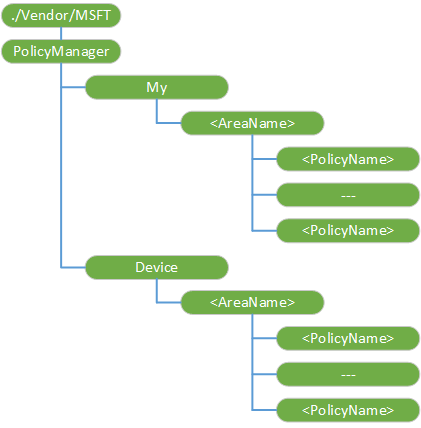

# <a name="policymanager-csp"></a>PolicyManager 的 CSP


PolicyManager 配置服务提供程序，使得企业能够配置 Windows 10 移动公司政策。

> **请注意**  为了向后兼容，PolicyManager CSP 支持 Windows 10 移动。 对于 Windows 10 设备应使用[策略的 CSP](policy-configuration-service-provider.md)，它取代 PolicyManager CSP。 您可以继续使用 Windows Phone 8.1 和 Windows Phone 8.1 GDR 设备 PolicyManager 的 CSP。 PolicyManager CSP，它将被否决在将来某个时候。

 

PolicyManager CSP 具有以下子类别︰

-   *'区域名'* – 处理来自服务器的策略配置请求。

-   *'区域名'* – 提供只读设备上强制实施的策略路径。

原子的命令必须用同一个*'区域名'*的配置策略。

下图显示树状格式由开放移动联盟 (OMA) 设备管理 (DM) 和 OMA 客户端资源调配使用 PolicyManager 配置服务提供程序。



下面的列表描述特征和参数。

<a href="" id="--vendor-msft-policymanager"></a>**./Vendor/MSFT/PolicyManager**  
PolicyManager 配置服务提供程序的根节点。

受支持的操作是获得。

<a href="" id="my"></a>**我**  
节点的特定提供程序可检索、 修改或删除的策略。

受支持的操作是获得。

<a href="" id="my--areaname-"></a>**我 / ***_&lt;' 区域名 '&gt;_**  
可以为单个提供程序配置的一种技术区域组。 一旦添加，无法更改的值。

支持的操作是 Get，添加和删除。

<a href="" id="my--areaname---policyname-"></a>**我 /_&lt;'区域名'&gt;_/****_&lt;PolicyName&gt; _**  
指定策略中使用的名称/值对。 下面的列表显示了一些提示，帮助您配置策略时︰

-   单独的名由 Unicode 值 &\#xF000;在 XML 文件中。

-   结束与 multistrings &\#xF000;例如，一个字符串 &\#xF000; 两个字符串 &\#xF000; 红色字符串 &\#xF000; 蓝色字符串 &\#xF000; &\#xF000;。 请注意每个调用方可能具有不同值的命名策略，从不同的调用方的查询可以提供不同的值。

-   在 Syncml，环绕此策略使其原子的命令，以便作为单个事务处理策略设置。

-   支持的操作是添加 Get，删除和替换。

-   值类型是字符串。

有关可能的区域和策略的名称，请参阅[支持公司政策](#bkmk-supportedpolicies)下。

<a href="" id="device"></a>**设备**  
组中所有可配置的提供程序的计算策略。 支持的操作是获得。

<a href="" id="device--areaname-"></a>**设备 / ***_&lt;' 区域名 '&gt;_**  
可以通过独立于提供商的一种技术来配置区域组。 受支持的操作是获得。

<a href="" id="device--areaname---policyname-"></a>**设备 /_&lt;'区域名'&gt;_/****_&lt;PolicyName&gt; _**  
指定策略中使用的名称/值对。 受支持的操作是获得。

## <a name="a-href-idbkmk-supportedpoliciesalist-of-ltareanamegtltpolicynamegt"></a><a href="" id="bkmk-supportedpolicies"></a>列出的*&lt;'区域名'&gt;*/*&lt;PolicyName&gt; *


<a href="" id="devicelock-devicepasswordenabled"></a>**DeviceLock/DevicePasswordEnabled**  
指定是否启用设备锁定。

下面的列表显示了受支持的值︰

-   0 （默认）-已启用

-   1-已禁用

> **重要**  
>为以下设置才会生效，DevicePasswordEnabled 设置必须设置为 0 （启用设备密码）︰
>
> -   AllowSimpleDevicePassword
> -   MinDevicePasswordLength
> -   AlphanumericDevicePasswordRequired
> -   MaxDevicePasswordFailedAttempts
> -   MaxInactivityTimeDeviceLock
> -   MinDevicePasswordComplexCharacters

 

通过 MDM 和 EAS 支持

EAS 策略名称-DevicePasswordEnabled

最小策略值是最受限制

<a href="" id="devicelock-allowsimpledevicepassword"></a>**DeviceLock/AllowSimpleDevicePassword**  
指定是否允许此类密码"1111"或"1234"。

下面的列表显示了受支持的值︰

-   0-不允许。

-   1 （缺省值）-允许。

通过 MDM 和 EAS 支持

EAS 策略名称-AllowSimpleDevicePassword

最小策略值是最受限制

<a href="" id="devicelock-mindevicepasswordlength"></a>**DeviceLock/MinDevicePasswordLength**  
指定的最小数量或针所需的字符。

下面的列表显示了受支持的值︰

-   一个整数 X 位置

    4 &lt;= X &lt;= 16.

-   0 不强制执行。

-   默认︰ 4。

通过 MDM 和 EAS 支持

EAS 策略名称-MinDevicePasswordLength

最大策略值是最受限制

<a href="" id="devicelock-alphanumericdevicepasswordrequired"></a>**DeviceLock/AlphanumericDevicePasswordRequired**  
确定密码所需的类型。 此策略仅 DevicedPasswordEnabled 策略被设置为 0 （必需的）。

下面的列表显示了受支持的值︰

-   0-所需的字母数字密码。

-   1-数字所需的密码。

-   2 （默认）-用户可以选择︰ 数字密码或字母数字密码。

通过 MDM 和 EAS 支持

EAS 策略名称-AlphanumericDevicePasswordRequired

最小策略值是最受限制

<a href="" id="devicelock-devicepasswordexpiration"></a>**DeviceLock/DevicePasswordExpiration**  
指定当密码到期 （以天为单位）。

下面的列表显示了受支持的值︰

-   一个整数 X 位置

    0 &lt;= X &lt;= 730.

-   0 （缺省值）-密码不过期。

通过 MDM 和 EAS 支持

EAS 策略名称-DevicePasswordExpiration

如果所有的策略值 = 0，则 0;否则，最小策略值是最安全的值

<a href="" id="devicelock-devicepasswordhistory"></a>**DeviceLock/DevicePasswordHistory**  
指定多少密码可以存储在历史记录中不能使用。

下面的列表显示了受支持的值︰

-   一个整数 X 位置

    0 &lt;= X &lt;=50.

-   默认值︰ 0

通过 MDM 和 EAS 支持

EAS 策略名称-DevicePasswordHistory

最大策略值是最受限制

<a href="" id="devicelock-maxdevicepasswordfailedattempts"></a>**DeviceLock/MaxDevicePasswordFailedAttempts**  
将擦除设备之前允许的身份验证失败的次数。 值为 0 将禁用设备擦除功能。

下面的列表显示了受支持的值︰

-   一个整数 X 位置

    0 &lt;= X &lt;= 999.

-   默认值︰ 0。 后输入了错误的密码永远不会擦除设备。

通过 MDM 和 EAS 支持

EAS 策略名称-MaxDevicePasswordFailedAttempts

如果所有的策略值 = 0，则 0;否则，最小策略值是最受限制的值。

<a href="" id="devicelock-maxinactivitytimedevicelock"></a>**DeviceLock/MaxInactivityTimeDeviceLock**  
指定的时间 （以分钟为单位） 设备处于空闲状态后，将导致设备无法锁定的密码。

下面的列表显示了受支持的值︰

-   一个整数 X 位置

    0 &lt;= X &lt;= 999.

-   0 （缺省值）-定义无超时。 默认值为"0"是芒果奇偶校验和的解释为"没有超时定义"。

通过 MDM 和 EAS 支持

EAS 策略名称-MaxInactivityTimeDeviceLock

最小策略值 （除外 '0') 是最受限制的值。

<a href="" id="devicelock-mindevicepasswordcomplexcharacters"></a>**DeviceLock/MinDevicePasswordComplexCharacters**  
强密码所需的复杂的元素类型 （大写和小写字母、 数字和标点符号） 的数量。

下面的列表显示了受支持的值︰

-   一个整数 X 位置

    1 &lt;= X &lt;= 4.

默认值为 1。

支持通过 MDM 和 EA。

EAS 策略名称-MinDevicePasswordComplexCharacters

最大策略值是最受限制

<a href="" id="devicelock-allowidlereturnwithoutpassword"></a>**DeviceLock/AllowIdleReturnWithoutPassword**  
强制用户输入密码每次从空闲状态的设备返回。

> **请注意** 此策略仅在 Windows 10 移动支持。

 

下面的列表显示了受支持的值︰

-   0-用户不能设置密码宽限期计时器，并将该值设置为"每个时间。

    1 （默认值） 的用户都可以设置密码宽限期计时器。

支持通过 MDM 和 EA。

最受限制的值为 0。

<a href="" id="wifi-allowwifi"></a>**WiFi/AllowWiFi**  
允许或禁止 Wi-fi 连接。 （可由-Exchange 配置定义将与 EAS 定义一致。）

> **请注意** 在 Windows 10 Mobile 只支持策略。

 

下面的列表显示了受支持的值︰

-   0-使用 Wi-fi 连接，则不允许。

-   1 （缺省值）--使用 Wi-Fi 会允许连接。

支持通过 MDM 和 EA。

EAS 策略名称-AllowWiFi

最受限制的值为 0。

<a href="" id="wifi-allowinternetsharing"></a>**WiFi/AllowInternetSharing**  
允许或不允许 internet 共享。

（可由-Exchange 配置定义将与 EAS 定义一致。）

下面的列表显示了受支持的值︰

-   0 – 不允许共享互联网的使用。

-   1 （缺省值）-允许共享互联网的使用。

支持通过 MDM 和 EA。

EAS 策略名称-AllowInternetSharing

最受限制的值为 0。

<a href="" id="wifi-allowautoconnecttowifisensehotspots"></a>**WiFi/AllowAutoConnectToWiFiSenseHotspots**  
允许或不允许自动连接到 Wi-fi 热点和朋友社交网络的设备。

下面的列表显示了受支持的值︰

-   0 – 不允许。

-   1 （缺省值）-允许。

最受限制的值为 0。

<a href="" id="wifi-allowwifihotspotreporting"></a>**WiFi/AllowWiFiHotSpotReporting**  
允许或不允许 Wi-Fi 热点信息报告给 Microsoft。 一旦允许，用户不能将其打开。

下面的列表显示了受支持的值︰

-   0 – 热点报告不是允许的。

-   1 （缺省值）-热点报告被允许。

最受限制的值为 0。

<a href="" id="wifi-allowmanualwificonfiguration"></a>**WiFi/AllowManualWiFiConfiguration**  
允许或不允许外部 MDM 服务器安装的网络连接到 Wi-fi。

> **请注意** 在 Windows 10 Mobile 只支持策略。

 

下面的列表显示了受支持的值︰

-   0 – 无 Wi-fi 会允许 MDM 调配网络外部连接。

-   1 （默认值） – 之外添加新网络 Ssid MDM 已经提供的允许。

最受限制的值为 0。

<a href="" id="connectivity-allownfc"></a>**连接性/AllowNFC**  
允许或不允许靠近域通信 (NFC) 在设备上。

> **请注意** 此策略仅在 Windows 10 移动支持。

 

下面的列表显示了受支持的值︰

-   0 – 不允许 NFC 功能。

-   1 （缺省值）-允许 NFC 功能。

最受限制的值为 0。

<a href="" id="connectivity-allowcellulardataroaming"></a>**连接性/AllowCellularDataRoaming**  
允许或不允许使用移动电话漫游在设备上的数据。

下面的列表显示了受支持的值︰

-   0 – 不允许。

-   1 （缺省值）-允许。

最受限制的值为 0。

<a href="" id="connectivity-allowusbconnection"></a>**连接性/AllowUSBConnection**  
使设备之间同步文件到计算机的 USB 连接设备或使用开发人员工具来部署或调试应用程序。 更改此策略不影响 USB 充电。

在实施此策略时禁用媒体传输协议 (MTP) 和 IP 通过 USB。

> **请注意** 此策略仅在 Windows 10 移动支持。

 

下面的列表显示了受支持的值︰

-   0-不允许。

-   1 （默认）-允许。

最受限制的值为 0。

<a href="" id="connectivity-allowvpnovercellular"></a>**连接性/AllowVPNOverCellular**  
此策略指定 VPN 可以使用哪种类型的基础连接。

下面的列表显示了受支持的值︰

-   0-在移动电话上不允许 VPN。

-   1 （缺省值）-VPN 可以使用包括蜂窝的任何连接。

最受限制的值为 0。

<a href="" id="connectivity-allowvpnroamingovercellular"></a>**连接性/AllowVPNRoamingOverCellular**  
这个策略，当强制，将阻止该设备连接 VPN 设备通过移动通信网络中漫游时。

下面的列表显示了受支持的值︰

-   0 – 不允许。

-   1 （默认）-允许。

最受限制的值为 0。

<a href="" id="connectivity-allowbluetooth"></a>**连接性/AllowBluetooth**  
允许用户启用 Bluetooth 或限制访问。

下面的列表显示了可能的值︰

-   0-禁用 Bluetooth。

-   1 – 不支持 Windows 10 移动在 MDM 和 EAS 禁用 Bluetooth，但允许无配置文件的配置。

-   2 （默认）-允许 Bluetooth。

支持通过 MDM 和 EA。

EAS 策略名称-AllowBluetooth

最受限制的值为 0。

<a href="" id="system-allowstoragecard"></a>**系统/AllowStorageCard**  
控制是否允许用户存储设备使用的存储卡。 此设置不会阻止到存储卡的编程访问，它只会阻止用户使用卡作为存储位置。

下面的列表显示了受支持的值︰

-   0 – 不允许使用 SD 卡。 这不以编程方式访问存储卡。

-   1 （缺省值）-允许存储卡。

EAS 策略名称-AllowStorageCard

最受限制的值为 0。

<a href="" id="system-allowlocation"></a>**系统/AllowLocation**  
指定是否允许位置服务。

下面的列表显示了受支持的值︰

-   0 – 不允许。

-   1 （缺省值）-允许。

最受限制的值为 0。

<a href="" id="system-allowtelemetry"></a>**系统/AllowTelemetry**  
允许设备发送遥测信息 （如软件质量管理 (SQM) 和 Watson）。

下面的列表显示了受支持的值︰

-   0 – 不允许。

-   1 – 允许，辅助数据的请求除外。

-   2 （默认）-允许。

最受限制的值为 0。

<a href="" id="system-allowusertoresetphone"></a>**系统/AllowUserToResetPhone**  
指定是否允许工厂用户重置电话使用控件面板和硬件组合。

> **请注意** 此策略仅在 Windows 10 移动支持。

 

下面的列表显示了可能的值︰

-   0-不允许。

-   允许重置出厂默认设置为 1 （默认值） 的。

最受限制的值为 0。

<a href="" id="experience-allowsaveasofofficefiles"></a>**体验/AllowSaveAsOfOfficeFiles**  
指定是否允许用户保存在设备上的文件为 office 文件。

> **请注意** 不支持和 Windows 10 中不建议使用此策略。

 

下面的列表显示了受支持的值︰

-   0 – 不允许。

-   1 （缺省值）-允许。

最受限制的值为 0。

<a href="" id="experience-allowcopypaste"></a>**体验/AllowCopyPaste**  
指定是否允许复制和粘贴。

> **请注意** 此策略仅在 Windows 10 移动支持。

 

下面的列表显示了受支持的值︰

-   0 – 不允许。

-   1 （缺省值）-允许。

最受限制的值为 0。

<a href="" id="experience-allowscreencapture"></a>**体验/AllowScreenCapture**  
指定是否允许屏幕抓图。

> **请注意** 此策略仅在 Windows 10 移动支持。

 

下面的列表显示了受支持的值︰

-   0 – 不允许。

-   1 （缺省值）-允许。

最受限制的值为 0。

<a href="" id="experience-allowvoicerecording"></a>**体验/AllowVoiceRecording**  
指定是否允许录音。

> **请注意** 此策略仅在 Windows 10 移动支持。

 

下面的列表显示了受支持的值︰

-   0 – 不允许。

-   1 （缺省值）-允许。

最受限制的值为 0。

<a href="" id="experience-allowcortana"></a>**体验/AllowCortana**  
指定是否允许 Cortana 设备上。

下面的列表显示了受支持的值︰

-   0 – 不允许。

-   1 （缺省值）-允许。

最受限制的值为 0。

<a href="" id="experience-allowsyncmysettings"></a>**体验/AllowSyncMySettings**  
允许企业将不允许 （在/从设备） 设备之间的漫游设置。 如果不强制执行，允许漫游可能取决于其他因素。

下面的列表显示了受支持的值︰

-   0 – 不允许漫游。

-   1 （缺省值）-企业不强制限制漫游。

最受限制的值为 0。

<a href="" id="-experience-allowmanualmdmunenrollment"></a>**体验/AllowManualMDMUnenrollment**  
指定是否允许用户删除工作区帐户使用工作区控制面板。 MDM 服务器始终可以删除该帐户。

-   0-不允许服务器。

-   1 – 允许。

最受限制的值为 0。

<a href="" id="-experience-allowsharingofofficefiles"></a>**体验/AllowSharingOfOfficeFiles**  
指定是否允许用户共享 Office 文件。

下面的列表显示了受支持的值︰

> **请注意** 在 Windows 10 中不支持此策略。

 

-   0 – 不允许。

-   1 （缺省值）-允许。

最受限制的值为 0。

<a href="" id="accounts-allowmicrosoftaccountconnection"></a>**帐户/AllowMicrosoftAccountConnection**  
指定是否允许用户以 MSA 帐户用于非电子邮件相关的连接身份验证和服务。

下面的列表显示了受支持的值︰

-   0 – 不允许。

-   1 （缺省值）-允许。

最受限制的值为 0。

<a href="" id="accounts-allowaddingnonmicrosoftaccountsmanually"></a>**帐户/AllowAddingNonMicrosoftAccountsManually**  
指定是否允许用户添加非 MSA 的电子邮件帐户。

下面的列表显示了受支持的值︰

-   0 – 不允许。

-   1 （缺省值）-允许。

最受限制的值为 0。

<a href="" id="security-allowmanualrootcertificateinstallation"></a>**安全/AllowManualRootCertificateInstallation**  
指定是否允许用户手动安装根目录和中间帽证书。

> **请注意** 此策略仅在 Windows 10 移动支持。

 

下面的列表显示了受支持的值︰

-   0 – 不允许。

-   1 （缺省值）-允许。

最受限制的值为 0。

<a href="" id="security-requiredeviceencryption"></a>**安全/RequireDeviceEncryption**  
允许启用内部存储加密的企业。 请注意，一旦打开，就不能关闭通过策略。

下面的列表显示了受支持的值︰

-   0 （默认）-加密不是必需的。

-   1 – 加密是必需的。

支持通过 MDM 和 EA。

EAS 策略名称-RequireDeviceEncryption

最受限制的值为 1。

<a href="" id="browser-allowbrowser"></a>**浏览器/AllowBrowser**  
指定是否允许 Internet Explorer 中的设备。

> **请注意** 此策略中的只支持 Windows 10 移动。

 

下面的列表显示了受支持的值︰

-   0 – 不允许。

-   1 （缺省值）-允许。

支持通过 MDM 和 EA。

EAS 策略名称-AllowBrowser

最受限制的值为 0。

<a href="" id="camera-allowcamera"></a>**照相机/AllowCamera**  
禁用或启用照相机。

下面的列表显示了受支持的值︰

-   0-使用摄像头是不允许的。

-   1 （缺省值）-允许使用摄像头。

最受限制的值为 0。

<a href="" id="applicationmanagement-allowstore"></a>**ApplicationManagement/AllowStore**  
指定是否允许应用程序存储在设备上。

> **请注意** 此策略仅在 Windows 10 移动支持。

 

下面的列表显示了受支持的值︰

-   0 – 不允许。

-   1 （缺省值）-允许。

最受限制的值为 0。

<a href="" id="applicationmanagement-applicationrestrictions"></a>**ApplicationManagement/ApplicationRestrictions**  
指定应用程序限制公司的 XML blob 想要放置到该设备。 它可以是应用程序允许列表中，应用程序不允许列表中，允许发布者 Id 等。不可能立即终止正在运行的应用程序。

> **请注意** 此策略仅在 Windows 10 移动支持。

 

> **请注意** 已知问题列表︰
-   在 Windows Phone 8.1 设备到 Windows 10 手机升级允许应用程序的列表时，某些窗口收件箱的应用程序被阻止导致意外的行为。 要变通解决此问题，必须包括[收件箱的应用程序](applocker-csp.md#inboxappsandcomponents)所需的允许的应用程序列表。

    下面是升级过程的附加指南︰

    -   在[收件箱的应用程序](applocker-csp.md#inboxappsandcomponents)中列出的应用程序使用 Windows 10 产品 Id。
    -   使用新的 Microsoft 发布服务器名称 (PublisherName ="CN = Microsoft Corporation，O = Microsoft Corporation，L = 雷蒙德，S = 华盛顿，C = 美国") 和出版商 ="CN = Microsoft Windows 中，O = Microsoft Corporation，L = 雷蒙德，S = 华盛顿，C = 美国"如果使用发行者策略。 如果您正在使用它，则不删除 Windows Phone 8.1 发布服务器。
    -   在 SyncML，必须使用小写的产品 id。
    -   不复制产品 id。 消息和 Skype 视频使用相同的产品 id。 重复值会导致错误。

    SyncML 的示例，请参阅[示例](#examples)。

-   不能禁用或启用**与客户支持联系**和**Windows 反馈**应用程序使用 ApplicationManagement/ApplicationRestrictions 策略，尽管这些在[收件箱的应用程序](applocker-csp.md#inboxappsandcomponents)中列出。
-   当 ApplicationManagement/ApplicationRestrictions 策略部署到 Windows 10 手机时，安装和更新的应用程序相关的 Microsoft 框架可能被阻止出现错误 0x80073CF9 中。 要变通解决此问题，必须到允许的应用程序列表包括 Microsoft 框架 Id。

    ``` syntax
    <App ProductId="{00000000-0000-0000-0000-000000000000}" PublisherName="CN=Microsoft Corporation, O=Microsoft Corporation, L=Redmond, S=Washington, C=US" />
    ```

 

值类型是 chr。

值计算规则-PolicyManager 的信息是不透明的。 没有任何最受限制的价值评估。 每当值更改时，该设备将节点值分析，实施指定的策略。

<a href="" id="applicationmanagement-allowdeveloperunlock"></a>**ApplicationManagement/AllowDeveloperUnlock**  
指定开发人员是否解锁允许在设备上。

下面的列表显示了受支持的值︰

-   0 – 不允许。

-   1 （缺省值）-允许。

最受限制的值为 0。

<a href="" id="search-allowsearchtouselocation"></a>**搜索/AllowSearchToUseLocation**  
指定搜索是否可以利用位置信息。

下面的列表显示了受支持的值︰

-   0 – 不允许。

-   1 （缺省值）-允许。

最受限制的值为 0。

<a href="" id="search-safesearchpermissions"></a>**搜索/SafeSearchPermissions**  
指定需要哪一级别的安全搜索 （筛选成人内容）。

> **请注意** 此策略仅在 Windows 10 移动支持。

 

下面的列表显示了受支持的值︰

-   0 – 严格、 高筛选针对成人的内容。

-   1 （缺省值）-中等筛选针对成人内容 （不过滤有效的搜索结果。

最受限制的值为 0。

<a href="" id="search-allowstoringimagesfromvisionsearch"></a>**搜索/AllowStoringImagesFromVisionSearch**  
指定是否允许 Bing 远景来存储执行远景 Bing 搜索时捕获的图像中的内容。

> **请注意** 在 Windows 10 中不支持此策略。

 

下面的列表显示了受支持的值︰

-   0 – 不允许。

-   1 （缺省值）-允许。

最受限制的值为 0。

<a href="" id="abovelock-allowactioncenternotifications"></a>**AboveLock/AllowActionCenterNotifications**  
指定是否允许设备锁定屏幕上方的操作中心通知。

> **请注意** 此策略仅在 Windows 10 移动支持。

 

下面的列表显示了受支持的值︰

-   0 – 不允许。

-   1 （缺省值）-允许。

最受限制的值为 0。

## <a name="examples"></a>示例


下面是示例 ApplicationRestrictions 的 SyncML 将添加在[收件箱的应用程序](applocker-csp.md#inboxappsandcomponents)中列出的所有收件箱应用程序。

``` syntax
<SyncML>
  <SyncBody>
    <Atomic>
      <CmdID>144-0</CmdID>
      <Replace>
        <CmdID>144-1</CmdID>
        <Item>
          <Target>
            <LocURI>./Vendor/MSFT/PolicyManager/My/ApplicationManagement/ApplicationRestrictions</LocURI>
          </Target>
          <Meta>
            <Format xmlns="syncml:metinf">chr</Format>
            <Type xmlns="syncml:metinf">text/plain</Type>
          </Meta>
          <Data>
&lt;AppPolicy Version=&quot;1&quot; xmlns=&quot;http://schemas.microsoft.com/phone/2013/policy&quot;&gt;
&lt;Allow&gt;

            &lt;!-- Alarms and clock --&gt;
            &lt;App ProductId=&quot;{44f7d2b4-553d-4bec-a8b7-634ce897ed5f}&quot; /&gt;
            &lt;!--Calculator --&gt;
            &lt;App ProductId=&quot;{b58171c6-c70c-4266-a2e8-8f9c994f4456}&quot; /&gt;
            &lt;!--Camera --&gt;
            &lt;App ProductId=&quot;{f0d8fefd-31cd-43a1-a45a-d0276db069f1}&quot; /&gt;
           
            &lt;App ProductId=&quot;{0db5fcff-4544-458a-b320-e352dfd9ca2b}&quot; /&gt;
            &lt;!--Cortana --&gt;
            &lt;App ProductId=&quot;{fd68dcf4-166f-4c55-a4ca-348020f71b94}&quot; /&gt;
            &lt;!--Excel --&gt;
            &lt;App ProductId=&quot;{ead3e7c0-fae6-4603-8699-6a448138f4dc}&quot; /&gt;
            &lt;!--Facebook --&gt;
            &lt;App ProductId=&quot;{82a23635-5bd9-df11-a844-00237de2db9e}&quot; /&gt;
            &lt;!--File Explorer --&gt;
            &lt;App ProductId=&quot;{c5e2524a-ea46-4f67-841f-6a9465d9d515}&quot; /&gt;
            &lt;!--FM Radio --&gt;
            &lt;App ProductId=&quot;{f725010e-455d-4c09-ac48-bcdef0d4b626}&quot; /&gt;
            &lt;!--Get Started --&gt;
            &lt;App ProductId=&quot;{b3726308-3d74-4a14-a84c-867c8c735c3c}&quot; /&gt;
            &lt;!--Groove Music --&gt;
            &lt;App ProductId=&quot;{d2b6a184-da39-4c9a-9e0a-8b589b03dec0}&quot; /&gt;
            &lt;!--Maps --&gt;
            &lt;App ProductId=&quot;{ed27a07e-af57-416b-bc0c-2596b622ef7d}&quot; /&gt;

            &lt;!--Messaging --&gt;
            &lt;App ProductId=&quot;{27e26f40-e031-48a6-b130-d1f20388991a}&quot; /&gt;
            &lt;!--Microsoft Edge --&gt;
            &lt;App ProductId=&quot;{395589fb-5884-4709-b9df-f7d558663ffd}&quot; /&gt;
            &lt;!--Money --&gt;
            &lt;App ProductId=&quot;{1e0440f1-7abf-4b9a-863d-177970eefb5e}&quot; /&gt;
            &lt;!--Movies and TV --&gt;
            &lt;App ProductId=&quot;{6affe59e-0467-4701-851f-7ac026e21665}&quot; /&gt;
            &lt;!--News --&gt;
            &lt;App ProductId=&quot;{9c3e8cad-6702-4842-8f61-b8b33cc9caf1}&quot; /&gt;
            &lt;!--OneDrive --&gt;
            &lt;App ProductId=&quot;{ad543082-80ec-45bb-aa02-ffe7f4182ba8}&quot; /&gt;
            &lt;!--OneNote --&gt;
            &lt;App ProductId=&quot;{ca05b3ab-f157-450c-8c49-a1f127f5e71d}&quot; /&gt;
            &lt;!--Outlook Mail Calendar --&gt;
            &lt;App ProductId=&quot;{a558feba-85d7-4665-b5d8-a2ff9c19799b}&quot; /&gt;
            &lt;!--People --&gt;
            &lt;App ProductId=&quot;{60be1fb8-3291-4b21-bd39-2221ab166481}&quot; /&gt;
            &lt;!--Phone (dialer) --&gt;
            &lt;App ProductId=&quot;{f41b5d0e-ee94-4f47-9cfe-3d3934c5a2c7}&quot; /&gt;
            &lt;!--Photos --&gt;
            &lt;App ProductId=&quot;{fca55e1b-b9a4-4289-882f-084ef4145005}&quot; /&gt;
            
            &lt;!--Podcasts --&gt;
            &lt;App ProductId=&quot;{c3215724-b279-4206-8c3e-61d1a9d63ed3}&quot; /&gt;
            &lt;!--Powerpoint --&gt;
            &lt;App ProductId=&quot;{b50483c4-8046-4e1b-81ba-590b24935798}&quot; /&gt;
            &lt;!--Settings --&gt;
            &lt;App ProductId=&quot;{2a4e62d8-8809-4787-89f8-69d0f01654fb}&quot; /&gt;
            &lt;!--Skype --&gt;
            &lt;App ProductId=&quot;{c3f8e570-68b3-4d6a-bdbb-c0a3f4360a51}&quot; /&gt;
            &lt;!--Skype Video GUID is same as Messaging --&gt;
            &lt;!--Sports --&gt;
            &lt;App ProductId=&quot;{0f4c8c7e-7114-4e1e-a84c-50664db13b17}&quot; /&gt;
            &lt;!--Storage --&gt;
            &lt;App ProductId=&quot;{5b04b775-356b-4aa0-aaf8-6491ffea564d}&quot; /&gt;
            &lt;!--Store --&gt;
            &lt;App ProductId=&quot;{7d47d89a-7900-47c5-93f2-46eb6d94c159}&quot; /&gt;

            &lt;!--Voice recorder --&gt;
            &lt;App ProductId=&quot;{7311b9c5-a4e9-4c74-bc3c-55b06ba95ad0}&quot; /&gt;
            &lt;!--Wallet --&gt;
            &lt;App ProductId=&quot;{587a4577-7868-4745-a29e-f996203f1462}&quot; /&gt;
            &lt;!--Weather --&gt;
            &lt;App ProductId=&quot;{63c2a117-8604-44e7-8cef-df10be3a57c8}&quot; /&gt;
         
            &lt;App ProductId=&quot;{7604089d-d13f-4a2d-9998-33fc02b63ce3}&quot; /&gt;
            &lt;!--Word --&gt;
            &lt;App ProductId=&quot;{258f115c-48f4-4adb-9a68-1387e634459b}&quot; /&gt;
            &lt;!--Xbox --&gt;
            &lt;App ProductId=&quot;{b806836f-eebe-41c9-8669-19e243b81b83}&quot; /&gt;

            &lt;!-- CloudExperienceHost --&gt;
            &lt;App ProductId=&quot;{3a4fae89-7b7e-44b4-867b-f7e2772b8253}&quot; /&gt;
            &lt;!-- AAD BrokerPlugin --&gt;
            &lt;App ProductId=&quot;{e5f8b2c4-75ae-45ee-9be8-212e34f77747}&quot; /&gt;
            &lt;!-- Ringtone --&gt;
            &lt;App ProductId=&quot;{3e962450-486b-406b-abb5-d38b4ee7e6fe}&quot; /&gt;
            &lt;!-- Advanced Info --&gt;
            &lt;App ProductId=&quot;{b6e3e590-9fa5-40c0-86ac-ef475de98e88}&quot; /&gt;
            &lt;!-- Glance --&gt;
            &lt;App ProductId=&quot;{106e0a97-8b19-42cf-8879-a8ed2598fcbb}&quot; /&gt;
            &lt;!-- Connect --&gt;
            &lt;App ProductId=&quot;{af7d2801-56c0-4eb1-824b-dd91cdf7ece5}&quot; /&gt;
            &lt;!-- Miracast View --&gt;
            &lt;App ProductId=&quot;{906beeda-b7e6-4ddc-ba8d-ad5031223ef9}&quot; /&gt;
            &lt;!-- PrintDialog --&gt;
            &lt;App ProductId=&quot;{0d32eeb1-32f0-40da-8558-cea6fcbec4a4}&quot; /&gt;

            &lt;!-- Music downloads--&gt;
            &lt;App ProductId=&quot;{3da8a0c1-f7e5-47c0-a680-be8fd013f747}&quot; /&gt;
            &lt;!-- App downloads--&gt;
            &lt;App ProductId=&quot;{20bf77a0-19c7-4daa-8db5-bc3dfdfa44ac}&quot; /&gt;
            &lt;!-- Podcast downloads--&gt;
            &lt;App ProductId=&quot;{063773e7-f26f-4a92-81f0-aa71a1161e30}&quot; /&gt;
            &lt;!-- Email and accounts--&gt;
            &lt;App ProductId=&quot;{39cf127b-8c67-c149-539a-c02271d07060}&quot; /&gt;
            &lt;!-- Assigned Access Lock app--&gt;
            &lt;App ProductId=&quot;{b84f4722-313e-4f85-8f41-cf5417c9c5cb}&quot; /&gt;
            &lt;!-- Windows Hello Setup--&gt;
            &lt;App ProductId=&quot;{01293c37-72ec-3c8b-0eb3-1de4f7d0cdc4}&quot; /&gt;
            &lt;!-- Purchase Dialog--&gt;
            &lt;App ProductId=&quot;{c60e79ca-063b-4e5d-9177-1309357b2c3f}&quot; /&gt;
            &lt;!-- Xbox Identity Provider--&gt;
            &lt;App ProductId=&quot;{ba88225b-059a-45a2-a8eb-d3580283e49d}&quot; /&gt;
            &lt;!-- Block and Filter--&gt;
            &lt;App ProductId=&quot;{59553c14-5701-49a2-9909-264d034deb3d}&quot; /&gt;
            &lt;!-- Sharing--&gt;
            &lt;App ProductId=&quot;{b0894dfd-4671-4bb9-bc17-a8b39947ffb6}&quot; /&gt;
            &lt;!-- Setup wizard--&gt;
            &lt;App ProductId=&quot;{07d87655-e4f0-474b-895a-773790ad4a32}&quot; /&gt;
            &lt;!-- Phone Reset Dialog--&gt;
            &lt;App ProductId=&quot;{2864278d-09b5-46f7-b502-1c24139ecbdd}&quot; /&gt;
            &lt;!-- SaveRingtone--&gt;
            &lt;App ProductId=&quot;{d8cf8ec7-ec6d-4892-aab9-1e3a4b5fa24b}&quot; /&gt;
            &lt;!-- HAP Update Background Worker--&gt;
            &lt;App ProductId=&quot;{73c73cdd-4dea-462c-bd83-fa983056a4ef}&quot; /&gt;
            &lt;!-- Windows Default Lock Screen--&gt;
            &lt;App ProductId=&quot;{cdd63e31-9307-4ccb-ab62-1ffa5721b503}&quot; /&gt;
            &lt;!-- navigation bar--&gt;
            &lt;App ProductId=&quot;{2cd23676-8f68-4d07-8dd2-e693d4b01279}&quot; /&gt;
            &lt;!-- SSMHost--&gt;
            &lt;App ProductId=&quot;{e232aa77-2b6d-442c-b0c3-f3bb9788af2a}&quot; /&gt;
            &lt;!-- Bing lock images--&gt;
            &lt;App ProductId=&quot;{5f28c179-2780-41df-b966-27807b8de02c}&quot; /&gt;
            &lt;!-- CertInstaller--&gt;
            &lt;App ProductId=&quot;{4c4ad968-7100-49de-8cd1-402e198d869e}&quot; /&gt;
            &lt;!-- Age Out Worker--&gt;
            &lt;App ProductId=&quot;{09296e27-c9f3-4ab9-aa76-ecc4497d94bb}&quot; /&gt;
            &lt;!-- EnterpriseInstall App--&gt;
            &lt;App ProductId=&quot;{da52fa01-ac0f-479d-957f-bfe4595941cb}&quot; /&gt;
            &lt;!-- Hands-Free Activation--&gt;
            &lt;App ProductId=&quot;{df6c9621-e873-4e86-bb56-93e9f21b1d6f}&quot; /&gt;
            &lt;!-- Hands-Free Activation--&gt;
            &lt;App ProductId=&quot;{72803bd5-4f36-41a4-a349-e83e027c4722}&quot; /&gt;


            &lt;!--Field Medic --&gt;
            &lt;App ProductId=&quot;{73c58570-d5a7-46f8-b1b2-2a90024fc29c}&quot; /&gt;
            &lt;!--Windows Insider --&gt;
            &lt;App ProductId=&quot;{ed2b1421-6414-4544-bd8d-06d58ee402a5}&quot; /&gt;

            &lt;!-- Microsoft Frameworks --&gt;
            &lt;App ProductId=&quot;{00000000-0000-0000-0000-000000000000}&quot; PublisherName=&quot;CN=Microsoft Corporation, O=Microsoft Corporation, L=Redmond, S=Washington, C=US&quot; /&gt;

            &lt;/Allow&gt;
&lt;/AppPolicy&gt;

          </Data>
        </Item>
      </Replace>
    </Atomic>
    <Final />
  </SyncBody>
</SyncML>
```

## <a name="related-topics"></a>相关的主题


[配置服务提供程序的引用](configuration-service-provider-reference.md)

 

 


